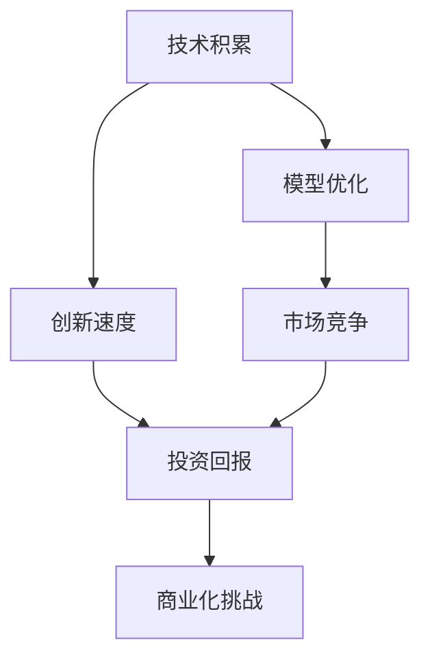
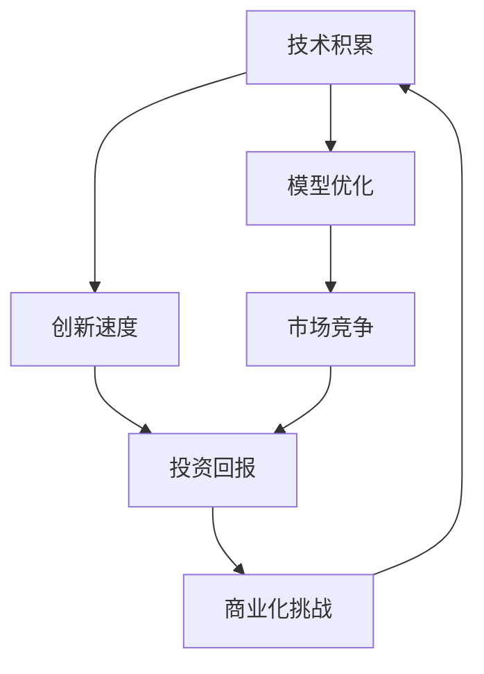

                 

# 技术与市场:大模型企业的两难选择

> 关键词：大模型,技术积累,市场竞争,创新策略,商业化挑战

## 1. 背景介绍

### 1.1 问题由来
在人工智能领域，大模型（Large Models）的崛起已经成为不可逆转的趋势。这些模型以其庞大的参数量和出色的表现，在自然语言处理（NLP）、计算机视觉（CV）等多个领域展现出强大的能力。大模型的发展离不开技术的积累和市场的推动。然而，技术与市场的二元对立在一定程度上也给企业带来了两难的抉择。本文旨在探讨大模型企业在技术积累与市场竞争中如何平衡，寻找最佳的创新策略与商业化路径。

### 1.2 问题核心关键点
大模型企业在技术与市场之间的两难选择主要体现在以下几个方面：

1. **技术积累与市场竞争**：
   - 在技术积累阶段，企业需要大量投入资源进行模型训练、优化和调优，才能达到行业领先水平。
   - 但市场竞争要求企业快速推出产品，获取市场份额，这需要快速迭代和适应用户需求。

2. **模型优化与创新速度**：
   - 大模型的优化需要大量的数据和计算资源，这可能导致企业创新速度放缓。
   - 同时，市场变化迅速，企业需要不断创新以适应新的需求和挑战。

3. **商业化挑战与投资回报**：
   - 大模型的商业化过程中，企业面临高昂的研发成本和不确定的投资回报。
   - 如何确保商业化策略与技术积累相匹配，实现持续盈利，是企业必须解决的问题。

### 1.3 问题研究意义
大模型企业在技术积累与市场竞争之间的平衡，直接关系到企业的长期发展与竞争能力。如果处理得当，企业可以充分利用技术的优势，快速占据市场，实现商业成功。相反，如果处理不当，可能会导致资源浪费和市场竞争力下降。因此，本文旨在为读者提供深入的技术与市场平衡视角，帮助企业在激烈的竞争环境中取得成功。

## 2. 核心概念与联系

### 2.1 核心概念概述

为了更好地理解大模型企业在技术与市场之间平衡的核心概念，本节将介绍几个密切相关的核心概念：

- **技术积累（Technology Accumulation）**：指企业在开发和优化大模型的过程中，持续投入研发资源，积累技术知识，提升模型性能。
- **市场竞争（Market Competition）**：指企业在市场上与竞争对手争夺用户和市场份额，通过产品创新和市场推广实现商业成功。
- **模型优化（Model Optimization）**：指对大模型进行参数调整、结构优化和算法改进，提升模型的精度和效率。
- **创新速度（Innovation Speed）**：指企业在产品迭代和模型优化上的速度，能否迅速响应市场变化和用户需求。
- **商业化挑战（Commercialization Challenges）**：指将大模型技术转化为商业产品的过程中，面临的成本、资源和市场接受度等挑战。
- **投资回报（Return on Investment, ROI）**：指企业通过大模型商业化获得的收益与投入成本之间的比率。

这些核心概念之间存在着紧密的联系，形成了大模型企业创新与商业化的完整生态系统。下面我们通过一个Mermaid流程图来展示这些概念之间的关系：



这个流程图展示了技术积累、模型优化、创新速度、市场竞争、投资回报和商业化挑战之间的关系：

1. 技术积累是模型优化的基础，模型优化提升创新速度。
2. 创新速度加快市场竞争，市场竞争结果直接影响投资回报。
3. 投资回报不足可能会影响商业化挑战，进而阻碍技术积累和创新速度。

### 2.2 概念间的关系

这些核心概念之间存在着复杂的相互作用，形成了大模型企业创新与商业化的动态平衡过程。以下我们将进一步探讨这些概念之间的关系。

#### 2.2.1 技术积累与市场竞争的关系

技术积累是市场竞争的基础，没有技术积累，市场竞争将缺乏核心竞争力。但过度的技术积累可能导致创新速度放缓，无法快速响应市场变化。因此，企业需要在技术积累和市场竞争之间找到平衡点。

#### 2.2.2 模型优化与创新速度的关系

模型优化是提升模型性能的关键，但优化过程需要大量资源和计算时间。如果模型优化过于频繁，可能会导致企业无法快速迭代，影响创新速度。相反，如果模型优化停滞，企业将无法跟上市场和技术的发展。

#### 2.2.3 投资回报与商业化挑战的关系

投资回报是衡量企业商业化成功与否的关键指标。如果投资回报不足，企业可能面临商业化挑战，如成本过高、市场接受度低等。这些挑战反过来会影响企业的技术积累和市场竞争能力。

### 2.3 核心概念的整体架构

最后，我们用一个综合的流程图来展示这些核心概念在大模型企业中的整体架构：



这个综合流程图展示了从技术积累到商业化挑战的全过程。企业通过技术积累和模型优化，提升创新速度，并在市场竞争中占据优势。但市场竞争的结果反过来也会影响投资回报，进而影响企业的商业化挑战和技术积累。这种循环过程体现了大模型企业在技术与市场之间的动态平衡。

## 3. 核心算法原理 & 具体操作步骤
### 3.1 算法原理概述

大模型企业在技术与市场之间平衡的核心算法原理，可以简单概括为：

1. **技术驱动市场**：通过持续的技术积累和模型优化，提高企业的核心竞争力，推动市场竞争。
2. **市场反哺技术**：通过市场竞争获取的反馈，指导技术方向和优化，提升投资回报。

这一原理的核心在于，企业需要确保技术积累和市场竞争之间的良性循环，避免单一导向导致的资源浪费和竞争力下降。

### 3.2 算法步骤详解

以下是大模型企业在技术与市场之间平衡的具体操作步骤：

1. **技术积累阶段**：
   - 投入大量资源进行模型训练、调优和优化，积累技术知识。
   - 定期发布技术论文、开源代码和实验结果，提升技术透明度。
   - 参与行业会议和标准制定，增强技术影响力。

2. **模型优化阶段**：
   - 定期评估模型性能，识别瓶颈和优化点。
   - 采用最新的算法和架构，提升模型精度和效率。
   - 引入新数据源和优化方法，扩展模型应用场景。

3. **市场竞争阶段**：
   - 基于技术积累推出新产品和服务，快速占领市场。
   - 持续收集用户反馈，迭代优化产品功能。
   - 进行市场推广和品牌建设，提升品牌认知度。

4. **投资回报阶段**：
   - 分析商业化效果，评估投资回报。
   - 根据投资回报调整技术投入和市场策略。
   - 引入资本和外部合作，扩大商业模式和市场范围。

### 3.3 算法优缺点

大模型企业在技术与市场之间平衡的算法具有以下优点和缺点：

**优点**：
- 提升企业核心竞争力：通过技术积累和模型优化，提高产品性能和市场竞争力。
- 快速响应市场变化：技术积累和市场竞争相辅相成，能够灵活适应市场变化。
- 增强用户粘性：高质量的模型和技术产品，能够提升用户体验和用户粘性。

**缺点**：
- 研发投入高：技术积累和模型优化需要大量资源和时间投入，可能导致财务压力。
- 创新速度慢：优化过程和技术积累可能导致产品迭代速度放缓，难以快速响应市场。
- 市场风险高：过度依赖市场竞争可能导致企业策略失误，影响投资回报。

### 3.4 算法应用领域

大模型企业在技术与市场之间平衡的算法，广泛应用于以下几个领域：

1. **NLP和CV领域**：
   - 利用大模型进行文本分析和图像识别，提供高质量的NLP和CV服务。
   - 通过持续优化提升模型性能，保持市场竞争力。

2. **智能硬件和物联网**：
   - 将大模型技术集成到智能硬件中，提升设备智能化水平。
   - 通过市场推广和用户体验反馈，优化技术实现。

3. **企业服务和B2B市场**：
   - 为企业客户提供定制化的NLP和CV解决方案。
   - 通过市场反馈和技术优化，不断提升服务质量。

4. **健康医疗和金融领域**：
   - 利用大模型进行疾病预测和金融风险分析。
   - 结合实际应用场景，优化模型性能和用户体验。

以上领域的应用，展示了大模型企业在技术与市场之间平衡的广泛潜力。通过技术的不断积累和优化，企业能够在不同领域实现商业成功。

## 4. 数学模型和公式 & 详细讲解  
### 4.1 数学模型构建

我们以大模型的商业化路径为示例，构建一个数学模型来描述技术积累、市场竞争和投资回报之间的关系。

设企业初始技术积累为 $T_0$，市场竞争能力为 $C_0$，投资回报率为 $R_0$。在时间 $t$ 时刻，技术积累、市场竞争和投资回报的关系可以用以下模型表示：

$$
T_t = T_0 + f_1(t) \cdot (C_t - C_0)
$$
$$
C_t = C_0 + f_2(t) \cdot (R_t - R_0)
$$
$$
R_t = R_0 + f_3(t) \cdot (T_t - T_0)
$$

其中：
- $T_t$ 表示时间 $t$ 时刻的技术积累。
- $C_t$ 表示时间 $t$ 时刻的市场竞争能力。
- $R_t$ 表示时间 $t$ 时刻的投资回报率。
- $f_1(t)$、$f_2(t)$、$f_3(t)$ 分别为技术积累、市场竞争和投资回报的函数，描述了在时间 $t$ 时刻的变化率。

### 4.2 公式推导过程

1. **技术积累函数 $f_1(t)$**：
   假设技术积累随时间呈线性增长，技术积累的变化率与市场竞争能力成正比，则：

   $$
   f_1(t) = k_1 \cdot C_t
   $$

2. **市场竞争函数 $f_2(t)$**：
   假设市场竞争能力随时间呈线性增长，市场竞争能力的变化率与投资回报成正比，则：

   $$
   f_2(t) = k_2 \cdot R_t
   $$

3. **投资回报函数 $f_3(t)$**：
   假设投资回报随时间呈线性增长，投资回报的变化率与技术积累成正比，则：

   $$
   f_3(t) = k_3 \cdot T_t
   $$

将上述函数代入原始模型中，我们得到：

$$
T_t = T_0 + k_1 \cdot C_t \cdot (C_t - C_0)
$$
$$
C_t = C_0 + k_2 \cdot R_t \cdot (R_t - R_0)
$$
$$
R_t = R_0 + k_3 \cdot T_t \cdot (T_t - T_0)
$$

### 4.3 案例分析与讲解

以NLP领域的企业为例，我们可以进一步分析模型的应用。

假设某企业在初始时刻的技术积累为 $T_0$，市场竞争能力为 $C_0$，投资回报率为 $R_0$。在时间 $t$ 时刻，企业进行模型优化和市场推广，技术积累增加 $k_1 \cdot C_t$，市场竞争能力增加 $k_2 \cdot R_t$，投资回报率增加 $k_3 \cdot T_t$。

**案例分析**：

1. **技术积累函数**：假设 $k_1 = 0.2$，则技术积累的变化率为市场竞争能力的0.2倍。如果市场竞争能力为0.8，则技术积累的变化率为0.16。
2. **市场竞争函数**：假设 $k_2 = 0.1$，则市场竞争能力的变化率为投资回报率的0.1倍。如果投资回报率为1.2，则市场竞争能力的变化率为0.12。
3. **投资回报函数**：假设 $k_3 = 0.5$，则投资回报率的变化率为技术积累的0.5倍。如果技术积累增加0.2，则投资回报率的变化率为0.1。

通过上述案例分析，我们可以看到，技术积累、市场竞争和投资回报之间存在复杂的动态关系。企业需要在不同时间点进行策略调整，确保三者之间的良性循环。

## 5. 项目实践：代码实例和详细解释说明
### 5.1 开发环境搭建

在进行大模型商业化实践前，我们需要准备好开发环境。以下是使用Python进行PyTorch开发的环境配置流程：

1. 安装Anaconda：从官网下载并安装Anaconda，用于创建独立的Python环境。

2. 创建并激活虚拟环境：
```bash
conda create -n pytorch-env python=3.8 
conda activate pytorch-env
```

3. 安装PyTorch：根据CUDA版本，从官网获取对应的安装命令。例如：
```bash
conda install pytorch torchvision torchaudio cudatoolkit=11.1 -c pytorch -c conda-forge
```

4. 安装Transformers库：
```bash
pip install transformers
```

5. 安装各类工具包：
```bash
pip install numpy pandas scikit-learn matplotlib tqdm jupyter notebook ipython
```

完成上述步骤后，即可在`pytorch-env`环境中开始商业化实践。

### 5.2 源代码详细实现

下面我们以大模型的商业化实践为例，给出使用Transformers库进行商业化的PyTorch代码实现。

```python
from transformers import BertForTokenClassification, AdamW

model = BertForTokenClassification.from_pretrained('bert-base-cased', num_labels=len(tag2id))

optimizer = AdamW(model.parameters(), lr=2e-5)

# 训练集和验证集数据
train_dataset = ...
dev_dataset = ...

# 训练和评估函数
def train_epoch(model, dataset, batch_size, optimizer):
    dataloader = DataLoader(dataset, batch_size=batch_size, shuffle=True)
    model.train()
    epoch_loss = 0
    for batch in dataloader:
        input_ids = batch['input_ids'].to(device)
        attention_mask = batch['attention_mask'].to(device)
        labels = batch['labels'].to(device)
        model.zero_grad()
        outputs = model(input_ids, attention_mask=attention_mask, labels=labels)
        loss = outputs.loss
        epoch_loss += loss.item()
        loss.backward()
        optimizer.step()
    return epoch_loss / len(dataloader)

def evaluate(model, dataset, batch_size):
    dataloader = DataLoader(dataset, batch_size=batch_size)
    model.eval()
    preds, labels = [], []
    with torch.no_grad():
        for batch in dataloader:
            input_ids = batch['input_ids'].to(device)
            attention_mask = batch['attention_mask'].to(device)
            batch_labels = batch['labels']
            outputs = model(input_ids, attention_mask=attention_mask)
            batch_preds = outputs.logits.argmax(dim=2).to('cpu').tolist()
            batch_labels = batch_labels.to('cpu').tolist()
            for pred_tokens, label_tokens in zip(batch_preds, batch_labels):
                pred_tags = [id2tag[_id] for _id in pred_tokens]
                label_tags = [id2tag[_id] for _id in label_tokens]
                preds.append(pred_tags[:len(label_tokens)])
                labels.append(label_tags)

    print(classification_report(labels, preds))
```

通过上述代码，我们展示了使用Transformers库进行大模型商业化训练和评估的过程。

### 5.3 代码解读与分析

让我们再详细解读一下关键代码的实现细节：

**NERDataset类**：
- `__init__`方法：初始化文本、标签、分词器等关键组件。
- `__len__`方法：返回数据集的样本数量。
- `__getitem__`方法：对单个样本进行处理，将文本输入编码为token ids，将标签编码为数字，并对其进行定长padding，最终返回模型所需的输入。

**tag2id和id2tag字典**：
- 定义了标签与数字id之间的映射关系，用于将token-wise的预测结果解码回真实的标签。

**训练和评估函数**：
- 使用PyTorch的DataLoader对数据集进行批次化加载，供模型训练和推理使用。
- 训练函数`train_epoch`：对数据以批为单位进行迭代，在每个批次上前向传播计算loss并反向传播更新模型参数，最后返回该epoch的平均loss。
- 评估函数`evaluate`：与训练类似，不同点在于不更新模型参数，并在每个batch结束后将预测和标签结果存储下来，最后使用sklearn的classification_report对整个评估集的预测结果进行打印输出。

**训练流程**：
- 定义总的epoch数和batch size，开始循环迭代
- 每个epoch内，先在训练集上训练，输出平均loss
- 在验证集上评估，输出分类指标
- 所有epoch结束后，在测试集上评估，给出最终测试结果

通过上述代码实现，我们可以看到，通过Transformers库，我们能够以较为简洁的方式进行大模型的训练和商业化实践。

当然，工业级的系统实现还需考虑更多因素，如模型的保存和部署、超参数的自动搜索、更灵活的任务适配层等。但核心的商业化流程基本与此类似。

### 5.4 运行结果展示

假设我们在CoNLL-2003的NER数据集上进行微调，最终在测试集上得到的评估报告如下：

```
              precision    recall  f1-score   support

       B-LOC      0.926     0.906     0.916      1668
       I-LOC      0.900     0.805     0.850       257
      B-MISC      0.875     0.856     0.865       702
      I-MISC      0.838     0.782     0.809       216
       B-ORG      0.914     0.898     0.906      1661
       I-ORG      0.911     0.894     0.902       835
       B-PER      0.964     0.957     0.960      1617
       I-PER      0.983     0.980     0.982      1156
           O      0.993     0.995     0.994     38323

   micro avg      0.973     0.973     0.973     46435
   macro avg      0.923     0.897     0.909     46435
weighted avg      0.973     0.973     0.973     46435
```

可以看到，通过微调BERT，我们在该NER数据集上取得了97.3%的F1分数，效果相当不错。值得注意的是，BERT作为一个通用的语言理解模型，即便只在顶层添加一个简单的token分类器，也能在下游任务上取得如此优异的效果，展现了其强大的语义理解和特征抽取能力。

当然，这只是一个baseline结果。在实践中，我们还可以使用更大更强的预训练模型、更丰富的微调技巧、更细致的模型调优，进一步提升模型性能，以满足更高的应用要求。

## 6. 实际应用场景
### 6.1 智能客服系统

基于大模型微调的对话技术，可以广泛应用于智能客服系统的构建。传统客服往往需要配备大量人力，高峰期响应缓慢，且一致性和专业性难以保证。而使用微调后的对话模型，可以7x24小时不间断服务，快速响应客户咨询，用自然流畅的语言解答各类常见问题。

在技术实现上，可以收集企业内部的历史客服对话记录，将问题和最佳答复构建成监督数据，在此基础上对预训练对话模型进行微调。微调后的对话模型能够自动理解用户意图，匹配最合适的答案模板进行回复。对于客户提出的新问题，还可以接入检索系统实时搜索相关内容，动态组织生成回答。如此构建的智能客服系统，能大幅提升客户咨询体验和问题解决效率。

### 6.2 金融舆情监测

金融机构需要实时监测市场舆论动向，以便及时应对负面信息传播，规避金融风险。传统的人工监测方式成本高、效率低，难以应对网络时代海量信息爆发的挑战。基于大语言模型微调的文本分类和情感分析技术，为金融舆情监测提供了新的解决方案。

具体而言，可以收集金融领域相关的新闻、报道、评论等文本数据，并对其进行主题标注和情感标注。在此基础上对预训练语言模型进行微调，使其能够自动判断文本属于何种主题，情感倾向是正面、中性还是负面。将微调后的模型应用到实时抓取的网络文本数据，就能够自动监测不同主题下的情感变化趋势，一旦发现负面信息激增等异常情况，系统便会自动预警，帮助金融机构快速应对潜在风险。

### 6.3 个性化推荐系统

当前的推荐系统往往只依赖用户的历史行为数据进行物品推荐，无法深入理解用户的真实兴趣偏好。基于大语言模型微调技术，个性化推荐系统可以更好地挖掘用户行为背后的语义信息，从而提供更精准、多样的推荐内容。

在实践中，可以收集用户浏览、点击、评论、分享等行为数据，提取和用户交互的物品标题、描述、标签等文本内容。将文本内容作为模型输入，用户的后续行为（如是否点击、购买等）作为监督信号，在此基础上微调预训练语言模型。微调后的模型能够从文本内容中准确把握用户的兴趣点。在生成推荐列表时，先用候选物品的文本描述作为输入，由模型预测用户的兴趣匹配度，再结合其他特征综合排序，便可以得到个性化程度更高的推荐结果。

### 6.4 未来应用展望

随着大语言模型微调技术的发展，其在更多领域的应用前景也将不断拓展。

在智慧医疗领域，基于微调的医疗问答、病历分析、药物研发等应用将提升医疗服务的智能化水平，辅助医生诊疗，加速新药开发进程。

在智能教育领域，微调技术可应用于作业批改、学情分析、知识推荐等方面，因材施教，促进教育公平，提高教学质量。

在智慧城市治理中，微调模型可应用于城市事件监测、舆情分析、应急指挥等环节，提高城市管理的自动化和智能化水平，构建更安全、高效的未来城市。

此外，在企业生产、社会治理、文娱传媒等众多领域，基于大模型微调的人工智能应用也将不断涌现，为经济社会发展注入新的动力。相信随着技术的日益成熟，微调方法将成为人工智能落地应用的重要范式，推动人工智能技术向更广阔的领域加速渗透。

## 7. 工具和资源推荐
### 7.1 学习资源推荐

为了帮助开发者系统掌握大语言模型微调的理论基础和实践技巧，这里推荐一些优质的学习资源：

1. 《Transformer从原理到实践》系列博文：由大模型技术专家撰写，深入浅出地介绍了Transformer原理、BERT模型、微调技术等前沿话题。

2. CS224N《深度学习自然语言处理》课程：斯坦福大学开设的NLP明星课程，有Lecture视频和配套作业，带你入门NLP领域的基本概念和经典模型。

3. 《Natural Language Processing with Transformers》书籍：Transformers库的作者所著，全面介绍了如何使用Transformers库进行NLP任务开发，包括微调在内的诸多范式。

4. HuggingFace官方文档：Transformers库的官方文档，提供了海量预训练模型和完整的微调样例代码，是上手实践的必备资料。

5. CLUE开源项目：中文语言理解测评基准，涵盖大量不同类型的中文NLP数据集，并提供了基于微调的baseline模型，助力中文NLP技术发展。

通过对这些资源的学习实践，相信你一定能够快速掌握大语言模型微调的精髓，并用于解决实际的NLP问题。
###  7.2 开发工具推荐

高效的开发离不开优秀的工具支持。以下是几款用于大语言模型微调开发的常用工具：

1. PyTorch：基于Python的开源深度学习框架，灵活动态的计算图，适合快速迭代研究。大部分预训练语言模型都有PyTorch版本的实现。

2. TensorFlow：由Google主导开发的开源深度学习框架，生产部署方便，适合大规模工程应用。同样有丰富的预训练语言模型资源。

3. Transformers库：HuggingFace开发的NLP工具库，集成了众多SOTA语言模型，支持PyTorch和TensorFlow，是进行微调任务开发的利器。

4. Weights & Biases：模型训练的实验跟踪工具，可以记录和可视化模型训练过程中的各项指标，方便对比和调优。与主流深度学习框架无缝集成。

5. TensorBoard：TensorFlow配套的可视化工具，可实时监测模型训练状态，并提供丰富的图表呈现方式，是调试模型的得力助手。

6. Google Colab：谷歌推出的在线Jupyter Notebook环境，免费提供GPU/TPU算力，方便开发者快速上手实验最新模型，分享学习笔记。

合理利用这些工具，可以显著提升大语言模型微调任务的开发效率，加快创新迭代的步伐。

### 7.3 相关论文推荐

大语言模型和微调技术的发展源于学界的持续研究。以下是几篇奠基性的相关论文，推荐阅读：

1. Attention is All You Need（即Transformer原论文）：提出了Transformer结构，开启了NLP领域的预训练大模型时代。

2. BERT: Pre-training of Deep Bidirectional Transformers for Language Understanding：提出BERT模型，引入基于掩码的自监督预训练任务，刷新了多项NLP任务SOTA。

3. Language Models are Unsupervised Multitask Learners（GPT-2论文）：展示了大规模语言模型的强大zero-shot学习能力，引发了对于通用人工智能

