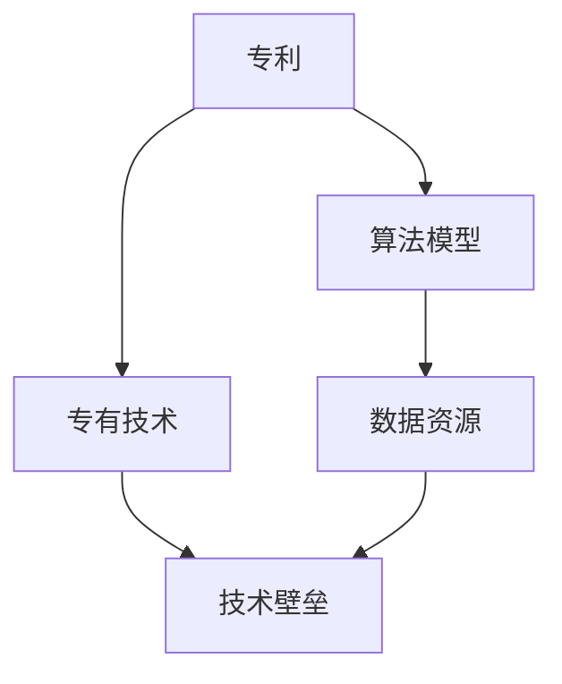
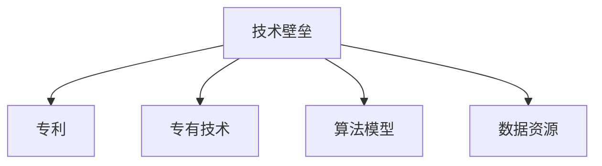
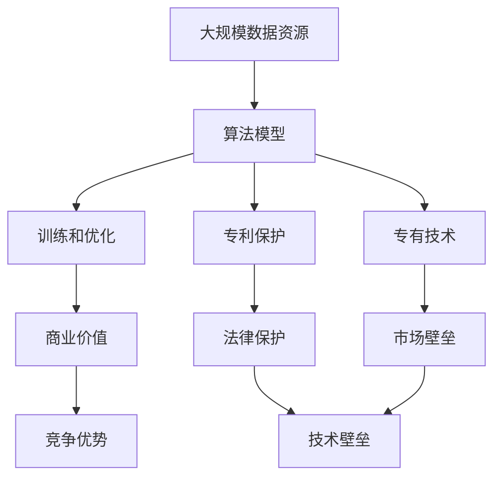

                 

# 技术壁垒：创业者的护城河

在快速迭代的技术浪潮中，创业者的护城河已不再是传统的资本、品牌和供应链，而是那些能够迅速转化成实际商业价值的独门秘籍——技术壁垒。本文将深入探讨技术壁垒的核心概念、构建原理及其在创业中的应用，为渴望在竞争激烈的商业世界中脱颖而出的人士提供独到的见解和建议。

## 1. 背景介绍

### 1.1 问题由来
在当今数字化经济时代，技术创新成为推动企业发展的核心动力。然而，无数创业项目因缺乏核心技术优势而昙花一现，导致市场竞争日益激烈。对于创业者而言，如何构建并保护自己的技术壁垒，成为能否在激烈竞争中脱颖而出的关键因素。

### 1.2 问题核心关键点
技术壁垒指的是企业所拥有的独特技术优势，这些优势可以是专利、专有技术、算法模型、数据资源等，使得企业在特定技术领域中拥有难以复制和超越的竞争优势。其核心关键点包括：
1. 技术的独创性和先进性。
2. 技术的复杂度和实现难度。
3. 技术的经济价值和应用潜力。
4. 技术的可复制性和公开程度。

### 1.3 问题研究意义
构建并维护技术壁垒不仅能够提升企业的市场竞争力，还能增强企业的品牌信誉和市场份额，推动企业持续发展。研究技术壁垒构建的方法和策略，对于促进技术创新和企业成长具有重要意义。

## 2. 核心概念与联系

### 2.1 核心概念概述

为更好地理解技术壁垒，本文将介绍几个密切相关的核心概念：

- **技术壁垒（Technological Barrier）**：指企业所掌握的独特技术优势，这些优势难以被竞争对手模仿，是企业获取竞争优势的重要手段。

- **专利（Patent）**：指对一项技术或发明的独占使用权，通常由国家知识产权部门授权，具有法律保护。

- **专有技术（Proprietary Technology）**：指企业独创的技术方案，不公开于外，只用于内部运营。

- **算法模型（Algorithm Model）**：指通过数学和编程实现的特定问题解决框架，如机器学习模型、人工智能算法等。

- **数据资源（Data Asset）**：指企业拥有的大量高质量数据，经过处理和分析后具有极高的商业价值。

这些核心概念之间存在紧密联系，共同构成了技术壁垒的生态系统。例如，专利和专有技术可以保护算法模型的创新性，数据资源为算法模型的训练和优化提供了支持。

### 2.2 概念间的关系

以下用两个Mermaid流程图来展示核心概念之间的关系。



这个流程图展示了专利和专有技术如何保护和支持算法模型的创新，而数据资源为算法模型的训练和优化提供了支持。



这个流程图展示了技术壁垒的构建过程，其中专利、专有技术、算法模型和数据资源共同构成了技术壁垒的基石。

### 2.3 核心概念的整体架构

最后，用一张综合的流程图来展示这些核心概念在技术壁垒构建中的整体架构：



这个综合流程图展示了技术壁垒的构建过程，从大规模数据资源的获取，到算法模型的训练和优化，再到专利和专有技术的保护，最终形成市场壁垒和竞争优势。

## 3. 核心算法原理 & 具体操作步骤

### 3.1 算法原理概述

技术壁垒的核心在于算法的创新性和先进性，其构建过程通常包括以下几个关键步骤：

1. **数据获取与预处理**：收集、清洗和标注高质量的数据资源，为算法模型的训练和优化提供基础。

2. **算法设计与优化**：选择或设计适合的算法模型，并通过不断迭代优化，提升算法的性能和精度。

3. **专利申请与保护**：对于具有创新性的算法模型，申请专利以获得法律保护，防止他人复制。

4. **专有技术封装**：将算法模型的关键部分封装为专有技术，只用于内部运营，增加竞争对手的复制难度。

5. **商业化应用**：将算法模型集成到产品或服务中，实现商业化应用，获取经济价值。

### 3.2 算法步骤详解

以下是一个具体的技术壁垒构建流程，以深度学习算法为例：

**Step 1: 数据获取与预处理**
- 从公开数据集或商业数据源获取大规模数据资源。
- 对数据进行清洗和标注，去除噪声和无关数据。

**Step 2: 算法设计与优化**
- 选择深度学习框架（如TensorFlow、PyTorch等）。
- 设计适合的神经网络结构（如卷积神经网络、循环神经网络等）。
- 使用反向传播算法优化模型参数，提升模型的预测精度。

**Step 3: 专利申请与保护**
- 根据算法模型的创新点，撰写专利申请文档。
- 向国家知识产权部门提交专利申请，等待审核。
- 获得专利授权后，对算法模型进行法律保护。

**Step 4: 专有技术封装**
- 将算法模型的核心部分封装为专有技术，如模型参数、训练方法等。
- 只允许内部开发人员访问和使用，增加外部复制的难度。

**Step 5: 商业化应用**
- 将算法模型集成到产品或服务中，如智能推荐系统、图像识别应用等。
- 在市场推广中突出技术优势，吸引客户使用。
- 持续优化算法模型，提升产品性能和市场竞争力。

### 3.3 算法优缺点

技术壁垒的构建和维护具有以下优点：
1. 提高企业的市场竞争力。
2. 增强企业的品牌信誉和市场份额。
3. 推动企业的持续创新和发展。

但同时也存在一些缺点：
1. 高成本和复杂性。专利申请、算法设计和专有技术封装都需要高水平的知识和技能。
2. 技术更新速度快。快速迭代的技术环境可能导致技术壁垒的快速失效。
3. 法律和市场风险。专利保护和专有技术封装有法律和市场风险，存在被破解或被仿制的可能性。

### 3.4 算法应用领域

技术壁垒的应用领域非常广泛，以下列举几个典型的应用场景：

- **智能推荐系统**：利用深度学习算法模型，通过分析用户行为数据，推荐个性化内容。
- **图像识别应用**：使用卷积神经网络模型，对图像进行分类和识别。
- **自然语言处理**：应用自然语言处理算法，如BERT、GPT等，实现文本分析、情感分析和机器翻译等功能。
- **智能客服系统**：使用语音识别和自然语言处理算法，提供自动客服和智能对话功能。
- **区块链技术**：利用加密算法和共识算法，构建安全的分布式账本系统。

## 4. 数学模型和公式 & 详细讲解 & 举例说明

### 4.1 数学模型构建

假设我们构建的深度学习模型为 $M_{\theta}(x)$，其中 $\theta$ 为模型参数，$x$ 为输入数据。模型的损失函数为 $\mathcal{L}(\theta)$，用于衡量模型预测结果与真实标签之间的差异。

形式化地，模型的训练目标为最小化损失函数 $\mathcal{L}(\theta)$，即：

$$
\theta^* = \mathop{\arg\min}_{\theta} \mathcal{L}(\theta)
$$

### 4.2 公式推导过程

以二分类任务为例，假设模型输出为 $\hat{y}=M_{\theta}(x)$，其中 $\hat{y} \in [0,1]$ 表示样本属于正类的概率。真实标签 $y \in \{0,1\}$。则二分类交叉熵损失函数定义为：

$$
\ell(M_{\theta}(x),y) = -[y\log \hat{y} + (1-y)\log (1-\hat{y})]
$$

将损失函数对参数 $\theta$ 求导，得：

$$
\frac{\partial \mathcal{L}(\theta)}{\partial \theta} = -\frac{1}{N}\sum_{i=1}^N (\frac{y_i}{\hat{y}_i}-\frac{1-y_i}{1-\hat{y}_i}) \frac{\partial M_{\theta}(x_i)}{\partial \theta}
$$

其中 $\frac{\partial M_{\theta}(x_i)}{\partial \theta}$ 可以通过反向传播算法高效计算。

### 4.3 案例分析与讲解

以下是一个具体的算法优化案例，以深度学习中的卷积神经网络（CNN）为例：

**案例背景**：
假设我们要构建一个图像分类器，用于识别猫和狗的图像。我们选择使用卷积神经网络作为模型，并使用CIFAR-10数据集进行训练。

**步骤**：
1. **数据获取与预处理**：从CIFAR-10数据集中获取图像数据，并进行预处理，如归一化、数据增强等。
2. **算法设计与优化**：设计包含卷积层、池化层和全连接层的卷积神经网络，使用交叉熵损失函数进行训练。通过调整网络结构和超参数，优化模型性能。
3. **专利申请与保护**：根据模型的创新点，撰写专利申请文档。向国家知识产权部门提交专利申请，等待审核。
4. **专有技术封装**：将模型结构和训练方法封装为专有技术，只允许内部开发人员访问和使用。
5. **商业化应用**：将模型集成到移动应用中，提供猫狗图像识别功能。在市场推广中突出技术优势，吸引客户使用。

## 5. 项目实践：代码实例和详细解释说明

### 5.1 开发环境搭建

在项目开发前，需要搭建好开发环境，以下是一个Python环境的搭建步骤：

1. 安装Anaconda：从官网下载并安装Anaconda，用于创建独立的Python环境。

2. 创建并激活虚拟环境：
```bash
conda create -n pytorch-env python=3.8 
conda activate pytorch-env
```

3. 安装PyTorch：根据CUDA版本，从官网获取对应的安装命令。例如：
```bash
conda install pytorch torchvision torchaudio cudatoolkit=11.1 -c pytorch -c conda-forge
```

4. 安装各类工具包：
```bash
pip install numpy pandas scikit-learn matplotlib tqdm jupyter notebook ipython
```

完成上述步骤后，即可在`pytorch-env`环境中开始项目开发。

### 5.2 源代码详细实现

以下是一个具体的技术壁垒构建项目的代码实现，以深度学习模型为例：

```python
import torch
import torch.nn as nn
import torch.optim as optim
from torch.utils.data import DataLoader
from torchvision import datasets, transforms

# 定义模型结构
class Net(nn.Module):
    def __init__(self):
        super(Net, self).__init__()
        self.conv1 = nn.Conv2d(3, 6, 5)
        self.pool = nn.MaxPool2d(2, 2)
        self.conv2 = nn.Conv2d(6, 16, 5)
        self.fc1 = nn.Linear(16 * 5 * 5, 120)
        self.fc2 = nn.Linear(120, 84)
        self.fc3 = nn.Linear(84, 10)

    def forward(self, x):
        x = self.pool(F.relu(self.conv1(x)))
        x = self.pool(F.relu(self.conv2(x)))
        x = x.view(-1, 16 * 5 * 5)
        x = F.relu(self.fc1(x))
        x = F.relu(self.fc2(x))
        x = self.fc3(x)
        return x

# 定义训练函数
def train(model, device, train_loader, optimizer, epoch):
    model.train()
    for batch_idx, (data, target) in enumerate(train_loader):
        data, target = data.to(device), target.to(device)
        optimizer.zero_grad()
        output = model(data)
        loss = F.cross_entropy(output, target)
        loss.backward()
        optimizer.step()
        if batch_idx % 10 == 0:
            print('Train Epoch: {} [{}/{} ({:.0f}%)]\tLoss: {:.6f}'.format(
                epoch, batch_idx * len(data), len(train_loader.dataset),
                100. * batch_idx / len(train_loader), loss.item()))

# 定义测试函数
def test(model, device, test_loader):
    model.eval()
    test_loss = 0
    correct = 0
    with torch.no_grad():
        for data, target in test_loader:
            data, target = data.to(device), target.to(device)
            output = model(data)
            test_loss += F.cross_entropy(output, target, reduction='sum').item()
            pred = output.argmax(dim=1, keepdim=True)
            correct += pred.eq(target.view_as(pred)).sum().item()

    test_loss /= len(test_loader.dataset)
    print('Test set: Average loss: {:.4f}, Accuracy: {}/{} ({:.0f}%)'.format(
        test_loss, correct, len(test_loader.dataset),
        100. * correct / len(test_loader.dataset)))

# 训练模型
net = Net()
net.to(device)

optimizer = optim.SGD(net.parameters(), lr=0.001, momentum=0.9)

train_loader = DataLoader(train_set, batch_size=64, shuffle=True)
test_loader = DataLoader(test_set, batch_size=64, shuffle=True)

for epoch in range(10):
    train(net, device, train_loader, optimizer, epoch)
    test(net, device, test_loader)

# 保存模型
torch.save(net.state_dict(), 'model.pth')
```

### 5.3 代码解读与分析

让我们再详细解读一下关键代码的实现细节：

**Net类**：
- `__init__`方法：定义模型结构，包括卷积层、池化层和全连接层。
- `forward`方法：实现前向传播，输入数据通过网络层输出预测结果。

**train函数**：
- 定义训练函数，包括前向传播、计算损失、反向传播和参数更新。
- 使用交叉熵损失函数，并通过 `F.cross_entropy` 计算。

**test函数**：
- 定义测试函数，计算模型在测试集上的平均损失和准确率。
- 使用 `torch.no_grad` 上下文管理器，避免反向传播，提高测试效率。

**训练流程**：
- 定义总的训练轮数，循环迭代训练模型。
- 在每个epoch内，先训练模型，再测试模型，输出训练和测试结果。

**模型保存**：
- 训练完毕后，将模型参数保存到文件中，方便后续使用。

## 6. 实际应用场景

### 6.1 智能推荐系统

智能推荐系统是技术壁垒在商业应用中的典型案例。通过深度学习算法，推荐系统能够分析用户行为数据，推荐个性化内容。以电商平台的推荐系统为例，通过对用户浏览、购买、评价等数据进行分析，推荐相关商品，提高用户满意度和销售额。

### 6.2 图像识别应用

图像识别应用广泛用于安防、医疗、自动驾驶等领域。通过卷积神经网络等深度学习算法，图像识别系统能够自动识别图像中的物体和场景，提高识别的准确率和效率。

### 6.3 自然语言处理

自然语言处理是技术壁垒在NLP领域的经典应用。通过自然语言处理算法，系统能够实现文本分析、情感分析、机器翻译等功能。以智能客服系统为例，通过NLP技术，系统能够自动理解用户意图，生成回复，提升客户体验。

### 6.4 未来应用展望

随着技术壁垒的不断发展和应用，未来将会在更多领域产生深远影响。

在智慧医疗领域，技术壁垒将推动医疗智能化进程，通过深度学习算法，实现智能诊断、精准治疗等应用。

在智能教育领域，技术壁垒将促进教育公平，通过智能推荐系统，为每个学生提供个性化的学习资源和路径。

在智慧城市治理中，技术壁垒将提升城市管理的自动化和智能化水平，构建更安全、高效的城市环境。

此外，在企业生产、社会治理、文娱传媒等众多领域，技术壁垒的应用也将不断涌现，为经济社会发展注入新的动力。

## 7. 工具和资源推荐

### 7.1 学习资源推荐

为了帮助开发者系统掌握技术壁垒的理论基础和实践技巧，这里推荐一些优质的学习资源：

1. 《深度学习》（Ian Goodfellow 著）：全面介绍深度学习的基本概念和经典模型，是入门学习的必备书籍。

2. 《TensorFlow实战Google深度学习》（王晋东 著）：结合TensorFlow框架，深入讲解深度学习的应用实践，适合实战操作。

3. 《Python深度学习》（Francois Chollet 著）：Keras深度学习库的作者所著，详细介绍了使用Keras进行深度学习开发的方法和技巧。

4. Coursera深度学习课程：由Andrew Ng等顶尖教授讲授，涵盖深度学习的基础知识和前沿技术。

5. Kaggle数据科学竞赛：通过参与数据竞赛，实战演练深度学习算法，积累项目经验。

通过对这些资源的学习实践，相信你一定能够快速掌握技术壁垒的精髓，并用于解决实际的商业问题。

### 7.2 开发工具推荐

高效的开发离不开优秀的工具支持。以下是几款用于深度学习项目开发的常用工具：

1. PyTorch：基于Python的开源深度学习框架，灵活性高，适合快速迭代研究。

2. TensorFlow：由Google主导开发的开源深度学习框架，生产部署方便，适合大规模工程应用。

3. Jupyter Notebook：开源的交互式编程环境，适合进行深度学习模型的开发和测试。

4. Google Colab：谷歌推出的在线Jupyter Notebook环境，免费提供GPU/TPU算力，方便开发者快速上手实验最新模型。

5. Keras：高层次的深度学习框架，易于上手，适合初学者和快速开发。

合理利用这些工具，可以显著提升深度学习项目开发效率，加快创新迭代的步伐。

### 7.3 相关论文推荐

技术壁垒的构建和维护涉及多个前沿领域，以下是几篇奠基性的相关论文，推荐阅读：

1. AlexNet: ImageNet Classification with Deep Convolutional Neural Networks：提出深度卷积神经网络，奠定了深度学习在图像识别中的应用基础。

2. Google Brain 团队关于TensorFlow的研究：介绍TensorFlow的架构和核心技术，适合深入了解框架的内部实现。

3. Deep Learning: A Textbook：斯坦福大学教授Ian Goodfellow所著的深度学习教科书，深入浅出地介绍了深度学习的基本原理和应用。

4. Attention is All You Need：提出Transformer模型，开启了NLP领域的预训练大模型时代。

5. AlphaGo Zero：通过强化学习算法，实现围棋的高水平对抗，展示了AI在复杂游戏中的突破。

这些论文代表了大规模技术壁垒构建的研究进展，通过学习这些前沿成果，可以帮助研究者把握学科前进方向，激发更多的创新灵感。

除上述资源外，还有一些值得关注的前沿资源，帮助开发者紧跟技术壁垒构建的最新进展，例如：

1. arXiv论文预印本：人工智能领域最新研究成果的发布平台，包括大量尚未发表的前沿工作，学习前沿技术的必读资源。

2. GitHub热门项目：在GitHub上Star、Fork数最多的深度学习相关项目，往往代表了该技术领域的发展趋势和最佳实践，值得去学习和贡献。

3. 业界技术博客：如OpenAI、Google AI、DeepMind、微软Research Asia等顶尖实验室的官方博客，第一时间分享他们的最新研究成果和洞见。

4. 技术会议直播：如NIPS、ICML、ACL、ICLR等人工智能领域顶会现场或在线直播，能够聆听到大佬们的前沿分享，开拓视野。

5. 学术期刊：如《IEEE Transactions on Neural Networks and Learning Systems》、《Journal of Machine Learning Research》等学术期刊，深入探讨深度学习算法和应用实践。

总之，对于技术壁垒的学习和实践，需要开发者保持开放的心态和持续学习的意愿。多关注前沿资讯，多动手实践，多思考总结，必将收获满满的成长收益。

## 8. 总结：未来发展趋势与挑战

### 8.1 总结

本文对技术壁垒的核心概念、构建原理及其在创业中的应用进行了全面系统的介绍。首先阐述了技术壁垒的构建和维护对于企业竞争力的重要性，明确了技术壁垒在商业领域的应用场景。其次，从原理到实践，详细讲解了技术壁垒的构建过程，包括数据获取、算法设计与优化、专利申请与保护、专有技术封装、商业化应用等关键步骤。最后，对技术壁垒的未来发展趋势和面临的挑战进行了分析和展望。

通过本文的系统梳理，可以看到，技术壁垒的构建和维护在现代商业竞争中具有重要地位。这些独门秘籍不仅能够提升企业的市场竞争力，还能增强企业的品牌信誉和市场份额，推动企业持续发展。未来，伴随技术创新和企业需求的不断变化，技术壁垒也将不断演进，为企业的创新和增长提供持续动力。

### 8.2 未来发展趋势

展望未来，技术壁垒的发展趋势主要体现在以下几个方面：

1. **算法的不断创新**：深度学习算法的不断创新和优化，将推动技术壁垒的持续突破。如Transformer、GPT-3等大模型的出现，极大地提升了算法模型的性能和应用潜力。

2. **多模态融合**：未来的技术壁垒将不再局限于单一模态数据，而是将多模态数据（如图像、语音、文本）进行融合，实现更全面、更智能的决策和推荐。

3. **联邦学习**：在数据隐私和安全的要求下，联邦学习（Federated Learning）成为重要的技术手段，通过分布式训练，实现模型在多个设备上的协同优化，提高模型的泛化能力。

4. **可解释性增强**：随着AI应用的普及，可解释性（Explainability）成为用户关注的焦点。未来的技术壁垒将更注重模型的可解释性，增强模型的透明度和可信度。

5. **自动化调优**：自动化机器学习（AutoML）技术的发展，使得技术壁垒的构建过程更加高效和自动化，降低了技术门槛，加速了技术创新。

### 8.3 面临的挑战

尽管技术壁垒的构建具有重要意义，但在实现过程中仍面临诸多挑战：

1. **数据获取困难**：高质量数据的获取和标注成本高，特别是在垂直领域，数据稀缺现象普遍存在。

2. **算法复杂度高**：深度学习算法的复杂性和实现难度高，需要高水平的技术积累和经验。

3. **资源消耗大**：深度学习模型的训练和推理需要大量的计算资源，如GPU、TPU等高性能设备，成本高昂。

4. **模型泛化性不足**：模型在训练集上表现优异，但在测试集和实际应用中泛化能力不足，容易出现过拟合现象。

5. **技术更新快**：快速迭代的技术环境导致技术壁垒容易失效，需要不断迭代和优化。

6. **法律法规风险**：技术壁垒的构建和应用过程中，可能涉及数据隐私、知识产权等方面的法律法规问题，存在法律风险。

### 8.4 研究展望

面对技术壁垒构建和维护中面临的诸多挑战，未来的研究需要在以下几个方面寻求新的突破：

1. **数据增强**：利用数据增强技术，扩大数据集规模，提高模型的泛化能力。

2. **联邦学习**：通过联邦学习技术，在保护数据隐私的前提下，实现模型在多个设备上的协同优化。

3. **自动化调优**：自动化机器学习技术将进一步降低技术壁垒构建的技术门槛，加速技术创新。

4. **知识图谱**：将符号化的先验知识与深度学习模型结合，增强模型的推理和决策能力。

5. **伦理道德**：在技术壁垒构建过程中，注重模型的伦理导向，避免有偏见、有害的输出。

总之，技术壁垒的构建和维护是一个复杂且长期的过程，需要企业从数据、算法、资源、法律等多个维度进行全面考虑和优化。只有勇于创新、敢于突破，才能不断拓展技术壁垒的边界，实现技术的持续突破和应用落地。

## 9. 附录：常见问题与解答

**Q1：如何构建技术壁垒？**

A: 构建技术壁垒主要包括以下几个关键步骤：
1. 数据获取与预处理：收集、清洗和标注高质量的数据资源。
2. 算法设计与优化：选择或设计适合的算法模型，并通过不断迭代优化，提升算法的性能和精度。
3. 专利申请与保护：对于具有创新性的算法模型，申请专利以获得法律保护，防止他人复制。
4. 专有技术封装：将算法模型的核心部分封装为专有技术，只允许内部开发人员访问和使用。
5. 商业化应用：将算法模型集成到产品或服务中，实现商业化应用，获取经济价值。

**Q2：如何保护技术壁垒？**

A: 保护技术壁垒主要通过以下方式实现：
1. 专利申请与保护：通过法律手段，保护算法模型的创新点和知识产权。
2. 专有技术封装：将算法模型的关键部分封装为专有技术，只允许内部开发人员访问和使用。
3. 数据隐私保护：采取数据脱敏、加密等

