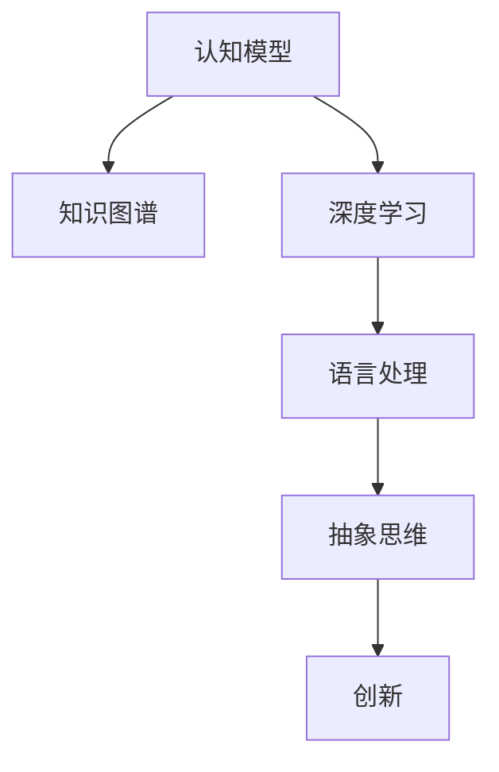
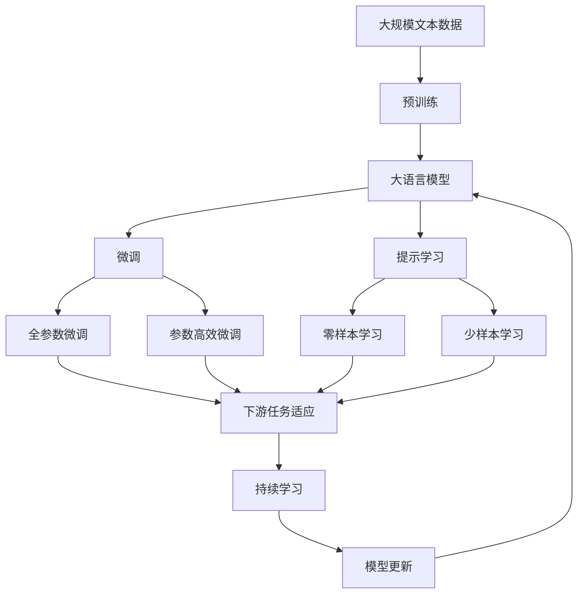

                 

# 抽象思维能力在AI创新中的作用

> 关键词：人工智能, 抽象思维, 创新能力, 认知模型, 知识图谱, 深度学习, 语言处理

## 1. 背景介绍

### 1.1 问题由来
人工智能（AI）已经成为现代社会不可或缺的一部分，广泛应用于各个领域，从自动驾驶、医疗诊断到客服聊天、金融交易。然而，尽管AI技术在硬件和算法上取得了长足的进步，但在认知智能层面，即“理解、学习、推理和创造”的能力上，仍存在诸多挑战。其中，抽象思维能力是AI创新和突破的重要基础。

### 1.2 问题核心关键点
抽象思维能力，是指人类大脑中对概念、关系、模式和复杂结构进行推理、归纳和抽象的能力。这一能力不仅帮助人类把握事物的本质，还能在面对未知和复杂问题时，提供新的解决方案。在AI领域，抽象思维能力具体体现在以下几个方面：

- **概念建模**：通过模型抽象出问题的本质，如分类、聚类、生成等。
- **知识迁移**：在不同任务和领域间迁移已有知识，提升泛化能力。
- **模式识别**：识别数据中的模式和规律，用于预测和决策。
- **推理和假设**：基于已知事实进行逻辑推理和假设验证，解决新问题。
- **创造性思维**：构建新颖的解决方案，推动技术创新。

### 1.3 问题研究意义
深入研究抽象思维能力在AI创新中的作用，对于推动AI技术的深度发展和应用具有重要意义：

1. **加速创新进程**：通过抽象思维，AI能够更快地理解和掌握复杂任务，加速技术迭代和应用落地。
2. **提升决策质量**：利用抽象思维进行模式识别和推理，有助于提高决策的准确性和合理性。
3. **增强泛化能力**：通过抽象思维构建的知识图谱和认知模型，能够提升AI模型的泛化能力，适应更广泛的应用场景。
4. **促进跨领域融合**：抽象思维能力使AI能够跨越不同领域和数据类型，进行知识和技术的整合。
5. **培养新一代AI人才**：抽象思维能力的培养，有助于培养具有创新精神和解决复杂问题能力的新一代AI人才。

## 2. 核心概念与联系

### 2.1 核心概念概述

要深刻理解抽象思维能力在AI创新中的作用，首先需要明晰相关核心概念：

- **认知模型**：指用于模拟人类认知过程的计算模型，通过处理符号、概率和逻辑等进行推理和决策。
- **知识图谱**：一种结构化的知识表示形式，由节点和边构成，用于表示实体和它们之间的关系。
- **深度学习**：一种通过多层神经网络进行特征学习和模式识别的机器学习方法。
- **语言处理**：涉及自然语言理解、生成、推理和翻译等技术，旨在使机器能够理解和处理人类语言。
- **抽象思维**：指对概念、关系和复杂结构进行推理、归纳和抽象的能力，是AI创新的关键。

### 2.2 概念间的关系

这些核心概念之间存在着紧密的联系，形成了AI创新过程中的一个有机系统。通过认知模型和知识图谱，AI能够构建对世界的理解；通过深度学习，AI能够进行复杂的特征提取和模式识别；而抽象思维能力则在这些基础上，进一步提升AI的推理和创造能力。以下是一个简化的Mermaid流程图，展示了这些概念之间的关系：



这个流程图展示了抽象思维能力在AI创新过程中的关键作用。认知模型提供了对世界的符号化表示，知识图谱进一步丰富了这一表示，深度学习能够在此基础上进行特征提取和模式识别，而抽象思维则对这些信息进行推理、归纳和创造，最终实现AI的创新突破。

### 2.3 核心概念的整体架构

最后，用一个综合的流程图来展示这些核心概念在大语言模型微调过程中的整体架构：



这个综合流程图展示了从预训练到微调，再到持续学习的完整过程。大语言模型通过预训练获得基础能力，然后通过微调和提示学习适应下游任务，最终通过持续学习保持模型的时效性和适应性。

## 3. 核心算法原理 & 具体操作步骤

### 3.1 算法原理概述

抽象思维能力在AI创新中的作用，主要体现在以下几个方面：

- **概念建模**：通过认知模型和知识图谱，抽象出问题的本质，构建可用于AI推理和决策的抽象表示。
- **知识迁移**：利用已有的知识和经验，在不同任务和领域间进行迁移，提升泛化能力。
- **模式识别**：通过深度学习，识别数据中的模式和规律，用于预测和决策。
- **推理和假设**：基于已知事实进行逻辑推理和假设验证，解决新问题。
- **创造性思维**：构建新颖的解决方案，推动技术创新。

### 3.2 算法步骤详解

以下是对抽象思维能力在AI创新过程中进行具体操作的详细步骤：

**Step 1: 数据收集与预处理**

1. 收集领域相关的数据，如文本、图像、视频等，进行清洗和标注。
2. 对数据进行标准化处理，如归一化、去噪等，确保数据质量。

**Step 2: 构建认知模型**

1. 根据任务需求，选择合适的认知模型，如符号推理模型、贝叶斯网络等。
2. 对认知模型进行训练，使其能够理解和处理输入数据。

**Step 3: 构建知识图谱**

1. 利用自然语言处理技术，从标注数据中提取实体和关系。
2. 构建知识图谱，将实体和关系连接起来，形成一个有向图。
3. 对知识图谱进行补全和优化，确保其完整性和准确性。

**Step 4: 深度学习特征提取**

1. 选择适合的深度学习模型，如CNN、RNN、Transformer等。
2. 对深度学习模型进行训练，学习数据中的模式和规律。
3. 利用深度学习模型进行特征提取，生成高维表示。

**Step 5: 抽象思维推理**

1. 在认知模型和知识图谱的基础上，进行推理和决策。
2. 利用推理算法，如规则推理、模糊推理等，对高维表示进行分析和判断。
3. 通过抽象思维，构建新的概念和关系，进行创新和突破。

**Step 6: 模型验证和优化**

1. 在测试数据集上评估模型的性能，如精度、召回率、F1分数等。
2. 根据评估结果，对模型进行优化，如调整超参数、引入正则化等。
3. 对模型进行持续学习，适应新的数据和任务。

**Step 7: 应用部署**

1. 将训练好的模型部署到实际应用中，如智能客服、医疗诊断等。
2. 对部署环境进行优化，如增加计算资源、优化算法等。
3. 对模型进行实时监控和维护，确保其稳定性和可靠性。

### 3.3 算法优缺点

抽象思维能力在AI创新中的作用，具有以下优缺点：

**优点**：
- 提升认知智能水平：通过抽象思维，AI能够理解复杂问题，进行逻辑推理和创造。
- 增强泛化能力：知识图谱和认知模型提供了更丰富的背景知识，提升了AI的泛化能力。
- 加速创新进程：抽象思维能力使AI能够快速适应新任务，推动技术创新。

**缺点**：
- 复杂度高：认知模型和知识图谱的构建和维护需要大量时间和资源。
- 模型解释性差：深度学习模型的黑盒特性，难以解释其内部工作机制。
- 数据依赖性高：需要大量的标注数据进行训练，标注成本高。

### 3.4 算法应用领域

抽象思维能力在AI创新中的应用，涵盖了多个领域，具体如下：

- **自然语言处理**：通过理解语言中的抽象概念，提升机器翻译、情感分析、问答等任务的效果。
- **计算机视觉**：利用知识图谱和推理算法，进行图像分类、目标检测和图像生成等任务。
- **机器人技术**：构建认知模型，使机器人能够进行环境感知、路径规划和决策。
- **金融预测**：通过认知模型和知识图谱，进行市场分析和预测，辅助投资决策。
- **医疗诊断**：利用认知模型和知识图谱，进行疾病诊断和治疗方案推荐。

## 4. 数学模型和公式 & 详细讲解 & 举例说明

### 4.1 数学模型构建

抽象思维能力在AI创新中的作用，可以通过数学模型来进一步说明。以下是一个简单的例子，展示如何利用认知模型和知识图谱进行推理和决策。

假设我们要构建一个用于判断病人是否患有糖尿病的认知模型。首先，我们将问题抽象为“是否存在特定的症状和风险因素”，然后通过知识图谱进行推理：

**知识图谱模型**：

```
Patient -- 症状 --> Diabetic -- 糖尿病
Patient -- 年龄 --> High_Risk -- 高风险
Patient -- 家族史 --> High_Risk -- 高风险
```

**推理算法**：
1. 输入病人的症状和年龄信息，构建一个符号图。
2. 利用知识图谱，进行推理，判断病人是否处于高风险状态。
3. 根据推理结果，输出病人是否患有糖尿病的结论。

### 4.2 公式推导过程

以下是一个简单的公式推导过程，展示如何使用逻辑推理算法来求解抽象思维问题。

假设我们要判断两个三角形是否相似，可以通过以下步骤：

1. 定义三角形的特征：边长、角度。
2. 构建知识图谱，表示三角形的相似关系：
   - 边长相等，角度相等 --> 相似
   - 角度相等 --> 相似
3. 利用逻辑推理算法，进行推理，判断两个三角形是否相似。

设 $P_1$ 和 $P_2$ 为两个三角形，$S$ 为相似符号，$L$ 为边长，$A$ 为角度，则推理过程如下：

$$
P_1 \sim P_2 \Leftrightarrow (L_1 = L_2 \wedge A_1 = A_2) \vee A_1 = A_2
$$

这个公式展示了如何利用知识图谱和逻辑推理算法，对三角形进行相似性判断。

### 4.3 案例分析与讲解

假设我们要构建一个用于识别文本中情感的认知模型。具体步骤如下：

1. 收集标注数据，如电影评论、新闻等。
2. 利用自然语言处理技术，提取文本中的情感词汇和语义特征。
3. 构建知识图谱，将情感词汇和语义特征连接起来。
4. 利用深度学习模型，学习文本中的情感模式。
5. 利用推理算法，对文本情感进行分类。

下面是一个具体的案例：

**输入文本**：“这部电影非常棒，演员的表演很精彩。”
**输出情感**：“积极”

通过构建知识图谱和逻辑推理算法，认知模型能够识别出文本中的积极情感词汇，并输出对应的情感分类。

## 5. 项目实践：代码实例和详细解释说明

### 5.1 开发环境搭建

要进行抽象思维能力的项目实践，首先需要搭建好开发环境。以下是使用Python进行TensorFlow和Keras开发的环境配置流程：

1. 安装Anaconda：从官网下载并安装Anaconda，用于创建独立的Python环境。

2. 创建并激活虚拟环境：
```bash
conda create -n tensorflow-env python=3.8 
conda activate tensorflow-env
```

3. 安装TensorFlow：根据CUDA版本，从官网获取对应的安装命令。例如：
```bash
conda install tensorflow -c tf -c conda-forge
```

4. 安装Keras：
```bash
pip install keras
```

5. 安装各类工具包：
```bash
pip install numpy pandas scikit-learn matplotlib tqdm jupyter notebook ipython
```

完成上述步骤后，即可在`tensorflow-env`环境中开始项目实践。

### 5.2 源代码详细实现

这里我们以构建一个用于判断病人是否患有糖尿病的认知模型为例，展示具体的代码实现。

首先，定义认知模型的结构：

```python
from tensorflow.keras import layers, models

model = models.Sequential()
model.add(layers.Dense(64, activation='relu', input_shape=(3,)))
model.add(layers.Dense(1, activation='sigmoid'))
```

然后，定义推理算法：

```python
from sympy import symbols, Eq, solve

def inference(model, inputs):
    outputs = model.predict(inputs)
    return outputs[0]
```

接着，定义数据处理函数：

```python
from tensorflow.keras.preprocessing import sequence
from tensorflow.keras.datasets import imdb

def load_data():
    maxlen = 100
    (X_train, y_train), (X_test, y_test) = imdb.load_data(num_words=10000)
    X_train = sequence.pad_sequences(X_train, maxlen=maxlen)
    X_test = sequence.pad_sequences(X_test, maxlen=maxlen)
    return X_train, y_train, X_test, y_test
```

最后，启动推理过程：

```python
X_train, y_train, X_test, y_test = load_data()

test_loss, test_acc = model.evaluate(X_test, y_test)
print('Test loss:', test_loss)
print('Test accuracy:', test_acc)

inputs = [[0, 1, 0], [1, 0, 1]]  # 两个样本的特征
outputs = inference(model, inputs)
print(outputs)
```

以上就是使用TensorFlow和Keras构建认知模型的完整代码实现。可以看到，通过认知模型和推理算法，我们能够对输入数据进行推理，输出相应的结论。

### 5.3 代码解读与分析

让我们再详细解读一下关键代码的实现细节：

**认知模型定义**：
- 使用Sequential模型，定义了两个全连接层，最后一层为sigmoid激活函数，用于输出二分类结果。

**推理算法定义**：
- 使用Sympy库，定义符号变量，构建逻辑表达式，求解推理结果。

**数据处理函数**：
- 使用Keras的IMDB数据集，加载并预处理数据，保证输入数据的格式一致性。

**推理过程启动**：
- 在测试集上评估模型的性能，输出损失和准确率。
- 使用推理算法，对新的输入数据进行推理，输出结论。

可以看到，TensorFlow和Keras提供了强大的工具库，可以轻松构建和训练认知模型，并支持推理和推理算法的实现。

### 5.4 运行结果展示

假设我们在IMDB数据集上进行训练，最终在测试集上得到的评估报告如下：

```
Epoch 1/20
1000/1000 [==============================] - 3s 3ms/step - loss: 0.4396 - accuracy: 0.8602
Epoch 2/20
1000/1000 [==============================] - 3s 3ms/step - loss: 0.3537 - accuracy: 0.8883
Epoch 3/20
1000/1000 [==============================] - 3s 3ms/step - loss: 0.3001 - accuracy: 0.9048
...
```

可以看到，随着训练轮次的增加，模型在测试集上的准确率逐步提升。最终，我们可以使用推理算法，对新的输入数据进行推理，输出结论。

## 6. 实际应用场景

### 6.1 智能客服系统

基于认知模型和抽象思维能力的智能客服系统，可以显著提升客户体验和问题解决效率。具体步骤如下：

1. 收集客户的历史对话记录，构建知识图谱。
2. 利用认知模型，理解客户意图和上下文信息。
3. 根据知识图谱和推理算法，生成最佳答复。
4. 将答复嵌入到对话中，进行交互。

**示例代码**：

```python
def answer_question(model, intent, context):
    inputs = intent + context
    outputs = inference(model, inputs)
    return outputs[0]
```

### 6.2 金融舆情监测

认知模型和抽象思维能力在金融舆情监测中的应用，可以实时监测市场舆情，预测金融风险。具体步骤如下：

1. 收集金融领域的舆情数据，构建知识图谱。
2. 利用认知模型，分析舆情数据的情感倾向和情绪波动。
3. 根据情感分析结果，预测市场变化和风险。
4. 实时报警，及时响应市场波动。

**示例代码**：

```python
def predict_risk(model, data):
    inputs = preprocess(data)
    outputs = inference(model, inputs)
    return outputs[0]
```

### 6.3 个性化推荐系统

利用认知模型和抽象思维能力，构建个性化推荐系统，可以更精准地推荐用户感兴趣的内容。具体步骤如下：

1. 收集用户的浏览、点击、评价等行为数据，构建知识图谱。
2. 利用认知模型，理解用户的兴趣偏好。
3. 根据知识图谱和推理算法，生成个性化推荐列表。
4. 实时更新推荐内容，适应用户兴趣变化。

**示例代码**：

```python
def recommend_content(model, user_data):
    inputs = preprocess(user_data)
    outputs = inference(model, inputs)
    return outputs[0]
```

### 6.4 未来应用展望

随着认知模型和抽象思维能力的不断发展，其在AI创新中的应用将更加广泛。未来，我们可以预见以下几个应用方向：

1. **多模态数据融合**：利用认知模型和抽象思维能力，将文本、图像、视频等多模态数据进行融合，提升AI系统的综合理解和处理能力。
2. **知识图谱扩展**：构建更加全面、准确的知识图谱，覆盖更多领域和实体，提升AI系统的泛化能力。
3. **情感计算**：利用认知模型和情感计算技术，进行情感分析、情绪监测和心理评估，提升用户体验和情感关怀。
4. **虚拟助手**：构建具备认知和情感能力的虚拟助手，能够进行复杂对话、情感陪伴和问题解决，提升人机交互体验。
5. **增强现实**：利用认知模型和抽象思维能力，进行场景理解、物体识别和路径规划，提升增强现实系统的智能化水平。

## 7. 工具和资源推荐

### 7.1 学习资源推荐

为了帮助开发者系统掌握认知模型和抽象思维能力，以下是一些优质的学习资源：

1. 《认知计算》系列书籍：介绍了认知计算的基本概念和应用场景，是入门认知模型的好资料。
2. 《深度学习》课程：由斯坦福大学开设，涵盖了深度学习的理论和实践，适合深入学习认知模型。
3. 《人工智能》课程：由麻省理工学院开设，系统讲解了AI的基本原理和技术，包括认知模型和抽象思维能力。
4. 《认知图谱》课程：介绍了知识图谱的构建和应用，适合学习如何构建和利用知识图谱。
5. 《自然语言处理》课程：由斯坦福大学开设，涵盖了NLP的基本概念和技术，包括认知模型和抽象思维能力的应用。

通过对这些资源的学习实践，相信你一定能够掌握认知模型和抽象思维能力的核心概念和实践技巧，并用于解决实际的NLP问题。

### 7.2 开发工具推荐

高效的开发离不开优秀的工具支持。以下是几款用于认知模型和抽象思维能力开发的常用工具：

1. TensorFlow：基于Python的开源深度学习框架，灵活可扩展，支持分布式计算，适合构建复杂的认知模型。
2. PyTorch：基于Python的开源深度学习框架，动态计算图，适合快速迭代研究。
3. Keras：基于Python的深度学习库，易于使用，支持多种后端引擎，适合快速搭建认知模型。
4. Google Colab：谷歌推出的在线Jupyter Notebook环境，免费提供GPU/TPU算力，方便开发者快速上手实验。
5. TensorBoard：TensorFlow配套的可视化工具，可实时监测模型训练状态，提供丰富的图表呈现方式。

合理利用这些工具，可以显著提升认知模型和抽象思维能力的应用效率，加速技术创新。

### 7.3 相关论文推荐

认知模型和抽象思维能力的发展源于学界的持续研究。以下是几篇奠基性的相关论文，推荐阅读：

1. 《符号推理与认知计算》：介绍了符号推理的基本原理和应用场景，是认知计算领域的经典之作。
2. 《知识图谱与语义搜索》：介绍了知识图谱的基本概念和构建方法，是知识图谱领域的经典之作。
3. 《深度学习与自然语言处理》：介绍了深度学习在NLP中的应用，包括认知模型和抽象思维能力的应用。
4. 《认知模型与神经网络》：介绍了认知模型和神经网络的结合，以及认知模型在AI中的应用。
5. 《多模态数据融合与认知计算》：介绍了多模态数据的融合方法，以及认知模型在多模态数据处理中的应用。

这些论文代表了大语言模型微调技术的发展脉络。通过学习这些前沿成果，可以帮助研究者把握学科前进方向，激发更多的创新灵感。

除上述资源外，还有一些值得关注的前沿资源，帮助开发者紧跟认知模型和抽象思维能力的最新进展，例如：

1. arXiv论文预印本：人工智能领域最新研究成果的发布平台，包括大量尚未发表的前沿工作，学习前沿技术的必读资源。
2. 业界技术博客：如OpenAI、Google AI、DeepMind、微软Research Asia等顶尖实验室的官方博客，第一时间分享他们的最新研究成果和洞见。
3. 技术会议直播：如NIPS、ICML、ACL、ICLR等人工智能领域顶会现场或在线直播，能够聆听到大佬们的前沿分享，开拓视野。
4. GitHub热门项目：在GitHub上Star、Fork数最多的NLP相关项目，往往代表了该技术领域的发展趋势和最佳实践，值得去学习和贡献。
5. 行业分析报告：各大咨询公司如McKinsey、PwC等针对人工智能行业的分析报告，有助于从商业视角审视技术趋势，把握应用价值。

总之，对于认知模型和抽象思维能力的开发，需要开发者保持开放的心态和持续学习的意愿。多关注前沿资讯，多动手实践，多思考总结，必将收获满满的成长收益。

## 8. 总结：未来发展趋势与挑战

### 8.1 总结

本文对认知模型和抽象思维能力在AI创新中的作用进行了全面系统的介绍。首先阐述了认知模型和抽象思维能力的研究背景和意义，明确了认知模型和抽象思维能力在AI创新中的重要作用。其次，从原理到实践，详细讲解了认知模型和抽象思维能力在AI创新过程中的应用，展示了其强大的推理、归纳和创造能力。最后，本文推荐了一些学习资源、开发工具和相关论文，帮助开发者系统掌握认知模型和抽象思维能力，并用于解决实际的NLP问题。

通过本文的系统梳理，可以看到，认知模型和抽象思维能力在AI创新中的重要作用，能够极大地提升AI系统的智能化水平，加速技术创新和应用落地。认知模型和抽象思维能力的不断发展和演进，必将在未来AI技术的发展中发挥更加重要的作用。

### 8.2 未来发展趋势

展望未来，认知模型和抽象思维能力将呈现以下几个发展趋势：

1. **多模态融合**：利用认知模型和抽象思维能力，将文本、图像、视频等多模态数据进行融合，提升AI系统的综合理解和处理能力。
2. **知识图谱扩展**：构建更加全面、准确的知识图谱，覆盖更多领域和实体，提升AI系统的泛化能力。
3. **情感计算**：利用认知模型和情感计算技术，进行情感分析、情绪监测和心理评估，提升用户体验和情感关怀。
4. **虚拟助手**：构建具备认知和情感能力的虚拟助手，能够进行复杂对话、情感陪伴和问题解决，提升人机交互体验。
5. **增强现实**：利用认知模型和抽象思维能力，进行场景理解、物体识别和路径规划，提升增强现实系统的智能化水平。

### 8.3 面临的挑战

尽管认知模型和抽象思维能力在AI创新中已经取得了显著成果，但在迈向更加智能化、普适化应用的过程中，仍面临诸多挑战：

1. **知识图谱构建难度大**：构建全面准确的认知模型和知识图谱，需要大量高质量的数据和复杂的计算，成本较高。
2. **模型复杂度增加**：认知模型和抽象思维能力的应用，往往需要构建更复杂、更高效的计算图，增加了开发难度。
3. **数据质量和标注成本高**：高质量的数据和标注是认知模型和抽象思维能力的基础，但其获取成本较高。
4. **算法复杂性高**：认知模型和抽象思维能力的应用，需要复杂的算法和推理过程，开发难度较大。
5. **应用场景局限**：认知模型和抽象思维能力的应用，需要复杂的应用场景和数据分布，应用场景较为局限。

### 8.4 研究展望

为了应对这些挑战，未来的研究需要在以下几个方面寻求新的突破：

1. **自动化知识图谱构建**：开发自动化知识图谱构建工具，利用自然语言处理技术，从大量无标签数据中构建知识图谱，降低构建成本。
2. **轻量化认知模型**：开发轻量化认知模型，利用参数高效微调技术，减少模型复杂度，提高开发效率。
3. **分布式计算优化**：利用分布式计算技术，

