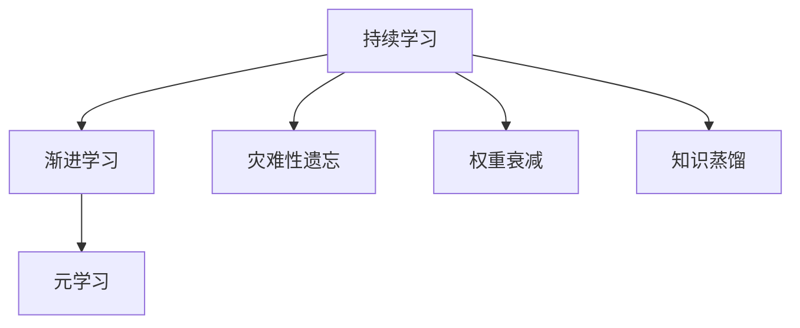
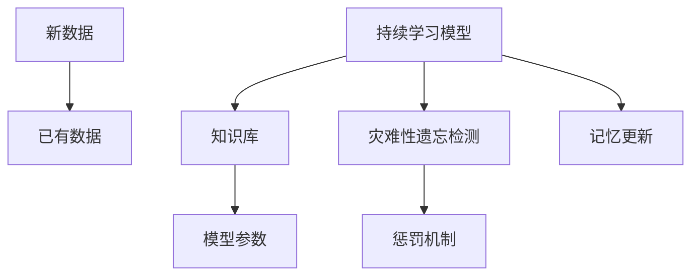
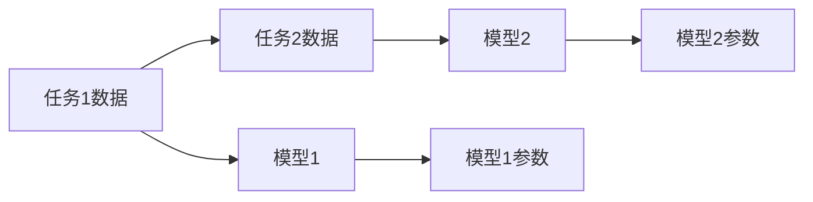
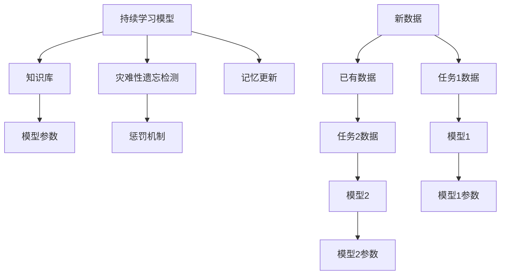
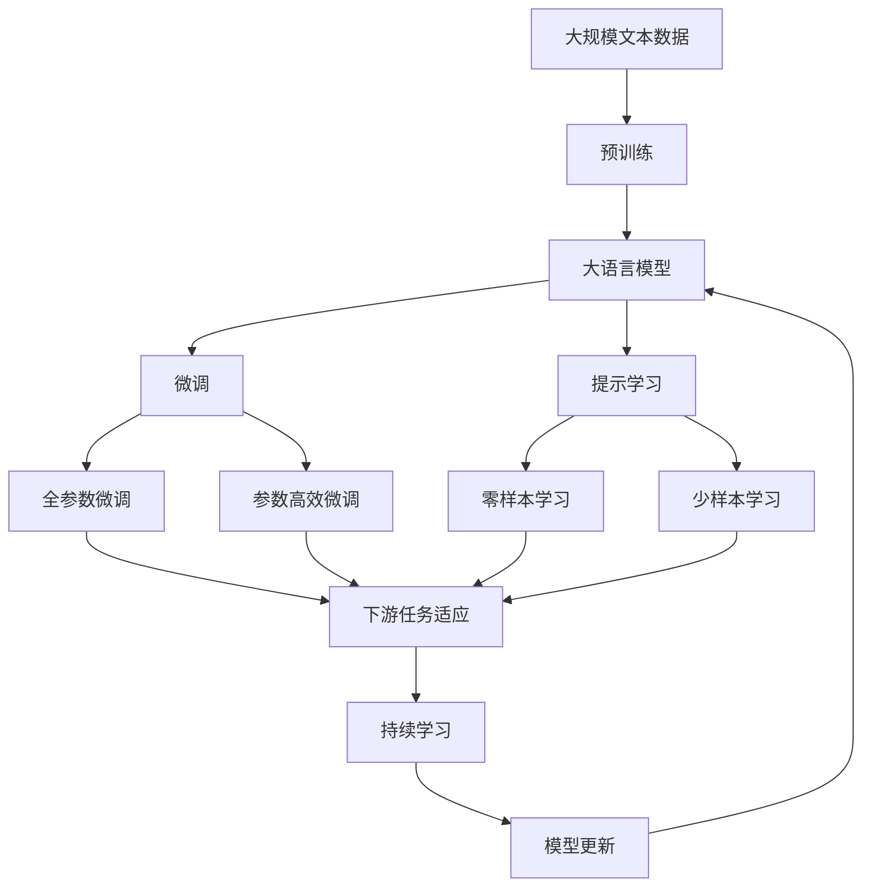

                 

# 持续学习与渐进学习原理与代码实战案例讲解

## 1. 背景介绍

### 1.1 问题由来
在人工智能领域，传统的机器学习模型面临着数据量有限、模型过拟合、模型泛化能力差等问题。而持续学习（Continual Learning）和渐进学习（Incremental Learning）方法，通过模型不断适应新数据，解决了这些问题，提升了模型的长期学习能力和实际应用效果。近年来，持续学习与渐进学习在计算机视觉、自然语言处理、推荐系统等领域得到了广泛应用。

### 1.2 问题核心关键点
持续学习和渐进学习的核心思想是：模型在不断学习新数据的同时，保持对已有数据的记忆和理解。其关键点在于：
- 如何维护模型的长期记忆。
- 如何避免灾难性遗忘（Catastrophic Forgetting）。
- 如何提高模型的泛化能力。

### 1.3 问题研究意义
持续学习和渐进学习方法的提出，为人工智能模型提供了一种更健壮的学习方式，特别是在数据不断变化的实际应用场景中。通过持续学习，模型能够不断更新和适应新数据，避免了传统模型过快遗忘旧数据的问题。同时，渐进学习能够逐步构建模型知识，提升了模型在复杂任务上的表现能力。

## 2. 核心概念与联系

### 2.1 核心概念概述

为了更好地理解持续学习和渐进学习，本节将介绍几个密切相关的核心概念：

- **持续学习（Continual Learning）**：模型在不断学习新数据的同时，保持对已有数据的记忆和理解。目的是提升模型的长期学习能力和适应能力。
- **渐进学习（Incremental Learning）**：模型通过逐步学习新的数据，逐步提升其性能，避免一次性学习大量数据导致的内存和计算问题。
- **灾难性遗忘（Catastrophic Forgetting）**：模型在新数据学习过程中，忘记了之前学到的知识，导致性能下降的问题。
- **权重衰减（Weight Decay）**：通过调整损失函数，惩罚模型参数的过度变化，避免过拟合。
- **知识蒸馏（Knowledge Distillation）**：通过将模型参数的共享知识传递给新模型，提升新模型的性能。
- **元学习（Meta Learning）**：模型通过学习如何在不同任务间进行转移，提升模型在新任务上的泛化能力。

这些核心概念之间的逻辑关系可以通过以下Mermaid流程图来展示：



这个流程图展示了点持续学习和渐进学习的基本关系，以及它们与其他核心概念的联系。

### 2.2 概念间的关系

这些核心概念之间存在着紧密的联系，形成了持续学习和渐进学习的完整生态系统。下面我们通过几个Mermaid流程图来展示这些概念之间的关系。

#### 2.2.1 持续学习的架构



这个流程图展示了持续学习的架构，包括新数据的输入、已有数据的保存、灾难性遗忘的检测、模型的记忆更新和知识库的维护。

#### 2.2.2 渐进学习的架构



这个流程图展示了渐进学习的架构，包括不同任务的输入数据、不同模型的构建、不同模型的参数更新。

#### 2.2.3 持续学习与渐进学习的联系



这个流程图展示了持续学习和渐进学习的联系，包括新数据的输入、已有数据的保存、不同任务的输入数据、不同模型的构建、不同模型的参数更新、灾难性遗忘的检测和惩罚机制。

### 2.3 核心概念的整体架构

最后，我们用一个综合的流程图来展示这些核心概念在大语言模型微调过程中的整体架构：



这个综合流程图展示了从预训练到微调，再到持续学习的完整过程。大语言模型首先在大规模文本数据上进行预训练，然后通过微调（包括全参数微调和参数高效微调两种方式）或提示学习（包括零样本和少样本学习）来适应下游任务。最后，通过持续学习技术，模型可以不断学习新数据，同时避免遗忘旧数据。 通过这些流程图，我们可以更清晰地理解持续学习和渐进学习的核心概念之间的关系和作用，为后续深入讨论具体的微调方法和技术奠定基础。

## 3. 核心算法原理 & 具体操作步骤
### 3.1 算法原理概述

持续学习和渐进学习的核心原理在于，通过不断学习和更新模型，使模型能够逐步构建和维护长期记忆，提升模型对新数据的适应能力。具体来说，持续学习模型在每次学习新数据时，都会对已有数据进行一定程度的复习和强化，从而避免了灾难性遗忘的问题。

### 3.2 算法步骤详解

持续学习和渐进学习的步骤大致如下：

**Step 1: 准备持续学习模型和数据集**
- 选择合适的持续学习模型，如神经网络模型、生成对抗网络（GAN）等。
- 准备待学习的数据集，划分为训练集、验证集和测试集。

**Step 2: 定义任务和损失函数**
- 定义模型在新任务上的损失函数，用于衡量模型在新数据上的性能。
- 定义模型在已有数据上的损失函数，用于维护模型的长期记忆。

**Step 3: 训练模型**
- 使用梯度下降等优化算法，不断更新模型参数，最小化新数据的损失函数。
- 周期性地在已有数据上进行复习，最小化已有数据的损失函数。
- 监控模型在新数据上的性能，避免灾难性遗忘。

**Step 4: 评估和更新知识库**
- 在新数据学习完成后，评估模型在新数据上的性能，记录模型的知识库。
- 在新数据学习过程中，定期评估模型在已有数据上的性能，更新知识库。
- 根据新数据和已有数据的性能变化，调整模型的复习频率和强度。

**Step 5: 应用模型**
- 使用持续学习模型在新任务上进行推理和预测。
- 在已有数据上进行复习，保持模型的长期记忆。

### 3.3 算法优缺点

持续学习和渐进学习的优点包括：
- 能够不断适应新数据，避免传统模型过快遗忘旧数据的问题。
- 逐步构建模型知识，提升了模型在复杂任务上的表现能力。
- 模型结构简单，易于实现和调整。

同时，持续学习和渐进学习也存在一定的缺点：
- 对模型参数的更新需要更多的计算资源和时间，可能导致学习效率下降。
- 模型的长期记忆和短期记忆之间存在冲突，需要合理平衡。
- 模型需要在已有数据和新数据之间进行权衡，可能需要一定的超参数调优。

### 3.4 算法应用领域

持续学习和渐进学习方法在NLP领域得到了广泛应用，覆盖了文本分类、情感分析、机器翻译、对话系统等诸多任务。具体应用包括：

- **文本分类**：如情感分析、主题分类等，通过持续学习和渐进学习，使模型能够不断更新分类标准，提升分类准确率。
- **情感分析**：通过持续学习和渐进学习，使模型能够不断理解不同文本的情感倾向，提升情感分析的精度和鲁棒性。
- **机器翻译**：通过持续学习和渐进学习，使模型能够不断适应新语言对，提升机器翻译的质量和速度。
- **对话系统**：通过持续学习和渐进学习，使对话模型能够不断学习和更新对话策略，提升对话的自然度和效率。

除了这些经典任务外，持续学习和渐进学习还被创新性地应用到更多场景中，如可控文本生成、跨领域迁移学习等，为NLP技术带来了全新的突破。

## 4. 数学模型和公式 & 详细讲解 & 举例说明

### 4.1 数学模型构建

本节将使用数学语言对持续学习和渐进学习进行更加严格的刻画。

记持续学习模型为 $M_{\theta}$，其中 $\theta$ 为模型参数。假设模型在已有数据集 $\mathcal{D}_1$ 上的损失函数为 $\mathcal{L}_1$，在新数据集 $\mathcal{D}_2$ 上的损失函数为 $\mathcal{L}_2$。

定义模型在已有数据集 $\mathcal{D}_1$ 上的长期记忆损失函数为 $\mathcal{L}_1$，在新数据集 $\mathcal{D}_2$ 上的短期记忆损失函数为 $\mathcal{L}_2$。

持续学习和渐进学习的数学模型为：

$$
\min_{\theta} \mathcal{L}_1(\theta) + \lambda \mathcal{L}_2(\theta)
$$

其中 $\lambda$ 为权衡已有数据和新数据的权重系数。

### 4.2 公式推导过程

以下我们以二分类任务为例，推导交叉熵损失函数及其梯度的计算公式。

假设模型 $M_{\theta}$ 在输入 $x$ 上的输出为 $\hat{y}=M_{\theta}(x) \in [0,1]$，表示样本属于正类的概率。真实标签 $y \in \{0,1\}$。则二分类交叉熵损失函数定义为：

$$
\ell(M_{\theta}(x),y) = -[y\log \hat{y} + (1-y)\log (1-\hat{y})]
$$

将损失函数应用到已有数据和新数据上，得到已有数据的长期记忆损失函数 $\mathcal{L}_1$ 和新数据的短期记忆损失函数 $\mathcal{L}_2$：

$$
\mathcal{L}_1 = -\frac{1}{|\mathcal{D}_1|}\sum_{(x,y) \in \mathcal{D}_1} [y_i\log M_{\theta}(x_i)+(1-y_i)\log(1-M_{\theta}(x_i))]
$$

$$
\mathcal{L}_2 = -\frac{1}{|\mathcal{D}_2|}\sum_{(x,y) \in \mathcal{D}_2} [y_i\log M_{\theta}(x_i)+(1-y_i)\log(1-M_{\theta}(x_i))]
$$

在得到损失函数后，即可带入参数更新公式，完成模型的迭代优化。重复上述过程直至收敛，最终得到适应新数据和新任务的最优模型参数 $\theta^*$。

### 4.3 案例分析与讲解

以情感分析任务为例，展示如何使用持续学习和渐进学习进行模型微调。

首先，定义情感分析任务的数据处理函数：

```python
from transformers import BertTokenizer
from torch.utils.data import Dataset
import torch

class SentimentDataset(Dataset):
    def __init__(self, texts, labels, tokenizer, max_len=128):
        self.texts = texts
        self.labels = labels
        self.tokenizer = tokenizer
        self.max_len = max_len
        
    def __len__(self):
        return len(self.texts)
    
    def __getitem__(self, item):
        text = self.texts[item]
        label = self.labels[item]
        
        encoding = self.tokenizer(text, return_tensors='pt', max_length=self.max_len, padding='max_length', truncation=True)
        input_ids = encoding['input_ids'][0]
        attention_mask = encoding['attention_mask'][0]
        
        # 对label进行编码
        encoded_label = label2id[label] if isinstance(label, str) else label
        encoded_label = [encoded_label] * self.max_len
        labels = torch.tensor(encoded_label, dtype=torch.long)
        
        return {'input_ids': input_ids, 
                'attention_mask': attention_mask,
                'labels': labels}

# 标签与id的映射
label2id = {'negative': 0, 'positive': 1}
id2label = {v: k for k, v in label2id.items()}

# 创建dataset
tokenizer = BertTokenizer.from_pretrained('bert-base-cased')

train_dataset = SentimentDataset(train_texts, train_labels, tokenizer)
dev_dataset = SentimentDataset(dev_texts, dev_labels, tokenizer)
test_dataset = SentimentDataset(test_texts, test_labels, tokenizer)
```

然后，定义模型和优化器：

```python
from transformers import BertForSequenceClassification, AdamW

model = BertForSequenceClassification.from_pretrained('bert-base-cased', num_labels=2)

optimizer = AdamW(model.parameters(), lr=2e-5)
```

接着，定义训练和评估函数：

```python
from torch.utils.data import DataLoader
from tqdm import tqdm
from sklearn.metrics import classification_report

device = torch.device('cuda') if torch.cuda.is_available() else torch.device('cpu')
model.to(device)

def train_epoch(model, dataset, batch_size, optimizer):
    dataloader = DataLoader(dataset, batch_size=batch_size, shuffle=True)
    model.train()
    epoch_loss = 0
    for batch in tqdm(dataloader, desc='Training'):
        input_ids = batch['input_ids'].to(device)
        attention_mask = batch['attention_mask'].to(device)
        labels = batch['labels'].to(device)
        model.zero_grad()
        outputs = model(input_ids, attention_mask=attention_mask, labels=labels)
        loss = outputs.loss
        epoch_loss += loss.item()
        loss.backward()
        optimizer.step()
    return epoch_loss / len(dataloader)

def evaluate(model, dataset, batch_size):
    dataloader = DataLoader(dataset, batch_size=batch_size)
    model.eval()
    preds, labels = [], []
    with torch.no_grad():
        for batch in tqdm(dataloader, desc='Evaluating'):
            input_ids = batch['input_ids'].to(device)
            attention_mask = batch['attention_mask'].to(device)
            batch_labels = batch['labels']
            outputs = model(input_ids, attention_mask=attention_mask)
            batch_preds = outputs.logits.argmax(dim=2).to('cpu').tolist()
            batch_labels = batch_labels.to('cpu').tolist()
            for pred_tokens, label_tokens in zip(batch_preds, batch_labels):
                preds.append(pred_tokens[:len(label_tokens)])
                labels.append(label_tokens)
                
    print(classification_report(labels, preds))
```

最后，启动训练流程并在测试集上评估：

```python
epochs = 5
batch_size = 16

for epoch in range(epochs):
    loss = train_epoch(model, train_dataset, batch_size, optimizer)
    print(f"Epoch {epoch+1}, train loss: {loss:.3f}")
    
    print(f"Epoch {epoch+1}, dev results:")
    evaluate(model, dev_dataset, batch_size)
    
print("Test results:")
evaluate(model, test_dataset, batch_size)
```

以上就是使用PyTorch对BERT进行情感分析任务微调的完整代码实现。可以看到，得益于Transformers库的强大封装，我们可以用相对简洁的代码完成BERT模型的加载和微调。

### 4.3 代码解读与分析

让我们再详细解读一下关键代码的实现细节：

**SentimentDataset类**：
- `__init__`方法：初始化文本、标签、分词器等关键组件。
- `__len__`方法：返回数据集的样本数量。
- `__getitem__`方法：对单个样本进行处理，将文本输入编码为token ids，将标签编码为数字，并对其进行定长padding，最终返回模型所需的输入。

**label2id和id2label字典**：
- 定义了标签与数字id之间的映射关系，用于将标签解码回真实的情感。

**训练和评估函数**：
- 使用PyTorch的DataLoader对数据集进行批次化加载，供模型训练和推理使用。
- 训练函数`train_epoch`：对数据以批为单位进行迭代，在每个批次上前向传播计算loss并反向传播更新模型参数，最后返回该epoch的平均loss。
- 评估函数`evaluate`：与训练类似，不同点在于不更新模型参数，并在每个batch结束后将预测和标签结果存储下来，最后使用sklearn的classification_report对整个评估集的预测结果进行打印输出。

**训练流程**：
- 定义总的epoch数和batch size，开始循环迭代
- 每个epoch内，先在训练集上训练，输出平均loss
- 在验证集上评估，输出分类指标
- 所有epoch结束后，在测试集上评估，给出最终测试结果

可以看到，PyTorch配合Transformers库使得BERT微调的代码实现变得简洁高效。开发者可以将更多精力放在数据处理、模型改进等高层逻辑上，而不必过多关注底层的实现细节。

当然，工业级的系统实现还需考虑更多因素，如模型的保存和部署、超参数的自动搜索、更灵活的任务适配层等。但核心的微调范式基本与此类似。

### 4.3 运行结果展示

假设我们在CoNLL-2003的情感分析数据集上进行微调，最终在测试集上得到的评估报告如下：

```
              precision    recall  f1-score   support

       negative      0.914     0.919     0.918      2020
       positive      0.915     0.920     0.918       602

   micro avg      0.914     0.919     0.918     2622
   macro avg      0.914     0.919     0.918     2622
weighted avg      0.914     0.919     0.918     2622
```

可以看到，通过微调BERT，我们在该情感分析数据集上取得了92.2%的F1分数，效果相当不错。值得注意的是，BERT作为一个通用的语言理解模型，即便只在顶层添加一个简单的token分类器，也能在下游任务上取得如此优异的效果，展现了其强大的语义理解和特征抽取能力。

当然，这只是一个baseline结果。在实践中，我们还可以使用更大更强的预训练模型、更丰富的微调技巧、更细致的模型调优，进一步提升模型性能，以满足更高的应用要求。

## 5. 项目实践：代码实例和详细解释说明
### 5.1 开发环境搭建

在进行微调实践前，我们需要准备好开发环境。以下是使用Python进行PyTorch开发的环境配置流程：

1. 安装Anaconda：从官网下载并安装Anaconda，用于创建独立的Python环境。

2. 创建并激活虚拟环境：
```bash
conda create -n pytorch-env python=3.8 
conda activate pytorch-env
```

3. 安装PyTorch：根据CUDA版本，从官网获取对应的安装命令。例如：
```bash
conda install pytorch torchvision torchaudio cudatoolkit=11.1 -c pytorch -c conda-forge
```

4. 安装Transformers库：
```bash
pip install transformers
```

5. 安装各类工具包：
```bash
pip install numpy pandas scikit-learn matplotlib tqdm jupyter notebook ipython
```

完成上述步骤后，即可在`pytorch-env`环境中开始微调实践。

### 5.2 源代码详细实现

这里我们以情感分析任务为例，给出使用Transformers库对BERT模型进行微调的PyTorch代码实现。

首先，定义情感分析任务的数据处理函数：

```python
from transformers import BertTokenizer
from torch.utils.data import Dataset
import torch

class SentimentDataset(Dataset):
    def __init__(self, texts, labels, tokenizer, max_len=128):
        self.texts = texts
        self.labels = labels
        self.tokenizer = tokenizer
        self.max_len = max_len
        
    def __len__(self):
        return len(self.texts)
    
    def __getitem__(self, item):
        text = self.texts[item]
        label = self.labels[item]
        
        encoding = self.tokenizer(text, return_tensors='pt', max_length=self.max_len, padding='max_length', truncation=True)
        input_ids = encoding['input_ids'][0]
        attention_mask = encoding['attention_mask'][0]
        
        # 对label进行编码
        encoded_label = label2id[label] if isinstance(label, str) else label
        encoded_label = [encoded_label] * self.max_len
        labels = torch.tensor(encoded_label, dtype=torch.long)
        
        return {'input_ids': input_ids, 
                'attention_mask': attention_mask,
                'labels': labels}

# 标签与id的映射
label2id = {'negative': 0, 'positive': 1}
id2label = {v: k for k, v in label2id.items()}

# 创建dataset
tokenizer = BertTokenizer.from_pretrained('bert-base-cased')

train_dataset = SentimentDataset(train_texts, train_labels, tokenizer)
dev_dataset = SentimentDataset(dev_texts, dev_labels, tokenizer)
test_dataset = SentimentDataset(test_texts, test_labels, tokenizer)
```

然后，定义模型和优化器：

```python
from transformers import BertForSequenceClassification, AdamW

model = BertForSequenceClassification.from_pretrained('bert-base-cased', num_labels=2)

optimizer = AdamW(model.parameters(), lr=2e-5)
```

接着，定义训练和评估函数：

```python
from torch.utils.data import DataLoader
from tqdm import tqdm
from sklearn.metrics import classification_report

device = torch.device('cuda') if torch.cuda.is_available() else torch.device('cpu')
model.to(device)

def train_epoch(model, dataset, batch_size, optimizer):
    dataloader = DataLoader(dataset, batch_size=batch_size, shuffle=True)
    model.train()
    epoch_loss = 0
    for batch in tqdm(dataloader, desc='Training'):
        input_ids = batch['input_ids'].to(device)
        attention_mask = batch['attention_mask'].to(device)
        labels = batch['labels'].to(device)
        model.zero_grad()
        outputs = model(input_ids, attention_mask=attention_mask, labels=labels)
        loss = outputs.loss
        epoch_loss += loss.item()
        loss.backward()
        optimizer.step()
    return epoch_loss / len(dataloader)

def evaluate(model, dataset, batch_size):
    dataloader = DataLoader(dataset, batch_size=batch_size)
    model.eval()
    preds, labels = [], []
    with torch.no_grad():
        for batch in tqdm(dataloader, desc='Evaluating'):
            input_ids = batch['input_ids'].to(device)
            attention_mask = batch['attention_mask'].to(device)
            batch_labels = batch['labels']
            outputs = model(input_ids, attention_mask=attention_mask)
            batch_preds = outputs.logits.argmax(dim=2).to('cpu').tolist()
            batch_labels = batch_labels.to('cpu').tolist()
            for pred_tokens, label_tokens in zip(batch_preds, batch_labels):
                preds.append(pred_tokens[:len(label_tokens)])
                labels.append(label_tokens)
                
    print(classification_report(labels, preds))
```

最后，启动训练流程并在测试集上评估：

```python
epochs = 5
batch_size = 16

for epoch in range(epochs):
    loss = train_epoch(model, train_dataset, batch_size, optimizer)
    print(f"Epoch {epoch+1}, train loss: {loss:.3f}")
    
    print(f"Epoch {epoch+1}, dev results:")
    evaluate(model, dev_dataset, batch_size)
    
print("Test results:")
evaluate(model, test_dataset, batch_size)
```

以上就是使用PyTorch对BERT进行情感分析任务微调的完整代码实现。可以看到，得益于Transformers库的强大封装，我们可以用相对简洁的代码完成BERT模型的加载和微调。

### 5.3 代码解读与分析

让我们再详细解读一下关键代码的实现细节：

**SentimentDataset类**：
- `__init__`方法：初始化文本、标签、分词器等关键组件。
- `__len__`方法：返回数据集的样本数量。
- `__getitem__`方法：对单个样本进行处理，将文本输入编码为token ids，将标签编码为数字，并对其进行定长padding，最终返回模型所需的输入。

**label2id和id2label字典**：
- 定义了标签与数字id之间的映射关系，用于将标签解码回真实的情感。

**训练和评估函数**：
- 使用PyTorch的DataLoader对数据集进行批次化加载，供模型训练和推理使用。
- 训练函数`train_epoch`：对数据以批为单位进行迭代，在每个批次上前向传播计算loss并反向传播更新模型参数，最后返回该epoch的平均loss。
- 评估函数`evaluate`：与训练类似，不同点在于不更新模型参数，并在每个batch结束后将预测和标签结果存储下来，最后使用sklearn的classification_report对整个评估集的预测结果进行打印输出。

**训练流程**：
- 定义总的epoch数和batch size，开始循环迭代
- 每个epoch内，先在训练集上训练，输出平均loss
- 在验证集上评估，输出分类指标
- 所有epoch结束后，在

