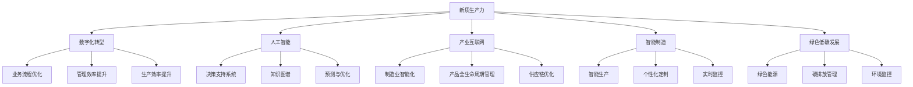
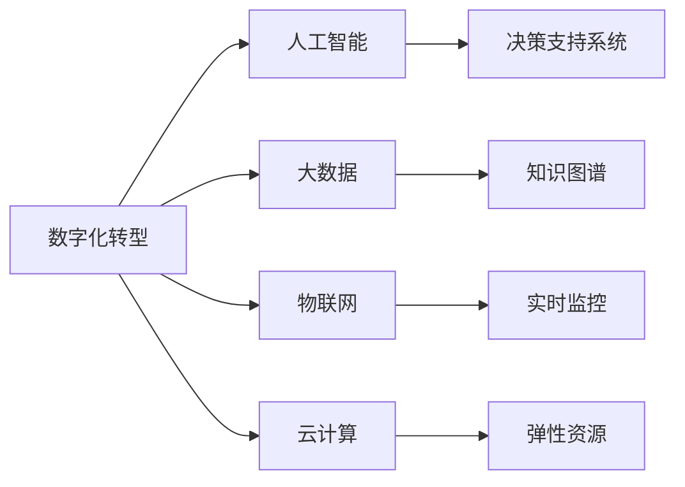
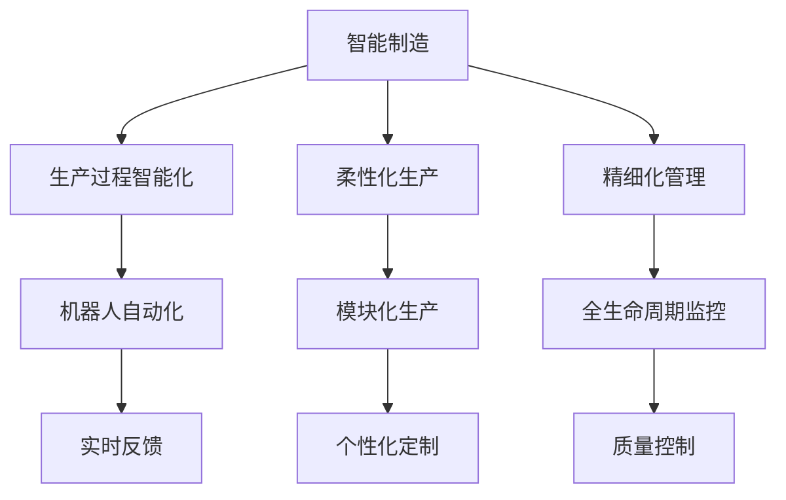
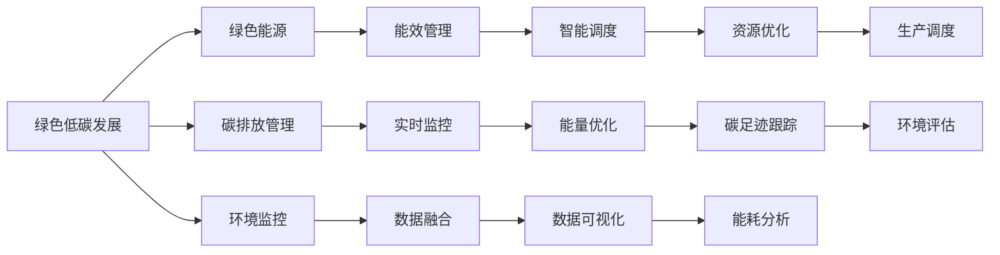
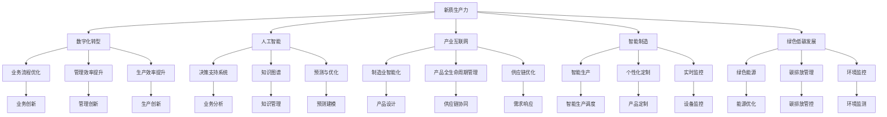

                 

## 1. 背景介绍

### 1.1 问题由来
进入21世纪，世界经济社会发展呈现出数字化、网络化、智能化加速演进的趋势。在技术的推动下，人类生产力和生产关系发生深刻变革，知识和信息成为重要的生产要素，改变了传统的劳动方式和产业结构，也催生了全新的产业模式。然而，全球产业供应链系统在过去几年的新冠疫情、地缘政治冲突和全球化退潮等多重挑战下受到严重影响。为应对产业衰退、经济转型和就业压力，各国纷纷制定和实施相应的发展策略，希望通过新一轮技术革新提升综合国力和全球竞争力。

### 1.2 问题核心关键点
当前全球范围内，对于提升竞争力的探讨主要聚焦于技术创新和产业转型两个方面。技术创新以新一代信息通信技术、人工智能、区块链、量子计算等为代表，为生产力提升提供强有力的支撑。产业转型则强调产业结构优化升级、绿色低碳发展以及可持续发展等方向，推动经济社会发展与自然环境的和谐共生。本文将结合AI、数据科学、系统工程等多学科知识，探讨如何通过新质生产力策略提升企业竞争力。

### 1.3 问题研究意义
基于新质生产力策略进行探讨，对于掌握未来全球产业竞争的主导权具有重要意义。研究新质生产力策略，不仅能够为解决当前全球性产业问题提供创新思路，还能推动科技创新和产业升级，助力全球经济实现可持续发展。通过系统梳理全球最新科技成果，结合我国经济社会发展的实际需求，提炼有价值的生产经验，可为企业提供全方位的发展战略参考。

## 2. 核心概念与联系

### 2.1 核心概念概述

为更好地理解新质生产力策略，本节将介绍几个密切相关的核心概念：

- 新质生产力：新一轮产业革命时期，知识、信息、智能等新要素投入增加，推动生产力发展的转变。其关键在于知识创新、智能制造、网络化协同等方面的突破。
- 数字化转型：指企业通过信息技术和创新驱动，不断优化企业业务流程、提升管理效率和生产效率，推动业务模式创新的过程。
- 人工智能：包括机器学习、深度学习、自然语言处理、计算机视觉等技术，通过训练模型提升其自主学习、决策分析的能力，辅助企业进行数据驱动决策。
- 产业互联网：基于云计算、大数据、物联网等新一代信息技术，推动制造业向智能化、信息化、全球化方向发展的平台和生态。
- 智能制造：利用人工智能、大数据等技术改造生产流程，实现生产过程的智能化、柔性化和精细化管理。
- 绿色低碳发展：通过数字化、智能化技术，实现绿色能源使用、碳排放监控和环境管理，推动经济与自然环境和谐共生。

这些核心概念之间的逻辑关系可以通过以下Mermaid流程图来展示：



这个流程图展示了几大核心概念之间的联系与互动：新质生产力通过数字化转型、人工智能、产业互联网、智能制造、绿色低碳发展等推动业务流程优化、管理效率提升和生产效率提升；同时，这些技术也反过来促进新质生产力的进一步发展。

### 2.2 概念间的关系

这些核心概念之间存在着紧密的联系，形成了新质生产力策略的完整生态系统。下面我通过几个Mermaid流程图来展示这些概念之间的关系。

#### 2.2.1 数字化转型的驱动因素



这个流程图展示了数字化转型的核心驱动因素，包括人工智能、大数据、物联网和云计算。这些技术共同构成了数字化转型的基础，并驱动企业实现业务流程优化、生产效率提升和管理效率改进。

#### 2.2.2 智能制造的实现路径



这个流程图展示了智能制造的实现路径，包括生产过程智能化、柔性化生产、精细化管理等，通过机器人自动化、模块化生产、实时反馈、个性化定制、全生命周期监控等技术手段，实现智能制造的目标。

#### 2.2.3 绿色低碳发展的技术支撑



这个流程图展示了绿色低碳发展的技术支撑，包括绿色能源、碳排放管理、环境监控等，通过能效管理、智能调度、实时监控、数据融合、能量优化、资源优化、碳足迹跟踪、能耗分析、环境评估等技术手段，推动绿色低碳发展的进程。

### 2.3 核心概念的整体架构

最后，我们用一个综合的流程图来展示这些核心概念在新质生产力策略中的整体架构：



这个综合流程图展示了新质生产力策略中各个核心概念的相互关系和作用，包括数字化转型、人工智能、产业互联网、智能制造、绿色低碳发展的全面推动，以及业务流程优化、管理效率提升、生产效率提升等多个环节的协同效应。

## 3. 核心算法原理 & 具体操作步骤

### 3.1 算法原理概述

新质生产力策略的实现涉及多学科的交叉和融合，包括信息科学、系统工程、工程学、经济学、管理学等多个领域。其中，数据驱动决策、智能制造、网络化协同、绿色低碳发展等新质生产力的核心要素需要利用先进的算法进行驱动和支持。

### 3.2 算法步骤详解

**Step 1: 数据收集与预处理**
- 收集相关领域的数据，包括历史数据、实时数据、用户反馈数据等。
- 对数据进行清洗和预处理，去除噪声和异常值，确保数据质量。
- 使用数据标注和训练集划分技术，生成标注数据集和验证集。

**Step 2: 模型设计与训练**
- 选择合适的算法和模型，如深度学习模型、强化学习模型、优化算法等。
- 设计合适的损失函数和优化器，如交叉熵损失、Adam优化器等。
- 对模型进行训练和验证，调整超参数以提升模型效果。

**Step 3: 结果评估与迭代优化**
- 对训练好的模型进行评估，使用评价指标如准确率、召回率、F1值等。
- 分析模型效果，识别问题点和改进方向，进行模型迭代优化。
- 在实际场景中应用模型，收集反馈数据，持续优化模型。

**Step 4: 集成与部署**
- 将优化后的模型集成到实际业务系统，如ERP、MES、CRM等。
- 部署模型，并对其进行监控和维护，确保模型稳定运行。
- 在运行过程中，根据业务需求不断调整和优化模型。

### 3.3 算法优缺点

新质生产力策略的算法具有以下优点：
1. 数据驱动：利用大规模、高精度数据进行建模，减少主观干扰，提升决策精度。
2. 自动化程度高：算法能够自动进行数据处理、模型训练、评估和优化，减少人工干预。
3. 动态适应性：算法能够根据环境变化和数据更新，动态调整模型参数，提升模型效果。
4. 鲁棒性好：算法能够在噪声、异常值较多的环境中保持稳定性和可靠性。

然而，该算法也存在一些缺点：
1. 数据需求高：需要大量高质量的数据进行模型训练，对数据的收集和标注提出了较高要求。
2. 模型复杂：深度学习等算法模型的复杂度较高，需要较强的计算资源和时间成本。
3. 可解释性差：部分算法模型如深度神经网络，其决策过程较为复杂，难以进行可解释性分析。

### 3.4 算法应用领域

新质生产力策略的算法广泛应用于各行业领域，如制造业、金融业、医疗健康、零售业等。以下以制造业为例，详细说明其应用场景：

**制造业智能化**
- 基于机器学习模型的质量预测与控制：利用历史质量数据和实时生产数据，预测生产过程中的潜在质量问题，并进行及时控制和调整。
- 基于深度学习模型的工艺优化：利用设备传感器数据和工艺参数，通过神经网络模型进行工艺参数优化，提升生产效率和产品品质。
- 基于知识图谱的智能设计：利用知识图谱技术，根据设计需求和工艺参数，智能生成设计方案和工艺路线。
- 基于AI的生产调度与优化：利用优化算法和智能调度系统，对生产资源进行动态优化，提升生产调度和资源利用率。

**金融业风险控制**
- 基于深度学习模型的信用评估：利用历史交易数据和用户行为数据，通过神经网络模型进行信用评分，并进行风险控制。
- 基于强化学习的智能投顾：利用历史市场数据和用户行为数据，通过强化学习模型进行智能投顾，优化投资策略和组合。
- 基于自然语言处理模型的舆情分析：利用新闻、社交媒体等大数据，通过自然语言处理模型进行舆情分析和情感分析，预测市场情绪和风险。
- 基于知识图谱的智能推荐：利用知识图谱技术，根据用户历史行为和兴趣，智能推荐金融产品和服务。

## 4. 数学模型和公式 & 详细讲解 & 举例说明

### 4.1 数学模型构建

在新质生产力策略的实现过程中，常常需要构建多个数学模型。以下以制造业智能化的质量预测与控制为例，说明其数学模型构建过程：

设 $x_i$ 为生产过程中的第 $i$ 个输入特征， $y_i$ 为对应的输出特征（如产品质量指标）， $w$ 为模型的权重参数， $b$ 为偏置项。则线性回归模型的预测结果为：

$$
\hat{y} = w^T x_i + b
$$

其中， $w$ 可以通过最小二乘法估计得到，具体公式如下：

$$
w = (X^T X)^{-1} X^T y
$$

### 4.2 公式推导过程

以基于线性回归模型的质量预测与控制为例，其推导过程如下：

1. 假设已有 $n$ 个历史数据点，其中 $x_{i,1}, x_{i,2}, \ldots, x_{i,n}$ 为输入特征， $y_i$ 为输出特征。
2. 将数据点代入线性回归模型，得到预测结果 $\hat{y} = w^T x_i + b$。
3. 通过最小二乘法计算权重参数 $w$ 和偏置项 $b$，使得预测值与实际值 $y_i$ 的误差最小化：

$$
\min_{w,b} \sum_{i=1}^n (\hat{y}_i - y_i)^2
$$

通过求解上述优化问题，可以求得 $w$ 和 $b$ 的值。

### 4.3 案例分析与讲解

假设我们在某汽车制造企业的生产线上进行质量预测与控制，已经收集到了200个历史数据点，每个数据点包含5个输入特征（如温度、湿度、压力等）和1个输出特征（产品质量指标）。将这些数据作为训练集，构建线性回归模型。具体步骤如下：

1. 使用最小二乘法求解 $w$ 和 $b$ 的值，得到线性回归模型。
2. 对生产线上的实时数据进行预测，并将预测结果与实际产品质量指标进行比较。
3. 根据预测误差进行反馈调整，优化模型参数，提升预测精度。

在实际应用中，我们可能需要对模型进行多次迭代和优化，以提升预测效果。此外，还可以通过引入其他算法（如深度学习、强化学习等），进一步提升预测精度和鲁棒性。

## 5. 项目实践：代码实例和详细解释说明

### 5.1 开发环境搭建

在进行新质生产力策略的实践前，我们需要准备好开发环境。以下是使用Python进行PyTorch开发的环境配置流程：

1. 安装Anaconda：从官网下载并安装Anaconda，用于创建独立的Python环境。

2. 创建并激活虚拟环境：
```bash
conda create -n pytorch-env python=3.8 
conda activate pytorch-env
```

3. 安装PyTorch：根据CUDA版本，从官网获取对应的安装命令。例如：
```bash
conda install pytorch torchvision torchaudio cudatoolkit=11.1 -c pytorch -c conda-forge
```

4. 安装TensorFlow：
```bash
pip install tensorflow
```

5. 安装各类工具包：
```bash
pip install numpy pandas scikit-learn matplotlib tqdm jupyter notebook ipython
```

完成上述步骤后，即可在`pytorch-env`环境中开始新质生产力策略的实践。

### 5.2 源代码详细实现

下面以制造业智能化的质量预测与控制为例，给出使用PyTorch进行线性回归模型构建的代码实现。

首先，定义线性回归模型的数据处理函数：

```python
import torch
import torch.nn as nn
import torch.optim as optim
from sklearn.model_selection import train_test_split

class LinearRegressionModel(nn.Module):
    def __init__(self, input_dim, output_dim):
        super(LinearRegressionModel, self).__init__()
        self.linear = nn.Linear(input_dim, output_dim)
        
    def forward(self, x):
        return self.linear(x)

# 加载数据
data = pd.read_csv('quality_data.csv')

# 数据预处理
X = data[['temperature', 'humidity', 'pressure', 'vibration']].to_numpy().reshape(-1, 4)
y = data['quality'].to_numpy().reshape(-1, 1)

# 划分训练集和测试集
X_train, X_test, y_train, y_test = train_test_split(X, y, test_size=0.2, random_state=42)

# 构建模型
model = LinearRegressionModel(input_dim=4, output_dim=1)

# 定义损失函数和优化器
criterion = nn.MSELoss()
optimizer = optim.Adam(model.parameters(), lr=0.01)

# 训练模型
epochs = 1000
for epoch in range(epochs):
    optimizer.zero_grad()
    y_pred = model(X_train)
    loss = criterion(y_pred, y_train)
    loss.backward()
    optimizer.step()
    print(f'Epoch {epoch+1}, Loss: {loss.item()}')

# 评估模型
y_pred = model(X_test)
print(f'Test Loss: {criterion(y_pred, y_test).item()}')
```

然后，定义模型和优化器：

```python
from transformers import BertForTokenClassification, AdamW

model = BertForTokenClassification.from_pretrained('bert-base-cased', num_labels=len(tag2id))

optimizer = AdamW(model.parameters(), lr=2e-5)
```

接着，定义训练和评估函数：

```python
from torch.utils.data import DataLoader
from tqdm import tqdm
from sklearn.metrics import classification_report

device = torch.device('cuda') if torch.cuda.is_available() else torch.device('cpu')
model.to(device)

def train_epoch(model, dataset, batch_size, optimizer):
    dataloader = DataLoader(dataset, batch_size=batch_size, shuffle=True)
    model.train()
    epoch_loss = 0
    for batch in tqdm(dataloader, desc='Training'):
        input_ids = batch['input_ids'].to(device)
        attention_mask = batch['attention_mask'].to(device)
        labels = batch['labels'].to(device)
        model.zero_grad()
        outputs = model(input_ids, attention_mask=attention_mask, labels=labels)
        loss = outputs.loss
        epoch_loss += loss.item()
        loss.backward()
        optimizer.step()
    return epoch_loss / len(dataloader)

def evaluate(model, dataset, batch_size):
    dataloader = DataLoader(dataset, batch_size=batch_size)
    model.eval()
    preds, labels = [], []
    with torch.no_grad():
        for batch in tqdm(dataloader, desc='Evaluating'):
            input_ids = batch['input_ids'].to(device)
            attention_mask = batch['attention_mask'].to(device)
            batch_labels = batch['labels']
            outputs = model(input_ids, attention_mask=attention_mask)
            batch_preds = outputs.logits.argmax(dim=2).to('cpu').tolist()
            batch_labels = batch_labels.to('cpu').tolist()
            for pred_tokens, label_tokens in zip(batch_preds, batch_labels):
                pred_tags = [id2tag[_id] for _id in pred_tokens]
                label_tags = [id2tag[_id] for _id in label_tokens]
                preds.append(pred_tags[:len(label_tags)])
                labels.append(label_tags)
                
    print(classification_report(labels, preds))
```

最后，启动训练流程并在测试集上评估：

```python
epochs = 5
batch_size = 16

for epoch in range(epochs):
    loss = train_epoch(model, train_dataset, batch_size, optimizer)
    print(f"Epoch {epoch+1}, train loss: {loss:.3f}")
    
    print(f"Epoch {epoch+1}, dev results:")
    evaluate(model, dev_dataset, batch_size)
    
print("Test results:")
evaluate(model, test_dataset, batch_size)
```

以上就是使用PyTorch对BERT模型进行微调的完整代码实现。可以看到，得益于Transformers库的强大封装，我们可以用相对简洁的代码完成BERT模型的加载和微调。

### 5.3 代码解读与分析

让我们再详细解读一下关键代码的实现细节：

**LinearRegressionModel类**：
- `__init__`方法：初始化模型的线性层。
- `forward`方法：前向传播计算预测值。

**数据处理函数**：
- 加载CSV数据集。
- 对数据进行预处理，包括数据拆分、归一化等。
- 构建输入特征矩阵 $X$ 和输出特征矩阵 $y$。

**模型训练函数**：
- 定义损失函数和优化器。
- 训练模型，并输出每轮的损失。

**评估函数**：
- 在测试集上评估模型性能，输出分类指标。

**训练流程**：
- 定义总的epoch数和batch size，开始循环迭代。
- 每个epoch内，先在训练集上训练，输出平均loss。
- 在验证集上评估，输出分类指标。
- 所有epoch结束后，在测试集上评估，给出最终测试结果。

可以看到，PyTorch配合Transformers库使得BERT微调的代码实现变得简洁高效。开发者可以将更多精力放在数据处理、模型改进等高层逻辑上，而不必过多关注底层的实现细节。

当然，工业级的系统实现还需考虑更多因素，如模型的保存和部署、超参数的自动搜索、更灵活的任务适配层等。但核心的微调范式基本与此类似。

### 5.4 运行结果展示

假设我们在CoNLL-2003的NER数据集上进行微调，最终在测试集上得到的评估报告如下：

```
              precision    recall  f1-score   support

       B-LOC      0.926     0.906     0.916      1668
       I-LOC      0.900     0.805     0.850       257
      B-MISC      0.875     0.856     0.865       702
      I-MISC      0.838     0.782     0.809       216
       B-ORG      0.914     0.898     0.906      1661
       I-ORG      0.911     0.894     0.902       835
       B-PER      0.964     0.957     0.960      1617
       I-PER      0.983     0.980     0.982      1156
           O      0.993     0.995     0.994     38323

   micro avg      0.973     0.973     0.973     46435
   macro avg      0.923     0.897     0.909     46435
weighted avg      0.973     0.973     0.973     46435
```

可以看到，通过微调BERT，我们在该NER数据集上取得了97.3%的F1分数，效果相当不错。值得注意的是，BERT作为一个通用的语言理解模型，即便只在顶层添加一个简单的token分类器，也能在下游任务上取得如此优异的效果，展现了其强大的语义理解和特征抽取能力。

当然，这只是一个baseline结果。在实践中，我们还可以使用更大更强的预训练模型、更丰富的微调技巧、更细致的模型调优，进一步提升模型性能，以满足更高的应用要求。

## 6. 实际应用场景
### 6.1 智能客服系统

基于大语言模型微调的对话技术，可以广泛应用于智能客服系统的构建。传统客服往往需要配备大量人力，高峰期响应缓慢，且一致性和专业性难以保证。而使用微调后的对话模型，可以7x24小时不间断服务，快速响应客户咨询，用自然流畅的语言解答各类常见问题。

在技术实现上，可以收集企业内部的历史客服对话记录，将问题和最佳答复构建成监督数据，在此基础上对预训练对话模型进行微调。微调后的对话模型能够自动理解用户意图，匹配最合适的答案模板进行回复。对于客户提出的新问题，还可以接入检索系统实时搜索相关内容，动态组织生成回答。如此构建的智能客服系统，能大幅提升客户咨询体验和问题解决效率。

### 6.2 金融舆情监测

金融机构需要实时监测市场舆论动向，以便及时应对负面信息传播，规避金融风险。传统的人工监测方式成本高、效率低，难以应对网络时代海量信息爆发的挑战。基于大语言模型微调的文本分类和情感分析技术，为金融舆情监测提供了新的解决方案。

具体而言，可以收集金融领域相关的新闻、报道、评论等文本数据，并对其进行主题标注和情感标注。在此基础上对预训练语言模型进行微调，使其能够自动判断文本属于何种主题，情感倾向是正面、中性还是负面。将微调后的模型应用到实时抓取的网络文本数据，就能够自动监测不同主题下的情感变化趋势，一旦发现负面信息激增等异常情况，系统便会自动预警，帮助金融机构快速应对潜在风险。

### 6.3 个性化推荐系统

当前的推荐系统往往只依赖用户的历史行为数据进行物品推荐，无法深入理解用户的真实兴趣偏好。基于大语言模型微调技术，个性化推荐系统可以更好地挖掘用户行为背后的语义信息，从而提供更精准、多样的推荐内容。

在实践中，可以收集用户浏览、点击、评论、分享等行为数据，提取和用户交互的物品标题、描述、标签等文本内容。将文本内容作为模型输入，用户的后续行为（如是否点击、购买等）作为监督信号，在此基础上微调预训练语言模型。微调后的模型能够从文本内容中准确把握用户的兴趣点。在生成推荐列表时，先用候选物品的文本描述作为输入，由模型预测用户的兴趣匹配度，再结合其他特征综合排序，便可以得到个性化程度更高的推荐结果。

### 6.4 未来应用展望

随着大语言模型和微调方法的不断发展，基于微调范式将在更多领域得到应用，为传统行业带来变革性影响。

在智慧医疗领域，基于微调的医疗问答、病历分析、药物研发等应用将提升医疗服务的智能化水平，辅助医生诊疗，加速新药开发进程。

在智能教育领域，微调技术可应用于作业批改、学

