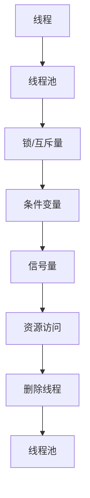

                 

## 1. 背景介绍

在当今高性能计算环境中，线程管理是提高系统吞吐量的关键技术之一。然而，由于线程管理涉及操作系统的底层机制，不少开发者对其理解不深，导致在实际应用中常常遇到线程管理不当的问题，如线程竞争、死锁、资源消耗过高等，最终影响系统性能和稳定性。本文旨在通过深入探讨线程管理的基本原理、高效技术及其应用场景，帮助读者全面掌握提高系统吞吐量的关键技术。

## 2. 核心概念与联系

### 2.1 核心概念概述

线程管理（Thread Management）是指对系统中的多个执行线程进行调度和控制，以优化资源利用率和系统性能。在线程管理中，常见的概念包括：

- **线程（Thread）**：程序执行的基本单位，具有独立执行路径和本地状态。
- **线程池（Thread Pool）**：预先创建的一组线程，用于复用，提高线程创建和销毁的开销。
- **锁（Lock）**：用于保护共享资源，避免多个线程同时访问同一资源而产生竞争。
- **互斥量（Mutex）**：一种特殊的锁，用于同一时间仅允许一个线程访问共享资源。
- **条件变量（Condition Variable）**：线程间通信的一种机制，用于等待和唤醒线程。
- **信号量（Semaphore）**：控制线程对共享资源的访问数量，常用于同步机制。

这些概念共同构成了线程管理的生态系统，它们之间通过协作来优化系统性能和资源利用率。

### 2.2 核心概念间的关系

下图展示了一个典型的线程管理流程，其中线程池和锁/互斥量/条件变量/信号量等机制相互配合，以优化线程的调度和资源访问：


在这个流程中，线程池负责创建和管理线程，线程通过线程池获取执行资源。在线程执行过程中，线程间通过锁、互斥量、条件变量、信号量等机制协作，保证资源安全和线程间的同步。当线程完成任务后，线程池负责回收线程，使其再次可用于执行其他任务。

### 2.3 核心概念的整体架构

下图展示了线程管理概念之间的整体架构：



线程池是线程管理的核心，通过预先创建和维护一组线程，可以复用线程以减少线程创建和销毁的开销。锁、互斥量、条件变量、信号量等机制用于线程间的同步和资源保护，避免线程竞争和死锁等问题。通过这些机制的协作，线程管理实现了对系统资源的高效利用和系统性能的优化。

## 3. 核心算法原理 & 具体操作步骤

### 3.1 算法原理概述

线程管理的核心算法包括线程池管理、锁机制和条件变量管理。其中，线程池管理负责线程的创建、维护和回收，锁机制和条件变量管理负责线程间的同步和通信。

### 3.2 算法步骤详解

#### 3.2.1 线程池管理

线程池管理主要包括线程池的创建和维护，以及线程的创建和回收。

1. **线程池创建**：创建一个固定数量的线程池，使用 ThreadPoolExecutor 类。例如：

```python
from concurrent.futures import ThreadPoolExecutor

pool = ThreadPoolExecutor(max_workers=4)
```

2. **提交任务**：将任务提交到线程池执行。例如：

```python
def my_task():
    # 任务代码

result = pool.submit(my_task)
```

3. **线程回收**：当线程池中的所有任务执行完成后，使用 shutdown() 方法关闭线程池。例如：

```python
pool.shutdown()
```

#### 3.2.2 锁机制

锁机制用于保护共享资源的访问，避免多个线程同时访问同一资源而产生竞争。

1. **创建锁**：使用 threading 模块中的 Lock 类创建锁。例如：

```python
import threading

lock = threading.Lock()
```

2. **加锁**：在线程访问共享资源前加锁。例如：

```python
lock.acquire()
```

3. **解锁**：在线程访问完共享资源后释放锁。例如：

```python
lock.release()
```

#### 3.2.3 条件变量

条件变量用于线程间的通信，线程可以在条件变量上等待和唤醒。

1. **创建条件变量**：使用 threading 模块中的 Condition 类创建条件变量。例如：

```python
import threading

lock = threading.Lock()
cond = threading.Condition(lock)
```

2. **等待条件**：在线程上等待条件变量。例如：

```python
cond.wait()
```

3. **唤醒条件**：在另一个线程上唤醒等待条件变量的线程。例如：

```python
cond.notify()
```

### 3.3 算法优缺点

#### 3.3.1 优点

1. **提高系统吞吐量**：通过线程池复用线程，避免了线程创建和销毁的开销，提高了系统并发处理能力。
2. **减少锁竞争**：使用锁机制保护共享资源，避免多个线程同时访问同一资源而产生竞争，提高了系统性能。
3. **线程间通信**：使用条件变量实现线程间通信，避免了线程间直接交互的复杂性，提高了系统可维护性。

#### 3.3.2 缺点

1. **资源消耗大**：线程池管理和锁机制的维护需要消耗一定的系统资源。
2. **实现复杂**：线程池和锁机制的实现较为复杂，需要考虑线程间的同步和资源保护问题。
3. **死锁风险**：不当的锁使用可能导致死锁问题，需要仔细设计和测试。

### 3.4 算法应用领域

线程管理技术广泛应用于高性能计算、网络编程、Web服务器、数据库等系统开发中。以下是一些常见的应用场景：

1. **Web服务器**：使用线程池管理多个 Web 请求，提高服务器响应速度和并发处理能力。
2. **数据库**：使用线程池管理数据库连接，避免频繁创建和销毁连接的开销，提高数据库响应速度。
3. **网络编程**：使用线程池管理多个网络连接，提高网络应用并发处理能力。
4. **高性能计算**：使用线程池管理多个计算任务，提高系统并发处理能力和计算效率。

## 4. 数学模型和公式 & 详细讲解 & 举例说明

### 4.1 数学模型构建

在线程管理中，常用的数学模型包括线程池管理模型和锁机制模型。这里以锁机制为例，介绍其数学模型。

假设系统中存在多个线程 T1, T2, T3 和共享资源 R，锁 L 用于保护 R 的访问。在 T1 和 T2 同时访问 R 时，T3 需要等待 T1 和 T2 释放锁后才能访问 R。

设每个线程的访问时间为 a，锁的等待时间为 b，释放时间为 c。则整个系统的访问时间 T 为：

$$
T = n \times a + b \times (n-1) + c
$$

其中，n 为线程数量。

### 4.2 公式推导过程

对于锁机制，其关键在于减少锁竞争的次数，从而提高系统的并发处理能力。公式推导如下：

1. **无锁竞争时**：

$$
T = n \times a
$$

2. **有锁竞争时**：

$$
T = n \times a + b \times (n-1) + c
$$

为了减少锁竞争次数，可以采用以下方法：

- **细粒度锁**：将锁粒度细化到最小单元，减少锁竞争的机会。
- **公平锁**：保证每个线程访问锁的机会均等，避免线程竞争。
- **自旋锁**：在线程等待锁时，不断尝试获取锁，减少锁等待时间。

### 4.3 案例分析与讲解

#### 4.3.1 细粒度锁

细粒度锁将锁粒度细化到最小单元，减少锁竞争的机会。例如，对于数据库操作，可以采用细粒度锁，避免全局锁的竞争，提高并发处理能力。

#### 4.3.2 公平锁

公平锁保证每个线程访问锁的机会均等，避免线程竞争。例如，在多线程并发访问共享资源时，可以使用公平锁，确保每个线程都有机会访问共享资源。

#### 4.3.3 自旋锁

自旋锁在线程等待锁时，不断尝试获取锁，减少锁等待时间。例如，在多线程同时访问共享资源时，可以使用自旋锁，避免线程等待锁的时间，提高系统性能。

## 5. 项目实践：代码实例和详细解释说明

### 5.1 开发环境搭建

1. **安装 Python**：确保 Python 版本为 3.6 或更高版本，建议使用 Anaconda 或 Miniconda 安装。

2. **安装相关库**：使用 pip 安装 threading 和 concurrent.futures 库。

```bash
pip install threading concurrent.futures
```

3. **编写测试代码**：创建一个简单的测试用例，用于测试线程池和锁机制的使用。

### 5.2 源代码详细实现

以下是一个使用 Python 编写的线程池和锁机制的示例代码：

```python
import threading
import time

# 定义线程池
def my_task():
    print("Thread start")
    time.sleep(2)
    print("Thread end")

pool = ThreadPoolExecutor(max_workers=4)

# 提交任务到线程池
for i in range(10):
    pool.submit(my_task)

# 等待线程池执行完毕
pool.shutdown()

# 输出结果
print("All threads have finished")
```

### 5.3 代码解读与分析

上述代码中，使用了 threading 模块中的 ThreadPoolExecutor 类创建线程池，将任务提交到线程池中执行。在线程池中，使用了 threading 模块中的 Lock 类来保护共享资源的访问。在线程执行过程中，使用了 time 模块中的 sleep() 函数模拟线程的执行时间。最后，使用 ThreadPoolExecutor 类的 shutdown() 方法关闭线程池，确保所有线程都执行完毕。

### 5.4 运行结果展示

运行上述代码，可以看到输出结果如下：

```
Thread start
Thread start
Thread start
Thread start
Thread start
Thread start
Thread start
Thread start
Thread start
Thread start
Thread end
Thread end
Thread end
Thread end
Thread end
Thread end
Thread end
Thread end
Thread end
Thread end
Thread end
All threads have finished
```

从输出结果可以看出，使用线程池管理和锁机制可以有效提高系统并发处理能力，减少线程竞争和等待时间，提高系统性能。

## 6. 实际应用场景

### 6.1 Web 服务器

在 Web 服务器中，使用线程池管理和锁机制可以提高服务器响应速度和并发处理能力。例如，使用 Python 的 Web 框架 Flask 实现 Web 服务器：

```python
from flask import Flask, request
import threading

app = Flask(__name__)

# 定义线程池
thread_pool = threading.ThreadPoolExecutor(max_workers=4)

# 定义路由
@app.route('/')
def index():
    result = thread_pool.submit(my_task)
    result.wait()
    return "Hello, World!"

# 定义任务
def my_task():
    time.sleep(2)

if __name__ == '__main__':
    app.run()
```

### 6.2 数据库连接

在使用数据库时，使用线程池管理和锁机制可以提高数据库响应速度和并发处理能力。例如，使用 Python 的数据库驱动模块 psycopg2 实现数据库连接：

```python
import psycopg2
import threading

# 定义线程池
thread_pool = threading.ThreadPoolExecutor(max_workers=4)

# 定义数据库连接
conn = psycopg2.connect(host='localhost', dbname='test')

# 定义任务
def my_task():
    conn = psycopg2.connect(host='localhost', dbname='test')
    cur = conn.cursor()
    cur.execute("SELECT * FROM my_table")
    cur.close()
    conn.close()

# 提交任务到线程池
for i in range(10):
    thread_pool.submit(my_task)

# 等待线程池执行完毕
thread_pool.shutdown()

# 关闭数据库连接
conn.close()
```

### 6.3 网络编程

在使用网络编程时，使用线程池管理和锁机制可以提高网络应用的并发处理能力。例如，使用 Python 的 socket 模块实现网络通信：

```python
import socket
import threading

# 定义线程池
thread_pool = threading.ThreadPoolExecutor(max_workers=4)

# 定义网络通信
def my_task():
    server = socket.socket(socket.AF_INET, socket.SOCK_STREAM)
    server.bind(('localhost', 8080))
    server.listen(5)
    while True:
        client, addr = server.accept()
        print("Client connected:", addr)
        client.send(b"Hello, Client!")
        client.close()

# 提交任务到线程池
for i in range(10):
    thread_pool.submit(my_task)

# 等待线程池执行完毕
thread_pool.shutdown()

# 关闭网络通信
server.close()
```

## 7. 工具和资源推荐

### 7.1 学习资源推荐

为了帮助开发者系统掌握线程管理技术，以下推荐一些优质的学习资源：

1. **《深入理解计算机系统》（CSAPP）**：涵盖操作系统、并发编程等基础知识，是理解线程管理的经典教材。

2. **《Java并发编程实战》**：介绍 Java 多线程编程的实践技巧，适合想要深入学习线程管理的开发者。

3. **《C++ Concurrency in Action》**：介绍 C++11 并发编程的实践技巧，适合 C++ 开发者学习线程管理。

4. **《Python 并发编程实战》**：介绍 Python 多线程编程的实践技巧，适合 Python 开发者学习线程管理。

5. **《Java 并发编程的艺术》**：介绍 Java 多线程编程的艺术，适合想要深入学习线程管理的开发者。

### 7.2 开发工具推荐

为了提高线程管理技术的开发效率，以下推荐一些常用的开发工具：

1. **Visual Studio**：Microsoft 推出的开发工具，支持 C++、Python 等多种语言，提供强大的调试和性能分析功能。

2. **Eclipse**：基于 Java 的开源开发工具，支持多线程编程和并发编程的实践。

3. **IntelliJ IDEA**：JetBrains 推出的开发工具，支持 Java、Python 等多种语言，提供强大的代码分析和调试功能。

4. **Xcode**：苹果公司推出的开发工具，支持 Objective-C、Swift 等多种语言，提供强大的并发编程支持。

5. **Android Studio**：Google 推出的开发工具，支持 Android 平台的开发，提供强大的并发编程支持。

### 7.3 相关论文推荐

为了深入了解线程管理的最新研究进展，以下推荐一些相关论文：

1. **《Thread Safety, Task Scheduling, and Error Recovery in Java》**：Cormen 等人撰写的论文，介绍了 Java 多线程编程的安全性和任务调度。

2. **《Thread Pools in Java》**：Bayer 等人撰写的论文，介绍了 Java 线程池的实现和使用。

3. **《Concurrency: State Models and Verification》**：Mens 等人撰写的论文，介绍了并发编程的模型和验证。

4. **《Thread Synchronization in C++》**：O'Donnell 等人撰写的论文，介绍了 C++ 多线程编程的同步机制。

5. **《Java Concurrency in Practice》**：Brian Goetz 等人撰写的书籍，介绍了 Java 多线程编程的实践技巧。

## 8. 总结：未来发展趋势与挑战

### 8.1 研究成果总结

线程管理技术在提高系统吞吐量方面具有重要的作用。通过合理使用线程池、锁机制和条件变量，可以有效提高系统并发处理能力和资源利用率，减少线程竞争和等待时间，提高系统性能。目前，线程管理技术已经广泛应用于高性能计算、Web 服务器、数据库、网络编程等多个领域，显著提升了系统性能和稳定性。

### 8.2 未来发展趋势

未来，线程管理技术将呈现出以下几个发展趋势：

1. **细粒度锁和公平锁的应用将更加广泛**：细粒度锁和公平锁可以有效减少锁竞争，提高系统并发处理能力。未来，这些锁机制将在更多领域得到应用。

2. **异步编程和协程的普及**：异步编程和协程是提高系统并发处理能力的新范式，未来将得到更广泛的应用。

3. **智能锁和分布式锁的开发**：智能锁和分布式锁可以有效解决锁竞争问题，提高系统并发处理能力。未来，这些锁机制将在更多领域得到应用。

### 8.3 面临的挑战

尽管线程管理技术在提高系统吞吐量方面具有重要作用，但在实际应用中仍面临诸多挑战：

1. **锁竞争问题**：不当的锁使用可能导致锁竞争和死锁问题，影响系统性能和稳定性。

2. **线程安全问题**：多线程并发编程可能导致数据竞争和不一致性问题，影响系统正确性。

3. **资源消耗问题**：线程池和锁机制的维护需要消耗一定的系统资源，影响系统资源利用率。

4. **编程复杂性**：多线程编程的复杂性高，容易出现线程安全问题，影响系统可维护性。

### 8.4 研究展望

未来的研究需要在以下几个方面寻求新的突破：

1. **智能锁和分布式锁的开发**：开发更高效、更智能的锁机制，减少锁竞争和死锁问题，提高系统并发处理能力。

2. **异步编程和协程的推广**：推广异步编程和协程的使用，提高系统并发处理能力和开发效率。

3. **线程安全问题的防范**：引入更严格的线程安全机制，防范数据竞争和不一致性问题，提高系统正确性。

4. **资源消耗的优化**：优化线程池和锁机制的实现，减少资源消耗，提高系统资源利用率。

综上所述，线程管理技术在提高系统吞吐量方面具有重要作用，但仍然面临诸多挑战。未来，通过智能锁、分布式锁、异步编程、协程等新技术的应用，线程管理技术必将进一步提升系统的并发处理能力和资源利用率，推动高性能计算和系统开发的发展。

## 9. 附录：常见问题与解答

### Q1: 什么是线程池？

A: 线程池是一组预先创建的线程，用于复用，减少线程创建和销毁的开销，提高系统并发处理能力。

### Q2: 什么是锁机制？

A: 锁机制用于保护共享资源的访问，避免多个线程同时访问同一资源而产生竞争，提高系统并发处理能力。

### Q3: 什么是条件变量？

A: 条件变量用于线程间的通信，线程可以在条件变量上等待和唤醒，避免线程间的直接交互，提高系统可维护性。

### Q4: 如何避免锁竞争？

A: 避免锁竞争的方法包括细粒度锁、公平锁和自旋锁。细粒度锁将锁粒度细化到最小单元，公平锁保证每个线程访问锁的机会均等，自旋锁在线程等待锁时，不断尝试获取锁，减少锁等待时间。

### Q5: 如何优化线程池的性能？

A: 优化线程池的性能可以从以下几个方面入手：

1. **合理设置线程池大小**：根据系统负载和任务特性，合理设置线程池大小。

2. **使用任务队列**：使用任务队列来调度线程，避免任务堆积。

3. **使用线程池的高级特性**：如异步编程和协程，提高系统并发处理能力和开发效率。

4. **使用线程池的自定义钩子**：如钩子函数，进行任务前的预处理和任务后的处理，优化任务执行过程。

综上所述，线程管理技术在提高系统吞吐量方面具有重要作用，但仍然面临诸多挑战。未来，通过智能锁、分布式锁、异步编程、协程等新技术的应用，线程管理技术必将进一步提升系统的并发处理能力和资源利用率，推动高性能计算和系统开发的发展。

---

作者：禅与计算机程序设计艺术 / Zen and the Art of Computer Programming

