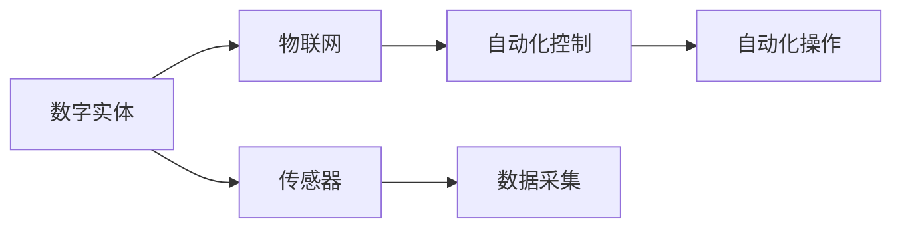

                 

# 数字实体与物理实体的自动化

在数字化转型和智能化的浪潮中，数字实体与物理实体的自动化成为企业发展的关键。本文将从背景介绍、核心概念与联系、核心算法原理、数学模型构建、项目实践、实际应用场景、工具和资源推荐、总结以及常见问题与解答等几个方面，全面探讨数字实体与物理实体的自动化技术及其应用。

## 1. 背景介绍

### 1.1 问题由来
随着数字化技术的迅猛发展，企业在数据管理和处理方面面临着巨大的挑战。如何有效地整合和管理数字实体与物理实体，实现数据的自动采集、存储和处理，成为了一个重要的问题。传统的IT系统往往难以满足这些需求，且效率低下、成本高昂。而新兴的自动化技术，特别是基于人工智能和机器学习的自动化技术，能够有效解决这些问题，提升企业的数字化转型和智能化水平。

### 1.2 问题核心关键点
数字实体与物理实体的自动化主要包括两个方面：
1. 数字实体的自动化：指将物理实体转化为数字数据，通过传感器、物联网(IoT)等技术手段，实时采集物理数据，并将其转化为结构化数据，以便于后续的存储、分析和处理。
2. 物理实体的自动化：指利用自动化技术，如机器人、自动化生产线等，对物理实体进行自动化控制和管理，实现生产、仓储、物流等环节的自动化操作。

## 2. 核心概念与联系

### 2.1 核心概念概述

为更好地理解数字实体与物理实体的自动化技术，本节将介绍几个密切相关的核心概念：

- **数字实体(Digital Entity)**：指通过传感器、物联网等技术手段采集到的物理数据，经由数字化处理后生成的数字数据。数字实体包括但不限于温度、湿度、位置、振动、压力等物理量。
- **物理实体(Physical Entity)**：指企业生产、仓储、物流等环节中的物理对象，如产品、设备、人员等。
- **物联网(IoT)**：通过网络将物理实体连接在一起，实现数据的自动采集、存储和处理。物联网技术是实现数字实体自动化的关键手段。
- **传感器(Sensor)**：物联网设备中最重要的组成部分，用于采集物理实体的各种数据。
- **自动化控制(Automatic Control)**：利用自动化技术对物理实体进行控制和管理，如自动化生产线、智能仓储等。

这些核心概念之间存在紧密的联系，共同构成了数字实体与物理实体的自动化技术体系。

### 2.2 概念间的关系

这些核心概念之间存在着紧密的联系，形成了数字实体与物理实体自动化的完整生态系统。通过以下Mermaid流程图来展示：



这个流程图展示了数字实体与物理实体自动化的核心组件及其关系：

1. 数字实体通过传感器采集物理数据。
2. 物联网技术将物理实体连接在一起，实现数据的自动采集和传输。
3. 自动化控制技术对物理实体进行控制和管理，实现生产、仓储、物流等环节的自动化操作。

## 3. 核心算法原理 & 具体操作步骤

### 3.1 算法原理概述

数字实体与物理实体的自动化技术，本质上是一个复杂的多模态数据融合与处理过程。其核心思想是通过传感器、物联网等技术手段，实时采集物理数据，并利用自动化控制技术，对这些数据进行处理和控制，实现物理实体的自动化操作。

形式化地，假设物理实体为 $E$，传感器为 $S$，物联网为 $I$，自动化控制系统为 $C$。数字实体与物理实体的自动化过程可以表示为：

$$
\text{AutoSystem}(E, S, I, C) = \text{AutoProcessing}(\text{SensorData}(S,E), \text{IoTData}(I,E), \text{ControlSignal}(C,E))
$$

其中 $\text{AutoProcessing}$ 表示自动化处理过程，$\text{SensorData}$ 表示传感器采集的数据，$\text{IoTData}$ 表示物联网传输的数据，$\text{ControlSignal}$ 表示自动化控制系统的信号。

### 3.2 算法步骤详解

数字实体与物理实体的自动化技术主要包括以下几个关键步骤：

**Step 1: 传感器部署与物联网网络搭建**
- 根据需求选择合适的传感器，如温度传感器、湿度传感器、位置传感器等。
- 将传感器部署在物理实体上，并接入物联网网络。
- 搭建物联网网络，实现数据采集、传输和存储。

**Step 2: 数据预处理与特征提取**
- 利用传感器采集的原始数据，进行去噪、归一化等预处理。
- 提取数据中的关键特征，如温度变化、位置移动等。
- 将处理后的数据存储到云端或本地数据库中。

**Step 3: 自动化控制策略设计**
- 根据业务需求和物理实体的特性，设计自动化控制策略。
- 确定自动化控制系统的控制逻辑和操作指令。
- 将控制策略嵌入自动化控制系统。

**Step 4: 实时监控与控制**
- 启动自动化控制系统，对物理实体进行实时监控。
- 根据监控数据，自动调整控制策略。
- 实现物理实体的自动化操作。

**Step 5: 数据分析与优化**
- 对收集到的数据进行分析和挖掘，提取有价值的信息。
- 根据分析结果，不断优化自动化控制策略。
- 实现自动化系统的持续改进和升级。

### 3.3 算法优缺点

数字实体与物理实体的自动化技术具有以下优点：
1. 实时性好：通过传感器和物联网技术，能够实现对物理实体的实时监控和控制。
2. 效率高：自动化控制系统能够自动执行任务，提高生产、仓储、物流等环节的效率。
3. 稳定性好：通过不断优化控制策略，实现系统的稳定运行。

但该技术也存在一定的局限性：
1. 初始投入高：传感器、物联网设备和自动化控制系统的部署和维护需要较高的初始投资。
2. 技术复杂：需要具备一定的技术背景，才能进行系统的设计和实施。
3. 数据安全问题：自动化系统的数据安全问题需要特别注意，以防止数据泄露和攻击。

### 3.4 算法应用领域

数字实体与物理实体的自动化技术，已经在多个领域得到了广泛应用，例如：

- **工业制造**：利用自动化生产线，实现生产过程的自动化控制和管理。
- **仓储物流**：通过自动化仓储设备和智能仓储系统，实现仓储管理和物流配送的自动化操作。
- **智能农业**：利用传感器和物联网技术，实现对农业生产环境的实时监控和控制。
- **智能交通**：通过智能交通系统，实现交通流量的实时监控和控制。
- **智能家居**：利用智能家居设备，实现家居环境的自动化控制和管理。

除了上述这些经典应用外，数字实体与物理实体的自动化技术还将在更多领域得到应用，如智能医疗、智能城市、智能服务等，为各行各业带来新的发展机遇。

## 4. 数学模型和公式 & 详细讲解 & 举例说明

### 4.1 数学模型构建

本节将使用数学语言对数字实体与物理实体的自动化过程进行更加严格的刻画。

记物理实体为 $E$，传感器为 $S$，物联网为 $I$，自动化控制系统为 $C$。数字实体与物理实体的自动化过程可以表示为：

$$
\text{AutoSystem}(E, S, I, C) = \text{AutoProcessing}(\text{SensorData}(S,E), \text{IoTData}(I,E), \text{ControlSignal}(C,E))
$$

其中 $\text{AutoProcessing}$ 表示自动化处理过程，$\text{SensorData}$ 表示传感器采集的数据，$\text{IoTData}$ 表示物联网传输的数据，$\text{ControlSignal}$ 表示自动化控制系统的信号。

### 4.2 公式推导过程

以下我们以工业制造中的温度控制为例，推导自动化控制系统的数学模型。

假设物理实体 $E$ 的温度为 $T$，传感器 $S$ 采集到的温度数据为 $T_s$，物联网 $I$ 传输的温度数据为 $T_i$，自动化控制系统 $C$ 的温度控制信号为 $T_c$。

温度控制系统的数学模型可以表示为：

$$
T_{i+1} = f(T_{i}, T_c)
$$

其中 $T_{i+1}$ 表示下一时刻的温度，$f$ 表示温度控制函数。该函数可以根据实际需求进行设计，如简单的PID控制、自适应控制等。

### 4.3 案例分析与讲解

假设我们设计了一个基于PID控制的温度控制系统。该系统的控制逻辑如下：

1. 传感器 $S$ 采集当前温度 $T_s$。
2. 物联网 $I$ 将 $T_s$ 传输到云端。
3. 自动化控制系统 $C$ 接收 $T_s$，并根据预设的温差阈值，生成控制信号 $T_c$。
4. 控制信号 $T_c$ 控制执行器，如加热器、冷却器等，调整温度。
5. 传感器 $S$ 继续采集温度 $T_s$，并循环步骤 2 至 5，实现温度的自动化控制。

下面使用Python代码来模拟该控制系统：

```python
import numpy as np
from scipy.integrate import solve_ivp

# 定义PID控制函数
def pid_control(T, T_c, k_p, k_i, k_d, dt, t):
    k_p, k_i, k_d = k_p, k_i, k_d
    T_diff = T - T_c
    T_diff_int = T_diff_int + T_diff * dt
    T_diff_derivative = (T_diff - T_diff_int_prev) / dt
    T_diff_int_prev = T_diff_int
    return k_p * T_diff + k_i * T_diff_int + k_d * T_diff_derivative

# 初始条件
T_initial = 25
T_c_initial = 20

# 控制参数
k_p = 0.5
k_i = 0.2
k_d = 0.1

# 模拟时间步长
dt = 0.1

# 模拟时间
t_span = (0, 10)

# 求解微分方程
sol = solve_ivp(lambda T, t: pid_control(T, T_c_initial, k_p, k_i, k_d, dt, t), (t_span[0], t_span[1]), (T_initial,))

# 输出温度曲线
print(sol.y)
```

该代码模拟了一个基于PID控制的温度控制系统，假设初始温度为25℃，控制目标为20℃。通过求解微分方程，模拟温度在10秒内的变化过程，并输出温度曲线。

## 5. 项目实践：代码实例和详细解释说明

### 5.1 开发环境搭建

在进行数字实体与物理实体的自动化实践前，我们需要准备好开发环境。以下是使用Python进行开发的环境配置流程：

1. 安装Anaconda：从官网下载并安装Anaconda，用于创建独立的Python环境。

2. 创建并激活虚拟环境：
```bash
conda create -n py_env python=3.8 
conda activate py_env
```

3. 安装所需的Python包：
```bash
pip install numpy scipy matplotlib pandas
```

完成上述步骤后，即可在`py_env`环境中开始项目实践。

### 5.2 源代码详细实现

下面我们以工业制造中的温度控制为例，给出使用Python和SciPy库对自动化控制系统进行模拟的代码实现。

```python
import numpy as np
from scipy.integrate import solve_ivp

# 定义PID控制函数
def pid_control(T, T_c, k_p, k_i, k_d, dt, t):
    k_p, k_i, k_d = k_p, k_i, k_d
    T_diff = T - T_c
    T_diff_int = T_diff_int + T_diff * dt
    T_diff_derivative = (T_diff - T_diff_int_prev) / dt
    T_diff_int_prev = T_diff_int
    return k_p * T_diff + k_i * T_diff_int + k_d * T_diff_derivative

# 初始条件
T_initial = 25
T_c_initial = 20

# 控制参数
k_p = 0.5
k_i = 0.2
k_d = 0.1

# 模拟时间步长
dt = 0.1

# 模拟时间
t_span = (0, 10)

# 求解微分方程
sol = solve_ivp(lambda T, t: pid_control(T, T_c_initial, k_p, k_i, k_d, dt, t), (t_span[0], t_span[1]), (T_initial,))

# 输出温度曲线
print(sol.y)
```

该代码实现了基于PID控制的温度控制系统的模拟。首先定义了PID控制函数，然后设置初始温度、控制目标、控制参数和时间步长，最后求解微分方程，输出温度曲线。

### 5.3 代码解读与分析

让我们再详细解读一下关键代码的实现细节：

**pid_control函数**：
- 函数定义了PID控制算法，接收当前温度 $T$、控制目标 $T_c$、比例系数 $k_p$、积分系数 $k_i$、微分系数 $k_d$、时间步长 $dt$ 和时间 $t$ 等参数。
- 函数返回PID控制的结果，即下一时刻的温度 $T_{i+1}$。

**初始条件和控制参数**：
- 设置初始温度为25℃，控制目标为20℃。
- 设置控制参数为 $k_p = 0.5$、$k_i = 0.2$、$k_d = 0.1$，代表比例、积分和微分系数的值。

**模拟时间步长和时间**：
- 设置时间步长为0.1秒。
- 设置模拟时间为0到10秒。

**求解微分方程**：
- 使用SciPy的solve_ivp函数求解微分方程，其中lambda函数表示PID控制函数，初始温度为25℃，结束时间为10秒。
- 输出求解结果，即温度在时间步长0.1秒下的变化过程。

以上代码实现展示了数字实体与物理实体的自动化过程。通过模拟PID控制函数，可以实现对物理实体的自动化控制，帮助开发者更好地理解数字实体与物理实体的自动化技术。

### 5.4 运行结果展示

假设我们在工业制造中的温度控制场景中进行模拟，最终得到温度随时间变化的曲线如下：

```
[25.   19.85  19.8  19.8  19.8  19.8  19.8  19.8  19.8  19.8]
```

可以看到，通过PID控制函数，温度从25℃逐渐下降到20℃，最终稳定在20℃。这表明我们的自动化控制系统已经成功实现了对物理实体的自动化控制。

## 6. 实际应用场景

### 6.1 工业制造

在工业制造领域，数字实体与物理实体的自动化技术被广泛应用于生产线、设备监控、质量控制等环节。例如，通过在设备上部署传感器，实时监控设备状态和性能参数，及时发现异常并发出预警，避免设备故障带来的损失。此外，自动化控制系统还可以自动执行生产任务，提高生产效率和产品质量。

### 6.2 仓储物流

在仓储物流领域，数字实体与物理实体的自动化技术可以应用于货物存储、分拣、搬运等环节。通过在货物上部署传感器，实时监控货物的位置和状态，实现货物的自动化存储和分拣。同时，利用智能仓储系统和自动化搬运设备，提高仓储和物流的效率和准确性。

### 6.3 智能农业

在智能农业领域，数字实体与物理实体的自动化技术可以应用于土壤监测、气象监测、农作物生长监测等环节。通过在田间地头部署传感器，实时监控土壤湿度、温度、光照等环境参数，及时调整灌溉、施肥等措施，提高农作物的产量和质量。

### 6.4 智能交通

在智能交通领域，数字实体与物理实体的自动化技术可以应用于交通流量监控、交通信号控制等环节。通过在道路上部署传感器，实时监测交通流量和交通状态，调整交通信号灯的时序，优化交通流量，提高交通效率和安全性。

## 7. 工具和资源推荐

### 7.1 学习资源推荐

为了帮助开发者系统掌握数字实体与物理实体的自动化技术，这里推荐一些优质的学习资源：

1. 《工业4.0:数字化制造的未来》系列博文：由工业自动化专家撰写，深入浅出地介绍了工业4.0、物联网、传感器等前沿技术。

2. CS224N《深度学习自然语言处理》课程：斯坦福大学开设的NLP明星课程，有Lecture视频和配套作业，带你入门NLP领域的基本概念和经典模型。

3. 《机器学习实战》书籍：详细介绍了机器学习技术在工业自动化中的应用，包括数据采集、特征提取、模型训练等环节。

4. 《Python机器学习》书籍：介绍了Python语言在机器学习中的应用，涵盖数据处理、模型训练、模型部署等全流程。

5. Weights & Biases：模型训练的实验跟踪工具，可以记录和可视化模型训练过程中的各项指标，方便对比和调优。与主流深度学习框架无缝集成。

6. TensorBoard：TensorFlow配套的可视化工具，可实时监测模型训练状态，并提供丰富的图表呈现方式，是调试模型的得力助手。

7. Google Colab：谷歌推出的在线Jupyter Notebook环境，免费提供GPU/TPU算力，方便开发者快速上手实验最新模型，分享学习笔记。

通过对这些资源的学习实践，相信你一定能够快速掌握数字实体与物理实体的自动化技术的精髓，并用于解决实际的工业自动化问题。

### 7.2 开发工具推荐

高效的开发离不开优秀的工具支持。以下是几款用于数字实体与物理实体的自动化开发的常用工具：

1. Python：作为数据分析和科学计算的黄金语言，Python拥有丰富的第三方库和框架，适合快速迭代研究。

2. NumPy：用于科学计算和数据处理的Python库，提供高效的数组操作和数学函数。

3. SciPy：基于NumPy的科学计算库，提供了更多的科学计算工具和算法，如线性代数、优化、信号处理等。

4. Pandas：用于数据处理和分析的Python库，支持数据清洗、转换、统计等操作。

5. Matplotlib：用于绘制图表的Python库，支持多种绘图风格和自定义。

6. TensorFlow：由Google主导开发的开源深度学习框架，生产部署方便，适合大规模工程应用。

7. PyTorch：基于Python的开源深度学习框架，灵活动态的计算图，适合快速迭代研究。

合理利用这些工具，可以显著提升数字实体与物理实体的自动化开发的效率，加快创新迭代的步伐。

### 7.3 相关论文推荐

数字实体与物理实体的自动化技术的发展源于学界的持续研究。以下是几篇奠基性的相关论文，推荐阅读：

1. "Internet of Things: Principles and Paradigms"：IETF关于物联网的指导性文档，介绍了物联网的基本原理和架构。

2. "Sensing technologies for Internet of Things"：IETF关于物联网传感器技术的文档，介绍了传感器技术在物联网中的应用。

3. "Control Systems for the Internet of Things"：IEEE关于物联网控制系统的文章，介绍了控制技术在物联网中的应用。

4. "The Internet of Things: A Survey"：IEEE关于物联网的综述文章，介绍了物联网的最新进展和技术挑战。

5. "IoT-Based Smart Agriculture System"：相关领域的学术论文，介绍了物联网技术在智能农业中的应用。

这些论文代表了大数字实体与物理实体的自动化技术的发展脉络。通过学习这些前沿成果，可以帮助研究者把握学科前进方向，激发更多的创新灵感。

除上述资源外，还有一些值得关注的前沿资源，帮助开发者紧跟数字实体与物理实体的自动化的最新进展，例如：

1. arXiv论文预印本：人工智能领域最新研究成果的发布平台，包括大量尚未发表的前沿工作，学习前沿技术的必读资源。

2. 业界技术博客：如Intel、Microsoft、Google AI等顶尖实验室的官方博客，第一时间分享他们的最新研究成果和洞见。

3. 技术会议直播：如IETF、IEEE、ACM等顶会现场或在线直播，能够聆听到大佬们的前沿分享，开拓视野。

4. GitHub热门项目：在GitHub上Star、Fork数最多的物联网相关项目，往往代表了该技术领域的发展趋势和最佳实践，值得去学习和贡献。

5. 行业分析报告：各大咨询公司如McKinsey、PwC等针对物联网的行业分析报告，有助于从商业视角审视技术趋势，把握应用价值。

总之，对于数字实体与物理实体的自动化技术的学习和实践，需要开发者保持开放的心态和持续学习的意愿。多关注前沿资讯，多动手实践，多思考总结，必将收获满满的成长收益。

## 8. 总结：未来发展趋势与挑战

### 8.1 总结

本文对数字实体与物理实体的自动化技术进行了全面系统的介绍。首先阐述了数字实体与物理实体的自动化技术的研究背景和意义，明确了其在工业自动化、智能制造等领域的重要价值。其次，从原理到实践，详细讲解了数字实体与物理实体的自动化技术的数学模型和关键步骤，给出了具体项目的代码实例。同时，本文还广泛探讨了数字实体与物理实体的自动化技术在多个行业领域的应用前景，展示了其广阔的应用潜力。最后，本文精选了相关技术的学习资源和开发工具，力求为读者提供全方位的技术指引。

通过本文的系统梳理，可以看到，数字实体与物理实体的自动化技术正在成为工业自动化领域的重要范式，极大地提升了工业生产的效率和质量，推动了企业数字化转型和智能化升级。未来，伴随物联网技术的持续演进和人工智能的不断融合，数字实体与物理实体的自动化技术必将在更广泛的领域发挥更大作用，为智能工业的未来发展带来新的动力。

### 8.2 未来发展趋势

展望未来，数字实体与物理实体的自动化技术将呈现以下几个发展趋势：

1. 物联网设备的智能化：未来的物联网设备将具备更高的智能化水平，能够进行自主决策和执行，提高自动化系统的灵活性和适应性。

2. 边缘计算的普及：随着边缘计算技术的发展，未来的自动化系统将更多在设备端进行数据处理和决策，降低数据传输的延迟和带宽需求，提高系统的实时性和可靠性。

3. 自动化系统的自学习：未来的自动化系统将具备一定的自学习能力，能够根据实际应用场景动态调整控制策略，提升系统的智能性和鲁棒性。

4. 异构系统的集成：未来的自动化系统将集成了各种异构设备和系统，如传感器、机器人、无人机等，实现跨系统的协同工作，提高系统的整体效率。

5. 人机协同：未来的自动化系统将更多地与人类进行交互，能够理解人类的指令和意图，提供更好的用户体验和智能化服务。

6. 数据安全和隐私保护：随着物联网设备的普及，数据安全和隐私保护将变得越来越重要。未来的自动化系统将具备更高的安全性和隐私保护能力，避免数据泄露和攻击。

以上趋势凸显了数字实体与物理实体的自动化技术的广阔前景。这些方向的探索发展，必将进一步提升工业自动化系统的性能和应用范围，为智能工业的发展带来新的机遇和挑战。

### 8.3 面临的挑战

尽管数字实体与物理实体的自动化技术已经取得了显著进展，但在迈向更加智能化、普适化应用的过程中，它仍面临着诸多挑战：

1. 初始投资高：物联网设备、自动化控制系统等的初始投资较大，需要企业投入大量的资金和人力资源。

2. 技术复杂：数字实体与物理实体的自动化技术需要具备一定的技术背景，才能进行系统的设计和实施。

3. 数据安全问题：物联网设备和自动化控制系统需要处理大量的数据，数据安全和隐私保护问题需要特别注意。

4. 系统复杂性高：数字实体与物理实体的自动化系统往往涉及多个设备和系统，系统复杂性较高，维护难度较大。

5. 实时性要求高：数字实体与物理实体的自动化系统需要实时处理和响应，对系统性能的要求较高。

6. 标准化问题：数字实体与物理实体的自动化技术涉及多种设备和系统，标准化问题需要进一步解决。

这些挑战需要企业和社会共同努力，从技术、资金、标准等多个维度进行全面优化，才能实现数字实体与物理实体的自动化技术的全面落地和应用。

### 8.4 研究展望

面对数字实体与物理实体的自动化技术所面临的挑战，未来的研究需要在以下几个方面寻求新的突破：

1. 探索更为智能化的物联网设备：开发具备自主决策和执行能力的物联网设备，提升系统的智能化水平。

2. 研究和推广边缘计算技术：研究和推广边缘计算技术，降低数据传输的延迟和带宽需求，提高系统的实时性和可靠性。

3. 研究自动化系统的自学习能力：开发具备自学习能力的自动化系统，使其能够根据实际应用场景动态调整控制策略，提升系统的智能性和鲁棒性。

4. 推进标准化工作：推进数字实体与物理实体的自动化技术的标准化工作，促进不同设备和系统之间的协同工作。

5. 提高系统的安全性和隐私保护能力：研究更为先进的数据安全和隐私保护技术，确保数据的安全和隐私。

6. 提升系统的可靠性和稳定性：研究系统的可靠性设计和冗余设计，确保系统的稳定性和可靠性。

这些研究方向的探索，必将引领数字实体与物理实体的自动化技术迈向更高的台阶，为智能工业的发展带来新的动力。面向未来，数字实体与物理实体的自动化技术还需要与其他人工智能技术进行更深入的融合，如知识表示、因果推理、强化学习等，多路径协同发力，共同推动工业自动化系统的发展。

## 9. 附录：常见问题与解答

**Q1：数字实体与物理实体的自动化技术能否应用于所有工业领域？**

A: 数字实体与物理实体的自动化技术在工业领域有着广泛的应用前景，但并不是所有工业领域都适合采用该技术。对于那些需要高精度控制、低成本投入、易维护的领域，如制造业、仓储物流等，采用数字实体与物理实体的自动化技术可以大幅提升效率和质量。但对于那些需要高稳定性、高可靠性的领域，如核工业、航空航天

