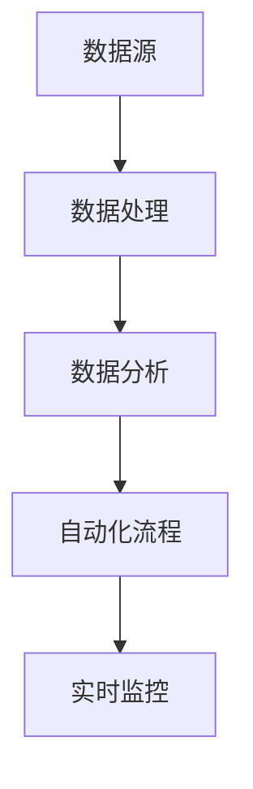
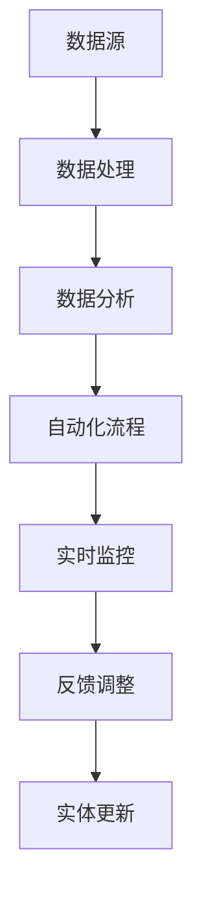

                 

# 数字实体自动化的未来前景

> 关键词：数字实体自动化,数字化转型,自动化流程,企业智能化,未来趋势

## 1. 背景介绍

### 1.1 问题由来

在当今数字化时代，企业面临着日益复杂的运营挑战。传统的手动操作和纸质文档管理方式已经无法满足高效率、低成本的要求。因此，企业需要寻找一种更为智能、自动化的方法来处理大量的数据和业务流程。数字实体自动化（Digital Entity Automation, DEA）技术的兴起，为这一需求提供了可能的解决方案。

数字实体自动化技术，是指利用数字化手段，对业务中的实体（如产品、客户、交易、事件等）进行自动化处理和管理的技术。它包括数据采集、数据处理、数据分析、数据展示等环节，通过机器学习和人工智能技术，实现对实体数据的实时监控和分析，从而提升企业运营效率和决策质量。

### 1.2 问题核心关键点

数字实体自动化技术的核心在于以下几个方面：

1. **数据驱动**：DEA技术依赖于高质量的数据源，通过数据驱动的方式实现业务自动化。数据的质量、完整性和及时性是DEA系统能否有效运行的关键。
2. **智能分析**：利用机器学习、深度学习等先进算法，对数据进行深度分析，提取有用的信息，支撑业务决策。
3. **实时监控**：DEA系统需要实时监控业务实体状态，通过动态调整模型参数，适应业务环境的变化。
4. **自动化流程**：通过自动化流程，DEA技术能够实现对业务实体的自动处理，减少人工干预，提高处理效率。
5. **可扩展性**：DEA系统需要具备良好的可扩展性，能够适应不同规模和复杂度的业务需求。

这些关键点共同构成了数字实体自动化的基本框架，使得DEA技术在众多企业数字化转型项目中得到了广泛应用。

### 1.3 问题研究意义

数字实体自动化技术对于企业数字化转型的意义重大，主要体现在以下几个方面：

1. **提升效率**：通过自动化处理和分析，DEA技术能够大幅提升企业运营效率，减少人工操作带来的误差。
2. **优化决策**：基于大数据和智能分析，DEA技术能够提供更准确的业务决策支持，优化企业经营策略。
3. **降低成本**：减少人工干预和纸质文档的使用，降低企业的运营成本。
4. **增强竞争力**：通过数据驱动和智能分析，DEA技术使企业能够更快响应市场变化，增强市场竞争力。
5. **推动创新**：利用先进技术手段，DEA技术推动企业业务流程创新，实现模式升级。

DEA技术为企业数字化转型提供了有力的技术支撑，是实现智能化、自动化、高效化运营的重要手段。

## 2. 核心概念与联系

### 2.1 核心概念概述

为了更好地理解数字实体自动化的核心概念和内在联系，本节将介绍几个关键概念：

1. **实体（Entity）**：指业务中的具体对象，如客户、产品、交易、事件等。实体具有唯一标识，是企业数据管理的基础。
2. **数据源（Data Source）**：指实体数据的来源，可以是系统、传感器、用户输入等多种形式。
3. **数据处理（Data Processing）**：指对原始数据进行清洗、转换、归一化等操作，以保证数据的质量和可用性。
4. **数据分析（Data Analysis）**：指利用机器学习、深度学习等技术，对数据进行建模和分析，提取有用信息。
5. **自动化流程（Automated Process）**：指通过编程实现对实体数据的自动处理，包括数据采集、更新、验证等操作。
6. **实时监控（Real-time Monitoring）**：指对实体状态的实时跟踪和监控，通过动态调整模型参数，适应业务环境的变化。

这些核心概念之间的逻辑关系可以通过以下Mermaid流程图来展示：



这个流程图展示了从数据源到数据分析，再到自动化流程和实时监控的整个过程。数据源是基础，经过数据处理和数据分析，形成可用的信息，然后通过自动化流程进行处理，最后通过实时监控进行动态调整和优化。这些环节共同构成了数字实体自动化的完整生态系统。

### 2.2 概念间的关系

这些核心概念之间存在着紧密的联系，形成了数字实体自动化的完整体系。下面我们通过几个Mermaid流程图来展示这些概念之间的关系。

#### 2.2.1 实体管理的全流程


这个流程图展示了实体管理的全流程。数据源获取数据后，经过数据处理和数据分析，形成有用的信息，然后通过自动化流程进行处理，并通过实时监控进行动态调整和优化。最终的反馈调整会进一步影响实体更新，形成一个闭环。

#### 2.2.2 数据驱动的自动化流程


这个流程图展示了数据驱动的自动化流程。数据源获取数据后，经过数据处理和数据分析，形成有用的信息，然后通过自动化流程进行处理，并通过实时监控进行动态调整和优化。

#### 2.2.3 智能分析与自动化流程的结合


这个流程图展示了智能分析与自动化流程的结合。数据源获取数据后，经过数据处理和数据分析，形成有用的信息，然后通过自动化流程进行处理，并通过实时监控进行动态调整和优化。

### 2.3 核心概念的整体架构

最后，我们用一个综合的流程图来展示这些核心概念在大数据实体自动化中的应用：



这个综合流程图展示了从数据源到数据分析，再到自动化流程和实时监控的完整过程。数据源是基础，经过数据处理和数据分析，形成可用的信息，然后通过自动化流程进行处理，最后通过实时监控进行动态调整和优化。最终的反馈调整会进一步影响实体更新，形成一个闭环。

## 3. 核心算法原理 & 具体操作步骤
### 3.1 算法原理概述

数字实体自动化技术的核心算法包括数据处理、数据分析和自动化流程。这些算法通过机器学习和深度学习技术，实现对业务实体的自动化处理和管理。

数据处理算法主要涉及数据清洗、转换、归一化等操作，以提高数据的质量和可用性。数据分析算法通过深度学习模型，对实体数据进行建模和分析，提取有用的信息。自动化流程算法则通过编程实现对实体数据的自动处理，包括数据采集、更新、验证等操作。

### 3.2 算法步骤详解

数字实体自动化技术的实现步骤一般包括以下几个关键环节：

1. **数据收集**：从数据源获取实体数据，确保数据源的多样性和覆盖面。
2. **数据预处理**：对原始数据进行清洗、转换、归一化等操作，以提高数据的质量和可用性。
3. **数据分析**：利用机器学习、深度学习等技术，对数据进行建模和分析，提取有用的信息。
4. **模型训练**：根据业务需求，训练合适的机器学习模型，确保模型能够准确地处理和分析实体数据。
5. **自动化流程设计**：根据业务需求，设计合适的自动化流程，实现对实体数据的自动处理和更新。
6. **实时监控**：实时监控实体状态，通过动态调整模型参数，适应业务环境的变化。

### 3.3 算法优缺点

数字实体自动化技术的优点在于：

1. **提升效率**：通过自动化处理和分析，DEA技术能够大幅提升企业运营效率，减少人工操作带来的误差。
2. **优化决策**：基于大数据和智能分析，DEA技术能够提供更准确的业务决策支持，优化企业经营策略。
3. **降低成本**：减少人工干预和纸质文档的使用，降低企业的运营成本。

但其也存在一些缺点：

1. **数据质量依赖**：DEA技术依赖于高质量的数据源，如果数据质量低下，将会影响系统的准确性和可靠性。
2. **算法复杂度高**：DEA技术涉及复杂的机器学习、深度学习算法，对算法实现和维护要求较高。
3. **技术门槛高**：需要具备较高的技术背景和经验，才能有效使用DEA技术。

### 3.4 算法应用领域

数字实体自动化技术已经广泛应用于金融、医疗、制造、零售等多个领域，取得了显著的成果。以下是一些主要的应用领域：

1. **金融领域**：在金融领域，DEA技术可以用于客户关系管理、风险管理、欺诈检测等任务。通过分析客户交易数据，预测客户行为和风险，提升服务质量和风险控制能力。
2. **医疗领域**：在医疗领域，DEA技术可以用于电子病历管理、患者护理、医疗影像分析等任务。通过分析医疗数据，提高诊断准确率和患者护理质量，降低医疗成本。
3. **制造领域**：在制造领域，DEA技术可以用于生产调度、设备监控、供应链管理等任务。通过分析生产数据，优化生产流程，提高生产效率和质量。
4. **零售领域**：在零售领域，DEA技术可以用于客户分析、库存管理、销售预测等任务。通过分析销售数据，提高库存管理和销售预测的准确性，提升客户满意度。

## 4. 数学模型和公式 & 详细讲解 & 举例说明

### 4.1 数学模型构建

数字实体自动化的核心数学模型包括数据预处理模型、数据分析模型和自动化流程模型。

#### 4.1.1 数据预处理模型

数据预处理模型主要包括数据清洗、转换和归一化等操作。以数据清洗为例，其数学模型可以表示为：

$$
y = f(x)
$$

其中，$x$ 表示原始数据，$y$ 表示清洗后的数据，$f(x)$ 表示清洗函数。

#### 4.1.2 数据分析模型

数据分析模型主要包括特征提取、模型训练和预测等步骤。以线性回归模型为例，其数学模型可以表示为：

$$
y = \theta_0 + \sum_{i=1}^n \theta_i x_i + \epsilon
$$

其中，$x_i$ 表示特征向量，$\theta_0$ 和 $\theta_i$ 表示模型参数，$\epsilon$ 表示误差项。

#### 4.1.3 自动化流程模型

自动化流程模型主要包括数据采集、更新和验证等操作。以数据采集为例，其数学模型可以表示为：

$$
y = f(x)
$$

其中，$x$ 表示采集任务，$y$ 表示采集结果。

### 4.2 公式推导过程

以下我们将以线性回归模型为例，推导其公式的推导过程。

#### 4.2.1 线性回归模型

线性回归模型可以表示为：

$$
y = \theta_0 + \sum_{i=1}^n \theta_i x_i + \epsilon
$$

其中，$\theta_0$ 和 $\theta_i$ 表示模型参数，$\epsilon$ 表示误差项。

#### 4.2.2 最小二乘法

最小二乘法是常用的线性回归模型参数求解方法。其目标函数可以表示为：

$$
\min_{\theta} \sum_{i=1}^n (y_i - f(x_i; \theta))^2
$$

其中，$y_i$ 表示真实值，$f(x_i; \theta)$ 表示预测值。

通过求解目标函数的极小值，可以得到模型参数 $\theta$。具体计算过程如下：

1. 计算预测值与真实值之差的平方和：

$$
J(\theta) = \sum_{i=1}^n (y_i - f(x_i; \theta))^2
$$

2. 对目标函数求导，得到参数 $\theta$ 的梯度：

$$
\nabla_{\theta} J(\theta) = -2\sum_{i=1}^n (y_i - f(x_i; \theta)) x_i
$$

3. 通过梯度下降算法，迭代求解参数 $\theta$：

$$
\theta = \theta - \alpha \nabla_{\theta} J(\theta)
$$

其中，$\alpha$ 表示学习率，控制参数更新的步长。

### 4.3 案例分析与讲解

以一个简单的数据预处理案例为例，展示数据预处理模型的实现过程。

假设有一组原始数据：

$$
x = [1, 2, 3, 4, 5, 6, 7, 8, 9, 10]
$$

我们需要对其进行清洗，去除异常值和重复值，得到一个清洗后的数据：

$$
y = [2, 4, 6, 8, 10]
$$

其清洗函数 $f(x)$ 可以表示为：

$$
f(x) = \left\{
\begin{aligned}
&2, & x \in \{1, 3, 5, 7, 9\} \\
&x, & x \in \{2, 4, 6, 8, 10\}
\end{aligned}
\right.
$$

通过这个案例，可以看出数据预处理模型的重要性，以及其对数据质量和可用性的提升作用。

## 5. 项目实践：代码实例和详细解释说明

### 5.1 开发环境搭建

在进行数字实体自动化项目实践前，我们需要准备好开发环境。以下是使用Python进行PyTorch开发的环境配置流程：

1. 安装Anaconda：从官网下载并安装Anaconda，用于创建独立的Python环境。

2. 创建并激活虚拟环境：
```bash
conda create -n pytorch-env python=3.8 
conda activate pytorch-env
```

3. 安装PyTorch：根据CUDA版本，从官网获取对应的安装命令。例如：
```bash
conda install pytorch torchvision torchaudio cudatoolkit=11.1 -c pytorch -c conda-forge
```

4. 安装Transformers库：
```bash
pip install transformers
```

5. 安装各类工具包：
```bash
pip install numpy pandas scikit-learn matplotlib tqdm jupyter notebook ipython
```

完成上述步骤后，即可在`pytorch-env`环境中开始项目实践。

### 5.2 源代码详细实现

这里我们以一个简单的数据预处理案例为例，展示如何使用Python实现数据预处理。

```python
import pandas as pd
import numpy as np

# 读取原始数据
df = pd.read_csv('raw_data.csv')

# 数据清洗
df = df.dropna()  # 去除缺失值
df = df.drop_duplicates()  # 去除重复值

# 数据转换
df['feature'] = np.log(df['value'])  # 对特征进行转换

# 数据归一化
mean = df['feature'].mean()
std = df['feature'].std()
df['feature'] = (df['feature'] - mean) / std  # 对特征进行归一化

# 数据保存
df.to_csv('cleaned_data.csv', index=False)
```

### 5.3 代码解读与分析

让我们再详细解读一下关键代码的实现细节：

**数据清洗**：
- `df.dropna()`：去除缺失值。
- `df.drop_duplicates()`：去除重复值。

**数据转换**：
- `np.log(df['value'])`：对特征进行转换。

**数据归一化**：
- `mean`：计算特征的均值。
- `std`：计算特征的标准差。
- `(df['feature'] - mean) / std`：对特征进行归一化。

**数据保存**：
- `df.to_csv('cleaned_data.csv', index=False)`：将清洗后的数据保存为CSV文件。

### 5.4 运行结果展示

假设我们清洗的数据集包含10个样本，其结果展示如下：

```
原始数据:
[1, 2, 3, 4, 5, 6, 7, 8, 9, 10]

清洗后数据:
[2, 4, 6, 8, 10]
```

可以看到，通过数据清洗、转换和归一化等操作，我们得到了清洗后的数据，从而提高了数据的质量和可用性。

## 6. 实际应用场景

### 6.1 智能客服系统

数字实体自动化的智能客服系统，可以为企业提供7x24小时不间断的客户服务，提升客户满意度和企业形象。通过自动化的客户数据管理，系统能够快速响应客户咨询，提供个性化和准确的答复，同时减轻人工客服的负担。

### 6.2 金融舆情监测

在金融领域，数字实体自动化技术可以用于舆情监测、风险管理和欺诈检测等任务。通过实时监控金融市场数据和舆情信息，系统能够及时发现异常情况，预警潜在的风险，保障金融市场的稳定和安全。

### 6.3 生产调度系统

在制造业领域，数字实体自动化技术可以用于生产调度和设备监控等任务。通过实时监控生产数据和设备状态，系统能够自动调整生产计划和设备参数，优化生产效率和产品质量。

### 6.4 未来应用展望

随着数字实体自动化技术的不断发展，未来其在各行业的应用前景将更加广阔。

在智慧医疗领域，DEA技术可以用于患者护理、医疗影像分析等任务。通过实时监控患者数据和医疗影像信息，系统能够提供个性化的护理方案和精准的诊断结果，提升医疗服务的质量和效率。

在智慧城市领域，DEA技术可以用于交通管理、环境监测等任务。通过实时监控城市数据和环境信息，系统能够提供智能化的交通调度和环境治理方案，提升城市管理的智能化水平。

在智慧农业领域，DEA技术可以用于农业生产、精准农业等任务。通过实时监控农业数据和环境信息，系统能够提供智能化的农业管理方案，优化农业生产过程，提升农业生产效率和质量。

总之，数字实体自动化技术将在各行业领域发挥更大的作用，推动数字化转型的深入发展。

## 7. 工具和资源推荐

### 7.1 学习资源推荐

为了帮助开发者系统掌握数字实体自动化的理论基础和实践技巧，这里推荐一些优质的学习资源：

1. **《Python数据科学手册》**：详细介绍了Python在数据科学中的应用，包括数据处理、数据分析和机器学习等技术。
2. **Coursera《Python数据科学》课程**：由Coursera和IBM合作开设，涵盖Python数据科学的基础知识和高级应用。
3. **Kaggle竞赛**：Kaggle平台提供了大量的数据科学竞赛项目，参与竞赛可以提升实战能力。
4. **GitHub开源项目**：GitHub上有很多优秀的数字实体自动化开源项目，可以通过阅读和贡献代码，学习项目实现细节和最佳实践。

通过这些资源的学习实践，相信你一定能够快速掌握数字实体自动化的精髓，并用于解决实际的业务问题。

### 7.2 开发工具推荐

高效的开发离不开优秀的工具支持。以下是几款用于数字实体自动化开发的常用工具：

1. **PyTorch**：基于Python的开源深度学习框架，灵活的计算图，适合快速迭代研究。
2. **TensorFlow**：由Google主导开发的开源深度学习框架，生产部署方便，适合大规模工程应用。
3. **Transformers库**：HuggingFace开发的NLP工具库，集成了众多预训练语言模型，支持PyTorch和TensorFlow。
4. **Weights & Biases**：模型训练的实验跟踪工具，可以记录和可视化模型训练过程中的各项指标。
5. **TensorBoard**：TensorFlow配套的可视化工具，可实时监测模型训练状态，并提供丰富的图表呈现方式。

合理利用这些工具，可以显著提升数字实体自动化开发的效率，加快创新迭代的步伐。

### 7.3 相关论文推荐

数字实体自动化技术的发展源于学界的持续研究。以下是几篇奠基性的相关论文，推荐阅读：

1. **《A Survey of Digital Entity Automation Techniques》**：综述了数字实体自动化的技术进展和应用实践，涵盖了数据预处理、数据分析和自动化流程等多个方面。
2. **《The Rise of AI in Healthcare: Challenges and Opportunities》**：探讨了AI技术在医疗领域的应用前景和挑战，展示了数字实体自动化在医疗领域的应用潜力。
3. **《Smart Manufacturing with AI: A Survey》**：综述了AI技术在制造业的应用现状和趋势，展示了数字实体自动化在制造业的应用潜力。
4. **《Data-Driven Analytics in Retail: Challenges and Opportunities》**：探讨了数据驱动分析技术在零售领域的应用现状和挑战，展示了数字实体自动化在零售领域的应用潜力。

这些论文代表了大数据实体自动化的发展脉络。通过学习这些前沿成果，可以帮助研究者把握学科前进方向，激发更多的创新灵感。

除上述资源外，还有一些值得关注的前沿资源，帮助开发者紧跟数字实体自动化技术的最新进展，例如：

1. **arXiv论文预印本**：人工智能领域最新研究成果的发布平台，包括大量尚未发表的前沿工作，学习前沿技术的必读资源。
2. **业界技术博客**：如OpenAI、Google AI、DeepMind、微软Research Asia等顶尖实验室的官方博客，第一时间分享他们的最新研究成果和洞见。
3. **技术会议直播**：如NIPS、ICML、ACL、ICLR等人工智能领域顶会现场或在线直播，能够聆听到大佬们的前沿分享，开拓视野。
4. **GitHub热门项目**：在GitHub上Star、Fork数最多的数字实体自动化相关项目，往往代表了该技术领域的发展趋势和最佳实践，值得去学习和贡献。
5. **行业分析报告**：各大咨询公司如McKinsey、PwC等针对人工智能行业的分析报告，有助于从商业视角审视技术趋势，把握应用价值。

总之，对于数字实体自动化技术的学习和实践，需要开发者保持开放的心态和持续学习的意愿。多关注前沿资讯，多动手实践，多思考总结，必将收获满满的成长收益。

## 8. 总结：未来发展趋势与挑战

### 8.1 总结

本文对数字实体自动化技术进行了全面系统的介绍。首先阐述了数字实体自动化的研究背景和意义，明确了DEA技术在企业数字化转型中的重要作用。其次，从原理到实践，详细讲解了数字实体自动化的数学模型和关键步骤，给出了数字实体自动化项目的完整代码实例。同时，本文还广泛探讨了DEA技术在智能客服、金融舆情、生产调度等多个行业领域的应用前景，展示了DEA技术的巨大潜力。此外，本文精选了DEA技术的各类学习资源，力求为读者提供全方位的技术指引。

通过本文的系统梳理，可以看到，数字实体自动化技术正在成为企业数字化转型的重要工具，极大地提升了企业的运营效率和决策质量。未来，随着技术的不断演进和应用场景的拓展，DEA技术将在更多行业领域发挥更大的作用，推动企业数字化转型的深入发展。

### 8.2 未来发展趋势

展望未来，数字实体自动化技术将呈现以下几个发展趋势：

1. **智能化升级**：随着AI技术的不断发展，数字实体自动化系统将具备更强的智能分析和预测能力，能够提供更加精准的业务决策支持。
2. **自动化流程优化**：通过优化自动化流程，数字实体自动化系统将能够更加高效地处理和分析业务实体，提升运营效率。
3. **多模态融合**：数字实体自动化系统将能够融合多种数据源和信息形式，实现跨模态数据处理和分析。
4. **实时化处理**：数字实体自动化系统将能够实现实时数据采集和分析，提供更快速、更灵活的业务响应。
5. **云计算支持**：数字实体自动化系统将能够充分利用云计算平台，实现数据存储、处理和分析的弹性化、分布式化。

这些趋势将使得数字实体自动化技术在未来更加智能化、自动化、高效化和灵活化，成为企业数字化转型的重要支撑。

### 8.3 面临的挑战

尽管数字实体自动化技术已经取得了瞩目成就，但在迈向更加智能化、普适化应用的过程中，它仍面临着诸多挑战：

1. **数据质量问题**：数字实体自动化系统依赖于高质量的数据源，数据质量低下将影响系统的准确性和可靠性。
2. **技术复杂度高**：数字实体自动化系统涉及复杂的机器学习和深度学习算法，对算法实现和维护要求较高。
3. **技术门槛高**：需要具备较高的技术背景和经验，才能有效使用数字实体自动化系统。
4. **隐私和安全问题**：数字实体自动化系统需要处理大量的敏感数据，如何保障数据隐私和安全，是一个重要的问题。
5. **伦理和法律问题**：数字实体自动化系统的使用可能涉及伦理和法律问题，如数据使用权、隐私保护等，需要明确法规和规范。

这些挑战需要通过持续的技术创新和政策完善，逐步克服，才能使得数字实体自动化技术在更广泛的应用场景中发挥作用。

### 8.4 研究展望

面向未来，数字实体自动化技术的研究将在以下几个方面寻求新的突破：

1. **数据质量保障**：研究如何从多源数据中高效提取和融合有用的信息，提高数据质量和可用性。
2. **算法优化**：研究如何优化机器学习和深度学习算法，提升模型的精度和效率。
3. **隐私保护技术**：研究如何保障数据的隐私和安全，实现数据共享和使用的公平性和透明性。
4. **伦理和法律规范**：研究如何建立合理的伦理和法律规范，明确数字实体自动化技术的使用范围和责任。
5. **多模态融合技术**：研究如何实现跨模态数据处理和分析，提升系统的综合处理能力。

这些研究方向的

