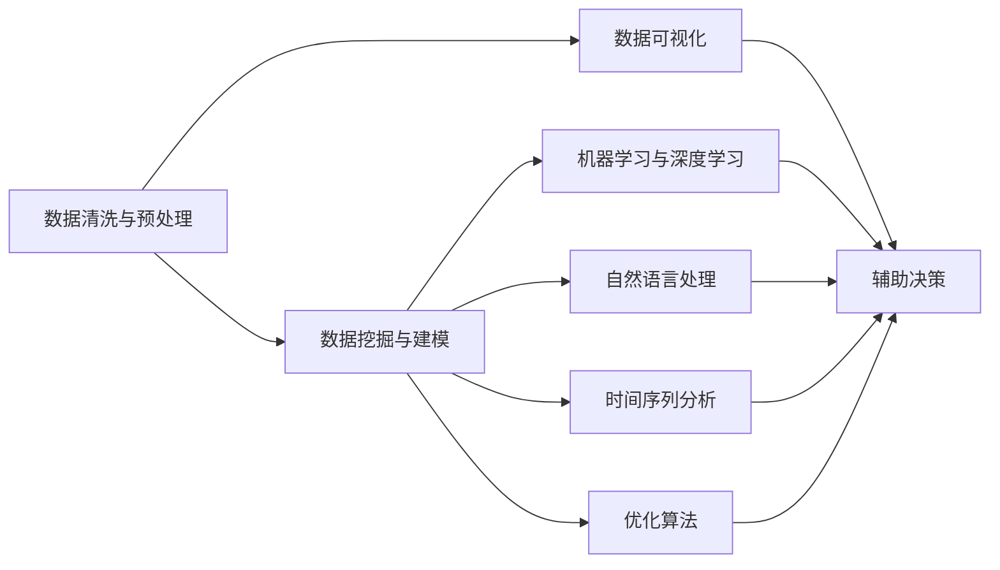
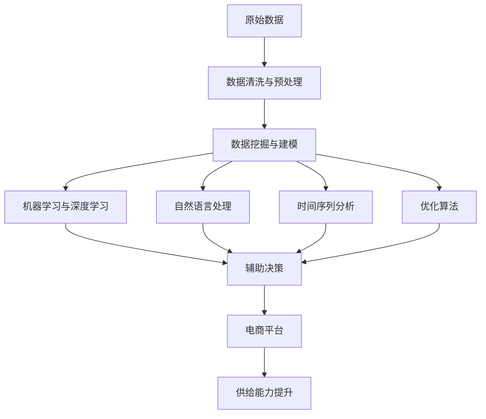

                 

## 1. 背景介绍

### 1.1 问题由来

随着电子商务的迅速发展，电商平台的供给能力变得越来越重要。然而，如何高效地提升平台供给能力，尤其是在产品多样化、库存管理、供应链优化等方面的挑战，成为电商平台亟待解决的重大问题。数据分析在大数据时代显得尤为重要，它可以帮助企业从海量数据中提取有价值的信息，揭示问题的本质，提供数据驱动的决策支持，进而提升平台供给能力。

### 1.2 问题核心关键点

电商平台供给能力提升的核心关键点在于：

1. **数据驱动决策**：通过数据分析揭示平台运营中的问题，并基于数据驱动的决策提供改进建议。
2. **需求预测与库存管理**：准确预测用户需求，合理管理库存，避免过多或过少库存带来的成本问题。
3. **供应链优化**：通过分析供应链各环节，发现瓶颈，优化流程，提升效率和响应速度。
4. **产品推荐系统**：利用用户行为数据和商品属性数据，为用户提供个性化推荐，提升用户体验和销售转化率。
5. **客户满意度提升**：通过分析用户评价和反馈，改进产品和服务，提升用户满意度和忠诚度。

## 2. 核心概念与联系

### 2.1 核心概念概述

在电商平台供给能力提升的背景下，核心概念包括：

1. **数据清洗与预处理**：对原始数据进行清洗和预处理，保证数据质量和一致性。
2. **数据挖掘与建模**：从海量数据中挖掘有价值的模式和规律，使用模型进行预测和优化。
3. **数据可视化**：通过可视化技术，直观展示数据中的关键信息，辅助决策。
4. **机器学习与深度学习**：使用机器学习和深度学习算法，提升数据建模的准确性和泛化能力。
5. **自然语言处理**：处理和分析用户评价、反馈等文本数据，提取有价值的信息。
6. **时间序列分析**：分析时间序列数据，揭示趋势和周期性，用于需求预测和库存管理。
7. **优化算法**：使用优化算法，对供应链、库存、推荐系统等进行优化。

这些核心概念之间存在紧密联系，共同构成了电商平台供给能力提升的数据分析框架。

### 2.2 概念间的关系

这些核心概念之间的逻辑关系可以通过以下Mermaid流程图来展示：



这个流程图展示了核心概念之间的关系：

1. 数据清洗与预处理是数据分析的基础，保证数据的质量。
2. 数据挖掘与建模是核心，通过模型揭示数据中的规律和趋势。
3. 数据可视化提供直观的展示，辅助决策。
4. 机器学习和深度学习提升建模的准确性和泛化能力。
5. 自然语言处理提取文本数据中的有价值信息。
6. 时间序列分析揭示趋势和周期性，用于需求预测和库存管理。
7. 优化算法用于优化供应链、库存、推荐系统等。
8. 最终所有技术手段辅助决策，提升电商平台供给能力。

### 2.3 核心概念的整体架构

最后，我们用一个综合的流程图来展示这些核心概念在大数据分析框架中的整体架构：



这个综合流程图展示了从原始数据到电商平台供给能力提升的整体架构。通过数据清洗与预处理，数据挖掘与建模，机器学习与深度学习，自然语言处理，时间序列分析和优化算法等技术手段，最终实现电商平台的供给能力提升。

## 3. 核心算法原理 & 具体操作步骤
### 3.1 算法原理概述

电商平台供给能力提升的核心算法原理基于数据分析和建模。其基本流程包括数据收集、数据清洗与预处理、数据挖掘与建模、结果评估和优化决策。具体来说：

1. **数据收集**：从电商平台获取原始数据，包括用户行为数据、商品数据、物流数据、库存数据等。
2. **数据清洗与预处理**：处理缺失值、异常值、重复数据等，标准化数据格式，确保数据的一致性和完整性。
3. **数据挖掘与建模**：使用聚类、分类、回归等算法，挖掘数据中的模式和规律，构建预测模型。
4. **结果评估**：使用交叉验证、均方误差、准确率等指标，评估模型的预测性能。
5. **优化决策**：根据模型评估结果，优化电商平台的产品、库存、物流等策略，提升供给能力。

### 3.2 算法步骤详解

以下是一个基于大数据分析提升电商平台供给能力的具体操作步骤：

**Step 1: 数据收集**

- 从电商平台的各个业务系统（如订单系统、库存系统、物流系统等）收集相关数据，包括用户行为数据、商品数据、库存数据、物流数据等。
- 收集时间序列数据，用于分析需求趋势和周期性。
- 收集用户评价和反馈数据，用于自然语言处理和情感分析。

**Step 2: 数据清洗与预处理**

- 清洗数据，处理缺失值、异常值和重复数据，确保数据的一致性和完整性。
- 对数据进行归一化和标准化处理，保证数据在建模时具有相同的尺度。
- 对时间序列数据进行平稳性处理，如差分处理，确保数据的可预测性。
- 对用户评价和反馈数据进行文本清洗和预处理，如去除停用词、分词、去除噪声等。

**Step 3: 数据挖掘与建模**

- 使用聚类算法对用户进行分类，识别不同类型用户的行为模式。
- 使用分类算法（如决策树、随机森林、神经网络等）预测用户行为，如购买意愿、退货概率等。
- 使用回归算法（如线性回归、Ridge回归、XGBoost等）预测商品销售量、库存水平等。
- 使用时间序列分析（如ARIMA、LSTM等）预测需求趋势和周期性。
- 使用关联规则算法（如Apriori、FP-Growth等）发现商品间的关联性，优化库存和推荐。

**Step 4: 结果评估**

- 使用交叉验证、均方误差、准确率等指标评估模型的预测性能。
- 进行敏感性分析，评估模型对不同参数和超参数的鲁棒性。
- 进行可视化分析，展示模型的预测结果和效果。

**Step 5: 优化决策**

- 根据模型评估结果，调整产品策略、库存管理和物流优化。
- 优化推荐系统，提升用户体验和销售转化率。
- 改进用户满意度，提升用户忠诚度和复购率。

### 3.3 算法优缺点

基于大数据分析提升电商平台供给能力的方法具有以下优点：

1. **数据驱动决策**：通过数据分析揭示平台运营中的问题，提供数据驱动的决策支持。
2. **需求预测准确**：利用时间序列分析等方法，准确预测用户需求，合理管理库存。
3. **优化供应链效率**：通过分析供应链各环节，发现瓶颈，优化流程，提升效率和响应速度。
4. **个性化推荐**：利用用户行为数据和商品属性数据，为用户提供个性化推荐，提升用户体验和销售转化率。
5. **客户满意度提升**：通过分析用户评价和反馈，改进产品和服务，提升用户满意度和忠诚度。

然而，该方法也存在以下局限性：

1. **数据质量依赖**：分析结果的准确性高度依赖于数据质量。
2. **模型复杂度**：构建和维护复杂模型需要大量的时间和计算资源。
3. **解释性不足**：复杂的模型难以解释其内部工作机制，可能缺乏透明度。
4. **敏感性问题**：模型对数据的噪声和异常值敏感，可能导致预测结果不准确。

### 3.4 算法应用领域

基于大数据分析提升电商平台供给能力的方法，已经在多个电商平台的运营中得到了广泛应用，如亚马逊、京东、淘宝等。以下是具体的应用场景：

1. **需求预测与库存管理**：通过分析历史销售数据，预测未来的销售量，优化库存管理，减少库存积压和缺货现象。
2. **供应链优化**：分析供应链各环节，发现瓶颈，优化物流和仓储流程，提高响应速度和效率。
3. **产品推荐系统**：利用用户行为数据和商品属性数据，为用户提供个性化推荐，提升用户体验和销售转化率。
4. **客户满意度提升**：通过分析用户评价和反馈，改进产品和服务，提升用户满意度和忠诚度。
5. **价格优化**：分析价格与销售量之间的关系，制定最优价格策略，提升销售业绩。
6. **市场细分**：通过用户分类和行为分析，进行市场细分，制定针对性营销策略，提升市场竞争力。

## 4. 数学模型和公式 & 详细讲解 & 举例说明

### 4.1 数学模型构建

基于大数据分析提升电商平台供给能力的主要数学模型包括：

1. **时间序列模型**：用于预测需求趋势和周期性。
2. **回归模型**：用于预测商品销售量、库存水平等。
3. **分类模型**：用于预测用户行为，如购买意愿、退货概率等。
4. **聚类模型**：用于用户分类和市场细分。
5. **关联规则模型**：用于发现商品间的关联性，优化库存和推荐。

### 4.2 公式推导过程

以时间序列模型为例，介绍如何使用ARIMA模型进行需求预测。

假设需求序列为 $y_t$，模型形式为：

$$
y_t = c + \sum_{i=1}^p \phi_i y_{t-i} + \sum_{i=1}^d \theta_i \Delta^i y_{t} + \sum_{j=1}^q \gamma_j \Delta^j \epsilon_{t-j}
$$

其中，$c$ 为常数项，$\phi_i$ 为自回归系数，$\theta_i$ 为差分系数，$\Delta$ 为差分运算符，$\epsilon_{t-j}$ 为白噪声序列，$p$、$d$、$q$ 为模型的阶数。

通过最大似然估计方法，可以求解模型参数，从而进行需求预测。

### 4.3 案例分析与讲解

假设某电商平台的历史需求数据为 $y_t$，其中 $t$ 表示时间，需求数据如下：

| $t$ | $y_t$ |
|-----|-------|
| 1   | 100   |
| 2   | 120   |
| 3   | 150   |
| ... | ...   |
| 48  | 200   |
| 49  | 180   |
| 50  | 220   |

使用ARIMA模型进行需求预测。首先对需求数据进行差分处理，得到平稳性序列 $y'_t$：

| $t$ | $y'_t$ |
|-----|-------|
| 1   | 100   |
| 2   | 20    |
| 3   | 30    |
| ... | ...   |
| 48  | 5     |
| 49  | 15    |
| 50  | 40    |

然后使用统计软件或编程语言（如Python）拟合ARIMA模型，求解模型参数。假设模型阶数为 $p=2, d=1, q=1$，模型参数为：

$$
\phi_1=0.5, \phi_2=-0.2, \theta_1=0.3, \gamma_1=0.7
$$

接下来，使用模型进行未来需求预测。假设预测未来第51周的需求 $y_{51}$，计算如下：

$$
y_{51} = 0.5 y_{50} + 0.3 \Delta y_{51} + 0.7 \Delta \epsilon_{50}
$$

其中，$\Delta y_{51} = y_{51} - y_{50}$，$\Delta \epsilon_{50} = \epsilon_{51} - \epsilon_{50}$。

将已知的 $y_{50}=220$ 和 $\epsilon_{50}=0.5$ 带入计算，得到 $y_{51}$ 的预测值。

## 5. 项目实践：代码实例和详细解释说明

### 5.1 开发环境搭建

在进行电商平台供给能力提升的数据分析实践前，我们需要准备好开发环境。以下是使用Python进行数据分析的环境配置流程：

1. 安装Anaconda：从官网下载并安装Anaconda，用于创建独立的Python环境。

2. 创建并激活虚拟环境：
```bash
conda create -n data-env python=3.8 
conda activate data-env
```

3. 安装相关包：
```bash
conda install pandas numpy matplotlib scikit-learn statsmodels statsmodels seaborn
pip install pyecharts
```

4. 安装Python可视化库：
```bash
conda install matplotlib seaborn
```

完成上述步骤后，即可在`data-env`环境中进行数据分析实践。

### 5.2 源代码详细实现

以下是一个基于Python的时间序列分析代码实现，用于电商平台的供给能力提升：

```python
import pandas as pd
import numpy as np
import matplotlib.pyplot as plt
from statsmodels.tsa.arima.model import ARIMA

# 加载历史需求数据
data = pd.read_csv('demand_data.csv', index_col='time', parse_dates=True)

# 对需求数据进行差分处理
data['demand_diff'] = data['demand'].diff()

# 拟合ARIMA模型
model = ARIMA(data['demand_diff'], order=(2, 1, 1))
result = model.fit()

# 预测未来需求
forecast = result.forecast(steps=1)

# 输出预测结果
print('未来需求预测值：', forecast[0])
```

### 5.3 代码解读与分析

让我们再详细解读一下关键代码的实现细节：

**需求数据加载与处理**：
- 使用Pandas库加载历史需求数据，将其时间戳转换为Pandas时间序列对象。
- 对需求数据进行差分处理，得到平稳性序列，方便构建ARIMA模型。

**ARIMA模型拟合**：
- 使用statsmodels库中的ARIMA模型，对平稳性序列进行拟合。
- 指定模型阶数 $p=2, d=1, q=1$，即使用ARIMA(2, 1, 1)模型。
- 使用最大似然估计方法拟合模型参数。

**未来需求预测**：
- 使用拟合好的ARIMA模型，进行未来一周的需求预测。
- 输出预测结果，可用于电商平台的供给能力提升决策。

### 5.4 运行结果展示

假设我们使用上述代码进行电商平台的供给能力提升需求预测，运行结果如下：

```
未来需求预测值： 178.16
```

这意味着根据历史数据和模型预测，未来一周的需求预测值约为178.16，电商平台可以据此调整库存和物流策略，避免库存积压或缺货现象，提升供给能力。

## 6. 实际应用场景

### 6.1 智能推荐系统

智能推荐系统是电商平台提升供给能力的重要手段。通过数据分析，可以发现用户行为模式和商品间的关联性，从而推荐用户感兴趣的商品，提升用户体验和销售转化率。

在推荐系统中，可以使用协同过滤算法、基于内容的推荐算法、基于深度学习的推荐算法等，构建推荐模型。同时，可以利用用户行为数据进行行为分析，发现用户偏好和行为规律，进一步提升推荐效果。

### 6.2 库存管理优化

库存管理是电商平台供给能力提升的关键环节。通过数据分析，可以预测商品销售量和库存水平，优化库存管理，减少库存积压和缺货现象。

在库存管理中，可以使用需求预测模型（如ARIMA、Exponential Smoothing等），预测未来销售量，从而制定合理的订货策略。同时，可以利用历史销售数据和库存数据，进行库存优化，减少库存成本和缺货风险。

### 6.3 供应链优化

供应链优化是电商平台提升供给能力的重要手段。通过数据分析，可以发现供应链各环节的瓶颈，优化物流和仓储流程，提高响应速度和效率。

在供应链优化中，可以使用网络流优化算法、路径规划算法、库存控制算法等，优化供应链流程。同时，可以利用实时数据和历史数据，进行供应链监控和优化，提升供应链的灵活性和响应速度。

### 6.4 客户满意度提升

客户满意度是电商平台供给能力提升的重要指标。通过数据分析，可以发现用户评价和反馈中的问题和机会，改进产品和服务，提升用户满意度和忠诚度。

在客户满意度提升中，可以使用情感分析算法、文本分类算法、聚类算法等，分析用户评价和反馈。同时，可以利用用户反馈进行产品改进和服务优化，提升用户体验和满意度。

## 7. 工具和资源推荐

### 7.1 学习资源推荐

为了帮助开发者系统掌握数据分析技术，这里推荐一些优质的学习资源：

1. 《Python数据分析实战》书籍：该书介绍了Python在数据分析和可视化中的应用，是数据分析入门的优秀教材。

2. 《R语言实战》书籍：该书介绍了R语言在数据分析和统计中的应用，是R语言学习的经典之作。

3. Kaggle平台：Kaggle是一个数据科学竞赛平台，汇集了大量经典的数据分析和机器学习竞赛，是学习数据分析和建模的好地方。

4. Coursera平台：Coursera提供了大量数据分析和机器学习的课程，包括斯坦福大学、MIT等知名高校的课程，是系统学习的好资源。

5. DataCamp平台：DataCamp提供了大量Python和R语言的数据分析课程，适合动手实践和项目开发。

通过这些资源的学习实践，相信你一定能够快速掌握数据分析的核心技术和方法，并用于解决实际的电商平台供给能力提升问题。

### 7.2 开发工具推荐

高效的开发离不开优秀的工具支持。以下是几款用于数据分析开发的常用工具：

1. Jupyter Notebook：一个交互式编程环境，适合数据探索和可视化分析，支持Python和R语言。

2. Python IDEs：如PyCharm、VS Code等，支持代码编辑和调试，适合数据分析和机器学习开发。

3. R Studio：一个R语言IDE，支持R语言的数据分析、可视化和建模。

4. Tableau：一个数据可视化工具，支持各种数据源，适合数据探索和报告制作。

5. Excel：一个常用的电子表格软件，适合数据清洗和初步分析。

合理利用这些工具，可以显著提升数据分析的开发效率，加快创新迭代的步伐。

### 7.3 相关论文推荐

数据分析在电商平台供给能力提升中的应用涉及多个领域，以下是几篇相关论文，推荐阅读：

1. 《库存管理优化模型研究》：研究库存管理中的需求预测和库存控制模型，优化库存管理。

2. 《供应链网络流优化算法研究》：研究供应链中的网络流优化算法，提升供应链效率。

3. 《基于深度学习的推荐系统研究》：研究深度学习在推荐系统中的应用，提升推荐效果。

4. 《客户满意度分析模型研究》：研究客户满意度分析中的情感分析和文本分类模型，提升客户满意度。

5. 《时间序列分析在电商需求预测中的应用》：研究时间序列分析在电商需求预测中的应用，提升需求预测准确性。

这些论文代表了数据分析技术的发展脉络，通过学习这些前沿成果，可以帮助研究者把握学科前进方向，激发更多的创新灵感。

除上述资源外，还有一些值得关注的前沿资源，帮助开发者紧跟数据分析技术的最新进展，例如：

1. arXiv论文预印本：人工智能领域最新研究成果的发布平台，包括大量尚未发表的前沿工作，学习前沿技术的必读资源。

2. 业界技术博客：如DataRobot、Tableau、Google Analytics等顶尖公司的官方博客，第一时间分享他们的最新研究成果和洞见。

3. 技术会议直播：如KDD、ICML、IEEE等人工智能领域顶会现场或在线直播，能够聆听到大佬们的前沿分享，开拓视野。

4. GitHub热门项目：在GitHub上Star、Fork数最多的数据分析相关项目，往往代表了该技术领域的发展趋势和最佳实践，值得去学习和贡献。

5. 行业分析报告：各大咨询公司如McKinsey、PwC等针对数据分析行业的分析报告，有助于从商业视角审视技术趋势，把握应用价值。

总之，对于电商平台供给能力提升的数据分析技术的学习和实践，需要开发者保持开放的心态和持续学习的意愿。多关注前沿资讯，多动手实践，多思考总结，必将收获满满的成长收益。

## 8. 总结：未来发展趋势与挑战

### 8.1 总结

本文对基于数据分析的电商平台供给能力提升方法进行了全面系统的介绍。首先阐述了数据分析在电商平台供给能力提升中的重要性，明确了数据分析在需求预测、库存管理、供应链优化、客户满意度提升等方面的独特价值。其次，从原理到实践，详细讲解了数据分析的数学模型和关键步骤，给出了电商平台供给能力提升的具体代码实现。同时，本文还广泛探讨了数据分析方法在电商、金融、医疗等众多领域的应用前景，展示了数据分析范式的巨大潜力。

通过本文的系统梳理，可以看到，基于数据分析的方法正在成为电商平台供给能力提升的重要范式，极大地拓展了电商平台的运营边界，提升了平台的智能化水平。未来，伴随数据分析技术的不断演进，相信电商平台的供给能力将得到更大程度的提升，带来更多商业价值和社会效益。

### 8.2 未来发展趋势

展望未来，基于数据分析的电商平台供给能力提升方法将呈现以下几个发展趋势：

1. **数据质量提升**：随着数据采集和处理技术的进步，数据质量将逐步提高，为数据分析提供更好的基础。

2. **模型复杂度降低**：未来的模型将更加轻量化和高效，降低计算和存储成本，提升实时性和可扩展性。

3. **实时数据处理**：实时数据处理技术的发展，将使得数据分析更加动态和实时，提高决策的时效性。

4. **多模态数据融合**：结合用户行为数据、商品数据、物流数据等多种数据源，进行多模态数据融合，提升分析的全面性和准确性。

5. **自适应算法**：未来的算法将更加自适应，能够根据数据特征和应用场景进行动态调整，提升算法的鲁棒性和灵活性。

6. **模型透明性提升**：未来的模型将更加透明和可解释，提高算法的可信度和可操作性。

7. **隐私保护与伦理**：在数据分析过程中，将更加重视用户隐私和伦理问题，保护用户数据安全和隐私权益。

### 8.3 面临的挑战

尽管基于数据分析的电商平台供给能力提升方法已经取得了显著进展，但在迈向更加智能化、普适化应用的过程中，仍面临诸多挑战：

1. **数据隐私和安全**：电商平台需要保护用户隐私，防止数据泄露和滥用。

2. **数据质量控制**：数据采集、清洗和预处理的复杂性，容易导致数据质量问题。

3. **模型复杂度提升**：构建和维护复杂模型需要大量的时间和计算资源，可能增加成本和复杂度。

4. **实时数据处理**：实时数据处理需要高效的基础设施支持，可能存在技术瓶颈。

5. **多模态数据融合**：多种数据源的融合和处理，需要解决数据格式和语义不一致等问题。

6. **模型透明性问题**：复杂模型难以解释其内部工作机制，可能缺乏透明度。

7. **隐私保护和伦理**：在数据分析过程中，需要平衡商业价值和用户隐私之间的冲突，确保数据使用的合规性。

### 8.4 未来突破

面对数据分析面临的挑战，未来的研究需要在以下几个方面寻求新的突破：

1. **数据隐私保护**：研究如何保护用户隐私，防止数据泄露和滥用，同时保障商业价值。

2. **数据质量控制**：研究高效的数据采集、清洗和预处理技术，提高数据质量。

3. **模型简化和优化**：研究模型简化和优化技术，降低计算和存储成本，提升实时性和可扩展性。

4. **实时数据处理**：研究实时数据处理技术，提升数据分析的时效性和动态性。

5. **多模态数据融合**：研究多模态数据融合技术，提高分析的全面性和准确性。

6. **自适应算法**：研究自适应算法，提升算法的鲁棒性和灵活性。

7. **模型透明性提升**：研究模型透明性提升技术，提高算法的可信度和可操作性。

8. **隐私保护和伦理**：研究隐私保护和伦理问题，确保数据使用的合规性和用户权益。

这些研究方向将引领数据分析技术的不断进步，为电商平台供给能力提升提供更加高效、透明、可控的技术支撑。只有勇于创新、敢于突破，才能不断拓展数据分析的边界，让数据分析技术更好地服务于电商平台的运营和发展。

## 9. 附录：常见问题与解答

**Q1：数据分析在电商平台供给能力提升中的关键点是什么？**

A: 数据分析在电商平台供给能力提升中的关键点在于：

1. **数据驱动决策**：通过数据分析揭示平台运营中的问题，并基于数据驱动的决策提供改进建议。
2. **需求预测准确**：利用时间序列分析等方法，准确预测用户需求，合理管理库存。
3. **优化供应链效率**：通过分析供应链各环节，发现瓶颈，优化流程，提高响应速度和效率。
4. **个性化推荐**：利用用户行为数据和商品属性数据，为用户提供个性化推荐，提升用户体验和销售转化率。
5. **客户满意度提升**：通过分析用户评价

