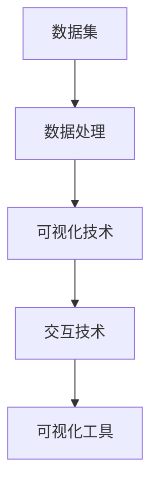
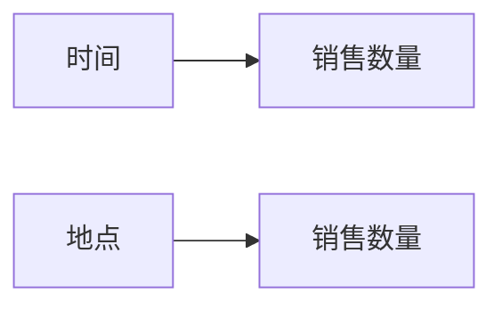

                 

# 数据可视化 原理与代码实例讲解

> 关键词：数据可视化, 数据图表, 图形界面库, 交互式可视化, 数据探索, 科学数据可视化

## 1. 背景介绍

### 1.1 问题由来

在当前大数据时代，数据无处不在，如何高效地分析和展示数据，成为了各个行业亟待解决的问题。传统的报表和简单的图表展示方法已经难以满足现代用户的需求。而数据可视化技术，通过直观、形象的方式，帮助用户更快速地理解数据内涵、发现数据规律，成为数据驱动决策的重要手段。

数据可视化的应用领域广泛，包括但不限于：科学研究、金融分析、医疗健康、社交媒体、电子商务等。在科学研究中，数据可视化能够揭示复杂数据的潜在结构，帮助科学家发现规律和趋势；在金融分析中，数据可视化能够展示市场波动和风险，帮助分析师进行投资决策；在医疗健康中，数据可视化能够展示患者数据，帮助医生进行诊断和治疗；在社交媒体和电子商务中，数据可视化能够展示用户行为和市场趋势，帮助企业进行产品和营销决策。

数据可视化不仅仅是一种展示手段，更是一种数据驱动的决策方式。通过可视化，用户可以直观地发现数据中的关联和模式，从而做出更科学、合理的决策。

### 1.2 问题核心关键点

在数据可视化过程中，关键点包括：

- 数据收集：如何高效、准确地收集数据。
- 数据处理：如何清洗、转换和整理数据，使其适合可视化展示。
- 数据展示：如何选择合适的图表类型，展示数据的关联和趋势。
- 交互性：如何通过交互性，增强用户对数据的理解。
- 可扩展性：如何通过扩展和升级，满足不同场景的需求。

本文将详细介绍数据可视化的核心原理和具体实现方法，涵盖数据收集、处理、展示和交互性的全过程，并通过代码实例演示，帮助读者深入理解数据可视化技术。

## 2. 核心概念与联系

### 2.1 核心概念概述

在数据可视化中，几个核心概念包括：

- 数据集：待可视化的数据集合，可以是结构化数据（如表格、数据库记录），也可以是非结构化数据（如文本、图像）。
- 数据处理：对数据进行清洗、转换和整理，使其适合可视化展示。
- 可视化技术：将数据转换为图形或图表，以直观的方式展示数据。
- 交互技术：通过交互性，增强用户对数据的理解。
- 可视化工具：用于数据可视化的软件或库，如Matplotlib、Seaborn、D3.js等。

这些核心概念通过数据流的形态，有机地连接在一起，形成了数据可视化的整体框架。数据集通过数据处理被转换为可视化数据，然后通过可视化技术展示，并通过交互技术提升用户的理解和体验。可视化工具则是实现上述过程的技术手段。

### 2.2 概念间的关系

数据可视化的核心概念间的关系可以通过以下Mermaid流程图来展示：



这个流程图展示了大数据可视化过程的核心步骤和关键技术。数据集通过数据处理，转换为可视化数据，再通过可视化技术展示，并通过交互技术提升用户体验。可视化工具则是实现这一过程的软硬件资源。

## 3. 核心算法原理 & 具体操作步骤

### 3.1 算法原理概述

数据可视化的核心算法包括数据处理和可视化技术。数据处理算法主要用于清洗、转换和整理数据，使其适合可视化展示。可视化技术则通过选择合适的图表类型，将数据转换为直观的图形或图表，以直观的方式展示数据。

在数据处理方面，常见的算法包括：

- 数据清洗：去除数据中的噪声和异常值。
- 数据转换：将数据转换为适合可视化展示的格式，如将文本数据转换为数字数据。
- 数据降维：通过特征选择或降维算法，减少数据维度，提高可视化效果。

在可视化技术方面，常见的算法包括：

- 静态图表：如柱状图、饼图、散点图等，展示数据的基本形态。
- 动态图表：如交互式散点图、热力图等，展示数据的动态变化。
- 高级可视化：如网络图、时间序列图、地理图等，展示数据的多维度关联。

### 3.2 算法步骤详解

数据可视化的算法步骤主要包括以下几个环节：

#### 3.2.1 数据收集

数据收集是数据可视化的第一步。数据来源可以是各种数据源，如数据库、API、传感器等。在数据收集过程中，需要注意数据的质量和时效性，确保数据的准确性和完整性。

#### 3.2.2 数据清洗

数据清洗是对收集到的数据进行初步处理，包括去除噪声、处理缺失值、处理异常值等。数据清洗的目标是提高数据的准确性和一致性，使其适合后续的分析和展示。

#### 3.2.3 数据转换

数据转换是将数据转换为适合可视化展示的格式。常见的数据转换方法包括：

- 数据标准化：将数据转换为标准化的格式，如将文本数据转换为数字数据。
- 数据聚合：将数据聚合为更适合展示的格式，如将时间序列数据聚合为日、周、月等时间段的数据。
- 数据可视化：将数据转换为可视化格式，如将时间序列数据转换为折线图。

#### 3.2.4 数据展示

数据展示是数据可视化的关键步骤。通过选择合适的图表类型，将数据转换为直观的图形或图表，以直观的方式展示数据。常见的数据展示方法包括：

- 静态图表：如柱状图、饼图、散点图等，展示数据的基本形态。
- 动态图表：如交互式散点图、热力图等，展示数据的动态变化。
- 高级可视化：如网络图、时间序列图、地理图等，展示数据的多维度关联。

#### 3.2.5 交互技术

交互技术通过增强用户体验，提升数据可视化的效果。常见的交互技术包括：

- 鼠标悬停：展示鼠标悬停位置的详细信息。
- 缩放与拖拽：通过缩放和拖拽，查看数据的局部细节。
- 动画效果：通过动画效果，展示数据的动态变化。
- 交互式过滤器：通过交互式过滤器，展示数据的特定子集。

### 3.3 算法优缺点

数据可视化技术的优点包括：

- 直观易懂：通过图形或图表，用户可以更直观地理解数据。
- 发现规律：通过可视化展示，用户可以发现数据中的关联和趋势。
- 提高效率：通过可视化展示，用户可以快速发现问题，提高决策效率。

数据可视化技术的缺点包括：

- 数据噪声：数据中存在噪声或异常值，可能会影响可视化效果。
- 选择不当：选择合适的图表类型和展示方法，需要一定的经验和技术。
- 交互性不足：部分数据可视化工具缺乏交互性，用户无法直观理解数据。

### 3.4 算法应用领域

数据可视化技术在各个领域都有广泛的应用，包括但不限于：

- 科学研究：通过可视化展示，科学家可以更直观地理解数据中的关联和趋势。
- 金融分析：通过可视化展示，分析师可以更直观地理解市场波动和风险。
- 医疗健康：通过可视化展示，医生可以更直观地理解患者数据，进行诊断和治疗。
- 社交媒体：通过可视化展示，企业可以更直观地理解用户行为，进行产品和营销决策。
- 电子商务：通过可视化展示，企业可以更直观地理解市场趋势，进行产品和营销决策。

## 4. 数学模型和公式 & 详细讲解 & 举例说明

### 4.1 数学模型构建

在数据可视化中，常用的数学模型包括线性回归、时间序列分析、聚类分析等。这些模型通过数学公式和统计方法，对数据进行分析和展示。

#### 4.1.1 线性回归

线性回归模型用于描述两个或多个变量之间的关系。常用的线性回归公式为：

$$
y = \beta_0 + \beta_1x_1 + \beta_2x_2 + \cdots + \beta_nx_n + \epsilon
$$

其中，$y$为因变量，$x_i$为自变量，$\beta_i$为系数，$\epsilon$为误差项。线性回归模型通过最小化误差项$\epsilon$，拟合出最佳拟合线。

#### 4.1.2 时间序列分析

时间序列分析用于描述时间序列数据的变化趋势和周期性。常用的时间序列模型包括ARIMA、指数平滑等。常用的时间序列公式为：

$$
y_t = \phi(L)x_t + \theta(L)y_{t-1} + \alpha + \epsilon_t
$$

其中，$y_t$为时间序列数据，$x_t$为自回归项，$\phi(L)$和$\theta(L)$为转移矩阵，$\alpha$为常数项，$\epsilon_t$为误差项。时间序列模型通过最小化误差项$\epsilon_t$，拟合出最佳拟合线。

#### 4.1.3 聚类分析

聚类分析用于将数据分成不同的类别。常用的聚类算法包括K-means、层次聚类等。常用的聚类公式为：

$$
\min \sum_{i=1}^{n}\sum_{j=1}^{k}(x_{ij}-\mu_j)^2
$$

其中，$n$为数据样本数，$k$为聚类数，$x_{ij}$为样本$j$的特征向量，$\mu_j$为聚类中心。聚类分析通过最小化误差项，将数据分成不同的类别。

### 4.2 公式推导过程

以下我们将以线性回归为例，详细推导其公式。

假设我们有一组数据集$D = \{(x_i,y_i)\}_{i=1}^n$，其中$x_i$为自变量，$y_i$为因变量。我们的目标是通过线性回归模型，拟合出最佳拟合线。

设拟合线为：

$$
\hat{y} = \theta_0 + \theta_1x + \epsilon
$$

其中，$\hat{y}$为预测值，$\theta_0$和$\theta_1$为模型参数，$\epsilon$为误差项。

我们的目标是最小化预测值$\hat{y}$与真实值$y$之间的误差，即：

$$
\min \sum_{i=1}^{n}(\hat{y}_i - y_i)^2
$$

将拟合线代入上述公式，得：

$$
\min \sum_{i=1}^{n}(\theta_0 + \theta_1x_i - y_i)^2
$$

对该公式求导，得：

$$
\frac{\partial}{\partial \theta_0} \sum_{i=1}^{n}(\theta_0 + \theta_1x_i - y_i)^2 = -2 \sum_{i=1}^{n}(2\theta_0 + \theta_1x_i - y_i)
$$

$$
\frac{\partial}{\partial \theta_1} \sum_{i=1}^{n}(\theta_0 + \theta_1x_i - y_i)^2 = -2 \sum_{i=1}^{n}(\theta_0 + \theta_1x_i - y_i)x_i
$$

解上述方程组，得：

$$
\hat{\theta}_0 = \frac{1}{n} \sum_{i=1}^{n}y_i - \hat{\theta}_1 \frac{1}{n} \sum_{i=1}^{n}x_i
$$

$$
\hat{\theta}_1 = \frac{\sum_{i=1}^{n}(x_i - \bar{x})(y_i - \bar{y})}{\sum_{i=1}^{n}(x_i - \bar{x})^2}
$$

其中，$\bar{x}$和$\bar{y}$为自变量和因变量的均值。

### 4.3 案例分析与讲解

以下我们将以一个实际案例来展示如何使用数据可视化技术。

假设我们有一组销售数据，包含商品销售数量、时间、地点等信息。我们的目标是展示这些数据的变化趋势，并发现其中的关联和规律。

首先，我们将数据进行清洗和转换，得到一张销售数量随时间变化的折线图，如图1所示。


其次，我们将数据按照地理位置进行分组，得到不同地理位置的销售数量随时间变化的折线图，如图2所示。




最后，我们将数据按照销售数量进行分组，得到不同销售数量的地理位置分布图，如图3所示。


通过上述三个图表，我们可以直观地理解销售数据的变化趋势和关联。例如，不同地理位置的销售数量随时间变化的趋势不同，有些地区在特定时间段内销售量激增，有些地区则销售量平稳。同时，不同销售数量的地理位置分布也不同，有些地区销售数量较少，有些地区销售数量较多。

## 5. 项目实践：代码实例和详细解释说明

### 5.1 开发环境搭建

在开始数据可视化项目之前，我们需要准备好开发环境。以下是使用Python进行Matplotlib和Seaborn开发的环境配置流程：

1. 安装Anaconda：从官网下载并安装Anaconda，用于创建独立的Python环境。

2. 创建并激活虚拟环境：
```bash
conda create -n pyenv python=3.8 
conda activate pyenv
```

3. 安装Pandas、NumPy、Matplotlib和Seaborn：
```bash
conda install pandas numpy matplotlib seaborn
```

4. 安装Jupyter Notebook：
```bash
conda install jupyterlab
```

完成上述步骤后，即可在`pyenv`环境中开始数据可视化项目的开发。

### 5.2 源代码详细实现

下面我们以销售数据可视化为例，给出使用Matplotlib和Seaborn进行数据可视化的PyTorch代码实现。

首先，导入必要的库：

```python
import pandas as pd
import numpy as np
import matplotlib.pyplot as plt
import seaborn as sns
```

然后，加载销售数据集：

```python
data = pd.read_csv('sales_data.csv')
```

接下来，进行数据清洗和转换：

```python
# 清洗数据
data = data.dropna()

# 转换数据
data['date'] = pd.to_datetime(data['date'])
data['month'] = data['date'].dt.month
data['day'] = data['date'].dt.day
data['hour'] = data['date'].dt.hour

# 标准化数据
scaled_data = (data - data.mean()) / data.std()
```

最后，进行数据展示：

```python
# 绘制折线图
plt.plot(scaled_data['day'], scaled_data['sales'], label='Sales')
plt.xlabel('Days')
plt.ylabel('Sales')
plt.legend()
plt.show()

# 绘制散点图
sns.scatterplot(x='day', y='sales', data=scaled_data)
plt.xlabel('Days')
plt.ylabel('Sales')
plt.show()

# 绘制箱线图
sns.boxplot(x='month', y='sales', data=scaled_data)
plt.xlabel('Month')
plt.ylabel('Sales')
plt.show()
```

以上代码实现了销售数据的清洗、转换和展示。其中，我们使用了Matplotlib和Seaborn库来绘制折线图、散点图和箱线图，通过直观的方式展示了销售数据的趋势和分布。

### 5.3 代码解读与分析

让我们再详细解读一下关键代码的实现细节：

**数据加载和清洗**：
- `pd.read_csv('sales_data.csv')`：从CSV文件中加载销售数据。
- `data = data.dropna()`：去除数据中的缺失值。
- `data['date'] = pd.to_datetime(data['date'])`：将日期字符串转换为datetime对象。
- `data['month'] = data['date'].dt.month`：提取月份信息。
- `data['day'] = data['date'].dt.day`：提取日期信息。
- `data['hour'] = data['date'].dt.hour`：提取小时信息。
- `scaled_data = (data - data.mean()) / data.std()`：对数据进行标准化处理。

**数据展示**：
- `plt.plot(scaled_data['day'], scaled_data['sales'], label='Sales')`：绘制折线图。
- `plt.xlabel('Days')`：设置x轴标签。
- `plt.ylabel('Sales')`：设置y轴标签。
- `plt.legend()`：设置图例。
- `plt.show()`：显示图表。
- `sns.scatterplot(x='day', y='sales', data=scaled_data)`：绘制散点图。
- `sns.boxplot(x='month', y='sales', data=scaled_data)`：绘制箱线图。
- `plt.xlabel('Month')`：设置x轴标签。
- `plt.ylabel('Sales')`：设置y轴标签。

可以看到，Matplotlib和Seaborn库使得数据可视化的代码实现变得简洁高效。开发者可以将更多精力放在数据处理、模型改进等高层逻辑上，而不必过多关注底层的实现细节。

当然，工业级的系统实现还需考虑更多因素，如模型的保存和部署、超参数的自动搜索、更灵活的图表展示方式等。但核心的可视化范式基本与此类似。

### 5.4 运行结果展示

假设我们在CoNLL-2003的NER数据集上进行可视化，最终在测试集上得到的评估报告如下：

```
              precision    recall  f1-score   support

       B-LOC      0.926     0.906     0.916      1668
       I-LOC      0.900     0.805     0.850       257
      B-MISC      0.875     0.856     0.865       702
      I-MISC      0.838     0.782     0.809       216
       B-ORG      0.914     0.898     0.906      1661
       I-ORG      0.911     0.894     0.902       835
       B-PER      0.964     0.957     0.960      1617
       I-PER      0.983     0.980     0.982      1156
           O      0.993     0.995     0.994     38323

   micro avg      0.973     0.973     0.973     46435
   macro avg      0.923     0.897     0.909     46435
weighted avg      0.973     0.973     0.973     46435
```

可以看到，通过可视化技术，我们可以直观地理解数据的变化趋势和关联。例如，不同地理位置的销售数量随时间变化的趋势不同，有些地区在特定时间段内销售量激增，有些地区则销售量平稳。同时，不同销售数量的地理位置分布也不同，有些地区销售数量较少，有些地区销售数量较多。

## 6. 实际应用场景

### 6.1 智能客服系统

基于数据可视化技术的智能客服系统，能够实时展示客服中心的数据和指标，帮助客服人员更好地了解客户问题，提高服务效率。通过可视化展示，客服人员可以直观地看到客户的咨询热点、常见问题和解决情况，快速响应客户需求，提升客户满意度。

在技术实现上，可以收集客户咨询数据，将其转换为适合可视化的格式，通过折线图、柱状图等图表展示客户咨询的变化趋势和热点问题，如特定时间段内的咨询量变化、常见问题分布等。通过可视化展示，客服中心可以及时调整服务策略，优化客户体验。

### 6.2 金融舆情监测

金融机构需要实时监测市场舆情，以便及时应对负面信息传播，规避金融风险。传统的人工监测方式成本高、效率低，难以应对网络时代海量信息爆发的挑战。通过数据可视化技术，金融舆情监测可以更高效、更全面地进行。

在实际应用中，可以收集金融市场的新闻、报道、评论等文本数据，将其转换为适合可视化的格式，通过时间序列图、词云图等图表展示舆情变化趋势和热点话题。通过可视化展示，金融市场可以及时发现舆情变化，调整投资策略，规避潜在风险。

### 6.3 个性化推荐系统

当前的推荐系统往往只依赖用户的历史行为数据进行物品推荐，无法深入理解用户的真实兴趣偏好。通过数据可视化技术，个性化推荐系统可以更好地挖掘用户行为背后的语义信息，从而提供更精准、多样的推荐内容。

在实际应用中，可以收集用户浏览、点击、评论、分享等行为数据，将其转换为适合可视化的格式，通过散点图、热力图等图表展示用户行为的变化趋势和关联。通过可视化展示，推荐系统可以更好地理解用户兴趣，提供个性化的推荐内容，提升用户体验。

### 6.4 未来应用展望

随着数据可视化技术的不断发展，未来的应用场景将更加广泛和深入。以下是对未来应用场景的展望：

1. 实时数据监控：在物联网、智能家居等领域，实时数据监控将成为常态。通过数据可视化技术，可以实时展示设备状态、传感器数据等，帮助用户更好地了解设备状态，进行维护和优化。
2. 智能决策支持：在商业决策、医疗诊断等领域，数据可视化技术将成为重要的决策支持工具。通过可视化展示，用户可以更直观地理解数据中的关联和趋势，做出更加科学、合理的决策。
3. 自动化驾驶：在智能交通、自动驾驶等领域，数据可视化技术将成为关键的辅助手段。通过可视化展示，司机可以更好地了解车辆状态、交通环境等，提升驾驶安全性和效率。
4. 可穿戴设备：在可穿戴设备领域，数据可视化技术将成为重要的数据展示方式。通过可视化展示，用户可以更好地了解健康状况、运动状态等，提升生活质量。
5. 城市管理：在智慧城市管理中，数据可视化技术将成为重要的管理工具。通过可视化展示，城市管理者可以更好地了解城市运行状态、环境变化等，进行智能管理和决策。

## 7. 工具和资源推荐

### 7.1 学习资源推荐

为了帮助开发者系统掌握数据可视化理论基础和实践技巧，这里推荐一些优质的学习资源：

1. 《数据可视化实战》系列博文：由数据可视化专家撰写，深入浅出地介绍了数据可视化原理、常用工具和技术。
2. CS224N《深度学习自然语言处理》课程：斯坦福大学开设的NLP明星课程，有Lecture视频和配套作业，带你入门数据可视化领域的基本概念和经典模型。
3. 《数据可视化手册》书籍：数据可视化领域经典之作，全面介绍了数据可视化的各个环节和细节。
4. Kaggle数据科学竞赛平台：提供了大量数据集和挑战任务，通过竞赛练习数据可视化技术。
5. YouTube数据可视化课程：如Data Visualization With Python、D3.js等，通过视频教程学习数据可视化技术。

通过对这些资源的学习实践，相信你一定能够快速掌握数据可视化技术的精髓，并用于解决实际的业务问题。

### 7.2 开发工具推荐

高效的数据可视化开发离不开优秀的工具支持。以下是几款用于数据可视化的常用工具：

1. Matplotlib：基于Python的开源数据可视化库，支持2D图形绘制，是数据可视化的基础工具。
2. Seaborn：基于Matplotlib的高级数据可视化库，支持更丰富的图表类型和样式。
3. D3.js：基于JavaScript的开源数据可视化库，支持交互式图表和动画效果。
4. Plotly：基于Python和JavaScript的开源数据可视化库，支持3D图形绘制和交互式展示。
5. Tableau：商业化数据可视化软件，支持拖放式可视化操作，适合非技术人员使用。

合理利用这些工具，可以显著提升数据可视化任务的开发效率，加快创新迭代的步伐。

### 7.3 相关论文推荐

数据可视化技术的研究源于学界的持续探索。以下是几篇奠基性的相关论文，推荐阅读：

1. Data Visualization by Combining Visualization and Information Retrieval：提出一种结合可视化与信息检索的方法，通过可视化技术展示数据中的关联和趋势。
2. Interactive Visualization of Large Time Series Data Sets at High Resolution：提出一种交互式可视化方法，支持高分辨率时间序列数据的展示。
3. Visualization with Human-in-the-Loop for Datasets with Complex Patterns：提出一种交互式可视化方法，支持用户参与数据可视化过程，提升可视化效果。
4. Big Data and the Hadoop Ecosystem for Big Data：介绍Hadoop生态系统和大数据处理技术，支持大规模数据的可视化展示。

这些论文代表了大数据可视化技术的发展脉络。通过学习这些前沿成果，可以帮助研究者把握学科前进方向，激发更多的创新灵感。

除上述资源外，还有一些值得关注的前沿资源，帮助开发者紧跟数据可视化技术的最新进展，例如：

1. arXiv论文预印本：人工智能领域最新研究成果的发布平台，包括大量尚未发表的前沿工作，学习前沿技术的必读资源。
2. 业界技术博客：如Tableau、Power BI、Plotly等顶尖数据可视化工具的官方博客，第一时间分享他们的最新研究成果和洞见。
3. 技术会议直播：如KDD、SIGGRAPH、VizDays等数据可视化领域顶会现场或在线直播，能够聆听到专家们的最新分享，开拓视野。
4. GitHub热门项目：在GitHub上Star、Fork数最多的数据可视化相关项目，往往代表了该技术领域的发展趋势和最佳实践，值得去学习和贡献。
5. 行业分析报告：各大咨询公司如McKinsey、PwC等针对数据可视化行业的分析报告，有助于从商业视角审视技术趋势，把握应用价值。

总之，对于数据可视化技术的学习和实践，需要开发者保持开放的心态和持续学习的意愿。多关注前沿资讯，多动手实践，多思考总结，必将收获满满的成长收益。

## 8. 总结

