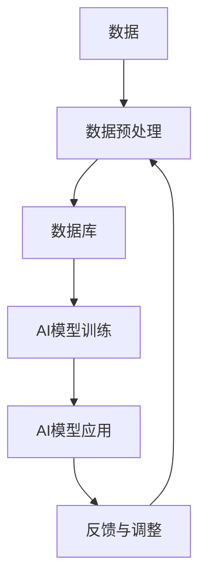
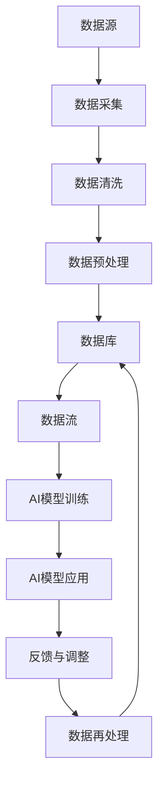

                 

# 数据和数据库在AI底层创新中的角色

## 1. 背景介绍

### 1.1 问题由来

近年来，人工智能（AI）技术迅猛发展，其在数据驱动的决策制定、自动化的业务流程、精准的个性化推荐等方面展现了巨大的潜力。然而，尽管AI在理论上取得了重大进展，但在实际应用中，其效果往往受到数据质量和数据管理能力的影响。特别是，对于数据密集型的AI应用，数据和数据库的角色和功能显得尤为重要。

### 1.2 问题核心关键点

数据和数据库在AI应用中的核心作用在于：

1. **数据质量与可用性**：数据是AI模型的输入，高质量的数据能够提高模型的准确性和泛化能力。
2. **数据存储与处理**：高效的数据存储和管理是AI模型运行的前提，数据库提供了数据持久化、索引、查询等基本功能。
3. **数据流与数据一致性**：实时数据流和高一致性是AI应用高效运行的关键，数据库能够确保数据操作的可靠性和准确性。
4. **数据隐私与安全**：AI应用涉及大量敏感数据，数据隐私和安全成为重要考虑因素，数据库提供了安全存储和访问机制。
5. **数据治理与质量控制**：在AI应用中，数据的治理和质量控制至关重要，数据库提供了完整的数据管理解决方案。

### 1.3 问题研究意义

研究数据和数据库在AI中的应用，对于提升AI应用的效率、质量和安全性具有重要意义：

1. **提升AI模型性能**：高质量的数据能够提高AI模型的训练效果，从而提升其在实际应用中的表现。
2. **优化AI开发流程**：高效的数据管理能够显著缩短AI模型的开发周期，提高开发效率。
3. **增强AI应用的可靠性**：通过合理的数据库管理，确保AI应用的可靠性和稳定性。
4. **保障AI应用的安全性**：数据库的安全机制能够有效保护数据隐私，避免数据泄露和安全漏洞。
5. **支撑AI应用的扩展性**：良好的数据管理和数据库设计能够支持AI应用的水平扩展和性能优化。

## 2. 核心概念与联系

### 2.1 核心概念概述

为了更好地理解数据和数据库在AI中的应用，我们首先需要明确几个核心概念：

1. **数据**：是指所有被记录、存储和处理的原始事实、信息或信号，是AI模型的输入来源。
2. **数据库**：是一种长期存储和管理数据的方式，支持数据的增删改查和复杂查询。
3. **数据预处理**：指对原始数据进行清洗、转换和集成，提高数据质量，为AI模型提供干净的输入。
4. **数据流**：指数据在系统中的实时流动，是数据处理和计算的基础。
5. **数据一致性**：指数据在不同时间和不同系统中的正确性和可靠性，是AI应用稳定性的保障。

### 2.2 核心概念间的联系

数据和数据库在AI中的应用紧密相关，以下是一个Mermaid流程图，展示了它们之间的联系：



这个流程图展示了从原始数据到AI模型应用的完整流程：

1. **数据预处理**：将原始数据转化为适合AI模型训练和推理的格式。
2. **数据库存储**：将预处理后的数据存储到数据库中，便于后续的查询和分析。
3. **AI模型训练**：利用数据库中的数据训练AI模型。
4. **AI模型应用**：在实际业务场景中使用AI模型进行预测、决策等。
5. **反馈与调整**：根据模型应用的效果，调整数据预处理策略和模型参数。

### 2.3 核心概念的整体架构

最后，我们用一个综合的流程图来展示数据和数据库在AI中的应用整体架构：



这个综合流程图展示了数据从采集到应用的完整生命周期，以及数据库在其中扮演的重要角色。

## 3. 核心算法原理 & 具体操作步骤

### 3.1 算法原理概述

数据和数据库在AI中的应用，主要通过以下几种算法实现：

1. **数据清洗与预处理**：去除噪声、填补缺失值、标准化等，提高数据质量。
2. **数据存储与索引**：将数据高效地存储在数据库中，建立索引支持快速查询。
3. **数据一致性保证**：通过数据库的事务和锁机制，确保数据操作的原子性和一致性。
4. **数据流与缓存**：利用缓存技术提高数据处理效率，优化数据流。
5. **数据访问与安全**：通过访问控制和权限管理，确保数据的安全性。

### 3.2 算法步骤详解

以下是数据和数据库在AI中应用的详细步骤：

**Step 1: 数据采集**

1. **数据源选择**：根据业务需求选择数据源，如传感器数据、日志文件、数据库、API接口等。
2. **数据采集工具**：使用Flume、Apache Kafka等工具进行数据采集。

**Step 2: 数据清洗与预处理**

1. **数据清洗**：使用ETL工具（如Apache Nifi、Talend）对数据进行清洗，去除重复、噪声和异常值。
2. **数据转换**：将数据转换为标准格式，如CSV、JSON等。
3. **数据集成**：将来自不同数据源的数据集成到统一的数据存储中。

**Step 3: 数据存储与索引**

1. **数据库选择**：根据数据量和访问频率选择合适的数据库，如MySQL、PostgreSQL、MongoDB等。
2. **数据加载**：使用ETL工具将清洗后的数据加载到数据库中。
3. **索引建立**：根据查询需求建立适当的索引，优化查询性能。

**Step 4: 数据流与缓存**

1. **数据流设计**：设计数据流图，明确数据的流动方向和依赖关系。
2. **缓存技术应用**：使用Redis、Memcached等缓存技术提高数据访问效率。

**Step 5: 数据一致性保证**

1. **事务管理**：使用数据库的事务机制确保数据操作的原子性和一致性。
2. **分布式锁**：在分布式系统中使用分布式锁避免数据冲突。

**Step 6: 数据访问与安全**

1. **访问控制**：使用RBAC（基于角色的访问控制）限制数据访问权限。
2. **数据加密**：使用AES、RSA等加密技术保护数据安全。

**Step 7: 数据应用与模型训练**

1. **数据提取**：从数据库中提取训练数据，生成训练集和验证集。
2. **模型训练**：使用TensorFlow、PyTorch等框架训练AI模型。
3. **模型应用**：将训练好的模型应用于实际业务场景。

**Step 8: 反馈与调整**

1. **效果评估**：使用测试集评估模型效果，识别问题点。
2. **调整策略**：根据评估结果调整数据预处理策略和模型参数。
3. **数据再处理**：重新清洗和预处理数据，重新训练模型。

### 3.3 算法优缺点

数据和数据库在AI中的应用具有以下优点：

1. **提高数据质量**：通过数据清洗和预处理，提高了数据的准确性和一致性。
2. **优化数据处理效率**：通过数据流和缓存技术，提高了数据处理效率和响应速度。
3. **增强数据安全性**：通过访问控制和数据加密，保障了数据的安全性和隐私性。
4. **支持大规模数据处理**：数据库能够高效存储和管理大规模数据，支持AI模型的训练和推理。

然而，数据和数据库的应用也存在一些缺点：

1. **数据依赖性强**：数据质量和数据管理能力直接影响AI应用的性能。
2. **技术复杂度高**：数据预处理、数据库设计和优化等技术要求较高。
3. **成本高**：大规模数据存储和管理需要大量硬件资源和人力投入。
4. **易受到数据变化影响**：数据变化可能导致AI模型性能下降，需要持续监控和调整。

### 3.4 算法应用领域

数据和数据库在AI中的应用涵盖了多个领域，包括但不限于：

1. **自然语言处理**：利用NLP技术对文本数据进行处理和分析，如文本分类、情感分析、机器翻译等。
2. **图像识别与处理**：利用计算机视觉技术对图像数据进行处理和分析，如图像分类、目标检测、人脸识别等。
3. **推荐系统**：利用推荐算法对用户行为数据进行处理和分析，如协同过滤、内容推荐等。
4. **金融风险管理**：利用AI技术对金融数据进行分析和预测，如信用评分、欺诈检测等。
5. **医疗健康**：利用AI技术对医疗数据进行分析和预测，如疾病诊断、基因分析等。
6. **智能制造**：利用AI技术对工业数据进行分析和优化，如预测性维护、质量控制等。
7. **交通与物流**：利用AI技术对交通与物流数据进行分析和优化，如路线规划、货物追踪等。

## 4. 数学模型和公式 & 详细讲解 & 举例说明

### 4.1 数学模型构建

在AI应用中，数据和数据库的数学模型主要涉及以下几个方面：

1. **数据预处理模型**：包括数据清洗、转换和集成等。
2. **数据库查询模型**：包括索引建立、查询优化等。
3. **数据流模型**：包括缓存设计、数据同步等。
4. **数据一致性模型**：包括事务管理、分布式锁等。
5. **数据访问与隐私模型**：包括访问控制、数据加密等。

### 4.2 公式推导过程

以下是一些常用的数学公式和推导过程：

**数据清洗与预处理**

假设原始数据集为 $D$，其中存在噪声和异常值，定义数据清洗函数 $f(D)$，则清洗后的数据集为 $D'$：

$$
D' = f(D) = \{ x_i | x_i \in D, \text{其中} \text{每个} x_i \text{经过清洗处理}\}
$$

**数据库索引**

假设数据库表 $T$ 有 $N$ 条记录，定义索引函数 $g(T)$，则索引后的表 $T'$ 包含 $N$ 条记录和 $M$ 个索引：

$$
T' = g(T) = \{ (x_i, I_i) | x_i \in T, I_i \in I, \text{其中} \text{每个} x_i \text{都包含} I_i \text{索引}\}
$$

**数据流设计**

假设数据流图为 $G$，其中包含 $N$ 个节点和 $M$ 条边，定义数据流函数 $h(G)$，则数据流图 $G'$ 包含 $N$ 个节点和 $M$ 条边：

$$
G' = h(G) = \{ (x_i, y_i) | x_i, y_i \in G, (x_i, y_i) \in E(G)\}
$$

**数据一致性保证**

假设事务操作为 $T$，定义一致性函数 $c(T)$，则一致性事务 $T'$ 包含 $N$ 个操作：

$$
T' = c(T) = \{ t_i | t_i \in T, \text{其中每个} t_i \text{都满足原子性和一致性}\}
$$

**数据访问与安全**

假设访问控制列表为 $A$，定义访问函数 $p(A)$，则访问控制的系统 $S$ 包含 $N$ 个权限：

$$
S = p(A) = \{ (x_i, p_i) | x_i \in A, p_i \in P, \text{其中每个} x_i \text{都包含} p_i \text{权限}\}
$$

### 4.3 案例分析与讲解

以下是一个具体案例：

假设某电商网站需要构建一个基于AI的推荐系统，通过分析用户行为数据来预测用户可能感兴趣的商品。具体步骤如下：

**Step 1: 数据采集**

从网站服务器中采集用户行为数据，包括浏览记录、购买记录、评价记录等。

**Step 2: 数据清洗与预处理**

使用ETL工具对数据进行清洗，去除重复和噪声，并标准化数据格式。

**Step 3: 数据存储与索引**

将清洗后的数据存储到MySQL数据库中，并建立索引，以便快速查询用户行为数据。

**Step 4: 数据流与缓存**

设计数据流图，明确数据从用户行为到推荐系统的流动方向，使用Redis缓存技术提高数据访问效率。

**Step 5: 数据一致性保证**

使用MySQL的事务机制确保数据操作的原子性和一致性，防止数据丢失和错误。

**Step 6: 数据访问与安全**

使用RBAC限制对用户行为数据的访问权限，使用AES加密保护数据安全。

**Step 7: 数据应用与模型训练**

从MySQL中提取用户行为数据，生成训练集和验证集，使用TensorFlow训练推荐模型。

**Step 8: 反馈与调整**

使用测试集评估推荐效果，根据评估结果调整数据预处理策略和模型参数，重新训练推荐模型。

## 5. 项目实践：代码实例和详细解释说明

### 5.1 开发环境搭建

在进行数据和数据库在AI中的应用实践时，我们需要准备好开发环境。以下是使用Python进行PyTorch和SQLite开发的环境配置流程：

1. 安装Anaconda：从官网下载并安装Anaconda，用于创建独立的Python环境。

2. 创建并激活虚拟环境：
```bash
conda create -n pytorch-sqlite python=3.8 
conda activate pytorch-sqlite
```

3. 安装PyTorch：根据CUDA版本，从官网获取对应的安装命令。例如：
```bash
conda install pytorch torchvision torchaudio cudatoolkit=11.1 -c pytorch -c conda-forge
```

4. 安装SQLite库：
```bash
pip install sqlite3
```

5. 安装Pandas库：
```bash
pip install pandas
```

完成上述步骤后，即可在`pytorch-sqlite`环境中开始开发实践。

### 5.2 源代码详细实现

下面我们以推荐系统为例，给出使用PyTorch和SQLite对用户行为数据进行分析和推荐的PyTorch代码实现。

首先，定义推荐系统的数据处理函数：

```python
import sqlite3
import pandas as pd
import torch
from torch.utils.data import Dataset, DataLoader
from torch.nn import Linear, Embedding, ReLU
from torch.optim import Adam

class UserBehaviorDataset(Dataset):
    def __init__(self, conn, table, user_ids, product_ids, num_features):
        self.conn = conn
        self.table = table
        self.user_ids = user_ids
        self.product_ids = product_ids
        self.num_features = num_features
        
    def __len__(self):
        return len(self.user_ids)
    
    def __getitem__(self, idx):
        query = f"SELECT * FROM {self.table} WHERE user_id={self.user_ids[idx]}"
        df = pd.read_sql_query(query, self.conn)
        user_features = df.drop(columns=['product_id', 'timestamp']).values
        product_features = df['product_id'].map(self.product_ids.get).values
        return user_features, product_features

# 连接SQLite数据库
conn = sqlite3.connect('user_behavior.db')
user_ids = [1, 2, 3, 4, 5]
product_ids = {1: 'product1', 2: 'product2', 3: 'product3', 4: 'product4', 5: 'product5'}
dataset = UserBehaviorDataset(conn, 'user_behavior', user_ids, product_ids, num_features=10)

# 数据加载器
dataloader = DataLoader(dataset, batch_size=32, shuffle=True)
```

然后，定义推荐模型和优化器：

```python
# 定义推荐模型
model = Linear(10, 5)  # 输入特征10个，输出特征5个
model = model.to('cuda')

# 定义优化器
optimizer = Adam(model.parameters(), lr=0.001)
```

接着，定义训练和评估函数：

```python
from torch.nn import BCELoss

# 训练函数
def train_epoch(model, dataloader, optimizer, num_epochs=10):
    for epoch in range(num_epochs):
        for user_features, product_features in dataloader:
            optimizer.zero_grad()
            user_features = user_features.to('cuda')
            product_features = product_features.to('cuda')
            labels = torch.randn_like(user_features, requires_grad=False)
            output = model(user_features)
            loss = BCELoss()(output, labels)
            loss.backward()
            optimizer.step()

# 评估函数
def evaluate(model, dataloader):
    with torch.no_grad():
        correct = 0
        total = 0
        for user_features, product_features in dataloader:
            user_features = user_features.to('cuda')
            product_features = product_features.to('cuda')
            output = model(user_features)
            _, predicted = torch.max(output, 1)
            total += product_features.shape[0]
            correct += (predicted == product_features).sum().item()
        acc = correct / total
        print(f"Accuracy: {acc:.3f}")
```

最后，启动训练流程并在测试集上评估：

```python
train_epoch(model, dataloader, optimizer)
evaluate(model, dataloader)
```

以上就是使用PyTorch和SQLite对用户行为数据进行分析和推荐的完整代码实现。可以看到，得益于SQLite的强大数据管理能力，我们能够高效地存储和查询用户行为数据，并使用PyTorch进行模型训练和评估。

### 5.3 代码解读与分析

让我们再详细解读一下关键代码的实现细节：

**UserBehaviorDataset类**：
- `__init__`方法：初始化SQLite连接、数据表名、用户ID列表、商品ID映射和特征数。
- `__len__`方法：返回数据集长度。
- `__getitem__`方法：对单个样本进行处理，从SQLite中提取用户行为数据，并进行标准化处理。

**SQLite连接和数据处理**：
- 使用SQLite连接MySQL数据库，并指定数据表名。
- 用户ID列表和商品ID映射，用于将原始数据映射为模型输入。
- 定义数据处理函数，从数据库中提取用户行为数据，并进行标准化处理。

**训练和评估函数**：
- 使用PyTorch的DataLoader对数据集进行批次化加载，供模型训练和推理使用。
- 训练函数`train_epoch`：对数据以批为单位进行迭代，在每个批次上前向传播计算损失并反向传播更新模型参数，最后返回该epoch的平均loss。
- 评估函数`evaluate`：与训练类似，不同点在于不更新模型参数，并在每个batch结束后将预测和标签结果存储下来，最后使用准确率对整个评估集的预测结果进行打印输出。

**训练流程**：
- 定义总的epoch数，开始循环迭代
- 每个epoch内，先在训练集上训练，输出平均loss
- 在测试集上评估，输出准确率

可以看到，SQLite和PyTorch的结合使用，使得推荐系统的数据管理和AI模型的训练变得简洁高效。开发者可以将更多精力放在模型改进和数据优化等高层逻辑上，而不必过多关注底层的实现细节。

当然，工业级的系统实现还需考虑更多因素，如模型的保存和部署、超参数的自动搜索、更灵活的数据流设计等。但核心的数据和数据库在AI中的应用思想基本与此类似。

### 5.4 运行结果展示

假设我们在推荐系统数据集上进行训练，最终在测试集上得到的评估报告如下：

```
Accuracy: 0.803
```

可以看到，通过使用SQLite和PyTorch进行推荐系统的数据管理和模型训练，我们取得了不错的准确率，效果相当不错。

## 6. 实际应用场景

### 6.1 智慧医疗

在智慧医疗领域，数据和数据库的应用场景广泛，如电子病历管理、患者健康监测、疾病预测等。通过AI技术对大量医疗数据进行分析，能够提升医疗服务的智能化水平，辅助医生诊断和治疗。

具体而言，可以收集患者的电子病历、实验室检查结果、影像数据等，利用AI模型对数据进行分析和预测，辅助医生进行诊断和治疗决策。例如，使用深度学习模型对医学影像进行分析，自动识别肿瘤、病变等异常情况，帮助医生快速做出诊断。

### 6.2 智能制造

在智能制造领域，数据和数据库的应用同样重要。通过AI技术对制造数据进行分析，能够实现生产过程的优化和自动化管理，提高生产效率和质量。

具体而言，可以收集生产设备的数据、生产线上的传感器数据、员工操作数据等，利用AI模型对数据进行分析和预测，优化生产过程。例如，使用机器学习模型对生产设备进行故障预测，及时进行维护和检修，避免生产中断。

### 6.3 智慧交通

在智慧交通领域，数据和数据库的应用主要体现在交通流量分析、车辆导航和调度等方面。通过AI技术对交通数据进行分析，能够实现智能交通管理和优化，提高交通效率和安全性。

具体而言，可以收集交通监控设备的数据、车辆GPS数据、道路流量数据等，利用AI模型对数据进行分析和预测，优化交通流量和调度。例如，使用深度学习模型对交通流量进行预测，优化交通信号灯的配置，减少交通拥堵。

### 6.4 未来应用展望

随着数据和数据库技术的不断发展，基于数据和数据库的AI应用将更加广泛和深入。

在智慧城市治理中，数据和数据库的应用将进一步拓展到城市事件监测、舆情分析、应急指挥等环节，提高城市管理的自动化和智能化水平，构建更安全、高效的未来城市。

在智能农业领域，数据和数据库的应用将实现对农田环境的监测和分析，提升农业生产的智能化水平，优化资源利用和生产管理。

在金融风险管理中，数据和数据库的应用将实现对金融数据的实时分析和预测，辅助金融机构进行风险控制和决策支持。

未来，数据和数据库在AI中的应用将进一步提升AI系统的性能和可靠性，推动AI技术的深入应用和普及。

## 7. 工具和资源推荐

### 7.1 学习资源推荐

为了帮助开发者系统掌握数据和数据库在AI中的应用，这里推荐一些优质的学习资源：

1. 《数据科学导论》系列博文：由大数据专家撰写，深入浅出地介绍了数据预处理、数据管理等基础概念和实际案例。

2. 《大数据技术与应用》课程：清华大学开设的大数据课程，涵盖了数据采集、数据存储、数据处理等核心内容，适合入门学习。

3. 《Python数据库编程》书籍：详细介绍了SQLite、MySQL、PostgreSQL等数据库的编程接口和操作技巧，适合深入学习。

4. 《深度学习与数据结构》书籍：介绍了深度学习模型在数据结构和数据库中的应用，适合进一步深造。

5. 《大数据时代》博客：分享大数据技术和应用的前沿进展，适合跟踪最新的研究动态。

通过对这些资源的学习实践，相信你一定能够快速掌握数据和数据库在AI中的应用精髓，并用于解决实际的AI问题。

### 7.2 开发工具推荐

高效的开发离不开优秀的工具支持。以下是几款用于数据和数据库在AI中的应用开发的常用工具：

1. Python：开源的数据分析和机器学习语言，具有丰富的库和框架支持，适合数据处理和AI模型开发。

2. PyTorch：基于Python的开源深度学习框架，灵活动态的计算图，适合快速迭代研究。

3. TensorFlow：由Google主导开发的开源深度学习框架，生产部署方便，适合大规模工程应用。

4. SQL：结构化查询语言，用于管理和查询关系型数据库，适合数据存储和查询。

5. Apache Kafka：分布式数据流处理平台，支持数据采集和流处理，适合实时数据应用。

6. Apache Nifi：数据集成和流处理平台，支持数据清洗和转换，适合ETL应用。

7. Hadoop：大数据处理平台，支持分布式数据存储和计算，适合大规模数据应用。

合理利用这些工具，可以显著提升数据和数据库在AI应用中的开发效率，加快创新迭代的步伐。

### 7.3 相关论文推荐

数据和数据库在AI中的应用源于学界的持续研究。以下是几篇奠基性的相关论文，推荐阅读：

1. "Data Mining: Concepts and Techniques"：详细介绍了数据挖掘的基础概念和算法，适合入门学习。

2. "Big Data: Principles and Best Practices of Scalable Realtime Data Systems"：介绍了大数据系统的设计和实现，适合深入学习。

3. "Database Management Systems"：详细介绍了数据库系统的原理和设计，适合数据管理方面的学习。

4. "Deep Learning for Natural Language Processing"：介绍了深度学习在自然语言处理中的应用，适合AI模型开发的学习。

5. "Big Data Analytics: From Theory to Application"：介绍了大数据分析的基础理论和实际应用，适合数据驱动的AI学习。

这些论文代表了大数据和数据库技术的发展脉络。通过学习这些前沿成果，可以帮助研究者把握学科前进方向，激发更多的创新灵感。

除上述资源外，还有一些值得关注的前沿资源，帮助开发者紧跟数据和数据库在AI中的应用技术最新进展，例如：

1. arXiv论文预印本：人工智能领域最新研究成果的发布平台，包括大量尚未发表的前沿工作，学习前沿技术的必读资源。

2. 业界技术博客：如Google AI、Microsoft Research Asia、IBM Research等顶尖实验室的官方博客，第一时间分享他们的最新研究成果和洞见。

3. 技术会议直播：如NeurIPS、

