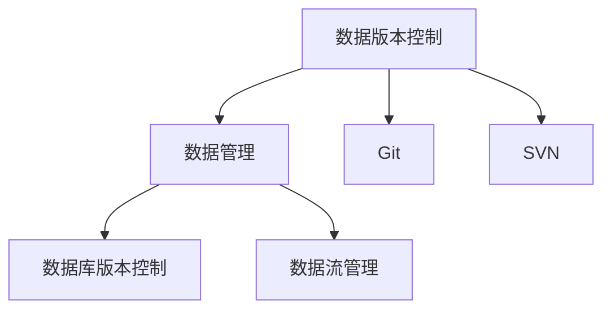
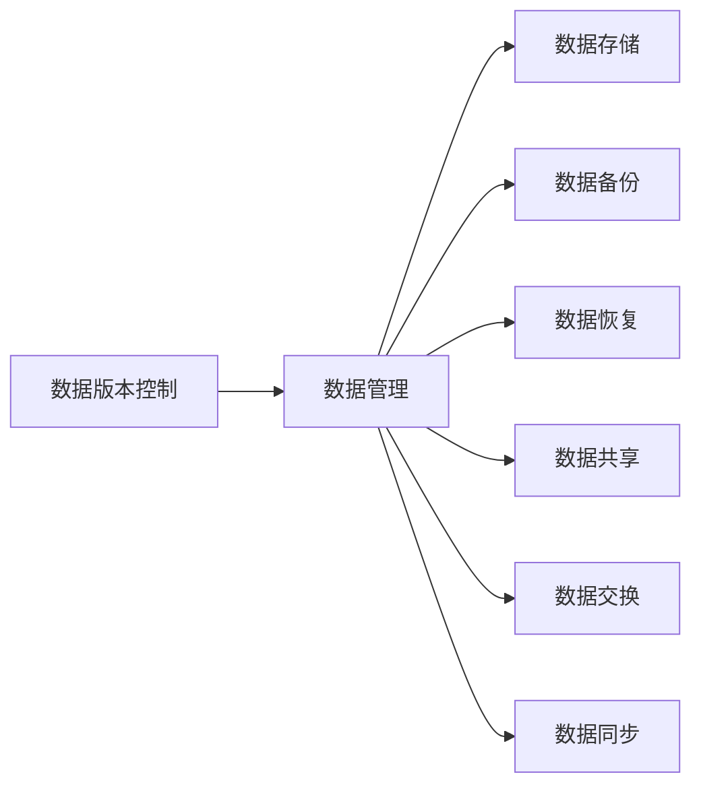
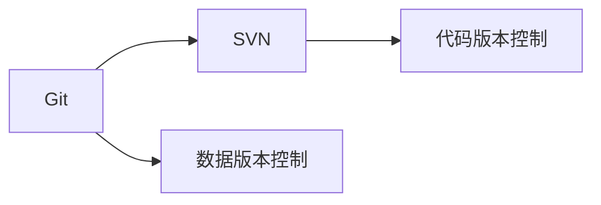
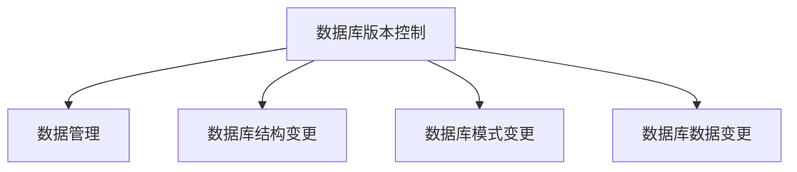
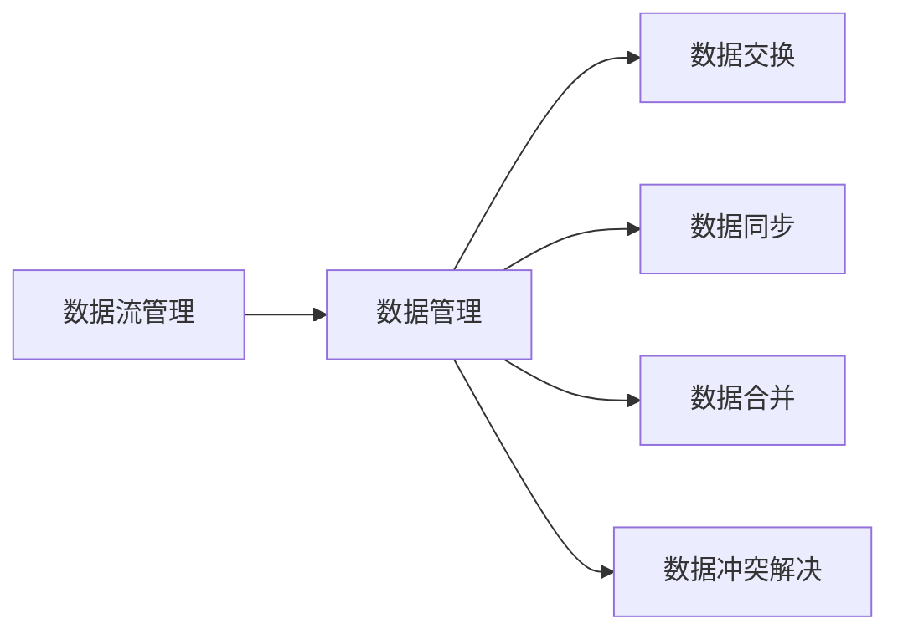
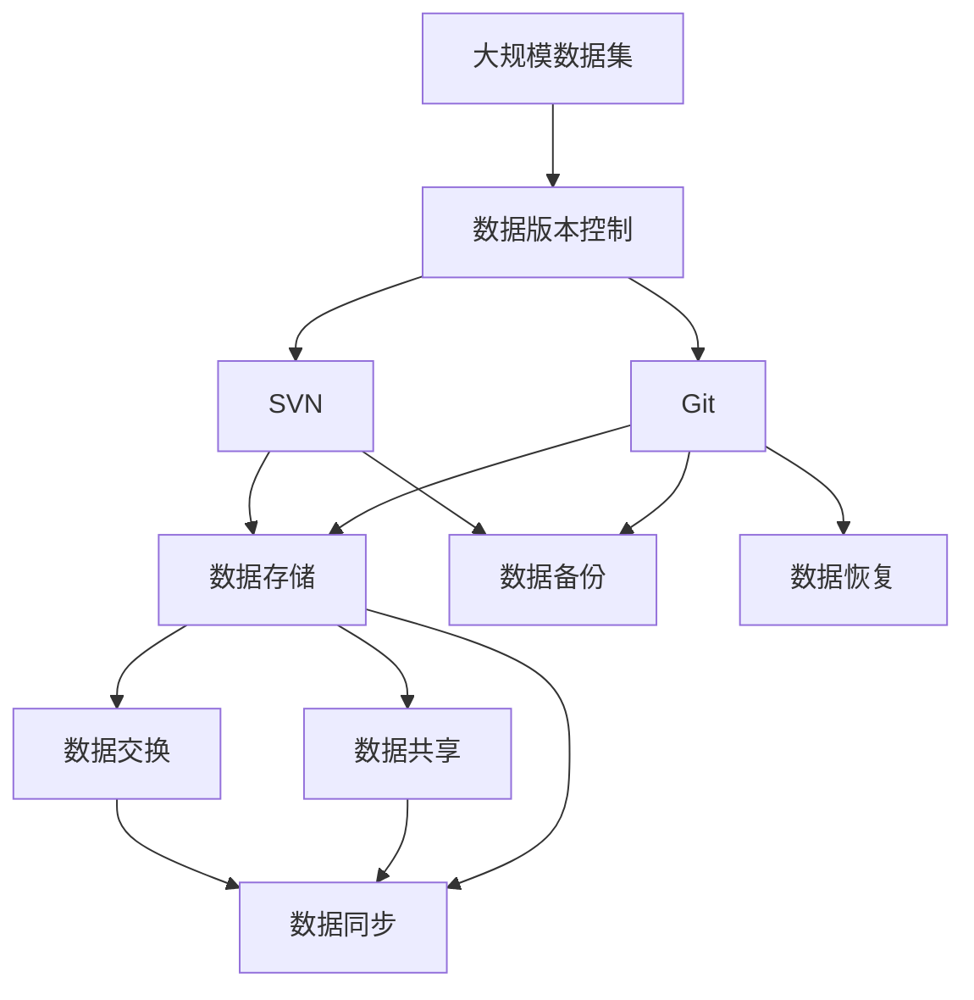

                 

# 数据版本控制与数据管理原理与代码实战案例讲解

> 关键词：数据版本控制, 数据管理, Git, SVN, 数据库版本控制, 数据流管理

## 1. 背景介绍

### 1.1 问题由来

在软件开发中，版本控制（Version Control）是一个基础但至关重要的工具。它帮助开发者管理代码的版本变化、跟踪变更历史、协调多人协作开发等。然而，对于数据处理而言，版本控制同样重要，特别是在数据科学和机器学习项目中，数据集往往占据了项目的大部分成本和精力。

传统的版本控制工具如SVN（Subversion）在数据科学领域应用广泛，但它们对大型数据集的读写性能较差，难以应对大规模数据处理的挑战。因此，开发更为高效、易于扩展的数据版本控制工具成为了数据科学领域的迫切需求。

### 1.2 问题核心关键点

数据版本控制的核心在于：

- 追踪数据集的变化历史
- 实现数据集的存储和管理
- 支持多人协同开发和数据共享
- 提供数据版本合并和冲突解决机制

## 2. 核心概念与联系

### 2.1 核心概念概述

为了更好地理解数据版本控制和数据管理，我们需要引入几个关键概念：

- **数据版本控制**：一种管理数据变更历史，支持数据集不同版本的存储和管理，并实现多人协同开发的技术。

- **数据管理**：一种管理数据生命周期的过程，包括数据的存储、检索、共享、备份和恢复等。

- **Git**：一种基于分布式版本控制系统的工具，常用于代码版本控制，但也可用于数据版本控制。

- **SVN**：一种集中式版本控制系统，常用于软件项目，但也可用于数据管理。

- **数据库版本控制**：一种将数据库变更记录保存至版本控制系统的技术，用于跟踪数据库结构、模式和数据的变更历史。

- **数据流管理**：一种管理数据在多个系统和用户间流动的过程，包括数据交换、同步、合并等。

这些概念之间存在密切联系，可以通过以下Mermaid流程图来展示：



该流程图展示了数据版本控制、数据管理、Git、SVN、数据库版本控制和数据流管理之间的联系和依赖关系。

### 2.2 概念间的关系

这些概念之间存在着紧密的联系，形成了数据管理的基本框架。下面我们通过几个Mermaid流程图来展示这些概念之间的关系。

#### 2.2.1 数据版本控制与数据管理的联系



这个流程图展示了数据版本控制如何通过管理数据存储、备份、恢复、共享、交换和同步来实现数据管理。

#### 2.2.2 Git与SVN的联系



这个流程图展示了Git和SVN在版本控制领域的联系，以及它们在数据版本控制上的应用。

#### 2.2.3 数据库版本控制与数据管理的联系



这个流程图展示了数据库版本控制如何通过管理数据库结构、模式和数据变更来实现数据管理。

#### 2.2.4 数据流管理与数据管理的联系



这个流程图展示了数据流管理如何通过数据交换、同步、合并和冲突解决来实现数据管理。

### 2.3 核心概念的整体架构

最后，我们用一个综合的流程图来展示这些核心概念在大数据管理中的应用：



这个综合流程图展示了在大数据管理中，数据版本控制、Git、SVN、数据存储、数据备份、数据恢复、数据共享、数据交换和数据同步等概念的交互和应用。

## 3. 核心算法原理 & 具体操作步骤

### 3.1 算法原理概述

数据版本控制的原理基于分布式版本控制系统（DVCS），其核心思想是使用版本控制系统来管理数据集的变更历史，并支持多人协同开发。数据版本控制系统的基本操作包括提交（Commit）、合并（Merge）、回滚（Rollback）等。

#### 3.1.1 提交（Commit）

提交操作用于记录数据集的最新状态，将新增加、修改或删除的数据保存到版本控制系统中。

#### 3.1.2 合并（Merge）

合并操作用于将多个版本的变更整合到同一个版本中，实现多人协作开发和版本更新。

#### 3.1.3 回滚（Rollback）

回滚操作用于撤销之前的提交，恢复数据集到之前的版本状态。

#### 3.1.4 版本冲突解决

在多人协同开发中，同一数据集的不同版本可能会存在冲突。版本控制系统提供了自动或手动解决冲突的机制，以确保数据集的一致性。

### 3.2 算法步骤详解

数据版本控制的具体操作流程如下：

1. **初始化**：在本地创建数据版本控制仓库，将数据集拷贝到本地仓库中。

2. **提交（Commit）**：记录数据集的变化，将新数据提交到本地仓库。

3. **合并（Merge）**：将远程仓库的最新变更合并到本地仓库中，解决版本冲突。

4. **拉取（Pull）**：从远程仓库拉取最新的变更到本地仓库。

5. **推送（Push）**：将本地仓库的最新变更推送到远程仓库。

6. **回滚（Rollback）**：撤销最近的提交，恢复到之前的版本状态。

7. **分支（Branch）**：创建新的数据集分支，支持并发开发和版本隔离。

8. **合并分支**：将多个分支的变更合并到主分支中，实现数据集的版本更新。

9. **标签（Tag）**：记录数据集的特定版本，方便回溯和发布。

10. **冲突解决**：自动或手动解决合并过程中的版本冲突，确保数据集的一致性。

### 3.3 算法优缺点

#### 3.3.1 优点

- 分布式协作：支持多人协同开发和版本共享，提高开发效率。
- 历史记录清晰：记录数据集的变化历史，方便版本回溯和问题定位。
- 分支管理灵活：支持分支创建、合并和隔离，实现并发开发。
- 版本冲突解决：提供自动或手动解决冲突的机制，确保数据集的一致性。

#### 3.3.2 缺点

- 学习曲线陡峭：对于不熟悉版本控制系统的开发者，需要一定时间学习和适应。
- 数据存储和读写性能问题：对大规模数据集的处理性能较差，需要优化。
- 复杂的操作流程：操作流程较为复杂，需要细心操作以避免错误。
- 安全性问题：多人协同开发中，需要谨慎处理权限和隐私问题。

### 3.4 算法应用领域

数据版本控制广泛应用于软件开发、数据分析、机器学习等领域，支持团队协作和数据管理。例如：

- **软件开发**：支持代码的版本控制，实现多人协作开发。
- **数据分析**：支持数据集的版本控制，实现数据共享和版本更新。
- **机器学习**：支持模型和数据的版本控制，实现模型迭代和数据回溯。

## 4. 数学模型和公式 & 详细讲解 & 举例说明

### 4.1 数学模型构建

数据版本控制的核心数学模型是基于时间戳和变更记录的模型。

#### 4.1.1 时间戳

每个提交操作都带有时间戳，用于记录变更的时间。时间戳格式为YYYY-MM-DD HH:MM:SS。

#### 4.1.2 变更记录

每个提交操作都包含变更记录，用于描述数据集的具体变更内容。变更记录包括添加、修改和删除的操作。

### 4.2 公式推导过程

#### 4.2.1 提交（Commit）

提交操作的数学模型如下：

$$
\text{Commit}(t, v) = (t, \Delta v)
$$

其中，$t$ 为提交时间戳，$\Delta v$ 为变更记录。

#### 4.2.2 合并（Merge）

合并操作的数学模型如下：

$$
\text{Merge}(t_m, v_m, t_n, v_n) = \Delta v_m \cup \Delta v_n
$$

其中，$t_m$ 和 $v_m$ 为合并操作前的版本，$t_n$ 和 $v_n$ 为合并操作后的版本，$\Delta v_m$ 和 $\Delta v_n$ 为两个版本的变更记录。

#### 4.2.3 回滚（Rollback）

回滚操作的数学模型如下：

$$
\text{Rollback}(t_m, v_m, t_n, v_n) = (t_m, \Delta v_n)
$$

其中，$t_m$ 和 $v_m$ 为回滚前的版本，$t_n$ 和 $v_n$ 为回滚后的版本。

### 4.3 案例分析与讲解

假设我们有两个开发者A和B，共同开发一个数据集。A在2023-01-01 10:00提交了一个变更记录，B在2023-01-01 14:00提交了另一个变更记录。这两个变更记录合并后，我们得到的数据集版本为2023-01-01 14:00。

## 5. 项目实践：代码实例和详细解释说明

### 5.1 开发环境搭建

在实际开发中，我们首先需要搭建好开发环境。以下是使用Python和Git进行版本控制开发的配置流程：

1. 安装Python：从官网下载并安装Python，确保版本为3.8或更高版本。

2. 安装Git：从官网下载并安装Git，确保版本为2.27或更高版本。

3. 安装GitHub Desktop：从官网下载并安装GitHub Desktop，用于管理Git仓库。

4. 创建Git仓库：在本地创建一个新的Git仓库，将数据集文件拷贝到该仓库中。

5. 配置远程仓库：在GitHub上创建一个新的仓库，并将本地仓库与该远程仓库关联。

### 5.2 源代码详细实现

下面是使用Python和Git进行数据版本控制的样例代码：

```python
import git

# 创建本地仓库
repo = git.Repo.init()

# 提交数据集
repo.index.add(['data.csv'])
repo.index.commit('Initial commit')

# 合并远程仓库的变更
origin = repo.remotes.origin
origin.fetch()
repo.merge(origin.refs['main'])

# 拉取远程仓库的最新变更
repo.remotes.origin.fetch()

# 推送本地仓库的变更到远程仓库
repo.remotes.origin.push()

# 回滚到之前的提交
repo.git.reset('--hard', origin.refs['main^'])

# 创建新的数据集分支
repo.create_head('new_data')

# 切换到新分支
repo.heads['new_data'].checkout()

# 提交新分支的变更
repo.index.add(['new_data.csv'])
repo.index.commit('New data added')

# 合并新分支到主分支
repo.merge('--no-edit', origin.refs['new_data'])
```

### 5.3 代码解读与分析

让我们再详细解读一下关键代码的实现细节：

- **创建本地仓库**：使用Git的Python API创建一个新的本地仓库。
- **提交数据集**：将数据集文件添加到索引中，并提交一个新的变更记录。
- **合并远程仓库的变更**：拉取远程仓库的最新变更，并合并到本地仓库中。
- **拉取远程仓库的最新变更**：拉取远程仓库的最新变更到本地仓库中。
- **推送本地仓库的变更到远程仓库**：将本地仓库的最新变更推送到远程仓库中。
- **回滚到之前的提交**：将本地仓库回滚到之前的提交版本。
- **创建新的数据集分支**：创建一个新的分支，用于并发开发。
- **切换到新分支**：切换到新分支。
- **提交新分支的变更**：在新分支中添加新数据，并提交新的变更记录。
- **合并新分支到主分支**：将新分支的变更合并到主分支中。

### 5.4 运行结果展示

在实际运行过程中，我们可能会遇到一些错误和异常。例如，如果提交的变更记录存在冲突，Git会提示用户解决冲突。下面是一个解决冲突的示例：

```
CONFLICT (content): Merge conflict in file data.csv
Automatic merge failed; fix conflicts and then commit the result.

--- a/data.csv
+++ b/data.csv
@@ -1 +1 @@
-Hello World
+Hello World
```

在这个示例中，A和B在修改data.csv文件时出现了冲突，Git提示用户手动解决冲突。解决冲突后，可以提交新的变更记录。

## 6. 实际应用场景

### 6.1 智能数据分析平台

在智能数据分析平台中，数据版本控制尤为重要。平台需要支持多个用户协同编辑数据集，并记录数据集的变化历史，方便回溯和版本管理。例如，Google Colab、Jupyter Notebook等工具都集成了Git版本控制，方便用户进行数据分析和协作开发。

### 6.2 大数据处理流程

在大数据处理流程中，数据版本控制有助于实现数据的版本管理和自动化流程。例如，Apache Hadoop和Apache Spark都支持数据版本控制，用于记录数据处理的任务和变更历史。

### 6.3 模型版本管理

在机器学习项目中，数据版本控制用于管理模型和数据集的变更历史，方便模型迭代和回溯。例如，TensorFlow和PyTorch等深度学习框架都支持数据版本控制，用于管理模型和数据集的变更历史。

## 7. 工具和资源推荐

### 7.1 学习资源推荐

为了帮助开发者系统掌握数据版本控制和数据管理理论，这里推荐一些优质的学习资源：

- 《Pro Git》：Git的权威指南，涵盖Git的基本概念、命令和操作。
- 《Data Version Control》：数据版本控制的概念和实践，详细介绍了数据版本控制的基本原理和工具。
- 《Database Version Control with Git》：使用Git进行数据库版本控制，详细介绍了数据库版本控制的基本操作和注意事项。
- 《Version Control with Git》：Git的经典教程，详细介绍了Git的基本概念和操作。

### 7.2 开发工具推荐

以下是几款用于数据版本控制开发的常用工具：

- GitHub Desktop：GitHub提供的桌面客户端，用于管理Git仓库。
- GitKraken：一款轻量级的Git客户端，支持Windows、macOS和Linux平台。
- SourceTree：一款功能丰富的Git客户端，支持Windows、macOS和Linux平台。
- GitLab：一款Git仓库托管平台，提供Git仓库管理和协作开发功能。

### 7.3 相关论文推荐

数据版本控制和数据管理领域的研究不断涌现，以下是几篇奠基性的相关论文，推荐阅读：

- Git: The Unified Version Control System：Git的原始论文，详细介绍了Git的算法和实现。
- Git Evolution：Git的发展历程，介绍了Git从1.0到2.0的演变过程。
- SVN: A Repository Management System for Software Configuration Management：SVN的原始论文，详细介绍了SVN的基本概念和操作。
- Version Control for Data Acquisition and Preparation for Big Data Research：数据版本控制在大数据研究中的应用，详细介绍了数据版本控制的基本原理和操作。

除上述资源外，还有一些值得关注的前沿资源，帮助开发者紧跟数据版本控制和数据管理技术的最新进展，例如：

- arXiv论文预印本：人工智能领域最新研究成果的发布平台，包括大量尚未发表的前沿工作，学习前沿技术的必读资源。
- GitHub热门项目：在GitHub上Star、Fork数最多的数据版本控制相关项目，往往代表了该技术领域的发展趋势和最佳实践，值得去学习和贡献。
- 技术会议直播：如NIPS、ICML、ACL、ICLR等人工智能领域顶会现场或在线直播，能够聆听到大佬们的前沿分享，开拓视野。
- 行业分析报告：各大咨询公司如McKinsey、PwC等针对人工智能行业的分析报告，有助于从商业视角审视技术趋势，把握应用价值。

总之，对于数据版本控制和数据管理技术的学习和实践，需要开发者保持开放的心态和持续学习的意愿。多关注前沿资讯，多动手实践，多思考总结，必将收获满满的成长收益。

## 8. 总结：未来发展趋势与挑战

### 8.1 总结

本文对数据版本控制和数据管理原理进行了全面系统的介绍。首先阐述了数据版本控制和数据管理的基本概念和核心思想，明确了数据版本控制和数据管理在数据分析、机器学习等领域的实际应用。其次，从原理到实践，详细讲解了数据版本控制的操作流程和数学模型，给出了数据版本控制的代码实现。同时，本文还广泛探讨了数据版本控制和数据管理在多个行业领域的应用场景，展示了数据版本控制和数据管理的巨大潜力。

通过本文的系统梳理，可以看到，数据版本控制和数据管理技术在大数据科学和机器学习项目中具有重要意义，能够支持多人协同开发、记录数据变更历史、管理数据集版本、实现数据共享和自动流程等。未来，伴随数据规模的不断增大和数据处理复杂度的不断提高，数据版本控制和数据管理技术必将迎来更大的发展空间和挑战。

### 8.2 未来发展趋势

展望未来，数据版本控制和数据管理技术将呈现以下几个发展趋势：

1. **云原生数据版本控制**：随着云原生技术的普及，云原生数据版本控制工具将成为主流，支持云平台的数据版本管理和协作开发。

2. **自动化数据版本管理**：自动化工具将逐渐替代手动操作，实现数据版本管理的自动化和智能化。

3. **大数据版本控制优化**：针对大数据处理的特殊需求，开发更加高效、可扩展的数据版本控制工具，解决大规模数据处理的性能瓶颈。

4. **数据版本冲突解决**：开发更加智能化的数据版本冲突解决算法，确保数据版本管理的稳定性。

5. **多平台数据版本控制**：支持多种平台和工具的数据版本控制，实现数据版本管理的统一和标准化。

6. **数据版本加密保护**：数据版本控制工具将提供更加严格的数据加密和权限管理功能，确保数据安全。

### 8.3 面临的挑战

尽管数据版本控制和数据管理技术已经取得了瞩目成就，但在迈向更加智能化、普适化应用的过程中，它仍面临着诸多挑战：

1. **大规模数据处理性能问题**：数据版本控制工具对大规模数据集的读写性能较差，难以应对大数据处理的挑战。

2. **复杂的操作流程**：数据版本控制的操作流程较为复杂，需要细心操作以避免错误。

3. **数据版本冲突解决**：在多人协同开发中，同一数据集的不同版本可能会存在冲突，需要谨慎处理。

4. **安全性问题**：数据版本控制工具需要提供严格的数据加密和权限管理功能，确保数据安全。

5. **自动化工具不足**：自动化工具仍然不足，需要更多的研究和开发。

### 8.4 研究展望

面对数据版本控制和数据管理所面临的挑战，未来的研究需要在以下几个方面寻求新的突破：

1. **开发高效的数据版本控制工具**：开发更加高效、可扩展的数据版本控制工具，解决大规模数据处理的性能瓶颈。

2. **实现数据版本管理的自动化**：开发自动化工具，实现数据版本管理的自动化和智能化。

3. **开发智能化的数据版本冲突解决算法**：开发更加智能化的数据版本冲突解决算法，确保数据版本管理的稳定性。

4. **支持多种平台和工具的数据版本控制**：支持多种平台和工具的数据版本控制，实现数据版本管理的统一和标准化。

5. **加强数据版本加密保护**：开发数据版本控制工具，提供更加严格的数据加密和权限管理功能，确保数据安全。

6. **开发更加高效的数据版本控制算法**：开发更加高效的数据版本控制算法，提升数据版本控制的性能和效率。

总之，数据版本控制和数据管理技术在未来仍有很大的发展空间和挑战。只有不断地进行技术创新和优化，才能实现更加智能化、普适化的数据版本控制和数据管理，推动大数据科学和机器学习技术的进一步发展。

## 9. 附录：常见问题与解答

**Q1：数据版本控制是否适用于所有数据集？**

A: 数据版本控制适用于大多数数据集，特别是需要进行多人协同开发和版本管理的数据集。对于特定领域的数据集，需要进行领域特定的适配和优化。

**Q2：数据版本控制工具如何选择？**

A: 选择数据版本控制工具时，需要考虑数据集的大小、并发开发的需求、平台兼容性等因素。常见的工具包括Git、SVN等，需要根据实际需求进行选择。

**Q3：数据版本冲突如何解决？**

A: 数据版本冲突可以通过自动合并、手动合并、人工介入等方式解决。需要根据具体场景选择合适的方法，确保数据版本的一致性。

**Q4：数据版本控制的性能瓶颈如何优化？**

A: 数据版本控制的性能瓶颈可以通过优化工具、使用并行处理、压缩数据等方式进行优化。需要根据实际需求选择合适的方法。

**Q5：数据版本控制的复杂操作流程如何简化？**

A: 数据版本控制的复杂操作流程可以通过自动化工具、脚本化操作等方式进行简化。需要根据实际需求选择合适的方法。

总之，数据版本控制和数据管理技术在数据科学和机器学习领域具有重要意义，能够支持多人协同开发、记录数据变更历史、管理数据集版本、实现数据共享和自动流程等。未来，伴随数据规模的不断增大和数据处理复杂度的不断提高，数据版本控制和数据管理技术必将迎来更大的发展空间和挑战。只有不断地进行技术创新和优化，才能实现更加智能化、普适化的数据版本控制和数据管理，推动大数据科学和机器学习技术的进一步发展。

---

作者：禅与计算机程序设计艺术 / Zen and the Art of Computer Programming

