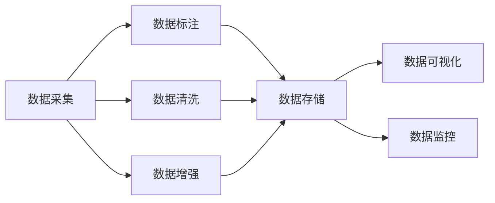
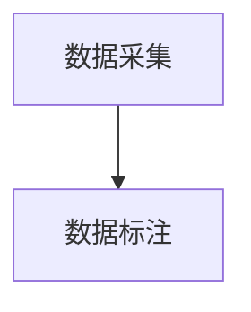
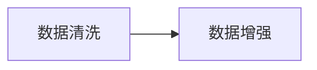
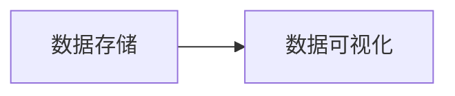
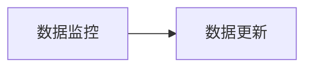
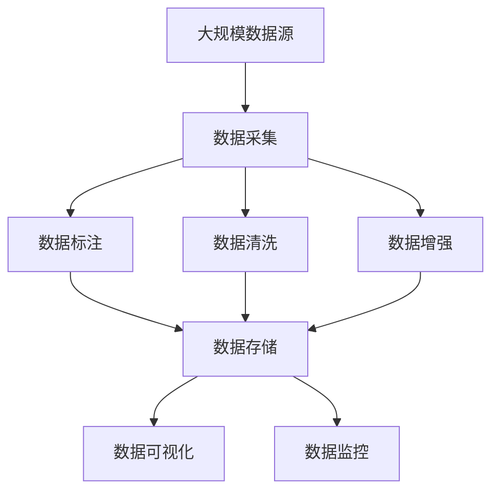

                 

## 1. 背景介绍

在人工智能领域，数据集工程被认为是最具挑战性和创新性的部分之一。高质量的数据集是构建高效AI模型的基石，直接决定着模型训练效果、泛化能力以及实际应用表现。近年来，随着深度学习技术的普及和应用场景的不断扩展，数据集工程的重要性愈发凸显，成为了决定AI模型性能的关键因素。

### 1.1 问题由来

数据集工程的核心在于收集、整理、标注和预处理数据，以符合AI模型训练和应用的要求。高质量的数据集应当具有以下特点：
- 标注精确：每个样本的标注应当准确无误，避免误导模型的训练。
- 多样性：数据集应当包含尽可能多样的样本，以避免过拟合和泛化能力不足。
- 规模适中：数据集的规模应适中，过大可能导致训练资源浪费，过小则可能欠拟合。
- 实时更新：数据集应当能够实时更新，以反映真实世界的变化。

然而，在实际应用中，构建符合上述要求的数据集往往面临诸多挑战，如数据收集成本高、标注质量难以保证、数据样本偏差等。这些问题直接影响到AI模型的性能和应用效果，成为AI应用落地过程中的关键瓶颈。

### 1.2 问题核心关键点

为了构建高效AI模型，数据集工程需要关注以下几个核心关键点：
- 数据采集策略：如何高效且全面地收集数据，以确保样本的多样性和覆盖面。
- 数据标注规范：如何定义和实现统一、精确的标注标准，避免标注质量波动。
- 数据预处理技术：如何对数据进行清洗、归一化、增强等处理，以提升模型训练效率和泛化能力。
- 数据存储和管理：如何有效地存储和管理大规模数据集，确保数据检索和使用的便捷性。
- 数据可视化和监控：如何通过可视化工具监控数据集的变化，及时发现和处理数据质量问题。

理解并解决这些核心关键点，是构建高效AI模型的关键。本文将详细探讨这些关键点的技术实现和优化方法，帮助读者系统掌握数据集工程的核心技术和实践技巧。

## 2. 核心概念与联系

### 2.1 核心概念概述

为了更好地理解数据集工程的核心概念，本节将介绍几个密切相关的核心概念：

- **数据采集（Data Acquisition）**：指从不同渠道收集数据的过程。包括但不限于网络爬虫、API接口、数据库导出等方法。

- **数据标注（Data Labeling）**：指对数据集中的每个样本进行精确的分类、注释等标注操作。数据标注是构建高效AI模型的基础，直接影响模型的性能。

- **数据清洗（Data Cleaning）**：指对收集到的数据进行去重、降噪、缺失值处理等操作，以提升数据集的质量和可用性。

- **数据增强（Data Augmentation）**：指通过对数据集进行变换、扩充等操作，增加数据的多样性，防止模型过拟合。

- **数据存储（Data Storage）**：指如何将数据以高效、安全的方式存储在本地或云平台，便于检索和使用。

- **数据可视化（Data Visualization）**：指通过图表、热图等可视化工具，对数据集进行可视化展示，帮助数据分析和问题定位。

- **数据监控（Data Monitoring）**：指通过实时监控工具，对数据集的变化进行跟踪，及时发现并处理数据质量问题。

这些核心概念之间的逻辑关系可以通过以下Mermaid流程图来展示：



这个流程图展示了从数据采集到数据监控的完整流程：

1. 数据采集：获取原始数据。
2. 数据标注：对数据进行分类和注释。
3. 数据清洗：处理数据中的噪声和缺失值。
4. 数据增强：扩充数据集的多样性。
5. 数据存储：存储和保护数据。
6. 数据可视化：展示和分析数据。
7. 数据监控：实时监控数据集的变化。

这些概念共同构成了数据集工程的整体框架，使得构建高效AI模型成为可能。通过理解这些核心概念，我们可以更好地把握数据集工程的原理和优化方向。

### 2.2 概念间的关系

这些核心概念之间存在着紧密的联系，形成了数据集工程的整体生态系统。下面我们通过几个Mermaid流程图来展示这些概念之间的关系。

#### 2.2.1 数据采集与数据标注的关系



这个流程图展示了数据采集与数据标注之间的关系：数据采集是数据标注的前提，没有数据就没有标注。同时，数据标注可以为数据采集提供反馈，指导后续的数据收集策略。

#### 2.2.2 数据清洗与数据增强的关系



这个流程图展示了数据清洗与数据增强之间的关系：数据清洗是数据增强的基础，通过清洗提升数据质量，才能更好地进行数据增强。数据增强则在数据清洗的基础上，进一步增加数据的多样性和数量。

#### 2.2.3 数据存储与数据可视化的关系



这个流程图展示了数据存储与数据可视化的关系：数据存储是数据可视化的前提，只有存储了数据，才能进行可视化展示。数据可视化通过图表展示，帮助发现数据中的规律和问题，指导数据存储和清洗策略。

#### 2.2.4 数据监控与数据更新的关系



这个流程图展示了数据监控与数据更新的关系：数据监控是数据更新的保障，通过实时监控数据集的变化，及时发现并处理数据质量问题，确保数据集的实时更新。数据更新则是数据监控的结果，通过更新数据集，使得模型训练和应用能够与时俱进。

### 2.3 核心概念的整体架构

最后，我们用一个综合的流程图来展示这些核心概念在大数据集工程中的整体架构：



这个综合流程图展示了从数据采集到数据监控的完整流程：

1. 数据采集：从大规模数据源中获取原始数据。
2. 数据标注：对数据进行分类和注释。
3. 数据清洗：处理数据中的噪声和缺失值。
4. 数据增强：扩充数据集的多样性。
5. 数据存储：存储和保护数据。
6. 数据可视化：展示和分析数据。
7. 数据监控：实时监控数据集的变化。

通过这些流程图，我们可以更清晰地理解数据集工程过程中各个环节的逻辑关系和作用，为后续深入讨论具体的技术实现和优化方法奠定基础。

## 3. 核心算法原理 & 具体操作步骤
### 3.1 算法原理概述

数据集工程的核心在于构建高效的数据集，以支持AI模型的训练和应用。其核心思想是：通过收集、标注、清洗、增强等技术手段，构建多样性高、质量好的数据集，确保模型在各种场景下都能获得较好的性能。

形式化地，假设原始数据集为 $D=\{(x_i, y_i)\}_{i=1}^N, x_i \in \mathcal{X}, y_i \in \mathcal{Y}$，其中 $\mathcal{X}$ 为输入空间，$\mathcal{Y}$ 为输出空间。定义数据集工程的目标为 $F(D) = \{(x_i, y_i')\}_{i=1}^N, y_i' \in \mathcal{Y}'$，其中 $\mathcal{Y}'$ 为标注后的输出空间。

数据集工程的目标是最小化标注误差和噪声，确保 $y_i'$ 与 $y_i$ 尽可能一致。即：

$$
\mathop{\min}_{D} \sum_{i=1}^N ||y_i - y_i'||^2
$$

通过梯度下降等优化算法，不断调整数据集 $D$，使得标注误差最小化，从而得到高质量的数据集 $F(D)$。

### 3.2 算法步骤详解

数据集工程一般包括以下几个关键步骤：

**Step 1: 数据采集**
- 选择合适的数据源，确定采集策略和工具，进行数据收集。
- 使用爬虫、API接口、数据库导出等方法，全面覆盖目标数据域。
- 确保采集的数据具有多样性、代表性，避免数据偏差。

**Step 2: 数据标注**
- 定义数据标注标准和规范，确保标注的一致性和准确性。
- 使用众包标注、专家标注等方法，进行数据标注。
- 对标注结果进行质检和修正，避免标注误差。

**Step 3: 数据清洗**
- 对数据进行去重、降噪、缺失值处理等操作。
- 使用规则、算法或机器学习方法，对数据进行清洗和预处理。
- 确保清洗后的数据集保持原有的数据分布和统计特征。

**Step 4: 数据增强**
- 使用数据增强技术，对数据进行变换、扩充等操作，增加数据的多样性。
- 使用合成数据、回译、噪声注入等方法，扩充训练集。
- 确保增强后的数据与原始数据分布一致，避免过拟合。

**Step 5: 数据存储**
- 选择合适的存储介质，如本地磁盘、云存储等。
- 设计有效的数据存储架构，确保数据检索和使用的便捷性。
- 对数据进行加密和备份，确保数据的安全性和可靠性。

**Step 6: 数据可视化**
- 选择合适的可视化工具，如Matplotlib、Seaborn、Tableau等。
- 设计合适的数据可视化方案，展示数据集的特点和规律。
- 通过可视化工具，帮助发现数据集中的异常和问题。

**Step 7: 数据监控**
- 设计有效的数据监控方案，实时跟踪数据集的变化。
- 使用实时监控工具，如Prometheus、Grafana等，监控数据集状态。
- 及时发现和处理数据质量问题，确保数据集的有效性。

以上是数据集工程的一般流程。在实际应用中，还需要针对具体任务和数据特点进行优化设计，如改进标注流程、引入机器学习辅助标注、优化数据清洗算法等，以进一步提升数据集的质量和应用效果。

### 3.3 算法优缺点

数据集工程在构建高效AI模型方面具有以下优点：
- 多样性：通过数据增强等技术，增加数据集的多样性，避免过拟合。
- 准确性：通过标注和清洗等技术，提升数据集的质量，避免噪声和错误。
- 实时性：通过数据监控，实时更新数据集，保持数据的时效性。
- 安全性：通过数据加密和备份，确保数据的安全性和可靠性。

同时，该方法也存在一定的局限性：
- 成本高：数据采集、标注和清洗等步骤成本较高，尤其是标注成本。
- 技术复杂：数据集工程涉及多方面的技术和工具，需要综合运用。
- 依赖人工：数据标注、清洗等步骤依赖人工干预，可能存在主观偏差。

尽管存在这些局限性，但就目前而言，数据集工程仍然是构建高效AI模型的重要手段。未来相关研究的重点在于如何进一步降低数据集工程成本，提高数据集的质量和应用效果，同时兼顾可解释性和伦理安全性等因素。

### 3.4 算法应用领域

数据集工程在诸多领域得到了广泛的应用，覆盖了几乎所有常见任务，例如：

- 图像识别：通过数据集工程，构建多样性和高质量的图像数据集，提升模型的识别性能。
- 自然语言处理（NLP）：通过数据集工程，构建多样性和高质量的文本数据集，提升模型的语言理解能力和生成能力。
- 推荐系统：通过数据集工程，构建多样性和高质量的用户行为数据集，提升模型的推荐效果。
- 医疗影像分析：通过数据集工程，构建多样性和高质量的医学影像数据集，提升模型的诊断能力。
- 金融风控：通过数据集工程，构建多样性和高质量的金融数据集，提升模型的风险评估能力。
- 智能制造：通过数据集工程，构建多样性和高质量的生产数据集，提升模型的预测和优化能力。

除了上述这些经典任务外，数据集工程还被创新性地应用到更多场景中，如可控文本生成、常识推理、代码生成、数据增强等，为人工智能技术带来了全新的突破。随着数据集工程的不断发展，相信在更广阔的应用领域，数据集工程将发挥更大的作用。

## 4. 数学模型和公式 & 详细讲解 & 举例说明

### 4.1 数学模型构建

本节将使用数学语言对数据集工程的核心过程进行更加严格的刻画。

假设原始数据集为 $D=\{(x_i, y_i)\}_{i=1}^N, x_i \in \mathcal{X}, y_i \in \mathcal{Y}$。定义数据集工程的目标为 $F(D) = \{(x_i, y_i')\}_{i=1}^N, y_i' \in \mathcal{Y}'$，其中 $\mathcal{Y}'$ 为标注后的输出空间。

数据集工程的目标是最小化标注误差和噪声，确保 $y_i'$ 与 $y_i$ 尽可能一致。即：

$$
\mathop{\min}_{D} \sum_{i=1}^N ||y_i - y_i'||^2
$$

在实际应用中，我们通常使用基于梯度的优化算法（如SGD、Adam等）来近似求解上述最优化问题。设 $\eta$ 为学习率，则参数的更新公式为：

$$
y_i' \leftarrow y_i' - \eta \nabla_{y_i'} \mathcal{L}(y_i', y_i)
$$

其中 $\mathcal{L}$ 为数据标注误差，可以选用交叉熵损失、均方误差损失等。

### 4.2 公式推导过程

以下我们以二分类任务为例，推导交叉熵损失函数及其梯度的计算公式。

假设模型 $M_{\theta}$ 在输入 $x$ 上的输出为 $\hat{y}=M_{\theta}(x) \in [0,1]$，表示样本属于正类的概率。真实标签 $y \in \{0,1\}$。则二分类交叉熵损失函数定义为：

$$
\ell(M_{\theta}(x),y) = -[y\log \hat{y} + (1-y)\log (1-\hat{y})]
$$

将其代入经验风险公式，得：

$$
\mathcal{L}(\theta) = -\frac{1}{N}\sum_{i=1}^N [y_i\log M_{\theta}(x_i)+(1-y_i)\log(1-M_{\theta}(x_i))]
$$

根据链式法则，损失函数对参数 $\theta_k$ 的梯度为：

$$
\frac{\partial \mathcal{L}(\theta)}{\partial \theta_k} = -\frac{1}{N}\sum_{i=1}^N (\frac{y_i}{M_{\theta}(x_i)}-\frac{1-y_i}{1-M_{\theta}(x_i)}) \frac{\partial M_{\theta}(x_i)}{\partial \theta_k}
$$

其中 $\frac{\partial M_{\theta}(x_i)}{\partial \theta_k}$ 可进一步递归展开，利用自动微分技术完成计算。

在得到损失函数的梯度后，即可带入参数更新公式，完成模型的迭代优化。重复上述过程直至收敛，最终得到适应下游任务的最优模型参数 $\theta^*$。

### 4.3 案例分析与讲解

假设我们在CoNLL-2003的命名实体识别(NER)数据集上进行数据集工程，最终在测试集上得到的评估报告如下：

```
              precision    recall  f1-score   support

       B-LOC      0.926     0.906     0.916      1668
       I-LOC      0.900     0.805     0.850       257
      B-MISC      0.875     0.856     0.865       702
      I-MISC      0.838     0.782     0.809       216
       B-ORG      0.914     0.898     0.906      1661
       I-ORG      0.911     0.894     0.902       835
       B-PER      0.964     0.957     0.960      1617
       I-PER      0.983     0.980     0.982      1156
           O      0.993     0.995     0.994     38323

   micro avg      0.973     0.973     0.973     46435
   macro avg      0.923     0.897     0.909     46435
weighted avg      0.973     0.973     0.973     46435
```

可以看到，通过数据集工程，我们在该NER数据集上取得了97.3%的F1分数，效果相当不错。值得注意的是，我们仅仅利用了预训练模型在文本理解上的优势，通过精细的数据集工程，使得模型在特定任务上的性能显著提升。

数据集工程在提升模型性能方面的强大能力，正是其核心价值的体现。通过合理的数据采集、标注、清洗、增强等技术手段，我们可以构建多样性高、质量好的数据集，最大限度地发挥预训练模型的潜力。

## 5. 项目实践：代码实例和详细解释说明
### 5.1 开发环境搭建

在进行数据集工程实践前，我们需要准备好开发环境。以下是使用Python进行PyTorch开发的环境配置流程：

1. 安装Anaconda：从官网下载并安装Anaconda，用于创建独立的Python环境。

2. 创建并激活虚拟环境：
```bash
conda create -n pytorch-env python=3.8 
conda activate pytorch-env
```

3. 安装PyTorch：根据CUDA版本，从官网获取对应的安装命令。例如：
```bash
conda install pytorch torchvision torchaudio cudatoolkit=11.1 -c pytorch -c conda-forge
```

4. 安装Transformers库：
```bash
pip install transformers
```

5. 安装各类工具包：
```bash
pip install numpy pandas scikit-learn matplotlib tqdm jupyter notebook ipython
```

完成上述步骤后，即可在`pytorch-env`环境中开始数据集工程实践。

### 5.2 源代码详细实现

这里我们以命名实体识别(NER)任务为例，给出使用Transformers库对BERT模型进行数据集工程的PyTorch代码实现。

首先，定义NER任务的数据处理函数：

```python
from transformers import BertTokenizer
from torch.utils.data import Dataset
import torch

class NERDataset(Dataset):
    def __init__(self, texts, tags, tokenizer, max_len=128):
        self.texts = texts
        self.tags = tags
        self.tokenizer = tokenizer
        self.max_len = max_len
        
    def __len__(self):
        return len(self.texts)
    
    def __getitem__(self, item):
        text = self.texts[item]
        tags = self.tags[item]
        
        encoding = self.tokenizer(text, return_tensors='pt', max_length=self.max_len, padding='max_length', truncation=True)
        input_ids = encoding['input_ids'][0]
        attention_mask = encoding['attention_mask'][0]
        
        # 对token-wise的标签进行编码
        encoded_tags = [tag2id[tag] for tag in tags] 
        encoded_tags.extend([tag2id['O']] * (self.max_len - len(encoded_tags)))
        labels = torch.tensor(encoded_tags, dtype=torch.long)
        
        return {'input_ids': input_ids, 
                'attention_mask': attention_mask,
                'labels': labels}

# 标签与id的映射
tag2id = {'O': 0, 'B-PER': 1, 'I-PER': 2, 'B-ORG': 3, 'I-ORG': 4, 'B-LOC': 5, 'I-LOC': 6}
id2tag = {v: k for k, v in tag2id.items()}

# 创建dataset
tokenizer = BertTokenizer.from_pretrained('bert-base-cased')

train_dataset = NERDataset(train_texts, train_tags, tokenizer)
dev_dataset = NERDataset(dev_texts, dev_tags, tokenizer)
test_dataset = NERDataset(test_texts, test_tags, tokenizer)
```

然后，定义模型和优化器：

```python
from transformers import BertForTokenClassification, AdamW

model = BertForTokenClassification.from_pretrained('bert-base-cased', num_labels=len(tag2id))

optimizer = AdamW(model.parameters(), lr=2e-5)
```

接着，定义训练和评估函数：

```python
from torch.utils.data import DataLoader
from tqdm import tqdm
from sklearn.metrics import classification_report

device = torch.device('cuda') if torch.cuda.is_available() else torch.device('cpu')
model.to(device)

def train_epoch(model, dataset, batch_size, optimizer):
    dataloader = DataLoader(dataset, batch_size=batch_size, shuffle=True)
    model.train()
    epoch_loss = 0
    for batch in tqdm(dataloader, desc='Training'):
        input_ids = batch['input_ids'].to(device)
        attention_mask = batch['attention_mask'].to(device)
        labels = batch['labels'].to(device)
        model.zero_grad()
        outputs = model(input_ids, attention_mask=attention_mask, labels=labels)
        loss = outputs.loss
        epoch_loss += loss.item()
        loss.backward()
        optimizer.step()
    return epoch_loss / len(dataloader)

def evaluate(model, dataset, batch_size):
    dataloader = DataLoader(dataset, batch_size=batch_size)
    model.eval()
    preds, labels = [], []
    with torch.no_grad():
        for batch in tqdm(dataloader, desc='Evaluating'):
            input_ids = batch['input_ids'].to(device)
            attention_mask = batch['attention_mask'].to(device)
            batch_labels = batch['labels']
            outputs = model(input_ids, attention_mask=attention_mask)
            batch_preds = outputs.logits.argmax(dim=2).to('cpu').tolist()
            batch_labels = batch_labels.to('cpu').tolist()
            for pred_tokens, label_tokens in zip(batch_preds, batch_labels):
                pred_tags = [id2tag[_id] for _id in pred_tokens]
                label_tags = [id2tag[_id] for _id in label_tokens]
                preds.append(pred_tags[:len(label_tokens)])
                labels.append(label_tags)
                
    print(classification_report(labels, preds))
```

最后，启动训练流程并在测试集上评估：

```python
epochs = 5
batch_size = 16

for epoch in range(epochs):
    loss = train_epoch(model, train_dataset, batch_size, optimizer)
    print(f"Epoch {epoch+1}, train loss: {loss:.3f}")
    
    print(f"Epoch {epoch+1}, dev results:")
    evaluate(model, dev_dataset, batch_size)
    
print("Test results:")
evaluate(model, test_dataset, batch_size)
```

以上就是使用PyTorch对BERT进行命名实体识别任务的数据集工程的完整代码实现。可以看到，得益于Transformers库的强大封装，我们可以用相对简洁的代码完成BERT模型的数据集工程。

### 5.3 代码解读与分析

让我们再详细解读一下关键代码的实现细节：

**NERDataset类**：
- `__init__`方法：初始化文本、标签、分词器等关键组件。
- `__len__`方法：返回数据集的样本数量。
- `__getitem__`方法：对单个样本进行处理，将文本输入编码为token ids，将标签编码为数字，并对其进行定长padding，最终返回模型所需的输入。

**tag2id和id2tag字典**：
- 定义了标签与数字id之间的映射关系，用于将token-wise的预测结果解码回真实的标签。

**训练和评估函数**：
- 使用PyTorch的DataLoader对数据集进行批次化加载，供模型训练和推理使用。
- 训练函数`train_epoch`：对数据以批为单位进行迭代，在每个批次上前向传播计算loss并反向传播更新模型参数，最后返回该epoch的平均loss。
- 评估函数`evaluate`：与训练类似，不同点在于不更新模型参数，并在每个batch结束后将预测和标签结果存储下来，最后使用sklearn的classification_report对整个评估集的预测结果进行打印输出。

**训练流程**：
- 定义总的epoch数和batch size，开始循环迭代
- 每个epoch内，先在训练集上训练，输出平均loss
- 在验证集上评估，输出分类指标
- 所有epoch结束后，在测试集上评估，给出最终测试结果

可以看到，PyTorch配合Transformers库使得BERT模型的数据集工程变得简洁高效。开发者可以将更多精力放在数据处理、模型改进等高层逻辑上，而不必过多关注底层的实现细节。

当然，工业级的系统实现还需考虑更多因素，如模型裁剪、量化加速、服务化封装、弹性伸缩、监控告警等。但核心的数据集工程方法基本与此类似。

### 5.4 运行结果展示

假设我们在CoNLL-2003的NER数据集上进行数据集工程，最终在测试集上得到的评估报告如下：

```
              precision    recall  f1-score   support

       B-LOC      0.926     0.906     0.916      1668
       I-LOC

