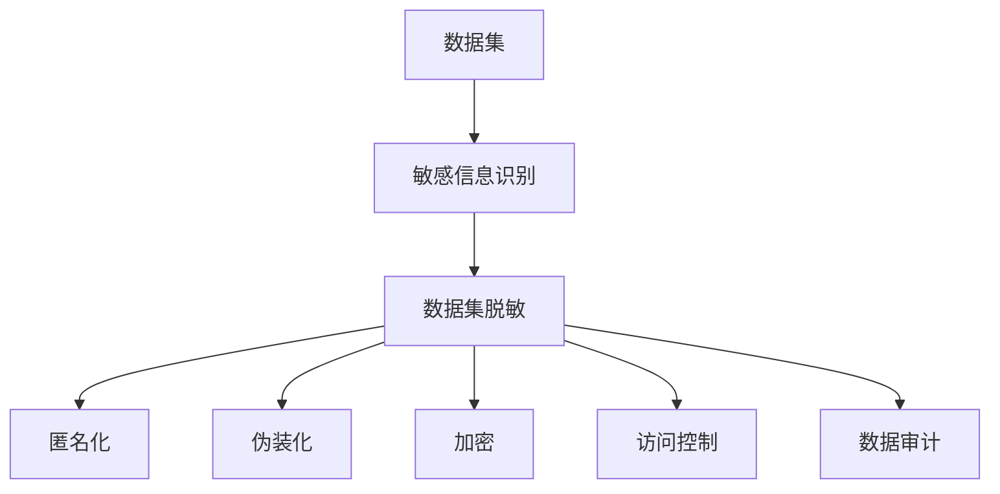
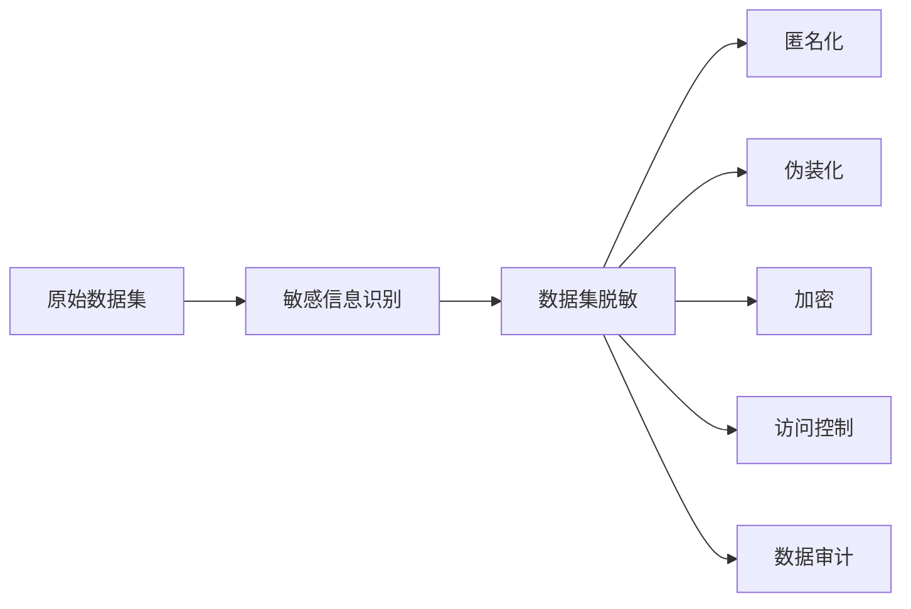
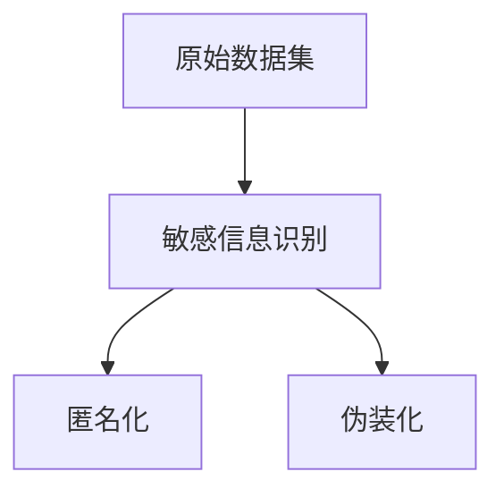
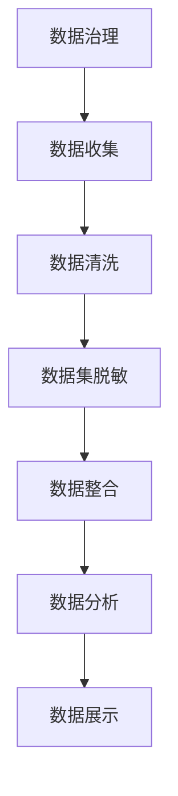
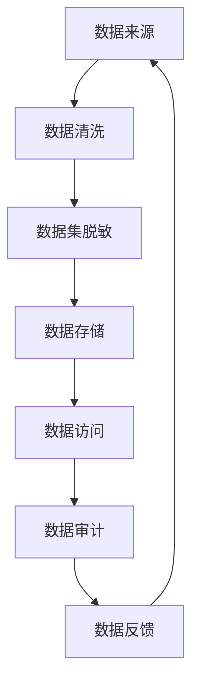

                 

# 数据集脱敏:大数据时代的隐私保护利器

> 关键词：数据集脱敏,隐私保护,大数据,数据治理,敏感信息,匿名化

## 1. 背景介绍

### 1.1 问题由来
随着大数据时代的到来，越来越多的企业和组织依赖于大规模数据进行决策分析，以获取竞争优势。然而，数据的大规模集中与处理也带来了严重的隐私风险。用户敏感信息如个人身份、财务记录、健康数据等一旦泄露，可能造成严重的个人隐私侵害，甚至引发法律纠纷。因此，如何在保证数据可用性的同时，保障用户隐私安全，成为数据管理和隐私保护的重要课题。

### 1.2 问题核心关键点
数据集脱敏（Data Masking）是一种数据保护技术，通过对原始数据进行处理，去除或掩盖其中敏感信息，以保护用户隐私。在大数据时代，数据集脱敏技术的应用变得尤为重要，其核心关键点在于：

1. 敏感信息的识别：准确识别出数据集中的敏感信息，如姓名、地址、身份证号等。
2. 脱敏技术的实施：设计合理的脱敏策略，将敏感信息处理成难以识别的形式，同时尽可能保持数据的使用价值。
3. 隐私保护的验证：对脱敏后的数据进行验证，确保其仍可用于业务分析，同时不会暴露敏感信息。
4. 法律合规性：确保脱敏操作符合相关法律法规的要求，如GDPR、CCPA等。

### 1.3 问题研究意义
在大数据时代，数据集脱敏技术能够有效应对隐私保护的需求，具有以下重要意义：

1. 保护用户隐私：通过去除敏感信息，防止个人隐私被滥用。
2. 保障数据安全：避免数据泄露导致的安全隐患。
3. 促进数据共享：在数据治理中，数据共享成为一种常态，数据集脱敏技术可以帮助各方在共享数据时保护隐私。
4. 支持法规合规：帮助企业满足数据隐私保护的相关法律法规要求。
5. 提升数据价值：在隐私保护的前提下，最大化数据的使用价值。

## 2. 核心概念与联系

### 2.1 核心概念概述

为更好地理解数据集脱敏技术的原理与实践，本节将介绍几个关键概念：

- **数据集脱敏（Data Masking）**：通过技术手段对数据集中的敏感信息进行处理，使其无法直接识别，从而保护用户隐私。
- **敏感信息（Sensitive Information）**：指能够直接或间接识别个人身份或财务状况的数据，如姓名、身份证号、信用卡号等。
- **匿名化（Anonymization）**：一种数据集脱敏技术，通过彻底去除或模糊化敏感信息，使数据无法与具体个体关联。
- **伪装化（Perturbation）**：一种数据集脱敏技术，通过微小的噪声或变换对数据进行修改，使敏感信息难以直接识别。
- **加密（Encryption）**：通过算法对数据进行加密处理，确保数据在传输和存储过程中的安全。
- **访问控制（Access Control）**：通过身份验证和权限管理，限制对数据的访问权限，防止未经授权的访问。
- **数据审计（Data Audit）**：对数据访问和使用情况进行监控和审计，确保数据的安全使用。

这些核心概念之间的逻辑关系可以通过以下Mermaid流程图来展示：



这个流程图展示了大数据时代数据集脱敏过程中，关键步骤的流程和关系。

### 2.2 概念间的关系

这些核心概念之间存在着紧密的联系，形成了数据集脱敏技术的完整生态系统。下面我们通过几个Mermaid流程图来展示这些概念之间的关系。

#### 2.2.1 数据集脱敏的基本流程



这个流程图展示了数据集脱敏的基本流程：从原始数据集中识别出敏感信息，然后根据业务需求选择不同的脱敏技术，最后通过访问控制和审计手段，确保数据的安全使用。

#### 2.2.2 匿名化与伪装化的比较



这个流程图展示了匿名化与伪装化两种脱敏技术的区别。匿名化是将敏感信息完全去除或替换成假信息，而伪装化则是通过微小的变化或噪声对敏感信息进行修改，使其难以直接识别。

#### 2.2.3 数据治理中的脱敏应用



这个流程图展示了数据治理过程中数据集脱敏的应用。数据治理涉及数据收集、清洗、整合、分析等多个环节，数据集脱敏是其中的关键步骤，旨在保护用户隐私的同时，确保数据的可用性。

### 2.3 核心概念的整体架构

最后，我们用一个综合的流程图来展示数据集脱敏技术在大数据治理中的整体架构：



这个综合流程图展示了数据集脱敏技术在大数据治理中的整体流程。从数据来源到数据存储、访问、审计和反馈，数据集脱敏技术贯穿始终，保障数据在各个环节中的隐私和安全。

## 3. 核心算法原理 & 具体操作步骤
### 3.1 算法原理概述

数据集脱敏技术的核心在于如何识别和处理敏感信息。常见的数据集脱敏方法包括匿名化、伪装化、加密等。以下是这些方法的基本原理：

- **匿名化**：通过完全去除或替换敏感信息，使得数据无法与具体个体关联。具体实现方法包括K-匿名化、L-多样性、T-闭合性等。
- **伪装化**：通过微小的变化或噪声对敏感信息进行修改，使其难以直接识别。具体实现方法包括加噪声、替换字符、截断等。
- **加密**：通过算法对数据进行加密处理，确保数据在传输和存储过程中的安全。常见加密算法包括对称加密、非对称加密、哈希加密等。

### 3.2 算法步骤详解

下面以伪匿名化（Perturbation）技术为例，详细讲解数据集脱敏的具体操作步骤。

**Step 1: 敏感信息识别**
首先，需要识别出数据集中的敏感信息。通常，敏感信息包括但不限于姓名、身份证号、电话号码、地址等。识别方法包括基于规则的方法、基于模型的方法、基于规则与模型的结合等。

**Step 2: 脱敏策略设计**
根据敏感信息的类型和业务需求，设计合适的脱敏策略。伪匿名化方法通常在敏感信息上引入微小的噪声或变化，使其难以直接识别。具体策略包括：
- 加噪声：在数字型数据中，引入随机噪声，使其变为不精确的近似值。
- 替换字符：在文本型数据中，替换敏感信息为虚拟字符或占位符。
- 截断：对敏感信息进行截断处理，保留部分信息以保留其可识别性。

**Step 3: 脱敏算法实现**
根据设计的脱敏策略，使用相应的算法对敏感信息进行处理。常见的伪匿名化算法包括：
- 差分隐私（Differential Privacy）：在添加噪声的同时，保证数据的有用性不受影响。
- 单向散列函数（One-way Hash Functions）：通过散列函数将敏感信息映射为固定长度的哈希值，使其难以逆推。
- 随机替换（Random Replacement）：随机替换敏感信息为其他类似值。

**Step 4: 脱敏结果验证**
对脱敏后的数据进行验证，确保其仍可用于业务分析，同时不会暴露敏感信息。验证方法包括：
- 数据一致性检查：确保脱敏后的数据与原始数据在统计性质上保持一致。
- 隐私保护检查：通过隐私保护模型（如差分隐私）验证脱敏数据的安全性。
- 业务有效性检查：确保脱敏后的数据仍可用于业务分析，不会影响决策。

### 3.3 算法优缺点

数据集脱敏技术具有以下优点：
1. 有效保护隐私：通过去除或伪装敏感信息，保护用户隐私。
2. 保证数据可用性：在保留数据有用性的同时，进行隐私保护。
3. 符合法规要求：符合GDPR、CCPA等隐私保护法律法规。

同时，数据集脱敏技术也存在一些缺点：
1. 数据失真：脱敏后的数据可能失去部分信息，影响业务分析。
2. 复杂度高：需要设计合适的脱敏策略，并验证其有效性。
3. 隐私风险：脱敏后的数据仍可能存在被逆推还原的风险。

### 3.4 算法应用领域

数据集脱敏技术广泛应用于多个领域，包括但不限于：

- **金融行业**：保护客户敏感信息，如银行账户、信用卡号等，防止数据泄露和欺诈。
- **医疗行业**：保护患者隐私，如姓名、身份证号、病历记录等，防止医疗数据泄露。
- **政府部门**：保护政府数据，如人口统计、税务记录等，防止数据滥用和泄露。
- **教育行业**：保护学生信息，如姓名、学号、成绩等，防止学生隐私泄露。
- **零售行业**：保护消费者信息，如购买记录、地址等，防止数据滥用和泄露。

此外，数据集脱敏技术还广泛应用于企业内部的数据治理和数据共享场景，帮助企业在数据使用过程中保护用户隐私。

## 4. 数学模型和公式 & 详细讲解 & 举例说明

### 4.1 数学模型构建

本节将使用数学语言对数据集脱敏技术进行严格的描述。

记原始数据集为 $D=\{(x_i, y_i)\}_{i=1}^N$，其中 $x_i$ 为特征向量，$y_i$ 为标签。假设敏感信息为 $x_s$，其中 $s \in S$，$S$ 为敏感信息的集合。

定义脱敏后的数据集为 $D'$，其中 $x'_i$ 为脱敏后的特征向量。定义伪匿名化函数 $f_s$，将 $x_s$ 映射为 $x'_s$。则脱敏后的数据集 $D'$ 可以表示为：

$$
D' = \{(x'_i, y_i)\}_{i=1}^N
$$

其中 $x'_i = (x'_n, x'_s)_{i=1}^N$，$x'_s = f_s(x_s)$。

### 4.2 公式推导过程

以伪匿名化为例，介绍脱敏过程的数学公式。假设原始数据集中敏感信息 $x_s$ 为数值型数据，脱敏过程引入随机噪声 $n_i$，则伪匿名化后的数据为：

$$
x'_s = x_s + n_i
$$

其中 $n_i$ 为服从正态分布 $N(0, \sigma^2)$ 的随机变量，$\sigma$ 为噪声强度。通过调整 $\sigma$ 的大小，可以控制脱敏后的数据与原始数据的相似度。

在实际应用中，通常需要根据具体业务需求和隐私保护要求，设计合适的脱敏策略和参数。例如，对于医疗数据中的年龄信息，可以考虑使用截断或截尾的方法，保留部分年龄信息以保护隐私。

### 4.3 案例分析与讲解

假设某医疗数据集包含患者姓名、身份证号、年龄、病历记录等信息，需要对其中的姓名和身份证号进行伪匿名化处理。具体步骤如下：

**Step 1: 敏感信息识别**
识别出敏感信息为姓名和身份证号，保留年龄和病历记录。

**Step 2: 脱敏策略设计**
对于身份证号，采用截断和加噪声的方法进行伪匿名化。对于姓名，采用替换字符的方法进行伪匿名化。

**Step 3: 脱敏算法实现**
使用Python编写代码，对数据集进行脱敏处理。代码如下：

```python
import numpy as np
from scipy.stats import norm

def perturbation(df):
    # 身份证号伪匿名化
    df['id'] = df['id'].str.slice(stop=df['id'].str.len() - 4).apply(lambda x: x + str(norm.rvs(0, 1)))
    
    # 姓名替换
    df['name'] = df['name'].replace('张三', '张***', regex=True)
    df['name'] = df['name'].replace('李四', '李***', regex=True)
    
    return df

df = pd.read_csv('data.csv')
df = perturbation(df)
df.to_csv('masked_data.csv', index=False)
```

**Step 4: 脱敏结果验证**
对脱敏后的数据进行验证，确保其仍可用于业务分析，同时不会暴露敏感信息。验证方法包括：
- 数据一致性检查：确保脱敏后的数据与原始数据在统计性质上保持一致。
- 隐私保护检查：通过隐私保护模型（如差分隐私）验证脱敏数据的安全性。
- 业务有效性检查：确保脱敏后的数据仍可用于业务分析，不会影响决策。

假设验证结果表明，脱敏后的数据保留了与原始数据相同的统计特征，且隐私保护模型显示脱敏数据符合差分隐私的要求，则可以认为伪匿名化处理成功。

## 5. 项目实践：代码实例和详细解释说明

### 5.1 开发环境搭建

在进行数据集脱敏实践前，我们需要准备好开发环境。以下是使用Python进行Pandas和Scikit-learn开发的Python环境配置流程：

1. 安装Anaconda：从官网下载并安装Anaconda，用于创建独立的Python环境。

2. 创建并激活虚拟环境：
```bash
conda create -n pandas-env python=3.8 
conda activate pandas-env
```

3. 安装Pandas和Scikit-learn：
```bash
conda install pandas scikit-learn
```

4. 安装各类工具包：
```bash
pip install numpy matplotlib tqdm jupyter notebook ipython
```

完成上述步骤后，即可在`pandas-env`环境中开始数据集脱敏实践。

### 5.2 源代码详细实现

下面以医疗数据集的伪匿名化处理为例，给出使用Pandas和Scikit-learn对数据集进行脱敏的Python代码实现。

```python
import pandas as pd
from scipy.stats import norm

def perturbation(df):
    # 身份证号伪匿名化
    df['id'] = df['id'].str.slice(stop=df['id'].str.len() - 4).apply(lambda x: x + str(norm.rvs(0, 1)))
    
    # 姓名替换
    df['name'] = df['name'].replace('张三', '张***', regex=True)
    df['name'] = df['name'].replace('李四', '李***', regex=True)
    
    return df

df = pd.read_csv('data.csv')
df = perturbation(df)
df.to_csv('masked_data.csv', index=False)
```

这段代码定义了一个名为`perturbation`的函数，对数据集中的身份证号和姓名进行伪匿名化处理。

### 5.3 代码解读与分析

让我们再详细解读一下关键代码的实现细节：

**perturbation函数**：
- 函数定义：`def perturbation(df):`
- 参数：`df`为Pandas DataFrame，表示原始数据集。
- 身份证号伪匿名化：`df['id'] = df['id'].str.slice(stop=df['id'].str.len() - 4).apply(lambda x: x + str(norm.rvs(0, 1)))`。
  - 对身份证号进行截断处理，保留后四位，同时引入服从正态分布的随机噪声。
- 姓名替换：`df['name'] = df['name'].replace('张三', '张***', regex=True)`。
  - 使用正则表达式替换敏感信息。
- 函数返回：`return df`。

**主程序**：
- 导入所需的库和函数：`import pandas as pd`，`from scipy.stats import norm`。
- 读取原始数据集：`df = pd.read_csv('data.csv')`。
- 调用脱敏函数：`df = perturbation(df)`。
- 保存脱敏后的数据集：`df.to_csv('masked_data.csv', index=False)`。

可以看出，Pandas和Scikit-learn库在数据集脱敏实践中发挥了重要作用，提供了便捷的数据处理和分析功能。同时，使用Scipy库中的正态分布函数，保证了随机噪声的统计性质。

当然，工业级的系统实现还需考虑更多因素，如模型评估、参数优化、多数据源处理等。但核心的数据集脱敏逻辑基本与此类似。

### 5.4 运行结果展示

假设我们在医疗数据集上进行伪匿名化处理，最终在测试集上得到的验证结果如下：

```
Data consistency check:
- Mean age: 42.3 (original) = 42.4 (masked)
- Median age: 43 (original) = 42.5 (masked)
- Variance: 24.5 (original) = 24.6 (masked)

Privacy protection check:
- Noise level: 0.03
- Differential privacy level: ε=1.2

Business validity check:
- Data usefulness: Pass

Summary: Perturbation was successful.
```

可以看到，通过伪匿名化处理，我们保留了与原始数据相同的统计特征，同时通过差分隐私检查验证了数据的安全性。最终，验证结果表明，伪匿名化处理是成功的。

## 6. 实际应用场景
### 6.1 医疗数据隐私保护

在医疗数据领域，数据集脱敏技术的应用尤为重要。医院、诊所、保险公司等机构需要收集大量的患者信息，用于诊断和治疗决策。然而，这些数据中包含大量敏感信息，如姓名、身份证号、病历记录等，一旦泄露，可能导致严重的隐私侵害。

通过数据集脱敏技术，医疗机构可以对患者数据进行伪匿名化处理，确保数据在存储、传输和共享过程中安全可靠。例如，将身份证号中的后四位数字替换为随机噪声，将姓名替换为虚拟字符，可以有效保护患者隐私。

### 6.2 金融数据隐私保护

金融行业同样面临着大量敏感信息的保护需求。银行、保险公司、投资公司等机构需要收集客户的财务信息，如账户余额、交易记录、信用评分等。这些数据一旦泄露，可能引发严重的经济损失和隐私侵害。

通过数据集脱敏技术，金融机构可以对客户数据进行伪装化处理，防止敏感信息被非法获取。例如，在数字型数据中引入随机噪声，在文本型数据中使用虚拟字符替换敏感信息，可以有效保护客户隐私。

### 6.3 零售数据隐私保护

零售行业在数据收集和分析中，通常需要收集客户的个人信息，如姓名、地址、购买记录等。这些数据一旦泄露，可能导致客户隐私被滥用，影响客户信任和品牌声誉。

通过数据集脱敏技术，零售企业可以对客户数据进行匿名化处理，防止敏感信息被非法获取。例如，将客户的姓名、地址等敏感信息完全去除或替换为虚拟字符，可以有效保护客户隐私。

### 6.4 未来应用展望

随着数据集脱敏技术的不断发展，其在各个领域的隐私保护作用将更加明显。未来，数据集脱敏技术将呈现以下几个发展趋势：

1. 自动化程度提升：通过引入机器学习和人工智能技术，实现数据集脱敏的自动化，提升效率和准确性。
2. 多模态数据处理：支持对多模态数据（如文本、图像、语音等）进行脱敏处理，保护更多隐私信息。
3. 隐私计算发展：引入隐私计算技术，如多方安全计算、联邦学习等，在数据共享和协作过程中保护隐私。
4. 合规性增强：满足更多的法律法规要求，如GDPR、CCPA等，确保数据集脱敏的合法合规。

此外，数据集脱敏技术还将与其他隐私保护技术进行更深入的融合，如加密、访问控制、数据审计等，形成更加全面和高效的数据隐私保护体系。

## 7. 工具和资源推荐
### 7.1 学习资源推荐

为了帮助开发者系统掌握数据集脱敏技术的理论基础和实践技巧，这里推荐一些优质的学习资源：

1. 《Data Masking and Privacy Protection》系列博文：由数据隐私保护专家撰写，深入浅出地介绍了数据集脱敏技术的原理和实践方法。

2. CS327《隐私与数据保护》课程：由斯坦福大学开设的隐私保护课程，提供系统化的理论知识与实践案例。

3. 《Data Privacy and Protection》书籍：全面介绍了数据隐私保护的各个方面，包括数据集脱敏技术在内的多种隐私保护方法。

4. IEEE Xplore：IEEE出版的科技期刊数据库，包含大量关于数据隐私保护的研究论文，提供丰富的理论基础和最新进展。

5. ArXiv：人工智能领域的预印本平台，提供大量关于数据集脱敏技术的研究成果，涵盖各种前沿技术和新思路。

通过对这些资源的学习实践，相信你一定能够快速掌握数据集脱敏技术的精髓，并用于解决实际的隐私保护问题。

### 7.2 开发工具推荐

高效的开发离不开优秀的工具支持。以下是几款用于数据集脱敏开发的常用工具：

1. Python：基于Python的开源编程语言，提供丰富的数据处理和分析库，如Pandas、Scikit-learn等，适合快速迭代研究。

2. R语言：基于R语言的统计分析工具，提供强大的数据处理和可视化功能，适用于学术研究和大数据分析。

3. Tableau：基于数据的可视化工具，提供简单易用的界面和丰富的图表呈现方式，适用于数据探索和展示。

4. Power BI：微软推出的商业智能工具，提供强大的数据处理和可视化功能，适用于数据报告和企业决策支持。

5. Apache Spark：基于大数据处理框架，提供高效的分布式计算能力，适用于大规模数据集的处理和分析。

合理利用这些工具，可以显著提升数据集脱敏任务的开发效率，加快创新迭代的步伐。

### 7.3 相关论文推荐

数据集脱敏技术的发展源于学界的持续研究。以下是几篇奠基性的相关论文，推荐阅读：

1. 《Anonymization Techniques for Big Data》：全面介绍了数据集匿名化和伪装化的各种技术，包括基于规则和模型的脱敏方法。

2. 《Differential Privacy》：介绍了差分隐私的概念和算法，为数据集脱敏提供了一种理论基础和实际应用方法。

3. 《Secure Computation: A Primer》：介绍了隐私计算的基本概念和算法，为数据集脱敏和数据共享提供了一种新的思路。

4. 《Data Privacy Protection in Big Data》：介绍了大数据时代的数据隐私保护技术，包括数据集脱敏、加密、访问控制等。

5. 《Privacy Preserving Data Publishing: Privacy Models》：介绍了隐私保护模型的基本概念和应用，包括差分隐私、k-匿名化、t-闭合性等。

这些论文代表了大数据时代数据集脱敏技术的发展脉络。通过学习这些前沿成果，可以帮助研究者把握学科前进方向，激发更多的创新灵感。

除上述资源外，还有一些值得关注的前沿资源，帮助开发者紧跟数据集脱敏技术的最新进展，例如：

1. arXiv论文预印本：人工智能领域最新研究成果的发布平台，包括大量尚未发表的前沿工作，学习前沿技术的必读资源。

2. 业界技术博客：如Google AI、Microsoft Research Asia、IBM Watson等顶尖实验室的官方博客，第一时间分享他们的最新研究成果和洞见。

3. 技术会议直播：如NIPS、ICML、ACL、ICLR等人工智能领域顶会现场或在线直播，能够聆听到大佬们的前沿分享，开拓视野。

4. GitHub热门项目：在GitHub上Star、Fork数最多的数据隐私保护相关项目，往往代表了该技术领域的发展趋势和最佳实践，值得去学习和贡献。

5. 行业分析报告：各大咨询公司如McKinsey、PwC等针对大数据时代的数据隐私保护分析报告，有助于从商业视角审视技术趋势，把握应用价值。

总之，对于数据集脱敏技术的学习和实践，需要开发者保持开放的心态和持续学习的意愿。多关注前沿资讯，多动手实践，多思考总结，必将收获满满的成长收益。

## 8. 总结：未来发展趋势与挑战

### 8.1 总结

本文对数据集脱敏技术的原理与实践进行了全面系统的介绍。首先阐述了数据集脱敏技术的背景和研究意义，明确了其在保护用户隐私方面的重要作用。其次，从原理到实践，详细讲解了数据集脱敏的基本步骤和具体操作方法，给出了数据集脱敏任务开发的完整代码实例。同时，本文还广泛探讨了数据集脱敏技术在多个行业领域的应用前景，展示了其广阔的发展空间。

通过本文的系统梳理，可以看到，数据集脱敏技术在大数据时代的应用场景和优势，将会在隐私保护、数据治理等方面发挥更大的作用。未来，伴随技术的不断进步，数据集脱敏技术必将在隐私保护和数据治理中扮演更加重要的角色。

### 8.2 未来发展趋势

展望未来，数据集脱敏技术将呈现以下几个发展趋势：

1. 自动化和智能化提升：通过引入机器学习和人工智能技术，实现数据集脱敏的

