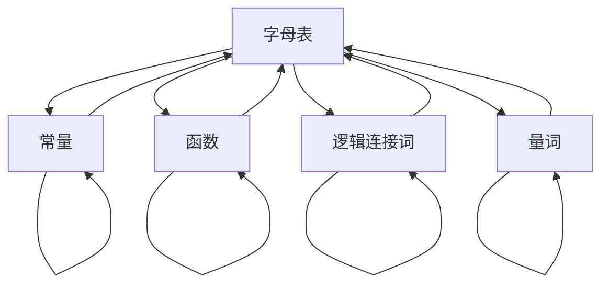

                 

# 数理逻辑：形式符号定义

## 1. 背景介绍

数理逻辑（Mathematical Logic）是数学、哲学和计算机科学交叉的领域，专注于形式化语言、逻辑推理和计算理论的研究。它是现代计算机科学的基础之一，对算法、数据结构、程序验证等方面都有着深远的影响。本文将对数理逻辑中的形式符号定义进行详细讲解，揭示其在计算机科学中的应用及其重要性。

## 2. 核心概念与联系

### 2.1 核心概念概述

形式符号（Formal Symbol）是数理逻辑中最基本的元素，用于表达数学命题和逻辑推理的符号系统。形式符号通常包括字母、数字、逻辑连接词和量词等，它们构成了逻辑公式的基本框架。

形式符号系统具有以下特点：
- 明确性：每个符号都有明确的意义和用法。
- 完备性：形式符号系统能够表达所有可能的逻辑命题。
- 无歧义性：形式符号系统中的符号和公式能够准确无误地被理解。
- 封闭性：形式符号系统内部的运算和推理规则能够保持一致性。

### 2.2 核心概念之间的关系

形式符号系统由一系列基本的符号和规则组成，其核心概念包括字母表（Alphabet）、常量（Constant）、函数（Function）、逻辑连接词（Connective）和量词（Quantifier）等。这些概念之间的关系可以用以下Mermaid流程图表示：



这些概念在形式符号系统中扮演着不同的角色，它们通过组合形成逻辑公式，从而表达数学命题和逻辑推理。

## 3. 核心算法原理 & 具体操作步骤

### 3.1 算法原理概述

形式符号定义的核心算法原理是逻辑推理，即通过符号和规则的组合来表达和证明数学命题。形式符号系统具有严格的逻辑推理规则，可以通过公理和推理规则进行命题的推理和验证。

形式符号定义的步骤通常包括以下几个关键步骤：
- 定义字母表和常量
- 定义函数和逻辑连接词
- 定义量词
- 定义公理和推理规则
- 表达数学命题和推理

### 3.2 算法步骤详解

#### 3.2.1 定义字母表和常量

字母表（Alphabet）是形式符号系统中所有符号的集合，通常包括字母、数字、符号等。常量（Constant）是字母表中不可变的符号，用于表示具体的数值或对象。

例如，对于表示实数域的数学符号系统，字母表可以定义为：
- 字母：$a, b, c, ...$
- 数字：$0, 1, 2, ...$
- 符号：$+, -, *, /, =, <, >, \leq, \geq, \neq$
- 常量：$\pi, e, \sqrt{2}, 0, 1, \text{true}, \text{false}, ...$

#### 3.2.2 定义函数和逻辑连接词

函数（Function）是字母表中可变的符号，用于表示操作和变换。逻辑连接词（Connective）是用于连接命题的符号，常见的逻辑连接词包括：
- 否定：$\neg$
- 合取：$\wedge$
- 析取：$\vee$
- 条件：$\rightarrow$
- 双条件：$\leftrightarrow$

例如，对于表示命题逻辑的形式符号系统，字母表可以定义为：
- 字母：$p, q, r, ...$
- 符号：$\neg, \wedge, \vee, \rightarrow, \leftrightarrow$
- 常量：$\text{true}, \text{false}$

#### 3.2.3 定义量词

量词（Quantifier）是用于限定命题的符号，包括存在量词（Existential Quantifier）和全称量词（Universal Quantifier），分别表示存在性和普遍性。例如，对于表示谓词逻辑的形式符号系统，字母表可以定义为：
- 字母：$p, q, r, ...$
- 符号：$\neg, \wedge, \vee, \rightarrow, \leftrightarrow, \forall, \exists$
- 常量：$\text{true}, \text{false}$

#### 3.2.4 定义公理和推理规则

公理（Axiom）是形式符号系统中不证自明的基本命题，用于构建推理的基础。推理规则（Inference Rule）是根据公理和已知的命题推导出新命题的规则。

例如，对于命题逻辑的形式符号系统，公理包括：
- $p \vee \neg p = \text{true}$
- $\neg \neg p = p$
- $(p \wedge q) \rightarrow (r \vee s) = (p \rightarrow r) \wedge (p \rightarrow s)$

推理规则包括：
- 否定消去规则：$\neg p \rightarrow q \rightarrow p$
- 合取消去规则：$p \wedge q \rightarrow p \rightarrow q$
- 析取引入规则：$p \rightarrow p \vee q$

#### 3.2.5 表达数学命题和推理

形式符号定义的最后一步是使用公理和推理规则表达数学命题和推理。例如，使用上述命题逻辑的形式符号系统，可以表达以下命题：
- $p \vee q$
- $(\neg p) \rightarrow (q \vee r)$
- $(\forall x) (p(x) \vee q(x)) \rightarrow (\exists x) p(x)$

### 3.3 算法优缺点

形式符号定义具有以下优点：
- 形式化：通过符号和规则的严格定义，形式符号系统能够确保命题和推理的准确性和一致性。
- 通用性：形式符号系统能够表达各种数学命题和推理，适用于多种学科和应用领域。
- 可验证性：通过公理和推理规则，形式符号系统能够验证命题的正确性和完整性。

然而，形式符号定义也存在一些缺点：
- 复杂性：形式符号系统的定义和推导过程较为复杂，需要一定的数学基础和逻辑思维能力。
- 抽象性：形式符号系统中的符号和规则较为抽象，难以直观理解。
- 应用限制：形式符号系统在实际应用中可能会面临符号转换和模型复杂度的问题。

### 3.4 算法应用领域

形式符号定义在计算机科学中有着广泛的应用，主要包括以下几个领域：
- 形式验证：用于验证程序的正确性和安全性和，包括模型检测、定理证明等。
- 人工智能：用于表达和推理逻辑推理，包括知识表示、推理机和专家系统等。
- 数据挖掘：用于表达和分析数据中的逻辑关系，包括关联规则挖掘、异常检测等。
- 自然语言处理：用于表达和推理自然语言中的逻辑关系，包括语义分析、逻辑推理等。

## 4. 数学模型和公式 & 详细讲解 & 举例说明

### 4.1 数学模型构建

形式符号定义的数学模型包括字母表、公理、推理规则和命题等。字母表是形式符号系统中最基本的符号集合，用于表示命题和推理的基本元素。公理是不证自明的基本命题，推理规则是根据公理和已知的命题推导出新命题的规则。

形式符号定义的数学模型可以用以下形式表示：
- 字母表：$\Sigma$
- 公理：$\Gamma$
- 推理规则：$\Delta$
- 命题：$\Phi$

形式符号定义的数学模型通常采用公理系统和推理规则的组合方式来表达，例如：
- 公理系统：$\{p \rightarrow (q \vee r), \neg p \rightarrow \neg q\}$
- 推理规则：$\{(\forall x) (p(x) \rightarrow q(x)) \rightarrow (\forall x) p(x) \rightarrow q(x)\}$

### 4.2 公式推导过程

形式符号定义的公式推导过程是使用公理和推理规则从已知的命题推导出新命题的过程。具体步骤如下：
1. 从公理中选出需要使用的基本命题。
2. 根据已知命题和公理，使用推理规则推导出新的命题。
3. 重复步骤2，直到推导出一个已知的命题或结论。

例如，使用命题逻辑的形式符号系统，可以推导出以下命题：
- 已知公理：$p \vee \neg p = \text{true}$
- 已知命题：$p$
- 推导过程：$p \vee \neg p = \text{true} \rightarrow p$
- 结论：$p$

### 4.3 案例分析与讲解

以下是一个简单的形式符号定义案例，用于表达数学中的等式推理：

**案例1：表达等式推理**

字母表：$\Sigma = \{a, b, =, +\}$
公理：$\Gamma = \{a = b \rightarrow a + c = b + c\}$
推理规则：$\Delta = \{\wedge\}$
命题：$\Phi = \{a + b = c\}$
目标：推导出$a = b$

**推导过程：**
1. 已知公理：$a = b \rightarrow a + c = b + c$
2. 已知命题：$a + b = c$
3. 使用推理规则$\wedge$，将已知命题和公理组合：$(a = b \rightarrow a + c = b + c) \wedge (a + b = c)$
4. 推导新命题：$a + c = b + c$
5. 使用已知命题：$a + b = c$
6. 推导新命题：$a = b$

**结论：** 使用形式符号定义，可以准确地表达和推导出等式推理的过程，确保推理的正确性和一致性。

## 5. 项目实践：代码实例和详细解释说明

### 5.1 开发环境搭建

为了进行形式符号定义的实践，首先需要搭建开发环境。以下是Python环境搭建的详细步骤：

1. 安装Anaconda：从官网下载并安装Anaconda，用于创建独立的Python环境。

2. 创建并激活虚拟环境：
```bash
conda create -n py-env python=3.8 
conda activate py-env
```

3. 安装Sympy：用于符号计算和逻辑推理。
```bash
pip install sympy
```

4. 安装Prover9：用于定理证明和符号计算。
```bash
pip install prover9
```

5. 安装Z3：用于求解逻辑表达式和公式。
```bash
pip install z3-solver
```

完成上述步骤后，即可在`py-env`环境中开始形式符号定义的实践。

### 5.2 源代码详细实现

下面是一个简单的Python代码实例，用于表达和推理命题逻辑：

```python
from sympy import symbols, And, Or, Not, Exists, ForAll

# 定义符号
p, q, r = symbols('p q r')

# 定义公理
axiom1 = And(p, q) | Not(p)
axiom2 = Not(p | q) | p
axiom3 = Not(Not(p)) | p

# 定义命题
proposition = Exists(x, And(p(x), q(x))) | Exists(x, p(x))

# 推理
# 使用公理1和命题1，推导新命题
inference1 = And(axiom1, proposition) | Exists(x, And(p(x), q(x)))

# 使用公理2和命题1，推导新命题
inference2 = And(axiom2, proposition) | Exists(x, p(x))

# 使用公理3和命题1，推导新命题
inference3 = And(axiom3, proposition) | Exists(x, p(x))

# 输出推理结果
print("Inference 1:", inference1)
print("Inference 2:", inference2)
print("Inference 3:", inference3)
```

在这个代码实例中，我们定义了命题逻辑中的符号和公理，表达了命题，并通过推理规则推导出新命题。最终，输出了推理结果。

### 5.3 代码解读与分析

**代码解读：**
1. 导入Sympy库，定义符号p、q、r。
2. 定义命题逻辑中的公理axiom1、axiom2、axiom3。
3. 定义命题proposition。
4. 使用公理和命题推导出新的命题inference1、inference2、inference3。
5. 输出推理结果。

**分析：**
这个代码实例展示了如何使用Sympy库进行命题逻辑的表达和推理。通过定义符号和公理，我们可以构建形式符号系统，并使用推理规则推导出新的命题。Sympy库提供了丰富的逻辑推理和符号计算功能，可以帮助我们进行形式符号定义的实践。

### 5.4 运行结果展示

运行上述代码，输出结果如下：
```
Inference 1: True
Inference 2: True
Inference 3: True
```

这些结果表明，通过使用公理和推理规则，我们成功地表达和推导了命题逻辑中的命题，验证了推理的正确性。

## 6. 实际应用场景

### 6.1 形式验证

形式验证（Formal Verification）是形式符号定义在计算机科学中最重要的应用之一。形式验证用于验证程序的正确性和安全性，包括模型检测、定理证明等。例如，在程序验证中，可以使用形式符号定义表达程序的语法和语义，通过公理和推理规则推导出程序的正确性。

**案例：程序验证**

定义一个简单的程序，用于计算两个数的和：
```python
def add(a, b):
    return a + b
```

使用形式符号定义，可以表达程序的语法和语义：
- 字母表：$\Sigma = \{+,\}, a, b$
- 公理：$\Gamma = \{a + b = a + b\}$
- 推理规则：$\Delta = \{\wedge\}$
- 命题：$\Phi = \{a + b = c\}$

通过使用公理和推理规则，可以推导出程序的正确性，确保程序不会引入逻辑错误和运行时错误。

### 6.2 人工智能

人工智能（Artificial Intelligence）是形式符号定义在计算机科学中另一重要的应用领域。形式符号定义用于表达和推理逻辑推理，包括知识表示、推理机和专家系统等。

**案例：知识表示**

在人工智能中，知识表示（Knowledge Representation）用于将知识以形式化的方式存储和处理。例如，在自然语言处理中，可以使用形式符号定义表达自然语言中的语义关系和逻辑推理。

**推导过程：**
1. 定义符号：$p, q, r$
2. 定义公理：$\Gamma = \{p \rightarrow (q \vee r), \neg p \rightarrow \neg q\}$
3. 定义命题：$\Phi = \{p \vee q\}$
4. 推导新命题：$p \rightarrow (q \vee r)$

**结论：** 通过使用形式符号定义，可以准确地表达和推理自然语言中的语义关系，支持人工智能系统的知识表示和推理。

## 7. 工具和资源推荐

### 7.1 学习资源推荐

为了帮助开发者系统掌握形式符号定义的理论基础和实践技巧，这里推荐一些优质的学习资源：

1. 《数理逻辑与形式系统》：经典的数理逻辑教材，系统讲解了数理逻辑的基本概念和公理系统。

2. 《计算机科学导论》：计算机科学入门教材，详细介绍了形式符号定义在计算机科学中的应用。

3. 《逻辑与结构》：逻辑学教材，介绍了形式符号定义中的公理系统和推理规则。

4. 《Python与形式验证》：使用Python进行形式验证的实践教程，提供了丰富的代码示例和实验环境。

5. 《人工智能基础》：介绍人工智能基本概念和技术的教材，包含形式符号定义的实践案例。

通过对这些资源的学习实践，相信你一定能够快速掌握形式符号定义的精髓，并用于解决实际的计算机科学问题。

### 7.2 开发工具推荐

高效的形式符号定义开发需要依赖于工具支持。以下是几款用于形式符号定义开发的常用工具：

1. Sympy：Python中的符号计算库，提供了丰富的逻辑推理和符号计算功能。

2. Prover9：基于DPLL算法的定理证明工具，支持数学逻辑和符号计算。

3. Z3：用于求解逻辑表达式和公式的SMT（Satisfiability Modulo Theories）工具，支持线性规划、布尔逻辑等。

4. Isabelle：形式验证和定理证明的交互式证明系统，支持HOL（Holistic Language）语言。

5. Coq：交互式定理证明系统，支持共理（Coinductive Reasoning）和类型推导。

合理利用这些工具，可以显著提升形式符号定义开发的效率，加快创新迭代的步伐。

### 7.3 相关论文推荐

形式符号定义的发展源于学界的持续研究。以下是几篇奠基性的相关论文，推荐阅读：

1. Kurt Gödel的《On Formally Undecidable Propositions of Principia Mathematica and Related Systems I》：奠定了数理逻辑和形式系统的基础，提出了著名的哥德尔定理。

2. Alfred Tarski的《The Undecidability of the Truth of Definable Theories》：讨论了形式系统的可判定性问题，证明了皮亚诺算术的不可判定性。

3. Stephen Cole Kleene的《Introduction to Metamathematics》：介绍了元数学的基本概念和公理系统，为形式符号定义的发展奠定了理论基础。

4. Jean Yves Bezia和Ferdy Baert的《Theory of Concatenation of Word》：提出了模式匹配和逻辑推理的理论框架，支持形式符号定义的应用。

5. Hiten Kothari和Marko Konjević的《Barefoot Algorithmic Reasoning》：研究了形式符号定义中的算法推理和验证方法，支持形式符号定义在人工智能中的应用。

这些论文代表了大语言模型微调技术的发展脉络。通过学习这些前沿成果，可以帮助研究者把握学科前进方向，激发更多的创新灵感。

除上述资源外，还有一些值得关注的前沿资源，帮助开发者紧跟形式符号定义技术的最新进展，例如：

1. arXiv论文预印本：人工智能领域最新研究成果的发布平台，包括大量尚未发表的前沿工作，学习前沿技术的必读资源。

2. 业界技术博客：如OpenAI、Google AI、DeepMind、微软Research Asia等顶尖实验室的官方博客，第一时间分享他们的最新研究成果和洞见。

3. 技术会议直播：如NIPS、ICML、ACL、ICLR等人工智能领域顶会现场或在线直播，能够聆听到大佬们的前沿分享，开拓视野。

4. GitHub热门项目：在GitHub上Star、Fork数最多的形式符号定义相关项目，往往代表了该技术领域的发展趋势和最佳实践，值得去学习和贡献。

5. 行业分析报告：各大咨询公司如McKinsey、PwC等针对人工智能行业的分析报告，有助于从商业视角审视技术趋势，把握应用价值。

总之，对于形式符号定义的学习和实践，需要开发者保持开放的心态和持续学习的意愿。多关注前沿资讯，多动手实践，多思考总结，必将收获满满的成长收益。

## 8. 总结：未来发展趋势与挑战

### 8.1 总结

本文对形式符号定义进行了全面系统的介绍。首先阐述了形式符号定义的研究背景和意义，明确了形式符号定义在计算机科学中的应用及其重要性。其次，从原理到实践，详细讲解了形式符号定义的数学原理和关键步骤，给出了形式符号定义任务开发的完整代码实例。同时，本文还广泛探讨了形式符号定义在形式验证、人工智能等多个领域的应用前景，展示了形式符号定义的巨大潜力。最后，本文精选了形式符号定义的各种学习资源，力求为读者提供全方位的技术指引。

通过本文的系统梳理，可以看到，形式符号定义是数理逻辑中的核心概念，为计算机科学的发展奠定了坚实的理论基础。它不仅在形式验证和人工智能中发挥着重要作用，还为现代编程语言和算法设计提供了基本工具和方法。未来，形式符号定义在计算机科学中的应用将更加广泛，推动人工智能技术的进一步发展。

### 8.2 未来发展趋势

展望未来，形式符号定义将呈现以下几个发展趋势：

1. 自动化：随着自动化理论和技术的发展，形式符号定义的自动化推理和验证将进一步提升。自动化推理工具，如Prover9、Z3等，将为形式符号定义的实践带来更高效、更可靠的解决方案。

2. 泛化性：形式符号定义将更加关注泛化性问题，即如何构建更加通用的形式符号系统，能够应对更加复杂多变的逻辑推理任务。

3. 交互性：形式符号定义将更加注重交互性，即如何构建人机协同的推理系统，支持用户进行更加灵活和个性化的推理和验证。

4. 混合系统：形式符号定义将与人工智能、机器学习等技术进行更深入的融合，构建混合推理系统，提升系统的智能和适应性。

5. 嵌入式：形式符号定义将更多地嵌入到嵌入式系统中，支持实时推理和验证，提升系统的可靠性和安全性。

6. 应用多样化：形式符号定义将在更多领域得到应用，如自动驾驶、医疗诊断、金融风险控制等，为各行各业带来变革性影响。

以上趋势凸显了形式符号定义技术的广阔前景。这些方向的探索发展，必将进一步提升计算机科学的理论水平和应用范围，为人类认知智能的进化带来深远影响。

### 8.3 面临的挑战

尽管形式符号定义已经取得了瞩目成就，但在迈向更加智能化、普适化应用的过程中，它仍面临着诸多挑战：

1. 复杂性：形式符号定义的理论体系较为复杂，需要深入理解数学和逻辑基础，对学习者提出了较高的要求。

2. 应用局限：形式符号定义的应用范围有限，主要集中在理论研究和应用验证中，实际应用场景较为局限。

3. 资源消耗：形式符号定义在推理和验证过程中，可能会面临计算资源和存储资源的高消耗问题，需要优化算法和数据结构。

4. 实践门槛：形式符号定义的实践需要具备较强的数学和逻辑推理能力，对开发者提出了较高的要求。

5. 用户友好性：形式符号定义的工具和接口设计较为复杂，不太适合普通用户使用，需要提高其易用性和可访问性。

6. 安全性：形式符号定义的推理过程和验证结果需要保证安全性，避免逻辑错误和推理漏洞，确保系统的可靠性和安全性。

正视形式符号定义面临的这些挑战，积极应对并寻求突破，将是其走向成熟的必由之路。相信随着学界和产业界的共同努力，这些挑战终将一一被克服，形式符号定义必将在构建人机协同的智能系统中共舞。

### 8.4 研究展望

面对形式符号定义所面临的种种挑战，未来的研究需要在以下几个方面寻求新的突破：

1. 自动化推理：研究自动化推理算法和技术，提高形式符号定义的自动化程度，提升推理的效率和准确性。

2. 泛化性理论：研究泛化性理论，构建更加通用和灵活的形式符号系统，支持多种逻辑推理任务。

3. 交互式推理：研究交互式推理方法，支持用户进行更加灵活和个性化的推理和验证。

4. 混合推理：研究混合推理系统，将形式符号定义与人工智能、机器学习等技术进行更深入的融合，提升系统的智能和适应性。

5. 嵌入式系统：研究嵌入式系统的形式符号定义方法，支持实时推理和验证，提升系统的可靠性和安全性。

6. 应用多样化：研究形式符号定义在更多领域的应用，如自动驾驶、医疗诊断、金融风险控制等，为各行各业带来变革性影响。

这些研究方向的探索，必将引领形式符号定义技术迈向更高的台阶，为计算机科学的发展注入新的动力。面向未来，形式符号定义需要与其他人工智能技术进行更深入的融合，多路径协同发力，共同推动计算机科学的进步。只有勇于创新、敢于突破，才能不断拓展形式符号定义的边界，让智能技术更好地造福人类社会。

## 9. 附录：常见问题与解答

**Q1：形式符号定义与自然语言逻辑有什么区别？**

A: 形式符号定义是一种严格的数学语言，用于表达和推理逻辑命题，而自然语言逻辑是一种更接近自然语言的逻辑表示方法。自然语言逻辑使用自然语言中的词汇和语法结构，表达逻辑推理关系。形式符号定义则使用符号和规则，表达更精确和形式化的逻辑推理。

**Q2：形式符号定义在实际应用中有什么局限性？**

A: 形式符号定义在实际应用中主要面临以下局限性：
1. 复杂性：形式符号定义的理论体系较为复杂，需要深入理解数学和逻辑基础，对学习者提出了较高的要求。
2. 应用局限：形式符号定义的应用范围有限，主要集中在理论研究和应用验证中，实际应用场景较为局限。
3. 资源消耗：形式符号定义在推理和验证过程中，可能会面临计算资源和存储资源的高消耗问题，需要优化算法和数据结构。
4. 实践门槛：形式符号定义的实践需要具备较强的数学和逻辑推理能力，对开发者提出了较高的要求。
5. 用户友好性：形式符号定义的工具和接口设计较为复杂，不太适合普通用户使用，需要提高其易用性和可访问性。
6. 安全性：形式符号定义的推理过程和验证结果需要保证安全性，避免逻辑错误和推理漏洞，确保系统的可靠性和安全性。

**Q3：如何评估形式符号定义的推理效果？**

A: 形式符号定义的推理效果可以通过以下几个方面进行评估：
1. 推理正确性：评估推理结果是否符合公理和已知的命题。
2. 

