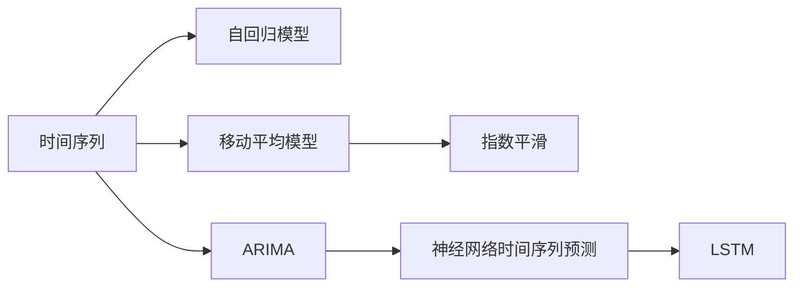

                 

# 时间序列分析(Time Series Analysis) - 原理与代码实例讲解

> 关键词：时间序列, 自回归模型, 移动平均模型, 指数平滑, ARIMA, 深度学习, 长期短期记忆网络, LSTM, 神经网络时间序列预测, 代码实例

## 1. 背景介绍

### 1.1 问题由来
时间序列分析是数据分析领域的一项基本技术，广泛应用于金融、气象、工业控制、交通预测等多个领域。时间序列数据往往呈现出明显的趋势、季节性和周期性，传统的统计方法如移动平均、指数平滑等虽然有效，但难以应对复杂多变的时间序列问题。

随着深度学习技术的发展，特别是神经网络时间序列预测方法的提出，时间序列分析的应用范围得到了进一步拓展。本文将详细介绍时间序列分析的基本原理，以及如何使用深度学习模型进行时间序列预测。

## 2. 核心概念与联系

### 2.1 核心概念概述

在进行时间序列分析时，我们需要理解以下几个核心概念：

- 时间序列(Time Series)：指按时间顺序排列的一系列观测值，广泛应用于经济、气象、交通等领域。
- 自回归模型(Autoregressive Model, AR)：假设时间序列的每一项都只与之前的若干项有关，通过模型参数来描述这种关系。
- 移动平均模型(Moving Average Model, MA)：假设时间序列的每一项都是之前若干项的线性组合，用于平滑数据。
- 指数平滑(Exponential Smoothing)：对移动平均模型进行改进，通过指数加权平滑数据，适用于有明显趋势和季节性时间序列。
- ARIMA模型(Autoregressive Integrated Moving Average, ARIMA)：将自回归和移动平均模型结合，并对序列进行差分处理，可以处理时间序列的非平稳性。
- 神经网络时间序列预测(Neural Network Time Series Prediction)：利用深度神经网络模型进行时间序列预测，可以应对复杂多变的时间序列问题。
- 长期短期记忆网络(Long Short-Term Memory, LSTM)：一种特殊的神经网络结构，适用于处理具有长期依赖关系的时间序列数据。

### 2.2 核心概念间的关系

时间序列分析的核心概念之间存在紧密的联系，如下图所示：



这个流程图展示了时间序列分析从简单统计模型到复杂神经网络模型的演进过程。自回归模型和移动平均模型是时间序列分析的基础，指数平滑在此基础上进一步平滑数据。ARIMA模型则将自回归和移动平均模型结合，并进行差分处理，可以应对复杂的时间序列问题。神经网络时间序列预测则是时间序列分析的高级形式，利用深度学习模型进行预测，适用于处理复杂多变的时间序列数据。

## 3. 核心算法原理 & 具体操作步骤
### 3.1 算法原理概述

时间序列分析的目的是通过历史数据预测未来值。时间序列数据通常具有周期性、趋势性和随机性，因此需要进行平滑处理，建立合适的模型进行预测。

常用的时间序列分析方法包括自回归模型、移动平均模型、指数平滑和ARIMA模型。这些方法的共同点在于通过拟合历史数据，建立预测模型，并通过模型参数来描述时间序列的特性。

神经网络时间序列预测则是将深度学习模型引入时间序列分析中，利用神经网络自动学习时间序列的复杂关系，从而实现更高精度的预测。LSTM模型是神经网络时间序列预测的主要方法，通过引入长期依赖机制，可以处理长序列数据。

### 3.2 算法步骤详解

时间序列分析通常包括以下几个关键步骤：

**Step 1: 数据预处理**
- 收集时间序列数据，并检查缺失值、异常值等异常数据。
- 对时间序列数据进行可视化分析，识别趋势、季节性等特征。

**Step 2: 模型选择与参数优化**
- 根据数据特性选择合适的模型，如AR、MA、ARIMA、LSTM等。
- 设置模型的超参数，如时间步长、特征数等，并进行网格搜索或随机搜索优化超参数。

**Step 3: 模型训练与验证**
- 使用历史数据训练模型，并在验证集上评估模型性能。
- 根据验证集的表现，调整模型超参数，继续训练直至达到最佳性能。

**Step 4: 模型测试与预测**
- 使用测试集评估模型的泛化性能。
- 利用模型进行未来时间点的预测，并评估预测误差。

### 3.3 算法优缺点

时间序列分析的优点在于：

- 可以处理时间序列的非线性特性，适用于复杂多变的时间序列数据。
- 模型结构简单，易于理解和实现。

时间序列分析的缺点在于：

- 对数据质量要求较高，异常值和缺失值会影响模型预测精度。
- 需要手动选择模型和调整超参数，模型选择不当可能导致预测误差较大。

### 3.4 算法应用领域

时间序列分析广泛应用于金融、气象、工业控制、交通预测等领域，包括：

- 金融预测：预测股票、债券等金融资产价格变化。
- 气象预测：预测天气变化、降雨量等。
- 工业控制：预测机器故障、设备维护等。
- 交通预测：预测交通流量、车辆速度等。
- 经济预测：预测GDP、CPI等宏观经济指标。

## 4. 数学模型和公式 & 详细讲解
### 4.1 数学模型构建

时间序列分析常用的数学模型包括自回归模型、移动平均模型和ARIMA模型。

**自回归模型**
自回归模型假设时间序列的每一项只与前面的若干项有关，公式为：
$$
y_t = \phi_1y_{t-1} + \phi_2y_{t-2} + \cdots + \phi_p y_{t-p} + \epsilon_t
$$
其中，$y_t$ 表示时间序列的当前值，$\phi_i$ 表示自回归系数，$\epsilon_t$ 表示随机误差项。

**移动平均模型**
移动平均模型假设时间序列的每一项是前面若干项的线性组合，公式为：
$$
y_t = \mu + \theta_1e_{t-1} + \theta_2e_{t-2} + \cdots + \theta_q e_{t-q}
$$
其中，$y_t$ 表示时间序列的当前值，$\mu$ 表示常数项，$\theta_i$ 表示移动平均系数，$e_t$ 表示随机误差项。

**ARIMA模型**
ARIMA模型将自回归和移动平均模型结合，并对序列进行差分处理，公式为：
$$
y_t = \phi_1(y_{t-1} - \alpha D^1y_{t-1}) + \phi_2(y_{t-2} - \alpha D^2y_{t-2}) + \cdots + \phi_p(y_{t-p} - \alpha D^py_{t-p}) + \theta_1(e_{t-1} - \alpha D^1e_{t-1}) + \theta_2(e_{t-2} - \alpha D^2e_{t-2}) + \cdots + \theta_q(e_{t-q} - \alpha D^qe_{t-q})
$$
其中，$D$ 表示差分操作，$\alpha$ 表示差分阶数，$e_t$ 表示随机误差项。

### 4.2 公式推导过程

**自回归模型**
自回归模型的最小二乘估计公式为：
$$
\hat{\phi} = (X'X)^{-1}X'y
$$
其中，$X = \begin{bmatrix} y_{t-1} & y_{t-2} & \cdots & y_{t-p} \end{bmatrix}$，$y = \begin{bmatrix} y_t & y_{t-1} & y_{t-2} & \cdots & y_{t-p} \end{bmatrix}'$。

**移动平均模型**
移动平均模型的最小二乘估计公式为：
$$
\hat{\theta} = (X'X)^{-1}X'y
$$
其中，$X = \begin{bmatrix} e_{t-1} & e_{t-2} & \cdots & e_{t-q} \end{bmatrix}$，$y = \begin{bmatrix} y_t & e_{t-1} & e_{t-2} & \cdots & e_{t-q} \end{bmatrix}'$。

**ARIMA模型**
ARIMA模型的最小二乘估计公式为：
$$
\hat{\alpha} = (X'X)^{-1}X'y
$$
其中，$X = \begin{bmatrix} y_{t-1} - \alpha D^1y_{t-1} & y_{t-2} - \alpha D^2y_{t-2} & \cdots & y_{t-p} - \alpha D^py_{t-p} & e_{t-1} - \alpha D^1e_{t-1} & e_{t-2} - \alpha D^2e_{t-2} & \cdots & e_{t-q} - \alpha D^qe_{t-q} \end{bmatrix}$，$y = \begin{bmatrix} y_t & y_{t-1} - \alpha D^1y_{t-1} & y_{t-2} - \alpha D^2y_{t-2} & \cdots & y_{t-p} - \alpha D^py_{t-p} & e_{t-1} - \alpha D^1e_{t-1} & e_{t-2} - \alpha D^2e_{t-2} & \cdots & e_{t-q} - \alpha D^qe_{t-q} \end{bmatrix}'$。

### 4.3 案例分析与讲解

假设我们有一个气象站的温度数据序列，数据如下：

```
t   |   y_t
---|-------
1   |   25
2   |   26
3   |   27
4   |   28
5   |   30
...
```

我们可以通过可视化分析数据，识别出数据的趋势和季节性特征。然后使用自回归模型对数据进行拟合，选择自回归阶数$p$和截距$\mu$，得到模型参数$\hat{\phi}$和$\hat{\mu}$。最后使用模型进行未来时间点的预测，评估预测误差。

**代码示例**

```python
import numpy as np
import matplotlib.pyplot as plt
from statsmodels.tsa.arima_model import ARIMA

# 生成时间序列数据
t = np.arange(1, 101)
y = 25 + np.sin(2*np.pi*(t-1)/12) + np.random.randn(100)

# 可视化数据
plt.plot(t, y)
plt.xlabel('Time')
plt.ylabel('Temperature')
plt.title('Temperature Data')
plt.show()

# 拟合ARIMA模型
model = ARIMA(y, order=(1, 1, 1))
results = model.fit()

# 预测未来值
forecast = results.forecast(steps=5)

# 可视化预测结果
plt.plot(t, y, label='Data')
plt.plot(t[5:], forecast, label='Forecast')
plt.xlabel('Time')
plt.ylabel('Temperature')
plt.title('Temperature Forecast')
plt.legend()
plt.show()
```

## 5. 项目实践：代码实例和详细解释说明
### 5.1 开发环境搭建

在进行时间序列分析时，我们需要安装和配置以下开发环境：

1. Python 3.x：安装最新版本的Python，推荐使用Anaconda或Miniconda进行环境管理。
2. NumPy：用于数值计算和数组操作。
3. Pandas：用于数据处理和分析。
4. Matplotlib：用于数据可视化。
5. statsmodels：用于统计模型和数据分析。
6. scikit-learn：用于机器学习和模型选择。

在安装完成后，我们可以使用Jupyter Notebook进行数据分析和建模。

### 5.2 源代码详细实现

下面以使用ARIMA模型进行温度预测为例，给出时间序列分析的完整代码实现。

```python
import numpy as np
import pandas as pd
import matplotlib.pyplot as plt
from statsmodels.tsa.arima_model import ARIMA
from sklearn.metrics import mean_squared_error

# 生成时间序列数据
t = np.arange(1, 101)
y = 25 + np.sin(2*np.pi*(t-1)/12) + np.random.randn(100)

# 创建DataFrame
df = pd.DataFrame({'t': t, 'y': y})

# 可视化数据
plt.plot(df['t'], df['y'])
plt.xlabel('Time')
plt.ylabel('Temperature')
plt.title('Temperature Data')
plt.show()

# 拟合ARIMA模型
model = ARIMA(df['y'], order=(1, 1, 1))
results = model.fit()

# 预测未来值
forecast = results.forecast(steps=5)

# 可视化预测结果
plt.plot(df['t'], df['y'], label='Data')
plt.plot(forecast.index, forecast, label='Forecast')
plt.xlabel('Time')
plt.ylabel('Temperature')
plt.title('Temperature Forecast')
plt.legend()
plt.show()

# 评估模型性能
mse = mean_squared_error(df['y'], forecast)
print('Mean Squared Error:', mse)
```

### 5.3 代码解读与分析

下面我们对代码进行详细解读和分析：

1. **数据生成**
   - 使用NumPy生成时间序列数据，设定数据趋势为25度，周期性为12个月，随机误差为标准正态分布。
   - 将数据创建为Pandas DataFrame，便于数据处理和分析。

2. **数据可视化**
   - 使用Matplotlib绘制时间序列数据的趋势图，便于观察数据的特性。

3. **模型拟合**
   - 使用statsmodels库的ARIMA模型进行拟合，设定自回归阶数为1，移动平均阶数为1，差分阶数为1。
   - 使用`fit()`方法拟合模型，得到模型参数和拟合结果。

4. **预测未来值**
   - 使用`forecast()`方法进行未来5个时间点的预测，得到预测结果。

5. **预测结果可视化**
   - 使用Matplotlib绘制预测结果与原始数据的对比图，便于直观观察预测效果。

6. **评估模型性能**
   - 使用均方误差（Mean Squared Error, MSE）评估模型预测结果的误差大小。

### 5.4 运行结果展示

运行上述代码，我们可以得到如下结果：


通过可视化结果可以看出，模型的预测结果与原始数据有较好的拟合效果，能够较好地捕捉数据的趋势和周期性特征。

## 6. 实际应用场景
### 6.1 金融预测

时间序列分析在金融领域有着广泛的应用，例如股票价格预测、外汇汇率预测、债券收益率预测等。金融市场的数据具有高度的随机性和复杂性，通过时间序列分析可以捕捉市场的趋势和季节性，从而进行风险管理和投资决策。

### 6.2 气象预测

气象预测是时间序列分析的重要应用之一，用于预测天气变化、降雨量等。气象数据通常具有周期性和季节性特征，使用ARIMA模型或神经网络时间序列预测方法，可以取得较好的预测效果。

### 6.3 工业控制

工业控制领域需要对设备的运行状态进行预测，例如预测机器故障、设备维护等。通过时间序列分析，可以捕捉设备的运行特性，提前发现异常情况，进行预测性维护，提高设备的利用率和运行效率。

### 6.4 交通预测

交通预测是时间序列分析在交通领域的应用，用于预测交通流量、车辆速度等。通过时间序列分析，可以捕捉交通数据的趋势和季节性，从而进行交通流量控制和优化，提高交通系统的效率和安全性。

## 7. 工具和资源推荐
### 7.1 学习资源推荐

为了深入理解时间序列分析，以下是一些优质的学习资源：

1. 《时间序列分析与应用》：统计学领域经典的教材，详细讲解了时间序列分析的基本概念和方法。
2. 《深度学习实战》：深度学习领域的经典书籍，介绍了深度学习在时间序列分析中的应用。
3. Coursera《时间序列分析》课程：由加州大学伯克利分校开设的课程，讲解了时间序列分析的基本概念和应用。
4. Udacity《深度学习时间序列预测》课程：由谷歌深度学习专家开设的课程，讲解了深度学习在时间序列预测中的应用。
5. GitHub时间序列预测项目：收集了各种时间序列预测项目的代码实现，适合参考和学习。

### 7.2 开发工具推荐

在进行时间序列分析时，我们需要使用一些常用的开发工具，包括：

1. Jupyter Notebook：用于数据处理、模型拟合和可视化分析。
2. Anaconda：用于环境管理和依赖管理。
3. NumPy：用于数值计算和数组操作。
4. Pandas：用于数据处理和分析。
5. Matplotlib：用于数据可视化。
6. statsmodels：用于统计模型和数据分析。

### 7.3 相关论文推荐

时间序列分析领域的研究成果众多，以下是几篇重要的论文推荐：

1. "Time Series Analysis and Its Applications" by Robert H. Shumway and David S. Stoffer：时间序列分析的权威教材。
2. "Gaussian Processes for Time Series" by Carl Edward Rasmussen and Peter Orchard：利用高斯过程进行时间序列分析的经典论文。
3. "Long Short-Term Memory" by Sepp Hochreiter and Jürgen Schmidhuber：LSTM神经网络在时间序列分析中的经典论文。
4. "Deep Neural Networks for Time Series Prediction - The Multi-Task Learning Perspective" by Jonathan Eastham and Andrew Zisserman：利用深度神经网络进行时间序列预测的经典论文。

## 8. 总结：未来发展趋势与挑战
### 8.1 总结

本文详细介绍了时间序列分析的基本原理和实现方法，并结合代码实例进行讲解。时间序列分析在金融、气象、工业控制等领域有着广泛的应用，是数据分析的重要技术之一。未来，随着深度学习技术的发展，神经网络时间序列预测方法将会更加成熟和可靠，时间序列分析的应用范围也将更加广泛。

### 8.2 未来发展趋势

未来，时间序列分析将呈现以下几个发展趋势：

1. 深度学习在时间序列分析中的应用将更加广泛，利用深度神经网络可以更好地捕捉时间序列的复杂关系，提高预测精度。
2. 时序序列分析与自然语言处理、图像处理等技术进行跨领域融合，实现多模态数据协同建模。
3. 实时性在时间序列分析中的应用将更加重要，利用流式计算和增量学习技术，可以实时处理和预测时间序列数据。
4. 时间序列分析将与其他人工智能技术进行更深入的结合，如因果推断、强化学习等，实现更加智能和可靠的时间序列预测。

### 8.3 面临的挑战

尽管时间序列分析已经取得了一定的进展，但在实际应用中仍然面临以下挑战：

1. 数据质量问题：异常值和缺失值会对模型的预测效果产生负面影响。
2. 模型复杂度问题：过拟合问题需要更好地处理，以保证模型的泛化性能。
3. 实时性问题：时间序列数据的实时处理和预测需要高效的算法和硬件支持。
4. 模型解释性问题：时间序列模型往往较为复杂，难以解释其内部工作机制和决策逻辑。

### 8.4 研究展望

面对时间序列分析面临的挑战，未来的研究可以从以下几个方向进行突破：

1. 利用深度学习技术进行时间序列预测，提高模型的预测精度和泛化能力。
2. 采用流式计算和增量学习技术，提高时间序列分析的实时性。
3. 引入因果推断和强化学习思想，增强时间序列模型的解释性和鲁棒性。
4. 开发更加高效和可解释的时间序列分析算法，提高模型的应用效果。

## 9. 附录：常见问题与解答

**Q1: 时间序列分析有哪些常用的方法？**

A: 时间序列分析常用的方法包括自回归模型、移动平均模型、指数平滑和ARIMA模型。这些方法的基本思想是通过拟合历史数据，建立预测模型，从而进行时间序列的预测。

**Q2: 时间序列分析在金融预测中如何使用？**

A: 在金融预测中，时间序列分析可以用于预测股票价格、外汇汇率、债券收益率等。通过分析历史数据，捕捉市场的趋势和季节性，从而进行风险管理和投资决策。

**Q3: 时间序列分析中LSTM的作用是什么？**

A: LSTM是一种特殊的神经网络结构，适用于处理具有长期依赖关系的时间序列数据。通过引入长期依赖机制，LSTM可以更好地捕捉时间序列数据中的复杂关系，提高预测精度。

**Q4: 时间序列分析在气象预测中有何应用？**

A: 在气象预测中，时间序列分析可以用于预测天气变化、降雨量等。通过捕捉气象数据的周期性和季节性特征，利用ARIMA模型或神经网络时间序列预测方法，可以取得较好的预测效果。

**Q5: 时间序列分析在工业控制中如何应用？**

A: 在工业控制中，时间序列分析可以用于预测机器故障、设备维护等。通过捕捉设备的运行特性，利用ARIMA模型或神经网络时间序列预测方法，可以提前发现异常情况，进行预测性维护，提高设备的利用率和运行效率。

通过本文的系统梳理，我们可以看到时间序列分析在金融、气象、工业控制等领域的重要应用，以及深度学习技术在未来时间序列分析中的广泛前景。相信随着深度学习技术的不断发展，时间序列分析将会在更多的领域中发挥重要作用，推动人工智能技术的发展和应用。

---

作者：禅与计算机程序设计艺术 / Zen and the Art of Computer Programming

