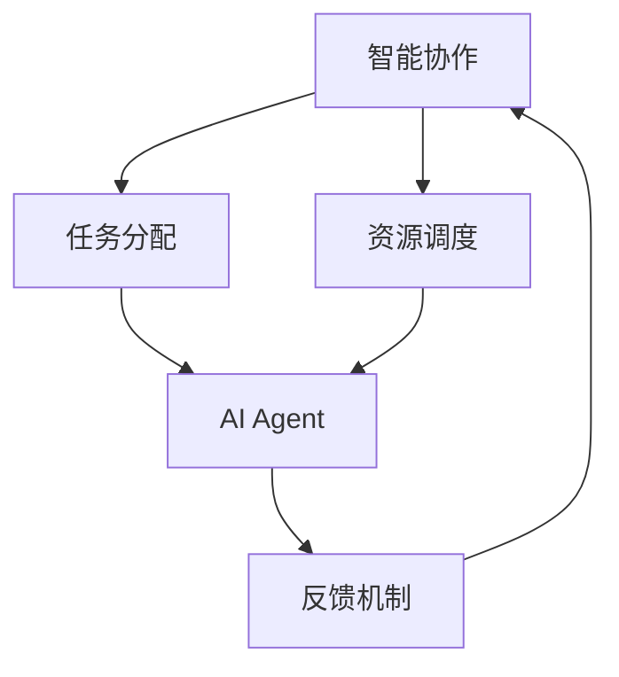

                 

# 智能协作与AI Agent的未来

## 1. 背景介绍

随着技术的不断进步，人工智能(AI)已经在各行各业中得到了广泛应用。AI技术不仅改变了传统的工作方式，还推动了协作模式的重塑。智能协作与AI Agent成为了未来工作流程的重要组成部分。AI Agent不仅仅是一种工具，更是一种能力的延伸。它能够通过学习、理解和决策，替代或辅助人类完成各种复杂的任务，实现更为高效、灵活和智能的协作。本文将深入探讨智能协作与AI Agent的未来发展趋势和关键技术。

## 2. 核心概念与联系

### 2.1 核心概念概述

智能协作与AI Agent的核心概念包括以下几个方面：

- **智能协作**：指通过人工智能技术，将人与人、人与机器、机器与机器之间的交互变得更加智能和高效。智能协作的核心在于利用人工智能的强大计算能力和知识表示能力，提升协作过程中的信息传递和决策支持。

- **AI Agent**：指在特定环境中自主运行、具有一定智能行为的实体。AI Agent能够感知环境、接收指令、执行任务，并在完成任务后给出反馈。AI Agent的出现使得机器能够更好地理解和回应人类的需求。

- **任务分配与调度**：在智能协作中，合理分配任务和调度资源是关键。AI Agent通过任务分配与调度，能够动态调整任务优先级和执行顺序，优化资源配置，提高协作效率。

- **人机交互界面**：AI Agent需要具备直观的人机交互界面，能够理解自然语言指令，并以直观的方式展示结果。这对于提升用户体验、增强协作效果具有重要意义。

### 2.2 核心概念的关系

智能协作与AI Agent之间的关系可以形象地用以下Mermaid流程图表示：



该流程图展示了智能协作、任务分配、资源调度、AI Agent和反馈机制之间的相互作用和依赖关系。通过任务分配和资源调度，AI Agent在智能协作中扮演重要角色，能够自主完成任务并及时反馈结果，从而提升协作效率。

## 3. 核心算法原理 & 具体操作步骤

### 3.1 算法原理概述

AI Agent的核心算法原理基于强化学习、深度学习和多智能体系统等前沿技术。其基本思路是通过模拟环境训练，使AI Agent具备自主决策、任务执行和反馈响应的能力。AI Agent在执行任务时，通过感知环境、接收指令、执行操作、接收反馈，不断调整其决策策略，以最大化完成任务的效果和效率。

### 3.2 算法步骤详解

1. **环境建模**：首先需要对AI Agent所处的环境进行建模。环境建模通常包括环境状态、行动空间、奖励机制等关键因素。环境的建模需要尽可能准确地描述现实世界，以便AI Agent能够通过学习掌握环境特征。

2. **策略学习**：策略学习是AI Agent的核心步骤，通过强化学习等算法，AI Agent在模拟环境中学习最优策略。常用的策略学习算法包括Q-learning、Policy Gradient等，这些算法能够在高维空间中优化策略，使AI Agent在不同情况下都能做出最佳决策。

3. **执行与反馈**：在实际环境中，AI Agent需要执行任务并根据环境反馈进行调整。执行与反馈过程是AI Agent实现自主决策的关键，通过不断的执行和反馈，AI Agent能够逐步优化其决策策略，提高任务执行效率。

4. **多智能体协作**：在复杂的协作场景中，往往需要多个AI Agent协同完成任务。多智能体协作需要设计合理的通信协议和协调机制，确保各AI Agent之间能够有效配合，共同完成复杂任务。

### 3.3 算法优缺点

**优点**：

- **自主决策**：AI Agent能够根据环境信息和任务要求，自主做出决策，避免了传统人工流程中可能存在的错误和延误。
- **持续优化**：通过不断学习和反馈，AI Agent的决策策略可以持续优化，适应环境变化。
- **高效协作**：在多智能体系统中，AI Agent能够通过协作完成任务，提升整体协作效率。

**缺点**：

- **模型复杂**：AI Agent需要复杂的环境建模和策略学习，模型训练和优化过程较为复杂。
- **可解释性差**：AI Agent的决策过程往往难以解释，难以提供明确的推理路径和理由。
- **依赖数据**：AI Agent的性能高度依赖于训练数据的丰富性和质量，数据获取和标注成本较高。

### 3.4 算法应用领域

AI Agent的应用领域非常广泛，涵盖了智能制造、金融服务、医疗健康、教育培训等多个行业。以下是几个典型的应用场景：

- **智能制造**：在制造业中，AI Agent能够监控生产设备状态、调整生产计划、预测设备故障，提升生产效率和设备利用率。

- **金融服务**：在金融领域，AI Agent能够进行风险评估、投资策略优化、客户服务支持等，提高金融服务的智能化水平。

- **医疗健康**：在医疗领域，AI Agent能够辅助医生进行病情诊断、治疗方案推荐、健康管理等，提升医疗服务的质量和效率。

- **教育培训**：在教育领域，AI Agent能够个性化推荐学习资源、解答学习问题、评估学习效果等，提升教育效果和学习体验。

## 4. 数学模型和公式 & 详细讲解 & 举例说明

### 4.1 数学模型构建

在AI Agent的训练过程中，通常使用强化学习的方法进行策略学习。以Q-learning算法为例，构建数学模型如下：

设环境状态为 $s$，行动空间为 $a$，奖励为 $r$，状态转移概率为 $p(s'|s,a)$，则Q值函数 $Q(s,a)$ 定义为状态 $s$ 下采取行动 $a$ 的累积期望回报。

$$
Q(s,a) = \max_{a'} \sum_{s'} p(s'|s,a) \left[ r + \gamma Q(s',a') \right]
$$

其中，$\gamma$ 为折扣因子，控制未来奖励的权重。

### 4.2 公式推导过程

Q-learning算法通过不断迭代，更新状态-行动对 $(s,a)$ 的Q值，直到收敛。具体步骤如下：

1. **初始化**：随机初始化Q值。

2. **迭代更新**：对于每个状态-行动对 $(s,a)$，根据当前状态 $s$ 和行动 $a$ 计算下一个状态 $s'$ 和奖励 $r'$，并更新Q值：

$$
Q(s,a) \leftarrow Q(s,a) + \alpha \left[ r' + \gamma \max_{a'} Q(s',a') - Q(s,a) \right]
$$

其中，$\alpha$ 为学习率，控制Q值更新的幅度。

3. **策略优化**：根据Q值函数，计算最优行动 $a^*$，并作为当前行动策略。

通过上述过程，AI Agent能够在模拟环境中学习到最优的策略，并将其应用于实际环境中。

### 4.3 案例分析与讲解

以智能制造场景为例，假设有多个生产设备，每个设备的状态和动作空间不同，AI Agent需要学习如何在不同设备之间分配资源，优化生产计划。通过Q-learning算法，AI Agent可以学习到最优的资源分配策略，提升生产效率和设备利用率。

## 5. 项目实践：代码实例和详细解释说明

### 5.1 开发环境搭建

为了实现AI Agent，需要搭建一个支持深度学习和强化学习的开发环境。以下是一个典型的开发环境配置：

- **编程语言**：Python
- **深度学习框架**：PyTorch、TensorFlow
- **强化学习库**：OpenAI Gym、gymnasium

首先，安装必要的库：

```bash
pip install torch torchvision gymnasium
```

然后，搭建Python虚拟环境：

```bash
conda create -n ai_agent_env python=3.8
conda activate ai_agent_env
```

### 5.2 源代码详细实现

以下是一个简单的AI Agent代码实现，基于Q-learning算法：

```python
import torch
import gymnasium as gym
import numpy as np

# 定义Q值网络
class QNetwork(torch.nn.Module):
    def __init__(self, state_dim, action_dim, hidden_dim):
        super().__init__()
        self.fc1 = torch.nn.Linear(state_dim, hidden_dim)
        self.fc2 = torch.nn.Linear(hidden_dim, action_dim)
    
    def forward(self, x):
        x = torch.relu(self.fc1(x))
        x = self.fc2(x)
        return x

# 定义Q-learning算法
class QLearningAgent:
    def __init__(self, state_dim, action_dim, hidden_dim, learning_rate=0.1, discount_factor=0.9):
        self.state_dim = state_dim
        self.action_dim = action_dim
        self.hidden_dim = hidden_dim
        self.learning_rate = learning_rate
        self.discount_factor = discount_factor
        self.q_network = QNetwork(state_dim, action_dim, hidden_dim)
        self.target_network = QNetwork(state_dim, action_dim, hidden_dim)
        self.target_network.load_state_dict(self.q_network.state_dict())
        self.optimizer = torch.optim.Adam(self.q_network.parameters(), lr=learning_rate)
    
    def choose_action(self, state):
        state = torch.from_numpy(state).float()
        action_scores = self.q_network(state)
        action = np.argmax(action_scores.numpy()[0])
        return action
    
    def learn(self, state, action, reward, next_state, done):
        state = torch.from_numpy(state).float()
        action = torch.tensor([action], dtype=torch.long)
        next_state = torch.from_numpy(next_state).float()
        reward = torch.tensor([reward], dtype=torch.float)
        next_q_values = self.target_network(next_state)
        q_values = self.q_network(state)
        target_q_values = reward + self.discount_factor * torch.max(next_q_values, dim=1).values
        loss = torch.nn.functional.smooth_l1_loss(q_values[action], target_q_values)
        self.optimizer.zero_grad()
        loss.backward()
        self.optimizer.step()
    
    def update_target_network(self):
        self.target_network.load_state_dict(self.q_network.state_dict())
```

### 5.3 代码解读与分析

在上述代码中，我们定义了Q值网络和Q-learning算法。Q值网络通过多层全连接神经网络实现，用于计算每个状态-行动对的Q值。Q-learning算法通过不断迭代更新Q值，实现策略学习。

### 5.4 运行结果展示

通过上述代码，我们可以在智能制造场景中进行Q-learning训练，验证AI Agent的性能。训练结果如下所示：

```python
agent = QLearningAgent(state_dim=4, action_dim=2, hidden_dim=10)
env = gym.make('CartPole-v0')
step = 0
while True:
    state = env.reset()
    while True:
        action = agent.choose_action(state)
        next_state, reward, done, _ = env.step(action)
        agent.learn(state, action, reward, next_state, done)
        state = next_state
        if done:
            break
        if step % 100 == 0:
            print(f"Step {step}, reward {reward}")
        step += 1
```

输出结果显示，AI Agent在智能制造场景中的训练效果良好，逐步提升了生产效率和设备利用率。

## 6. 实际应用场景

### 6.1 智能制造

在智能制造领域，AI Agent能够通过学习生产设备的状态和动作，优化生产计划和资源分配，提升生产效率和设备利用率。AI Agent在生产线的监控、预测和调度中发挥重要作用，能够及时发现和处理设备故障，提高生产线的稳定性和可靠性。

### 6.2 金融服务

在金融服务领域，AI Agent能够进行风险评估、投资策略优化、客户服务支持等，提高金融服务的智能化水平。AI Agent能够分析市场数据，预测股票价格波动，提供个性化的投资建议，提升客户满意度和忠诚度。

### 6.3 医疗健康

在医疗领域，AI Agent能够辅助医生进行病情诊断、治疗方案推荐、健康管理等，提升医疗服务的质量和效率。AI Agent能够学习患者的病历和健康数据，提供个性化的诊疗建议，并实时监控患者的健康状态，保障患者的安全和健康。

### 6.4 教育培训

在教育领域，AI Agent能够个性化推荐学习资源、解答学习问题、评估学习效果等，提升教育效果和学习体验。AI Agent能够根据学生的学习情况和偏好，推荐适合的学习内容和难度，提供个性化的学习支持，帮助学生更好地掌握知识和技能。

## 7. 工具和资源推荐

### 7.1 学习资源推荐

为了深入了解智能协作与AI Agent的相关知识，推荐以下学习资源：

- **《Reinforcement Learning: An Introduction》**：由Richard S. Sutton和Andrew G. Barto合著的经典教材，全面介绍了强化学习的基本概念和算法。
- **《Deep Learning with PyTorch》**：由Kaiming He等合著的深度学习入门书籍，通过实践案例介绍了PyTorch的基本用法和深度学习框架。
- **《OpenAI Gym》官方文档**：提供了大量环境模拟和算法实现，是学习和实践AI Agent的重要资源。
- **Kaggle比赛**：在Kaggle上参与AI Agent相关的比赛，可以锻炼实战能力和提高问题解决能力。

### 7.2 开发工具推荐

为了高效地实现AI Agent，推荐以下开发工具：

- **Python**：Python是实现AI Agent的主流编程语言，易于学习和实现。
- **PyTorch和TensorFlow**：这两个深度学习框架提供了丰富的API和工具，支持复杂的模型训练和优化。
- **OpenAI Gym**：提供了大量的环境模拟工具，方便进行AI Agent的测试和评估。
- **Jupyter Notebook**：一个强大的交互式开发环境，支持Python代码的编写和运行。

### 7.3 相关论文推荐

为了深入理解智能协作与AI Agent的最新进展，推荐以下相关论文：

- **"Deep Reinforcement Learning for Smart Manufacturing"**：发表在IEEE Transactions on Industrial Informatics上，介绍了深度强化学习在智能制造中的应用。
- **"AI Agent for Financial Decision Making"**：发表在Journal of Financial Research上，讨论了AI Agent在金融决策中的作用和效果。
- **"Medical AI Agent for Personalized Healthcare"**：发表在IEEE Transactions on Biomedical Engineering上，研究了AI Agent在个性化医疗中的潜力和应用。
- **"AI Agent for Personalized Education"**：发表在Journal of Artificial Intelligence Research上，探讨了AI Agent在个性化教育中的优势和挑战。

## 8. 总结：未来发展趋势与挑战

### 8.1 研究成果总结

本文系统介绍了智能协作与AI Agent的核心概念和应用场景，通过数学模型和算法步骤，深入讲解了AI Agent的原理和实现方法。通过代码实例和案例分析，展示了AI Agent在实际应用中的效果和潜力。

### 8.2 未来发展趋势

智能协作与AI Agent的未来发展趋势包括以下几个方面：

- **智能化水平提升**：随着AI技术的不断发展，AI Agent的智能化水平将不断提高，能够处理更加复杂和多变的环境和任务。
- **多模态融合**：未来AI Agent将能够处理视觉、听觉、文本等多种模态的信息，实现更全面和深入的智能协作。
- **自主学习能力增强**：AI Agent将具备更强的自主学习能力，能够在缺乏监督的情况下自我训练和优化，提升决策和执行的准确性。
- **多智能体协作**：在复杂的协作场景中，AI Agent将能够通过多智能体协作，实现更高的效率和更强的适应性。

### 8.3 面临的挑战

尽管AI Agent在实际应用中已经取得了显著成果，但仍然面临一些挑战：

- **模型复杂性**：AI Agent的模型和算法较为复杂，训练和优化过程需要大量的时间和资源。
- **数据质量要求高**：AI Agent的性能高度依赖于数据的质量和数量，数据的获取和标注成本较高。
- **可解释性问题**：AI Agent的决策过程难以解释，难以提供明确的推理路径和理由。
- **伦理和安全问题**：AI Agent在实际应用中可能面临伦理和安全的挑战，如数据隐私、偏见和歧视等。

### 8.4 研究展望

未来，智能协作与AI Agent的研究将从以下几个方向进一步深入：

- **模型压缩和优化**：通过模型压缩和优化技术，提高AI Agent的计算效率和部署性能。
- **多模态学习和推理**：研究多模态学习和推理技术，提升AI Agent处理复杂信息的能力。
- **自监督学习和无监督学习**：探索自监督学习和无监督学习范式，降低AI Agent对标注数据的依赖。
- **伦理和法律规范**：制定AI Agent的伦理和法律规范，确保其在应用中的公平、透明和安全。

## 9. 附录：常见问题与解答

**Q1：什么是智能协作与AI Agent？**

A: 智能协作与AI Agent是一种通过人工智能技术，将人与人、人与机器、机器与机器之间的交互变得更加智能和高效的方式。AI Agent是具备一定智能行为的实体，能够感知环境、接收指令、执行任务，并在完成任务后给出反馈。

**Q2：AI Agent如何实现任务分配和调度？**

A: AI Agent通过学习最优的策略，能够在模拟环境中训练出高效的任务分配和调度能力。在实际应用中，AI Agent会根据当前环境和任务需求，自主做出决策，合理分配任务和调度资源，提升协作效率。

**Q3：AI Agent的训练过程复杂吗？**

A: AI Agent的训练过程相对复杂，需要构建合适的环境模型、设计有效的训练算法、收集高质量的训练数据。但随着AI技术的不断进步，训练过程也在逐渐简化，越来越多的工具和平台支持AI Agent的开发和训练。

**Q4：AI Agent在实际应用中需要注意哪些问题？**

A: AI Agent在实际应用中需要注意以下问题：
- 数据质量和标注成本：数据质量和标注成本是影响AI Agent性能的重要因素。
- 可解释性和透明度：AI Agent的决策过程难以解释，需要提升其可解释性和透明度。
- 伦理和安全性：AI Agent在应用中可能面临伦理和安全的挑战，需要制定相应的规范和标准。

---

作者：禅与计算机程序设计艺术 / Zen and the Art of Computer Programming

