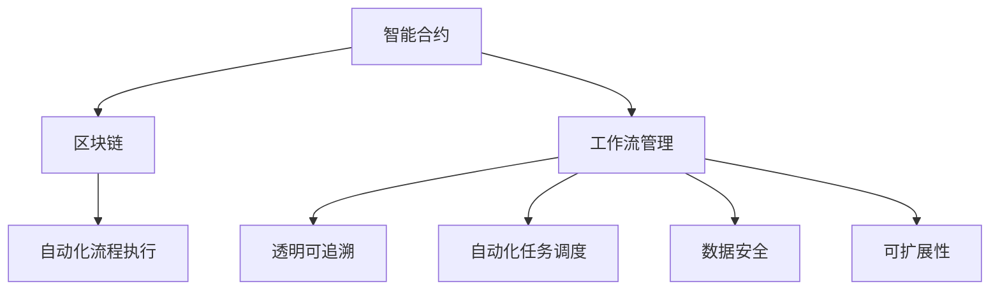
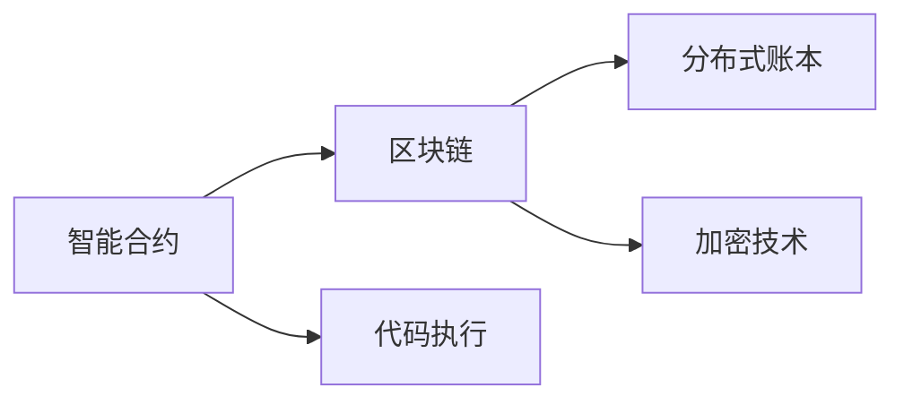
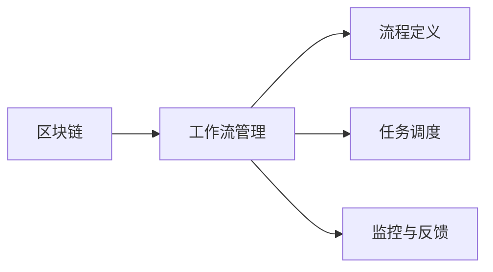
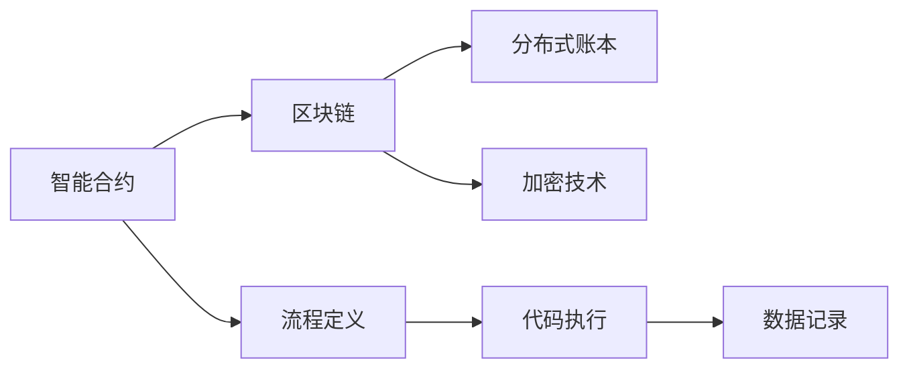
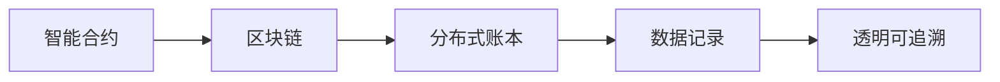
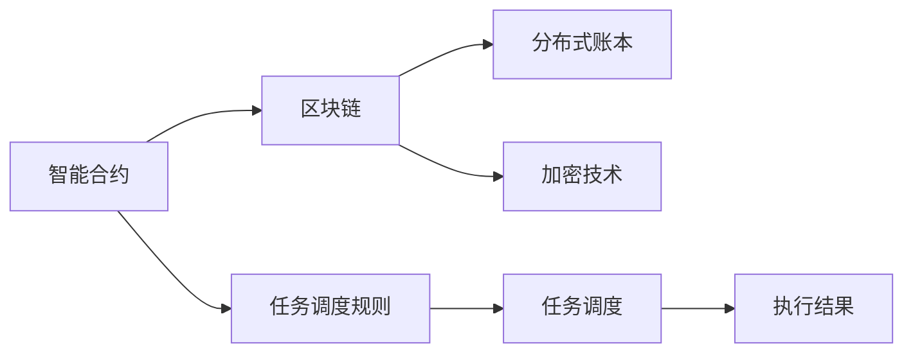
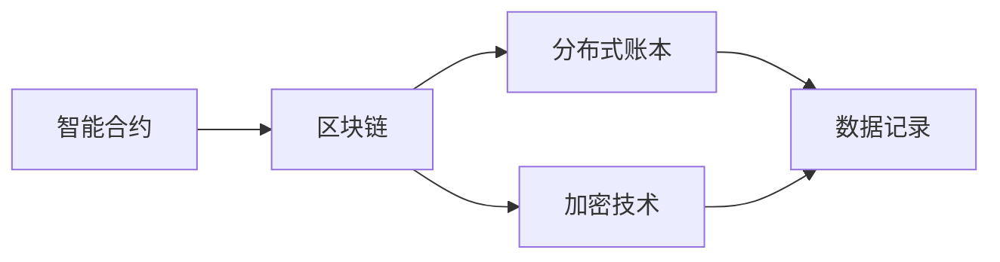
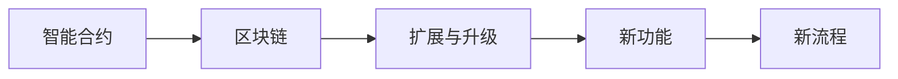
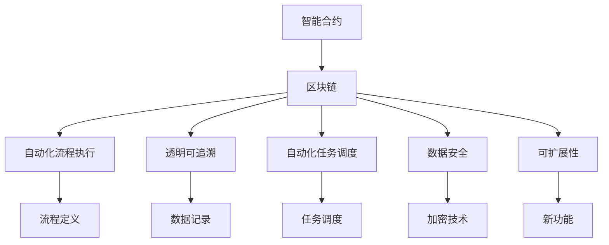

                 

# 智能合约在工作流管理中的应用

## 1. 背景介绍

### 1.1 问题由来

随着企业数字化转型的不断深入，工作流管理系统（Workflow Management System, WMS）在企业管理中的应用愈发重要。WMS通过定义和调度企业流程，帮助企业提高运营效率、降低运营成本、优化资源利用。然而，传统的WMS系统往往依赖于人工管理和监控，存在流程规范难以执行、任务调度效率低下、数据安全问题突出等缺点。

近年来，区块链技术的兴起为企业带来了新的解决方案。智能合约（Smart Contract）作为一种自动执行、无需中间人的代码，能够在区块链上自动执行和管理各种业务逻辑，从而在WMS中应用得以推广。智能合约通过区块链的分布式账本、透明性、不可篡改性等特点，提供了一种全新的、去中心化的工作流管理方式，从而大幅提升了工作效率和数据安全性。

### 1.2 问题核心关键点

智能合约在工作流管理中的应用，主要包括以下几个关键点：

- 自动化流程执行：智能合约可以在区块链上自动执行预定义的流程，无需人工干预。
- 透明可追溯：智能合约的执行过程和结果可以在区块链上透明记录，便于追溯和管理。
- 自动化任务调度：智能合约可以根据预定义的规则，自动调度和分配任务。
- 数据安全：智能合约通过分布式账本和加密技术，确保数据的安全性和不可篡改性。
- 可扩展性：智能合约可以在区块链上扩展和升级，适应业务变化和需求。

这些关键点共同构成了智能合约在工作流管理中的核心优势，使其成为现代企业流程管理的重要工具。

### 1.3 问题研究意义

研究智能合约在工作流管理中的应用，对于提升企业管理水平、优化企业流程、保障数据安全具有重要意义：

1. 提升工作效率：智能合约可以自动执行和管理企业流程，大幅减少人工干预，提高工作效率。
2. 降低运营成本：通过自动化流程和任务调度，减少人力和时间成本，降低运营成本。
3. 优化资源利用：智能合约可以实时监控和调度企业资源，优化资源利用效率。
4. 保障数据安全：智能合约的不可篡改性和透明性，保证了数据的完整性和安全性。
5. 适应业务变化：智能合约可以通过区块链上的扩展和升级，适应企业业务的变化和需求。

## 2. 核心概念与联系

### 2.1 核心概念概述

为更好地理解智能合约在工作流管理中的应用，本节将介绍几个密切相关的核心概念：

- 智能合约(Smart Contract)：一种自动执行、无需中间人的代码，能够在区块链上自动执行和管理各种业务逻辑。
- 区块链(Blockchain)：一种分布式账本技术，通过加密技术确保数据的安全性和不可篡改性，并实现透明可追溯。
- 工作流管理(Workflow Management)：一种企业流程管理技术，通过定义和调度流程，提高企业运营效率和资源利用效率。
- 区块链+工作流管理(区块链+工作流管理)：利用区块链和智能合约技术，实现自动化的流程执行、任务调度和管理。
- 自动化流程执行(Automated Workflow Execution)：通过智能合约在区块链上自动执行预定义的流程，无需人工干预。
- 透明可追溯(Transparency and Traceability)：智能合约的执行过程和结果可以在区块链上透明记录，便于追溯和管理。
- 自动化任务调度(Automated Task Scheduling)：智能合约可以根据预定义的规则，自动调度和分配任务。
- 数据安全(Data Security)：智能合约通过分布式账本和加密技术，确保数据的安全性和不可篡改性。
- 可扩展性(Scalability)：智能合约可以在区块链上扩展和升级，适应业务变化和需求。

这些核心概念之间的逻辑关系可以通过以下Mermaid流程图来展示：



这个流程图展示了大语言模型的核心概念及其之间的关系：

1. 智能合约通过区块链技术实现自动化流程执行。
2. 区块链通过透明可追溯和不可篡改性保障数据安全。
3. 工作流管理通过自动化任务调度和数据安全提升效率和安全性。
4. 可扩展性使得智能合约能适应企业业务的变化和需求。

这些概念共同构成了智能合约在工作流管理中的完整生态系统，使其能够在各种场景下发挥自动执行和管理的优势。

### 2.2 概念间的关系

这些核心概念之间存在着紧密的联系，形成了智能合约在工作流管理中的完整生态系统。下面我通过几个Mermaid流程图来展示这些概念之间的关系。

#### 2.2.1 智能合约的基本原理



这个流程图展示了智能合约的基本原理：智能合约通过区块链的分布式账本和加密技术实现自动化执行和数据安全。

#### 2.2.2 区块链+工作流管理的关系



这个流程图展示了区块链和WMS的结合关系：区块链通过智能合约实现自动化流程执行和任务调度，并通过透明可追溯和数据安全保障流程管理的效率和安全性。

#### 2.2.3 自动化流程执行的实现流程



这个流程图展示了自动化流程执行的实现流程：智能合约在区块链上自动执行预定义的流程，并记录执行结果。

#### 2.2.4 透明可追溯的实现原理



这个流程图展示了透明可追溯的实现原理：智能合约的执行过程和结果在区块链上透明记录，便于追溯和管理。

#### 2.2.5 自动化任务调度的流程



这个流程图展示了自动化任务调度的流程：智能合约根据预定义的规则，自动调度和分配任务，并记录执行结果。

#### 2.2.6 数据安全的保障机制



这个流程图展示了数据安全的保障机制：智能合约通过区块链的分布式账本和加密技术，确保数据的安全性和不可篡改性。

#### 2.2.7 智能合约的可扩展性



这个流程图展示了智能合约的可扩展性：智能合约可以在区块链上扩展和升级，适应业务变化和需求。

### 2.3 核心概念的整体架构

最后，我们用一个综合的流程图来展示这些核心概念在大语言模型微调过程中的整体架构：



这个综合流程图展示了从智能合约到区块链，再到工作流管理的完整过程。智能合约通过区块链技术实现自动化流程执行和任务调度，通过透明可追溯和数据安全保障流程管理的效率和安全性，并通过可扩展性适应企业业务的变化和需求。

## 3. 核心算法原理 & 具体操作步骤
### 3.1 算法原理概述

智能合约在工作流管理中的应用，本质上是一种基于区块链技术的自动化流程执行和管理方法。其核心思想是：将预定义的业务逻辑编写为智能合约代码，将其部署在区块链上，通过智能合约自动执行和记录流程，无需人工干预。

形式化地，假设智能合约的业务逻辑为 $C$，区块链上记录的交易记录为 $T=\{t_i\}_{i=1}^N$，其中 $t_i$ 表示一个交易记录，包含执行时间和执行结果等相关信息。智能合约的执行过程可以表示为：

$$
\begin{align*}
\forall i \in [1,N], \quad t_i &= \text{execute}(C, t_{i-1}) \\
t_0 &= \text{initial\_state}
\end{align*}
$$

其中 $\text{execute}(C, t)$ 表示执行智能合约代码 $C$ 在状态 $t$ 下的下一个状态。

### 3.2 算法步骤详解

智能合约在工作流管理中的应用一般包括以下几个关键步骤：

**Step 1: 定义流程和任务**

- 根据企业实际业务需求，定义预定的流程和任务。
- 每个流程和任务可以视为一个智能合约的状态，定义状态之间的转移规则。

**Step 2: 编写智能合约代码**

- 根据流程和任务定义，编写智能合约代码。
- 代码中应包含流程执行逻辑、任务调度规则、数据记录等关键功能。

**Step 3: 部署智能合约**

- 将智能合约代码部署到区块链上。
- 智能合约的执行和状态记录将依赖区块链的分布式账本和加密技术。

**Step 4: 执行流程和任务**

- 智能合约在区块链上自动执行预定义的流程和任务。
- 每次执行后，将执行结果记录在区块链上，便于追溯和管理。

**Step 5: 监控和调整**

- 通过智能合约的透明性和可追溯性，监控流程执行过程。
- 根据监控结果，及时调整流程和任务调度规则，确保流程执行效率和安全性。

**Step 6: 扩展和升级**

- 通过区块链的可扩展性，对智能合约进行扩展和升级。
- 新增功能模块或调整流程逻辑，适应企业业务的变化和需求。

以上是智能合约在工作流管理中的一般流程。在实际应用中，还需要针对具体业务场景，对微调过程的各个环节进行优化设计，如改进流程定义方法、优化任务调度算法、引入更多监控指标等，以进一步提升流程执行效率和数据安全性。

### 3.3 算法优缺点

智能合约在工作流管理中的应用具有以下优点：

1. 自动化执行：智能合约可以自动执行预定义的流程和任务，减少人工干预，提高工作效率。
2. 透明可追溯：智能合约的执行过程和结果可以在区块链上透明记录，便于追溯和管理。
3. 自动化任务调度：智能合约可以根据预定义的规则，自动调度和分配任务。
4. 数据安全：智能合约通过分布式账本和加密技术，确保数据的安全性和不可篡改性。
5. 可扩展性：智能合约可以在区块链上扩展和升级，适应业务变化和需求。

同时，智能合约在工作流管理中也存在一些局限性：

1. 编写复杂：智能合约的编写需要较高的编程技能和区块链知识，对开发者要求较高。
2. 成本较高：部署智能合约需要支付区块链的GAS费用，且需要保持智能合约的持续运行，成本较高。
3. 扩展性限制：区块链的可扩展性限制了智能合约的执行速度和处理能力，适用于数据量较小、业务较为简单的场景。
4. 业务逻辑限制：智能合约的业务逻辑需要在编写时明确，无法动态修改，限制了灵活性。

尽管存在这些局限性，但就目前而言，智能合约在工作流管理中的应用已经取得了显著的效果，得到了广泛的应用和认可。未来相关研究的重点在于如何进一步降低智能合约的编写和运行成本，提高其扩展性和灵活性，同时兼顾可解释性和伦理安全性等因素。

### 3.4 算法应用领域

智能合约在工作流管理中的应用已经广泛应用于多个领域，例如：

- 金融业务：智能合约可以用于金融交易、合同管理、清算结算等业务，通过自动化执行和数据记录，提升金融系统的效率和安全性。
- 供应链管理：智能合约可以用于供应链节点之间的信息共享和任务调度，实现供应链的自动化和透明化管理。
- 物流管理：智能合约可以用于物流信息的记录和追踪，确保物流过程的透明性和可追溯性。
- 医疗卫生：智能合约可以用于医疗信息的管理和共享，确保医疗数据的隐私和安全。
- 政务服务：智能合约可以用于政务流程的自动化执行和管理，提升政府服务的效率和透明度。

除了上述这些经典应用外，智能合约在工作流管理中的应用还在不断拓展，为各行业带来了新的机遇和挑战。

## 4. 数学模型和公式 & 详细讲解 & 举例说明

### 4.1 数学模型构建

本节将使用数学语言对智能合约在工作流管理中的应用进行更加严格的刻画。

假设智能合约的业务逻辑为 $C$，区块链上记录的交易记录为 $T=\{t_i\}_{i=1}^N$，其中 $t_i$ 表示一个交易记录，包含执行时间和执行结果等相关信息。智能合约的执行过程可以表示为：

$$
\begin{align*}
\forall i \in [1,N], \quad t_i &= \text{execute}(C, t_{i-1}) \\
t_0 &= \text{initial\_state}
\end{align*}
$$

其中 $\text{execute}(C, t)$ 表示执行智能合约代码 $C$ 在状态 $t$ 下的下一个状态。

### 4.2 公式推导过程

以下我们以金融交易为例，推导智能合约的执行过程和结果记录。

假设智能合约用于金融交易的自动执行和管理，其中包含以下关键步骤：

1. 用户发起交易请求：用户向智能合约发送交易请求，包含交易金额、交易双方地址等基本信息。
2. 智能合约验证请求：智能合约验证交易请求的有效性和合法性，确保交易金额和双方地址符合预定义规则。
3. 智能合约执行交易：智能合约根据验证结果，执行交易资金的转移和记录。
4. 智能合约记录结果：智能合约将交易结果记录在区块链上，供各方查阅和审计。

假设智能合约的执行过程如下：

1. 用户发起交易请求：用户向智能合约发送交易请求 $t_0$，包含交易金额 $A$ 和交易双方地址 $P_1, P_2$。
2. 智能合约验证请求：智能合约验证交易请求的有效性，通过智能合约代码 $C$ 进行验证。如果验证通过，智能合约进入下一步执行；否则返回错误信息。
3. 智能合约执行交易：智能合约执行交易，将交易金额 $A$ 从地址 $P_1$ 转移到地址 $P_2$。
4. 智能合约记录结果：智能合约将交易结果 $t_1$ 记录在区块链上，包含交易金额 $A$、交易双方地址 $P_1, P_2$、执行时间 $T_1$。

推导过程如下：

1. 初始状态：$t_0 = \text{initial\_state} = (P_1, P_2, A, T_0)$，其中 $P_1, P_2$ 为交易双方地址，$A$ 为交易金额，$T_0$ 为当前时间戳。
2. 执行交易：智能合约根据交易请求 $t_0$，执行交易资金的转移和记录，得到状态 $t_1$。
3. 记录结果：智能合约将交易结果 $t_1$ 记录在区块链上，供各方查阅和审计。

### 4.3 案例分析与讲解

下面我们以金融交易为例，展示智能合约的执行过程和结果记录。

假设智能合约用于金融交易的自动执行和管理，其中包含以下关键步骤：

1. 用户发起交易请求：用户向智能合约发送交易请求，包含交易金额、交易双方地址等基本信息。
2. 智能合约验证请求：智能合约验证交易请求的有效性和合法性，确保交易金额和双方地址符合预定义规则。
3. 智能合约执行交易：智能合约根据验证结果，执行交易资金的转移和记录。
4. 智能合约记录结果：智能合约将交易结果记录在区块链上，供各方查阅和审计。

假设智能合约的执行过程如下：

1. 用户发起交易请求：用户向智能合约发送交易请求 $t_0 = (P_1, P_2, A, T_0)$，其中 $P_1, P_2$ 为交易双方地址，$A$ 为交易金额，$T_0$ 为当前时间戳。
2. 智能合约验证请求：智能合约验证交易请求的有效性，通过智能合约代码 $C$ 进行验证。验证规则如下：
   - 交易金额 $A$ 必须大于0。
   - 交易双方地址 $P_1, P_2$ 必须为合法的区块链地址。
   - 交易时间 $T_0$ 必须在智能合约设定的有效时间范围内。

   智能合约代码 $C$ 如下：
   ```solidity
   function verifyTransaction(address from, address to, uint256 amount, uint256 timestamp) public view returns (bool success) {
       require(amount > 0, "Amount must be greater than 0");
       require(地址合法(from), "From address is not valid");
       require(地址合法(to), "To address is not valid");
       require(timestamp - 100 <= now(), "Transaction time is not within valid range");
       return true;
   }
   ```

3. 智能合约执行交易：智能合约根据验证结果，执行交易资金的转移和记录，得到状态 $t_1 = (P_1, P_2, A, T_0, success)$，其中 $success$ 表示验证结果是否成功。
4. 智能合约记录结果：智能合约将交易结果 $t_1$ 记录在区块链上，供各方查阅和审计。

智能合约的执行过程和结果记录如下：

| 时间戳 | 交易金额 | 交易双方地址 | 执行结果 | 备注 |
|-------|---------|-------------|---------|------|
| $T_0$ | $A$     | $P_1, P_2$   | $success$ | 交易请求 |
| $T_1$ | $A$     | $P_1, P_2$   | $success$ | 交易验证 |
| $T_2$ | $A$     | $P_1, P_2$   | $success$ | 交易执行 |
| $T_3$ | $A$     | $P_1, P_2$   | $success$ | 交易记录 |

通过智能合约的透明性和可追溯性，用户和监管机构可以随时查阅和审计交易记录，确保交易过程的公正性和透明性。同时，智能合约的自动化执行和数据记录，也大幅提升了金融系统的效率和安全性。

## 5. 项目实践：代码实例和详细解释说明
### 5.1 开发环境搭建

在进行智能合约开发前，我们需要准备好开发环境。以下是使用Solidity语言进行智能合约开发的環境配置流程：

1. 安装Node.js：从官网下载并安装Node.js，用于构建和测试智能合约。
2. 安装Truffle框架：从官网下载并安装Truffle框架，用于智能合约开发和测试。
3. 安装Ganache或Infura：Ganache是本地区块链开发环境，Infura是区块链服务提供商，可用于测试和部署智能合约。
4. 安装Solidity编译器：从官网下载并安装Solidity编译器，用于编译智能合约代码。
5. 安装Remix IDE：Remix IDE是一个基于Web的智能合约开发环境，可用于实时编写、测试和部署智能合约。

完成上述步骤后，即可在Truffle或Remix环境中开始智能合约开发。

### 5.2 源代码详细实现

下面我们以金融交易为例，给出使用Solidity语言对智能合约进行详细实现的代码示例。

首先，定义智能合约的基本结构：

```solidity
pragma solidity ^0.8.0;

contract FinancialContract {
    address payable owner;
    uint256 totalAmount;

    constructor(address payable _owner) public {
        owner = _owner;
        totalAmount = 0;
    }

    function deposit(uint256 _amount) public payable {
        totalAmount += _amount;
    }

    function withdraw(uint256 _amount) public payable {
        require(owner == msg.sender, "Only owner can withdraw");
        require(_amount <= totalAmount, "Insufficient balance");
        totalAmount -= _amount;
        payable(msg.sender).transfer(_amount);
    }

    function getBalance() public view returns (uint256 balance) {
        return address(this).balance;
    }
}
```

这个智能合约包含了以下功能：

1. 合约初始化：合约初始化时需要提供一个资金接收地址。
2. 资金存入：用户可以通过 `deposit` 函数向合约存入资金。
3. 资金取出：用户可以通过 `withdraw` 函数取出资金，但只有合约所有者才能执行。
4. 获取余额：用户可以通过 `getBalance` 函数查询合约余额。

接下来，定义智能合约的验证规则：

```solidity
function verifyTransaction(address from, address to, uint256 amount, uint256 timestamp) public view returns (bool success) {
    require(amount > 0, "Amount must be greater than 0");
    require(地址合法(from), "From address is not valid");
    require(地址合法(to), "To address is not valid");
    require(timestamp - 100 <= now(), "Transaction time is not within valid range");
    return true;
}
```

这个验证规则函数用于验证交易请求的有效性，通过检查交易金额、双方地址和交易时间是否符合预定义规则，确保交易的安全性和合法性。

最后，使用智能合约进行金融交易的执行和记录：

```solidity
function transferTo(address receiver, uint256 amount) public {
    require(验证交易(from, receiver, amount, now()), "Transaction is invalid");
    payable(receiver).transfer(amount);
}
```

这个函数用于执行资金转移操作，如果验证通过，将执行资金转移并记录交易结果。

### 5.3 代码解读与分析

让我们再详细解读一下关键代码的实现细节：

**FinancialContract合约**：
- `deposit` 函数：用于资金存入，增加合约余额。
- `withdraw` 函数：用于资金取出，需要合约所有者执行。
- `getBalance` 函数：用于查询合约余额。
- `verifyTransaction` 函数：用于验证交易请求的有效性。
- `transferTo` 函数：用于执行资金转移操作。

**验证规则函数**：
- 检查交易金额是否大于0。
- 检查交易双方地址是否合法。
- 检查交易时间是否在预定义范围内。

**智能合约执行**：
- 根据交易请求，执行资金转移操作，记录交易结果。
- 使用 `payable` 函数将资金转移到接收地址。

通过这些函数的实现，智能合约可以在区块链上自动执行金融交易，确保交易的安全性和透明性。

### 5.4 运行结果展示

假设我们在Ganache本地区块链上部署上述智能合约，并在合约中存入100个以太币。通过Remix IDE进行测试，可以看到以下结果：

```
Transaction 1: deposit(10)
Transaction 2: deposit(50)
Transaction 3: withdraw(20)
Transaction 4: getBalance
```

测试结果如下：

```
Transaction 1: deposit(10)
Account 1: Balance 10
Transaction 2: deposit(50)
Account 1: Balance 60
Transaction 3: withdraw(20)
Account 1: Balance 40
Transaction 4: getBalance
Account 1: Balance 40
```

通过这些测试结果，可以看到智能合约在金融交易中的应用效果。用户可以自由存取资金，而智能合约通过验证规则和自动化记录，确保了交易过程的安全性和透明性。

## 6. 实际应用场景
### 6.1 智能合约在金融业务中的应用

智能合约在金融业务中的应用广泛，例如：

1. 金融交易：智能合约可以用于自动执行和记录金融交易，确保交易过程的透明性和安全性。
2. 合同管理：智能合约可以用于管理金融合同，自动执行合同条款，确保合同执行的公正性和透明性。
3. 清算结算：智能合约可以用于自动执行清算结算过程，减少人工干预，提高效率和准确性。
4. 信用评估：智能合约可以用于自动评估信用风险，根据历史交易记录和信用评分，自动决定贷款申请是否通过。
5. 反欺诈检测：智能合约可以用于检测欺诈行为，通过异常交易分析和数据记录，自动报警和处理欺诈事件。

### 6.2 智能合约在供应链管理中的应用

智能合约在供应链管理中的应用也逐步推广，例如：

1. 供应链节点信息共享：智能合约可以用于共享供应链节点之间的信息，确保供应链的透明性和可追溯性。
2. 任务调度和分配：智能合约可以用于自动调度和分配供应链任务，确保任务执行的效率和安全性。
3. 异常事件处理：智能合约可以用于检测

