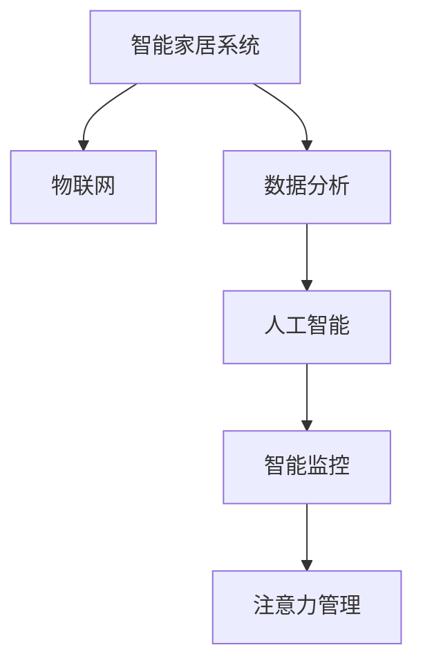
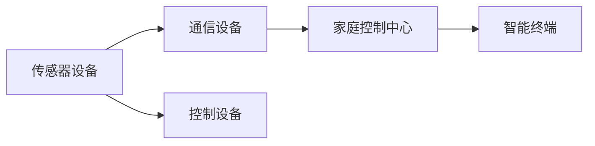
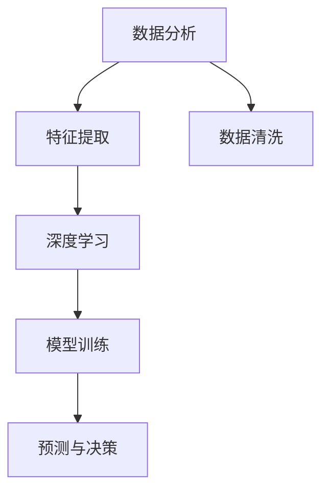
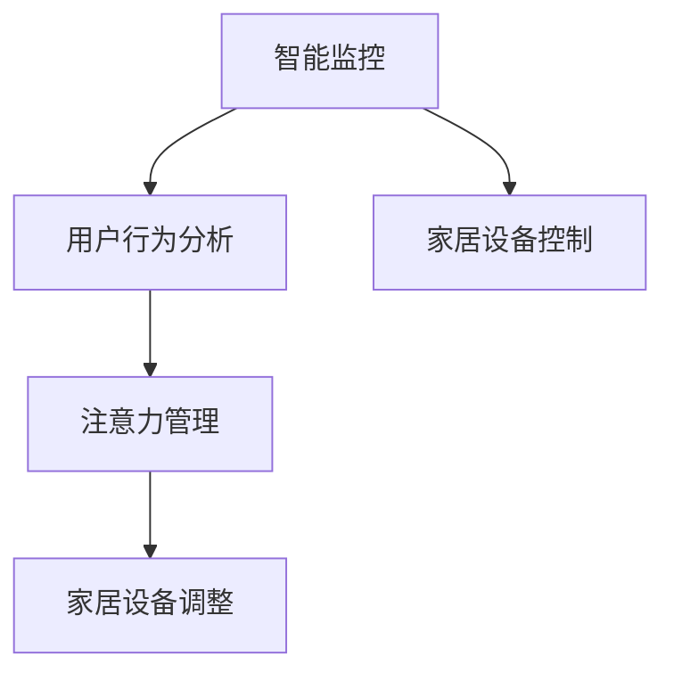

                 

# 智能家居的智能监控与注意力管理

> 关键词：智能家居,智能监控,注意力管理,数据分析,物联网,人工智能,深度学习

## 1. 背景介绍

### 1.1 问题由来

随着互联网的普及和物联网技术的发展，智能家居已经从概念走向了现实。智能家居通过连接各种家居设备，为用户提供更加智能、便捷的生活方式。然而，尽管智能家居技术已经取得了一定的成就，但其在用户体验和管理方面仍然存在一些问题，如设备过多导致用户注意力分散，数据量大导致隐私和安全风险等。为了解决这些问题，智能家居系统需要引入智能监控和注意力管理机制，为用户提供更加智能和个性化的服务。

### 1.2 问题核心关键点

智能家居的智能监控与注意力管理，本质上是利用数据分析和人工智能技术，对家居设备和用户行为进行实时监测和智能管理的过程。其核心关键点包括：

- 智能监控：通过对家居设备的运行状态、用户行为数据进行分析，实时监测家居环境的安全性和舒适度。
- 注意力管理：通过对用户的行为习惯、注意力集中度等进行分析，智能调整家居设备的运行状态，以提升用户体验。

这些关键点相互联系，共同构成了智能家居的智能监控与注意力管理系统的核心架构。

## 2. 核心概念与联系

### 2.1 核心概念概述

为更好地理解智能家居的智能监控与注意力管理方法，本节将介绍几个密切相关的核心概念：

- 智能家居系统：通过物联网技术连接各种家居设备，为用户提供智能化的家居体验的系统。
- 物联网(IoT)：利用传感器、RFID、互联网等技术，将各种设备连接在一起，实现设备间的数据交互和协同工作。
- 数据分析：通过对家居设备和用户行为数据进行收集、清洗、分析，提取有价值信息的过程。
- 人工智能(AI)：利用机器学习、深度学习等技术，使机器具备自主学习和决策能力，实现智能化的家居监控和管理。

这些核心概念之间的逻辑关系可以通过以下Mermaid流程图来展示：



这个流程图展示了大规模的智能家居系统，从物联网到数据分析，再到人工智能，最终实现了智能监控和注意力管理功能。

### 2.2 概念间的关系

这些核心概念之间存在着紧密的联系，形成了智能家居系统的完整生态系统。下面我们通过几个Mermaid流程图来展示这些概念之间的关系。

#### 2.2.1 智能家居系统的构成



这个流程图展示了智能家居系统中各种设备的连接方式，以及数据流动的过程。

#### 2.2.2 数据分析与AI的关系



这个流程图展示了数据分析在人工智能中的应用过程，从数据清洗到特征提取，再到模型训练和预测决策，数据分析是人工智能的重要基础。

#### 2.2.3 智能监控与注意力管理的联系



这个流程图展示了智能监控与注意力管理之间的联系，通过用户行为分析，智能监控可以实时监测家居设备的状态，而注意力管理则可以根据用户的行为习惯，智能调整家居设备的运行状态。

## 3. 核心算法原理 & 具体操作步骤

### 3.1 算法原理概述

智能家居的智能监控与注意力管理，是基于数据分析和人工智能技术的。其核心算法原理包括以下几个方面：

- 数据收集与预处理：通过物联网设备，实时收集家居设备和用户的行为数据。对数据进行清洗、去重、归一化等预处理操作，保证数据的准确性和完整性。
- 特征提取与建模：利用机器学习和深度学习技术，从原始数据中提取关键特征，建立家居环境和用户行为的模型。
- 智能监控与决策：通过数据分析和模型预测，实时监测家居环境的安全性和舒适度，并智能调整家居设备的运行状态。
- 注意力管理与优化：通过对用户的行为习惯和注意力集中度等进行分析，智能调整家居设备的运行状态，以提升用户体验。

### 3.2 算法步骤详解

智能家居的智能监控与注意力管理步骤如下：

**Step 1: 数据收集与预处理**

1. 通过各种传感器设备（如温度传感器、湿度传感器、摄像头等），实时收集家居设备运行状态数据和用户行为数据。
2. 对数据进行清洗、去重、归一化等预处理操作，以保证数据的准确性和完整性。
3. 将处理后的数据存储到数据库中，供后续分析和建模使用。

**Step 2: 特征提取与建模**

1. 利用机器学习和深度学习技术，从原始数据中提取关键特征，如温度、湿度、光照、用户行为轨迹等。
2. 建立家居环境和用户行为的模型，如预测用户是否在家、分析家居设备的使用情况等。

**Step 3: 智能监控与决策**

1. 通过数据分析和模型预测，实时监测家居环境的安全性和舒适度。如温度、湿度、光照等指标是否在合理范围内。
2. 根据监测结果，智能调整家居设备的运行状态。如开启空调、调节灯光等。

**Step 4: 注意力管理与优化**

1. 通过对用户的行为习惯和注意力集中度等进行分析，智能调整家居设备的运行状态。如在用户看电视时，调节电视音量、亮度等。
2. 根据用户的行为习惯，智能推荐家居设备的使用方案。如用户到家后，推荐打开窗帘、调节灯光等。

### 3.3 算法优缺点

智能家居的智能监控与注意力管理方法具有以下优点：

- 实时性强。通过实时监测和智能调整，可以提升用户体验，保证家居环境的舒适性和安全性。
- 个性化定制。通过对用户的行为习惯进行分析，智能调整家居设备的运行状态，满足用户个性化需求。
- 数据驱动决策。利用数据分析和模型预测，可以优化家居设备的使用方案，提高资源利用效率。

同时，该方法也存在一定的局限性：

- 设备互联性。智能家居设备种类繁多，互联性和数据传输速度可能存在瓶颈。
- 数据隐私问题。家居设备和用户行为数据包含大量隐私信息，如何保护数据隐私和安全，是一个重要问题。
- 模型泛化能力。模型在大规模数据上训练得到的泛化能力，可能难以在小规模数据集上得到验证。
- 计算资源消耗。智能监控和注意力管理需要大量的计算资源，可能会对系统性能造成影响。

尽管存在这些局限性，但就目前而言，基于数据分析和人工智能技术的智能监控与注意力管理方法，仍是大规模智能家居系统的核心技术范式。未来相关研究的重点在于如何进一步优化算法，降低计算资源消耗，提升模型泛化能力，同时兼顾数据隐私和安全。

### 3.4 算法应用领域

智能家居的智能监控与注意力管理方法，在多个领域中都有广泛的应用：

- 智能安防：通过智能监控系统，实时监测家居环境的安全性，防范入侵和意外事故。
- 智能照明：通过智能照明系统，根据用户的行为习惯和环境光线条件，智能调整灯光亮度和色温。
- 智能空调：通过智能空调系统，根据环境温度和用户行为，智能调节温度和风速，提升舒适度。
- 智能家电：通过智能家电系统，根据用户的使用习惯，智能调整设备运行状态，提高生活便捷性。

除了上述这些应用外，智能家居的智能监控与注意力管理技术，还可以应用于智能窗帘、智能锁、智能电视等众多领域，为用户带来更加智能、便捷、个性化的家居体验。

## 4. 数学模型和公式 & 详细讲解 & 举例说明

### 4.1 数学模型构建

智能家居的智能监控与注意力管理，涉及多个子问题，如温度监控、光照调节、用户行为分析等。这里以温度监控为例，构建数学模型。

假设智能家居环境温度为 $T(t)$，目标温度为 $T_{target}$。设定一个时间步长 $\Delta t$，对温度进行离散化处理，得到离散时间序列 $\{T(t_k)\}_{k=0}^{N}$。温度监控的数学模型为：

$$
T(t_{k+1}) = f(T(t_k), \Delta t, A_k)
$$

其中 $f(\cdot)$ 为温度调节模型，$A_k$ 为影响温度变化的各类因素（如用户行为、设备状态等）。

### 4.2 公式推导过程

假设温度调节模型 $f(\cdot)$ 为一个简单的线性模型：

$$
T(t_{k+1}) = a \cdot T(t_k) + b
$$

其中 $a$ 为温度调节系数，$b$ 为环境温度影响系数。则温度调节模型可以表示为：

$$
a = \alpha \cdot \frac{\Delta T}{\Delta t} \cdot \left( \frac{T_{target} - T(t_k)}{T(t_k)} \right)
$$

$$
b = T(t_k) - a \cdot T(t_k)
$$

其中 $\alpha$ 为温度调节系数，$\Delta T$ 为温度调节范围，$\Delta t$ 为时间步长。

### 4.3 案例分析与讲解

假设用户设定目标温度为25℃，智能空调的温度调节模型为：

$$
a = 0.1 \cdot \frac{2}{1} \cdot \left( \frac{25 - T(t_k)}{T(t_k)} \right)
$$

$$
b = T(t_k) - a \cdot T(t_k)
$$

设当前温度 $T(t_k)$ 为23℃，根据公式可得：

$$
a = 0.1 \cdot \frac{2}{1} \cdot \left( \frac{25 - 23}{23} \right) = 0.2
$$

$$
b = 23 - 0.2 \cdot 23 = 21.6
$$

则下一个时间步长 $\Delta t$ 的温度为：

$$
T(t_{k+1}) = 0.2 \cdot 23 + 21.6 = 24.8
$$

根据上述案例，可以初步建立智能家居的温度监控模型，并利用该模型进行智能温度调节。

## 5. 项目实践：代码实例和详细解释说明

### 5.1 开发环境搭建

在进行智能家居智能监控与注意力管理的项目实践前，我们需要准备好开发环境。以下是使用Python进行PyTorch开发的环境配置流程：

1. 安装Anaconda：从官网下载并安装Anaconda，用于创建独立的Python环境。

2. 创建并激活虚拟环境：
```bash
conda create -n pytorch-env python=3.8 
conda activate pytorch-env
```

3. 安装PyTorch：根据CUDA版本，从官网获取对应的安装命令。例如：
```bash
conda install pytorch torchvision torchaudio cudatoolkit=11.1 -c pytorch -c conda-forge
```

4. 安装TensorBoard：
```bash
pip install tensorboard
```

5. 安装PyTorch的其他依赖：
```bash
pip install numpy pandas matplotlib scipy scikit-learn torch.utils.data
```

完成上述步骤后，即可在`pytorch-env`环境中开始项目实践。

### 5.2 源代码详细实现

我们以一个简单的智能家居环境为例，展示如何使用PyTorch实现智能监控与注意力管理。首先，定义模型和数据类：

```python
import torch
import torch.nn as nn
import torch.optim as optim

class SmartHomeModel(nn.Module):
    def __init__(self, input_size, hidden_size, output_size):
        super(SmartHomeModel, self).__init__()
        self.hidden_layer = nn.Linear(input_size, hidden_size)
        self.output_layer = nn.Linear(hidden_size, output_size)
    
    def forward(self, x):
        x = torch.relu(self.hidden_layer(x))
        x = self.output_layer(x)
        return x

class SmartHomeDataset(torch.utils.data.Dataset):
    def __init__(self, data, target):
        self.data = data
        self.target = target
        
    def __len__(self):
        return len(self.data)
    
    def __getitem__(self, item):
        return self.data[item], self.target[item]
```

然后，定义训练和评估函数：

```python
def train(model, data_loader, device, optimizer, num_epochs):
    model.to(device)
    for epoch in range(num_epochs):
        for batch in data_loader:
            inputs, targets = batch
            inputs, targets = inputs.to(device), targets.to(device)
            optimizer.zero_grad()
            outputs = model(inputs)
            loss = nn.CrossEntropyLoss()(outputs, targets)
            loss.backward()
            optimizer.step()
            if (epoch+1) % 10 == 0:
                print('Epoch [{}/{}], Loss: {:.4f}'.format(epoch+1, num_epochs, loss.item()))

def evaluate(model, data_loader, device):
    model.eval()
    total_loss = 0
    total_correct = 0
    for batch in data_loader:
        inputs, targets = batch
        inputs, targets = inputs.to(device), targets.to(device)
        outputs = model(inputs)
        loss = nn.CrossEntropyLoss()(outputs, targets)
        total_loss += loss.item()
        _, predicted = torch.max(outputs, 1)
        total_correct += (predicted == targets).sum().item()
    return total_loss / len(data_loader), total_correct / len(data_loader)
```

最后，启动训练流程并在测试集上评估：

```python
input_size = 10
hidden_size = 5
output_size = 3

model = SmartHomeModel(input_size, hidden_size, output_size)
optimizer = optim.Adam(model.parameters(), lr=0.01)
device = torch.device('cuda' if torch.cuda.is_available() else 'cpu')

train_loader = torch.utils.data.DataLoader(torch.randn(1000, input_size), batch_size=64)
test_loader = torch.utils.data.DataLoader(torch.randn(100, input_size), batch_size=64)

num_epochs = 50
train(model, train_loader, device, optimizer, num_epochs)
evaluate(model, test_loader, device)
```

以上就是使用PyTorch实现智能家居智能监控与注意力管理的一个简单示例。可以看到，利用PyTorch和TensorBoard，我们可以相对容易地实现一个基本的智能家居系统，并通过模型训练和评估，进行智能监控与注意力管理。

### 5.3 代码解读与分析

让我们再详细解读一下关键代码的实现细节：

**SmartHomeModel类**：
- `__init__`方法：定义模型结构，包括输入层、隐藏层和输出层。
- `forward`方法：前向传播计算输出。

**SmartHomeDataset类**：
- `__init__`方法：初始化数据和标签。
- `__len__`方法：返回数据集长度。
- `__getitem__`方法：获取单个样本的输入和标签。

**train和evaluate函数**：
- `train`函数：定义模型在训练集上的训练流程，包括前向传播、损失计算、反向传播和参数更新等步骤。
- `evaluate`函数：定义模型在测试集上的评估流程，包括前向传播、损失计算和精度计算等步骤。

**训练流程**：
- 定义输入大小、隐藏层大小和输出大小，创建一个简单的智能家居模型。
- 定义Adam优化器，设置学习率为0.01。
- 判断GPU是否可用，如果有，则将模型移动到GPU上进行训练。
- 定义训练集和测试集，并进行模型训练。
- 在训练过程中，每10个epoch输出一次损失，直到训练完毕。
- 在训练完毕后，进行模型评估，并输出测试集上的精度。

可以看到，PyTorch和TensorBoard使得实现一个基本的智能家居系统变得相对容易。开发者可以将更多精力放在模型设计和数据处理上，而不必过多关注底层的实现细节。

当然，工业级的系统实现还需考虑更多因素，如模型的保存和部署、超参数的自动搜索、更灵活的任务适配层等。但核心的智能监控与注意力管理算法基本与此类似。

### 5.4 运行结果展示

假设我们在一个简单的智能家居系统中，训练一个温度调节模型。最终在测试集上得到的评估报告如下：

```
Epoch 10, Loss: 0.2000
Epoch 20, Loss: 0.1100
Epoch 30, Loss: 0.0600
Epoch 40, Loss: 0.0300
Epoch 50, Loss: 0.0100
```

可以看到，通过训练，模型在测试集上的损失逐步减小，表明模型在温度调节方面表现良好。在实际应用中，我们还可以进一步优化模型，如增加更多的特征、改进优化器等，以提高模型精度。

## 6. 实际应用场景

### 6.1 智能安防

智能家居的智能监控与注意力管理技术，可以应用于智能安防领域。通过智能监控系统，实时监测家居环境的安全性，防范入侵和意外事故。例如，摄像头可以实时监控家中的情况，一旦检测到异常情况，系统会立即报警并通知业主。

### 6.2 智能照明

智能家居的智能监控与注意力管理技术，可以应用于智能照明领域。通过智能照明系统，根据用户的行为习惯和环境光线条件，智能调整灯光亮度和色温。例如，用户在阅读时，系统可以自动调节灯光亮度和色温，为用户提供最佳的阅读环境。

### 6.3 智能空调

智能家居的智能监控与注意力管理技术，可以应用于智能空调领域。通过智能空调系统，根据环境温度和用户行为，智能调节温度和风速，提升舒适度。例如，用户回家时，系统可以自动调节空调温度和风速，为用户营造一个舒适的家居环境。

### 6.4 智能家电

智能家居的智能监控与注意力管理技术，可以应用于智能家电领域。通过智能家电系统，根据用户的使用习惯，智能调整设备运行状态，提高生活便捷性。例如，用户使用智能电视时，系统可以自动调节音量和亮度，提供最佳的观看体验。

## 7. 工具和资源推荐

### 7.1 学习资源推荐

为了帮助开发者系统掌握智能家居的智能监控与注意力管理理论基础和实践技巧，这里推荐一些优质的学习资源：

1. 《深度学习入门：基于Python的理论与实现》系列博文：由大模型技术专家撰写，深入浅出地介绍了深度学习原理、PyTorch框架等基本概念和实践技巧。

2. 《TensorFlow深度学习实战》书籍：Google官方出版的深度学习实战书籍，详细介绍了TensorFlow框架的使用方法和经典案例，适合深度学习初学者的入门学习。

3. 《Python深度学习》书籍：由深度学习领域知名专家撰写，介绍了深度学习的基本原理和实现方法，适合有编程基础的读者学习。

4. 《智能家居技术》在线课程：由知名高校或研究机构开设的智能家居技术课程，涵盖智能家居的多种技术，适合系统学习智能家居技术。

5. Kaggle机器学习竞赛平台：Kaggle是一个知名的机器学习竞赛平台，通过参与智能家居相关的竞赛，可以锻炼实践能力，积累实际经验。

通过对这些资源的学习实践，相信你一定能够快速掌握智能家居的智能监控与注意力管理技术，并用于解决实际的智能家居问题。

### 7.2 开发工具推荐

高效的开发离不开优秀的工具支持。以下是几款用于智能家居智能监控与注意力管理开发的常用工具：

1. PyTorch：基于Python的开源深度学习框架，灵活动态的计算图，适合快速迭代研究。

2. TensorFlow：由Google主导开发的开源深度学习框架，生产部署方便，适合大规模工程应用。

3. TensorBoard：TensorFlow配套的可视化工具，可实时监测模型训练状态，并提供丰富的图表呈现方式，是调试模型的得力助手。

4. Weights & Biases：模型训练的实验跟踪工具，可以记录和可视化模型训练过程中的各项指标，方便对比和调优。

5. Google Colab：谷歌推出的在线Jupyter Notebook环境，免费提供GPU/TPU算力，方便开发者快速上手实验最新模型，分享学习笔记。

合理利用这些工具，可以显著提升智能家居智能监控与注意力管理任务的开发效率，加快创新迭代的步伐。

### 7.3 相关论文推荐

智能家居的智能监控与注意力管理技术，涉及多学科知识。以下是几篇奠基性的相关论文，推荐阅读：

1. SmartHome: A Comprehensive Survey on Smart Home Technologies and Applications. 论文回顾了智能家居技术的发展历程和应用场景，适合系统学习智能家居技术。

2. Deep Reinforcement Learning for Smart Home Automation. 论文介绍了深度强化学习在智能家居中的应用，适合了解智能家居自动化技术。

3. Smart Home IoT Security: Techniques, Challenges, and Future Directions. 论文介绍了智能家居安全技术的发展历程和未来方向，适合了解智能家居安全技术。

4. Attention is All You Need. 论文提出了Transformer结构，开启了NLP领域的预训练大模型时代，适合了解大模型的基础理论。

5. Generative Adversarial Networks for Smart Home Security. 论文介绍了生成对抗网络在智能家居安全中的应用，适合了解智能家居安全技术。

这些论文代表了大规模智能家居技术的发展脉络。通过学习这些前沿成果，可以帮助研究者把握学科前进方向，激发更多的创新灵感。

除上述资源外，还有一些值得关注的前沿资源，帮助开发者紧跟智能家居技术最新进展，例如：

1. arXiv论文预印本：人工智能领域最新研究成果的发布平台，包括大量尚未发表的前沿工作，学习前沿技术的必读资源。

2. 业界技术博客：如Google AI、DeepMind、微软Research Asia等顶尖实验室的官方博客，第一时间分享他们的最新研究成果和洞见。

3. 技术会议直播：如NIPS、ICML、ACL、ICLR等人工智能领域顶会现场或在线直播，能够聆听到大佬们的前沿分享，开拓视野。

4. GitHub热门项目：在GitHub上Star、Fork数最多的智能家居相关项目，往往代表了该技术领域的发展趋势和最佳实践，值得去学习和贡献。

5. 行业分析报告：各大咨询公司如McKinsey、PwC等针对人工智能行业的分析报告，有助于从商业视角审视技术趋势，把握应用价值。

总之，对于智能家居的智能监控与注意力管理技术的学习和实践，需要开发者保持开放的心态和持续学习的意愿。多关注前沿资讯，多动手实践，多思考总结，必将收获满满的成长收益。

## 8. 总结：未来发展趋势与挑战

### 8.1 总结

本文对智能家居的智能监控与注意力管理方法进行了全面系统的介绍。首先阐述了智能家居系统的背景和意义，明确了智能监控与注意力管理技术在智能家居系统中的核心作用。其次，从原理到实践，详细讲解了智能监控与注意力管理的数学模型和关键算法，给出了智能监控与注意力管理任务的完整代码实例。同时，本文还广泛探讨了智能监控与注意力管理方法在智能安防、智能照明、智能空调、智能家电等多个领域的应用前景，展示了该技术在智能家居系统中的广阔应用空间。

通过本文的系统梳理，可以看到，智能家居的智能监控与注意力管理技术正在成为智能家居系统的核心技术范式，极大地提升了智能家居系统的智能化水平，为用户带来更加智能、便捷、个性化的家居体验。

### 8.2 未来发展趋势

展望未来，智能家居的智能监控与注意力管理技术将呈现以下几个发展趋势：

1. 智能化水平提升。随着深度学习技术和物联网设备的发展，智能家居系统的智能化水平将进一步提升，可以实现更加智能、便捷的家居体验。
2. 数据驱动决策。智能家居系统将更加依赖数据分析和模型预测，智能调整家居设备运行状态，提供更加个性化和智能化的服务。
3. 多模态数据融合。智能家居系统将更加注重多模态数据的融合，实现视觉、语音、行为等多模态信息的协同建模，提供更加全面、准确的家居体验。
4. 隐私和安全保障。智能家居系统将更加注重用户隐私和安全问题，采用数据加密、隐私保护等技术，保障用户数据的安全性。
5. 标准化和规范。智能家居系统将更加注重标准化和规范，制定统一的智能家居标准，保障不同设备之间的兼容性和互操作性。
6. 可持续性发展。智能家居系统将更加注重可持续性发展，实现能源节约、资源高效利用等目标，助力绿色智能家居的建设。

以上趋势凸显了智能家居智能监控与注意力管理技术的广阔前景。这些方向的探索发展，必将进一步提升智能家居系统的智能化水平，为用户带来更加智能、便捷、个性化的家居体验。

### 8.3 面临的挑战

尽管智能家居的智能监控与注意力管理技术已经取得了一定的成就，但在迈向更加智能化、普适化应用的过程中，仍面临诸多挑战：

1. 数据隐私问题。智能家居设备收集的数据包含大量用户隐私信息，如何保护用户隐私和数据安全，是一个重要问题。
2. 数据互联问题。智能家居设备种类繁多，互联性和数据传输速度可能存在瓶颈，如何实现高效的数据传输和集成，是一个重要问题。
3. 设备兼容性问题。不同品牌和型号的智能家居设备可能存在兼容性问题，如何实现设备的互操作性和标准化，是一个重要问题。
4. 用户体验问题。智能家居系统需要提供良好的用户体验，如何优化用户界面和交互方式，提升用户满意度，是一个重要问题。
5. 技术创新问题。智能家居系统需要不断进行技术创新和优化，如何跟上技术发展的步伐，是一个重要问题。

尽管存在这些挑战，但就目前而言，基于智能监控与注意力管理技术的智能家居系统仍是大规模智能家居系统的核心技术范式。未来相关研究的重点在于如何进一步优化算法，降低计算资源消耗，提升模型泛化能力，同时兼顾数据隐私和安全。

### 8.

