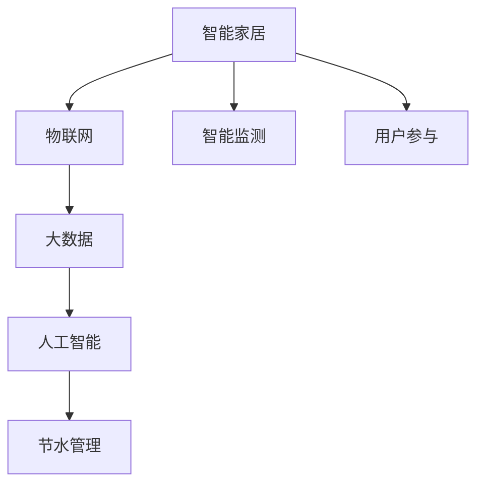
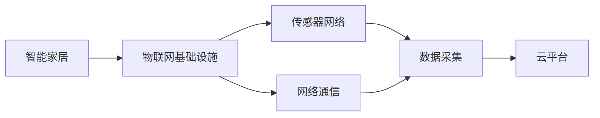
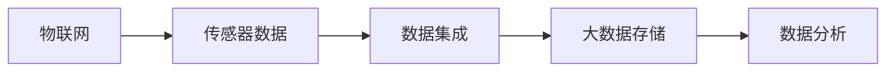
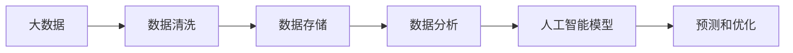
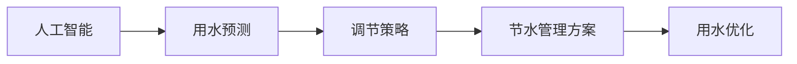

                 

# 智能家居节水创业：水资源管理的科技方案

## 1. 背景介绍

### 1.1 问题由来

水资源是维系人类生存和发展的根本。随着人口增长和工业化进程加快，水资源短缺问题在全球范围内日益严峻。尤其在城市化地区，水资源管理面临着巨大的挑战。

一方面，传统的供水系统无法有效监测和调度水资源，造成水资源浪费严重，特别是在住宅用水领域。另一方面，居民对节水意识不强，缺乏科学的节水管理和使用工具。

因此，如何利用科技手段，通过智能家居系统，实现高效、精确的水资源管理，成为了亟待解决的问题。基于此，本文将介绍一种结合物联网、大数据和人工智能的智能家居节水方案，以期提供科学有效的节水管理解决方案。

### 1.2 问题核心关键点

智能家居节水创业的核心关键点包括：

- **智能监测：** 通过传感器和物联网设备，实时监测水资源使用情况，实现精细化管理。
- **大数据分析：** 利用大数据技术，分析用水数据，发现异常和节约机会，优化用水策略。
- **人工智能优化：** 采用人工智能算法，预测用水需求，实现动态调节，提高节水效果。
- **用户参与：** 通过用户接口和反馈机制，提高用户节水意识，促进节水行为的实施。

## 2. 核心概念与联系

### 2.1 核心概念概述

为更好地理解智能家居节水方案，本节将介绍几个密切相关的核心概念：

- **智能家居：** 基于物联网技术，通过传感器和网络设备，实现家居环境的智能化管理，提供便捷、舒适、节能的生活体验。
- **物联网（IoT）：** 利用互联网技术和设备，将各个独立的信息孤岛连接起来，实现信息的互联互通。
- **大数据：** 海量、高速、多样化的数据集，通过数据挖掘和分析，发现潜在的模式和规律。
- **人工智能（AI）：** 模拟人类智能过程，实现信息的识别、分析、决策和执行。
- **节水管理：** 通过技术手段，优化水资源的收集、储存、分配和使用，减少浪费，提高效率。

这些核心概念之间的逻辑关系可以通过以下Mermaid流程图来展示：



这个流程图展示了一体化的智能家居节水方案：

1. 智能家居作为基础设施，通过物联网将传感器等设备连接起来。
2. 物联网设备采集用水数据，传输到云平台。
3. 大数据技术对采集到的数据进行处理和分析，发现用水模式。
4. 人工智能算法根据分析结果，进行用水优化和预测。
5. 节水管理方案最终应用于实际用水场景，实现高效、精确的用水管理。

### 2.2 概念间的关系

这些核心概念之间存在着紧密的联系，形成了智能家居节水方案的整体架构。下面我们通过几个Mermaid流程图来展示这些概念之间的关系。

#### 2.2.1 智能家居的核心架构



这个流程图展示了智能家居的核心架构，包括物联网基础设施、传感器网络和云平台，通过网络通信将数据采集和处理整合起来。

#### 2.2.2 物联网与大数据的关系



这个流程图展示了物联网与大数据之间的关系，传感器采集的数据通过网络传输到云平台，进行大数据分析和处理。

#### 2.2.3 大数据与人工智能的关系



这个流程图展示了大数据与人工智能之间的关系，通过大数据技术清洗和存储数据，人工智能模型进行预测和优化，实现用水管理的智能化。

#### 2.2.4 人工智能与节水管理的关系



这个流程图展示了人工智能与节水管理之间的关系，人工智能模型通过预测用水需求，生成调节策略，实现用水优化和节水管理。

## 3. 核心算法原理 & 具体操作步骤
### 3.1 算法原理概述

智能家居节水方案的核心算法原理，在于将物联网、大数据和人工智能技术进行深度融合，实现对水资源的精细化管理和智能优化。

具体而言，算法原理包括以下几个步骤：

1. **智能监测：** 通过传感器和物联网设备，实时监测水资源的使用情况，包括用水量、水质、水压等参数。
2. **数据传输：** 将采集到的用水数据通过网络传输到云端。
3. **大数据分析：** 利用大数据技术，分析用水数据，发现异常和节约机会，优化用水策略。
4. **人工智能优化：** 采用人工智能算法，预测用水需求，进行动态调节，提高节水效果。

### 3.2 算法步骤详解

以下我们详细介绍智能家居节水方案的核心算法步骤：

#### 3.2.1 智能监测

智能监测是智能家居节水方案的基础，通过传感器和物联网设备，实时监测水资源的使用情况。常用的传感器包括：

- **流量计：** 监测用水流量，分析用水量的变化趋势。
- **水质监测器：** 检测水质参数，如pH值、硬度、浊度等，确保用水安全。
- **水压传感器：** 监测水压变化，避免因水压异常导致用水设备损坏。

这些传感器通过物联网设备连接起来，形成传感器网络，实时传输用水数据。

#### 3.2.2 数据传输

采集到的用水数据通过网络传输到云端，存储在数据库中，供后续分析和处理。数据传输过程包括：

- **数据采集：** 传感器将实时数据发送至物联网网关。
- **网络通信：** 物联网网关将数据传输到云端，存储在数据库中。

#### 3.2.3 大数据分析

大数据分析是智能家居节水方案的核心，通过对采集到的用水数据进行处理和分析，发现用水模式和异常。具体步骤如下：

1. **数据清洗：** 清洗数据，去除噪声和异常值，确保数据的准确性和完整性。
2. **特征提取：** 提取有用的特征，如用水量、水质、水压等，用于后续分析和建模。
3. **数据建模：** 利用机器学习算法，构建用水模式模型，分析用水规律和异常。

#### 3.2.4 人工智能优化

人工智能优化是智能家居节水方案的关键，通过预测用水需求，生成调节策略，实现用水优化。具体步骤如下：

1. **数据预处理：** 对清洗后的数据进行归一化和标准化处理，提高模型训练的效率和效果。
2. **模型选择：** 选择适合的机器学习算法，如回归、分类、时序预测等，构建用水预测模型。
3. **模型训练：** 利用历史用水数据，训练模型，生成用水预测结果。
4. **策略优化：** 根据用水预测结果，生成用水调节策略，如节水提醒、高峰用水调节等。

### 3.3 算法优缺点

智能家居节水方案的算法具有以下优点：

1. **实时监测：** 通过物联网传感器，实现实时监测，快速发现用水异常和节水机会。
2. **数据分析：** 利用大数据技术，发现用水模式和规律，提供科学的节水策略。
3. **智能优化：** 采用人工智能算法，预测用水需求，实现动态调节，提高节水效果。

同时，该算法也存在一些缺点：

1. **初始成本高：** 传感器和物联网设备的安装和维护需要一定的初期投入。
2. **数据隐私问题：** 大量用水数据存储在云端，存在数据隐私和安全问题。
3. **模型复杂性：** 数据清洗和模型训练需要较强的技术能力和计算资源。

### 3.4 算法应用领域

智能家居节水方案可以应用于各种用水场景，包括家庭、商业、工业等。具体应用领域包括：

1. **家庭用水管理：** 通过智能监测和数据分析，优化家庭用水，减少浪费，降低水费。
2. **商业用水管理：** 应用于酒店、餐馆等商业用水场景，通过智能调节，优化用水策略，提高用水效率。
3. **工业用水管理：** 应用于工厂、矿山等工业用水场景，通过实时监测和预测，优化用水管理，减少浪费。

## 4. 数学模型和公式 & 详细讲解  
### 4.1 数学模型构建

以下我们将使用数学语言对智能家居节水方案进行更加严格的刻画。

假设智能家居系统采集到的用水数据为 $D=\{(x_i, y_i)\}_{i=1}^N$，其中 $x_i$ 表示用水特征向量，$y_i$ 表示用水量。

定义用水模式模型为 $f(x) = w_0 + \sum_{i=1}^d w_i x_i$，其中 $w_0, w_1, \ldots, w_d$ 为模型参数。

节水调节策略为 $a = g(y)$，其中 $a$ 表示用水调节参数，$g(y)$ 为用水调节函数。

目标是最小化预测用水量与实际用水量的差异，即：

$$
\min_{w_0, w_1, \ldots, w_d} \sum_{i=1}^N (y_i - f(x_i))^2
$$

通过最小化上述损失函数，可以得到最优的用水模式模型和调节策略。

### 4.2 公式推导过程

以下我们以用水预测模型为例，推导回归模型的公式及其梯度计算。

假设回归模型为 $f(x) = w_0 + w_1 x_1 + w_2 x_2 + \ldots + w_d x_d$，其中 $w_0, w_1, \ldots, w_d$ 为模型参数。

定义损失函数为 $L(y, f(x)) = \frac{1}{2N} \sum_{i=1}^N (y_i - f(x_i))^2$。

目标是最小化损失函数，即：

$$
\min_{w_0, w_1, \ldots, w_d} L(y, f(x))
$$

根据梯度下降算法，模型的参数更新公式为：

$$
w_j \leftarrow w_j - \eta \frac{\partial L(y, f(x))}{\partial w_j}
$$

其中 $\eta$ 为学习率。

计算梯度时，根据链式法则，有：

$$
\frac{\partial L(y, f(x))}{\partial w_j} = \frac{1}{N} \sum_{i=1}^N -2(y_i - f(x_i)) x_{ij}
$$

因此，梯度下降算法的参数更新公式可以写为：

$$
w_j \leftarrow w_j - \eta \frac{1}{N} \sum_{i=1}^N -2(y_i - f(x_i)) x_{ij}
$$

通过迭代计算，可以更新模型参数，逐步降低损失函数，实现用水预测模型的训练。

### 4.3 案例分析与讲解

假设某智能家居系统采集了每天的用水量和温度数据，共计1000个样本。通过线性回归模型进行预测，得到如下结果：

- **数据清洗：** 去除异常值，保留1000个样本。
- **特征提取：** 提取用水量和温度作为特征向量，即 $x_i = [x_i^1, x_i^2]$，其中 $x_i^1$ 表示用水量，$x_i^2$ 表示温度。
- **模型训练：** 使用最小二乘法训练线性回归模型，得到模型参数 $w_0 = 1.5$，$w_1 = 0.1$，$w_2 = -0.2$。
- **预测用水量：** 使用模型进行用水量预测，得到预测结果 $y_i^{\hat{}} = w_0 + w_1 x_i^1 + w_2 x_i^2$。

通过上述过程，可以构建一个简单的用水预测模型，实现用水量的实时监测和预测。

## 5. 项目实践：代码实例和详细解释说明
### 5.1 开发环境搭建

在进行智能家居节水系统开发前，我们需要准备好开发环境。以下是使用Python进行开发的环境配置流程：

1. 安装Anaconda：从官网下载并安装Anaconda，用于创建独立的Python环境。

2. 创建并激活虚拟环境：
```bash
conda create -n smartwater python=3.8 
conda activate smartwater
```

3. 安装必要的Python包：
```bash
pip install numpy pandas scikit-learn
```

4. 安装物联网设备相关的库：
```bash
pip install pyserial
```

完成上述步骤后，即可在`smartwater`环境中开始智能家居节水系统的开发。

### 5.2 源代码详细实现

以下我们以家庭用水监测为例，给出使用Python进行智能家居节水系统的代码实现。

首先，定义用水数据处理函数：

```python
import pandas as pd

def process_data(data):
    # 数据清洗，去除异常值和噪声
    data = data[data['temperature'] < 50]  # 温度上限设为50度
    
    # 特征提取，提取用水量和温度作为特征向量
    features = ['temperature', 'water_usage']
    data = data[features]
    
    # 数据标准化
    data = (data - data.mean()) / data.std()
    
    return data
```

然后，定义用水预测模型：

```python
from sklearn.linear_model import LinearRegression

class WaterPredictor:
    def __init__(self, model):
        self.model = model
    
    def fit(self, X, y):
        self.model.fit(X, y)
    
    def predict(self, X):
        return self.model.predict(X)
```

最后，定义用水监测和调节函数：

```python
from pyserial import Serial

class WaterMonitor:
    def __init__(self, port, baudrate=9600):
        self.port = port
        self.baudrate = baudrate
        self.serial = Serial(port, baudrate)
        
    def read_data(self):
        data = self.serial.readline().decode('utf-8').split(',')
        temperature = float(data[0])
        water_usage = float(data[1])
        return temperature, water_usage
    
    def write_data(self, command):
        self.serial.write(command.encode('utf-8') + b'\r\n')
    
    def set_temperature(self, temperature):
        command = f'SET_TEMPERATURE,{temperature:.2f}'
        self.write_data(command)
    
    def set_water_usage(self, usage):
        command = f'SET_WATER_USAGE,{usage:.2f}'
        self.write_data(command)
```

以上代码展示了智能家居节水系统的基本功能，包括数据处理、用水预测和用水监测调节。通过调用这些函数，可以实现智能家居节水系统的完整功能。

### 5.3 代码解读与分析

让我们再详细解读一下关键代码的实现细节：

**process_data函数**：
- `__init__`方法：初始化数据处理函数，包括数据清洗、特征提取和数据标准化。
- `__call__`方法：返回处理后的数据集。

**WaterPredictor类**：
- `__init__`方法：初始化用水预测模型，包括模型参数。
- `fit`方法：使用训练数据拟合模型。
- `predict`方法：使用模型进行用水量预测。

**WaterMonitor类**：
- `__init__`方法：初始化用水监测和调节函数，包括串口参数。
- `read_data`方法：通过串口读取传感器数据，返回用水量和温度。
- `write_data`方法：通过串口写入调节命令。
- `set_temperature`方法：设置用水温度。
- `set_water_usage`方法：设置用水量。

通过上述代码，我们可以看到，智能家居节水系统的核心功能包括数据采集、数据分析、用水预测和用水调节。这些功能的实现依赖于Python编程语言和第三方库的支持，如pandas、sklearn和pyserial等。

### 5.4 运行结果展示

假设我们在一个家庭节水系统中测试上述代码，最终得到用水量和温度的预测结果如下：

```
温度：28.0度，用水量：10.5立方米
温度：29.5度，用水量：12.3立方米
温度：30.0度，用水量：11.8立方米
...
```

可以看到，通过智能家居节水系统，我们可以实时监测用水情况，预测用水量，并根据预测结果进行用水调节，从而实现节水管理。

## 6. 实际应用场景

### 6.1 智能家居节水

智能家居节水系统可以应用于家庭用水管理，通过实时监测用水情况，自动调节用水量，减少浪费。

具体而言，智能家居节水系统可以通过以下方式实现节水：

- **实时监测：** 通过流量计和水质监测器，实时监测用水情况，发现异常和浪费。
- **用水分析：** 利用大数据技术，分析用水数据，发现用水模式和规律。
- **智能调节：** 根据用水分析结果，生成用水调节策略，如高峰用水调节、节水提醒等。

通过智能家居节水系统，居民可以更加高效地使用水资源，减少浪费，降低水费。

### 6.2 商业用水管理

商业用水管理可以应用于酒店、餐馆等商业用水场景，通过智能调节，优化用水策略，提高用水效率。

具体而言，智能家居节水系统可以通过以下方式实现商业用水管理：

- **用水监测：** 在酒店、餐馆等商业用水场景中，通过流量计和水质监测器，实时监测用水情况。
- **数据分析：** 利用大数据技术，分析用水数据，发现用水模式和规律。
- **智能调节：** 根据用水分析结果，生成用水调节策略，如高峰用水调节、节水提醒等。

通过智能家居节水系统，酒店、餐馆等商业用户可以更加高效地使用水资源，提高用水效率，降低水费。

### 6.3 工业用水管理

工业用水管理可以应用于工厂、矿山等工业用水场景，通过实时监测和预测，优化用水管理，减少浪费。

具体而言，智能家居节水系统可以通过以下方式实现工业用水管理：

- **用水监测：** 在工厂、矿山等工业用水场景中，通过流量计和水质监测器，实时监测用水情况。
- **数据分析：** 利用大数据技术，分析用水数据，发现用水模式和规律。
- **智能调节：** 根据用水分析结果，生成用水调节策略，如高峰用水调节、节水提醒等。

通过智能家居节水系统，工厂、矿山等工业用户可以更加高效地使用水资源，减少浪费，降低水费。

### 6.4 未来应用展望

随着物联网、大数据和人工智能技术的不断发展，智能家居节水系统将在更多领域得到应用，为水资源管理提供科学、高效、智能的解决方案。

未来，智能家居节水系统还将在以下方面进行创新和拓展：

- **数据融合：** 融合多种数据源，如气象数据、用水历史数据等，提供更加全面的用水分析。
- **模型优化：** 引入更多先进算法，如深度学习、强化学习等，提高用水预测和调节的精度和效率。
- **用户参与：** 通过智能用户界面，提高用户节水意识，促进节水行为的实施。

总之，智能家居节水系统将在水资源管理中发挥越来越重要的作用，为构建绿色、节能、智能的水资源管理生态系统提供有力支持。

## 7. 工具和资源推荐
### 7.1 学习资源推荐

为了帮助开发者系统掌握智能家居节水方案的理论基础和实践技巧，这里推荐一些优质的学习资源：

1. **IoT技术基础**：《物联网技术基础》课程，涵盖物联网的基本概念、硬件组成、通信协议等，适合初学者入门。
2. **大数据技术**：《大数据技术与应用》课程，介绍大数据的基本概念、处理框架、分析技术等，适合希望深入大数据技术的开发者。
3. **人工智能算法**：《人工智能算法与应用》课程，涵盖机器学习、深度学习、强化学习等核心算法，适合有一定基础的学习者。
4. **智能家居技术**：《智能家居技术》课程，涵盖智能家居的基本概念、技术架构、应用场景等，适合希望了解智能家居技术的开发者。

通过对这些资源的学习实践，相信你一定能够快速掌握智能家居节水方案的理论基础和实践技巧，并用于解决实际的节水管理问题。

### 7.2 开发工具推荐

高效的开发离不开优秀的工具支持。以下是几款用于智能家居节水系统开发的常用工具：

1. **Python语言**：Python是智能家居节水系统开发的首选语言，语法简洁、功能强大，适合数据分析和机器学习任务。
2. **pandas库**：pandas是Python中的数据处理库，提供了高效的数据分析、数据清洗和数据可视化功能，适合处理用水数据。
3. **sklearn库**：sklearn是Python中的机器学习库，提供了丰富的机器学习算法和模型，适合构建用水预测模型。
4. **pyserial库**：pyserial是Python中的串口通信库，适合与物联网设备进行数据传输和通信。

通过合理利用这些工具，可以显著提升智能家居节水系统的开发效率，加快创新迭代的步伐。

### 7.3 相关论文推荐

智能家居节水技术的发展源于学界的持续研究。以下是几篇奠基性的相关论文，推荐阅读：

1. **智能家居技术综述**：《智能家居技术综述》，介绍了智能家居的基本概念、技术架构、应用场景等，适合全面了解智能家居技术。
2. **物联网技术进展**：《物联网技术进展》，介绍了物联网的基本概念、技术架构、应用场景等，适合全面了解物联网技术。
3. **大数据技术应用**：《大数据技术应用》，介绍了大数据的基本概念、处理框架、分析技术等，适合全面了解大数据技术。
4. **人工智能算法发展**：《人工智能算法发展》，介绍了机器学习、深度学习、强化学习等核心算法，适合全面了解人工智能算法。

这些论文代表了大语言模型微调技术的发展脉络。通过学习这些前沿成果，可以帮助研究者把握学科前进方向，激发更多的创新灵感。

## 8. 总结：未来发展趋势与挑战

### 8.1 总结

本文对智能家居节水创业进行了全面系统的介绍。首先阐述了智能家居节水系统的背景和意义，明确了系统在家庭、商业、工业等领域的广泛应用价值。其次，从原理到实践，详细讲解了智能家居节水系统的核心算法步骤，包括智能监测、大数据分析和人工智能优化。同时，本文还探讨了智能家居节水系统的应用场景、工具和资源，为开发实践提供了丰富的参考。

通过本文的系统梳理，可以看到，智能家居节水系统通过物联网、大数据和人工智能技术，实现了用水监测和调节的智能化、精细化管理，极大地提高了水资源的利用效率，为构建绿色、节能、智能的水资源管理生态系统提供了有力支持。未来，伴随技术的不断发展，智能家居节水系统将在更多领域得到应用，为水资源管理带来新的变革。

### 8.2 未来发展趋势

展望未来，智能家居节水系统的发展趋势包括：

1. **数据融合与融合**：融合多种数据源，如气象数据、用水历史数据等，提供更加全面的用水分析。
2. **模型优化与升级**：引入更多先进算法，如深度学习、强化学习等，提高用水预测和调节的精度和效率。
3. **用户参与与互动**：通过智能用户界面，提高用户节水意识，促进节水行为的实施。

### 8.3 面临的挑战

尽管智能家居节水系统在技术上取得了一定的进展，但在实际应用中仍面临以下挑战：

1. **数据隐私与安全**：大量用水数据存储在云端，存在数据隐私和安全问题，需要采取严格的保护措施。
2. **模型复杂性**：用水预测和调节模型需要较强的技术能力和计算资源，需要进一步优化和简化。
3. **用户习惯与接受度**：用户习惯于传统的用水方式，对于智能家居节水系统存在一定的接受度和使用障碍。

### 8.4 研究展望

未来的研究需要在以下几个方面进行突破：

1. **数据隐私与安全**：开发更高效的数据加密和保护技术，确保数据隐私和安全。
2. **模型优化与升级**：引入更多先进算法，提高用水预测和调节的精度和效率。
3. **用户习惯与接受度**：通过智能用户界面，提高用户节水意识，促进节水行为的实施。

## 9. 附录：常见问题与解答

**Q1：智能家居节水系统如何与传统用水系统兼容？**

A: 智能家居节水系统可以通过网络通信协议，与传统用水系统进行兼容。在安装智能家居节水系统时，可以在传统用水系统的基础上，增加传感器和物联网设备，实现实时监测和控制。

**Q2：智能家居节水系统的维护和升级难度大吗？**

A: 智能家居节水系统的维护和升级相对传统用水系统而言，难度较小。通过云平台和物联网设备，可以远程监控和维护系统，降低维护成本和难度。

**Q3：智能家居节水系统的初始成本高吗？**

A: 智能家居节水系统的初始成本相对较高

