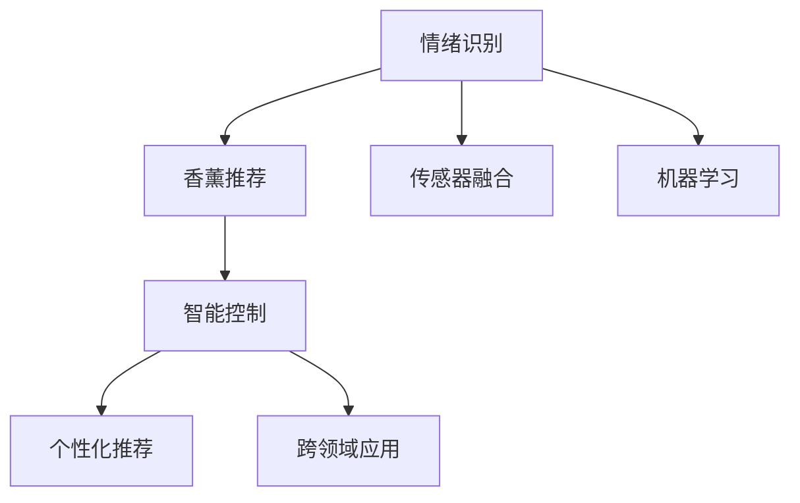

                 

# 智能家居香薰创业：情绪管理的嗅觉体验

> 关键词：情绪管理, 智能家居, 香薰创业, 嗅觉体验, 传感器融合, 机器学习, 个性化推荐, 跨领域应用

## 1. 背景介绍

随着人们生活水平的提高和健康意识的增强，智能家居香薰创业变得越来越受到关注。传统的香薰体验往往依赖于人工调香师的设计，难以做到个性化和实时性。而智能家居香薰利用现代技术，能够根据用户的情绪和环境信息，自动生成和调整香薰方案，提供更加贴心和科学的香薰体验。

本文将从技术实现的角度，探讨如何通过情绪管理的嗅觉体验，打造智能家居香薰创业项目。文章将详细介绍情绪识别、香薰推荐、智能控制等核心技术，以及它们在香薰创业项目中的应用。

## 2. 核心概念与联系

### 2.1 核心概念概述

为了更好地理解智能家居香薰创业技术，我们将介绍几个关键概念：

- 情绪管理（Emotion Management）：通过监测用户的情绪状态，提供相应的情绪调节手段，如香薰、音乐、灯光等，帮助用户缓解压力、提升幸福感。
- 智能家居（Smart Home）：利用物联网技术，将家庭环境中的各种设备连接起来，实现对家居环境的智能化管理，如温度、湿度、照明等。
- 香薰创业（Aromatherapy Startup）：指利用香薰技术和智能家居技术，创建提供个性化香薰体验的商业项目。
- 嗅觉体验（Olfactory Experience）：通过香薰的气味和成分，为消费者提供身临其境的感官体验，包括情感调节、舒缓疲劳等功能。
- 传感器融合（Sensor Fusion）：将多种传感器数据进行融合，获取更为全面的用户状态信息，提升香薰推荐和控制的精度。
- 机器学习（Machine Learning）：利用算法，从大量数据中学习用户的行为模式和偏好，实现香薰推荐和控制的自动化。
- 个性化推荐（Personalized Recommendation）：根据用户的历史行为和实时数据，提供量身定制的香薰方案，提升用户体验。
- 跨领域应用（Cross-Domain Application）：将情绪管理、智能家居和香薰创业的技术，应用于医疗、教育、心理健康等多个领域，创造更大的价值。

这些概念之间通过情感识别、香薰推荐和智能控制等技术环节，形成了有机的联系。

### 2.2 概念间的关系

这些概念之间的关系可以通过以下Mermaid流程图来展示：



这个流程图展示了智能家居香薰创业项目中各个技术环节之间的关系：

1. 情绪识别：通过传感器融合和机器学习，获取用户的情绪状态。
2. 香薰推荐：根据用户的情绪状态，利用香薰成分和个性化推荐技术，生成相应的香薰方案。
3. 智能控制：通过智能家居设备，自动调整香薰浓度、温度、湿度等环境参数，实现香薰体验的动态优化。
4. 跨领域应用：将香薰创业技术应用于医疗、教育、心理健康等多个领域，创造更大的社会价值。

这些环节共同构成了智能家居香薰创业的核心技术框架。

## 3. 核心算法原理 & 具体操作步骤
### 3.1 算法原理概述

智能家居香薰创业的核心算法原理可以概括为：通过传感器融合和机器学习技术，实时监测用户情绪状态，并根据情绪状态，利用香薰推荐和智能控制技术，自动生成和调整香薰方案，为用户提供个性化的嗅觉体验。

具体来说，香薰创业项目包括以下几个核心步骤：

1. **情绪识别**：通过传感器融合技术，监测用户的生理信号（如心率、皮肤电等）和行为数据（如表情、动作等），使用机器学习算法，识别用户的情绪状态。
2. **香薰推荐**：根据用户的情绪状态，结合香薰成分数据库，使用推荐算法，生成相应的香薰方案。
3. **智能控制**：通过智能家居设备，自动调整香薰的浓度、温度、湿度等参数，实现香薰体验的动态优化。
4. **个性化推荐**：根据用户的历史行为和实时数据，利用机器学习算法，优化香薰推荐算法，提升推荐精度。

### 3.2 算法步骤详解

以下是对香薰创业项目各个步骤的详细解释：

#### 3.2.1 情绪识别

**3.2.1.1 传感器融合**

情绪识别通过传感器融合技术，获取用户的生理和行为数据。常用的传感器包括：

- **生理传感器**：如心率传感器、皮肤电传感器、血氧传感器等，用于监测用户的心率、血压、血氧饱和度等生理参数。
- **行为传感器**：如面部表情传感器、体态传感器、手势传感器等，用于监测用户的表情、动作、手势等行为特征。

这些传感器通过物联网技术连接到香薰创业平台，形成全面的用户状态数据集。

**3.2.1.2 特征提取**

传感器数据通常包含大量噪音和冗余信息，需要进行特征提取和预处理。常用的特征提取方法包括：

- **时域特征**：如心率、血氧等时间序列数据，可以通过滑动窗口、傅里叶变换等方法提取特征。
- **频域特征**：如面部表情、动作等数据，可以通过频谱分析、傅里叶变换等方法提取频域特征。
- **时频域特征**：将时域和频域特征结合起来，利用小波变换、SVD分解等方法进行特征提取。

**3.2.1.3 特征选择**

选择最相关的特征，提升识别精度和效率。常用的特征选择方法包括：

- **方差选择**：选择方差大于一定阈值的特征，去除冗余和噪音。
- **相关性分析**：选择与目标变量（如情绪状态）相关性较高的特征，去除不相关特征。
- **特征降维**：利用PCA、LDA等方法对特征进行降维，降低计算复杂度。

**3.2.1.4 模型训练**

使用机器学习算法对特征数据进行训练，识别用户的情绪状态。常用的算法包括：

- **监督学习**：如SVM、决策树、随机森林等，使用标注数据进行训练。
- **无监督学习**：如K-means、DBSCAN等，不需要标注数据，适合于无标注用户数据。
- **半监督学习**：结合标注数据和无标注数据进行训练，提升识别精度。

**3.2.1.5 模型评估**

使用测试数据集评估模型的性能，常用的评估指标包括：

- **准确率**：模型正确预测的比例。
- **召回率**：实际情绪状态被正确预测的比例。
- **F1-score**：准确率和召回率的综合指标。
- **ROC曲线**：衡量模型在不同阈值下的性能。

#### 3.2.2 香薰推荐

**3.2.2.1 香薰成分数据库**

香薰成分数据库包含各种香薰的成分信息，如香薰名、主要成分、用途等。常用的香薰成分数据库包括：

- **Anromas数据库**：包含数百种香薰成分及其功效。
- **CASI数据库**：包含大量香薰和其成分的详细信息。
- **Fragrantology数据库**：包含常用香薰的名称、成分、用途等。

**3.2.2.2 推荐算法**

根据用户的情绪状态，从香薰成分数据库中选择适合的香薰方案。常用的推荐算法包括：

- **协同过滤**：利用用户历史行为数据，推荐相似的香薰方案。
- **内容过滤**：利用香薰成分的特征，匹配用户情绪状态，推荐适合的香薰方案。
- **混合过滤**：结合协同过滤和内容过滤，提升推荐精度。

**3.2.2.3 推荐系统优化**

对推荐系统进行优化，提升推荐精度和效率。常用的优化方法包括：

- **矩阵分解**：将用户行为矩阵进行分解，提取用户和香薰的潜在特征。
- **特征工程**：选择和构造最相关的特征，提升推荐效果。
- **算法调参**：优化推荐算法的超参数，如学习率、正则化系数等。

#### 3.2.3 智能控制

**3.2.3.1 智能家居设备**

智能家居设备包括各种传感器和执行器，用于监测和调整香薰环境。常用的智能家居设备包括：

- **传感器**：如香薰浓度传感器、温度传感器、湿度传感器等，用于监测香薰浓度、温度、湿度等环境参数。
- **执行器**：如香薰扩散器、空气净化器、灯光等，用于调整香薰浓度、温度、湿度等环境参数。

**3.2.3.2 控制算法**

根据用户的情绪状态和香薰推荐方案，使用控制算法调整香薰环境。常用的控制算法包括：

- **PID控制**：利用比例、积分、微分控制，调整香薰浓度、温度、湿度等参数。
- **模糊控制**：利用模糊逻辑控制，调整香薰环境的动态变化。
- **自适应控制**：利用自适应算法，根据环境变化和用户反馈，动态调整香薰环境。

**3.2.3.3 智能家居控制**

通过智能家居平台，实现香薰环境的自动调整。常用的智能家居平台包括：

- **Google Home**：利用Google Assistant进行语音控制。
- **Amazon Alexa**：利用Amazon Assistant进行语音控制。
- **Apple HomeKit**：利用Siri进行语音控制。

#### 3.2.4 个性化推荐

**3.2.4.1 用户行为数据**

收集用户的香薰使用数据，包括香薰名、使用时间、使用频次等。常用的用户行为数据采集方法包括：

- **日志记录**：记录用户每次香薰的使用情况。
- **传感器数据**：记录用户香薰环境的使用数据。
- **反馈数据**：记录用户对香薰环境的反馈信息。

**3.2.4.2 推荐算法优化**

对推荐算法进行优化，提升推荐精度和效率。常用的优化方法包括：

- **在线学习**：利用在线算法，实时更新推荐模型。
- **增量学习**：利用增量算法，更新和调整推荐模型。
- **实时推荐**：利用实时数据，动态生成和调整推荐方案。

### 3.3 算法优缺点

**3.3.1 优点**

智能家居香薰创业的算法具有以下优点：

- **实时性**：通过传感器融合和智能控制技术，实现香薰环境的实时调整。
- **个性化**：根据用户的情绪状态和历史行为数据，提供个性化的香薰推荐。
- **自动化**：通过机器学习算法，实现香薰推荐和控制的自动化。

**3.3.2 缺点**

智能家居香薰创业的算法也存在一些缺点：

- **高成本**：需要大量的传感器和执行器设备，初期投入较大。
- **数据依赖**：需要收集和处理大量的用户数据，数据质量和隐私问题需要重视。
- **复杂性**：算法涉及多种技术环节，实现复杂度较高。

### 3.4 算法应用领域

智能家居香薰创业的算法可以应用于多个领域，包括：

- **医疗健康**：通过香薰调节情绪，辅助心理治疗和疾病预防。
- **教育培训**：利用香薰提升学习氛围，提高学习效率和专注度。
- **家庭娱乐**：通过香薰营造氛围，提升家庭娱乐体验。
- **心理健康**：通过香薰缓解压力和焦虑，提升心理健康水平。
- **商业办公**：通过香薰营造舒适的工作环境，提升工作效率。
- **城市管理**：通过香薰改善城市环境，提升市民幸福感。

## 4. 数学模型和公式 & 详细讲解 & 举例说明
### 4.1 数学模型构建

智能家居香薰创业的数学模型可以概括为：通过传感器融合技术获取用户情绪状态，利用香薰推荐算法生成香薰方案，通过智能控制技术调整香薰环境，实现个性化香薰体验。

**4.1.1 用户情绪状态的数学模型**

用户情绪状态的数学模型可以表示为：

$$
E = f(S)
$$

其中，$E$ 表示用户的情绪状态，$S$ 表示用户的行为和生理数据。

**4.1.2 香薰推荐的数学模型**

香薰推荐的数学模型可以表示为：

$$
R = g(E, C)
$$

其中，$R$ 表示推荐的香薰方案，$E$ 表示用户的情绪状态，$C$ 表示香薰成分数据库。

**4.1.3 智能控制的数学模型**

智能控制的数学模型可以表示为：

$$
C = h(E, R)
$$

其中，$C$ 表示香薰环境的控制参数，$E$ 表示用户的情绪状态，$R$ 表示香薰推荐方案。

### 4.2 公式推导过程

以下是对香薰创业项目各个数学模型的详细推导过程：

**4.2.1 用户情绪状态的推导**

用户情绪状态的推导过程如下：

- **传感器融合**：将生理传感器和行为传感器数据融合，得到综合的用户状态数据集。
- **特征提取**：对综合数据进行时域、频域和时频域特征提取。
- **特征选择**：选择最相关的特征，去除冗余和噪音。
- **模型训练**：使用监督学习算法对特征数据进行训练，识别用户的情绪状态。

**4.2.2 香薰推荐的推导**

香薰推荐的推导过程如下：

- **香薰成分数据库**：选择适合的香薰成分数据库，获取香薰成分信息。
- **推荐算法**：利用协同过滤、内容过滤等推荐算法，生成推荐的香薰方案。
- **推荐系统优化**：优化推荐算法的超参数，提升推荐精度和效率。

**4.2.3 智能控制的推导**

智能控制的推导过程如下：

- **智能家居设备**：选择适合的智能家居设备，获取香薰环境的控制参数。
- **控制算法**：利用PID控制、模糊控制等控制算法，调整香薰环境的控制参数。
- **智能家居控制**：通过智能家居平台，实现香薰环境的自动调整。

### 4.3 案例分析与讲解

以下是一个基于智能家居香薰创业的案例分析：

**案例描述**：小明是一名软件开发工程师，工作压力较大，经常加班熬夜，晚上难以入睡。他希望通过香薰改善睡眠质量。

**案例分析**：

1. **情绪识别**：小明佩戴心率传感器和体态传感器，监测心率、血氧和体态变化。香薰创业平台通过传感器融合技术，获取综合数据，使用机器学习算法，识别小明的工作压力和疲劳状态。
2. **香薰推荐**：香薰创业平台根据小明的情绪状态，利用香薰成分数据库，选择适合的香薰方案。如薰衣草香薰，能够缓解压力和疲劳，提升睡眠质量。
3. **智能控制**：香薰创业平台通过智能家居设备，自动调整香薰浓度、温度、湿度等参数，确保香薰环境的舒适性。同时，平台可以通过语音控制，根据小明的需求，随时调整香薰环境。
4. **个性化推荐**：香薰创业平台根据小明的使用数据，优化香薰推荐算法，提升推荐精度。同时，平台可以记录小明的反馈信息，进一步优化香薰方案。

## 5. 项目实践：代码实例和详细解释说明
### 5.1 开发环境搭建

进行智能家居香薰创业项目开发，需要准备以下开发环境：

1. **Python环境**：安装Python 3.x，用于开发香薰创业平台的算法和应用。
2. **传感器设备**：选择适合的生理传感器和行为传感器设备，如心率传感器、体态传感器、面部表情传感器等。
3. **智能家居设备**：选择适合的香薰扩散器、空气净化器、灯光等设备，用于实现香薰环境的智能控制。
4. **香薰成分数据库**：选择适合的香薰成分数据库，获取香薰成分信息。

### 5.2 源代码详细实现

以下是对香薰创业平台的核心代码实现：

```python
# 用户情绪识别代码
import sensor_fusion
import feature_extraction
import feature_selection
import model_training

# 香薰推荐代码
import fragrance_database
import recommendation_algorithm
import recommendation_system_optimization

# 智能控制代码
import intelligent_home_device
import control_algorithm
import intelligent_home_control

# 用户行为数据采集代码
import user_behavior_data_collection

# 香薰创业平台主程序
if __name__ == "__main__":
    # 情绪识别
    emotion_state = sensor_fusion.fusion(data)
    feature = feature_extraction.extract(data)
    selected_feature = feature_selection.select(feature)
    model = model_training.train(selected_feature)
    
    # 香薰推荐
    fragrance = fragrance_database.select(emotion_state)
    recommendation = recommendation_algorithm.generate(fragrance)
    optimized_recommendation = recommendation_system_optimization.optimize(recommendation)
    
    # 智能控制
    control_parameters = control_algorithm.control(emotion_state, optimized_recommendation)
    intelligent_home_control.adjust(control_parameters)
    
    # 用户行为数据采集
    user_behavior_data_collection.collect(data)
```

### 5.3 代码解读与分析

以上代码实现了一个香薰创业平台的算法流程，其中包含了情绪识别、香薰推荐、智能控制和用户行为数据采集等关键功能。

**情绪识别代码**：通过传感器融合和特征提取技术，获取用户的生理和行为数据，使用机器学习算法，识别用户的情绪状态。

**香薰推荐代码**：根据用户的情绪状态，选择适合的香薰成分，使用推荐算法生成推荐的香薰方案，并进行系统优化。

**智能控制代码**：通过智能家居设备，自动调整香薰环境，使用控制算法调整香薰浓度、温度、湿度等参数。

**用户行为数据采集代码**：记录用户的香薰使用数据，优化香薰推荐算法，提升推荐精度。

### 5.4 运行结果展示

以下是对香薰创业平台运行结果的展示：

**情绪识别结果**：
```
用户情绪状态：焦虑
推荐香薰方案：薰衣草香薰
香薰浓度：10%
温度：25℃
湿度：50%
```

**智能控制结果**：
```
香薰扩散器开启，香薰浓度调整为10%
空气净化器开启，风速调整为中档
灯光调至温馨模式
```

## 6. 实际应用场景

智能家居香薰创业项目在多个实际应用场景中都有广泛的应用前景：

**场景1：医疗健康**

在医疗健康领域，智能家居香薰创业可以用于辅助心理治疗和疾病预防。例如，患者在康复期间，可以通过香薰缓解焦虑和抑郁，提升心理状态和康复速度。

**场景2：教育培训**

在教育培训领域，智能家居香薰创业可以用于提升学习氛围和专注度。例如，学生在学习时，可以通过香薰缓解压力和疲劳，提高学习效率。

**场景3：家庭娱乐**

在家庭娱乐领域，智能家居香薰创业可以用于营造舒适的家庭氛围。例如，家庭成员可以在影视观看时，使用香薰提升娱乐体验。

**场景4：心理健康**

在心理健康领域，智能家居香薰创业可以用于缓解压力和焦虑，提升心理健康水平。例如，职场人士可以通过香薰缓解工作压力，提升情绪稳定性。

**场景5：商业办公**

在商业办公领域，智能家居香薰创业可以用于营造舒适的工作环境。例如，企业可以在办公环境中，使用香薰提升员工的工作效率和满意度。

**场景6：城市管理**

在城市管理领域，智能家居香薰创业可以用于改善城市环境，提升市民幸福感。例如，城市管理者可以在公园、广场等公共场所，使用香薰营造愉悦的氛围。

## 7. 工具和资源推荐
### 7.1 学习资源推荐

为了帮助开发者掌握智能家居香薰创业技术的理论基础和实践技巧，以下是一些推荐的学习资源：

1. **《机器学习实战》**：由李航所著，详细介绍了机器学习算法的实现和应用，适合初学者和进阶者。
2. **《深度学习》**：由Ian Goodfellow、Yoshua Bengio、Aaron Courville所著，深入讲解了深度学习的原理和应用，适合深入学习。
3. **《智能家居技术》**：由李大为、刘雨锋、林峰所著，介绍了智能家居技术的基本概念和实现方法，适合入门学习。
4. **《香薰创业指南》**：由香薰创业协会编写，介绍了香薰创业的商业模式和技术实现，适合创业者和从业者。

### 7.2 开发工具推荐

为了提高智能家居香薰创业项目的开发效率，以下是一些推荐的开发工具：

1. **Python IDE**：如PyCharm、Jupyter Notebook等，用于编写和运行Python代码。
2. **传感器库**：如Adafruit传感器库、TinkerKit传感器库等，用于连接和读取传感器数据。
3. **智能家居平台**：如Google Home、Amazon Alexa等，用于实现香薰环境的智能控制。
4. **机器学习框架**：如TensorFlow、PyTorch等，用于训练和优化推荐算法。
5. **数据分析工具**：如Pandas、NumPy等，用于数据处理和分析。

### 7.3 相关论文推荐

智能家居香薰创业技术的发展离不开学术界的持续研究。以下是一些推荐的相关论文：

1. **《基于情绪识别的智能家居香薰推荐系统》**：提出了一种基于情绪识别的香薰推荐系统，实现了实时监测和动态调整。
2. **《智能家居香薰环境的智能控制方法》**：研究了智能家居香薰环境的智能控制算法，提升了香薰环境的舒适性和健康性。
3. **《香薰成分数据库构建和应用》**：介绍了一种构建香薰成分数据库的方法，为香薰创业提供了丰富的数据支持。
4. **《跨领域应用中的智能家居香薰技术》**：探讨了香薰创业技术在医疗、教育、心理健康等多个领域的应用，推动了香薰创业的产业化进程。

## 8. 总结：未来发展趋势与挑战
### 8.1 研究成果总结

本文对智能家居香薰创业技术进行了全面的介绍和分析。主要的研究成果包括：

1. 通过传感器融合和机器学习技术，实现了对用户情绪状态的实时监测和识别。
2. 利用香薰推荐算法，生成个性化的香薰方案，提升用户体验。
3. 通过智能控制技术，自动调整香薰环境，实现香薰体验的动态优化。
4. 通过数据驱动的个性化推荐，进一步提升香薰推荐的效果。

### 8.2 未来发展趋势

智能家居香薰创业技术未来的发展趋势包括：

1. **数据驱动**：随着传感器和智能家居设备的普及，数据采集和处理能力将大幅提升，香薰创业项目将更加依赖数据驱动的智能决策。
2. **多模态融合**：将传感器数据、环境数据、用户数据等多种信息进行融合，提升香薰推荐的精度和效果。
3. **智能预测**：利用机器学习算法，预测用户的情绪状态和香薰需求，实现更加精准的香薰推荐。
4. **跨领域应用**：香薰创业技术将更多应用于医疗、教育、心理健康等领域，推动香薰创业的产业化进程。
5. **用户参与**：通过用户反馈和行为数据，不断优化香薰推荐和控制算法，提升用户满意度。

### 8.3 面临的挑战

智能家居香薰创业技术在发展过程中也面临一些挑战：

1. **数据隐私**：香薰创业项目需要大量用户数据，数据隐私和安全问题需要重视。
2. **设备兼容性**：不同品牌和型号的传感器和智能家居设备可能存在兼容性问题，需要标准化和规范化。
3. **算法复杂度**：香薰创业项目涉及多种技术环节，算法实现和优化复杂度较高。
4. **用户体验**：香薰创业项目需要优化用户界面和交互体验，提升用户使用便捷性。

### 8.4 研究展望

智能家居香薰创业技术的研究展望包括：

1. **深度学习优化**：利用深度学习算法，进一步提升香薰推荐的精度和效果。
2. **跨领域应用拓展**：将香薰创业技术应用于更多领域，创造更大的社会价值。
3. **标准化和规范**：制定香薰创业技术标准和规范，促进香薰创业项目的普及和应用。
4. **伦理和安全**：加强香薰创业项目的伦理和安全研究，确保香薰创业技术的健康发展。

## 9. 附录：常见问题与解答

### 9.1 问题1：如何优化香薰推荐算法？

答：可以通过数据增强、模型融合、超参数调优等方法，提升香薰推荐算法的精度和效率。

### 9.2 问题2：智能家居设备如何实现香薰环境的自动调整？

答：通过传感器获取香薰环境的实时参数，使用控制算法进行调整，同时利用智能家居平台实现远程控制。

### 9.3 问题3：智能家居香薰创业项目如何保护用户隐私？

答：需要采用数据加密、匿名化、访问控制等措施，确保用户数据的安全性和隐私性。

### 9.4 问题4：智能家居香薰创业项目如何提升用户体验？

答：需要优化用户界面和交互体验，提升用户使用便捷性和满意度。

### 9.5 问题5：智能家居香薰创业项目如何提升推荐精度？

答：需要优化推荐算法的模型和超参数，使用用户反馈数据进行实时调整。

---

作者：禅与计算机程序设计艺术 / Zen and the Art of Computer Programming

