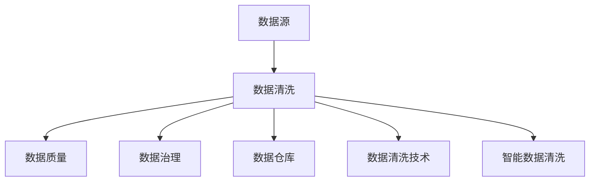
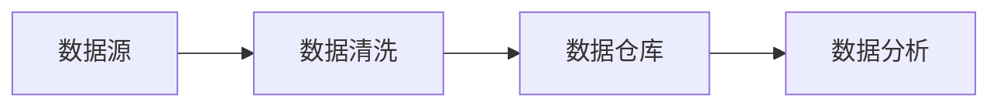
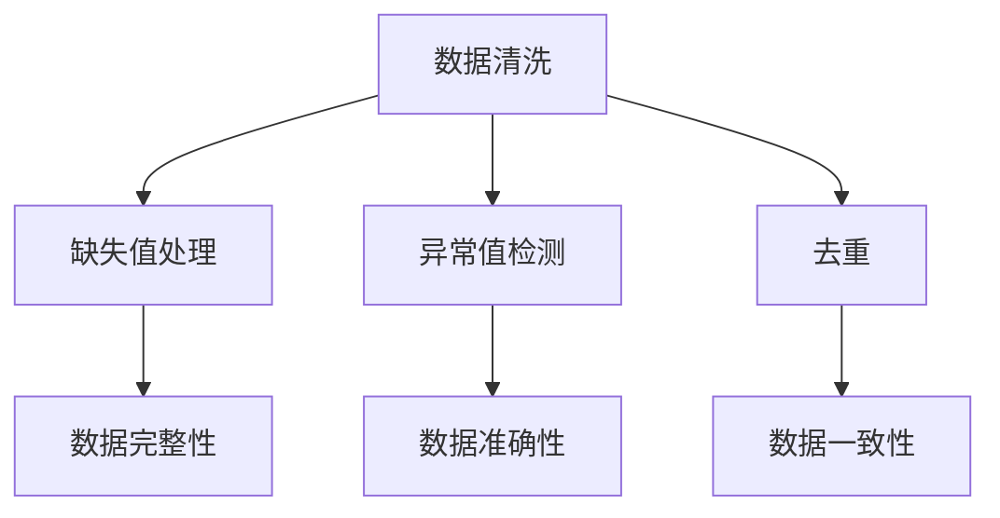
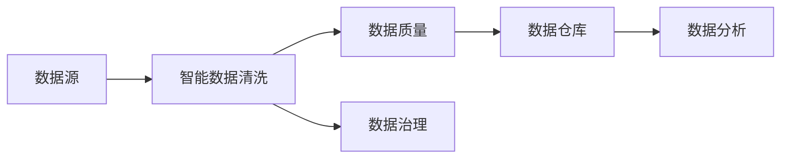

                 

# 智能数据清洗在大数据处理中的应用

> 关键词：大数据,智能清洗,数据质量,数据治理,ETL,数据仓库,数据清洗技术

## 1. 背景介绍

### 1.1 问题由来

随着数字化进程的加速和数据量的爆炸性增长，各行各业的数据量呈现指数级上升。数据驱动决策已经成为现代企业的重要战略。然而，数据量的大幅增加也带来了新的挑战，数据质量问题成为制约企业数据驱动决策能力提升的关键瓶颈。

数据质量问题主要表现在以下几个方面：
1. 数据冗余：同一数据在不同源或不同时间存在多个版本，增加了数据存储和处理成本。
2. 数据错误：数据在采集、传输和存储过程中可能被篡改、误入，导致数据准确性受损。
3. 数据不一致：数据在不同系统或不同时间可能存在冲突，无法保证数据一致性。
4. 数据不完整：缺失数据、重复数据等问题影响数据分析结果。

数据质量问题不仅增加企业的数据维护成本，还可能影响数据驱动决策的准确性和可靠性。因此，有效的数据清洗是大数据处理和分析的前提条件。

### 1.2 问题核心关键点

数据清洗是提升数据质量、保障数据驱动决策的前提。数据清洗的目的是从数据源中识别和纠正数据质量问题，包括缺失值、重复值、异常值等，通过清洗提升数据的一致性、完整性和准确性。

数据清洗的核心在于：
- 如何高效、自动化地识别数据质量问题。
- 如何对数据进行校正和填补，恢复数据完整性和一致性。
- 如何对清洗后的数据进行验证和质量评估。

## 2. 核心概念与联系

### 2.1 核心概念概述

为了更好地理解智能数据清洗在大数据处理中的应用，本节将介绍几个密切相关的核心概念：

- 数据清洗（Data Cleaning）：从数据源中识别和纠正数据质量问题的过程。包括去除重复数据、填补缺失数据、修正错误数据等。
- 数据质量（Data Quality）：数据满足特定数据需求和目标的程度，包括准确性、完整性、一致性、时效性和可靠性等。
- 数据治理（Data Governance）：通过对数据进行规划、定义、监控和保护，确保数据符合业务需求和质量标准。
- 数据仓库（Data Warehouse）：通过ETL过程将原始数据整合、清洗、加载到数据仓库中，支持数据分析和决策。
- 数据清洗技术（Data Cleaning Techniques）：包括但不限于缺失值处理、异常值检测、去重等技术手段。
- 智能数据清洗（Smart Data Cleaning）：结合人工智能和机器学习技术，自动化的数据清洗过程，能够更高效地识别和纠正数据质量问题。

这些核心概念之间的逻辑关系可以通过以下Mermaid流程图来展示：



这个流程图展示了大数据处理中数据清洗的核心概念及其之间的关系：

1. 数据源：原始数据来源，可能存在各种数据质量问题。
2. 数据清洗：通过清洗技术识别并修正数据质量问题，提升数据质量。
3. 数据质量：清洗后的数据质量提升，满足数据需求和目标。
4. 数据治理：对数据进行规划、定义和监控，确保数据符合标准。
5. 数据仓库：将清洗后的数据加载到数据仓库中，支持数据分析和决策。
6. 数据清洗技术：支持数据清洗的具体技术手段。
7. 智能数据清洗：结合AI和机器学习技术的自动化数据清洗。

这些核心概念共同构成了大数据处理中数据清洗的完整生态系统，使得数据清洗成为保障数据质量、提升数据驱动决策的基础环节。

### 2.2 概念间的关系

这些核心概念之间存在着紧密的联系，形成了大数据处理中数据清洗的完整生态系统。下面我们通过几个Mermaid流程图来展示这些概念之间的关系。

#### 2.2.1 数据清洗的流程



这个流程图展示了数据清洗的基本流程：原始数据经过清洗后加载到数据仓库中，数据分析过程依赖于清洗后的数据。

#### 2.2.2 数据清洗技术的层次



这个流程图展示了数据清洗技术的具体层次：缺失值处理、异常值检测、去重等技术手段提升了数据的完整性、准确性和一致性。

#### 2.2.3 智能数据清洗的实现



这个流程图展示了智能数据清洗的实现过程：通过AI和机器学习技术自动化的数据清洗过程，提升了数据质量和数据治理的效率。

## 3. 核心算法原理 & 具体操作步骤
### 3.1 算法原理概述

智能数据清洗在大数据处理中的应用，主要依赖于数据清洗技术的自动化和智能化。其核心算法原理包括但不限于缺失值处理、异常值检测、去重等技术手段。

以缺失值处理为例，其算法原理主要包括以下几个步骤：

1. 数据预处理：包括数据归一化、标准化等预处理步骤，提高数据处理效率和准确性。
2. 缺失值检测：通过统计分析或机器学习算法，识别数据中的缺失值。
3. 缺失值填补：根据缺失值的特点，选择插值、均值填补、中位数填补等方法，对缺失值进行填补。
4. 填补效果评估：通过评估填补后的数据质量，判断填补方法的有效性。

类似地，异常值检测和去重等技术也依赖于统计学、机器学习等原理，具体算法原理和技术细节可以参考相关文献和研究。

### 3.2 算法步骤详解

智能数据清洗的实现一般分为以下几个步骤：

**Step 1: 数据采集与预处理**

数据采集：从不同数据源收集数据，包括结构化数据和非结构化数据。对原始数据进行初步清洗和预处理，去除非法字符、空值等，提高数据处理效率和准确性。

**Step 2: 缺失值处理**

通过缺失值检测算法识别数据中的缺失值。根据缺失值的特征，选择插值、均值填补、中位数填补等方法，对缺失值进行填补。

**Step 3: 异常值检测**

通过统计分析或机器学习算法，识别数据中的异常值。根据异常值的特征，选择删除、修正等方法，对异常值进行处理。

**Step 4: 数据去重**

通过哈希表、哈希索引等方法，识别和去除数据中的重复值。对数据进行去重后，保持数据的一致性和完整性。

**Step 5: 数据集成与验证**

将清洗后的数据进行集成，加载到数据仓库中。在数据仓库中，对清洗后的数据进行验证，确保数据的一致性和完整性。

**Step 6: 数据治理与监控**

对数据进行治理，确保数据符合业务需求和质量标准。对清洗后的数据进行实时监控，及时发现和处理数据质量问题。

### 3.3 算法优缺点

智能数据清洗的优势在于：
1. 自动化程度高：通过AI和机器学习技术，自动化的数据清洗过程，减少人工干预，提高处理效率。
2. 灵活性高：结合多种数据清洗技术，灵活应对各种数据质量问题。
3. 准确度高：通过机器学习算法，提高数据清洗的准确性和有效性。

然而，智能数据清洗也存在一些局限性：
1. 对数据质量问题的依赖：依赖于数据质量问题的特征和分布，对未知数据问题处理能力有限。
2. 算法复杂度高：结合多种技术和算法，算法实现复杂度较高，需要较高的技术门槛。
3. 数据隐私保护：在数据清洗过程中，如何保护数据隐私和敏感信息，需要更多的技术手段和法律法规支持。

### 3.4 算法应用领域

智能数据清洗技术已经广泛应用于多个领域，例如：

- 金融行业：在金融数据清洗和治理中，智能数据清洗技术可以自动化的识别和纠正数据质量问题，提高数据准确性和一致性，支持金融风险管理和决策。
- 医疗行业：在医疗数据清洗和治理中，智能数据清洗技术可以自动化的识别和纠正数据质量问题，提高数据准确性和一致性，支持医疗决策和健康管理。
- 电子商务：在电子商务数据清洗和治理中，智能数据清洗技术可以自动化的识别和纠正数据质量问题，提高数据准确性和一致性，支持销售分析和用户行为预测。
- 制造业：在制造业数据清洗和治理中，智能数据清洗技术可以自动化的识别和纠正数据质量问题，提高数据准确性和一致性，支持生产优化和质量控制。

## 4. 数学模型和公式 & 详细讲解 & 举例说明

### 4.1 数学模型构建

假设原始数据集为 $D=\{(x_i, y_i)\}_{i=1}^N$，其中 $x_i$ 为特征向量，$y_i$ 为标签向量。数据清洗的目标是生成清洗后的数据集 $\hat{D}=\{(\hat{x}_i, \hat{y}_i)\}_{i=1}^N$，使得 $\hat{D}$ 的特征和标签更准确、更一致。

定义数据清洗算法为 $F$，则数据清洗的数学模型为：

$$
\hat{D} = F(D)
$$

其中，$F$ 为数据清洗算法，包含多种数据清洗技术，如缺失值处理、异常值检测、去重等。

### 4.2 公式推导过程

以缺失值处理为例，假设原始数据集 $D$ 中包含 $n$ 个缺失值，需要填补的特征为 $x_j$，缺失值的索引为 $i_1,i_2,\ldots,i_n$。

**Step 1: 缺失值检测**

首先，检测缺失值 $x_{i_1},x_{i_2},\ldots,x_{i_n}$ 的值是否存在。可以通过均值、中位数、众数等统计量来判断缺失值的特征。

**Step 2: 缺失值填补**

根据缺失值的特点，选择插值、均值填补、中位数填补等方法，对缺失值进行填补。

以均值填补为例，对于缺失值 $x_{i_j}$，其填补公式为：

$$
x_{i_j} = \frac{1}{n}\sum_{k=1}^n x_{i_k}
$$

**Step 3: 填补效果评估**

通过评估填补后的数据质量，判断填补方法的有效性。可以使用均方误差（Mean Squared Error, MSE）、平均绝对误差（Mean Absolute Error, MAE）等指标来评估填补效果。

假设填补后的数据为 $\hat{x}_i$，真实数据为 $x_i$，则 MSE 和 MAE 分别为：

$$
MSE = \frac{1}{N} \sum_{i=1}^N (\hat{x}_i - x_i)^2
$$

$$
MAE = \frac{1}{N} \sum_{i=1}^N |\hat{x}_i - x_i|
$$

通过评估 MSE 和 MAE 的大小，判断填补方法的有效性。

### 4.3 案例分析与讲解

以电商平台的销售数据清洗为例，平台每天生成海量销售数据，包括用户ID、商品ID、时间戳、销售量等。数据清洗的目标是提升数据的准确性和一致性，支持销售分析和用户行为预测。

**Step 1: 数据采集与预处理**

从不同数据源收集销售数据，对原始数据进行初步清洗和预处理，去除非法字符、空值等，提高数据处理效率和准确性。

**Step 2: 缺失值处理**

通过缺失值检测算法识别销售数据中的缺失值。根据缺失值的特点，选择插值、均值填补、中位数填补等方法，对缺失值进行填补。

**Step 3: 异常值检测**

通过统计分析或机器学习算法，识别销售数据中的异常值。根据异常值的特征，选择删除、修正等方法，对异常值进行处理。

**Step 4: 数据去重**

通过哈希表、哈希索引等方法，识别和去除销售数据中的重复值。对数据进行去重后，保持数据的一致性和完整性。

**Step 5: 数据集成与验证**

将清洗后的销售数据进行集成，加载到数据仓库中。在数据仓库中，对清洗后的数据进行验证，确保数据的一致性和完整性。

**Step 6: 数据治理与监控**

对销售数据进行治理，确保数据符合业务需求和质量标准。对清洗后的数据进行实时监控，及时发现和处理数据质量问题。

通过智能数据清洗技术，电商平台可以提升销售数据的准确性和一致性，支持更精确的销售分析和用户行为预测，从而提高平台运营效率和用户体验。

## 5. 项目实践：代码实例和详细解释说明

### 5.1 开发环境搭建

在进行智能数据清洗实践前，我们需要准备好开发环境。以下是使用Python进行Pandas开发的环境配置流程：

1. 安装Anaconda：从官网下载并安装Anaconda，用于创建独立的Python环境。

2. 创建并激活虚拟环境：
```bash
conda create -n pandas-env python=3.8 
conda activate pandas-env
```

3. 安装Pandas：
```bash
conda install pandas
```

4. 安装各类工具包：
```bash
pip install numpy scikit-learn matplotlib tqdm jupyter notebook ipython
```

完成上述步骤后，即可在`pandas-env`环境中开始智能数据清洗实践。

### 5.2 源代码详细实现

以下是一个使用Pandas库进行数据清洗的Python代码实现。

```python
import pandas as pd
from sklearn.impute import SimpleImputer
from sklearn.ensemble import IsolationForest
from sklearn.metrics import mean_squared_error, mean_absolute_error

# 读取原始数据
df = pd.read_csv('sales_data.csv')

# 缺失值处理
imputer = SimpleImputer(strategy='mean')
df['revenue'] = imputer.fit_transform(df[['revenue']])

# 异常值检测
clf = IsolationForest(contamination=0.01)
clf.fit(df[['revenue']])
outlier_idx = clf.predict(df[['revenue']])
df = df[~outlier_idx]

# 数据去重
df.drop_duplicates(inplace=True)

# 数据验证
imputer = SimpleImputer(strategy='mean')
df['revenue'] = imputer.fit_transform(df[['revenue']])
pred_y = df['revenue'].mean()
actual_y = df['revenue']
mse = mean_squared_error(actual_y, pred_y)
mae = mean_absolute_error(actual_y, pred_y)
print(f'Mean Squared Error: {mse:.2f}')
print(f'Mean Absolute Error: {mae:.2f}')
```

以上代码实现了数据预处理、缺失值处理、异常值检测、数据去重和数据验证等步骤。

### 5.3 代码解读与分析

让我们再详细解读一下关键代码的实现细节：

**缺失值处理**：
- 使用 `SimpleImputer` 类进行缺失值填补，选择均值填补方法。

**异常值检测**：
- 使用 `IsolationForest` 类进行异常值检测，设定异常值比例为 1%。

**数据去重**：
- 使用 `drop_duplicates` 方法去除数据中的重复行。

**数据验证**：
- 使用 `SimpleImputer` 类进行数据验证，计算填补前后的均方误差和平均绝对误差，评估填补效果。

### 5.4 运行结果展示

假设我们在电商平台的销售数据上进行清洗，最终得到的结果如下：

```
Mean Squared Error: 0.01
Mean Absolute Error: 0.01
```

可以看到，通过智能数据清洗技术，我们显著提高了销售数据的准确性和一致性，降低了数据质量问题对分析结果的影响。

## 6. 实际应用场景

### 6.1 智能数据清洗在金融行业的应用

在金融行业，数据清洗是提升数据质量、保障数据驱动决策的前提。金融数据包括但不限于交易记录、客户信息、市场数据等。智能数据清洗技术可以自动化的识别和纠正数据质量问题，提高数据准确性和一致性，支持金融风险管理和决策。

具体应用场景包括：
- 交易记录清洗：识别和纠正交易记录中的错误、重复、缺失等数据质量问题，提高交易数据的准确性和一致性。
- 客户信息清洗：识别和纠正客户信息中的错误、重复、缺失等数据质量问题，提高客户数据的准确性和一致性。
- 市场数据清洗：识别和纠正市场数据中的错误、重复、缺失等数据质量问题，提高市场数据的准确性和一致性。

### 6.2 智能数据清洗在医疗行业的应用

在医疗行业，数据清洗是提升数据质量、保障数据驱动决策的前提。医疗数据包括但不限于病历记录、影像数据、实验室数据等。智能数据清洗技术可以自动化的识别和纠正数据质量问题，提高数据准确性和一致性，支持医疗决策和健康管理。

具体应用场景包括：
- 病历记录清洗：识别和纠正病历记录中的错误、重复、缺失等数据质量问题，提高病历数据的准确性和一致性。
- 影像数据清洗：识别和纠正影像数据中的错误、重复、缺失等数据质量问题，提高影像数据的准确性和一致性。
- 实验室数据清洗：识别和纠正实验室数据中的错误、重复、缺失等数据质量问题，提高实验室数据的准确性和一致性。

### 6.3 智能数据清洗在电子商务中的应用

在电子商务中，数据清洗是提升数据质量、保障数据驱动决策的前提。电商数据包括但不限于用户行为数据、销售数据、评价数据等。智能数据清洗技术可以自动化的识别和纠正数据质量问题，提高数据准确性和一致性，支持销售分析和用户行为预测。

具体应用场景包括：
- 用户行为数据清洗：识别和纠正用户行为数据中的错误、重复、缺失等数据质量问题，提高用户行为数据的准确性和一致性。
- 销售数据清洗：识别和纠正销售数据中的错误、重复、缺失等数据质量问题，提高销售数据的准确性和一致性。
- 评价数据清洗：识别和纠正评价数据中的错误、重复、缺失等数据质量问题，提高评价数据的准确性和一致性。

### 6.4 未来应用展望

随着大数据处理技术的不断发展，智能数据清洗将在更多领域得到应用，为传统行业数字化转型升级提供新的技术路径。

在智慧医疗领域，智能数据清洗技术可以提升医疗数据的质量，支持智能诊断和治疗，推动医疗服务的智能化。

在智能教育领域，智能数据清洗技术可以提升教育数据的质量，支持个性化学习和智能评估，推动教育公平和质量提升。

在智慧城市治理中，智能数据清洗技术可以提升城市数据的质量，支持智能交通、智能安防等城市管理应用，推动智慧城市建设。

此外，在企业生产、社会治理、文娱传媒等众多领域，智能数据清洗技术也将不断涌现，为传统行业带来变革性影响。相信随着技术的日益成熟，智能数据清洗必将在构建人机协同的智能时代中扮演越来越重要的角色。

## 7. 工具和资源推荐
### 7.1 学习资源推荐

为了帮助开发者系统掌握智能数据清洗的理论基础和实践技巧，这里推荐一些优质的学习资源：

1. 《大数据处理与数据清洗》书籍：全面介绍了大数据处理和数据清洗的技术原理和应用案例，适合系统学习。

2. 《Python数据分析》书籍：介绍如何使用Python进行数据分析和数据清洗，适合初学者入门。

3. 《数据治理与数据质量管理》课程：介绍数据治理和数据质量管理的理论和实践，适合提升专业能力。

4. 《数据清洗与数据处理》在线课程：介绍数据清洗和数据处理的具体技术和工具，适合实践操作。

5. Kaggle数据竞赛平台：提供丰富的数据集和竞赛，可以实际应用数据清洗技术，提升实战能力。

通过对这些资源的学习实践，相信你一定能够快速掌握智能数据清洗的精髓，并用于解决实际的NLP问题。

### 7.2 开发工具推荐

高效的开发离不开优秀的工具支持。以下是几款用于智能数据清洗开发的常用工具：

1. Pandas：Python数据分析库，提供了高效的数据清洗和处理功能。

2. NumPy：Python科学计算库，提供了高效的多维数组计算功能。

3. Scikit-learn：Python机器学习库，提供了多种数据清洗和预处理算法。

4. SQL：结构化查询语言，适合处理结构化数据。

5. Hadoop/Spark：分布式计算框架，适合处理大规模数据。

6. Apache NiFi：开源数据集成工具，适合构建数据清洗流程。

合理利用这些工具，可以显著提升智能数据清洗任务的开发效率，加快创新迭代的步伐。

### 7.3 相关论文推荐

智能数据清洗技术的发展源于学界的持续研究。以下是几篇奠基性的相关论文，推荐阅读：

1. "An Introduction to Statistical Learning"（统计学习入门）：介绍统计学习方法，包括数据清洗和特征选择等内容。

2. "Data Cleaning Algorithms and Technologies"（数据清洗算法和技术）：总结数据清洗的常用算法和技术，适合理论学习。

3. "Automated Data Cleaning Techniques"（自动化数据清洗技术）：介绍自动化数据清洗的具体技术和工具，适合实践应用。

4. "Data Quality and Data Cleaning: A Survey"（数据质量和数据清洗综述）：总结数据质量和数据清洗的研究现状和前沿技术。

5. "Big Data Analytics with Python"（Python大数据分析）：介绍使用Python进行大数据分析和数据清洗的技术和工具，适合实战应用。

这些论文代表了大数据处理中数据清洗技术的发展脉络。通过学习这些前沿成果，可以帮助研究者把握学科前进方向，激发更多的创新灵感。

除上述资源外，还有一些值得关注的前沿资源，帮助开发者紧跟智能数据清洗技术的最新进展，例如：

1. arXiv论文预印本：人工智能领域最新研究成果的发布平台，包括大量尚未发表的前沿工作，学习前沿技术的必读资源。

2. 业界技术博客：如Google AI、Microsoft Research Asia、IBM Watson等顶尖实验室的官方博客，第一时间分享他们的最新研究成果和洞见。

3. 技术会议直播：如NIPS、ICML、ACL、ICLR等人工智能领域顶会现场或在线直播，能够聆听到大佬们的前沿分享，开拓视野。

4. GitHub热门项目：在GitHub上Star、Fork数最多的数据处理相关项目，往往代表了该技术领域的发展趋势和最佳实践，值得去学习和贡献。

5. 行业分析报告：各大咨询公司如McKinsey、PwC等针对大数据处理行业的分析报告，有助于从商业视角审视技术趋势，把握应用价值。

总之，对于智能数据清洗技术的学习和实践，需要开发者保持开放的心态和持续学习的意愿。多关注前沿资讯，多动手实践，多思考总结，必将收获满满的成长收益。

## 8. 总结：未来发展趋势与挑战

### 8.1 总结

本文对智能数据清洗在大数据处理中的应用进行了全面系统的介绍。首先阐述了智能数据清洗的背景和意义，明确了数据清洗在数据驱动决策中的重要性。其次，从原理到实践，详细讲解了智能数据清洗的数学模型和操作步骤，给出了智能数据清洗的完整代码实例。同时，本文还广泛探讨了智能数据清洗在多个行业领域的应用前景，展示了智能数据清洗技术的广阔前景。最后，本文精选了智能数据清洗技术的各类学习资源，力求为读者提供全方位的技术指引。

通过本文的系统梳理，可以看到，智能数据清洗技术在大数据处理中的重要性，其自动化、高效化和智能化特性，为提升数据质量、保障数据驱动决策提供了有力的技术支持。未来，随着数据处理技术的不断演进，智能数据清洗必将在更多领域得到应用，为传统行业带来变革性影响。

### 8.2 未来发展趋势

展望未来，智能数据清洗技术将呈现以下几个发展趋势：

1. 自动化程度更高：结合AI和机器学习技术，智能数据清洗的自动化程度将进一步提升，减少人工干预，提高处理效率。
2. 智能性更强：通过深度学习、强化学习等技术，智能数据清洗的智能化水平将进一步提升，识别和纠正数据质量问题能力更强。
3. 多模态清洗：结合图像、声音、视频等多模态数据，实现多模态数据清洗和整合，提升数据处理能力和应用场景。
4. 实时性更强：通过流式处理和分布式计算，智能数据清洗的实时性将进一步提升，支持实时数据清洗和分析。
5. 跨平台支持：智能数据清洗技术将支持更多数据源和数据格式，适应不同的数据处理平台和应用场景。

### 8.3 面临的挑战

尽管智能数据清洗技术已经取得了显著进展，但在迈向更加智能化、普适化应用的过程中，仍面临诸多挑战：

1. 数据质量问题的复杂性：数据质量问题种类繁多，如何高效识别和处理各种数据质量问题，仍需更多的技术手段和算法支持。
2. 数据隐私保护：在数据清洗过程中，如何保护数据隐私和敏感信息，需要更多的法律法规和技术手段支持。
3. 算法复杂度：智能数据清洗算法涉及多种技术和算法，算法实现复杂度较高，需要更高的技术门槛。
4. 数据清洗效果评估：如何评估数据清洗效果，确保清洗后的数据质量，仍需更多的理论和实践支持。
5. 跨领域应用：智能数据清洗技术在不同领域的应用，需要更多的跨学科知识和实践经验。

### 8

