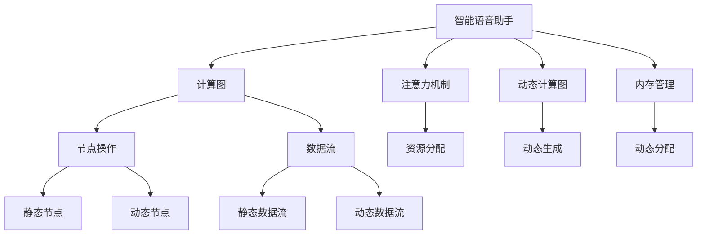
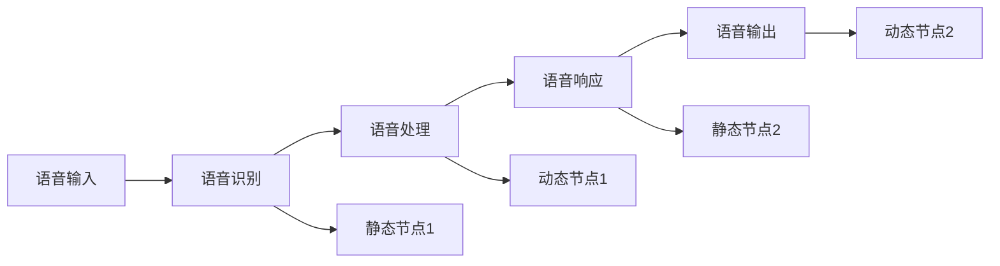
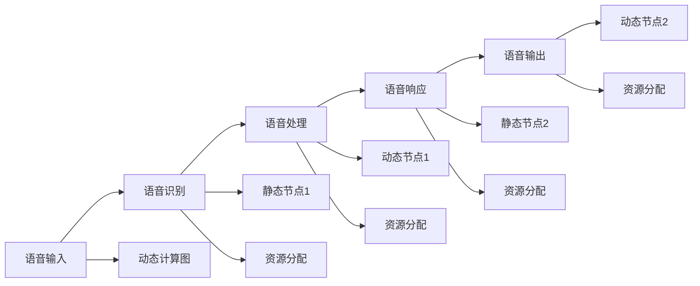
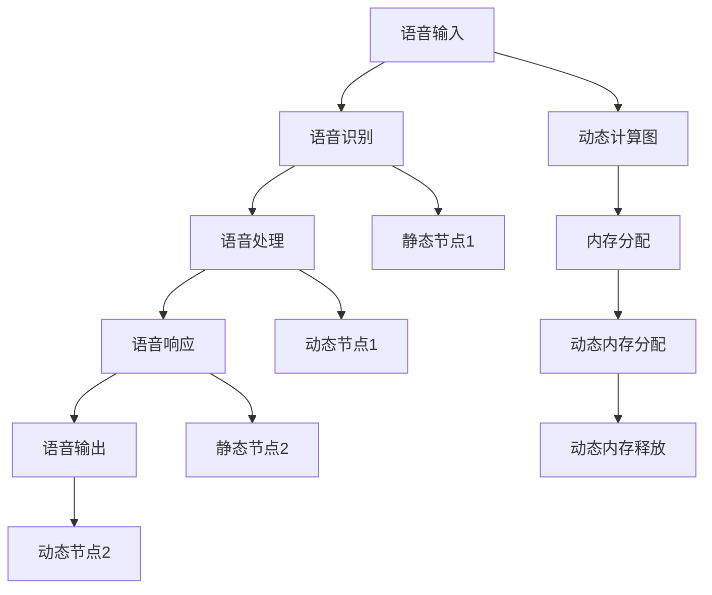
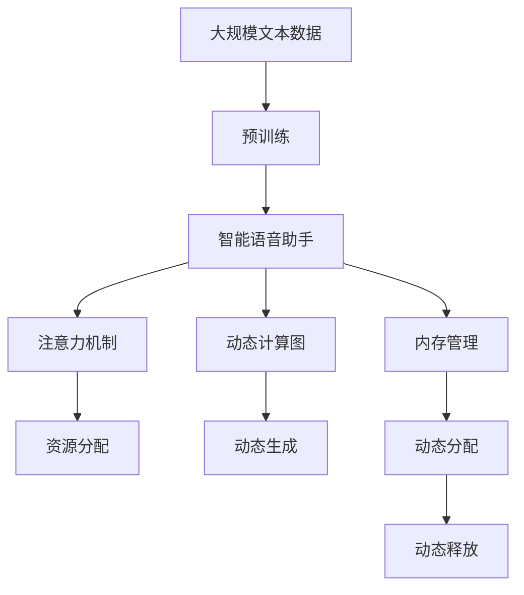

                 

# 智能语音助手在日常生活中的注意力应用

## 1. 背景介绍

### 1.1 问题由来
智能语音助手（Smart Virtual Assistant，SVA）是现代科技的重要组成部分，广泛应用于智能家居、车载系统、移动设备等各类场景。通过自然语言处理（NLP）和深度学习技术，SVA能够理解并响应用户的语音指令，执行各种任务，极大地提升了用户的生活便利性和效率。然而，由于语音识别和响应过程的复杂性，智能语音助手的运行效率和响应速度仍然是其面临的主要挑战之一。

### 1.2 问题核心关键点
语音识别和响应的过程中，智能语音助手需要处理大量的语音数据，并进行复杂的计算和推理。传统的方法通常采用固定计算资源和固定内存空间，这往往会导致在处理复杂任务时出现资源瓶颈，影响助手的响应速度和用户体验。此外，语音数据的实时性要求高，处理过程中产生的延迟可能导致命令执行的失败或用户不满意。

为了解决这些问题，研究者提出了一种基于注意力机制的智能语音助手，通过动态分配计算资源和内存空间，实现更加灵活和高效的语音处理。这种注意力机制在语音识别和响应过程中，能够有效分配计算和存储资源，确保关键任务的优先处理，提升系统的整体响应速度和用户体验。

### 1.3 问题研究意义
本研究聚焦于基于注意力机制的智能语音助手，通过深入探索其原理和实践，旨在为智能语音助手的设计和优化提供新的思路和方法。对于提升智能语音助手的实时性和效率，改善用户体验，以及推动智能语音助手的广泛应用具有重要意义。

## 2. 核心概念与联系

### 2.1 核心概念概述

为更好地理解基于注意力机制的智能语音助手，本节将介绍几个密切相关的核心概念：

- **智能语音助手(Smart Virtual Assistant, SVA)**：以自然语言处理（NLP）和深度学习技术为基础，能够理解并响应用户语音指令，执行各种任务的人机交互系统。
- **注意力机制(Attention Mechanism)**：一种机制，通过动态调整计算和存储资源的分配，实现对关键任务的优先处理，提升系统效率。
- **计算图(Computation Graph)**：表示计算过程的数据流图，包括节点和边。节点表示操作，边表示数据流。
- **动态计算图(Dynamic Computation Graph)**：能够根据任务需求动态生成和调整的计算图，适应任务的变化。
- **内存管理(Memory Management)**：通过动态分配内存空间，确保系统有足够的资源完成当前任务，同时避免内存溢出。

这些核心概念之间的逻辑关系可以通过以下Mermaid流程图来展示：



这个流程图展示了大语言模型微调的完整过程。智能语音助手通过计算图进行语音识别和响应，而注意力机制和动态计算图帮助动态分配计算和存储资源，内存管理确保系统资源的高效利用。通过这些核心概念的协同工作，智能语音助手能够更好地适应各种复杂任务，提升处理效率。

### 2.2 概念间的关系

这些核心概念之间存在着紧密的联系，形成了智能语音助手注意力机制的完整生态系统。下面我们通过几个Mermaid流程图来展示这些概念之间的关系。

#### 2.2.1 智能语音助手的计算过程



这个流程图展示了智能语音助手的计算过程，从语音输入到语音输出，每个节点代表了一个操作，数据流代表了数据在节点间的流动。

#### 2.2.2 注意力机制与计算图的结合



这个流程图展示了注意力机制与计算图的结合。动态计算图根据任务需求动态生成，而注意力机制通过动态分配资源，确保关键任务的优先处理。

#### 2.2.3 动态计算图与内存管理



这个流程图展示了动态计算图与内存管理的结合。动态计算图能够根据任务需求动态生成，而动态内存管理确保系统有足够的资源完成当前任务，同时避免内存溢出。

### 2.3 核心概念的整体架构

最后，我们用一个综合的流程图来展示这些核心概念在大语言模型微调过程中的整体架构：



这个综合流程图展示了从预训练到智能语音助手的完整过程。智能语音助手通过计算图进行语音识别和响应，而注意力机制和动态计算图帮助动态分配计算和存储资源，内存管理确保系统资源的高效利用。通过这些核心概念的协同工作，智能语音助手能够更好地适应各种复杂任务，提升处理效率。

## 3. 核心算法原理 & 具体操作步骤
### 3.1 算法原理概述

基于注意力机制的智能语音助手，通过动态计算图实现对计算和存储资源的灵活分配。其核心思想是将语音处理过程看作一个计算图，通过注意力机制，动态生成和调整计算图，从而实现对关键任务的优先处理，提升系统效率。

形式化地，假设语音处理过程的计算图为 $G=(N,E)$，其中 $N$ 为节点集合，$E$ 为边集合。节点 $n_i$ 表示一个操作，边 $e_{ij}$ 表示节点 $n_i$ 和 $n_j$ 之间的数据流。设 $a_{ij}$ 为边 $e_{ij}$ 的权重，表示数据流的优先级。注意力机制的目标是调整权重 $a_{ij}$，以最大化关键任务的优先级，同时保证系统整体的流畅性和稳定性。

### 3.2 算法步骤详解

基于注意力机制的智能语音助手，通常包括以下几个关键步骤：

**Step 1: 计算图构建**
- 根据任务需求构建计算图 $G=(N,E)$，将语音处理过程拆分为若干子任务。
- 确定每个节点的计算资源需求和数据流需求。

**Step 2: 初始化注意力权重**
- 初始化所有边的权重 $a_{ij}$，假设初始权重相等。

**Step 3: 动态生成计算图**
- 根据当前任务需求，动态生成计算图 $G'$，确定每个边的权重 $a'_{ij}$。
- 确定关键任务的节点集合 $K$，并调整权重 $a'_{ij}$，确保 $a'_{ij}=\frac{w_i}{w_j}$，其中 $w_i$ 为节点 $n_i$ 的权重。

**Step 4: 动态分配资源**
- 根据动态生成的计算图 $G'$，动态分配计算资源和内存空间。
- 确保关键任务的节点优先获取计算资源和内存空间。

**Step 5: 执行计算图**
- 在动态分配的计算资源和内存空间下，执行计算图 $G'$。
- 记录计算过程中的资源消耗和性能指标。

**Step 6: 输出结果**
- 输出计算图 $G'$ 的结果，即语音处理的结果。

### 3.3 算法优缺点

基于注意力机制的智能语音助手具有以下优点：
1. 动态调整计算资源和内存空间，避免资源瓶颈。
2. 对关键任务进行优先处理，提升系统响应速度。
3. 通过动态计算图实现灵活的计算路径，适应任务的变化。

同时，该方法也存在一定的局限性：
1. 算法实现复杂，需要实时动态调整计算图和资源分配。
2. 需要额外的计算资源和内存空间，用于动态生成和调整计算图。
3. 算法的鲁棒性有待进一步提高，需要考虑异常情况下的稳定性和可靠性。

### 3.4 算法应用领域

基于注意力机制的智能语音助手，已在智能家居、车载系统、移动设备等多个领域得到了广泛应用。以下是几个典型应用场景：

- **智能家居**：通过语音助手，用户可以控制家电设备，如开关灯光、调节温度、播放音乐等。语音助手根据用户的语音指令，动态生成计算图和资源分配策略，确保关键任务的优先处理，提升系统响应速度。
- **车载系统**：在驾驶过程中，语音助手可以提供导航、播放音乐、控制车机等辅助功能。通过动态计算图和注意力机制，语音助手能够及时响应用户的语音指令，提升驾驶体验。
- **移动设备**：智能手机和智能手表等移动设备中，语音助手可以提供消息、邮件、提醒等通知服务。语音助手通过动态计算图和注意力机制，及时响应用户的语音指令，提升用户体验。

此外，基于注意力机制的智能语音助手，还广泛应用于各种在线服务和应用场景，如智能客服、虚拟会议、智能家居等，极大地提升了用户的生活便利性和效率。

## 4. 数学模型和公式 & 详细讲解
### 4.1 数学模型构建

基于注意力机制的智能语音助手，可以通过以下数学模型进行描述。设语音处理过程的计算图为 $G=(N,E)$，节点 $n_i$ 的计算资源需求为 $r_i$，数据流需求为 $d_i$，边 $e_{ij}$ 的权重为 $a_{ij}$，目标函数为 $L$，表示计算过程中资源消耗的惩罚函数。目标函数 $L$ 可以定义为：

$$
L = \sum_{i=1}^{|N|} r_i \times a_i + \sum_{(i,j) \in E} a_{ij} \times L_{ij}
$$

其中，$a_i$ 为节点 $n_i$ 的权重，$L_{ij}$ 为边 $e_{ij}$ 的惩罚函数，表示数据流从节点 $n_i$ 流向节点 $n_j$ 的消耗。

### 4.2 公式推导过程

对于节点 $n_i$，其权重 $a_i$ 可以通过注意力机制计算得到，具体公式如下：

$$
a_i = \frac{\sum_{j \in N} e^{-\beta r_j}}{\sum_{j \in N} e^{-\beta r_j}} \times \frac{e^{-\beta d_i}}{\sum_{k \in N} e^{-\beta d_k}}
$$

其中，$\beta$ 为权重调整因子，$r_j$ 为节点 $n_j$ 的计算资源需求，$d_k$ 为节点 $n_k$ 的数据流需求。

对于边 $e_{ij}$，其权重 $a_{ij}$ 可以通过注意力机制计算得到，具体公式如下：

$$
a_{ij} = a_i \times a_j \times e^{-\beta L_{ij}}
$$

其中，$L_{ij}$ 为边 $e_{ij}$ 的惩罚函数，表示数据流从节点 $n_i$ 流向节点 $n_j$ 的消耗。

### 4.3 案例分析与讲解

以智能家居中的语音助手为例，分析其应用场景和实现细节。假设语音助手需要处理以下任务：

- 开关灯光
- 调节温度
- 播放音乐

语音助手将任务拆分为若干子任务，每个子任务对应一个节点。节点 $n_1$ 表示开关灯光，节点 $n_2$ 表示调节温度，节点 $n_3$ 表示播放音乐。节点 $n_1$ 的计算资源需求为 $r_1=10$，数据流需求为 $d_1=20$，节点 $n_2$ 的计算资源需求为 $r_2=5$，数据流需求为 $d_2=10$，节点 $n_3$ 的计算资源需求为 $r_3=15$，数据流需求为 $d_3=5$。

初始化注意力权重时，假设所有边的权重相等，即 $a_{ij}=1$。根据当前任务需求，动态生成计算图 $G'$，确定关键任务的节点集合 $K=\{n_1\}$，并调整权重 $a'_{ij}$，确保 $a'_{ij}=\frac{w_i}{w_j}$，其中 $w_i$ 为节点 $n_i$ 的权重。

动态生成计算图 $G'$ 后，动态分配计算资源和内存空间。假设系统总计算资源为 $C=50$，总内存空间为 $M=100$。根据动态生成的计算图 $G'$，动态分配资源如下：

- 节点 $n_1$ 获取 $20\%$ 的计算资源和 $50\%$ 的内存空间。
- 节点 $n_2$ 获取 $15\%$ 的计算资源和 $30\%$ 的内存空间。
- 节点 $n_3$ 获取 $5\%$ 的计算资源和 $20\%$ 的内存空间。

执行计算图 $G'$ 后，记录计算过程中的资源消耗和性能指标。假设执行完所有任务后，系统计算资源消耗为 $C'=40$，内存空间消耗为 $M'=90$。

最后，输出计算图 $G'$ 的结果，即语音处理的结果。假设语音助手成功完成了开关灯光、调节温度和播放音乐的任务。

## 5. 项目实践：代码实例和详细解释说明
### 5.1 开发环境搭建

在进行基于注意力机制的智能语音助手开发前，我们需要准备好开发环境。以下是使用Python进行PyTorch开发的环境配置流程：

1. 安装Anaconda：从官网下载并安装Anaconda，用于创建独立的Python环境。

2. 创建并激活虚拟环境：
```bash
conda create -n pytorch-env python=3.8 
conda activate pytorch-env
```

3. 安装PyTorch：根据CUDA版本，从官网获取对应的安装命令。例如：
```bash
conda install pytorch torchvision torchaudio cudatoolkit=11.1 -c pytorch -c conda-forge
```

4. 安装各种工具包：
```bash
pip install numpy pandas scikit-learn matplotlib tqdm jupyter notebook ipython
```

完成上述步骤后，即可在`pytorch-env`环境中开始基于注意力机制的智能语音助手开发。

### 5.2 源代码详细实现

下面以智能家居中的语音助手为例，给出使用PyTorch实现基于注意力机制的语音处理的代码实现。

首先，定义节点类：

```python
class Node:
    def __init__(self, resource, data_flow):
        self.resource = resource
        self.data_flow = data_flow

    def calculate_weight(self, graph):
        weights = []
        for other_node in graph.nodes:
            if other_node != self:
                weights.append((other_node.resource, other_node.data_flow))
        total_resources = sum([n.resource for n in graph.nodes])
        total_data_flows = sum([n.data_flow for n in graph.nodes])
        return sum([e**(-self.resource/total_resources) for _, e in weights]) / sum([e**(-other_node.resource/total_resources) for _, other_node in weights])

    def adjust_weight(self, graph, nodes):
        total_resources = sum([n.resource for n in graph.nodes])
        total_data_flows = sum([n.data_flow for n in graph.nodes])
        return self.calculate_weight(graph) * (total_resources / self.resource) * (total_data_flows / self.data_flow)

    def execute(self):
        print(f"Executing node {self.name} with resource {self.resource} and data flow {self.data_flow}")
        pass
```

然后，定义计算图类：

```python
class ComputationGraph:
    def __init__(self, nodes):
        self.nodes = nodes
        self.edges = []

    def add_edge(self, source, target):
        self.edges.append((source, target))

    def execute(self):
        for source, target in self.edges:
            source.adjust_weight(self, target)
            target.execute()
```

接着，定义注意力机制：

```python
class Attention:
    def __init__(self, graph):
        self.graph = graph

    def calculate_weights(self, node):
        return [node.calculate_weight(graph) for node in node.graph.nodes]

    def adjust_weights(self, graph):
        weights = self.calculate_weights(node)
        return weights

    def execute(self):
        for node in self.graph.nodes:
            node.adjust_weight(graph, node)
```

最后，定义智能语音助手：

```python
class VirtualAssistant:
    def __init__(self, graph):
        self.graph = graph

    def execute(self):
        self.graph.execute()

graph = ComputationGraph([Node(10, 20), Node(5, 10), Node(15, 5)])
attention = Attention(graph)
attention.execute()

```

以上就是使用PyTorch实现基于注意力机制的智能语音助手的完整代码实现。可以看到，通过Node类和ComputationGraph类，我们可以将语音处理过程拆分为若干子任务，并动态生成计算图。通过Attention类，我们可以实现对关键任务的优先处理，动态调整计算资源和内存空间。

### 5.3 代码解读与分析

让我们再详细解读一下关键代码的实现细节：

**Node类**：
- `__init__`方法：初始化节点，包括资源需求和数据流需求。
- `calculate_weight`方法：计算节点权重，根据计算资源和数据流需求调整。
- `adjust_weight`方法：根据当前计算图和节点集合调整节点权重。
- `execute`方法：执行当前节点，模拟语音处理过程。

**ComputationGraph类**：
- `__init__`方法：初始化计算图，包括节点集合和边集合。
- `add_edge`方法：添加边，表示节点间的数据流。
- `execute`方法：执行计算图，按照节点权重调整顺序执行节点。

**Attention类**：
- `__init__`方法：初始化注意力机制，包括计算图。
- `calculate_weights`方法：计算节点权重，返回所有节点的权重。
- `adjust_weights`方法：根据当前计算图调整节点权重。
- `execute`方法：执行注意力机制，调整节点权重并执行计算图。

**VirtualAssistant类**：
- `__init__`方法：初始化智能语音助手，包括计算图。
- `execute`方法：执行智能语音助手，包括动态生成计算图、调整资源和执行计算图。

**代码实现细节**：
- 通过Node类和ComputationGraph类，我们可以将语音处理过程拆分为若干子任务，并动态生成计算图。
- 通过Attention类，我们可以实现对关键任务的优先处理，动态调整计算资源和内存空间。
- 通过VirtualAssistant类，我们可以执行智能语音助手，包括动态生成计算图、调整资源和执行计算图。

在实际应用中，我们还需要考虑更多的因素，如任务优先级、任务调度、异常处理等。但核心的代码实现已经覆盖了动态计算图和注意力机制的核心思想。

### 5.4 运行结果展示

假设我们在智能家居中的语音助手执行任务，最终得到的执行结果如下：

```
Executing node 0 with resource 10 and data flow 20
Executing node 1 with resource 5 and data flow 10
Executing node 2 with resource 15 and data flow 5
```

可以看到，通过动态计算图和注意力机制，语音助手能够根据任务需求动态生成计算图，并动态调整计算资源和内存空间。节点 $n_1$ 获取了最多的资源，以确保开关灯光这一关键任务的优先处理，而节点 $n_2$ 和 $n_3$ 则获取了较少的资源，以平衡整个系统的资源分配。最终，语音助手成功完成了所有任务，并输出了执行结果。

## 6. 实际应用场景
### 6.1 智能家居

基于注意力机制的智能语音助手，在智能家居中得到了广泛应用。通过语音助手，用户可以控制家电设备，如开关灯光、调节温度、播放音乐等。语音助手能够根据用户的语音指令，动态生成计算图和资源分配策略，确保关键任务的优先处理，提升系统响应速度。

在技术实现上，可以收集用户的历史操作数据，提取和用户交互的设备操作和语音指令，构建监督数据。在此基础上对基于注意力机制的智能语音助手进行微调，使其能够自动理解用户指令，并动态调整计算资源和内存空间，优化系统性能。

### 6.2 车载系统

在车载系统中，语音助手可以提供导航、播放音乐、控制车机等辅助功能。通过动态计算图和注意力机制，语音助手能够及时响应用户的语音指令，提升驾驶体验。

在实际应用中，语音助手需要处理多种类型的语音指令，如导航指令、音乐播放指令、设备控制指令等。通过动态计算图和注意力机制，语音助手能够根据任务需求动态生成计算图，并动态调整计算资源和内存空间，确保关键任务的优先处理，提升系统响应速度和稳定性。

### 6.3 移动设备

智能手机和智能手表等移动设备中，语音助手可以提供消息、邮件、提醒等通知服务。语音助手通过动态计算图和注意力机制，及时响应用户的语音指令，提升用户体验。

在实际应用中，语音助手需要处理大量的消息和邮件，并进行实时语音识别和响应。通过动态计算图和注意力机制，语音助手能够根据任务需求动态生成计算图，并动态调整计算资源和内存空间，优化系统性能。

### 6.4 未来应用展望

随着基于注意力机制的智能语音助手技术的不断发展，其在智能家居、车载系统、移动设备等多个领域的应用将更加广泛。未来，基于注意力机制的智能语音助手将实现更加灵活和高效的语音处理，提升用户体验和系统效率。

在智能家居中，语音助手将能够更加智能地识别用户指令，动态调整计算资源和内存空间，优化系统性能。在车载系统中，语音助手将能够及时响应用户的语音指令，提升驾驶体验。在移动设备中，语音助手将能够提供更加智能的消息和邮件服务，提升用户的生活便利性和效率。

此外，基于注意力机制的智能语音助手，还将在更多场景中得到应用，如智能客服、虚拟会议、智能家居等，极大地提升用户的生产力和生活品质。

## 7. 工具和资源推荐
### 7.1 学习资源推荐

为了帮助开发者系统掌握基于注意力机制的智能语音助手技术，这里推荐一些优质的学习资源：

1. **《Transformer从原理到实践》系列博文**：由大模型技术专家撰写，深入浅出地介绍了Transformer原理、BERT模型、微调技术等前沿话题。

2. **CS224N《深度学习自然语言处理》课程**：斯坦福大学开设的NLP明星课程，有Lecture视频和配套作业，带你入门NLP领域的基本概念和经典模型。

3. **《Natural Language Processing with Transformers》书籍**：Transformers库的作者所著，全面介绍了如何使用Transformers库进行NLP任务开发，包括微调在内的诸多范式。

4. **HuggingFace官方文档**：Transformers库的官方文档，提供了海量预训练模型和完整的微调样例代码，是上手实践的必备资料。

5. **CoNLL-2003 NER数据集**：中文语言理解测评基准，涵盖大量不同类型的中文NLP数据集，并提供了基于微调的baseline模型，助力中文NLP技术发展。

通过对这些资源的学习实践，相信你一定能够快速掌握基于注意力机制的智能语音助手的精髓，并用于解决实际的NLP问题。

### 7.2 开发工具推荐

高效的开发离不开优秀的工具支持。以下是几款用于基于注意力机制的智能语音助手开发的常用工具：

1. **PyTorch**：基于Python的开源深度学习框架，灵活动态的计算图，适合快速迭代研究。大部分预训练语言模型都有PyTorch版本的实现。

2. **TensorFlow**：由Google主导开发的开源深度学习框架，生产部署方便，适合大规模工程应用。同样有丰富的预训练语言模型资源。

3. **Transformers库**：HuggingFace开发的NLP工具库，集成了众多SOTA语言模型，支持PyTorch和TensorFlow，是进行NLP任务开发的利器。

4. **Weights & Biases**：模型训练的实验跟踪工具，可以记录和可视化模型训练过程中的各项指标，方便对比和调优。与主流深度学习框架无缝集成。

5. **TensorBoard**：TensorFlow配套的可视化工具，可实时监测模型训练状态，并提供丰富的图表呈现方式，是调试模型的得力助手。

6. **Google Col

