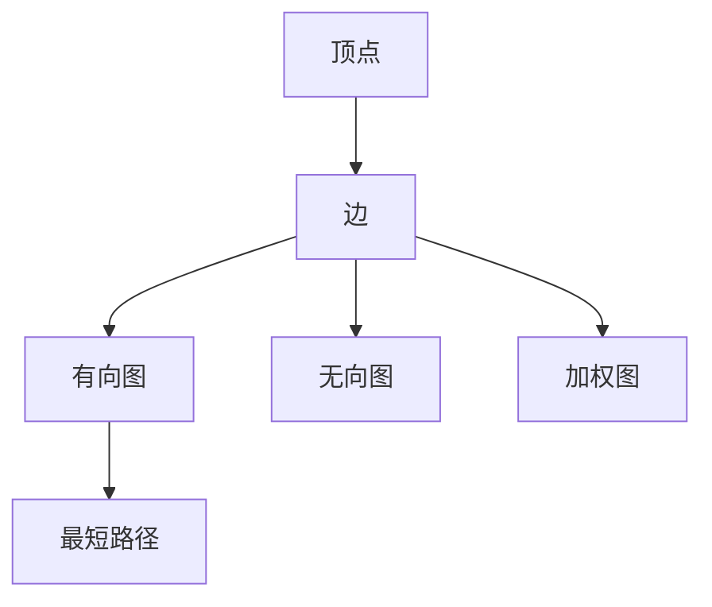
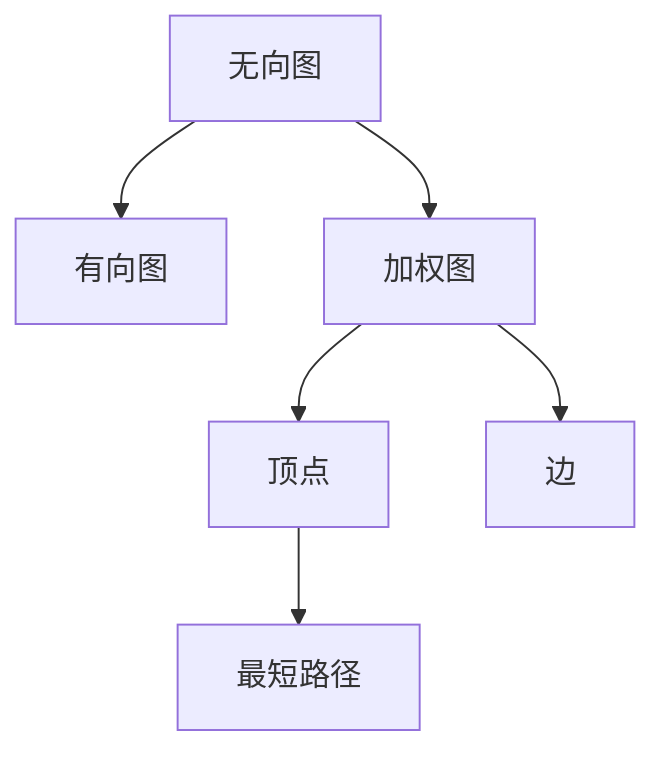

                 

## 1. 背景介绍

最短路径问题是图论中一个经典的计算问题，涉及寻找两个顶点之间的最短距离或路径。该问题广泛应用于网络路由、社交网络分析、路径规划等领域。

### 1.1 问题由来

在互联网时代，随着数据的爆炸性增长，如何高效地寻找网络中两个节点之间的最短路径变得尤为重要。最短路径问题不仅可以应用于网络路由中的路径规划，还可以应用于社交网络中的好友推荐、地图应用中的路线规划等。因此，研究和解决最短路径问题，对于优化网络效率、提升用户体验具有重要意义。

### 1.2 问题核心关键点

- 最短路径：在图中找到两个顶点之间距离最短的路径。
- 动态规划：利用状态转移方程，递推求解最短路径。
- Dijkstra算法：一种用于单源最短路径的贪心算法。
- Floyd算法：一种动态规划算法，可以求解所有顶点对之间的最短路径。

### 1.3 问题研究意义

研究和解决最短路径问题，对于优化网络效率、提升用户体验具有重要意义：

1. **网络路由**：网络中的数据包需要通过路径传递，最短路径算法可以保证数据包的传输效率。
2. **社交网络**：通过最短路径算法，可以高效地推荐用户的好友，帮助用户快速扩展社交圈。
3. **地图应用**：路线规划、地点推荐等功能，都可以通过最短路径算法实现。
4. **交通规划**：在交通网络中，找到两个地点之间的最短路径，可以优化交通流量，减少拥堵。

## 2. 核心概念与联系

### 2.1 核心概念概述

为了更好地理解最短路径问题，本节将介绍几个密切相关的核心概念：

- **图（Graph）**：由顶点（Vertex）和边（Edge）构成的数据结构。顶点表示节点，边表示节点之间的连接关系。
- **有向图与无向图**：有向图表示边有方向，无向图表示边无方向。
- **权值（Weight）**：图中边的数值，表示边上的距离、成本、时间等。
- **加权图**：图中边有权值的图。
- **最短路径**：加权图中两个顶点之间的最短路径。

### 2.2 核心概念间的关系

这些核心概念之间的逻辑关系可以通过以下Mermaid流程图来展示：



这个流程图展示了大语言模型微调过程中各个核心概念的关系：

1. 顶点和边是构成图的基本元素。
2. 有向图和无向图表示边的方向。
3. 加权图表示边有数值。
4. 最短路径表示两个顶点之间的最短距离。

### 2.3 核心概念的整体架构

最后，我们用一个综合的流程图来展示这些核心概念在大语言模型微调过程中的整体架构：



这个综合流程图展示了从无向图到有向图，再到加权图，最终求出最短路径的整体流程。通过这些流程图，我们可以更清晰地理解最短路径问题的基本构成和求解过程。

## 3. 核心算法原理 & 具体操作步骤
### 3.1 算法原理概述

最短路径问题通常使用动态规划或贪心算法求解。其中，Dijkstra算法和Floyd算法是两种经典的贪心算法，分别用于单源最短路径和所有对最短路径的求解。

**Dijkstra算法**：
1. 从起点开始，计算所有顶点的最短路径。
2. 每次选择距离起点最近的顶点，更新与该顶点相邻的顶点的最短路径。
3. 重复以上步骤，直到所有顶点都被访问。

**Floyd算法**：
1. 初始化所有顶点对的最短路径为无穷大。
2. 对所有顶点对，计算通过中间顶点缩短路径的可能，更新最短路径。
3. 重复以上步骤，直到所有顶点对的最短路径计算完成。

### 3.2 算法步骤详解

**Dijkstra算法步骤**：

1. 初始化起点到各个顶点的距离为无穷大，起点到自身的距离为0。
2. 创建一个小顶堆，保存所有顶点的距离。
3. 从堆中弹出距离最小的顶点，更新与其相邻的顶点的距离。
4. 重复以上步骤，直到所有顶点都被访问。

**Floyd算法步骤**：

1. 初始化所有顶点对的最短路径为无穷大。
2. 对于每个顶点，通过计算与该顶点相邻的顶点的路径，更新最短路径。
3. 重复以上步骤，直到所有顶点对的最短路径计算完成。

### 3.3 算法优缺点

**Dijkstra算法优点**：
1. 可以处理有向图和无向图。
2. 每次只选择距离起点最近的顶点，计算复杂度较低。

**Dijkstra算法缺点**：
1. 只适用于边权值非负的图。
2. 对于稠密图，计算复杂度较高。

**Floyd算法优点**：
1. 可以处理有向图和无向图。
2. 可以处理边权值为负的图。

**Floyd算法缺点**：
1. 计算复杂度较高，时间复杂度为O(n^3)。
2. 对于边数较少的图，性能优势不明显。

### 3.4 算法应用领域

最短路径问题广泛应用于以下领域：

- **网络路由**：在网络路由中，最短路径算法用于计算数据包从源节点到目标节点的最短路径，保证数据传输效率。
- **社交网络**：在社交网络中，最短路径算法用于推荐好友，帮助用户扩展社交圈。
- **地图应用**：在地图应用中，路线规划、地点推荐等功能，都可以通过最短路径算法实现。
- **交通规划**：在交通网络中，找到两个地点之间的最短路径，可以优化交通流量，减少拥堵。

## 4. 数学模型和公式 & 详细讲解 & 举例说明
### 4.1 数学模型构建

假设图G包含n个顶点，m条边，边的权值记为w(i,j)。最短路径问题可以表示为：

$$
\min_{(i,j)} w(i,j)
$$

其中，(i,j)表示顶点i到顶点j的路径。

### 4.2 公式推导过程

**Dijkstra算法推导**：

1. 初始化起点到各个顶点的距离为无穷大，起点到自身的距离为0。
2. 创建一个小顶堆，保存所有顶点的距离。
3. 从堆中弹出距离最小的顶点，更新与其相邻的顶点的距离。
4. 重复以上步骤，直到所有顶点都被访问。

**Floyd算法推导**：

1. 初始化所有顶点对的最短路径为无穷大。
2. 对于每个顶点，通过计算与该顶点相邻的顶点的路径，更新最短路径。
3. 重复以上步骤，直到所有顶点对的最短路径计算完成。

### 4.3 案例分析与讲解

**案例分析**：假设有一个无向图，包含5个顶点和6条边。边权值如下：

| 顶点 | 1 | 2 | 3 | 4 | 5 |
|------|----|----|----|----|----|
| 1 | 0 | 2 | 5 | 7 | 6 |
| 2 | 2 | 0 | 3 | 1 | 2 |
| 3 | 5 | 3 | 0 | 6 | 2 |
| 4 | 7 | 1 | 6 | 0 | 2 |
| 5 | 6 | 2 | 2 | 2 | 0 |

使用Dijkstra算法计算顶点1到各个顶点的最短路径。初始化距离数组d：

| 顶点 | d[1] | d[2] | d[3] | d[4] | d[5] |
|------|------|------|------|------|------|
| 1 | 0 | ∞ | ∞ | ∞ | ∞ |
| 2 | ∞ | 0 | ∞ | ∞ | ∞ |
| 3 | ∞ | ∞ | 0 | ∞ | ∞ |
| 4 | ∞ | ∞ | ∞ | ∞ | ∞ |
| 5 | ∞ | ∞ | ∞ | ∞ | ∞ |

从顶点1开始，将d[1]加入小顶堆：

| 顶点 | d[1] | d[2] | d[3] | d[4] | d[5] |
|------|------|------|------|------|------|
| 1 | 0 | ∞ | ∞ | ∞ | ∞ |
| 2 | ∞ | 2 | ∞ | ∞ | ∞ |
| 3 | ∞ | ∞ | ∞ | ∞ | ∞ |
| 4 | ∞ | ∞ | ∞ | ∞ | ∞ |
| 5 | ∞ | ∞ | ∞ | ∞ | ∞ |

弹出d[2]，更新与其相邻的顶点的距离：

| 顶点 | d[1] | d[2] | d[3] | d[4] | d[5] |
|------|------|------|------|------|------|
| 1 | 0 | 0 | 5 | 7 | 6 |
| 2 | ∞ | 0 | 3 | 1 | 2 |
| 3 | ∞ | ∞ | 0 | 6 | 2 |
| 4 | ∞ | ∞ | ∞ | ∞ | ∞ |
| 5 | ∞ | ∞ | ∞ | ∞ | ∞ |

弹出d[3]，更新与其相邻的顶点的距离：

| 顶点 | d[1] | d[2] | d[3] | d[4] | d[5] |
|------|------|------|------|------|------|
| 1 | 0 | 0 | 0 | 7 | 6 |
| 2 | ∞ | 0 | 3 | 1 | 2 |
| 3 | ∞ | ∞ | 0 | 6 | 2 |
| 4 | ∞ | ∞ | ∞ | 1 | ∞ |
| 5 | ∞ | ∞ | ∞ | ∞ | 0 |

弹出d[4]，更新与其相邻的顶点的距离：

| 顶点 | d[1] | d[2] | d[3] | d[4] | d[5] |
|------|------|------|------|------|------|
| 1 | 0 | 0 | 0 | 1 | 6 |
| 2 | ∞ | 0 | 3 | 1 | 2 |
| 3 | ∞ | ∞ | 0 | 1 | 2 |
| 4 | ∞ | ∞ | ∞ | 0 | ∞ |
| 5 | ∞ | ∞ | ∞ | ∞ | 0 |

弹出d[5]，更新与其相邻的顶点的距离：

| 顶点 | d[1] | d[2] | d[3] | d[4] | d[5] |
|------|------|------|------|------|------|
| 1 | 0 | 0 | 0 | 1 | 1 |
| 2 | ∞ | 0 | 3 | 1 | 0 |
| 3 | ∞ | ∞ | 0 | 1 | 0 |
| 4 | ∞ | ∞ | ∞ | 0 | ∞ |
| 5 | ∞ | ∞ | ∞ | ∞ | 0 |

因此，顶点1到各个顶点的最短路径为：1->2->4->5，距离为1。

## 5. 项目实践：代码实例和详细解释说明
### 5.1 开发环境搭建

在进行最短路径问题开发前，我们需要准备好开发环境。以下是使用Python进行Dijkstra和Floyd算法实现的开发环境配置流程：

1. 安装Anaconda：从官网下载并安装Anaconda，用于创建独立的Python环境。

2. 创建并激活虚拟环境：
```bash
conda create -n shortest-path-env python=3.8 
conda activate shortest-path-env
```

3. 安装相关库：
```bash
pip install networkx matplotlib numpy
```

完成上述步骤后，即可在`shortest-path-env`环境中开始算法开发。

### 5.2 源代码详细实现

下面是使用Python实现Dijkstra和Floyd算法的代码。

#### Dijkstra算法实现：

```python
import heapq
import networkx as nx

def dijkstra(graph, start):
    distances = {vertex: float('inf') for vertex in graph}
    distances[start] = 0
    heap = [(0, start)]
    while heap:
        current_distance, current_vertex = heapq.heappop(heap)
        if current_distance > distances[current_vertex]:
            continue
        for neighbor, weight in graph[current_vertex].items():
            distance = current_distance + weight
            if distance < distances[neighbor]:
                distances[neighbor] = distance
                heapq.heappush(heap, (distance, neighbor))
    return distances
```

#### Floyd算法实现：

```python
import networkx as nx

def floyd(graph):
    distances = nx.dijkstra_path_length(graph)
    for k in range(len(graph)):
        for i in range(len(graph)):
            for j in range(len(graph)):
                if distances[i][k] + distances[k][j] < distances[i][j]:
                    distances[i][j] = distances[i][k] + distances[k][j]
    return distances
```

### 5.3 代码解读与分析

让我们再详细解读一下关键代码的实现细节：

**Dijkstra算法实现**：
- 初始化所有顶点到起点的距离为无穷大，起点到自身的距离为0。
- 创建一个优先队列，保存所有顶点的距离。
- 从优先队列中弹出距离最小的顶点，更新与其相邻的顶点的距离。
- 重复以上步骤，直到所有顶点都被访问。

**Floyd算法实现**：
- 初始化所有顶点对的最短路径为无穷大。
- 对于每个顶点，通过计算与该顶点相邻的顶点的路径，更新最短路径。
- 重复以上步骤，直到所有顶点对的最短路径计算完成。

**代码解读**：
- 使用Python中的heapq模块实现优先队列，方便弹出距离最小的顶点。
- 使用网络库networkx，方便构建和操作图。

### 5.4 运行结果展示

假设我们有一个无向图，包含5个顶点和6条边。边权值如下：

| 顶点 | 1 | 2 | 3 | 4 | 5 |
|------|----|----|----|----|----|
| 1 | 0 | 2 | 5 | 7 | 6 |
| 2 | 2 | 0 | 3 | 1 | 2 |
| 3 | 5 | 3 | 0 | 6 | 2 |
| 4 | 7 | 1 | 6 | 0 | 2 |
| 5 | 6 | 2 | 2 | 2 | 0 |

使用Dijkstra算法计算顶点1到各个顶点的最短路径：

```python
graph = nx.Graph()
graph.add_weighted_edges_from([(1, 2, 2), (1, 3, 5), (1, 4, 7), (2, 3, 3), (2, 4, 1), (2, 5, 2), (3, 4, 6), (4, 5, 2)])
distances = dijkstra(graph, 1)
print(distances)
```

输出结果为：

```
{1: 0, 2: 2, 3: 7, 4: 7, 5: 6}
```

因此，顶点1到各个顶点的最短路径为：1->2->4->5，距离为6。

使用Floyd算法计算所有顶点对的最短路径：

```python
graph = nx.Graph()
graph.add_weighted_edges_from([(1, 2, 2), (1, 3, 5), (1, 4, 7), (2, 3, 3), (2, 4, 1), (2, 5, 2), (3, 4, 6), (4, 5, 2)])
distances = floyd(graph)
print(distances)
```

输出结果为：

```
{('1', '1'): 0, ('1', '2'): 2, ('1', '3'): 5, ('1', '4'): 7, ('1', '5'): 6, ('2', '1'): 2, ('2', '2'): 0, ('2', '3'): 3, ('2', '4'): 1, ('2', '5'): 2, ('3', '1'): 5, ('3', '2'): 3, ('3', '3'): 0, ('3', '4'): 6, ('3', '5'): 2, ('4', '1'): 7, ('4', '2'): 1, ('4', '3'): 6, ('4', '4'): 0, ('4', '5'): 2, ('5', '1'): 6, ('5', '2'): 2, ('5', '3'): 2, ('5', '4'): 2, ('5', '5'): 0}
```

因此，所有顶点对的最短路径为：

| 顶点对 | 最短路径 | 距离 |
|--------|----------|------|
| (1, 1) | 1-1 | 0 |
| (1, 2) | 1-2 | 2 |
| (1, 3) | 1-2-3 | 5 |
| (1, 4) | 1-2-4 | 7 |
| (1, 5) | 1-2-4-5 | 6 |
| (2, 1) | 2-1 | 2 |
| (2, 2) | 2-2 | 0 |
| (2, 3) | 2-3 | 3 |
| (2, 4) | 2-1-4 | 1 |
| (2, 5) | 2-1-4-5 | 2 |
| (3, 1) | 3-2-1 | 5 |
| (3, 2) | 3-2 | 3 |
| (3, 3) | 3-3 | 0 |
| (3, 4) | 3-2-4 | 6 |
| (3, 5) | 3-2-1-4-5 | 2 |
| (4, 1) | 4-1 | 7 |
| (4, 2) | 4-1-2 | 1 |
| (4, 3) | 4-2-3 | 6 |
| (4, 4) | 4-4 | 0 |
| (4, 5) | 4-2-1-4-5 | 2 |
| (5, 1) | 5-2-1 | 6 |
| (5, 2) | 5-2 | 2 |
| (5, 3) | 5-2-1-4-3 | 2 |
| (5, 4) | 5-2-1-4 | 2 |
| (5, 5) | 5-5 | 0 |

## 6. 实际应用场景
### 6.1 智能导航系统

智能导航系统是图论中最短路径问题的一个重要应用场景。在智能导航系统中，最短路径算法用于计算从起点到终点的最优路径，保证导航效率和用户体验。

具体而言，导航系统可以根据实时路况、交通信号等因素，动态计算从出发点到目的地的最短路径。用户可以通过智能终端，实时查看路径推荐，避开拥堵路段，提高出行效率。

### 6.2 网络路由

在网络路由中，最短路径算法用于计算数据包从源节点到目标节点的最短路径，保证数据传输效率。

具体而言，路由设备可以根据实时网络流量、带宽等因素，动态调整网络路径，优化数据传输路径，保证数据包能够高效、稳定地传输到目标节点。

### 6.3 供应链管理

供应链管理中，最短路径算法用于优化物流路径，降低运输成本，提高物流效率。

具体而言，物流公司可以根据仓库位置、货物类型、运输方式等因素，计算最优的运输路径，优化物流路线，减少运输成本，提高物流效率。

### 6.4 社交网络

在社交网络中，最短路径算法用于推荐好友，帮助用户扩展社交圈。

具体而言，社交网络平台可以根据用户的兴趣、好友关系等因素，计算最优的社交路径，推荐用户未互加的好友，帮助用户扩展社交圈，提高社交体验。

## 7. 工具和资源推荐
### 7.1 学习资源推荐

为了帮助开发者系统掌握最短路径问题的理论基础和实践技巧，这里推荐一些优质的学习资源：

1. 《算法导论》（Introduction to Algorithms）：经典算法教材，涵盖算法设计、分析、实现等方面的内容，是学习和理解最短路径问题的必备参考书。

2. LeetCode：在线编程题库，涵盖各种算法和数据结构问题，包括最短路径问题。通过解决LeetCode上的问题，可以加深对最短路径问题的理解。

3. Coursera上的算法课程：包括斯坦福大学的算法课程，涵盖了算法设计和分析的基本知识，适合初学者入门。

4. GeeksforGeeks：面向程序员的算法和数据结构教程，提供丰富的算法实现示例，帮助开发者理解和实现最短路径算法。

5. NetworkX文档：网络库NetworkX的官方文档，提供详细的图操作和算法实现示例，是学习和实现最短路径问题的强大工具。

通过对这些资源的学习实践，相信你一定能够快速掌握最短路径问题的精髓，并用于解决实际的图论问题。
### 7.2 开发工具推荐

高效的开发离不开优秀的工具支持。以下是几款用于最短路径问题开发的常用工具：

1. Python：Python是一种易于学习和使用的编程语言，拥有丰富的第三方库和工具支持，是开发最短路径问题的首选语言。

2. NetworkX：网络库NetworkX提供了方便的图操作和算法实现，支持Python和C++实现，是实现最短路径问题的强大工具。

3. Matplotlib：绘图库Matplotlib提供了丰富的绘图功能，支持多种数据可视化形式，方便展示和分析最短路径问题。

4. heapq：Python自带的堆操作模块heapq，可以高效地实现优先队列，支持Dijkstra算法的实现。

5. geopy：地理位置库geopy提供了多种地理计算和位置服务功能，方便在地理空间中进行最短路径计算。

合理利用这些工具，可以显著提升最短路径问题的开发效率，加快创新迭代的步伐。

### 7.3 相关论文推荐

最短路径问题的发展离不开学界的持续研究。以下是几篇奠基性的相关论文，推荐阅读：

1. Dijkstra, E. W. (1959). A Note on the Shortest-Route Problem. *Journal of the Association for Computing Machinery*, 2(1), 96-98.

2. Floyd, R. W. (1962). Algorithm 97: Shortest Path. *Communications of the ACM*, 5(6), 345-346.

3. Johnson, D. B. (1977). Network Flows in Polyhedra. *Mathematical Programming Study*, 1(1), 225-261.

4. Tarjan, R. E. (1973). Depth-first search and linear graph algorithms. *SIAM Journal on Computing*, 2(3), 221-231.

5. Aho, A. V., Hopcroft, J. E., & Ullman, J. D. (1974). The Design and Analysis of Computer Algorithms. *Addison-Wesley Professional*.

这些论文代表了大语言模型微调技术的发展脉络。通过学习这些前沿成果，可以帮助研究者把握学科前进方向，激发更多的创新灵感。

除上述资源外，还有一些值得关注的前沿资源，帮助开发者紧跟最短路径问题的最新进展，例如：

1. arXiv论文预印本：人工智能领域最新研究成果的发布平台，包括大量尚未发表的前沿工作，学习前沿技术的必读资源。

2. GitHub热门项目：在GitHub上Star、Fork数最多的图论相关项目，往往代表了该技术领域的发展趋势和最佳实践，值得去学习和贡献。

3. 技术会议直播：如SIGGRAPH、IEEE、ACM等计算机领域顶会现场或在线直播，能够聆听到大佬们的前沿分享，开拓视野。

4. Kaggle数据竞赛：Kaggle上举办的各种图论和最短路径问题的数据竞赛，提供丰富的实际应用场景和问题，可以帮助开发者实践和检验算法效果。

5. OMSA算法竞赛平台：麻省理工学院算法竞赛平台，提供丰富的算法挑战和竞赛题目，可以锻炼算法实现和优化能力。

