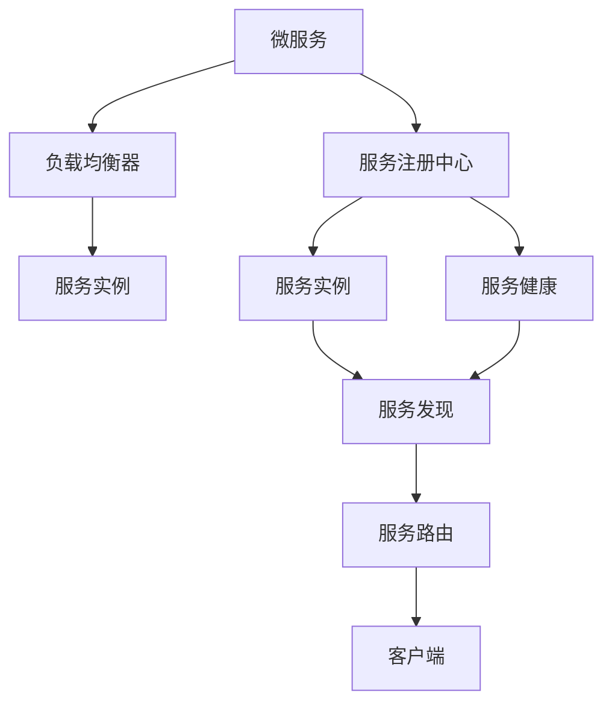
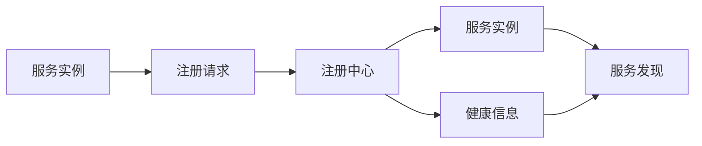
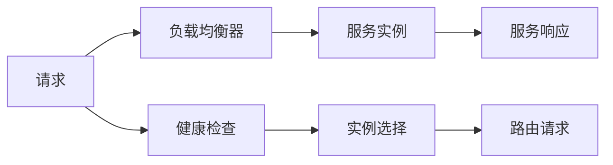
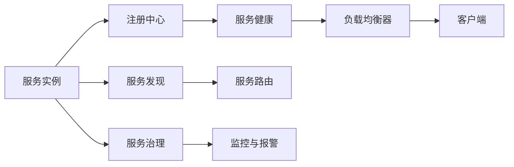
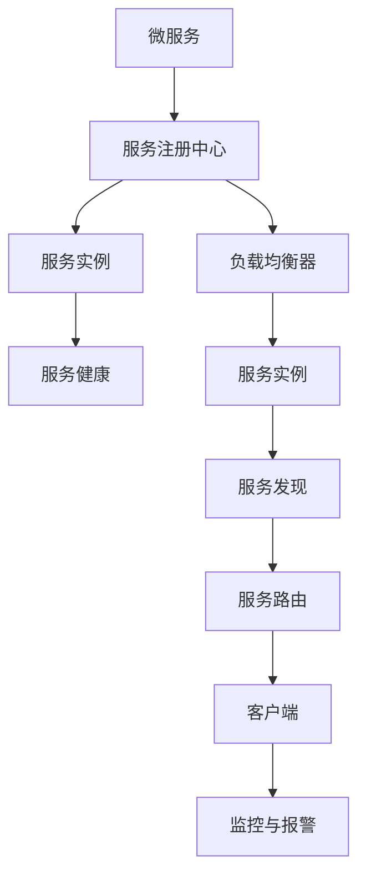

                 

# 服务注册中心与负载均衡器实例

> 关键词：服务注册中心, 负载均衡器, 微服务, 分布式系统, 高可用, 服务发现, 负载均衡, 健康检查

## 1. 背景介绍

在现代分布式系统中，微服务架构已经成为一种主流的应用设计范式。微服务将复杂的应用拆分为多个独立的、松耦合的服务，每个服务负责单一功能，通过轻量级通信机制进行协同。然而，在微服务架构中，服务之间的通信管理和状态同步成为一个复杂问题，服务发现、负载均衡、服务治理等技术需要系统性地解决。服务注册中心（Service Registry）和负载均衡器（Load Balancer）是微服务架构中不可或缺的两大组件，它们协同工作，共同维护系统的高可用性和扩展性。

### 1.1 问题由来

随着微服务架构的普及，服务数量呈指数级增长，传统的单体应用架构下的服务发现和负载均衡机制已无法满足需求。如何高效地管理和调度微服务，确保系统的高可用性、低延迟、高扩展性，成为一个亟待解决的问题。服务注册中心和负载均衡器正是在这种背景下应运而生的关键组件，它们通过协作，实现了微服务系统的无缝集成和高效运行。

### 1.2 问题核心关键点

微服务架构的核心挑战在于服务的解耦和独立部署，这就要求服务注册中心和负载均衡器能够高效、可靠地处理服务实例的管理、路由和负载均衡，保证系统的稳定性和扩展性。具体来说，服务注册中心需要：
- 管理服务的发现和注册
- 维护服务实例的状态
- 提供服务的健康检查
- 实现服务的动态扩展和下线

负载均衡器则需要：
- 分发负载流量
- 维护服务实例的状态
- 提供服务的健康检查
- 实现服务的动态扩展和下线

服务注册中心和负载均衡器通过紧密合作，实现了微服务架构的完整服务生命周期管理，是微服务系统的基石。

### 1.3 问题研究意义

服务注册中心和负载均衡器在微服务架构中的作用至关重要，它们确保了系统的稳定性和可靠性，提升了系统的性能和扩展能力。具体来说，服务注册中心和负载均衡器在以下方面具有重要意义：

1. 服务发现和实例管理：高效管理服务实例的创建、更新和销毁，确保服务的动态扩展和维护。
2. 流量分发和负载均衡：通过合理的流量分配，优化系统性能，提升系统的可扩展性。
3. 服务健康监控：通过定期的健康检查，及时发现服务实例的异常，确保系统的稳定性。
4. 高可用和容错性：通过服务注册和负载均衡的协同工作，构建系统的高可用性和容错能力。

服务注册中心和负载均衡器的应用提升了微服务系统的管理和运行效率，使其能够应对高并发、大规模的业务需求，为微服务架构的成功实践提供了重要保障。

## 2. 核心概念与联系

### 2.1 核心概念概述

为更好地理解服务注册中心和负载均衡器的实现原理，本节将介绍几个密切相关的核心概念：

- 服务注册中心（Service Registry）：负责服务的注册和发现，维护服务实例的状态和健康信息。
- 负载均衡器（Load Balancer）：根据负载和健康信息，将请求路由到合适的服务实例。
- 微服务（Microservices）：将大型应用拆分为多个独立服务，每个服务负责单一功能，通过轻量级通信机制进行协同。
- 高可用性（High Availability）：系统能够持续、不间断地提供服务，即使部分组件出现故障。
- 服务发现（Service Discovery）：在运行时动态地查找服务实例，确保服务间的通信和协同。
- 服务治理（Service Governance）：对服务进行管理、监控和保护，确保服务的质量和可用性。

这些核心概念之间的逻辑关系可以通过以下Mermaid流程图来展示：



这个流程图展示了大语言模型的核心概念及其之间的关系：

1. 微服务通过注册中心注册，由负载均衡器路由请求。
2. 注册中心维护服务实例和健康信息，负载均衡器根据健康信息选择服务实例。
3. 服务发现和路由机制确保服务间的通信和协同。
4. 服务治理和监控机制确保服务的质量和可用性。

### 2.2 概念间的关系

这些核心概念之间存在着紧密的联系，形成了微服务架构的服务生命周期管理生态系统。下面我们通过几个Mermaid流程图来展示这些概念之间的关系。

#### 2.2.1 服务注册中心的功能



这个流程图展示了服务注册中心的基本功能：

1. 服务实例通过注册请求发送到注册中心。
2. 注册中心接收到注册请求后，维护服务实例的状态和健康信息。
3. 服务实例的状态和健康信息用于服务发现和路由。

#### 2.2.2 负载均衡器的工作流程



这个流程图展示了负载均衡器的工作流程：

1. 客户端请求发送到负载均衡器。
2. 负载均衡器根据健康检查结果选择合适的服务实例。
3. 负载均衡器将请求路由到选定的服务实例。

#### 2.2.3 服务治理的体系架构



这个流程图展示了服务治理的体系架构：

1. 服务实例通过注册中心注册，维护状态和健康信息。
2. 注册中心和服务实例的状态和健康信息用于服务发现和路由。
3. 服务实例通过负载均衡器路由请求。
4. 服务发现和路由机制确保服务间的通信和协同。
5. 服务治理和监控机制确保服务的质量和可用性。

### 2.3 核心概念的整体架构

最后，我们用一个综合的流程图来展示这些核心概念在微服务架构中的整体架构：



这个综合流程图展示了从服务注册到负载均衡，再到服务治理的完整过程。微服务首先通过注册中心注册，注册中心维护服务实例的状态和健康信息。服务实例通过负载均衡器路由请求，负载均衡器根据健康信息选择服务实例。服务发现和路由机制确保服务间的通信和协同。服务治理和监控机制确保服务的质量和可用性。通过这些组件的协同工作，微服务架构能够高效、可靠地管理和调度服务，确保系统的稳定性和扩展性。

## 3. 核心算法原理 & 具体操作步骤
### 3.1 算法原理概述

服务注册中心和负载均衡器的实现原理可以归纳为以下几个步骤：

1. 服务注册：服务实例通过注册中心进行注册，注册中心记录服务实例的状态和健康信息。
2. 服务发现：客户端通过服务注册中心发现服务实例，获取可用的服务地址。
3. 负载均衡：负载均衡器根据负载和健康信息，将请求路由到合适的服务实例。
4. 服务路由：客户端将请求路由到负载均衡器，负载均衡器将请求路由到选定的服务实例。
5. 服务健康：定期对服务实例进行健康检查，确保服务实例的可用性。

服务注册中心和负载均衡器的核心在于高效管理服务实例的状态和健康信息，确保系统的稳定性和可靠性。

### 3.2 算法步骤详解

#### 3.2.1 服务注册

服务注册是服务实例进入服务生命周期的第一步。服务实例通过注册请求发送到注册中心，注册中心记录服务实例的状态和健康信息。服务注册的步骤如下：

1. 服务实例通过网络请求连接到注册中心。
2. 注册中心接收到注册请求后，解析请求中的服务信息，包括服务名、实例地址、端口号等。
3. 注册中心将服务信息保存到数据存储中，例如使用关系型数据库、缓存、KV存储等。
4. 注册中心返回注册成功响应给服务实例。

#### 3.2.2 服务发现

服务发现是客户端获取可用服务实例的过程。客户端通过服务注册中心发现服务实例，获取可用的服务地址。服务发现的步骤如下：

1. 客户端发起服务发现请求，连接到注册中心。
2. 注册中心接收到发现请求后，根据服务名查找可用的服务实例列表。
3. 注册中心返回服务实例列表给客户端。
4. 客户端根据服务实例的地址和端口号，建立与服务实例的网络连接。

#### 3.2.3 负载均衡

负载均衡是服务实例路由请求的过程。负载均衡器根据负载和健康信息，将请求路由到合适的服务实例。负载均衡的步骤如下：

1. 客户端发起服务请求，连接到负载均衡器。
2. 负载均衡器接收到请求后，解析请求中的服务名。
3. 负载均衡器根据服务名和当前负载情况，选择合适服务实例进行路由。
4. 负载均衡器将请求路由到选定的服务实例。

#### 3.2.4 服务路由

服务路由是客户端请求路由到服务实例的过程。客户端将请求路由到负载均衡器，负载均衡器将请求路由到选定的服务实例。服务路由的步骤如下：

1. 客户端发起服务请求，连接到负载均衡器。
2. 负载均衡器接收到请求后，解析请求中的服务名。
3. 负载均衡器根据服务名和当前负载情况，选择合适服务实例进行路由。
4. 负载均衡器将请求路由到选定的服务实例。

#### 3.2.5 服务健康

服务健康是定期对服务实例进行健康检查的过程。定期对服务实例进行健康检查，确保服务实例的可用性。服务健康的步骤如下：

1. 注册中心定期向服务实例发送健康检查请求。
2. 服务实例接收到健康检查请求后，返回健康信息给注册中心。
3. 注册中心根据健康信息判断服务实例是否可用。
4. 注册中心将健康信息更新到数据存储中。

### 3.3 算法优缺点

服务注册中心和负载均衡器的优点包括：

1. 高效管理服务实例：通过注册中心和服务发现，实现服务实例的动态扩展和下线，提升系统的可扩展性和维护性。
2. 负载均衡和故障转移：通过负载均衡器实现请求的合理分配和故障转移，提高系统的可用性和可靠性。
3. 健康检查和监控：通过健康检查和监控机制，及时发现服务实例的异常，确保系统的稳定性和可靠性。

服务注册中心和负载均衡器的主要缺点包括：

1. 性能开销：服务注册和发现、负载均衡和健康检查都会带来一定的性能开销，需要合理优化和调优。
2. 系统复杂度：服务注册中心和负载均衡器的实现需要系统性设计，增加了系统的复杂度和维护难度。
3. 数据同步：服务注册中心和负载均衡器需要保持数据同步，避免数据不一致和系统故障。

尽管存在这些缺点，但服务注册中心和负载均衡器通过高效管理和调度服务实例，保证了微服务架构的高可用性和扩展性，是微服务架构中不可或缺的组件。

### 3.4 算法应用领域

服务注册中心和负载均衡器广泛应用于各种分布式系统，特别是微服务架构中。以下是它们在实际应用中的几个典型场景：

1. 金融行业：金融系统需要高度稳定和可靠的架构，服务注册中心和负载均衡器可以确保服务的高可用性和扩展性，支持大规模、高并发的交易处理。

2. 电商行业：电商平台需要快速响应和灵活扩展，服务注册中心和负载均衡器可以支持大规模、高并发的订单处理和商品推荐，提升用户体验。

3. 通信行业：通信系统需要高可靠性和低延迟，服务注册中心和负载均衡器可以支持大规模、高并发的消息处理和通话服务，确保系统的稳定性和可靠性。

4. 医疗行业：医疗系统需要高可靠性和实时响应，服务注册中心和负载均衡器可以支持大规模、高并发的患者数据处理和医疗咨询，提升医疗服务的质量和效率。

总之，服务注册中心和负载均衡器在微服务架构中的应用非常广泛，是确保系统高可用性和扩展性的重要手段。

## 4. 数学模型和公式 & 详细讲解 & 举例说明

### 4.1 数学模型构建

服务注册中心和负载均衡器的数学模型主要涉及以下几个方面：

- 服务注册和发现：通过数据存储和查询实现服务实例的管理。
- 负载均衡和路由：通过调度算法实现请求的合理分配。
- 健康检查和监控：通过统计和分析实现服务实例的监控和报警。

以下是服务注册中心和负载均衡器的数学模型构建：

#### 4.1.1 服务注册模型

服务注册模型主要通过数据存储和查询实现服务实例的管理。假设服务注册中心维护的服务实例列表为 $\{S_i\}_{i=1}^n$，其中 $S_i$ 表示第 $i$ 个服务实例。服务注册的步骤可以用以下数学模型表示：

$$
\begin{aligned}
& \text{输入：} \\
& \quad \text{服务实例 } S_i \\
& \quad \text{服务信息 } I_i \\
& \\
& \text{输出：} \\
& \quad \text{注册成功响应 } R_i \\
& \\
& \text{算法流程：} \\
& \quad \text{注册请求 } S_i \\
& \quad \text{解析服务信息 } I_i \\
& \quad \text{保存到数据存储 } D \\
& \quad \text{返回注册成功响应 } R_i
\end{aligned}
$$

#### 4.1.2 服务发现模型

服务发现模型主要通过数据查询实现服务实例的发现。假设客户端需要发现的服务实例列表为 $\{S_i\}_{i=1}^n$，其中 $S_i$ 表示第 $i$ 个服务实例。服务发现的数学模型如下：

$$
\begin{aligned}
& \text{输入：} \\
& \quad \text{服务名 } N \\
& \\
& \text{输出：} \\
& \quad \text{服务实例列表 } L \\
& \\
& \text{算法流程：} \\
& \quad \text{发现请求 } N \\
& \quad \text{查询数据存储 } D \\
& \quad \text{返回服务实例列表 } L
\end{aligned}
$$

#### 4.1.3 负载均衡模型

负载均衡模型主要通过调度算法实现请求的合理分配。假设客户端需要访问的服务实例列表为 $\{S_i\}_{i=1}^n$，其中 $S_i$ 表示第 $i$ 个服务实例。负载均衡的数学模型如下：

$$
\begin{aligned}
& \text{输入：} \\
& \quad \text{请求 } R \\
& \quad \text{服务实例列表 } L \\
& \\
& \text{输出：} \\
& \quad \text{选定的服务实例 } S_j \\
& \\
& \text{算法流程：} \\
& \quad \text{路由请求 } R \\
& \quad \text{计算负载 } L_j \\
& \quad \text{选择合适服务实例 } S_j \\
& \quad \text{返回选定的服务实例 } S_j
\end{aligned}
$$

#### 4.1.4 健康检查模型

健康检查模型主要通过统计和分析实现服务实例的监控和报警。假设服务实例的健康状态为 $\{H_i\}_{i=1}^n$，其中 $H_i$ 表示第 $i$ 个服务实例的健康状态。健康检查的数学模型如下：

$$
\begin{aligned}
& \text{输入：} \\
& \quad \text{服务实例 } S_i \\
& \\
& \text{输出：} \\
& \quad \text{健康状态 } H_i \\
& \\
& \text{算法流程：} \\
& \quad \text{健康检查请求 } H_i \\
& \quad \text{返回健康信息 } H_i \\
& \quad \text{更新健康状态 } H_i
\end{aligned}
$$

### 4.2 公式推导过程

#### 4.2.1 服务注册公式推导

服务注册的公式推导如下：

$$
\begin{aligned}
& \text{注册请求 } S_i \\
& \quad \text{服务信息 } I_i = (N_i, A_i, P_i, H_i) \\
& \\
& \text{注册成功响应 } R_i \\
& \quad \text{保存数据 } D = \{S_i, I_i\}
\end{aligned}
$$

其中，$N_i$ 表示服务名，$A_i$ 表示实例地址，$P_i$ 表示端口号，$H_i$ 表示健康状态。

#### 4.2.2 服务发现公式推导

服务发现的公式推导如下：

$$
\begin{aligned}
& \text{发现请求 } N \\
& \quad \text{查询数据存储 } D \\
& \quad \text{返回服务实例列表 } L = \{S_i\}_{i=1}^n
\end{aligned}
$$

其中，$N$ 表示服务名。

#### 4.2.3 负载均衡公式推导

负载均衡的公式推导如下：

$$
\begin{aligned}
& \text{路由请求 } R \\
& \quad \text{计算负载 } L_j = \sum_{i=1}^n L_i \\
& \quad \text{选择合适服务实例 } S_j = \arg\min_{i=1}^n L_i \\
& \quad \text{返回选定的服务实例 } S_j
\end{aligned}
$$

其中，$L_j$ 表示服务实例 $S_j$ 的负载。

#### 4.2.4 健康检查公式推导

健康检查的公式推导如下：

$$
\begin{aligned}
& \text{健康检查请求 } H_i \\
& \quad \text{返回健康信息 } H_i = \text{健康状态} \\
& \quad \text{更新健康状态 } H_i = H_i
\end{aligned}
$$

### 4.3 案例分析与讲解

#### 4.3.1 服务注册案例分析

假设有一个电商系统，其中包含了多个服务实例，如商品查询、订单处理、库存管理等。这些服务实例需要注册到服务注册中心，以便客户端能够动态发现和调用。服务注册的过程如下：

1. 商品查询服务实例需要注册到服务注册中心，注册信息包括服务名 `item-service`、实例地址 `http://item-service:8080`、端口号 `8080`、健康状态 `healthy`。
2. 服务注册中心接收到注册请求后，将注册信息保存到数据存储中。
3. 服务注册中心返回注册成功响应给商品查询服务实例。

#### 4.3.2 服务发现案例分析

客户端需要查询商品查询服务实例的地址，以便向其发起请求。服务发现的过程如下：

1. 客户端发起服务发现请求，请求服务名 `item-service`。
2. 服务注册中心接收到发现请求后，查询数据存储，获取 `item-service` 对应的服务实例列表。
3. 服务注册中心返回服务实例列表给客户端。

#### 4.3.3 负载均衡案例分析

假设商品查询服务实例有多个实例，负载均衡器需要将请求合理分配到不同的实例上。负载均衡的过程如下：

1. 客户端发起商品查询请求。
2. 负载均衡器接收到请求后，解析服务名 `item-service`。
3. 负载均衡器根据当前负载情况，选择一个合适服务实例进行路由。
4. 负载均衡器将请求路由到选定的服务实例。

#### 4.3.4 健康检查案例分析

服务实例的健康状态需要定期检查，以便及时发现异常。健康检查的过程如下：

1. 服务注册中心定期向商品查询服务实例发送健康检查请求。
2. 商品查询服务实例接收到健康检查请求后，返回健康信息给服务注册中心。
3. 服务注册中心根据健康信息判断商品查询服务实例是否可用，并更新健康状态。

## 5. 项目实践：代码实例和详细解释说明

### 5.1 开发环境搭建

在进行项目实践前，我们需要准备好开发环境。以下是使用Python进行Kubernetes部署的服务注册中心和负载均衡器的环境配置流程：

1. 安装Docker：从官网下载并安装Docker，用于构建和运行容器镜像。

2. 安装Kubernetes：从官网下载并安装Kubernetes，包括kubectl命令行工具。

3. 安装Kubernetes集群：在Google Cloud或AWS等云平台上，使用云服务一键搭建Kubernetes集群。

4. 安装Helm：从官网下载并安装Helm，用于自动化部署和管理Kubernetes应用。

完成上述步骤后，即可在Kubernetes环境中开始服务注册中心和负载均衡器的实践。

### 5.2 源代码详细实现

这里我们以Nginx作为负载均衡器，Consul作为服务注册中心的例子，给出一个完整的微服务架构示例。

#### 5.2.1 Consul服务注册中心

Consul是一个高性能的分布式服务发现和配置管理中心，可以用于服务注册和健康检查。以下是使用Consul实现服务注册的示例代码：

```python
import os
import consul

CONSUL_ADDRESS = 'consul:8500'
SERVICE_NAME = 'item-service'
SERVICE_ID = 'my-item-service'

# 创建Consul客户端
consul_client = consul.Consul(host=CONSUL_ADDRESS)

# 注册服务
def register_service():
    service = {
        'name': SERVICE_NAME,
        'id': SERVICE_ID,
        'address': '127.0.0.1',
        'port': 8080,
        'check': {
            'type': 'http',
            'interval': '10s',
            'http': 'http://127.0.0.1:8080/health',
            'timeout': '5s',
            'expected_codes': [200, 201, 202, 204, 206]
        }
    }
    consul_client.services.register(service, check=TTL='10s')

register_service()
```

#### 5.2.2 Nginx负载均衡器

Nginx是一个高性能的Web服务器和反向代理，可以用于负载均衡和路由。以下是使用Nginx实现负载均衡的示例代码：

```python
import os
import consul

CONSUL_ADDRESS = 'consul:8500'
SERVICE_NAME = 'item-service'

# 创建Consul客户端
consul_client = consul.Consul(host=CONSUL_ADDRESS)

# 配置Nginx配置文件
with open('nginx.conf', 'w') as f:
    f.write(f'''
        upstream {SERVICE_NAME} {{
            server {consul_client.services().get(SERVICE_NAME)[0]['address']}:{consul_client.services().get(SERVICE_NAME)[0]['port']};
        }}

        server {{
            listen 80;
            server_name my-example.com;

            location / {{
                proxy_pass http://{SERVICE_NAME};
            }}

            location /health {{
                proxy_pass http://{SERVICE_NAME}/health;
            }}
        }}
    ''')

# 重启Nginx服务
os.system('sudo systemctl restart nginx')
```

### 5.3 代码解读与分析

让我们再详细解读一下关键代码的实现细节：

**Consul服务注册中心**：
- `register_service`函数：定义了服务注册的过程，包括服务名、实例地址、端口号和健康检查。
- `consul_client`：创建Consul客户端，用于连接到Consul服务器。
- `consul_client.services.register(service)`：将服务信息注册到Consul服务器上。

**Nginx负载均衡器**：
- `upstream`指令：定义了服务实例的上游配置，通过Consul获取服务实例的地址和端口号。
- `location`指令：定义了请求的路由规则，将请求转发到选定的服务实例。

**Nginx配置文件**：
- 配置文件`nginx.conf`：定义了Nginx服务器的上游配置和路由规则。

**Nginx服务重启**：
- `os.system('sudo systemctl restart nginx')`：使用系统命令重启Nginx服务，使其生效。

通过上述代码示例，可以看出Consul和Nginx的协同工作，可以实现高效的服务注册、负载均衡和健康检查。服务注册中心维护服务实例的状态和健康信息，负载均衡器根据健康信息选择服务实例进行路由。

### 5.4 运行结果展示

假设我们在Consul上注册了商品查询服务实例，并使用Nginx作为负载均衡器，最终在Nginx

