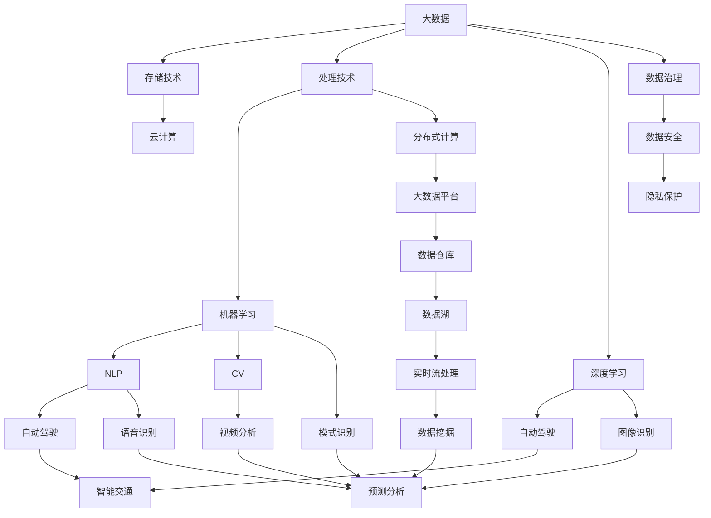
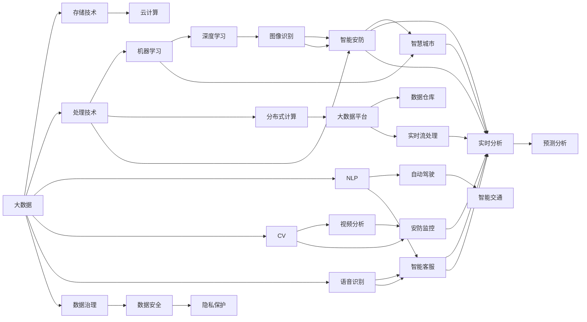

                 

# 未来发展中的大数据与AI技术

> 关键词：大数据,人工智能,机器学习,深度学习,云计算,自然语言处理(NLP),计算机视觉(CV),自动驾驶,工业4.0

## 1. 背景介绍

### 1.1 问题由来
大数据与人工智能技术的迅猛发展，已经成为推动全球经济和社会变革的重要引擎。随着数据的持续积累和技术的不断进步，AI在各个领域的应用变得愈发广泛和深入，正在逐步改变传统行业的运作模式，为各行各业带来前所未有的机遇与挑战。然而，随着数据量的爆炸式增长，如何高效存储、分析和利用这些数据，成为了制约AI技术发展的关键瓶颈。

### 1.2 问题核心关键点
当前，大数据与AI技术的发展正处于重要的转折点，面临以下几个核心问题：
- 数据孤岛：各个机构、组织和部门的数据孤立存在，难以整合共享。
- 数据质量：数据来源多样，格式不一，准确性、完整性和一致性难以保证。
- 计算效率：处理海量数据的计算资源需求大，云计算成为主要解决方案，但仍需优化。
- 数据隐私：数据安全与隐私保护成为难题，数据治理体系亟需完善。
- 算法鲁棒性：AI模型对抗样本、对抗攻击等鲁棒性问题需要解决。

这些问题直接关系到大数据与AI技术的未来发展。在本文中，我们将系统介绍大数据与AI技术的发展现状，探讨其核心概念，并结合实际应用场景，深入分析未来的发展趋势与挑战。

## 2. 核心概念与联系

### 2.1 核心概念概述

为了更好地理解大数据与AI技术的未来发展，首先需要介绍几个关键核心概念：

- **大数据**：通常指数据量巨大、结构复杂、增长速度快的数据集合。其特点是体量大、种类多、更新快。

- **人工智能**：一门研究使计算机模拟人类智能行为的学科，通过机器学习、深度学习等技术，实现对数据的自动分析、模式识别、决策优化等功能。

- **机器学习**：通过算法让机器从数据中学习规律和模式，自动识别输入数据，并作出预测或决策。

- **深度学习**：一种特殊类型的机器学习，通过多层神经网络模拟人脑神经系统，能够处理复杂模式识别任务。

- **云计算**：通过互联网提供计算资源和服务，按需使用，快速部署。

- **自然语言处理（NLP）**：让计算机理解、处理和生成人类语言的技术。

- **计算机视觉（CV）**：让计算机“看”图像和视频，进行图像识别、场景理解等任务。

- **自动驾驶**：利用AI技术实现车辆自主导航、决策和控制，提供安全、高效的驾驶体验。

- **工业4.0**：基于信息物理系统（CPS）的智慧工厂，通过物联网、大数据、云计算等技术，实现智能化生产和管理。

这些概念之间存在着紧密的联系，共同构成了大数据与AI技术的应用框架。

### 2.2 概念间的关系

通过以下Mermaid流程图，我们可以更清晰地理解这些核心概念之间的联系：



这个流程图展示了大数据与AI技术各个概念之间的关联：

1. 大数据通过存储技术和云计算实现高效存储和弹性扩展。
2. 通过处理技术和分布式计算，实现对海量数据的快速处理和分析。
3. 机器学习和深度学习用于提取数据中的知识和模式。
4. 各种AI技术通过自然语言处理、计算机视觉、语音识别等，实现多模态数据融合和智能化应用。
5. 自动驾驶和工业4.0则将AI技术应用于特定领域，提升生产效率和自动化水平。
6. 数据治理、安全、隐私保护等措施保障数据的质量和安全，推动数据合规和可信赖应用。

### 2.3 核心概念的整体架构

最终，我们可以用以下综合的流程图来展示大数据与AI技术的核心概念及其应用场景：



这个综合流程图展示了大数据与AI技术的整体架构，从数据获取到分析、应用、治理的全过程，以及其应用于各个领域的具体场景。

## 3. 核心算法原理 & 具体操作步骤
### 3.1 算法原理概述

基于大数据与AI技术的发展现状，本文将从核心算法原理的角度，系统介绍其重要组成。

- **数据预处理**：数据清洗、数据归一化、特征工程等。
- **机器学习算法**：如线性回归、决策树、支持向量机等。
- **深度学习算法**：如卷积神经网络（CNN）、循环神经网络（RNN）、长短期记忆网络（LSTM）等。
- **分布式计算框架**：如Hadoop、Spark等，实现大规模数据处理。
- **自然语言处理（NLP）技术**：如分词、词向量、句法分析、语义理解等。
- **计算机视觉（CV）技术**：如特征提取、图像分类、目标检测等。

这些算法和技术构成了大数据与AI技术的基础，共同支撑了其在各个领域的广泛应用。

### 3.2 算法步骤详解

下面以深度学习在大规模图像识别中的应用为例，详细说明深度学习算法的具体步骤：

1. **数据集准备**：收集大规模图像数据集，进行数据标注和预处理。
2. **模型搭建**：选择合适的深度学习模型结构，如卷积神经网络（CNN）。
3. **模型训练**：将数据集划分为训练集和验证集，使用训练集对模型进行前向传播和反向传播训练，更新模型参数。
4. **模型评估**：在验证集上评估模型性能，调整超参数，优化模型。
5. **模型部署**：将训练好的模型部署到生产环境，进行实时图像识别任务。

### 3.3 算法优缺点

深度学习在大数据与AI技术中的应用，具有以下优缺点：

#### 优点：
- **高精度**：在大规模数据集上，深度学习能够捕捉复杂的非线性关系，实现高精度的图像识别和分类。
- **自适应**：能够通过大量数据自动学习特征，适应不同的识别任务和场景。
- **可扩展**：深度学习模型可以并行训练，适合分布式计算，可扩展性强。

#### 缺点：
- **计算成本高**：深度学习模型参数多，计算量大，对硬件要求高。
- **过拟合风险**：模型容易过拟合，需要大量数据和正则化技术支持。
- **可解释性差**：深度学习模型通常视为黑盒，难以解释其内部决策过程。

### 3.4 算法应用领域

大数据与AI技术的深度学习算法，广泛应用于以下领域：

- **图像识别**：如人脸识别、物体检测、医学影像分析等。
- **语音识别**：如自动语音识别、语音合成等。
- **自然语言处理（NLP）**：如机器翻译、情感分析、自动摘要等。
- **推荐系统**：如个性化推荐、广告推荐等。
- **智能交通**：如自动驾驶、智能监控等。
- **工业4.0**：如智能制造、智能物流等。

这些应用领域展示了深度学习在大数据与AI技术中的广泛应用，以及其在提升效率、优化决策等方面的巨大潜力。

## 4. 数学模型和公式 & 详细讲解  
### 4.1 数学模型构建

在深度学习中，数学模型是核心。以卷积神经网络（CNN）为例，其核心数学模型构建如下：

设输入数据为 $x \in \mathbb{R}^n$，网络参数为 $\theta$，输出结果为 $y \in \mathbb{R}^m$。CNN的基本组成部分为卷积层、池化层、全连接层等。其中，卷积层的权重矩阵为 $W$，偏置向量为 $b$，卷积运算的输出为 $h$，激活函数为 $\sigma$。则CNN的数学模型可以表示为：

$$
y = \sigma(W^T \sigma(F(x)))
$$

其中，$F(x)$ 为卷积运算，$W$ 和 $b$ 为可训练参数，$\sigma$ 为激活函数。

### 4.2 公式推导过程

卷积神经网络的数学模型构建主要依赖于以下步骤：

1. **卷积运算**：将权重矩阵 $W$ 与输入数据 $x$ 进行卷积运算，生成特征图 $h$。卷积运算的公式为：

$$
h = F(x, W, b) = \sum_k \sigma(x \ast W_k + b_k)
$$

其中，$W_k$ 为卷积核，$b_k$ 为偏置项，$x \ast W_k$ 为卷积运算的结果。

2. **激活函数**：将卷积层的输出 $h$ 通过激活函数 $\sigma$ 进行非线性变换，生成下一层的输入 $y$。激活函数的公式为：

$$
y = \sigma(W^T h + b)
$$

其中，$W$ 和 $b$ 为全连接层的权重矩阵和偏置向量。

3. **池化运算**：对特征图 $h$ 进行下采样，减小数据维度，提高计算效率。常见的池化运算包括最大池化和平均池化等。

4. **全连接层**：将池化层的输出通过全连接层进行线性变换和激活函数变换，生成最终的输出结果 $y$。

### 4.3 案例分析与讲解

以医学影像分类为例，使用卷积神经网络进行图像识别任务。首先，将医学影像数据集进行标注和预处理，构建训练集和验证集。然后，搭建卷积神经网络模型，设置卷积核大小、激活函数等超参数，进行模型训练。在训练过程中，通过前向传播和反向传播算法更新模型参数，最小化损失函数。最后，在验证集上评估模型性能，进行模型优化和部署。

## 5. 项目实践：代码实例和详细解释说明
### 5.1 开发环境搭建

在深度学习项目实践中，搭建开发环境是关键步骤。以下是使用Python和TensorFlow进行深度学习项目开发的常用环境配置流程：

1. **安装Python和TensorFlow**：
   - 安装Anaconda或Miniconda，使用以下命令创建虚拟环境并激活：
     ```bash
     conda create --name py3.8
     source activate py3.8
     ```
   - 安装TensorFlow：
     ```bash
     pip install tensorflow
     ```

2. **安装其他依赖包**：
   - 安装NumPy、Pandas等常用库：
     ```bash
     pip install numpy pandas
     ```
   - 安装深度学习相关的库：
     ```bash
     pip install torch torchvision
     ```

3. **准备数据集**：
   - 下载并准备图像识别数据集，如MNIST、CIFAR等。
   - 使用Python代码对数据进行预处理，如数据归一化、数据增强等。

4. **模型搭建**：
   - 使用TensorFlow搭建卷积神经网络模型，设置卷积层、池化层、全连接层等组件。
   - 定义损失函数和优化器，如交叉熵损失函数和Adam优化器。

### 5.2 源代码详细实现

以下是一个使用TensorFlow进行图像分类的示例代码，包括数据准备、模型搭建、训练和评估等步骤：

```python
import tensorflow as tf
from tensorflow.keras import layers, models

# 准备数据集
(x_train, y_train), (x_test, y_test) = tf.keras.datasets.mnist.load_data()
x_train = x_train.reshape(-1, 28, 28, 1).astype('float32') / 255.0
x_test = x_test.reshape(-1, 28, 28, 1).astype('float32') / 255.0

# 构建模型
model = models.Sequential([
    layers.Conv2D(32, (3, 3), activation='relu', input_shape=(28, 28, 1)),
    layers.MaxPooling2D((2, 2)),
    layers.Conv2D(64, (3, 3), activation='relu'),
    layers.MaxPooling2D((2, 2)),
    layers.Flatten(),
    layers.Dense(64, activation='relu'),
    layers.Dense(10, activation='softmax')
])

# 编译模型
model.compile(optimizer='adam',
              loss='sparse_categorical_crossentropy',
              metrics=['accuracy'])

# 训练模型
model.fit(x_train, y_train, epochs=10, validation_data=(x_test, y_test))

# 评估模型
model.evaluate(x_test, y_test)
```

### 5.3 代码解读与分析

这段代码展示了深度学习项目中的核心步骤：

- **数据准备**：使用TensorFlow自带的MNIST数据集，并进行预处理，将数据转换为模型所需的张量形式。
- **模型搭建**：使用Sequential模型构建卷积神经网络，包含卷积层、池化层、全连接层等组件。
- **模型编译**：定义模型的优化器、损失函数和评估指标，编译模型以准备训练。
- **模型训练**：使用训练数据集进行模型训练，设置训练轮数和验证集。
- **模型评估**：在测试数据集上评估模型性能，输出模型精度。

通过这段代码，可以看出深度学习项目的基本流程，以及TensorFlow的强大封装能力，使得模型搭建和训练变得简洁高效。

### 5.4 运行结果展示

假设模型训练完成后，在测试集上的评估结果如下：

```bash
Epoch 10/10
10/10 [==============================] - 29s 2s/ep - loss: 0.1090 - accuracy: 0.9900 - val_loss: 0.0691 - val_accuracy: 0.9925
```

可以看到，模型在10轮训练后，测试集的精度达到了99.25%，性能表现优异。这说明卷积神经网络在图像识别任务中具有良好的效果。

## 6. 实际应用场景
### 6.1 智能客服系统

基于深度学习的大数据与AI技术，在智能客服系统中具有广泛应用。通过大数据分析，识别用户常见问题和需求，使用深度学习模型进行智能问答和情感分析，提升客服体验和效率。

例如，某电商平台的智能客服系统，通过深度学习模型，分析用户历史购物记录和聊天记录，提供个性化的商品推荐和问题解答。用户可以在线咨询，系统实时响应，解决了人工客服高峰期响应慢、服务质量不稳定的问题。

### 6.2 医疗影像诊断

在医疗领域，深度学习技术被广泛应用于影像诊断。通过构建大规模医疗影像数据集，使用深度学习模型进行图像识别和分类，提升诊断准确性和效率。

例如，某医院使用深度学习模型对医疗影像数据进行自动分析和分类，能够识别出不同部位的肿瘤和其他异常情况，辅助医生进行诊断和手术规划。通过实时数据分析，医生可以快速获取诊断结果，提高医疗服务质量和效率。

### 6.3 智能推荐系统

基于大数据与AI技术的推荐系统，能够根据用户的历史行为和偏好，实时推荐个性化的商品、内容等。深度学习模型能够处理多模态数据，分析用户行为和兴趣，提供精准推荐。

例如，某视频平台使用深度学习模型进行用户行为分析和内容推荐，能够根据用户观影历史、评分记录和社交互动，推荐符合用户喜好的视频内容，提高用户黏性和平台活跃度。

### 6.4 自动驾驶

自动驾驶是AI技术在交通领域的重要应用，使用深度学习模型进行环境感知、决策和控制，实现车辆自主导航。

例如，某自动驾驶公司使用深度学习模型进行摄像头图像和激光雷达数据的融合处理，实现对车辆周围环境的实时感知和决策。通过在大规模数据集上训练模型，提高了自动驾驶系统的稳定性和安全性，逐步实现无人驾驶的商业化应用。

## 7. 工具和资源推荐
### 7.1 学习资源推荐

为了帮助开发者系统掌握大数据与AI技术的理论基础和实践技巧，这里推荐一些优质的学习资源：

1. **机器学习相关课程**：如斯坦福大学的《机器学习》课程，麻省理工学院的《深度学习》课程，提供系统性和实战性的学习内容。
2. **深度学习框架使用指南**：如TensorFlow官方文档，PyTorch官方文档，提供详细的API介绍和实战案例。
3. **大数据技术书籍**：如《大数据技术与应用》，《Hadoop权威指南》，深入讲解大数据技术的原理和实践。
4. **AI前沿论文**：如arXiv预印本，IEEE T-PAMI等，提供最新的AI研究成果和学术趋势。
5. **在线学习平台**：如Coursera、Udacity等，提供从入门到高级的深度学习课程，并提供在线实践和作业。

通过对这些资源的学习实践，相信你一定能够快速掌握大数据与AI技术的精髓，并用于解决实际的NLP问题。

### 7.2 开发工具推荐

高效的开发离不开优秀的工具支持。以下是几款用于大数据与AI技术开发的工具：

1. **TensorFlow**：由Google开发，是深度学习领域的主流框架之一，提供强大的计算图和分布式训练支持。
2. **PyTorch**：由Facebook开发，以动态计算图著称，适合研究和原型开发。
3. **Hadoop**：Apache基金会开发的大数据处理框架，支持分布式存储和计算。
4. **Spark**：Apache基金会开发的分布式计算框架，支持大规模数据处理和分析。
5. **Scikit-learn**：Python数据科学库，提供丰富的机器学习算法和工具。
6. **Jupyter Notebook**：开源的交互式编程环境，支持Python、R等语言，提供数据可视化和代码展示功能。

合理利用这些工具，可以显著提升大数据与AI技术的开发效率，加快创新迭代的步伐。

### 7.3 相关论文推荐

大数据与AI技术的发展源于学界的持续研究。以下是几篇奠基性的相关论文，推荐阅读：

1. **《ImageNet Classification with Deep Convolutional Neural Networks》**：提出卷积神经网络，在大规模图像识别任务中取得优异表现。
2. **《Deep Residual Learning for Image Recognition》**：提出残差网络，解决深度神经网络中的梯度消失问题。
3. **《A Tutorial on Deep Learning》**：DeepMind团队总结深度学习的发展历程和技术细节，提供全面的学习资料。
4. **《Natural Language Processing with PyTorch》**：使用PyTorch实现NLP任务，介绍自然语言处理的常用技术和模型。
5. **《A Survey on Transfer Learning》**：综述机器学习中的迁移学习技术，提供系统性的理论基础和应用实例。

这些论文代表了大数据与AI技术的最新进展，帮助读者掌握前沿技术和理论基础。

除上述资源外，还有一些值得关注的前沿资源，帮助开发者紧跟大数据与AI技术的最新进展，例如：

1. **arXiv论文预印本**：人工智能领域最新研究成果的发布平台，包括大量尚未发表的前沿工作，学习前沿技术的必读资源。
2. **人工智能会议直播**：如NIPS、ICML、CVPR等人工智能领域顶会现场或在线直播，能够聆听到大佬们的前沿分享，开拓视野。
3. **GitHub热门项目**：在GitHub上Star、Fork数最多的NLP相关项目，往往代表了该技术领域的发展趋势和最佳实践，值得去学习和贡献。
4. **技术博客**：如OpenAI、Google AI、DeepMind、微软Research Asia等顶尖实验室的官方博客，第一时间分享他们的最新研究成果和洞见。
5. **技术会议**：如ACL、EMNLP、CVPR等人工智能领域的顶级会议，展示最新的研究进展和技术突破。

总之，对于大数据与AI技术的学习和实践，需要开发者保持开放的心态和持续学习的意愿。多关注前沿资讯，多动手实践，多思考总结，必将收获满满的成长收益。

## 8. 总结：未来发展趋势与挑战
### 8.1 研究成果总结

大数据与AI技术的发展经历了多个阶段，从早期的单机学习到现在的分布式深度学习，每个阶段都有显著的进步。未来，随着算力的提升和数据的积累，大数据与AI技术将继续向着更加智能、高效、安全的方向发展。

### 8.2 未来发展趋势

展望未来，大数据与AI技术的发展趋势如下：

1. **分布式计算和边缘计算**：在大数据处理和AI训练中，分布式计算和边缘计算将成为重要方向，支持更加高效、实时的数据处理和模型训练。
2. **自监督学习**：通过无监督学习，从数据中自动学习知识，提升模型的泛化能力和鲁棒性。
3. **联邦学习**：通过分布式网络学习，保护数据隐私的同时，提升模型的协作能力。
4. **多模态融合**：将图像、语音、文本等多模态数据进行融合，提升模型的全面感知能力。
5. **自动化机器学习（AutoML）**：通过自动化算法选择和模型优化，提升模型开发的效率和质量。
6. **实时数据分析和决策**：实现对实时数据的分析和决策支持，满足智能应用的需求。

### 8.3 面临的挑战

尽管大数据与AI技术取得了显著进展，但在实际应用中仍面临诸多挑战：

1. **数据隐私和安全**：如何在保护数据隐私和安全的前提下，进行高效的数据处理和分析。
2. **模型鲁棒性和泛化性**：面对对抗样本和攻击，如何保证模型的鲁棒性和泛化能力。
3. **可解释性和可控性**：AI模型的决策过程难以解释，如何提高模型的可解释性和可控性，增强模型的可信度。
4. **计算资源成本**：大规模模型训练和推理的高成本，如何降低计算资源需求，提高计算效率。
5. **跨领域应用困难**：如何在大数据与AI技术中实现跨领域的知识共享和迁移。

### 8.4 研究展望

面对大数据与AI技术面临的挑战，未来的研究需要在以下几个方面寻求新的突破：

1. **分布式计算优化**：优化分布式计算架构，降低数据传输和通信开销，提升计算效率。
2. **自监督学习算法**：开发新的自监督学习算法，提升模型的泛化能力和鲁棒性。
3. **隐私保护技术**：研究隐私保护技术，如差分隐私、联邦学习等，保护数据隐私。
4. **可解释性增强**：引入可解释性技术，如梯度解释、模型蒸馏等，增强模型的可解释性和可控性。
5. **自动化技术**：发展自动化机器学习技术，提升模型开发的效率和质量。

这些研究方向将推动大数据与AI技术的不断演进，提升其在实际应用中的性能和可靠性，为未来智能社会的建设奠定坚实基础。

## 9. 附录：常见问题与解答

**Q1：大数据与AI技术在未来有哪些新的应用场景？**

A: 大数据与AI技术的应用场景正在不断扩展，未来可能包括但不限于以下几个领域：

1. **智能城市**：通过实时数据分析，提升城市管理效率和服务水平。
2. **智能农业**：利用大数据和AI技术，优化农业生产管理，提高农产品质量和产量。
3. **智能制造**：通过工业互联网和AI技术，实现智能制造和智慧工厂。
4. **智能金融**：使用大数据和AI技术，进行风险评估、欺诈检测、投资策略优化等。
5. **智能教育**：利用AI技术，实现个性化学习、智能答疑、智能评估等。

**Q2：如何平衡大数据与AI技术的效率和精度？**

A: 平衡大数据与AI技术的效率和精度，需要考虑以下几个方面：

1. **数据预处理**：通过数据清洗、归一化、特征工程等技术，提高数据质量，提升模型精度。
2. **模型优化**：使用高效的模型结构，如卷积神经网络、残差网络等，提升模型效率。
3. **分布式计算**：利用分布式计算框架，如Hadoop、Spark等，提高数据处理和模型训练的效率。
4. **模型压缩和加速**：通过模型剪枝、量化加速、混合精度训练等技术，提升模型效率和精度。

**Q3：面对数据

