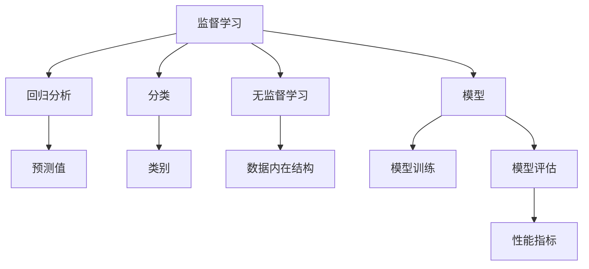

                 

# 机器学习 原理与代码实例讲解

## 1. 背景介绍

机器学习是人工智能（AI）领域的核心技术之一，它使计算机系统能够自动地从数据中学习规律，并通过预测或决策来支持决策过程。随着数据科学和计算能力的不断发展，机器学习的应用范围日益广泛，从图像识别、自然语言处理到推荐系统、金融预测等，都离不开机器学习的支撑。然而，尽管机器学习在理论和应用上都取得了巨大进展，但学习曲线仍然陡峭，许多开发者和研究者在应用实践中常常面临诸多困难。因此，本文旨在通过理论讲解与代码实例相结合的方式，深入浅出地阐述机器学习的基本原理与操作，帮助读者更好地理解和应用机器学习技术。

## 2. 核心概念与联系

### 2.1 核心概念概述

- **监督学习（Supervised Learning）**：使用有标签数据来训练模型，模型学习输入特征与输出标签之间的映射关系。
- **无监督学习（Unsupervised Learning）**：仅使用无标签数据来训练模型，模型自行学习数据的内在结构或规律。
- **强化学习（Reinforcement Learning）**：通过与环境的交互来学习最佳行为策略，目标是最优化某一累积奖励函数。
- **回归分析（Regression Analysis）**：用于预测连续值的机器学习方法。
- **分类（Classification）**：用于将数据分类到预定义的类别中的机器学习方法。
- **模型评估（Model Evaluation）**：通过验证数据集来评估模型的性能，包括准确率、召回率、F1分数等指标。

### 2.2 核心概念之间的联系

机器学习的主要目标是通过模型学习数据的规律，并利用这些规律来进行预测或决策。监督学习、无监督学习和强化学习是机器学习的三大主要框架。回归分析和分类是监督学习中最常见的两个子问题，模型评估则是衡量模型性能的关键步骤。这些核心概念通过Mermaid流程图进行展示：



这个流程图清晰地展示了监督学习、无监督学习和强化学习之间，以及回归分析和分类与模型评估之间的联系和区别。

## 3. 核心算法原理 & 具体操作步骤

### 3.1 算法原理概述

机器学习算法主要包括模型构建、训练和评估三个阶段。模型的构建通常基于一定的假设，例如线性回归模型假设输入特征和输出标签之间存在线性关系。模型的训练是通过优化某个损失函数来实现的，常见的优化算法包括梯度下降、随机梯度下降和Adam等。模型评估则是通过验证数据集来衡量模型的泛化能力，常用的评估指标包括准确率、召回率和F1分数等。

### 3.2 算法步骤详解

#### 3.2.1 数据准备
数据准备是机器学习项目中至关重要的一步。数据集应分为训练集、验证集和测试集，通常以7:2:1的比例进行划分。训练集用于模型训练，验证集用于模型调参和防止过拟合，测试集用于最终模型评估。

#### 3.2.2 模型构建
根据具体问题选择合适的模型类型，例如线性回归模型、逻辑回归模型、决策树模型等。然后对模型进行参数初始化，设置模型超参数，如学习率、正则化系数等。

#### 3.2.3 模型训练
使用训练集对模型进行训练。在每次迭代中，计算损失函数对模型参数的梯度，然后使用优化算法更新模型参数。训练过程通常包含多个epoch，每个epoch分为训练和验证两个阶段，根据验证集的表现来调整模型超参数。

#### 3.2.4 模型评估
使用测试集对训练好的模型进行评估，计算模型的性能指标。根据评估结果调整模型参数，直到模型达到预定的性能标准。

### 3.3 算法优缺点

#### 优点
- 可以处理大规模数据集，自动发现数据中的规律和模式。
- 通过模型评估，能够量化模型的性能，进行客观比较。
- 广泛应用于图像识别、自然语言处理、推荐系统等领域。

#### 缺点
- 对数据质量和数据量要求较高，需要大量标注数据进行监督学习。
- 模型构建和调参需要丰富的领域知识和经验。
- 算法复杂度高，计算成本大，训练时间长。

### 3.4 算法应用领域

机器学习广泛应用于多个领域，包括但不限于：

- 计算机视觉：如图像分类、目标检测、人脸识别等。
- 自然语言处理：如文本分类、情感分析、机器翻译等。
- 推荐系统：如商品推荐、新闻推荐等。
- 金融预测：如股票价格预测、信用评分等。
- 医疗诊断：如疾病诊断、药物发现等。

## 4. 数学模型和公式 & 详细讲解 & 举例说明

### 4.1 数学模型构建

假设我们有一个线性回归模型 $y = \theta^T X + b$，其中 $y$ 是输出标签，$X$ 是输入特征，$\theta$ 是模型参数，$b$ 是截距。我们的目标是找到最优的 $\theta$ 和 $b$，使得模型在训练集上的损失函数最小化。常用的损失函数包括均方误差（MSE）和交叉熵（Cross-Entropy）损失函数。

### 4.2 公式推导过程

#### 线性回归
均方误差损失函数为：

$$L(y,\hat{y}) = \frac{1}{2m} \sum_{i=1}^m (y_i - \hat{y_i})^2$$

其中 $m$ 是样本数，$y_i$ 是真实标签，$\hat{y_i}$ 是模型预测值。模型参数 $\theta$ 的梯度为：

$$\frac{\partial L}{\partial \theta} = \frac{1}{m} \sum_{i=1}^m (y_i - \hat{y_i})X_i$$

通过梯度下降算法，更新模型参数：

$$\theta \leftarrow \theta - \eta \frac{\partial L}{\partial \theta}$$

其中 $\eta$ 是学习率。

#### 逻辑回归
逻辑回归的目标是预测二分类问题，假设模型为 $y = \sigma(\theta^T X + b)$，其中 $\sigma$ 是sigmoid函数。交叉熵损失函数为：

$$L(y,\hat{y}) = -\frac{1}{m} \sum_{i=1}^m y_i \log \hat{y_i} + (1 - y_i) \log(1 - \hat{y_i})$$

模型参数 $\theta$ 的梯度为：

$$\frac{\partial L}{\partial \theta} = \frac{1}{m} \sum_{i=1}^m [(y_i - \hat{y_i})X_i]$$

通过梯度下降算法，更新模型参数：

$$\theta \leftarrow \theta - \eta \frac{\partial L}{\partial \theta}$$

### 4.3 案例分析与讲解

假设我们有一组房价数据，每个样本包含特征 $X = [房间数, 面积, 位置]$ 和房价 $y$，我们需要使用线性回归模型预测房价。我们可以使用Scikit-Learn库来实现这一过程。

```python
from sklearn.linear_model import LinearRegression
from sklearn.model_selection import train_test_split

# 假设我们已经有了房价数据
X_train, X_test, y_train, y_test = train_test_split(X, y, test_size=0.2)

# 构建线性回归模型
model = LinearRegression()

# 训练模型
model.fit(X_train, y_train)

# 评估模型
score = model.score(X_test, y_test)
print("R^2: {:.2f}".format(score))
```

这个代码片段展示了如何使用Scikit-Learn库进行线性回归模型的训练和评估。模型训练时，我们使用了训练集数据，模型评估时，我们使用了测试集数据。R^2是决定系数，表示模型解释了数据方差的百分比。

## 5. 项目实践：代码实例和详细解释说明

### 5.1 开发环境搭建

在进行机器学习项目开发前，需要搭建开发环境。这里推荐使用Python作为开发语言，因为它有丰富的机器学习库和社区支持。以下是在Linux系统上搭建Python开发环境的步骤：

1. 安装Anaconda：
```bash
wget https://repo.anaconda.com/miniconda/Miniconda3-latest-Linux-x86_64.sh
bash Miniconda3-latest-Linux-x86_64.sh
```

2. 更新conda：
```bash
conda update --all
```

3. 创建虚拟环境：
```bash
conda create --name myenv python=3.8
conda activate myenv
```

4. 安装机器学习库：
```bash
conda install scikit-learn pandas numpy matplotlib
```

完成环境搭建后，即可开始机器学习项目的开发。

### 5.2 源代码详细实现

#### 5.2.1 数据准备

假设我们有一组Iris数据集，包含了Iris花的种类、萼片长度、萼片宽度、花瓣长度和花瓣宽度等特征。我们需要将数据分为训练集、验证集和测试集，使用train_test_split函数进行划分。

```python
from sklearn.datasets import load_iris
from sklearn.model_selection import train_test_split

# 加载Iris数据集
iris = load_iris()
X = iris.data
y = iris.target

# 将数据分为训练集、验证集和测试集
X_train, X_test, y_train, y_test = train_test_split(X, y, test_size=0.2, random_state=42)
X_train, X_val, y_train, y_val = train_test_split(X_train, y_train, test_size=0.2, random_state=42)
```

#### 5.2.2 模型构建

我们使用决策树模型进行分类。首先，需要导入决策树分类器。

```python
from sklearn.tree import DecisionTreeClassifier
```

然后，构建决策树模型。

```python
# 构建决策树模型
model = DecisionTreeClassifier()
```

#### 5.2.3 模型训练

使用训练集数据训练模型。

```python
# 训练模型
model.fit(X_train, y_train)
```

#### 5.2.4 模型评估

使用验证集和测试集数据评估模型性能。

```python
# 评估模型在验证集上的性能
score_val = model.score(X_val, y_val)
print("验证集准确率: {:.2f}".format(score_val))

# 评估模型在测试集上的性能
score_test = model.score(X_test, y_test)
print("测试集准确率: {:.2f}".format(score_test))
```

### 5.3 代码解读与分析

这个代码片段展示了如何使用Scikit-Learn库进行决策树模型的训练和评估。在构建模型时，我们使用了默认的参数。在训练模型时，我们使用了训练集数据。在评估模型时，我们分别使用了验证集和测试集数据，并计算了模型的准确率。

## 6. 实际应用场景

### 6.1 金融风控

在金融风控领域，机器学习模型被广泛用于风险评估、信用评分、欺诈检测等任务。例如，可以使用机器学习模型预测用户的还款能力，评估其信用风险。

### 6.2 医疗诊断

在医疗诊断领域，机器学习模型被用于疾病预测、药物发现等任务。例如，可以使用机器学习模型预测患者的病情发展，帮助医生做出更准确的诊断。

### 6.3 智能推荐

在智能推荐领域，机器学习模型被用于推荐系统，为用户推荐商品、新闻、音乐等。例如，可以使用机器学习模型预测用户对不同商品或内容的偏好，推荐其感兴趣的商品或内容。

## 7. 工具和资源推荐

### 7.1 学习资源推荐

- 《机器学习实战》（Peter Harrington著）：这本书详细介绍了机器学习的基本概念和常用算法，包括决策树、线性回归、支持向量机等。
- 《深度学习》（Ian Goodfellow、Yoshua Bengio和Aaron Courville著）：这本书是深度学习领域的经典之作，详细介绍了深度学习的基本原理和常用算法，包括神经网络、卷积神经网络、循环神经网络等。
- 《Python机器学习》（Sebastian Raschka著）：这本书介绍了Python语言在机器学习中的应用，包括数据处理、模型训练和评估等。

### 7.2 开发工具推荐

- Jupyter Notebook：一个交互式的Python代码编辑器，支持代码编写、数据可视化、模型训练和评估等。
- TensorFlow：一个开源的深度学习框架，支持分布式训练和模型部署。
- PyTorch：一个开源的深度学习框架，支持动态计算图和模型部署。

### 7.3 相关论文推荐

- 《Caffe: An open-source convolutional architecture for fast model prototyping》：介绍了Caffe深度学习框架的架构和使用方法。
- 《ImageNet Classification with Deep Convolutional Neural Networks》：介绍了使用深度卷积神经网络在ImageNet数据集上进行图像分类的研究成果。
- 《Deep Learning》：DeepMind的论文，介绍了深度学习的基本概念和常用算法，包括深度神经网络、卷积神经网络、循环神经网络等。

## 8. 总结：未来发展趋势与挑战

### 8.1 研究成果总结

机器学习在过去十年中取得了巨大的进展，广泛应用于图像识别、自然语言处理、推荐系统等领域。主要的研究成果包括：

- 深度学习的发展：深度神经网络、卷积神经网络、循环神经网络等深度学习算法在图像识别、自然语言处理等领域取得了巨大成功。
- 数据增强技术：数据增强技术通过生成更多的训练样本来提高模型的泛化能力。
- 模型融合技术：模型融合技术通过结合多个模型的预测结果，提高模型的准确率和鲁棒性。

### 8.2 未来发展趋势

未来机器学习的发展趋势包括：

- 深度学习的发展：深度学习算法将继续发展，出现更多的新型深度神经网络结构，如自注意力机制、残差连接等。
- 模型融合技术的发展：模型融合技术将不断完善，结合更多模型和数据来源，提高模型的准确率和鲁棒性。
- 数据增强技术的发展：数据增强技术将不断发展，通过更智能的方法生成更多的训练样本，提高模型的泛化能力。

### 8.3 面临的挑战

机器学习在发展过程中面临的挑战包括：

- 数据隐私问题：机器学习模型需要大量的标注数据进行训练，这些数据可能包含用户隐私信息。如何保护用户隐私是一个重要的问题。
- 模型公平性问题：机器学习模型可能会学习到数据中的偏见，导致模型预测结果不公平。如何保证模型的公平性是一个重要的问题。
- 模型可解释性问题：机器学习模型通常是"黑盒"系统，难以解释其内部工作机制和决策逻辑。如何提高模型的可解释性是一个重要的问题。

### 8.4 研究展望

未来的研究应关注以下几个方面：

- 数据隐私保护：研究如何在保护用户隐私的前提下，充分利用数据进行机器学习模型的训练和推理。
- 模型公平性：研究如何消除模型中的偏见，保证模型的公平性和公正性。
- 模型可解释性：研究如何提高机器学习模型的可解释性，使得模型预测结果更加透明和可信。

## 9. 附录：常见问题与解答

### Q1: 机器学习算法有哪些？

A: 机器学习算法可以分为监督学习、无监督学习和强化学习三大类。其中，监督学习算法包括线性回归、逻辑回归、决策树等；无监督学习算法包括聚类、降维等；强化学习算法包括Q-learning、Deep Q-learning等。

### Q2: 机器学习模型的评估指标有哪些？

A: 机器学习模型的评估指标包括准确率、召回率、F1分数、AUC等。其中，准确率表示模型预测正确的样本占总样本的比例；召回率表示模型预测正确的正样本占实际正样本的比例；F1分数是准确率和召回率的调和平均；AUC表示ROC曲线下的面积，用于评估二分类模型的性能。

### Q3: 如何避免过拟合？

A: 避免过拟合的方法包括：
- 数据增强：通过生成更多的训练样本来提高模型的泛化能力。
- 正则化：通过L1、L2正则化等方法限制模型复杂度，防止过拟合。
- 早停：在验证集上监控模型性能，当性能不再提升时，停止训练。

### Q4: 机器学习模型的调参方法有哪些？

A: 机器学习模型的调参方法包括网格搜索、随机搜索、贝叶斯优化等。网格搜索通过遍历参数空间找到最优参数组合；随机搜索通过随机采样参数空间找到最优参数组合；贝叶斯优化通过构造先验分布，快速找到最优参数组合。

### Q5: 如何选择合适的机器学习模型？

A: 选择合适的机器学习模型需要考虑以下几个方面：
- 数据类型：根据数据类型选择适合的模型，如文本数据适合使用卷积神经网络，图像数据适合使用卷积神经网络。
- 问题类型：根据问题类型选择适合的模型，如回归问题适合使用线性回归模型，分类问题适合使用决策树模型。
- 计算资源：根据计算资源选择适合的模型，如深度学习模型需要大量计算资源，决策树模型计算资源需求较小。

