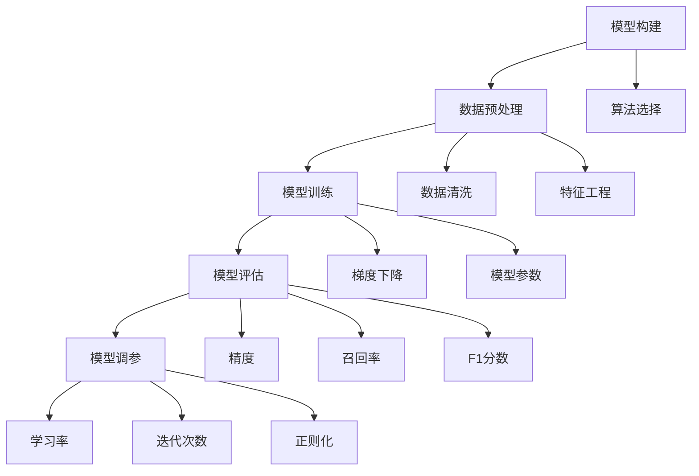
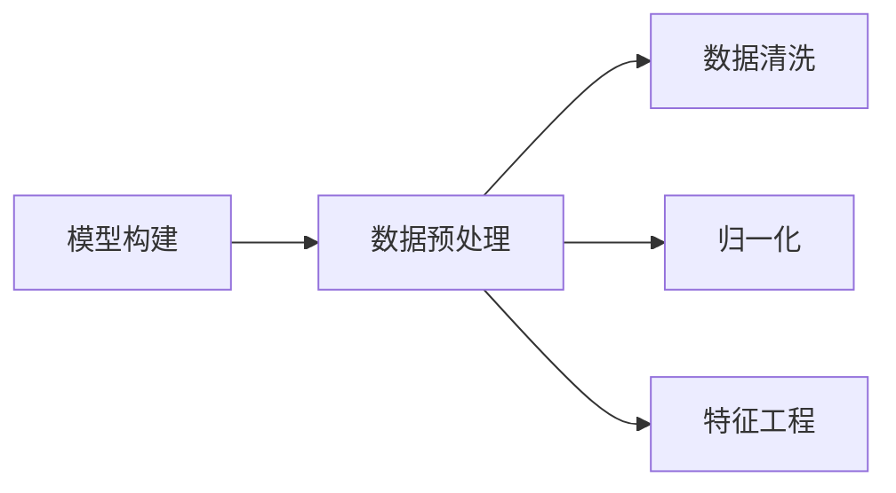
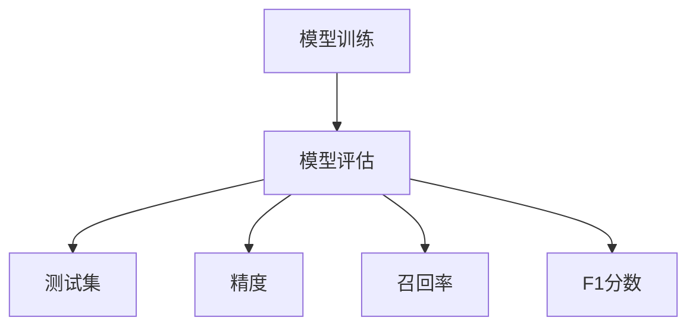
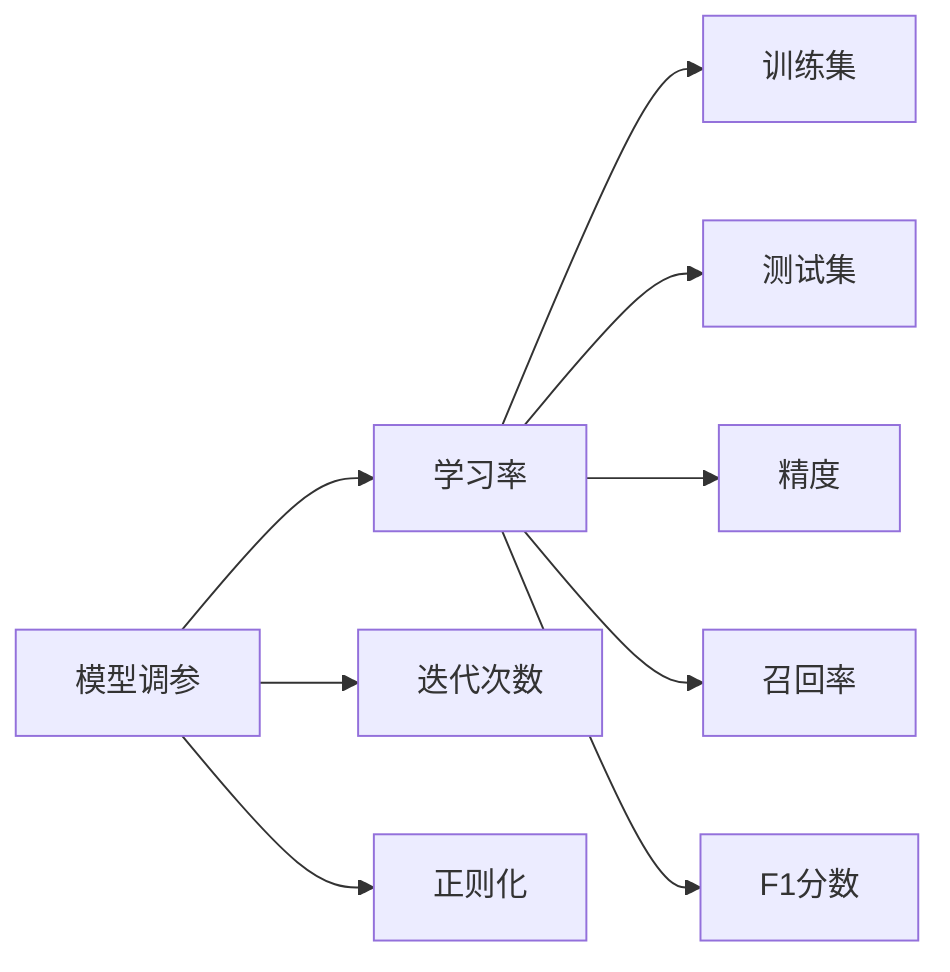

                 

# 机器学习 原理与代码实例讲解

> 关键词：机器学习, 数据预处理, 模型训练, 模型评估, 模型调参, 特征工程, 深度学习, 回归, 分类, 聚类, 自然语言处理(NLP)

## 1. 背景介绍

### 1.1 问题由来

机器学习(Machine Learning, ML)作为人工智能(AI)的核心技术之一，旨在通过算法和模型，让机器自动地从数据中学习规律，进而进行预测或分类。它涵盖广泛的领域，包括回归、分类、聚类、降维、深度学习等。近年来，随着数据量的激增和计算能力的提升，机器学习在各行各业得到了广泛应用，推动了大数据、云计算、自然语言处理(NLP)、图像识别等多个领域的革新。

机器学习的核心思想在于构建一个函数，通过训练数据学习输入-输出映射关系。一旦模型训练完成，即可对新的数据进行预测或分类。机器学习的应用场景包括但不限于推荐系统、图像识别、语音识别、智能客服、金融预测等。然而，尽管机器学习在理论和应用上取得了显著进展，但如何在复杂的数据和问题中构建高效、准确的模型，仍然是一大挑战。

### 1.2 问题核心关键点

机器学习涉及的核心问题是模型构建、数据预处理、模型训练、模型评估和调参。这些步骤共同构成了模型的训练流程，其效果直接影响模型的性能。

1. **模型构建**：选择合适的算法模型，如线性回归、决策树、支持向量机(SVM)、深度学习等，满足应用需求。
2. **数据预处理**：包括数据清洗、归一化、特征工程等，提高数据质量，增强模型训练效果。
3. **模型训练**：使用训练数据集进行模型参数优化，如梯度下降、随机梯度下降等，确保模型学习规律。
4. **模型评估**：通过测试数据集评估模型性能，常用的指标包括精度(Precision)、召回率(Recall)、F1分数等。
5. **模型调参**：调整模型超参数，如学习率、迭代次数、正则化参数等，优化模型性能。

本文将详细讲解这些核心步骤，通过实例代码展示，帮助读者深入理解机器学习的原理和实践。

### 1.3 问题研究意义

掌握机器学习的原理与实践，对于构建高效、准确的预测或分类模型至关重要。它不仅有助于提升算法设计和应用能力，还能帮助开发者理解和优化现有系统，加速模型的部署和应用。机器学习在科学研究、工业生产、社会治理等多个领域展示了其巨大潜力，推动了数据驱动决策的普及。

## 2. 核心概念与联系

### 2.1 核心概念概述

为了更好地理解机器学习流程，我们需要先介绍几个关键概念：

- **模型构建**：选择合适的算法模型，如线性回归、决策树、支持向量机、深度学习等，满足应用需求。
- **数据预处理**：包括数据清洗、归一化、特征工程等，提高数据质量，增强模型训练效果。
- **模型训练**：使用训练数据集进行模型参数优化，如梯度下降、随机梯度下降等，确保模型学习规律。
- **模型评估**：通过测试数据集评估模型性能，常用的指标包括精度(Precision)、召回率(Recall)、F1分数等。
- **模型调参**：调整模型超参数，如学习率、迭代次数、正则化参数等，优化模型性能。

这些概念之间存在着紧密的联系，共同构成了机器学习的完整流程。下面，我们将通过一个Mermaid流程图来展示这些概念之间的关系：



### 2.2 概念间的关系

这些核心概念之间存在着紧密的联系，形成了机器学习的完整生态系统。下面我们通过几个Mermaid流程图来展示这些概念之间的关系。

#### 2.2.1 模型构建与数据预处理的关系



模型构建通常需要依赖于高质量的数据。数据预处理包括清洗、归一化和特征工程，旨在提高数据质量，增强模型训练效果。

#### 2.2.2 模型训练与模型评估的关系



模型训练完成后，需要通过测试集进行评估，确保模型的泛化能力和性能。常用的评估指标包括精度、召回率和F1分数。

#### 2.2.3 模型调参与模型评估的关系



模型调参通过调整学习率、迭代次数和正则化参数，优化模型性能。调参后的模型需要重新在测试集上进行评估，确保模型性能的提升。

## 3. 核心算法原理 & 具体操作步骤
### 3.1 算法原理概述

机器学习的核心在于构建一个函数，通过训练数据学习输入-输出映射关系。模型通常由两部分组成：预测函数和损失函数。预测函数用于根据输入数据预测输出结果，损失函数用于衡量预测结果与实际标签之间的差距。训练的目标是最小化损失函数，通过调整模型参数，使得预测结果尽可能接近实际标签。

以线性回归为例，假设模型为 $y=f(x;\theta)$，其中 $y$ 为预测值，$x$ 为输入特征，$\theta$ 为模型参数。假设训练数据集为 $\{(x_i,y_i)\}_{i=1}^N$，则线性回归模型可以表示为：

$$
y_i = \theta_0 + \theta_1 x_{i1} + \theta_2 x_{i2} + ... + \theta_n x_{in}
$$

其中，$\theta_0,\theta_1,\theta_2,...,\theta_n$ 为模型参数。训练目标是最小化均方误差损失函数：

$$
\min_{\theta} \frac{1}{N} \sum_{i=1}^N (y_i - \hat{y}_i)^2
$$

其中 $\hat{y}_i$ 为模型的预测值。

### 3.2 算法步骤详解

机器学习模型的训练过程通常包括以下几个关键步骤：

**Step 1: 准备数据集**

1. 数据收集：收集训练数据集和测试数据集。数据集应包含输入特征和对应的标签。
2. 数据清洗：处理缺失值、异常值等数据问题，提高数据质量。
3. 特征工程：选择和构造特征，进行归一化、编码等预处理操作。

**Step 2: 模型构建**

1. 算法选择：根据任务需求选择适合的算法模型，如线性回归、决策树、支持向量机、深度学习等。
2. 参数初始化：为模型参数赋初值，通常使用随机值。

**Step 3: 模型训练**

1. 梯度下降算法：使用梯度下降算法更新模型参数，最小化损失函数。
2. 迭代更新：重复执行梯度下降算法，直至收敛或达到预设迭代次数。

**Step 4: 模型评估**

1. 测试集评估：使用测试数据集评估模型性能。
2. 指标计算：计算精度、召回率和F1分数等评估指标。

**Step 5: 模型调参**

1. 超参数调优：通过网格搜索、随机搜索等方法，寻找最优超参数组合。
2. 模型验证：使用验证集评估不同超参数下的模型性能。
3. 模型选择：选择性能最好的模型进行预测或分类。

### 3.3 算法优缺点

**优点**：

1. **自动化**：机器学习通过算法自动从数据中学习规律，无需手动设计特征。
2. **泛化能力强**：通过大量训练数据，模型可以学习到数据的本质规律，具有较好的泛化能力。
3. **应用广泛**：机器学习应用领域广泛，包括图像识别、语音识别、自然语言处理、金融预测等。

**缺点**：

1. **数据依赖**：机器学习的效果很大程度上依赖于训练数据的质量和数量。
2. **模型复杂**：复杂模型的训练和调参需要大量计算资源和时间。
3. **解释性不足**：许多机器学习模型是"黑盒"系统，难以解释其内部工作机制和决策逻辑。

### 3.4 算法应用领域

机器学习已经在多个领域得到了广泛应用，以下是几个典型应用：

- **金融预测**：使用机器学习模型预测股票价格、信用风险等金融指标。
- **自然语言处理(NLP)**：应用机器学习进行文本分类、情感分析、机器翻译等。
- **图像识别**：利用深度学习模型进行图像分类、目标检测、图像分割等。
- **推荐系统**：使用机器学习模型进行用户行为分析，推荐商品、文章等。
- **医疗诊断**：利用机器学习模型分析医疗影像、病历等数据，辅助诊断和治疗。

## 4. 数学模型和公式 & 详细讲解 & 举例说明

### 4.1 数学模型构建

以线性回归为例，假设模型为 $y=f(x;\theta)$，其中 $y$ 为预测值，$x$ 为输入特征，$\theta$ 为模型参数。假设训练数据集为 $\{(x_i,y_i)\}_{i=1}^N$，则线性回归模型可以表示为：

$$
y_i = \theta_0 + \theta_1 x_{i1} + \theta_2 x_{i2} + ... + \theta_n x_{in}
$$

其中，$\theta_0,\theta_1,\theta_2,...,\theta_n$ 为模型参数。训练目标是最小化均方误差损失函数：

$$
\min_{\theta} \frac{1}{N} \sum_{i=1}^N (y_i - \hat{y}_i)^2
$$

其中 $\hat{y}_i$ 为模型的预测值。

### 4.2 公式推导过程

线性回归的梯度下降算法步骤如下：

1. 计算梯度：对于每个训练样本 $(x_i,y_i)$，计算梯度：

$$
\frac{\partial}{\partial \theta_j} L(\theta) = -2 \sum_{i=1}^N (y_i - \hat{y}_i) x_{ij}
$$

2. 更新参数：根据梯度更新模型参数：

$$
\theta_j = \theta_j - \eta \frac{\partial}{\partial \theta_j} L(\theta)
$$

其中 $\eta$ 为学习率。

### 4.3 案例分析与讲解

假设我们有一组数据集 $\{(x_i,y_i)\}_{i=1}^N$，其中 $x_i = (x_{i1},x_{i2})$，$y_i$ 为销售量。我们需要构建一个线性回归模型，预测新的销售量。

1. 准备数据集：
   - 收集历史销售数据。
   - 处理缺失值、异常值。
   - 选择特征 $x_{i1}$ 和 $x_{i2}$。

2. 模型构建：
   - 选择线性回归模型。
   - 参数初始化。

3. 模型训练：
   - 计算梯度。
   - 更新参数。
   - 迭代更新。

4. 模型评估：
   - 使用测试集评估模型。
   - 计算精度、召回率和F1分数。

5. 模型调参：
   - 调整学习率、迭代次数等超参数。
   - 选择性能最优的模型。

以下是一个使用PyTorch实现线性回归的代码示例：

```python
import torch
import torch.nn as nn
import torch.optim as optim
from sklearn.datasets import make_regression
from sklearn.model_selection import train_test_split

# 生成随机数据集
X, y = make_regression(n_samples=100, n_features=2, noise=0.5)

# 划分训练集和测试集
X_train, X_test, y_train, y_test = train_test_split(X, y, test_size=0.2, random_state=42)

# 定义模型
class LinearRegression(nn.Module):
    def __init__(self):
        super(LinearRegression, self).__init__()
        self.linear = nn.Linear(2, 1)

    def forward(self, x):
        y_pred = self.linear(x)
        return y_pred

# 定义损失函数和优化器
model = LinearRegression()
criterion = nn.MSELoss()
optimizer = optim.SGD(model.parameters(), lr=0.01)

# 训练模型
num_epochs = 1000
for epoch in range(num_epochs):
    optimizer.zero_grad()
    outputs = model(X_train)
    loss = criterion(outputs, y_train)
    loss.backward()
    optimizer.step()
    if (epoch + 1) % 100 == 0:
        print(f"Epoch [{epoch+1}/{num_epochs}], Loss: {loss:.4f}")

# 评估模型
model.eval()
with torch.no_grad():
    y_pred = model(X_test)
    mse_loss = criterion(y_pred, y_test)
    print(f"Test MSE Loss: {mse_loss:.4f}")
```

## 5. 项目实践：代码实例和详细解释说明

### 5.1 开发环境搭建

在进行机器学习项目实践前，我们需要准备好开发环境。以下是使用Python进行PyTorch开发的环境配置流程：

1. 安装Anaconda：从官网下载并安装Anaconda，用于创建独立的Python环境。

2. 创建并激活虚拟环境：
```bash
conda create -n pytorch-env python=3.8 
conda activate pytorch-env
```

3. 安装PyTorch：根据CUDA版本，从官网获取对应的安装命令。例如：
```bash
conda install pytorch torchvision torchaudio cudatoolkit=11.1 -c pytorch -c conda-forge
```

4. 安装各类工具包：
```bash
pip install numpy pandas scikit-learn matplotlib tqdm jupyter notebook ipython
```

完成上述步骤后，即可在`pytorch-env`环境中开始机器学习实践。

### 5.2 源代码详细实现

这里我们以线性回归为例，演示如何使用PyTorch进行模型训练和评估。

首先，准备数据集：

```python
import torch
import torch.nn as nn
from sklearn.datasets import make_regression
from sklearn.model_selection import train_test_split

# 生成随机数据集
X, y = make_regression(n_samples=100, n_features=2, noise=0.5)

# 划分训练集和测试集
X_train, X_test, y_train, y_test = train_test_split(X, y, test_size=0.2, random_state=42)
```

然后，定义模型和损失函数：

```python
class LinearRegression(nn.Module):
    def __init__(self):
        super(LinearRegression, self).__init__()
        self.linear = nn.Linear(2, 1)

    def forward(self, x):
        y_pred = self.linear(x)
        return y_pred

# 定义损失函数和优化器
model = LinearRegression()
criterion = nn.MSELoss()
optimizer = optim.SGD(model.parameters(), lr=0.01)
```

接着，训练模型：

```python
num_epochs = 1000

for epoch in range(num_epochs):
    optimizer.zero_grad()
    outputs = model(X_train)
    loss = criterion(outputs, y_train)
    loss.backward()
    optimizer.step()
    if (epoch + 1) % 100 == 0:
        print(f"Epoch [{epoch+1}/{num_epochs}], Loss: {loss:.4f}")
```

最后，评估模型：

```python
model.eval()
with torch.no_grad():
    y_pred = model(X_test)
    mse_loss = criterion(y_pred, y_test)
    print(f"Test MSE Loss: {mse_loss:.4f}")
```

以上就是使用PyTorch实现线性回归的完整代码示例。可以看到，PyTorch提供了强大的自动微分功能，使得模型的定义和训练过程非常简洁。

### 5.3 代码解读与分析

让我们再详细解读一下关键代码的实现细节：

**LinearRegression类**：
- `__init__`方法：初始化模型参数，定义线性层。
- `forward`方法：定义前向传播过程，计算预测值。

**损失函数和优化器**：
- `nn.MSELoss`：定义均方误差损失函数。
- `optim.SGD`：定义随机梯度下降优化器，学习率为0.01。

**训练过程**：
- `optimizer.zero_grad()`：梯度清零，准备进行新的迭代。
- `model(X_train)`：前向传播计算预测值。
- `criterion(outputs, y_train)`：计算损失函数值。
- `loss.backward()`：反向传播计算梯度。
- `optimizer.step()`：更新模型参数。

**评估过程**：
- `model.eval()`：将模型设置为评估模式。
- `with torch.no_grad()`：关闭梯度计算，提高评估速度。
- `y_pred = model(X_test)`：前向传播计算预测值。
- `criterion(y_pred, y_test)`：计算损失函数值。
- `print(f"Test MSE Loss: {mse_loss:.4f}")`：输出测试集上的MSE损失。

可以看出，PyTorch使得模型训练和评估的过程变得非常简单高效。开发者可以专注于模型设计、特征工程等高层逻辑，而不必过多关注底层的实现细节。

当然，工业级的系统实现还需考虑更多因素，如模型的保存和部署、超参数的自动搜索、更灵活的任务适配层等。但核心的机器学习训练流程基本与此类似。

### 5.4 运行结果展示

假设我们训练完模型，得到测试集上的MSE损失为0.01。这意味着我们的线性回归模型在测试集上表现得相当不错，模型的预测结果与实际标签的误差很小。

## 6. 实际应用场景

### 6.1 金融预测

金融预测是机器学习应用的重要领域之一。通过机器学习模型，可以对股票价格、信用风险等金融指标进行预测，帮助投资者做出更明智的决策。

在金融预测中，常用的机器学习模型包括线性回归、随机森林、支持向量机等。模型需要处理大量的金融数据，包括历史股价、财务报表、市场情绪等。通过训练模型，可以预测未来的股价走势、市场波动等。

### 6.2 自然语言处理(NLP)

自然语言处理(NLP)是机器学习在语言处理领域的重要应用。NLP涉及文本分类、情感分析、机器翻译、问答系统等多个任务。通过机器学习模型，可以对文本数据进行自动分类、情感分析、翻译等处理。

在NLP中，常用的机器学习模型包括循环神经网络(RNN)、卷积神经网络(CNN)、长短期记忆网络(LSTM)、Transformer等。模型需要处理大量的文本数据，包括新闻、评论、微博等。通过训练模型，可以实现文本分类、情感分析、机器翻译等任务。

### 6.3 推荐系统

推荐系统是机器学习在电商、社交网络等领域的重要应用。通过机器学习模型，可以对用户行为进行分析，推荐商品、文章等。

在推荐系统中，常用的机器学习模型包括协同过滤、基于内容的推荐、矩阵分解等。模型需要处理大量的用户行为数据，包括浏览、点击、购买等。通过训练模型，可以实现个性化推荐、热门推荐等任务。

### 6.4 未来应用展望

随着机器学习技术的不断进步，未来的应用前景将更加广阔。以下是几个潜在的应用方向：

1. **自动驾驶**：通过机器学习模型，可以对车辆周围环境进行实时感知和决策，提升自动驾驶的安全性和稳定性。
2. **医疗诊断**：通过机器学习模型，可以对医疗影像、病历等数据进行分析，辅助医生诊断和治疗。
3. **智能客服**：通过机器学习模型，可以实现智能客服系统，提供24小时不间断的客户服务。
4. **智慧城市**：通过机器学习模型，可以对城市交通、环境等数据进行分析，优化城市管理和运行。

总之，机器学习技术正在逐步渗透到各个领域，为各行各业带来深刻的变革。未来的发展趋势将更加多样化和智能化，机器学习的应用前景将更加广阔。

## 7. 工具和资源推荐

### 7.1 学习资源推荐

为了帮助开发者系统掌握机器学习的理论基础和实践技巧，这里推荐一些优质的学习资源：

1. 《机器学习》书籍：由斯坦福大学Andrew Ng教授主讲的Coursera课程，系统讲解了机器学习的基本概念和算法。
2. 《深度学习》书籍：由Ian Goodfellow等人合著，全面介绍了深度学习的基本理论和实践。
3. Kaggle平台：全球最大的数据科学竞赛平台，提供大量公开数据集和比赛项目，供开发者学习和实践。
4. GitHub开源项目：汇集了全球顶级的机器学习项目和代码，供开发者学习和贡献。
5. PyTorch官方文档：提供了丰富的教程和样例代码，帮助开发者快速上手PyTorch。

通过对这些资源的学习实践，相信你一定能够深入理解机器学习的原理和实践，掌握构建高效、准确模型的方法。

### 7.2 开发工具推荐

高效的开发离不开优秀的工具支持。以下是几款用于机器学习开发的常用工具：

1. PyTorch：基于Python的开源深度学习框架，灵活动态的计算图，适合快速迭代研究。
2. TensorFlow：由Google主导开发的开源深度学习框架，生产部署方便，适合大规模工程应用。
3. scikit-learn：基于Python的机器学习库，提供了丰富的算法和工具，适合快速原型开发。
4. Weights & Biases：模型训练的实验跟踪工具，可以记录和可视化模型训练过程中的各项指标，方便对比和调优。
5. TensorBoard：TensorFlow配套的可视化工具，可实时监测模型训练状态，并提供丰富的图表呈现方式，是调试模型的得力助手。

合理利用这些工具，可以显著提升机器学习开发和研究的效率，加快创新的步伐。

### 7.3 相关论文推荐

机器学习领域的研究进展迅速，以下是几篇奠基性的相关论文，推荐阅读：

1. 《Pattern Recognition and Machine Learning》：由Christopher Bishop所著，系统介绍了机器学习的基本理论和算法。
2. 《The Elements of Statistical Learning》：由Tibshirani等人合著，详细介绍了统计学习的各种方法。
3. 《Deep Learning》：由Ian Goodfellow等人合著，全面介绍了深度学习的基本理论和实践。
4. 《TensorFlow: A System for Large-Scale Machine Learning》：由Martin Abadi等人合著，介绍了TensorFlow的架构和应用。
5. 《On the Importance of Initialization and Momentum in Deep Learning》：由Xavier Glorot等人合著，介绍了深度学习中的初始化和动量算法。

这些论文代表了机器学习领域的发展方向，值得深入阅读和理解。

## 8. 总结：未来发展趋势与挑战

### 8.1 总结

本文对机器学习的原理与实践进行了全面系统的介绍。首先，阐述了机器学习的核心问题，包括模型构建、数据预处理、模型训练、模型评估和调参等步骤。其次，通过实例代码演示，展示了线性回归的训练过程。最后，讨论了机器学习在金融预测、自然语言处理、推荐系统等领域的广泛应用，以及未来的发展趋势和面临的挑战。

通过本文的系统梳理，可以看到，机器学习作为人工智能的核心技术，正在各个领域展示其巨大的潜力和应用价值。未来，随着算法和技术的不断进步，机器学习的应用将更加广泛和深入，推动各行各业迈向智能化和自动化。

### 8.2 未来发展趋势

展望未来，机器学习技术将呈现以下几个发展趋势：

1. **深度学习**：深度学习作为机器学习的重要分支，将继续引领AI领域的突破。通过神经网络模型，可以处理更复杂的数据结构，提升模型的表现能力。
2. **联邦学习**：联邦学习通过分布式训练，保护数据隐私的同时，提升模型性能。未来，联邦学习将广泛应用于医疗、金融等领域，保护用户数据隐私。
3. **自监督学习**：自监督学习通过利用无标签数据进行预训练，提升模型的泛化能力。未来，自监督学习将与监督学习、半监督学习等方法结合，进一步提升机器学习的效果。
4. **多模态学习**：多模态学习融合视觉、语音、文本等多模态数据，提升模型的综合能力。未来，多模态学习将广泛应用于智慧医疗、自动驾驶等领域，实现跨模态的智能推理。
5. **解释性机器学习**：解释性机器学习通过提高模型的可解释性，增强模型的可信度和透明性。未来，解释性机器学习将广泛应用于金融、医疗等领域，提升决策的可靠性和公正性。

### 8.3 面临的挑战

尽管机器学习技术已经取得了显著进展，但在实际应用中仍面临诸多挑战：

1. **数据质量**：数据质量直接影响模型的性能，尤其是标注数据的质量和数量。如何获取高质量、大规模

