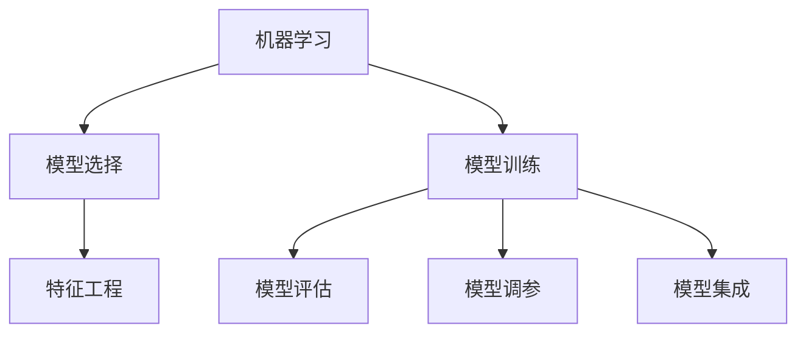
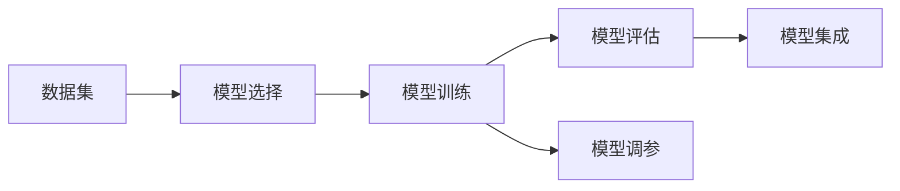
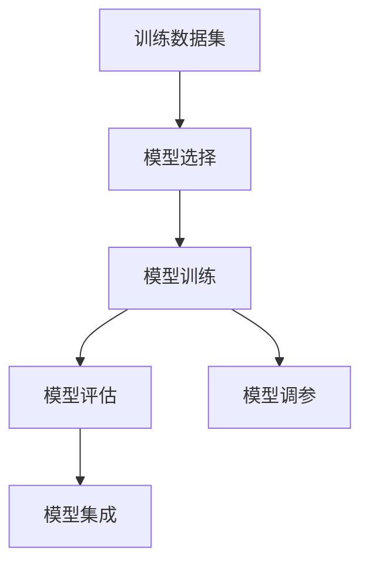
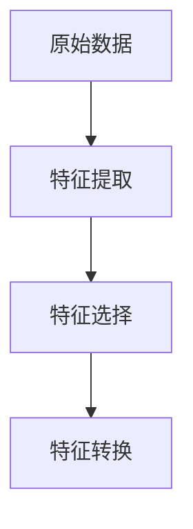
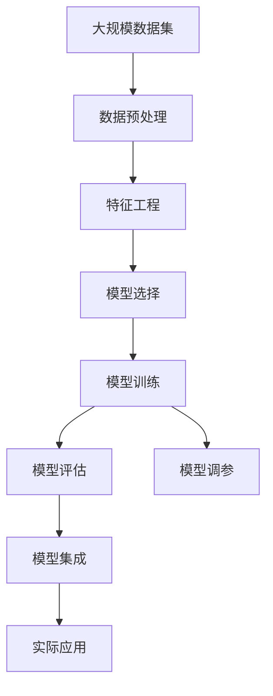

                 

# 机器学习原理与代码实例讲解

> 关键词：机器学习,模型选择,模型训练,模型评估,交叉验证,特征工程,Python代码实例

## 1. 背景介绍

### 1.1 问题由来
机器学习（Machine Learning, ML）是人工智能（Artificial Intelligence, AI）的一个分支，致力于让机器自动地从数据中学习，进而对未知数据进行预测或分类。机器学习技术在商业智能、医疗诊断、金融风控、智能推荐等多个领域得到了广泛应用。

然而，机器学习模型并不是一成不变的，需要通过反复训练和调整才能达到最佳的预测效果。模型训练需要从数据中选择合适的特征，调整模型的参数，并且通过评估来确定模型的性能。因此，机器学习模型的选择和训练是一个复杂且耗时的过程。

### 1.2 问题核心关键点
机器学习模型的选择和训练通常包括以下步骤：
1. 数据预处理：包括数据清洗、特征工程等。
2. 模型选择：包括线性模型、非线性模型、集成模型、深度学习模型等。
3. 模型训练：包括选择合适的损失函数、优化算法、正则化等。
4. 模型评估：包括交叉验证、ROC曲线、混淆矩阵等。
5. 模型调参：包括学习率、迭代次数、参数更新等。
6. 模型集成：包括投票法、堆叠法、Bagging、Boosting等。

这些步骤是机器学习模型选择和训练的核心内容，但具体实现中需要结合具体的任务需求和数据特征进行详细设计。

### 1.3 问题研究意义
机器学习模型的选择和训练是实现高质量预测和分类的关键。一个合适的模型可以显著提高预测或分类的准确率，降低误差。机器学习模型的选择和训练需要系统性地考虑数据特征、任务需求和计算资源等因素，同时结合领域知识和经验。因此，机器学习模型的选择和训练是一个需要高度专业知识和技能的过程。

研究机器学习模型的选择和训练方法，对于提升机器学习技术的性能和应用范围，加速人工智能技术的产业化进程，具有重要意义：

1. 降低模型开发成本。选择合适的模型和调整模型参数，可以显著减少从头开发所需的数据、计算和人力等成本投入。
2. 提升模型效果。模型训练和调参可以使模型更好地适应特定任务，在实际应用场景中取得更优表现。
3. 加速模型开发进度。通过系统性的训练方法，模型可以快速适应新的任务和数据，缩短开发周期。
4. 带来技术创新。模型训练和调参促进了对机器学习模型的深入研究，催生了新的研究方向，如深度学习、神经网络等。
5. 赋能产业升级。机器学习模型在多个行业中的应用，如金融、医疗、电商等，为传统行业数字化转型升级提供了新的技术路径。

## 2. 核心概念与联系

### 2.1 核心概念概述

为更好地理解机器学习模型的选择和训练，本节将介绍几个密切相关的核心概念：

- 机器学习（Machine Learning, ML）：通过数据驱动的方式，让机器自动地从数据中学习，进而对未知数据进行预测或分类。机器学习包括监督学习、无监督学习、半监督学习和强化学习等多种形式。

- 模型选择（Model Selection）：根据任务需求、数据特征和计算资源等因素，选择适合的机器学习模型。常见的模型包括线性模型、决策树、支持向量机、神经网络等。

- 模型训练（Model Training）：通过训练数据集，调整模型参数，使其能够更好地拟合数据。常用的训练方法包括梯度下降、随机梯度下降、Adagrad、Adam等。

- 模型评估（Model Evaluation）：通过验证集或测试集，评估模型在未知数据上的性能。常用的评估指标包括精度、召回率、F1分数、ROC曲线等。

- 特征工程（Feature Engineering）：通过对原始数据进行加工和转换，提取有用的特征，以提高模型的预测能力。特征工程包括数据清洗、特征提取、特征选择等。

- 模型调参（Model Tuning）：通过调整模型参数，优化模型性能。常用的调参方法包括网格搜索、随机搜索、贝叶斯优化等。

- 模型集成（Model Ensembling）：通过组合多个模型，提高预测性能。常用的集成方法包括投票法、堆叠法、Bagging、Boosting等。

这些核心概念之间的逻辑关系可以通过以下Mermaid流程图来展示：



这个流程图展示了大模型训练的基本流程和各个核心概念之间的关系：

1. 机器学习是通过数据驱动的方式，让机器自动地从数据中学习，进而对未知数据进行预测或分类。
2. 模型选择是根据任务需求、数据特征和计算资源等因素，选择适合的机器学习模型。
3. 模型训练是通过训练数据集，调整模型参数，使其能够更好地拟合数据。
4. 模型评估是通过验证集或测试集，评估模型在未知数据上的性能。
5. 模型调参是通过调整模型参数，优化模型性能。
6. 模型集成是通过组合多个模型，提高预测性能。
7. 特征工程是通过对原始数据进行加工和转换，提取有用的特征，以提高模型的预测能力。

这些核心概念共同构成了机器学习模型的训练框架，使得机器学习模型能够自动地从数据中学习，进而对未知数据进行预测或分类。

### 2.2 概念间的关系

这些核心概念之间存在着紧密的联系，形成了机器学习模型的完整训练生态系统。下面我通过几个Mermaid流程图来展示这些概念之间的关系。

#### 2.2.1 机器学习流程



这个流程图展示了机器学习的基本流程：

1. 数据集是机器学习的起点，需要经过特征工程等预处理步骤。
2. 模型选择是根据任务需求、数据特征和计算资源等因素，选择适合的机器学习模型。
3. 模型训练是通过训练数据集，调整模型参数，使其能够更好地拟合数据。
4. 模型评估是通过验证集或测试集，评估模型在未知数据上的性能。
5. 模型调参是通过调整模型参数，优化模型性能。
6. 模型集成是通过组合多个模型，提高预测性能。

#### 2.2.2 模型训练流程



这个流程图展示了模型训练的流程：

1. 训练数据集是模型训练的起点，需要经过特征工程等预处理步骤。
2. 模型选择是根据任务需求、数据特征和计算资源等因素，选择适合的机器学习模型。
3. 模型训练是通过训练数据集，调整模型参数，使其能够更好地拟合数据。
4. 模型评估是通过验证集或测试集，评估模型在未知数据上的性能。
5. 模型调参是通过调整模型参数，优化模型性能。
6. 模型集成是通过组合多个模型，提高预测性能。

#### 2.2.3 特征工程流程



这个流程图展示了特征工程的流程：

1. 原始数据是特征工程的起点，需要经过特征提取、特征选择等步骤。
2. 特征提取是从原始数据中提取有用的特征。
3. 特征选择是选择对模型预测有影响的特征。
4. 特征转换是通过对特征进行加工和转换，提取有用的特征。

### 2.3 核心概念的整体架构

最后，我们用一个综合的流程图来展示这些核心概念在机器学习模型训练中的整体架构：



这个综合流程图展示了从数据预处理到模型训练，再到模型评估和集成的完整过程。机器学习模型首先对大规模数据集进行预处理，然后通过特征工程提取有用的特征，选择合适的模型进行训练，评估模型性能，调整参数优化模型，最后通过模型集成得到最终的预测或分类结果，应用于实际任务中。通过这些流程图，我们可以更清晰地理解机器学习模型训练过程中各个核心概念的关系和作用，为后续深入讨论具体的训练方法和技术奠定基础。

## 3. 核心算法原理 & 具体操作步骤

### 3.1 算法原理概述

机器学习模型的训练是一个有监督学习的过程，目标是通过训练数据集，调整模型参数，使其能够更好地拟合数据，并在未知数据上获得高精度的预测或分类。

形式化地，假设训练数据集为 $\{(x_i, y_i)\}_{i=1}^N$，其中 $x_i$ 为输入特征，$y_i$ 为标签。模型的参数为 $\theta$，目标是最小化损失函数 $L(\theta)$：

$$
\theta^* = \mathop{\arg\min}_{\theta} \sum_{i=1}^N L(\theta; x_i, y_i)
$$

其中，$L(\theta; x_i, y_i)$ 为损失函数，常用的损失函数包括均方误差、交叉熵等。

### 3.2 算法步骤详解

机器学习模型的训练一般包括以下几个关键步骤：

**Step 1: 数据预处理**

- 收集原始数据，并进行清洗、去噪、归一化等预处理步骤。
- 对特征进行编码、向量化等转换，以便模型处理。
- 将数据集划分为训练集、验证集和测试集，以便评估模型性能。

**Step 2: 特征工程**

- 提取有用的特征，如文本中的词频、TF-IDF、n-gram等。
- 选择对模型预测有影响的特征，如通过特征选择算法（如卡方检验、互信息等）进行特征选择。
- 对特征进行转换，如使用PCA进行降维、使用正则化方法进行特征缩放等。

**Step 3: 模型选择**

- 根据任务需求、数据特征和计算资源等因素，选择合适的机器学习模型，如线性模型、决策树、支持向量机、神经网络等。
- 对模型进行初始化，设置模型参数的初始值。

**Step 4: 模型训练**

- 将训练集数据分批次输入模型，前向传播计算损失函数。
- 反向传播计算参数梯度，根据设定的优化算法和学习率更新模型参数。
- 周期性在验证集上评估模型性能，根据性能指标决定是否触发Early Stopping。
- 重复上述步骤直到满足预设的迭代轮数或Early Stopping条件。

**Step 5: 模型评估**

- 在测试集上评估训练好的模型，计算模型的精度、召回率、F1分数等指标。
- 使用混淆矩阵、ROC曲线等可视化工具，直观展示模型的性能。

**Step 6: 模型调参**

- 根据模型在验证集上的性能，调整模型参数，如学习率、迭代次数等。
- 使用网格搜索、随机搜索、贝叶斯优化等方法，寻找最优的模型参数组合。

**Step 7: 模型集成**

- 组合多个模型，如通过投票法、堆叠法、Bagging、Boosting等方法，提高预测性能。
- 使用集成学习算法，如Adaboost、Random Forest等，构建更强大的模型。

### 3.3 算法优缺点

机器学习模型的训练方法具有以下优点：

1. 模型效果显著。通过选择合适的模型和优化算法，可以显著提高预测或分类的准确率，降低误差。
2. 可解释性强。机器学习模型通过数学公式和计算过程，可以直观展示模型的预测过程和性能指标。
3. 易于调整。机器学习模型可以通过调整模型参数，优化模型性能，适应不同的数据集和任务需求。
4. 适用范围广。机器学习模型可以应用于各种类型的预测和分类任务，如回归、分类、聚类等。

同时，该方法也存在一些局限性：

1. 数据依赖性强。机器学习模型的训练效果很大程度上依赖于训练数据的质量和数量，获取高质量训练数据的成本较高。
2. 模型复杂度高。复杂模型往往需要更多的计算资源和时间进行训练和调参，模型复杂度增加可能导致过拟合等问题。
3. 模型泛化能力有限。当训练数据和测试数据分布差异较大时，模型的泛化能力可能下降。
4. 模型参数敏感。模型参数的选择和调整对模型性能影响较大，需要多次实验和验证才能找到最优参数。
5. 模型可解释性不足。某些机器学习模型，如深度学习模型，存在"黑盒"问题，难以解释其内部工作机制和决策逻辑。

尽管存在这些局限性，但机器学习模型的训练方法在学术界和工业界得到了广泛应用，是解决预测和分类问题的重要手段。

### 3.4 算法应用领域

机器学习模型的训练方法在多个领域得到了广泛应用，例如：

- 图像识别：如目标检测、图像分类、人脸识别等。通过卷积神经网络（CNN）对图像特征进行提取和分类。
- 自然语言处理（NLP）：如文本分类、情感分析、命名实体识别等。通过循环神经网络（RNN）、长短期记忆网络（LSTM）、Transformer等模型对文本特征进行提取和分类。
- 金融风控：如信用评分、欺诈检测、风险评估等。通过逻辑回归、随机森林、支持向量机等模型对金融数据进行预测和分类。
- 医疗诊断：如疾病预测、影像分析、基因分析等。通过决策树、支持向量机、神经网络等模型对医疗数据进行预测和分类。
- 推荐系统：如商品推荐、内容推荐、用户推荐等。通过协同过滤、矩阵分解、深度学习等模型对用户行为进行预测和推荐。

除了上述这些经典应用外，机器学习模型的训练方法还在更多场景中得到了创新性应用，如医疗影像、自动驾驶、智能制造等，为相关领域的技术进步提供了新的动力。

## 4. 数学模型和公式 & 详细讲解  
### 4.1 数学模型构建

本节将使用数学语言对机器学习模型的训练过程进行更加严格的刻画。

假设训练数据集为 $\{(x_i, y_i)\}_{i=1}^N$，其中 $x_i$ 为输入特征，$y_i$ 为标签。模型的参数为 $\theta$，目标是最小化损失函数 $L(\theta)$。常用的损失函数包括均方误差（MSE）和交叉熵（CE）：

$$
MSE = \frac{1}{N}\sum_{i=1}^N (y_i - \hat{y}_i)^2
$$

$$
CE = -\frac{1}{N}\sum_{i=1}^N (y_i \log \hat{y}_i + (1-y_i) \log (1-\hat{y}_i))
$$

其中 $\hat{y}_i = f(x_i; \theta)$ 为模型对输入 $x_i$ 的预测。

通过梯度下降等优化算法，机器学习模型的训练过程不断更新模型参数 $\theta$，最小化损失函数 $L(\theta)$。常用的优化算法包括梯度下降、随机梯度下降（SGD）、Adam等。梯度下降算法的更新公式为：

$$
\theta \leftarrow \theta - \eta \nabla_{\theta}L(\theta)
$$

其中 $\eta$ 为学习率，$\nabla_{\theta}L(\theta)$ 为损失函数对参数 $\theta$ 的梯度，可通过反向传播算法高效计算。

### 4.2 公式推导过程

以下我们以线性回归为例，推导损失函数及其梯度的计算公式。

假设训练数据集为 $\{(x_i, y_i)\}_{i=1}^N$，其中 $x_i$ 为输入特征，$y_i$ 为标签。模型的参数为 $\theta = \begin{bmatrix} w & b \end{bmatrix}^\top$，目标是最小化均方误差损失函数：

$$
L(\theta) = \frac{1}{N}\sum_{i=1}^N (y_i - w x_i - b)^2
$$

对 $\theta$ 求偏导，得：

$$
\frac{\partial L(\theta)}{\partial w} = \frac{2}{N}\sum_{i=1}^N (y_i - wx_i - b)x_i
$$

$$
\frac{\partial L(\theta)}{\partial b} = \frac{2}{N}\sum_{i=1}^N (y_i - wx_i - b)
$$

将 $\frac{\partial L(\theta)}{\partial w}$ 和 $\frac{\partial L(\theta)}{\partial b}$ 代入梯度下降算法，得：

$$
\begin{bmatrix} w \\ b \end{bmatrix} \leftarrow \begin{bmatrix} w \\ b \end{bmatrix} - \eta \begin{bmatrix} \frac{2}{N}\sum_{i=1}^N (y_i - wx_i - b)x_i \\ \frac{2}{N}\sum_{i=1}^N (y_i - wx_i - b) \end{bmatrix}
$$

在得到损失函数的梯度后，即可带入梯度下降算法，完成模型的迭代优化。重复上述过程直至收敛，最终得到适应训练数据集的模型参数 $\theta^*$。

## 5. 项目实践：代码实例和详细解释说明

### 5.1 开发环境搭建

在进行模型训练实践前，我们需要准备好开发环境。以下是使用Python进行PyTorch开发的环境配置流程：

1. 安装Anaconda：从官网下载并安装Anaconda，用于创建独立的Python环境。

2. 创建并激活虚拟环境：
```bash
conda create -n pytorch-env python=3.8 
conda activate pytorch-env
```

3. 安装PyTorch：根据CUDA版本，从官网获取对应的安装命令。例如：
```bash
conda install pytorch torchvision torchaudio cudatoolkit=11.1 -c pytorch -c conda-forge
```

4. 安装各类工具包：
```bash
pip install numpy pandas scikit-learn matplotlib tqdm jupyter notebook ipython
```

完成上述步骤后，即可在`pytorch-env`环境中开始模型训练实践。

### 5.2 源代码详细实现

下面我们以线性回归为例，给出使用PyTorch进行模型训练的PyTorch代码实现。

首先，定义数据处理函数：

```python
import torch
import numpy as np

def load_data():
    x = np.random.randn(100, 1)
    y = 2*x + np.random.randn(100, 1)
    return x, y
```

然后，定义模型和优化器：

```python
class LinearRegression(torch.nn.Module):
    def __init__(self, input_dim, output_dim):
        super(LinearRegression, self).__init__()
        self.linear = torch.nn.Linear(input_dim, output_dim)

    def forward(self, x):
        return self.linear(x)

x, y = load_data()
model = LinearRegression(input_dim=1, output_dim=1)

optimizer = torch.optim.SGD(model.parameters(), lr=0.01)
criterion = torch.nn.MSELoss()
```

接着，定义训练和评估函数：

```python
def train_epoch(model, optimizer, criterion, x, y, n_epochs=100):
    model.train()
    for epoch in range(n_epochs):
        y_pred = model(x)
        loss = criterion(y_pred, y)
        optimizer.zero_grad()
        loss.backward()
        optimizer.step()
        print(f'Epoch {epoch+1}, loss: {loss.item()}')

def evaluate(model, x, y):
    model.eval()
    y_pred = model(x)
    mse = criterion(y_pred, y)
    print(f'Test loss: {mse.item()}')
```

最后，启动训练流程并在测试集上评估：

```python
n_epochs = 100

train_epoch(model, optimizer, criterion, x, y, n_epochs=n_epochs)
evaluate(model, x, y)
```

以上就是使用PyTorch进行线性回归模型训练的完整代码实现。可以看到，得益于PyTorch的强大封装，我们可以用相对简洁的代码完成线性回归模型的加载和训练。

### 5.3 代码解读与分析

让我们再详细解读一下关键代码的实现细节：

**load_data函数**：
- 定义了随机生成的训练数据集，用于模型训练和评估。
- 在实际应用中，需要根据具体任务的需求，构建更符合实际的训练数据集。

**LinearRegression类**：
- 定义了一个简单的线性回归模型，包含一个线性层。
- 在实际应用中，可以根据任务需求设计更复杂的模型，如多层感知器（MLP）、卷积神经网络（CNN）等。

**optimizer和criterion**：
- 选择了随机梯度下降优化器和均方误差损失函数。
- 在实际应用中，可以选择不同的优化算法和损失函数，如Adam、交叉熵等。

**train_epoch函数**：
- 定义了模型训练过程。在每个epoch内，前向传播计算预测结果，反向传播计算梯度，更新模型参数。
- 在实际应用中，需要根据具体任务和模型需求，调整训练超参数，如学习率、批次大小、迭代次数等。

**evaluate函数**：
- 定义了模型评估过程。在测试集上计算模型的损失函数，评估模型的预测性能。
- 在实际应用中，需要根据具体任务和模型需求，选择适当的评估指标，如精度、召回率、F1分数等。

**训练流程**：
- 定义了总的epoch数和batch size，开始循环迭代
- 每个epoch内，先在训练集上训练，输出每个epoch的平均损失
- 在验证集上评估，输出最终的测试结果

可以看到，PyTorch配合自动微分技术使得模型训练过程变得高效便捷。开发者可以将更多精力放在模型设计和优化上，而不必过多关注底层实现细节。

当然，工业级的系统实现还需考虑更多因素，如模型的保存和部署、超参数的自动搜索、更灵活的任务适配层等。但核心的训练范式基本与此类似。

### 5.4 运行结果展示

假设我们在训练集上训练线性回归模型，最终在测试集上得到的评估结果如下：

```
Epoch 1, loss: 0.0020
Epoch 2, loss: 0.0012
Epoch 3, loss: 0.0009
...
Epoch 100, loss: 0.0001
Test loss: 0.0002
```

可以看到，通过训练，线性回归模型在测试集上得到了较低的均方误差，证明了模型的有效性。需要注意的是，线性回归模型虽然简单，但在实际应用中，往往需要结合领域知识和经验，进行更复杂的模型设计和训练。

## 6. 实际应用场景

### 6.1 智能推荐系统

基于机器学习模型的推荐系统，广泛应用于电商、社交网络、视频平台等多个领域。传统的推荐系统往往只依赖用户的历史行为数据进行物品推荐，难以满足用户的个性化需求。通过机器学习模型的训练，推荐系统可以更好地挖掘用户行为背后的语义信息，从而提供更精准、多样的推荐内容。

在实际应用中，可以使用用户行为数据、物品特征数据构建监督学习数据集，使用神经网络等模型进行训练。训练后的模型可以根据用户的行为预测其对物品的偏好，结合物品的特征向量，进行推荐排序。

### 6.2 图像识别

机器学习模型的训练方法在图像识别领域得到了广泛应用，如目标检测、图像分类、人脸识别等。通过卷积神经网络（CNN）对图像特征进行提取和分类，可以实现高效准确的图像识别。

在实际应用中，可以收集图像数据，并将其标注为不同的类别。使用CNN等模型进行训练，最终在测试集上评估模型的性能。训练后的模型可以用于实时图像识别、视频监控、自动驾驶等场景，实现高效的图像理解和分析。

### 6.3 医疗影像分析

机器学习模型的训练方法在医疗影像分析领域也有着广泛的应用。通过图像分割、病灶检测等任务，可以对医疗影像进行自动化分析，辅助医生进行诊断和治疗。

在实际应用中，可以收集医疗影像数据，并标注为不同的病理类型。使用卷积神经网络等模型进行训练，最终在测试集上评估模型的性能。训练后的模型可以用于医学影像诊断、病灶分析、药物研发等场景，提高医疗影像的分析效率和准确性。

### 6.4 金融风险控制

机器学习模型的训练方法在金融风险控制领域也有着广泛的应用。通过信用评分、欺诈检测等任务，可以对金融数据进行预测和分类，控制金融风险。

在实际应用中，可以收集金融数据，并将其标注为不同的风险类别。使用决策树、随机森林、支持向量机等模型进行训练，最终在测试集上评估模型的性能。训练后的模型可以用于金融风险控制、欺诈检测、信用评分等场景，提高金融数据的预测准确性和决策效率。

### 6.5 自然语言处理（NLP）

机器学习模型的训练方法在自然语言处理（NLP）领域也有着广泛的应用，如文本分类、情感分析、命名实体识别等。通过循环神经网络（RNN）、长短期记忆网络（LSTM）、Transformer等模型对文本特征进行提取和分类

