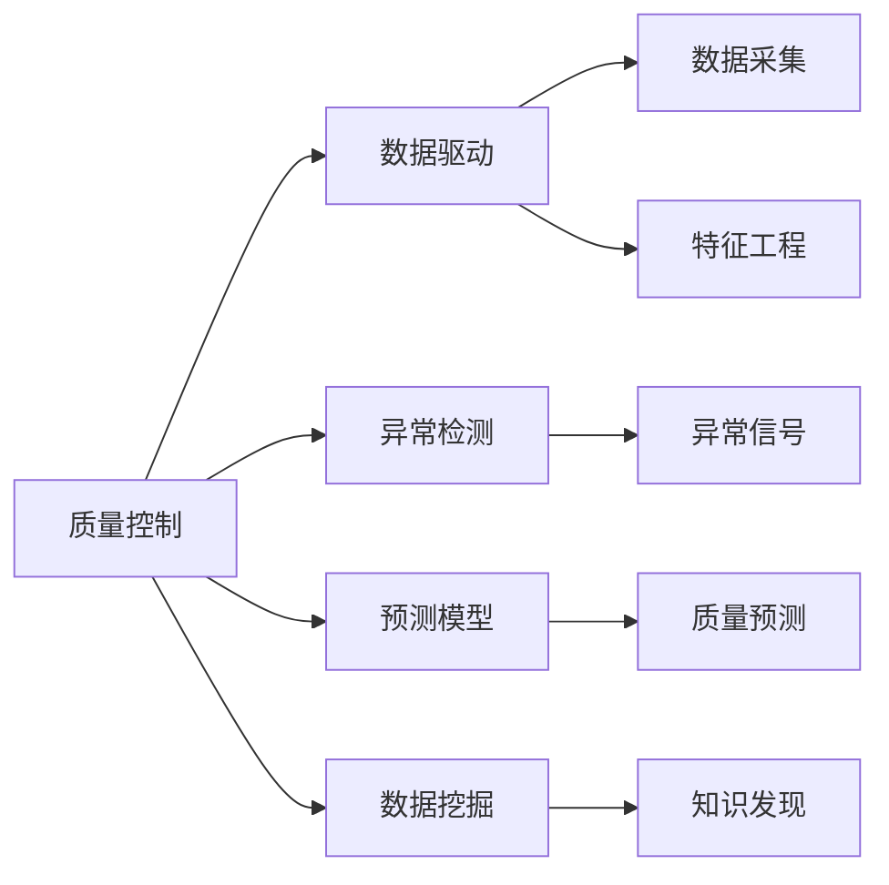

                 

# 机器学习在质量控制中的应用

> 关键词：
机器学习, 质量控制, 数据分析, 预测模型, 异常检测, 数据挖掘

## 1. 背景介绍

### 1.1 问题由来

在现代制造业和工业生产中，质量控制是保证产品符合规格、提高客户满意度的关键环节。传统的质量控制方法，如抽样检测、人工检验等，存在成本高、效率低、检验时间较长等诸多问题。随着信息技术的快速发展，越来越多的企业开始引入先进的数据分析技术，以提升质量控制水平，降低成本，提高效率。机器学习作为其中一种重要手段，以其高效、准确、智能的特点，受到越来越多企业的青睐。

### 1.2 问题核心关键点

机器学习在质量控制中的应用，主要体现在以下几个方面：

1. **数据驱动决策**：通过分析历史生产数据，机器学习可以发现产品生产中的潜在问题，预测质量变化趋势，为生产调整提供数据支持。
2. **异常检测**：利用机器学习算法，可以实时监控生产过程中的数据流，及时发现异常情况，避免次品产生，提高产品质量。
3. **故障诊断**：在设备运行过程中，机器学习模型可以识别出异常信号，预测设备故障，进行及时维修，减少停机时间。
4. **预测维护**：基于时间序列分析等机器学习技术，可以预测设备寿命和维护时间，提前进行设备维护，避免突发故障，降低生产成本。
5. **资源优化**：通过机器学习，可以优化生产过程，合理安排生产计划，提高生产效率，降低原材料浪费。

这些应用场景展示了机器学习在质量控制中的强大潜力。通过合理应用机器学习，企业可以有效提升产品质量，降低成本，提高效率，从而在激烈的市场竞争中获得优势。

## 2. 核心概念与联系

### 2.1 核心概念概述

为了更好地理解机器学习在质量控制中的应用，本节将介绍几个密切相关的核心概念：

1. **质量控制(Quality Control)**：在生产过程中，通过各种手段和方法，确保产品符合质量要求，满足客户需求的过程。
2. **数据驱动(数据驱动决策)**：利用历史数据进行建模分析，发现生产中的规律和异常，指导生产决策。
3. **异常检测(Anomaly Detection)**：通过算法识别出异常数据点，及时发现生产中的潜在问题。
4. **预测模型(Prediction Model)**：基于历史数据，建立预测模型，预测未来生产过程中的质量变化趋势。
5. **数据挖掘(Data Mining)**：从大量数据中挖掘出有用的信息，发现生产中的规律和异常，为质量控制提供数据支持。

这些核心概念之间存在着紧密的联系，构成了机器学习在质量控制中的基本框架。接下来，我们将通过Mermaid流程图展示这些概念之间的关系。



这个流程图展示了质量控制与数据驱动、异常检测、预测模型、数据挖掘之间的关系：

- 质量控制是目标，数据驱动、异常检测、预测模型、数据挖掘都是手段。
- 数据采集是基础，特征工程是数据预处理的关键步骤。
- 异常检测可以发现生产中的异常信号。
- 数据挖掘可以挖掘出有价值的信息。
- 数据驱动和预测模型则是通过历史数据建立模型，指导生产决策和预测未来质量变化趋势。

### 2.2 概念间的关系

这些核心概念之间存在着密切的联系，共同构成了机器学习在质量控制中的完整框架。

- **数据驱动与预测模型**：数据驱动通过历史数据分析，为预测模型提供数据基础，而预测模型则是数据驱动的延伸，通过建模预测未来质量变化。
- **异常检测与数据驱动**：异常检测通过实时监控数据流，发现异常情况，为数据驱动提供实时数据支持。
- **数据挖掘与异常检测**：数据挖掘从大量数据中发现生产中的规律和异常，为异常检测提供模式识别支持。
- **数据采集与特征工程**：数据采集是数据驱动和异常检测的基础，特征工程则是数据预处理的关键步骤。

这些概念之间的关系构成了机器学习在质量控制中的核心框架，帮助我们理解机器学习的应用过程。

## 3. 核心算法原理 & 具体操作步骤

### 3.1 算法原理概述

机器学习在质量控制中的应用，主要涉及数据采集、特征工程、模型训练和模型应用四个关键步骤。这些步骤构成了完整的质量控制流程，下面将逐一介绍。

1. **数据采集**：从生产过程中收集各种数据，包括温度、湿度、压力、电流等过程变量，以及产品质量检验结果等结果变量。这些数据可以用于后续的特征工程和模型训练。
2. **特征工程**：对采集到的数据进行预处理，包括数据清洗、特征提取、特征选择等步骤，将原始数据转化为模型训练所需的特征集。特征工程的好坏直接影响模型的训练效果。
3. **模型训练**：利用历史数据，选择适当的机器学习算法，建立预测模型。常见的算法包括回归模型、分类模型、异常检测模型等。
4. **模型应用**：将训练好的模型应用于实时生产数据流，进行质量预测、异常检测、故障诊断等应用。

### 3.2 算法步骤详解

#### 3.2.1 数据采集

数据采集是机器学习在质量控制中的第一步，数据的质量直接影响后续的模型训练效果。在实际应用中，数据采集需要考虑以下几个方面：

- **数据源选择**：根据生产过程中需要监测的参数，选择合适的传感器和数据采集设备。常见的传感器包括温度传感器、湿度传感器、压力传感器等。
- **数据采集频率**：根据生产速度和要求，选择合适的数据采集频率。一般采用高采样频率，以获得更详细的数据。
- **数据存储格式**：选择适当的数据存储格式，常见的格式包括CSV、JSON、HDF5等。

#### 3.2.2 特征工程

特征工程是机器学习中非常重要的一环，其目的是将原始数据转化为模型训练所需的特征集。常见的特征工程方法包括：

- **数据清洗**：去除缺失值、异常值、噪声等，保证数据的质量。
- **特征提取**：从原始数据中提取有用的特征，如时域特征、频域特征、统计特征等。
- **特征选择**：选择对预测目标有重要影响的特征，去除冗余特征，提高模型的泛化能力。
- **数据变换**：对数据进行归一化、标准化、离散化等变换，以提高模型的训练效果。

#### 3.2.3 模型训练

模型训练是机器学习在质量控制中的核心步骤，常见的机器学习算法包括：

- **回归模型**：用于预测产品质量等连续变量。常见的回归模型包括线性回归、多项式回归、决策树回归等。
- **分类模型**：用于分类生产过程中的异常情况。常见的分类模型包括逻辑回归、支持向量机、随机森林等。
- **异常检测模型**：用于实时监控生产过程中的异常情况。常见的异常检测模型包括孤立森林、局部异常因子、One-Class SVM等。

#### 3.2.4 模型应用

模型应用是将训练好的模型应用于实际生产数据的过程，常见的应用方法包括：

- **实时监控**：将模型集成到生产控制系统中，实时监控生产过程中的数据流，发现异常情况。
- **预测维护**：根据模型预测结果，进行设备维护和调整，避免突发故障，降低生产成本。
- **生产优化**：根据模型预测结果，优化生产计划，提高生产效率，降低原材料浪费。

### 3.3 算法优缺点

#### 3.3.1 优点

机器学习在质量控制中的应用具有以下优点：

- **高效性**：利用历史数据进行建模，可以快速发现生产中的问题，指导生产决策。
- **准确性**：机器学习算法可以自动发现生产中的规律和异常，提高质量控制的准确性。
- **智能性**：机器学习算法可以根据实时数据，动态调整预测模型，适应生产中的变化。
- **可扩展性**：机器学习算法可以应用于各种生产过程，具有广泛的应用场景。

#### 3.3.2 缺点

机器学习在质量控制中的应用也存在一些缺点：

- **数据质量依赖**：机器学习模型的效果依赖于历史数据的质量，如果数据存在缺失、噪声等问题，模型效果可能不佳。
- **模型解释性不足**：机器学习模型通常是黑盒模型，难以解释其内部工作机制，缺乏透明度。
- **模型泛化能力有限**：机器学习模型通常依赖于历史数据，对于新情况可能无法有效预测。
- **算法复杂度较高**：机器学习算法的实现复杂度较高，需要专业的数据科学家和工程师支持。

### 3.4 算法应用领域

机器学习在质量控制中的应用领域非常广泛，涵盖了各种生产过程和场景。以下是几个典型的应用领域：

- **制造业**：如汽车制造、电子制造、化工制造等，通过机器学习对生产过程中的质量进行实时监控和预测，提高生产效率，降低生产成本。
- **医疗行业**：如制药、医疗器械等，通过机器学习对生产过程中的质量进行监控和预测，确保产品质量符合标准。
- **农业生产**：如蔬菜种植、水果采摘等，通过机器学习对生产过程中的质量进行监控和预测，提高产品质量和生产效率。
- **服务行业**：如餐饮服务、物流配送等，通过机器学习对服务质量进行监控和预测，提高客户满意度和服务水平。

## 4. 数学模型和公式 & 详细讲解 & 举例说明

### 4.1 数学模型构建

在质量控制中，常见的数学模型包括回归模型、分类模型和异常检测模型。下面以线性回归模型为例，进行详细介绍。

假设生产过程中的质量变量 $Y$ 与过程变量 $X_1,X_2,\cdots,X_n$ 存在线性关系，可表示为：

$$ Y = \beta_0 + \beta_1 X_1 + \beta_2 X_2 + \cdots + \beta_n X_n + \epsilon $$

其中，$\beta_0,\beta_1,\cdots,\beta_n$ 为模型参数，$\epsilon$ 为误差项。

### 4.2 公式推导过程

线性回归模型的最小二乘估计公式为：

$$ \hat{\beta} = (X^TX)^{-1}X^TY $$

其中，$\hat{\beta}$ 为模型参数的估计值，$X^TX$ 为矩阵 $X^T$ 与 $X$ 的乘积，$X^TY$ 为矩阵 $X^T$ 与 $Y$ 的乘积。

### 4.3 案例分析与讲解

#### 4.3.1 案例背景

某汽车制造公司，生产过程中需要监测多个参数，如温度、压力、电流等，以确保产品质量。通过历史数据，建立线性回归模型，预测产品质量。

#### 4.3.2 数据采集

从生产线上采集多个参数，包括温度、压力、电流等，并记录生产时间、批次等标签信息。

#### 4.3.3 特征工程

对采集到的数据进行清洗、提取和选择，选择对产品质量有重要影响的特征，如温度、压力、电流等。

#### 4.3.4 模型训练

利用历史数据，建立线性回归模型，对产品质量进行预测。

#### 4.3.5 模型应用

将训练好的模型应用于实时生产数据流，进行质量预测和监控。

## 5. 项目实践：代码实例和详细解释说明

### 5.1 开发环境搭建

在进行质量控制项目实践前，我们需要准备好开发环境。以下是使用Python进行Scikit-learn开发的环境配置流程：

1. 安装Anaconda：从官网下载并安装Anaconda，用于创建独立的Python环境。

2. 创建并激活虚拟环境：
```bash
conda create -n sklearn-env python=3.8 
conda activate sklearn-env
```

3. 安装Scikit-learn：
```bash
pip install scikit-learn
```

4. 安装各类工具包：
```bash
pip install numpy pandas scikit-learn matplotlib tqdm jupyter notebook ipython
```

完成上述步骤后，即可在`sklearn-env`环境中开始质量控制实践。

### 5.2 源代码详细实现

这里我们以一个简单的线性回归模型为例，展示如何使用Scikit-learn进行质量控制应用。

首先，定义线性回归模型：

```python
from sklearn.linear_model import LinearRegression

model = LinearRegression()
```

然后，加载数据并进行特征工程：

```python
import pandas as pd

# 加载数据
data = pd.read_csv('data.csv')

# 特征选择
X = data[['temperature', 'pressure', 'current']]
y = data['quality']
```

接着，进行模型训练：

```python
# 划分训练集和测试集
from sklearn.model_selection import train_test_split

X_train, X_test, y_train, y_test = train_test_split(X, y, test_size=0.2, random_state=42)

# 训练模型
model.fit(X_train, y_train)
```

最后，进行模型评估：

```python
# 评估模型
from sklearn.metrics import mean_squared_error, r2_score

y_pred = model.predict(X_test)
mse = mean_squared_error(y_test, y_pred)
r2 = r2_score(y_test, y_pred)

print(f'Mean Squared Error: {mse:.3f}')
print(f'R-squared: {r2:.3f}')
```

以上代码展示了如何使用Scikit-learn进行简单的线性回归模型训练和评估。实际应用中，可能需要更复杂的模型选择、特征工程和优化技巧。

### 5.3 代码解读与分析

让我们再详细解读一下关键代码的实现细节：

**特征选择**：
- 在实际应用中，需要根据生产过程中的参数选择对产品质量有重要影响的特征，如温度、压力、电流等。特征选择的方法包括方差选择、相关性分析、LASSO回归等。

**模型训练**：
- 在模型训练中，通常需要划分训练集和测试集，并进行交叉验证。交叉验证方法包括k折交叉验证、留一交叉验证等。

**模型评估**：
- 在模型评估中，常用的指标包括均方误差(MSE)、均方根误差(RMSE)、决定系数(R-squared)等。需要根据具体任务选择合适的评估指标。

## 6. 实际应用场景

### 6.1 智能制造

智能制造是工业4.0的重要组成部分，通过引入先进的物联网技术和大数据分析技术，实现对生产过程的全面监控和优化。机器学习在智能制造中的应用场景包括：

- **质量监控**：利用机器学习算法实时监控生产过程中的数据流，发现异常情况，避免次品产生。
- **预测维护**：通过时间序列分析等机器学习技术，预测设备寿命和维护时间，提前进行设备维护，避免突发故障。
- **资源优化**：通过机器学习算法优化生产计划，合理安排生产资源，提高生产效率，降低原材料浪费。

### 6.2 智能农业

智能农业是现代农业发展的重要方向，通过引入物联网技术和大数据分析技术，实现对农业生产过程的全面监控和优化。机器学习在智能农业中的应用场景包括：

- **农作物生长监控**：利用机器学习算法对农作物的生长状态进行实时监控，发现异常情况，及时采取措施。
- **农作物病虫害预测**：通过机器学习算法预测农作物病虫害的发生情况，提前采取防治措施，提高农作物的产量和质量。
- **土壤肥力监测**：利用机器学习算法监测土壤肥力，指导施肥和灌溉，提高农作物生长效率。

### 6.3 智能医疗

智能医疗是医疗领域的重要方向，通过引入物联网技术和大数据分析技术，实现对医疗过程的全面监控和优化。机器学习在智能医疗中的应用场景包括：

- **疾病预测**：利用机器学习算法对患者的健康状况进行预测，提前采取预防措施，降低疾病发生率。
- **患者康复监测**：通过机器学习算法对患者的康复过程进行监控，发现异常情况，及时采取措施，提高康复效果。
- **药品研发**：利用机器学习算法对新药的研发过程进行预测和优化，提高新药研发的效率和成功率。

### 6.4 未来应用展望

随着机器学习技术的不断发展，其在质量控制中的应用也将更加广泛和深入。未来，机器学习将在以下几个方面进一步发展：

- **深度学习**：深度学习算法具有更强的建模能力和泛化能力，未来将更多地应用于质量控制领域。
- **联邦学习**：联邦学习可以在不共享数据的情况下，进行模型训练和优化，提高数据安全性和模型隐私性。
- **实时性**：随着边缘计算和云计算技术的发展，机器学习算法将具备更强的实时性，支持实时监控和决策。
- **自适应性**：自适应机器学习算法可以根据实时数据动态调整模型参数，提高模型的鲁棒性和适应性。

## 7. 工具和资源推荐

### 7.1 学习资源推荐

为了帮助开发者系统掌握机器学习在质量控制中的应用，这里推荐一些优质的学习资源：

1. **Scikit-learn官方文档**：Scikit-learn库的官方文档，提供了丰富的机器学习算法和应用示例，是学习机器学习的必备资源。

2. **《Python机器学习》书籍**：机器学习领域的经典教材，详细介绍了机器学习算法的基本原理和应用方法，适合入门学习。

3. **Kaggle平台**：Kaggle是一个数据科学竞赛平台，提供大量的机器学习实践项目和数据集，可以帮助开发者提升实战能力。

4. **Coursera平台**：Coursera是一个在线学习平台，提供大量的机器学习课程和讲座，适合深入学习。

5. **GitHub开源项目**：GitHub是一个代码托管平台，提供大量的机器学习项目和代码，可以帮助开发者学习和借鉴。

通过对这些资源的学习实践，相信你一定能够快速掌握机器学习在质量控制中的应用，并用于解决实际的工业问题。

### 7.2 开发工具推荐

高效的开发离不开优秀的工具支持。以下是几款用于机器学习在质量控制中开发的常用工具：

1. Jupyter Notebook：一个交互式的编程环境，支持Python、R等语言，适合数据分析和机器学习建模。

2. TensorFlow：由Google主导开发的深度学习框架，支持GPU计算，适合大规模深度学习模型的训练和推理。

3. PyTorch：一个灵活的深度学习框架，支持动态计算图，适合研究和原型开发。

4. Scikit-learn：一个基于Python的机器学习库，支持多种算法和工具，适合数据分析和机器学习建模。

5. Weights & Biases：一个实验跟踪工具，可以记录和可视化模型训练过程中的各项指标，方便对比和调优。

6. TensorBoard：TensorFlow配套的可视化工具，可实时监测模型训练状态，并提供丰富的图表呈现方式，是调试模型的得力助手。

合理利用这些工具，可以显著提升机器学习在质量控制中的开发效率，加快创新迭代的步伐。

### 7.3 相关论文推荐

机器学习在质量控制中的应用源于学界的持续研究。以下是几篇奠基性的相关论文，推荐阅读：

1. **《数据挖掘与统计学习：理论、算法与应用》**：这本书详细介绍了数据挖掘和统计学习的理论、算法和应用，是学习机器学习的重要参考。

2. **《机器学习实战》**：这本书介绍了机器学习的基本算法和应用，适合实践开发者参考。

3. **《深度学习》**：这本书介绍了深度学习的基本原理和应用，是深度学习领域的经典教材。

4. **《机器学习实战指南》**：这本书介绍了机器学习在实际应用中的方法和技巧，适合应用开发者参考。

5. **《数据科学入门》**：这本书介绍了数据科学的基本概念和方法，适合初学者入门。

这些论文代表了大语言模型微调技术的发展脉络。通过学习这些前沿成果，可以帮助研究者把握学科前进方向，激发更多的创新灵感。

除上述资源外，还有一些值得关注的前沿资源，帮助开发者紧跟机器学习在质量控制中的最新进展，例如：

1. arXiv论文预印本：人工智能领域最新研究成果的发布平台，包括大量尚未发表的前沿工作，学习前沿技术的必读资源。

2. 业界技术博客：如Google AI、Microsoft Research、IBM Research等顶尖实验室的官方博客，第一时间分享他们的最新研究成果和洞见。

3. 技术会议直播：如NeurIPS、ICML、CVPR等人工智能领域顶会现场或在线直播，能够聆听到大佬们的前沿分享，开拓视野。

4. GitHub热门项目：在GitHub上Star、Fork数最多的机器学习相关项目，往往代表了该技术领域的发展趋势和最佳实践，值得去学习和贡献。

5. 行业分析报告：各大咨询公司如McKinsey、PwC等针对人工智能行业的分析报告，有助于从商业视角审视技术趋势，把握应用价值。

总之，对于机器学习在质量控制技术的学习和实践，需要开发者保持开放的心态和持续学习的意愿。多关注前沿资讯，多动手实践，多思考总结，必将收获满满的成长收益。

## 8. 总结：未来发展趋势与挑战

### 8.1 总结

本文对机器学习在质量控制中的应用进行了全面系统的介绍。首先阐述了机器学习在质量控制中的背景和意义，明确了机器学习在质量控制中的重要价值。其次，从原理到实践，详细讲解了机器学习在质量控制中的应用过程，给出了质量控制任务开发的完整代码实例。同时，本文还广泛探讨了机器学习在智能制造、智能农业、智能医疗等多个行业领域的应用前景，展示了机器学习在质量控制中的强大潜力。最后，本文精选了机器学习在质量控制中的学习资源和开发工具，力求为读者提供全方位的技术指引。

通过本文的系统梳理，可以看到，机器学习在质量控制中的高效性、准确性和智能性，使其成为现代制造业和工业生产中不可或缺的重要手段。未来，伴随机器学习技术的不断演进，质量控制将迈向更智能、更高效、更可靠的方向发展。

### 8.2 未来发展趋势

展望未来，机器学习在质量控制中的应用将呈现以下几个发展趋势：

1. **深度学习的应用**：深度学习算法具有更强的建模能力和泛化能力，未来将更多地应用于质量控制领域。
2. **联邦学习的应用**：联邦学习可以在不共享数据的情况下，进行模型训练和优化，提高数据安全性和模型隐私性。
3. **实时性**：随着边缘计算和云计算技术的发展，机器学习算法将具备更强的实时性，支持实时监控和决策。
4. **自适应性**：自适应机器学习算法可以根据实时数据动态调整模型参数，提高模型的鲁棒性和适应性。
5. **跨领域应用**：机器学习将在更多领域得到应用，如农业、医疗、金融等，为不同领域带来新的变革。

### 8.3 面临的挑战

尽管机器学习在质量控制中已经取得了显著成效，但在迈向更加智能化、普适化应用的过程中，仍面临诸多挑战：

1. **数据质量问题**：机器学习模型的效果依赖于高质量的数据，而实际生产中的数据往往存在缺失、噪声等问题。如何获取高质量的数据，提高数据质量，是质量控制中的重要挑战。
2. **算法复杂性**：机器学习算法的实现复杂度较高，需要专业的数据科学家和工程师支持。如何在实际应用中简化算法，提高模型效率，是质量控制中的重要课题。
3. **模型解释性不足**：机器学习模型通常是黑盒模型，难以解释其内部工作机制，缺乏透明度。如何在实际应用中提高模型解释性，增强模型的可信度，是质量控制中的重要挑战。
4. **数据隐私和安全**：在数据采集和共享过程中，如何保护数据隐私和安全，防止数据泄露，是质量控制中的重要课题。

### 8.4 研究展望

面对机器学习在质量控制中面临的挑战，未来的研究需要在以下几个方面寻求新的突破：

1. **数据采集和处理**：开发更加高效的数据采集和处理技术，确保数据的质量和完整性，提高模型训练效果。
2. **算法优化和简化**：简化机器学习算法的实现过程，提高算法的效率和可解释性，降低对专业人才的依赖。
3. **模型解释和透明化**：研究如何提高机器学习模型的解释性和透明度，增强模型的可信度，满足监管和伦理要求。
4. **数据隐私和安全**：研究如何保护数据隐私和安全，防止数据泄露，确保数据和模型的安全性。

这些研究方向将引领机器学习在质量控制技术迈向更高的台阶，为构建更加智能、可靠、安全的质量控制系统铺平道路。面向未来，机器学习需要与其他先进技术如物联网、边缘计算等进行更深入的融合，共同推动质量控制技术的进步。

## 9. 附录：常见问题与解答

**Q1：机器学习在质量控制中的应用效果如何？**

A: 机器学习在质量控制中的应用效果显著。通过历史数据的分析和建模，机器学习可以发现生产中的潜在问题，预测质量变化趋势，指导生产决策。利用异常检测算法，可以实时监控生产过程中的数据流，及时发现异常情况，避免次品产生。通过预测模型，可以预测设备寿命和维护时间，提前进行设备维护，减少停机时间，降低生产成本。总之，机器学习在质量控制中的应用可以显著提升产品质量，降低成本，提高效率。

**Q2：如何选择合适的机器学习算法？**

A: 选择合适的机器学习算法需要考虑以下几个方面：

1. **任务类型**：根据任务类型选择合适的算法，如回归、分类、异常检测等。
2. **数据类型**：根据数据类型选择合适的算法，如时间序列数据适合ARIMA等算法，图像数据适合CNN等算法。
3. **数据量**：根据数据量选择合适的算法，如小数据集适合决策树、线性回归等算法，大数据集适合深度学习等算法。
4. **性能要求**：根据性能要求选择合适的算法，如实时性要求高的任务适合轻量级算法，如LSTM等，复杂性要求高的任务适合深度学习算法，如CNN

