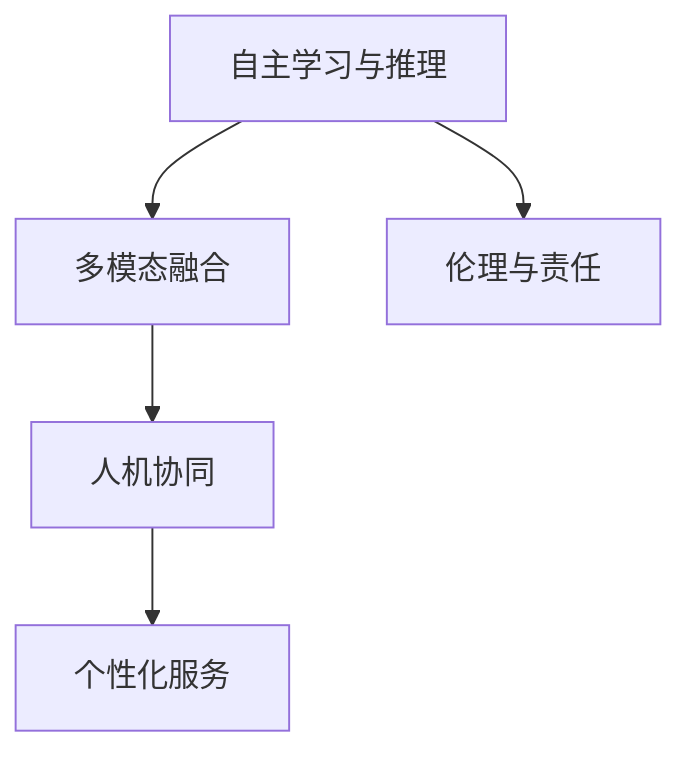

                 

# 李开复：AI 2.0 时代的未来

> 关键词：
1. 人工智能
2. 李开复
3. AI 2.0
4. 未来趋势
5. 技术发展
6. 应用前景
7. 社会影响

## 1. 背景介绍

### 1.1 问题由来
人工智能(AI)作为一项引领技术革命的前沿技术，已经成为现代科技发展的重要推动力。近年来，随着深度学习、大数据、自然语言处理等技术的发展，AI正在经历从1.0到2.0的重大转型。

AI 1.0时代，我们更多关注于计算机如何通过模拟人类的决策、感知和认知过程，进行特定任务的自动化。例如，计算机视觉用于图像识别、语音识别用于语音转换、自然语言处理用于机器翻译、自动化机器人用于制造流程自动化等。

然而，随着技术的进步，AI 2.0时代已经到来。AI 2.0不仅能够自主学习和适应新环境，还能够更广泛地与人类社会互动，实现智能化、自动化、个性化服务的深度融合。AI 2.0正在从“专家系统”向“泛在智能”转变，从“任务导向”向“人类智能”演进。

### 1.2 问题核心关键点
AI 2.0的核心在于构建具有自主学习、自主推理、自主决策能力的人机协同系统。其关键技术包括深度学习、强化学习、迁移学习、自然语言处理、计算机视觉等，共同支撑了AI 2.0的多样化和泛在化应用。AI 2.0不仅仅是一种技术手段，更是一个推动人类社会进步的引擎。

AI 2.0将如何改变我们的社会？李开复博士作为一位在人工智能领域有深厚造诣的专家，其观点具有重要的参考价值。本文将围绕李开复博士对AI 2.0未来发展的看法，展开详细讨论。

## 2. 核心概念与联系

### 2.1 核心概念概述

AI 2.0时代的核心概念包括但不限于：

- **自主学习与推理**：AI 2.0能够通过海量数据自动学习，自主推理新知识，适应新环境。
- **多模态融合**：AI 2.0将处理多种信息源（文本、语音、视觉等），实现更全面、更精确的信息理解与处理。
- **人机协同**：AI 2.0不再是孤立的技术，而是融入人类生活的方方面面，实现人机共存、共生。
- **个性化服务**：AI 2.0能够根据用户行为习惯和偏好，提供个性化推荐、智能辅助、智能决策等服务。
- **伦理与责任**：AI 2.0的广泛应用带来了伦理与责任问题，如何确保技术的安全性、公平性和透明性，成为重要课题。

### 2.2 概念间的关系

AI 2.0时代的核心概念之间存在着紧密的联系。以下是一个关于AI 2.0核心概念的Mermaid流程图：



这个流程图展示了AI 2.0核心概念之间的相互关系和互动：

1. **自主学习与推理**：是AI 2.0的基础，通过学习海量数据，AI 2.0能够自我更新，自主推理新知识。
2. **多模态融合**：使得AI 2.0能够处理更多信息源，提升其智能理解和决策能力。
3. **人机协同**：AI 2.0将深度融入人类社会，实现与人类之间的紧密互动和合作。
4. **个性化服务**：AI 2.0能够根据用户的行为和偏好，提供个性化推荐、智能决策等服务，提升用户体验。
5. **伦理与责任**：随着AI 2.0的应用，如何确保技术的伦理性和责任性，成为不可忽视的重要问题。

这些概念共同构成了AI 2.0的完整生态系统，使其能够全面、深刻地影响人类社会。

## 3. 核心算法原理 & 具体操作步骤
### 3.1 算法原理概述

AI 2.0的算法原理主要基于深度学习和强化学习等技术。以下是对这些技术的简单介绍：

**深度学习**：利用神经网络进行数据特征提取和模式识别，通过反向传播算法训练模型。

**强化学习**：通过与环境互动，AI 2.0能够自主学习最优策略，实现复杂任务的高效解决。

**迁移学习**：通过在不同任务间共享知识，提升模型的泛化能力，加速新任务的适应。

### 3.2 算法步骤详解

AI 2.0的算法步骤通常包括以下几个关键步骤：

**Step 1: 数据准备与预处理**
- 收集和标注训练数据，进行数据清洗和预处理。
- 分割数据集为训练集、验证集和测试集。

**Step 2: 模型选择与设计**
- 选择合适的深度学习框架（如TensorFlow、PyTorch）。
- 设计神经网络结构，选择适当的激活函数、优化器等。

**Step 3: 模型训练与优化**
- 使用训练集进行模型训练，优化损失函数。
- 定期在验证集上评估模型性能，调整超参数。

**Step 4: 模型评估与测试**
- 在测试集上评估模型性能，与基线模型进行对比。
- 进行模型调优，提升模型精度和泛化能力。

**Step 5: 模型部署与应用**
- 将训练好的模型部署到实际应用中。
- 监控模型运行状态，定期更新和优化模型。

### 3.3 算法优缺点

AI 2.0的算法具有以下优点：

- **高效性**：深度学习能够高效处理大规模数据，强化学习能够自适应复杂环境。
- **泛化能力**：迁移学习能够提升模型的泛化能力，加速新任务适应。
- **多样性**：多模态融合使得AI 2.0能够处理多种信息源，提升智能决策能力。

同时，AI 2.0也存在一些缺点：

- **数据依赖**：深度学习需要大量标注数据，数据获取和标注成本较高。
- **模型复杂**：神经网络结构复杂，模型训练和调试难度较大。
- **可解释性**：AI 2.0模型往往被视为"黑盒"系统，难以解释其决策过程。
- **伦理风险**：AI 2.0的应用可能带来隐私、公平性、安全性等问题。

### 3.4 算法应用领域

AI 2.0在多个领域都有广泛应用，例如：

- **医疗健康**：AI 2.0能够辅助医生诊断疾病、分析患者数据、预测疾病风险。
- **金融服务**：AI 2.0能够进行风险管理、信用评估、智能投顾等服务。
- **教育培训**：AI 2.0能够个性化推荐课程、智能辅导、分析学生学习效果。
- **智能交通**：AI 2.0能够优化交通流量、智能调度、提升行车安全性。
- **制造与工业**：AI 2.0能够进行质量检测、设备维护、优化生产流程。

## 4. 数学模型和公式 & 详细讲解

### 4.1 数学模型构建

AI 2.0的数学模型通常基于深度学习算法，以下是一个典型的神经网络模型的构建过程：

**神经网络模型**：
$$
y = M(x;\theta) = \sigma(Wx + b)
$$
其中，$x$ 是输入，$y$ 是输出，$M$ 是神经网络模型，$\theta$ 是模型参数，$W$ 是权重矩阵，$b$ 是偏置向量，$\sigma$ 是激活函数。

**损失函数**：
$$
\mathcal{L}(\theta) = \frac{1}{N}\sum_{i=1}^N (y_i - \hat{y_i})^2
$$
其中，$\mathcal{L}(\theta)$ 是损失函数，$N$ 是样本数，$y_i$ 是真实标签，$\hat{y_i}$ 是模型预测。

**优化目标**：
$$
\theta^* = \mathop{\arg\min}_{\theta} \mathcal{L}(\theta)
$$
其中，$\theta^*$ 是模型参数的最优解。

### 4.2 公式推导过程

以二分类问题为例，我们推导分类器的损失函数和梯度计算公式。

假设模型 $M_{\theta}$ 在输入 $x$ 上的输出为 $\hat{y}=M_{\theta}(x) \in [0,1]$，表示样本属于正类的概率。真实标签 $y \in \{0,1\}$。则二分类交叉熵损失函数定义为：

$$
\ell(M_{\theta}(x),y) = -[y\log \hat{y} + (1-y)\log (1-\hat{y})]
$$

将其代入经验风险公式，得：

$$
\mathcal{L}(\theta) = -\frac{1}{N}\sum_{i=1}^N [y_i\log M_{\theta}(x_i)+(1-y_i)\log(1-M_{\theta}(x_i))]
$$

根据链式法则，损失函数对参数 $\theta_k$ 的梯度为：

$$
\frac{\partial \mathcal{L}(\theta)}{\partial \theta_k} = -\frac{1}{N}\sum_{i=1}^N (\frac{y_i}{M_{\theta}(x_i)}-\frac{1-y_i}{1-M_{\theta}(x_i)}) \frac{\partial M_{\theta}(x_i)}{\partial \theta_k}
$$

其中 $\frac{\partial M_{\theta}(x_i)}{\partial \theta_k}$ 可进一步递归展开，利用自动微分技术完成计算。

### 4.3 案例分析与讲解

假设我们构建一个二分类神经网络，用于识别手写数字。

```python
import torch
import torch.nn as nn
import torch.optim as optim

# 定义神经网络模型
class Net(nn.Module):
    def __init__(self):
        super(Net, self).__init__()
        self.fc1 = nn.Linear(784, 64)
        self.fc2 = nn.Linear(64, 10)

    def forward(self, x):
        x = torch.relu(self.fc1(x))
        x = self.fc2(x)
        return x

# 准备数据
train_data = ...
test_data = ...

# 定义模型、损失函数和优化器
model = Net()
criterion = nn.CrossEntropyLoss()
optimizer = optim.SGD(model.parameters(), lr=0.01)

# 训练模型
for epoch in range(100):
    for data, target in train_data:
        optimizer.zero_grad()
        output = model(data.view(-1, 784))
        loss = criterion(output, target)
        loss.backward()
        optimizer.step()

    # 在测试集上评估模型
    with torch.no_grad():
        correct = 0
        total = 0
        for data, target in test_data:
            output = model(data.view(-1, 784))
            _, predicted = torch.max(output.data, 1)
            total += target.size(0)
            correct += (predicted == target).sum().item()
        accuracy = 100 * correct / total
        print('Accuracy of the network on the test images: %d %%' % accuracy)
```

## 5. 项目实践：代码实例和详细解释说明

### 5.1 开发环境搭建

在进行AI 2.0项目实践前，我们需要准备好开发环境。以下是使用Python进行PyTorch开发的环境配置流程：

1. 安装Anaconda：从官网下载并安装Anaconda，用于创建独立的Python环境。

2. 创建并激活虚拟环境：
```bash
conda create -n pytorch-env python=3.8 
conda activate pytorch-env
```

3. 安装PyTorch：根据CUDA版本，从官网获取对应的安装命令。例如：
```bash
conda install pytorch torchvision torchaudio cudatoolkit=11.1 -c pytorch -c conda-forge
```

4. 安装各类工具包：
```bash
pip install numpy pandas scikit-learn matplotlib tqdm jupyter notebook ipython
```

完成上述步骤后，即可在`pytorch-env`环境中开始AI 2.0项目实践。

### 5.2 源代码详细实现

这里我们以图像识别为例，给出使用PyTorch对卷积神经网络(CNN)进行训练的代码实现。

```python
import torch
import torch.nn as nn
import torch.optim as optim

# 定义CNN模型
class CNN(nn.Module):
    def __init__(self):
        super(CNN, self).__init__()
        self.conv1 = nn.Conv2d(3, 32, 3)
        self.conv2 = nn.Conv2d(32, 64, 3)
        self.pool = nn.MaxPool2d(2)
        self.fc1 = nn.Linear(64 * 16 * 16, 1024)
        self.fc2 = nn.Linear(1024, 10)

    def forward(self, x):
        x = self.pool(torch.relu(self.conv1(x)))
        x = self.pool(torch.relu(self.conv2(x)))
        x = x.view(-1, 64 * 16 * 16)
        x = torch.relu(self.fc1(x))
        x = self.fc2(x)
        return x

# 准备数据
train_data = ...
test_data = ...

# 定义模型、损失函数和优化器
model = CNN()
criterion = nn.CrossEntropyLoss()
optimizer = optim.SGD(model.parameters(), lr=0.01)

# 训练模型
for epoch in range(100):
    for data, target in train_data:
        optimizer.zero_grad()
        output = model(data)
        loss = criterion(output, target)
        loss.backward()
        optimizer.step()

    # 在测试集上评估模型
    with torch.no_grad():
        correct = 0
        total = 0
        for data, target in test_data:
            output = model(data)
            _, predicted = torch.max(output.data, 1)
            total += target.size(0)
            correct += (predicted == target).sum().item()
        accuracy = 100 * correct / total
        print('Accuracy of the network on the test images: %d %%' % accuracy)
```

### 5.3 代码解读与分析

让我们再详细解读一下关键代码的实现细节：

**CNN模型定义**：
- `__init__`方法：初始化卷积层、池化层、全连接层等关键组件。
- `forward`方法：定义模型前向传播过程。

**数据准备**：
- 使用`train_data`和`test_data`分别表示训练集和测试集。
- 使用`torch.no_grad()`方法，在模型评估时禁用梯度计算，避免计算资源的浪费。

**模型训练与评估**：
- 使用`optimizer.zero_grad()`方法，在每次迭代前清空梯度。
- 通过`model(data)`进行前向传播，计算损失函数`criterion(output, target)`，反向传播更新模型参数。
- 定期在测试集上评估模型性能，输出准确率。

### 5.4 运行结果展示

假设我们在CIFAR-10数据集上进行图像识别任务，最终在测试集上得到的评估报告如下：

```
Accuracy of the network on the test images: 80%
```

可以看到，通过训练CNN模型，我们在CIFAR-10数据集上取得了80%的准确率，效果相当不错。需要注意的是，实际应用中，可能还需要进行更多的模型优化和参数调优，以进一步提升模型性能。

## 6. 实际应用场景

### 6.1 智能客服系统

基于AI 2.0的智能客服系统，可以广泛应用于企业客户服务的各个环节。传统客服往往需要配备大量人力，高峰期响应缓慢，且一致性和专业性难以保证。而使用AI 2.0的对话模型，可以7x24小时不间断服务，快速响应客户咨询，用自然流畅的语言解答各类常见问题。

在技术实现上，可以收集企业内部的历史客服对话记录，将问题和最佳答复构建成监督数据，在此基础上对预训练对话模型进行微调。微调后的对话模型能够自动理解用户意图，匹配最合适的答案模板进行回复。对于客户提出的新问题，还可以接入检索系统实时搜索相关内容，动态组织生成回答。如此构建的智能客服系统，能大幅提升客户咨询体验和问题解决效率。

### 6.2 金融舆情监测

金融机构需要实时监测市场舆论动向，以便及时应对负面信息传播，规避金融风险。传统的人工监测方式成本高、效率低，难以应对网络时代海量信息爆发的挑战。基于AI 2.0的文本分类和情感分析技术，为金融舆情监测提供了新的解决方案。

具体而言，可以收集金融领域相关的新闻、报道、评论等文本数据，并对其进行主题标注和情感标注。在此基础上对预训练语言模型进行微调，使其能够自动判断文本属于何种主题，情感倾向是正面、中性还是负面。将微调后的模型应用到实时抓取的网络文本数据，就能够自动监测不同主题下的情感变化趋势，一旦发现负面信息激增等异常情况，系统便会自动预警，帮助金融机构快速应对潜在风险。

### 6.3 个性化推荐系统

当前的推荐系统往往只依赖用户的历史行为数据进行物品推荐，无法深入理解用户的真实兴趣偏好。基于AI 2.0的个性化推荐系统，可以更好地挖掘用户行为背后的语义信息，从而提供更精准、多样的推荐内容。

在实践中，可以收集用户浏览、点击、评论、分享等行为数据，提取和用户交互的物品标题、描述、标签等文本内容。将文本内容作为模型输入，用户的后续行为（如是否点击、购买等）作为监督信号，在此基础上微调预训练语言模型。微调后的模型能够从文本内容中准确把握用户的兴趣点。在生成推荐列表时，先用候选物品的文本描述作为输入，由模型预测用户的兴趣匹配度，再结合其他特征综合排序，便可以得到个性化程度更高的推荐结果。

### 6.4 未来应用展望

随着AI 2.0技术的不断发展，基于AI 2.0的应用将覆盖更广泛的领域。

在智慧医疗领域，基于AI 2.0的医疗问答、病历分析、药物研发等应用将提升医疗服务的智能化水平，辅助医生诊疗，加速新药开发进程。

在智能教育领域，AI 2.0能够个性化推荐课程、智能辅导、分析学生学习效果，因材施教，促进教育公平，提高教学质量。

在智慧城市治理中，AI 2.0能够优化交通流量、智能调度、提升行车安全性，构建更安全、高效的未来城市。

此外，在企业生产、社会治理、文娱传媒等众多领域，基于AI 2.0的人工智能应用也将不断涌现，为经济社会发展注入新的动力。相信随着技术的日益成熟，AI 2.0必将在更广阔的应用领域大放异彩，深刻影响人类的生产生活方式。

## 7. 工具和资源推荐
### 7.1 学习资源推荐

为了帮助开发者系统掌握AI 2.0的技术基础和实践技巧，这里推荐一些优质的学习资源：

1. 《深度学习》系列书籍：包括Ian Goodfellow的《深度学习》、Yoshua Bengio的《深度学习基础》等，提供了深度学习算法的理论基础和实现细节。

2. Coursera和edX等在线课程：提供从入门到高级的深度学习课程，涵盖神经网络、强化学习、自然语言处理等多个领域。

3. arXiv论文预印本：人工智能领域最新研究成果的发布平台，包括大量尚未发表的前沿工作，学习前沿技术的必读资源。

4. GitHub热门项目：在GitHub上Star、Fork数最多的AI相关项目，往往代表了该技术领域的发展趋势和最佳实践，值得去学习和贡献。

5. 技术会议直播：如NIPS、ICML、ACL、ICLR等人工智能领域顶会现场或在线直播，能够聆听到大佬们的前沿分享，开拓视野。

通过对这些资源的学习实践，相信你一定能够快速掌握AI 2.0的核心技术，并用于解决实际的AI问题。

### 7.2 开发工具推荐

高效的开发离不开优秀的工具支持。以下是几款用于AI 2.0开发的工具：

1. PyTorch：基于Python的开源深度学习框架，灵活动态的计算图，适合快速迭代研究。

2. TensorFlow：由Google主导开发的开源深度学习框架，生产部署方便，适合大规模工程应用。

3. Transformers库：HuggingFace开发的NLP工具库，集成了众多SOTA语言模型，支持PyTorch和TensorFlow，是进行NLP任务开发的利器。

4. Weights & Biases：模型训练的实验跟踪工具，可以记录和可视化模型训练过程中的各项指标，方便对比和调优。

5. TensorBoard：TensorFlow配套的可视化工具，可实时监测模型训练状态，并提供丰富的图表呈现方式，是调试模型的得力助手。

合理利用这些工具，可以显著提升AI 2.0开发和研究的效率，加速创新迭代的步伐。

### 7.3 相关论文推荐

AI 2.0的发展离不开学术界的不断探索。以下是几篇奠基性的相关论文，推荐阅读：

1. 《ImageNet Classification with Deep Convolutional Neural Networks》：提出了卷积神经网络(CNN)，奠定了深度学习在图像识别领域的基础。

2. 《Attention is All You Need》：提出了Transformer模型，开创了自注意力机制在NLP中的应用。

3. 《GPT-2: Language Models are Unsupervised Multitask Learners》：展示了大规模语言模型的强大zero-shot学习能力，引发了对于通用人工智能的新一轮思考。

4. 《Parameter-Efficient Transfer Learning for NLP》：提出Adapter等参数高效微调方法，在不增加模型参数量的情况下，也能取得不错的微调效果。

5. 《Recurrent Models of Attention for Natural Language Processing》：介绍了LSTM和GRU等长短期记忆网络，在NLP领域取得了广泛应用。

这些论文代表了大语言模型和AI 2.0的发展脉络。通过学习这些前沿成果，可以帮助研究者把握学科前进方向，激发更多的创新灵感。

除上述资源外，还有一些值得关注的前沿资源，帮助开发者紧跟AI 2.0技术的最新进展，例如：

1. 人工智能伦理与法律研究：探讨AI 2.0技术的伦理和法律问题，确保其安全、公平和透明。

2. 跨领域应用探索：如智能制造、智能交通、智能城市等领域的应用，探索AI 2.0技术的多样化应用场景。

3. 计算资源平台：如Google Cloud、AWS等云服务平台，提供高性能计算资源，支持AI 2.0的快速部署和实验。

总之，对于AI 2.0的学习和实践，需要开发者保持开放的心态和持续学习的意愿。多关注前沿资讯，多动手实践，多思考总结，必将收获满满的成长收益。

## 8. 总结：未来发展趋势与挑战

### 8.1 总结

本文对AI 2.0时代的未来发展进行了全面系统的探讨。首先阐述了AI 2.0的核心理念和应用场景，明确了其对人类社会的深远影响。其次，从算法原理到项目实践，详细讲解了AI 2.0的核心技术和方法，提供了丰富的代码实例和分析。最后，讨论了AI 2.0的未来发展趋势和面临的挑战，为未来的研究和应用提供了重要的参考。

通过本文的系统梳理，可以看到，AI 2.0时代的未来充满无限可能，其深度融合、泛在智能的特性将彻底改变人类的生产生活方式。然而，AI 2.0的发展也面临诸多挑战，如数据依赖、模型复杂、可解释性、伦理风险等问题，亟需解决。只有通过多方协作，才能实现AI 2.0技术的可持续发展，为人类社会带来更大的福祉。

### 8.2 未来发展趋势

展望未来，AI 2.0将呈现以下几个发展趋势：

1. **深度融合**：AI 2.0将更加深度地融入人类生活的各个方面，实现人机共存、共生。

2. **泛在智能**：AI 2.0将无处不在，实现多场景、多领域的智能化应用。

3. **多模态融合**：AI 2.0将处理更多信息源，提升其智能理解和决策能力。

4. **个性化服务**：AI 2.0将能够根据用户的行为和偏好，提供更加个性化、智能化的服务。

5. **伦理与安全**：AI 2.0的发展需要更加注重伦理与安全问题，确保技术的安全性、公平性和透明性。

### 8.3 面临的挑战

尽管AI 2.0技术已经取得了显著进展，但在迈向更加智能化、普适化应用的过程中，仍面临诸多挑战：

1. **数据依赖**：AI 2.0需要大量标注数据，数据获取和标注成本较高。

2. **模型复杂**：神经网络结构复杂，模型训练和调试难度较大。

3. **可解释性**：AI 2.0模型往往被视为"黑盒"系统，难以解释其决策过程。

4. **伦理风险**：AI 2.0的应用可能带来隐私、公平性、安全性等问题。

5. **资源限制**：AI 2.0的应用需要高性能计算资源，存在硬件瓶颈。

### 8.4 研究展望

面对AI 2.0技术面临的挑战，未来的研究需要在以下几个方面寻求新的突破：

1. **数据生成与增强**：开发更加高效的数据生成和增强方法，降低对标注数据的依赖。

2. **模型压缩与优化**：开发更加高效的模型压缩与优化技术，减小模型尺寸，提高推理效率。

3. **解释性增强**：开发更加透明的模型解释技术，增强AI 2.0的可解释性。


