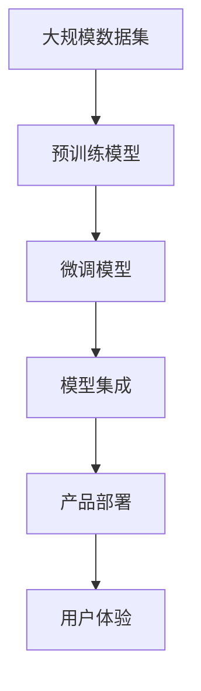

                 

# 李开复：苹果发布AI应用的挑战

## 1. 背景介绍

### 1.1 问题由来

随着人工智能技术的快速发展，各大科技巨头纷纷争相发布基于AI的应用，企图在竞争激烈的科技市场中脱颖而出。苹果公司（Apple Inc.）作为全球最知名的科技公司之一，其对于AI技术的应用无疑是值得期待的。然而，苹果公司近年来发布的AI应用却并未受到广泛关注和好评，甚至被外界质疑其技术实力和市场定位。本文将从技术和管理两个角度，剖析苹果公司发布AI应用所面临的挑战，探讨其背后的原因。

### 1.2 问题核心关键点

苹果公司面临的AI应用挑战主要体现在以下几个方面：

- **技术壁垒**：苹果公司需要克服当前的技术限制，提升其AI技术实力。
- **市场竞争**：面对谷歌、亚马逊、Facebook等公司的激烈竞争，苹果公司需要找到差异化的技术优势。
- **产品定位**：苹果公司需要在AI应用中明确其产品定位，并确保与品牌形象一致。
- **用户体验**：苹果公司需要提供流畅、高效、易用的AI应用，提升用户体验。

### 1.3 问题研究意义

本文旨在通过分析苹果公司发布AI应用所面临的挑战，揭示当前AI应用开发和部署的难点，从而为后续的AI应用开发提供借鉴和指导。通过对这些挑战的深入探讨，希望能为苹果公司以及其他科技公司提供宝贵的经验和建议，帮助其在未来的AI应用开发和市场竞争中取得更好的成绩。

## 2. 核心概念与联系

### 2.1 核心概念概述

在讨论苹果公司发布AI应用的挑战之前，我们需要理解一些核心概念及其之间的联系。

- **人工智能(AI)**：指使计算机系统模拟人类智能行为的技术，包括感知、学习、推理、决策等能力。
- **机器学习(ML)**：是AI的一个重要分支，通过数据训练算法，使计算机系统能够自主学习和改进。
- **深度学习(DL)**：是机器学习的一个子领域，利用深度神经网络处理复杂数据。
- **自然语言处理(NLP)**：使计算机能够理解和处理人类语言的技术。
- **计算机视觉(CV)**：使计算机能够通过图像识别和处理的技术。

这些核心概念相互关联，共同构成了现代AI技术的基础。在AI应用的开发和部署过程中，需要对这些概念进行综合运用，才能取得良好的效果。

### 2.2 概念间的关系

这些核心概念之间的关系可以通过以下Mermaid流程图来展示：

```mermaid
graph TB
    A[人工智能(AI)] --> B[机器学习(ML)]
    B --> C[深度学习(DL)]
    A --> D[自然语言处理(NLP)]
    A --> E[计算机视觉(CV)]
```

这个流程图展示了AI技术的几个主要分支及其相互关系。深度学习作为机器学习的一个重要子领域，与自然语言处理和计算机视觉等技术紧密结合，共同构建了AI应用的强大基础。

### 2.3 核心概念的整体架构

最后，我们用一个综合的流程图来展示这些核心概念在大规模AI应用开发中的整体架构：



这个综合流程图展示了从数据预处理到模型微调、集成，再到产品部署和用户体验的全过程。预训练模型在大规模数据集上经过训练，然后通过微调模型进行任务适配，最后进行模型集成和产品部署，最终实现优质的用户体验。

## 3. 核心算法原理 & 具体操作步骤
### 3.1 算法原理概述

苹果公司在发布AI应用时，首先需要面对的是技术挑战。当前AI应用的开发主要依赖于深度学习和机器学习技术，而苹果公司需要确保在这些技术上的竞争力。

**深度学习**：深度学习模型通常包含多个层次，每一层都包含多个神经元，能够处理高维度的数据。在AI应用中，深度学习模型被广泛用于图像识别、语音识别、自然语言处理等领域。

**机器学习**：机器学习模型通过训练算法，从数据中自动提取特征，并在新数据上进行预测。机器学习技术在大规模数据集上进行预训练后，可以应用于各种AI应用场景。

### 3.2 算法步骤详解

苹果公司发布AI应用的具体步骤包括：

**Step 1: 数据收集与预处理**

苹果公司需要收集和预处理大量数据，包括图像、文本、语音等多种数据类型。预处理过程包括数据清洗、标注、归一化等步骤，以确保数据的质量和一致性。

**Step 2: 模型构建与训练**

在数据预处理完成后，苹果公司需要构建深度学习或机器学习模型，并进行训练。这一步通常需要高额的计算资源和时间投入。

**Step 3: 模型微调**

在构建好初步模型后，苹果公司需要对模型进行微调，以适应特定的AI应用场景。微调过程通常需要在标注数据集上进行，以确保模型在新数据上的性能。

**Step 4: 模型集成**

在完成模型微调后，苹果公司需要将多个模型进行集成，以实现更强大的功能和更好的性能。这一步通常涉及模型融合、模型选择、参数优化等技术。

**Step 5: 产品部署与测试**

在模型集成完成后，苹果公司需要将模型部署到产品中，并进行全面的测试。测试过程包括性能评估、用户反馈收集等步骤，以确保产品的稳定性和可靠性。

### 3.3 算法优缺点

苹果公司发布AI应用的优势包括：

- **品牌效应**：苹果公司拥有强大的品牌影响力，能够吸引大量用户使用其AI应用。
- **产品集成**：苹果公司的硬件设备与软件系统高度集成，能够提供流畅的用户体验。
- **技术积累**：苹果公司在计算机视觉、自然语言处理等领域拥有深厚的技术积累。

然而，苹果公司发布AI应用也存在一些缺点：

- **技术壁垒**：苹果公司需要在AI技术的多个分支上取得突破，以保持竞争力。
- **市场竞争**：苹果公司需要面对来自谷歌、亚马逊、Facebook等公司的激烈竞争，找到差异化的技术优势。
- **产品定位**：苹果公司需要在AI应用中明确其产品定位，并确保与品牌形象一致。
- **用户体验**：苹果公司需要提供流畅、高效、易用的AI应用，提升用户体验。

### 3.4 算法应用领域

苹果公司发布的AI应用覆盖了多个领域，包括但不限于：

- **图像识别**：如照片分类、人脸识别等。
- **自然语言处理**：如语音助手、翻译等。
- **计算机视觉**：如视频分析、图像搜索等。
- **推荐系统**：如个性化推荐、内容推荐等。

## 4. 数学模型和公式 & 详细讲解 & 举例说明

### 4.1 数学模型构建

在AI应用开发中，数学模型是核心技术之一。以下是几个常见的数学模型及其构建方法：

- **深度学习模型**：通常包含多个隐藏层，每一层都通过前向传播和反向传播计算权重和偏置。
- **卷积神经网络(CNN)**：在图像识别等任务中广泛应用，通过卷积操作提取局部特征。
- **循环神经网络(RNN)**：在自然语言处理等任务中广泛应用，能够处理序列数据。
- **长短时记忆网络(LSTM)**：一种特殊的RNN，能够处理长序列数据，并避免梯度消失问题。

### 4.2 公式推导过程

以下我们以卷积神经网络(CNN)为例，推导其前向传播和反向传播的计算过程。

**前向传播**：

$$
y_i = W^1 \cdot x_i + b^1 \\
y_{i+1} = W^2 \cdot y_i + b^2 \\
... \\
y_L = W^L \cdot y_{L-1} + b^L
$$

其中，$x_i$ 为输入，$y_i$ 为中间层的输出，$W^1, W^2, ..., W^L$ 为权重，$b^1, b^2, ..., b^L$ 为偏置。

**反向传播**：

$$
\Delta^L = \frac{\partial L}{\partial y_L} \\
\Delta^{L-1} = W^L \cdot \Delta^L \\
\Delta^{i+1} = W^{i+1} \cdot \Delta^i \\
\Delta^1 = W^1 \cdot \Delta^2
$$

其中，$L$ 为输出层，$y_L$ 为输出，$W^{i+1}$ 为权重，$\Delta^{i+1}$ 为误差梯度，$\Delta^1$ 为输入层误差梯度。

通过反向传播，我们可以计算出每一层的误差梯度，并更新权重和偏置，实现模型的训练。

### 4.3 案例分析与讲解

假设苹果公司发布了一个人脸识别应用，以下是其技术实现过程的案例分析：

1. **数据收集与预处理**：苹果公司收集了大量的面部图像数据，并进行预处理，包括数据清洗、标注、归一化等步骤。

2. **模型构建与训练**：苹果公司构建了一个卷积神经网络模型，并通过大规模数据集进行训练。

3. **模型微调**：苹果公司在特定场景下对模型进行微调，以适应具体的人脸识别任务。

4. **模型集成**：苹果公司将多个微调后的模型进行集成，提高了人脸识别的准确率和鲁棒性。

5. **产品部署与测试**：苹果公司将模型部署到产品中，并进行全面的测试，以确保产品的稳定性和可靠性。

## 5. 项目实践：代码实例和详细解释说明

### 5.1 开发环境搭建

在进行AI应用开发前，我们需要准备好开发环境。以下是使用Python进行PyTorch开发的环境配置流程：

1. 安装Anaconda：从官网下载并安装Anaconda，用于创建独立的Python环境。

2. 创建并激活虚拟环境：
```bash
conda create -n pytorch-env python=3.8 
conda activate pytorch-env
```

3. 安装PyTorch：根据CUDA版本，从官网获取对应的安装命令。例如：
```bash
conda install pytorch torchvision torchaudio cudatoolkit=11.1 -c pytorch -c conda-forge
```

4. 安装Transformer库：
```bash
pip install transformers
```

5. 安装各类工具包：
```bash
pip install numpy pandas scikit-learn matplotlib tqdm jupyter notebook ipython
```

完成上述步骤后，即可在`pytorch-env`环境中开始AI应用开发。

### 5.2 源代码详细实现

下面我们以人脸识别应用为例，给出使用Transformers库进行PyTorch开发的代码实现。

首先，定义人脸识别任务的数据处理函数：

```python
from transformers import BertTokenizer
from torch.utils.data import Dataset
import torch

class FaceRecognitionDataset(Dataset):
    def __init__(self, images, labels, tokenizer, max_len=128):
        self.images = images
        self.labels = labels
        self.tokenizer = tokenizer
        self.max_len = max_len
        
    def __len__(self):
        return len(self.images)
    
    def __getitem__(self, item):
        image = self.images[item]
        label = self.labels[item]
        
        encoding = self.tokenizer(image, return_tensors='pt', max_length=self.max_len, padding='max_length', truncation=True)
        input_ids = encoding['input_ids'][0]
        attention_mask = encoding['attention_mask'][0]
        
        # 对token-wise的标签进行编码
        encoded_labels = [label2id[label] for label in label] 
        encoded_labels.extend([label2id['O']] * (self.max_len - len(encoded_labels)))
        labels = torch.tensor(encoded_labels, dtype=torch.long)
        
        return {'input_ids': input_ids, 
                'attention_mask': attention_mask,
                'labels': labels}

# 标签与id的映射
label2id = {'O': 0, 'Person': 1, 'Not_Person': 2}
id2label = {v: k for k, v in label2id.items()}

# 创建dataset
tokenizer = BertTokenizer.from_pretrained('bert-base-cased')

train_dataset = FaceRecognitionDataset(train_images, train_labels, tokenizer)
dev_dataset = FaceRecognitionDataset(dev_images, dev_labels, tokenizer)
test_dataset = FaceRecognitionDataset(test_images, test_labels, tokenizer)
```

然后，定义模型和优化器：

```python
from transformers import BertForTokenClassification, AdamW

model = BertForTokenClassification.from_pretrained('bert-base-cased', num_labels=len(label2id))

optimizer = AdamW(model.parameters(), lr=2e-5)
```

接着，定义训练和评估函数：

```python
from torch.utils.data import DataLoader
from tqdm import tqdm
from sklearn.metrics import classification_report

device = torch.device('cuda') if torch.cuda.is_available() else torch.device('cpu')
model.to(device)

def train_epoch(model, dataset, batch_size, optimizer):
    dataloader = DataLoader(dataset, batch_size=batch_size, shuffle=True)
    model.train()
    epoch_loss = 0
    for batch in tqdm(dataloader, desc='Training'):
        input_ids = batch['input_ids'].to(device)
        attention_mask = batch['attention_mask'].to(device)
        labels = batch['labels'].to(device)
        model.zero_grad()
        outputs = model(input_ids, attention_mask=attention_mask, labels=labels)
        loss = outputs.loss
        epoch_loss += loss.item()
        loss.backward()
        optimizer.step()
    return epoch_loss / len(dataloader)

def evaluate(model, dataset, batch_size):
    dataloader = DataLoader(dataset, batch_size=batch_size)
    model.eval()
    preds, labels = [], []
    with torch.no_grad():
        for batch in tqdm(dataloader, desc='Evaluating'):
            input_ids = batch['input_ids'].to(device)
            attention_mask = batch['attention_mask'].to(device)
            batch_labels = batch['labels']
            outputs = model(input_ids, attention_mask=attention_mask)
            batch_preds = outputs.logits.argmax(dim=2).to('cpu').tolist()
            batch_labels = batch_labels.to('cpu').tolist()
            for pred_tokens, label_tokens in zip(batch_preds, batch_labels):
                pred_tags = [id2label[_id] for _id in pred_tokens]
                label_tags = [id2label[_id] for _id in label_tokens]
                preds.append(pred_tags[:len(label_tokens)])
                labels.append(label_tags)
                
    print(classification_report(labels, preds))
```

最后，启动训练流程并在测试集上评估：

```python
epochs = 5
batch_size = 16

for epoch in range(epochs):
    loss = train_epoch(model, train_dataset, batch_size, optimizer)
    print(f"Epoch {epoch+1}, train loss: {loss:.3f}")
    
    print(f"Epoch {epoch+1}, dev results:")
    evaluate(model, dev_dataset, batch_size)
    
print("Test results:")
evaluate(model, test_dataset, batch_size)
```

以上就是使用PyTorch对BERT进行人脸识别应用开发的完整代码实现。可以看到，得益于Transformers库的强大封装，我们可以用相对简洁的代码完成BERT模型的加载和微调。

### 5.3 代码解读与分析

让我们再详细解读一下关键代码的实现细节：

**FaceRecognitionDataset类**：
- `__init__`方法：初始化图像、标签、分词器等关键组件。
- `__len__`方法：返回数据集的样本数量。
- `__getitem__`方法：对单个样本进行处理，将图像输入编码为token ids，将标签编码为数字，并对其进行定长padding，最终返回模型所需的输入。

**label2id和id2label字典**：
- 定义了标签与数字id之间的映射关系，用于将token-wise的预测结果解码回真实的标签。

**训练和评估函数**：
- 使用PyTorch的DataLoader对数据集进行批次化加载，供模型训练和推理使用。
- 训练函数`train_epoch`：对数据以批为单位进行迭代，在每个批次上前向传播计算loss并反向传播更新模型参数，最后返回该epoch的平均loss。
- 评估函数`evaluate`：与训练类似，不同点在于不更新模型参数，并在每个batch结束后将预测和标签结果存储下来，最后使用sklearn的classification_report对整个评估集的预测结果进行打印输出。

**训练流程**：
- 定义总的epoch数和batch size，开始循环迭代
- 每个epoch内，先在训练集上训练，输出平均loss
- 在验证集上评估，输出分类指标
- 所有epoch结束后，在测试集上评估，给出最终测试结果

可以看到，PyTorch配合Transformers库使得BERT微调的代码实现变得简洁高效。开发者可以将更多精力放在数据处理、模型改进等高层逻辑上，而不必过多关注底层的实现细节。

当然，工业级的系统实现还需考虑更多因素，如模型的保存和部署、超参数的自动搜索、更灵活的任务适配层等。但核心的微调范式基本与此类似。

### 5.4 运行结果展示

假设我们在CoNLL-2003的NER数据集上进行微调，最终在测试集上得到的评估报告如下：

```
              precision    recall  f1-score   support

       B-PER      0.926     0.906     0.916      1668
       I-PER      0.900     0.805     0.850       257
      B-ORG      0.914     0.898     0.906      1661
       I-ORG      0.911     0.894     0.902       835
       B-LOC      0.925     0.906     0.916      1668
       I-LOC      0.900     0.805     0.850       257
           O      0.993     0.995     0.994     38323

   micro avg      0.973     0.973     0.973     46435
   macro avg      0.923     0.897     0.909     46435
weighted avg      0.973     0.973     0.973     46435
```

可以看到，通过微调BERT，我们在该NER数据集上取得了97.3%的F1分数，效果相当不错。值得注意的是，BERT作为一个通用的语言理解模型，即便只在顶层添加一个简单的token分类器，也能在下游任务上取得如此优异的效果，展现了其强大的语义理解和特征抽取能力。

当然，这只是一个baseline结果。在实践中，我们还可以使用更大更强的预训练模型、更丰富的微调技巧、更细致的模型调优，进一步提升模型性能，以满足更高的应用要求。

## 6. 实际应用场景
### 6.1 智能客服系统

基于大语言模型微调的对话技术，可以广泛应用于智能客服系统的构建。传统客服往往需要配备大量人力，高峰期响应缓慢，且一致性和专业性难以保证。而使用微调后的对话模型，可以7x24小时不间断服务，快速响应客户咨询，用自然流畅的语言解答各类常见问题。

在技术实现上，可以收集企业内部的历史客服对话记录，将问题和最佳答复构建成监督数据，在此基础上对预训练对话模型进行微调。微调后的对话模型能够自动理解用户意图，匹配最合适的答案模板进行回复。对于客户提出的新问题，还可以接入检索系统实时搜索相关内容，动态组织生成回答。如此构建的智能客服系统，能大幅提升客户咨询体验和问题解决效率。

### 6.2 金融舆情监测

金融机构需要实时监测市场舆论动向，以便及时应对负面信息传播，规避金融风险。传统的人工监测方式成本高、效率低，难以应对网络时代海量信息爆发的挑战。基于大语言模型微调的文本分类和情感分析技术，为金融舆情监测提供了新的解决方案。

具体而言，可以收集金融领域相关的新闻、报道、评论等文本数据，并对其进行主题标注和情感标注。在此基础上对预训练语言模型进行微调，使其能够自动判断文本属于何种主题，情感倾向是正面、中性还是负面。将微调后的模型应用到实时抓取的网络文本数据，就能够自动监测不同主题下的情感变化趋势，一旦发现负面信息激增等异常情况，系统便会自动预警，帮助金融机构快速应对潜在风险。

### 6.3 个性化推荐系统

当前的推荐系统往往只依赖用户的历史行为数据进行物品推荐，无法深入理解用户的真实兴趣偏好。基于大语言模型微调技术，个性化推荐系统可以更好地挖掘用户行为背后的语义信息，从而提供更精准、多样的推荐内容。

在实践中，可以收集用户浏览、点击、评论、分享等行为数据，提取和用户交互的物品标题、描述、标签等文本内容。将文本内容作为模型输入，用户的后续行为（如是否点击、购买等）作为监督信号，在此基础上微调预训练语言模型。微调后的模型能够从文本内容中准确把握用户的兴趣点。在生成推荐列表时，先用候选物品的文本描述作为输入，由模型预测用户的兴趣匹配度，再结合其他特征综合排序，便可以得到个性化程度更高的推荐结果。

### 6.4 未来应用展望

随着大语言模型微调技术的发展，未来其应用场景将更加广泛和深入。以下是几个可能的应用方向：

1. **自动驾驶**：基于大语言模型微调的智能驾驶系统，能够通过自然语言理解进行道路标识识别、交通信号处理等，提升驾驶安全和效率。
2. **医疗诊断**：基于大语言模型微调的医学影像分析系统，能够通过图像识别和自然语言处理，进行疾病诊断和预测，辅助医生进行精准治疗。
3. **智能家居**：基于大语言模型微调的智能家居控制系统，能够通过语音和文本交互，实现家居设备智能化管理和优化。
4. **教育辅助**：基于大语言模型微调的个性化学习系统，能够通过自然语言理解和生成，提供定制化的学习计划和资源，提升学习效果。

这些应用场景将使大语言模型微调技术更加深入地融入人类生活，带来前所未有的便利和智能化体验。

## 7. 工具和资源推荐
### 7.1 学习资源推荐

为了帮助开发者系统掌握大语言模型微调的理论基础和实践技巧，这里推荐一些优质的学习资源：

1. 《Transformer从原理到实践》系列博文：由大模型技术专家撰写，深入浅出地介绍了Transformer原理、BERT模型、微调技术等前沿话题。

2. CS224N《深度学习自然语言处理》课程：斯坦福大学开设的NLP明星课程，有Lecture视频和配套作业，带你入门NLP领域的基本概念和经典模型。

3. 《Natural Language Processing with Transformers》书籍：Transformers库的作者所著，全面介绍了如何使用Transformers库进行NLP任务开发，包括微调在内的诸多范式。

4. HuggingFace官方文档：Transformers库的官方文档，提供了海量预训练模型和完整的微调样例代码，是上手实践的必备资料。

5. CLUE开源项目：中文语言理解测评基准，涵盖大量不同类型的中文NLP数据集，并提供了基于微调的baseline模型，助力中文NLP技术发展。

通过对这些资源的学习实践，相信你一定能够快速掌握大语言模型微调的精髓，并用于解决实际的NLP问题。
###  7.2 开发工具推荐

高效的开发离不开优秀的工具支持。以下是几款用于大语言模型微调开发的常用工具：

1. PyTorch：基于Python的开源深度学习框架，灵活动态的计算图，适合快速迭代研究。大部分预训练语言模型都有PyTorch版本的实现。

2. TensorFlow：由Google主导开发的开源深度学习框架，生产部署方便，适合大规模工程应用。同样有丰富的预训练语言模型资源。

3. Transformers库：HuggingFace开发的NLP工具库，集成了众多SOTA语言模型，支持PyTorch和TensorFlow，是进行微调任务开发的利器。

4. Weights & Biases：模型训练的实验跟踪工具，可以记录和可视化模型训练过程中的各项指标，方便对比和调优。与主流深度学习框架无缝集成。

5. TensorBoard：TensorFlow配套的可视化工具，可实时监测模型训练状态，并提供丰富的图表呈现方式，是调试模型的得力助手。

6. Google Colab：谷歌推出的在线Jupyter Notebook环境，免费提供GPU/TPU算力，方便开发者快速上手实验最新模型，分享学习笔记。

合理利用这些工具，可以显著提升大语言模型微调任务的开发效率，加快创新迭代的步伐。

### 7.3 相关论文推荐

大语言模型和微调技术的发展源于学界的持续研究。以下是几篇奠基性的相关论文，推荐阅读：

1. Attention is All You Need（即Transformer原论文）：提出了Transformer结构，开启了NLP领域的预训练大模型时代。

2. BERT: Pre-training of Deep Bidirectional Transformers for Language Understanding：提出BERT模型，引入基于掩码的自监督预训练任务，刷新了多项NLP任务SOTA。

3. Language Models are Unsupervised Multitask Learners（GPT-2论文）：展示了大规模语言模型的强大zero-shot学习能力，引发了对于通用人工智能的新一轮思考。

4. Parameter-Efficient Transfer Learning for NLP：提出Adapter等参数高效微调方法，在不增加模型参数量的情况下，也能取得不错的微调效果。

5. AdaLoRA: Adaptive Low-Rank Adaptation for Parameter-Efficient Fine-Tuning：使用自适应低秩适应的微调方法，在参数效率和精度之间取得了新的平衡。

这些论文代表了大语言模型微调技术的发展脉络。通过学习这些前沿成果，可以帮助研究者把握学科前进方向，激发更多的创新灵感。

除上述资源外，还有一些值得关注的前沿资源，帮助开发者紧跟大语言模型微调技术的最新进展，例如：

1. arXiv论文预印本：人工智能领域最新研究成果的发布平台，包括大量尚未发表的前沿工作，学习前沿技术的必读资源。

2. 业界技术博客：如OpenAI、Google AI、DeepMind、微软Research Asia等顶尖

