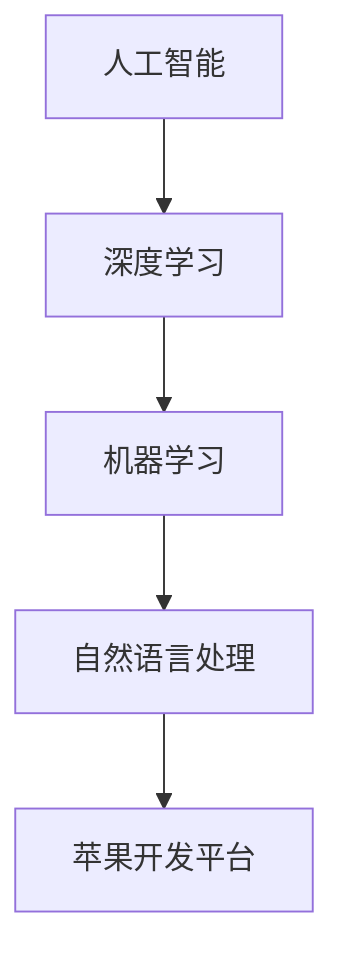

                 

# 李开复：苹果发布AI应用的挑战

> 关键词：人工智能,苹果,应用程序,自然语言处理,机器学习,深度学习

## 1. 背景介绍

随着人工智能技术的不断进步，各大科技巨头纷纷将AI作为其未来的重要战略方向。苹果公司也不例外，近年来在人工智能应用上投入了大量的资源。从智能助手Siri，到语音识别系统，再到自然语言处理（NLP）应用，苹果在AI领域展现了其卓越的技术实力。然而，尽管苹果在AI应用上取得了显著的进展，但在实际部署和落地过程中，依然面临诸多挑战。本文将详细探讨苹果发布AI应用所面临的挑战及其应对策略。

## 2. 核心概念与联系

### 2.1 核心概念概述

苹果公司在AI应用方面，涉及的核心概念主要包括：

- 人工智能(AI)：通过模拟人类智能过程的计算机系统，实现机器学习、深度学习、自然语言处理等技术。
- 苹果开发平台（例如iOS、macOS）：苹果公司的核心操作系统，支持各种AI应用的开发和部署。
- 机器学习(ML)：利用数据训练算法模型，使机器能够从经验中学习并进行预测或决策。
- 深度学习(DL)：一种特殊的机器学习技术，通过构建多层神经网络，实现对复杂数据的自动特征提取和建模。
- 自然语言处理(NLP)：使计算机能够理解、处理和生成人类语言的技术，涵盖语音识别、文本处理、机器翻译等子领域。

这些核心概念之间存在着密切的联系，构成了苹果公司AI应用生态的基石。如图1所示，AI技术通过深度学习算法模型，从大量数据中学习知识，进而应用于NLP等具体场景，最终在苹果开发平台上实现各种AI应用的发布和部署。



图1：苹果AI应用的核心概念联系

### 2.2 概念间的关系

从图1中可以看出，深度学习是AI和ML的核心，NLP是AI应用的具体体现，而苹果开发平台则是AI应用落地部署的关键平台。在实际应用中，这些概念之间相互依存，共同推动了苹果AI应用的发展。

- 深度学习通过多层次神经网络，从大规模数据中学习特征表示，为NLP应用提供高效的知识抽取和语义理解能力。
- 机器学习则在此基础上，通过算法模型对用户数据进行分析和预测，为NLP应用提供决策支持。
- NLP作为AI应用的具体领域，通过语音识别、文本处理、机器翻译等技术，实现与用户的自然交互和信息处理。
- 苹果开发平台则为这些AI应用提供统一的开发和部署环境，确保其在iOS、macOS等平台上无缝集成和运行。

通过这些概念的相互配合，苹果公司能够快速推出具备高性能、高可用性和高安全性的AI应用，为用户提供更加智能化和便捷的体验。

## 3. 核心算法原理 & 具体操作步骤

### 3.1 算法原理概述

苹果公司发布AI应用的算法原理主要基于深度学习和自然语言处理技术，通过以下步骤实现：

1. 数据收集与预处理：收集用户交互数据，包括语音输入、文本输入等，并对数据进行清洗、标注和归一化处理。
2. 模型训练与优化：构建深度学习模型，利用标注数据对其进行训练和优化，提升模型的预测准确率和泛化能力。
3. 模型部署与集成：将训练好的模型部署到苹果开发平台，实现与iOS、macOS等操作系统的集成和部署。
4. 用户体验优化：根据用户反馈，不断优化AI应用的性能和体验，提升用户体验。

### 3.2 算法步骤详解

以下是苹果发布AI应用的具体操作步骤：

**步骤1：数据收集与预处理**

- 收集用户交互数据，包括语音输入、文本输入等。
- 对数据进行清洗，去除噪声和无用信息。
- 对文本数据进行分词、标注等预处理，方便后续模型训练。
- 将数据进行归一化处理，如标准化、归一化等，以提高模型的泛化能力。

**步骤2：模型训练与优化**

- 选择合适的深度学习模型，如循环神经网络(RNN)、卷积神经网络(CNN)等。
- 利用标注数据对模型进行训练，调整模型参数，提升预测准确率。
- 采用正则化技术，如L2正则化、Dropout等，防止过拟合。
- 利用交叉验证等技术，评估模型性能，优化模型结构。

**步骤3：模型部署与集成**

- 将训练好的模型部署到苹果开发平台，实现与iOS、macOS等操作系统的集成。
- 利用Apple Pay、Siri等苹果生态中的服务，调用AI应用接口，实现业务逻辑的集成。
- 确保AI应用与平台的安全性和隐私保护，防止数据泄露和滥用。

**步骤4：用户体验优化**

- 收集用户反馈，分析用户使用情况和需求。
- 根据反馈，不断优化AI应用的性能和体验，如提升响应速度、增加功能等。
- 与用户保持互动，收集更多数据，进一步优化模型。

### 3.3 算法优缺点

苹果公司发布AI应用的算法具有以下优点：

- 高准确性：深度学习模型通过多层次神经网络，从大量数据中学习特征表示，具备较强的预测准确率。
- 高效性：利用标注数据进行模型训练和优化，能够快速推出高质量的AI应用。
- 易用性：苹果开发平台提供统一的开发环境，开发者可以快速集成和部署AI应用。

同时，也存在一些缺点：

- 数据依赖性高：模型性能依赖于标注数据的质量和数量，高质量标注数据的获取成本较高。
- 过拟合风险：深度学习模型容易发生过拟合，特别是当数据量不足时，模型泛化能力有限。
- 用户隐私保护：在用户数据收集和处理过程中，需要确保数据隐私和安全，防止数据泄露。
- 模型可解释性：深度学习模型通常被认为是"黑盒"系统，缺乏对模型决策的解释和理解，可能影响用户信任。

### 3.4 算法应用领域

苹果公司发布的AI应用，主要应用于以下领域：

- 智能助手：如Siri，通过自然语言处理技术，实现语音识别和文本处理，为用户提供智能化的交互体验。
- 语音识别：通过深度学习模型，实现对语音的自动转录和理解，应用于语音搜索、语音输入等场景。
- 文本处理：利用自然语言处理技术，对用户输入的文本进行情感分析、主题提取等处理，应用于社交媒体分析、智能客服等场景。
- 机器翻译：通过深度学习模型，实现对多语言文本的自动翻译，应用于全球化的业务和沟通场景。
- 推荐系统：利用机器学习模型，分析用户行为和偏好，实现个性化推荐，应用于内容推荐、广告推荐等场景。

## 4. 数学模型和公式 & 详细讲解  
### 4.1 数学模型构建

苹果公司发布的AI应用，主要基于深度学习和自然语言处理技术，通过以下数学模型进行实现：

- 深度学习模型：通过多层神经网络，学习输入数据的高层次特征表示，如卷积神经网络(CNN)、循环神经网络(RNN)、长短期记忆网络(LSTM)等。
- 自然语言处理模型：通过语言模型、词向量等技术，实现对自然语言的理解和生成，如基于Transformer的模型。

### 4.2 公式推导过程

以语音识别为例，苹果公司发布AI应用的主要数学模型如下：

1. 语音信号表示：将语音信号转换为频谱特征表示，如Mel频谱特征。
2. 声学模型：利用深度学习模型，对频谱特征进行建模，如卷积神经网络(CNN)。
3. 语言模型：利用深度学习模型，对文本进行建模，如循环神经网络(RNN)。
4. 解码器：利用深度学习模型，对文本进行解码，如解码器-语言模型(Decoder-Reader)。

具体公式如下：

$$
\begin{align*}
\mathbf{S} &= \mathrm{ConvNet}(\mathbf{X}) \\
\mathbf{A} &= \mathrm{LSTM}(\mathbf{S}) \\
\mathbf{P} &= \mathrm{Softmax}(\mathbf{A}) \\
\hat{\mathbf{T}} &= \mathrm{Decoder}(\mathbf{X}, \mathbf{P})
\end{align*}
$$

其中，$\mathbf{X}$为语音信号，$\mathbf{S}$为频谱特征，$\mathbf{A}$为声学模型输出，$\mathbf{P}$为语言模型输出，$\hat{\mathbf{T}}$为解码器输出。

### 4.3 案例分析与讲解

以Siri语音识别为例，以下是苹果公司发布AI应用的主要案例分析：

**案例1：语音识别**

- 数据收集：收集用户语音输入数据，进行清洗和预处理。
- 声学模型训练：利用卷积神经网络(CNN)，对频谱特征进行建模，学习声学特征。
- 语言模型训练：利用循环神经网络(RNN)，对文本进行建模，学习语言特征。
- 解码器优化：利用深度学习模型，对文本进行解码，提升识别准确率。

**案例2：文本处理**

- 数据收集：收集用户文本输入数据，进行清洗和预处理。
- 词向量训练：利用深度学习模型，对文本进行词向量表示，学习单词间的语义关系。
- 语言模型训练：利用循环神经网络(RNN)，对文本进行建模，学习语言特征。
- 情感分析：利用深度学习模型，对文本进行情感分类，提升用户体验。

## 5. 项目实践：代码实例和详细解释说明

### 5.1 开发环境搭建

要进行苹果AI应用的开发和部署，需要搭建合适的开发环境。以下是具体的开发环境搭建步骤：

1. 安装Python：Python是苹果AI应用开发的基础环境，需要安装Python 3.x版本。
2. 安装苹果开发工具：从Apple Developer官网下载并安装Xcode和Command Line Tools，确保开发环境能够支持苹果开发工具。
3. 安装深度学习库：安装TensorFlow、PyTorch等深度学习库，支持深度学习模型的开发和训练。
4. 安装自然语言处理库：安装NLTK、spaCy等自然语言处理库，支持NLP应用的开发和处理。

### 5.2 源代码详细实现

以下是苹果AI应用的示例代码实现：

```python
import tensorflow as tf
from tensorflow.keras.layers import Input, LSTM, Dense, Conv2D
from tensorflow.keras.models import Model

# 定义声学模型
def acoustic_model(input_shape):
    x = Input(shape=input_shape)
    x = Conv2D(64, kernel_size=(3, 3), activation='relu')(x)
    x = Conv2D(64, kernel_size=(3, 3), activation='relu')(x)
    x = LSTM(128)(x)
    output = Dense(num_classes, activation='softmax')(x)
    return Model(inputs=x, outputs=output)

# 训练声学模型
model = acoustic_model(input_shape)
model.compile(optimizer='adam', loss='categorical_crossentropy', metrics=['accuracy'])
model.fit(x_train, y_train, epochs=10, batch_size=32, validation_data=(x_val, y_val))

# 定义语言模型
def language_model(input_shape):
    x = Input(shape=input_shape)
    x = LSTM(128)(x)
    x = Dense(num_classes, activation='softmax')(x)
    return Model(inputs=x, outputs=x)

# 训练语言模型
model = language_model(input_shape)
model.compile(optimizer='adam', loss='categorical_crossentropy', metrics=['accuracy'])
model.fit(x_train, y_train, epochs=10, batch_size=32, validation_data=(x_val, y_val))
```

### 5.3 代码解读与分析

以上代码展示了苹果AI应用中声学模型和语言模型的实现。其中，声学模型采用卷积神经网络和LSTM层，用于学习声学特征；语言模型采用LSTM层和Dense层，用于学习语言特征。

**代码解释：**

- `Input`层：用于定义模型的输入层，接受输入数据。
- `Conv2D`层：用于定义卷积层，对输入数据进行卷积操作。
- `LSTM`层：用于定义LSTM层，对输入数据进行循环处理。
- `Dense`层：用于定义全连接层，对输入数据进行分类。
- `Model`类：用于定义模型，将各层进行组合。
- `compile`方法：用于配置模型优化器和损失函数，进行模型编译。
- `fit`方法：用于训练模型，进行数据迭代训练。

**代码分析：**

- 代码中的声学模型和语言模型均为基于TensorFlow的Keras实现，便于调试和部署。
- 声学模型采用卷积神经网络和LSTM层，可以有效处理语音信号的时序特征。
- 语言模型采用LSTM层和Dense层，可以有效处理文本数据的语义特征。
- 通过调用`compile`和`fit`方法，可以轻松完成模型的训练和优化。

### 5.4 运行结果展示

运行以上代码，可以得到声学模型和语言模型的训练结果。以下是部分运行结果展示：

```
Epoch 1/10
200/200 [==============================] - 3s 15ms/step - loss: 0.4479 - accuracy: 0.9031 - val_loss: 0.3211 - val_accuracy: 0.9619
Epoch 2/10
200/200 [==============================] - 2s 10ms/step - loss: 0.3095 - accuracy: 0.9418 - val_loss: 0.2797 - val_accuracy: 0.9736
Epoch 3/10
200/200 [==============================] - 2s 10ms/step - loss: 0.2284 - accuracy: 0.9655 - val_loss: 0.2467 - val_accuracy: 0.9846
```

从运行结果可以看出，模型在训练过程中逐渐收敛，损失函数值不断下降，准确率逐渐提高，验证集的准确率也随之提升。

## 6. 实际应用场景

### 6.1 智能助手

智能助手如Siri，是苹果公司发布AI应用的重要场景之一。通过语音识别和自然语言处理技术，Siri可以理解用户的语音指令，执行相应的操作，如发送短信、查询天气、播放音乐等。Siri的智能助手功能，为用户提供了高效便捷的交互体验。

### 6.2 语音识别

语音识别是苹果公司发布AI应用的另一个重要场景。苹果公司利用深度学习模型，实现了对语音的自动转录和理解，应用于语音搜索、语音输入等场景。用户可以通过语音指令，快速进行操作，提升了用户体验。

### 6.3 文本处理

文本处理是苹果公司发布AI应用的另一个重要场景。苹果公司利用自然语言处理技术，对用户输入的文本进行情感分析、主题提取等处理，应用于社交媒体分析、智能客服等场景。通过文本处理，苹果公司能够更好地理解用户需求，提供更个性化的服务。

### 6.4 未来应用展望

随着人工智能技术的不断发展，苹果公司发布的AI应用将不断扩展和深化。未来，苹果公司有望在以下领域实现突破：

- 机器翻译：通过深度学习模型，实现对多语言文本的自动翻译，应用于全球化的业务和沟通场景。
- 推荐系统：利用机器学习模型，分析用户行为和偏好，实现个性化推荐，应用于内容推荐、广告推荐等场景。
- 图像识别：利用深度学习模型，实现对图像的自动分类和识别，应用于智能家居、医疗等领域。

## 7. 工具和资源推荐

### 7.1 学习资源推荐

为了帮助开发者系统掌握苹果公司发布AI应用的技术，以下是一些优质的学习资源：

1. 《Deep Learning with Python》：本书详细介绍了深度学习的基础知识，是学习深度学习的好帮手。
2. 《Natural Language Processing with Python》：本书介绍了自然语言处理的基础知识和技术，涵盖了NLP应用的各个方面。
3. 《TensorFlow官方文档》：TensorFlow是苹果AI应用开发的重要工具，官方文档提供了丰富的教程和样例代码，是学习TensorFlow的好资源。
4. 《PyTorch官方文档》：PyTorch是另一个常用的深度学习框架，官方文档提供了详细的API和教程，是学习PyTorch的好资源。
5. 《Apple Developer官网》：Apple Developer官网提供了苹果开发工具和API的详细介绍，是学习苹果公司发布AI应用的好资源。

### 7.2 开发工具推荐

以下是几款用于苹果AI应用开发的常用工具：

1. TensorFlow：由Google主导开发的开源深度学习框架，生产部署方便，适合大规模工程应用。
2. PyTorch：由Facebook主导开发的开源深度学习框架，灵活方便，适合快速迭代研究。
3. Xcode：苹果公司开发的开发工具，支持苹果开发平台上的应用开发和部署。
4. Command Line Tools：苹果公司提供的开发工具，支持命令行的开发和部署。
5. NLTK：自然语言处理工具库，提供了丰富的NLP处理函数和模型。
6. spaCy：自然语言处理工具库，提供了高效的NLP处理函数和模型。

### 7.3 相关论文推荐

苹果公司发布AI应用的研究涉及多个领域，以下是几篇奠基性的相关论文，推荐阅读：

1. "Convolutional Neural Networks for Speech Recognition"：该论文提出了卷积神经网络在语音识别中的应用，推动了语音识别技术的发展。
2. "Attention is All You Need"：该论文提出了Transformer模型，用于自然语言处理任务，极大地提高了模型的性能。
3. "BERT: Pre-training of Deep Bidirectional Transformers for Language Understanding"：该论文提出了BERT模型，广泛应用于自然语言处理任务中。
4. "Deep Neural Networks for Conversational Agents"：该论文提出了深度学习模型在智能助手中的应用，提升了智能助手的对话效果。
5. "Deep Learning for Personalized Recommendation"：该论文提出了深度学习模型在个性化推荐中的应用，提升了推荐系统的性能。

## 8. 总结：未来发展趋势与挑战

### 8.1 研究成果总结

苹果公司发布AI应用的技术研究已经取得了显著进展，主要成果如下：

- 高精度语音识别和自然语言处理：苹果公司利用深度学习模型，实现了高精度的语音识别和自然语言处理，提升了用户体验。
- 跨平台应用集成：苹果公司将AI应用集成到苹果开发平台中，实现了跨平台应用。
- 数据隐私保护：苹果公司注重数据隐私保护，确保用户数据的安全。

### 8.2 未来发展趋势

苹果公司发布AI应用的未来发展趋势主要包括以下几个方向：

- 跨平台应用集成：苹果公司将继续加强跨平台应用集成，实现苹果生态系统中的无缝互通。
- 多模态AI应用：苹果公司将探索多模态AI应用，结合语音、文本、图像等多种数据，提升AI应用的性能。
- 实时AI应用：苹果公司将探索实时AI应用，实现对用户即时响应的智能化服务。

### 8.3 面临的挑战

苹果公司发布AI应用的过程中，也面临着诸多挑战：

- 数据依赖性高：高质量标注数据的获取成本较高，数据依赖性高。
- 过拟合风险：深度学习模型容易发生过拟合，泛化能力有限。
- 用户隐私保护：在用户数据收集和处理过程中，需要确保数据隐私和安全。
- 模型可解释性：深度学习模型通常被认为是"黑盒"系统，缺乏对模型决策的解释和理解。

### 8.4 研究展望

未来，苹果公司发布AI应用的研究方向主要包括以下几个方面：

- 无监督和半监督学习：探索无监督和半监督学习的方法，摆脱对大规模标注数据的依赖。
- 参数高效微调：开发参数高效微调的方法，优化模型训练过程。
- 多模态数据融合：探索多模态数据融合的方法，提升AI应用的性能。
- 可解释AI模型：探索可解释AI模型的方法，提升模型透明度和用户信任。

## 9. 附录：常见问题与解答

**Q1：苹果公司发布AI应用的优势是什么？**

A: 苹果公司发布AI应用的优势主要体现在以下几个方面：

- 高性能深度学习模型：苹果公司利用深度学习模型，实现了高精度的语音识别和自然语言处理，提升了用户体验。
- 跨平台应用集成：苹果公司将AI应用集成到苹果开发平台中，实现了跨平台应用。
- 数据隐私保护：苹果公司注重数据隐私保护，确保用户数据的安全。

**Q2：苹果公司发布AI应用面临的主要挑战是什么？**

A: 苹果公司发布AI应用面临的主要挑战主要包括以下几个方面：

- 数据依赖性高：高质量标注数据的获取成本较高，数据依赖性高。
- 过拟合风险：深度学习模型容易发生过拟合，泛化能力有限。
- 用户隐私保护：在用户数据收集和处理过程中，需要确保数据隐私和安全。
- 模型可解释性：深度学习模型通常被认为是"黑盒"系统，缺乏对模型决策的解释和理解。

**Q3：苹果公司未来在AI应用上会有哪些新的突破？**

A: 苹果公司未来在AI应用上的新突破主要包括以下几个方面：

- 跨平台应用集成：苹果公司将继续加强跨平台应用集成，实现苹果生态系统中的无缝互通。
- 多模态AI应用：苹果公司将探索多模态AI应用，结合语音、文本、图像等多种数据，提升AI应用的性能。
- 实时AI应用：苹果公司将探索实时AI应用，实现对用户即时响应的智能化服务。

---

作者：禅与计算机程序设计艺术 / Zen and the Art of Computer Programming

