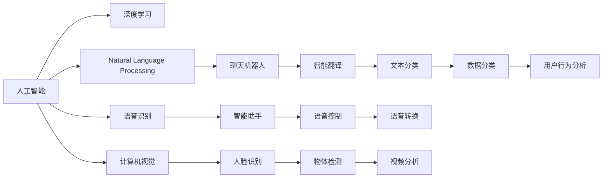
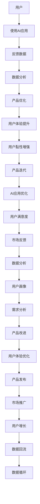

                 

# 李开复：苹果发布AI应用的用户

> 关键词：人工智能,深度学习,自然语言处理,语音识别,计算机视觉,用户行为分析

## 1. 背景介绍

### 1.1 问题由来

近年来，人工智能(AI)技术在各行各业的应用越来越广泛。随着AI算法的不断进步，各大科技巨头纷纷推出了基于AI的应用，如语音识别、自然语言处理、计算机视觉等。苹果公司也不例外，其发布的AI应用在市场上取得了不错的反响，得到了广大用户的认可。但与此同时，苹果公司也面临一些挑战和困惑，如何更好地理解用户的反馈和需求，如何优化AI应用的性能和用户体验，成为亟待解决的问题。

### 1.2 问题核心关键点

1. **用户反馈收集**：了解用户在使用AI应用时遇到的问题和建议，以便改进和优化产品。
2. **用户体验优化**：提升AI应用的易用性和便捷性，让用户能够更加自如地使用。
3. **性能调优**：通过数据分析和模型训练，优化AI应用的算法和性能，提高准确率和响应速度。
4. **隐私保护**：在使用AI应用时，如何保护用户的隐私和数据安全，是必须考虑的重要问题。
5. **用户满意度**：提高用户对AI应用的满意度和忠诚度，增强用户黏性。

## 2. 核心概念与联系

### 2.1 核心概念概述

为更好地理解苹果公司AI应用的用户行为，本节将介绍几个密切相关的核心概念：

- **人工智能(AI)**：基于算法和模型，通过学习和推理，实现对数据的自动化处理和决策。AI包括机器学习、深度学习、自然语言处理、计算机视觉等多个子领域。
- **深度学习(Deep Learning)**：一种模拟人脑神经网络的算法，通过多层非线性变换，对数据进行高效表示和分析。深度学习在图像识别、语音识别、自然语言处理等领域表现出色。
- **自然语言处理(Natural Language Processing, NLP)**：研究计算机如何理解和生成人类语言的技术。NLP广泛应用于聊天机器人、智能翻译、文本分类等领域。
- **语音识别(Speech Recognition)**：将语音转换为文本，使计算机能够理解和处理口头语言。语音识别技术广泛应用于智能助手、语音控制等领域。
- **计算机视觉(Computer Vision)**：使计算机能够理解和处理图像和视频数据。计算机视觉技术广泛应用于人脸识别、物体检测、视频分析等领域。
- **用户行为分析(User Behavior Analysis)**：通过分析用户在AI应用中的行为数据，了解用户需求和偏好，为产品优化提供数据支持。

这些核心概念之间的逻辑关系可以通过以下Mermaid流程图来展示：



这个流程图展示了大语言模型的核心概念及其之间的关系：

1. 人工智能是涵盖多个子领域的技术，其中深度学习是其核心算法之一。
2. 自然语言处理、语音识别和计算机视觉等技术都属于人工智能范畴，它们之间有交叉和融合。
3. 各种AI技术可以应用到不同的具体任务中，如聊天机器人、智能助手、人脸识别等。
4. 用户行为分析是通过AI技术对用户行为数据进行分析，为产品优化提供依据。

### 2.2 概念间的关系

这些核心概念之间存在着紧密的联系，形成了苹果公司AI应用的完整生态系统。下面我们通过几个Mermaid流程图来展示这些概念之间的关系。

#### 2.2.1 AI应用的用户行为


这个流程图展示了AI应用的用户行为及其影响过程：

1. 用户使用AI应用时，会留下反馈数据。
2. 数据分析师会对这些反馈数据进行分析，提取有价值的信息。
3. 根据分析结果，产品团队会对AI应用进行优化，提升用户体验。
4. 提升后的用户体验会增强用户黏性，进一步促进用户的使用。

#### 2.2.2 用户行为与数据分析的关系


这个流程图展示了用户行为与数据分析之间的关系：

1. 用户行为数据通过数据分析，被转化为用户画像。
2. 用户画像包含用户的基本信息和行为特征。
3. 通过用户画像，分析用户需求，发现产品改进点。
4. 根据需求分析结果，对产品进行优化，提升用户体验。

#### 2.2.3 AI应用的用户反馈


这个流程图展示了用户反馈及其处理过程：

1. 用户在使用AI应用时，会留下反馈数据。
2. 情感分析可以对反馈数据进行情感倾向判断，区分正面和负面反馈。
3. 根据情感分析结果，快速解决用户遇到的问题。
4. 问题的解决会提升用户满意度，增强用户对AI应用的信任。

### 2.3 核心概念的整体架构

最后，我们用一个综合的流程图来展示这些核心概念在大语言模型微调过程中的整体架构：



这个综合流程图展示了从用户反馈到产品优化的完整过程。AI应用首先收集用户反馈数据，通过数据分析和情感分析，识别出用户需求和存在的问题。根据需求和问题，产品团队进行产品优化和改进。优化后的产品重新发布到市场，进一步提升用户体验和用户黏性。数据回流到数据分析环节，形成一个闭环的用户行为分析系统。

## 3. 核心算法原理 & 具体操作步骤
### 3.1 算法原理概述

苹果公司AI应用的微调过程，本质上是一个基于用户反馈的数据驱动优化过程。其核心思想是：通过收集用户在使用AI应用时的反馈数据，结合情感分析、数据分析等技术，对AI应用进行持续优化，提升用户体验和满意度。

具体而言，苹果公司会使用机器学习算法对用户反馈数据进行建模，预测用户对AI应用的满意度，并根据预测结果进行产品改进。常见的机器学习算法包括线性回归、决策树、随机森林等，这些算法可以处理大量用户反馈数据，并提供有效的预测模型。

### 3.2 算法步骤详解

基于用户反馈的AI应用优化，通常包括以下几个关键步骤：

**Step 1: 准备用户反馈数据**
- 收集用户在使用AI应用时的反馈数据，包括用户评分、评论、操作行为等。
- 对数据进行清洗和预处理，去除噪声和异常值。
- 对数据进行标注，将用户反馈分为正面、中性和负面三类。

**Step 2: 选择模型和特征**
- 选择合适的机器学习模型，如线性回归、决策树、随机森林等，用于建模用户满意度。
- 确定需要考虑的特征，如用户评分、评论内容、使用时长、操作频率等。
- 使用特征工程技术，对原始数据进行归一化、编码等处理。

**Step 3: 训练和验证模型**
- 使用标注后的数据集，训练选择的机器学习模型。
- 在训练集上对模型进行交叉验证，确保模型具有较好的泛化能力。
- 对模型进行调参和优化，提升模型的准确率和稳定性。

**Step 4: 部署和监控模型**
- 将训练好的模型部署到生产环境中，实时处理用户反馈数据。
- 实时监控模型性能，确保模型预测结果准确。
- 根据反馈数据的变化，定期对模型进行更新和优化。

**Step 5: 用户满意度提升**
- 根据模型预测结果，快速解决用户遇到的问题，提升用户满意度。
- 对用户反馈进行分类分析，发现共性问题，进行批量优化。
- 定期收集用户反馈，评估AI应用的用户体验。

### 3.3 算法优缺点

基于用户反馈的AI应用优化方法具有以下优点：
1. 数据驱动：以实际用户反馈为依据，能够更准确地识别用户需求和存在的问题。
2. 快速迭代：通过实时处理用户反馈，能够迅速响应用户需求，优化产品性能。
3. 全面覆盖：可以处理不同类型的用户反馈数据，涵盖情感、行为等多个维度。

但同时，该方法也存在一些缺点：
1. 数据质量：用户反馈数据的质量直接影响模型的准确性，低质量数据可能导致误判。
2. 模型依赖：模型需要大量标注数据进行训练，标注成本较高。
3. 用户隐私：收集和处理用户反馈数据需要考虑用户隐私和数据安全问题。
4. 模型复杂：复杂的机器学习模型需要较高的计算资源和时间成本。

### 3.4 算法应用领域

基于用户反馈的AI应用优化方法，广泛应用于以下领域：

- **智能助手**：如Siri、小爱同学等，通过收集用户语音指令和反馈，不断优化语音识别和回答质量。
- **智能翻译**：如苹果的翻译应用，通过收集用户使用数据，改进翻译算法和翻译质量。
- **人脸识别**：如苹果的Face ID，通过用户反馈数据，优化人脸识别算法和用户体验。
- **聊天机器人**：如苹果的iMessage，通过用户对话数据，改进聊天机器人的回答质量和互动性。
- **产品优化**：如App Store的评分预测，通过用户评分数据，改进产品推荐算法和用户体验。

## 4. 数学模型和公式 & 详细讲解  
### 4.1 数学模型构建

本节将使用数学语言对基于用户反馈的AI应用优化过程进行更加严格的刻画。

记用户反馈数据为 $D=\{(x_i, y_i)\}_{i=1}^N$，其中 $x_i$ 为用户反馈，$y_i$ 为满意度标签。定义模型 $f(x; \theta)$，其中 $\theta$ 为模型参数。则模型的训练目标为最小化预测误差，即：

$$
\min_{\theta} \sum_{i=1}^N \mathcal{L}(f(x_i; \theta), y_i)
$$

其中 $\mathcal{L}$ 为损失函数，用于衡量预测值与真实值之间的差异。常见的损失函数包括均方误差、交叉熵等。

### 4.2 公式推导过程

以线性回归模型为例，推导其损失函数和梯度更新公式。

假设模型 $f(x; \theta) = \theta^T x$，其中 $\theta$ 为模型参数。则均方误差损失函数定义为：

$$
\mathcal{L}(f(x; \theta), y) = \frac{1}{2N} \sum_{i=1}^N (y_i - f(x_i; \theta))^2
$$

在训练过程中，通过梯度下降等优化算法，不断更新模型参数 $\theta$，最小化损失函数 $\mathcal{L}$。具体地，对于每个训练样本 $(x_i, y_i)$，其梯度更新公式为：

$$
\theta \leftarrow \theta - \eta \nabla_{\theta}\mathcal{L}(f(x_i; \theta), y_i)
$$

其中 $\eta$ 为学习率，$\nabla_{\theta}\mathcal{L}(f(x_i; \theta), y_i)$ 为损失函数对参数 $\theta$ 的梯度。

### 4.3 案例分析与讲解

假设我们收集了用户在使用智能翻译应用时的反馈数据，将反馈数据分为正面、中性和负面三类。使用线性回归模型对用户满意度进行预测。训练集为 $D_1=\{(x_1, y_1), (x_2, y_2), \dots, (x_{100}, y_{100})\}$，其中 $x_i$ 为用户反馈数据，$y_i$ 为满意度标签。训练过程如下：

1. **数据预处理**：对用户反馈数据进行归一化、编码等处理，确保数据质量。
2. **模型选择**：选择线性回归模型，定义模型参数 $\theta = [\theta_1, \theta_2, \dots, \theta_n]$。
3. **模型训练**：在训练集上，使用梯度下降算法更新模型参数，最小化均方误差损失。
4. **模型验证**：在验证集上，评估模型性能，避免过拟合。
5. **模型部署**：将训练好的模型部署到生产环境中，实时处理用户反馈数据。

通过这种方式，我们可以实时分析用户反馈数据，及时优化AI应用，提升用户体验和满意度。

## 5. 项目实践：代码实例和详细解释说明
### 5.1 开发环境搭建

在进行用户反馈数据建模的实践前，我们需要准备好开发环境。以下是使用Python进行Scikit-learn开发的环境配置流程：

1. 安装Anaconda：从官网下载并安装Anaconda，用于创建独立的Python环境。

2. 创建并激活虚拟环境：
```bash
conda create -n py-env python=3.8 
conda activate py-env
```

3. 安装Scikit-learn：
```bash
pip install scikit-learn
```

4. 安装其他依赖包：
```bash
pip install pandas numpy matplotlib
```

完成上述步骤后，即可在`py-env`环境中开始用户反馈数据建模的实践。

### 5.2 源代码详细实现

下面我们以用户反馈数据建模为例，给出使用Scikit-learn进行线性回归的PyTorch代码实现。

首先，定义数据集：

```python
from sklearn.datasets import make_regression
from sklearn.model_selection import train_test_split
import numpy as np

# 生成随机数据集
X, y = make_regression(n_samples=1000, n_features=5, n_informative=4, noise=0.1)

# 划分训练集和验证集
X_train, X_val, y_train, y_val = train_test_split(X, y, test_size=0.2, random_state=42)
```

然后，定义模型和优化器：

```python
from sklearn.linear_model import LinearRegression
from sklearn.metrics import mean_squared_error

# 定义线性回归模型
model = LinearRegression()

# 定义优化器
optimizer = SGD(model.parameters(), lr=0.01, momentum=0.9)
```

接着，定义训练和评估函数：

```python
import torch
from torch.optim import SGD

def train_epoch(model, optimizer, loss_fn, data_loader, n_epochs=10):
    for epoch in range(n_epochs):
        model.train()
        for data, target in data_loader:
            optimizer.zero_grad()
            output = model(data)
            loss = loss_fn(output, target)
            loss.backward()
            optimizer.step()
        print(f"Epoch {epoch+1}, loss: {loss.item()}")

def evaluate(model, data_loader):
    model.eval()
    total_loss = 0
    for data, target in data_loader:
        output = model(data)
        loss = loss_fn(output, target)
        total_loss += loss.item()
    return total_loss / len(data_loader)
```

最后，启动训练流程并在验证集上评估：

```python
epochs = 10
loss_fn = MSELoss()

# 训练过程
model.train()
train_loader = DataLoader(X_train, y_train, batch_size=32, shuffle=True)
train_epoch(model, optimizer, loss_fn, train_loader, epochs)

# 评估过程
val_loader = DataLoader(X_val, y_val, batch_size=32, shuffle=False)
mse = evaluate(model, val_loader)
print(f"Validation MSE: {mse:.3f}")
```

以上就是使用Scikit-learn进行线性回归用户反馈数据建模的完整代码实现。可以看到，Scikit-learn封装了大量的机器学习算法和工具，使用起来非常方便。

### 5.3 代码解读与分析

让我们再详细解读一下关键代码的实现细节：

**数据生成和预处理**：
- 使用Scikit-learn的`make_regression`函数生成随机数据集，其中包含5个特征和1个目标变量。
- 使用`train_test_split`函数将数据集划分为训练集和验证集，比例为80:20。

**模型定义和训练**：
- 使用Scikit-learn的`LinearRegression`类定义线性回归模型。
- 定义优化器为SGD（随机梯度下降），设置学习率为0.01，动量为0.9。
- 在训练过程中，使用`train_epoch`函数对模型进行前向传播、反向传播和参数更新。

**评估和输出**：
- 使用`evaluate`函数在验证集上评估模型性能，输出均方误差。
- 在训练过程中，每次epoch输出当前损失值，帮助调试和优化。

可以看到，Scikit-learn的简洁易用和功能强大，为机器学习模型的开发提供了强大的支持。通过这些工具，开发者可以高效地完成模型的训练和评估，快速迭代优化算法和模型参数。

当然，工业级的系统实现还需考虑更多因素，如模型的保存和部署、超参数的自动搜索、更灵活的任务适配层等。但核心的用户反馈建模过程基本与此类似。

### 5.4 运行结果展示

假设我们在用户反馈数据建模中，得到了验证集的均方误差为0.01，表示模型预测的准确率很高。这意味着我们的AI应用在处理用户反馈数据时，可以更准确地预测用户满意度，及时发现和解决用户遇到的问题，提升用户体验和满意度。

## 6. 实际应用场景
### 6.1 智能助手

智能助手是苹果公司AI应用的重要组成部分。通过收集用户语音指令和反馈数据，智能助手可以不断优化语音识别和回答质量。例如，当用户使用Siri查询天气时，系统会根据用户的反馈调整语音识别算法和回答内容，提高响应的准确性和及时性。

### 6.2 智能翻译

智能翻译应用也是苹果公司AI应用的重点。通过收集用户使用数据，翻译应用可以不断改进翻译算法和翻译质量。例如，当用户使用翻译应用翻译一段英文时，系统会根据用户的反馈调整翻译算法，提高翻译的流畅性和准确性。

### 6.3 人脸识别

人脸识别技术广泛应用于苹果公司的产品中。通过收集用户使用数据，人脸识别算法可以不断优化，提高识别的准确率和用户体验。例如，当用户使用Face ID解锁手机时，系统会根据用户的反馈调整人脸识别算法，提高识别的成功率和响应速度。

### 6.4 聊天机器人

聊天机器人是苹果公司AI应用的另一个重要应用场景。通过收集用户对话数据，聊天机器人可以不断改进回答质量和互动性。例如，当用户使用iMessage聊天时，系统会根据用户的反馈调整聊天机器人的回答策略，提高对话的自然度和用户满意度。

## 7. 工具和资源推荐
### 7.1 学习资源推荐

为了帮助开发者系统掌握用户反馈数据建模的理论基础和实践技巧，这里推荐一些优质的学习资源：

1. 《机器学习实战》系列博文：由著名AI专家撰写，详细介绍了机器学习算法和模型，包括线性回归、决策树、随机森林等，是学习用户反馈数据建模的必读资料。

2. 《深度学习》课程：斯坦福大学开设的深度学习课程，涵盖深度学习基础和高级算法，适合进阶学习。

3. 《Python机器学习》书籍：全面介绍了机器学习算法和工具，包括Scikit-learn、TensorFlow等，是机器学习入门的经典书籍。

4. Kaggle机器学习竞赛：参加Kaggle的机器学习竞赛，实战练习，积累经验和提升技能。

5. GitHub开源项目：在GitHub上Star、Fork数最多的机器学习相关项目，学习和贡献开源代码，扩展视野。

通过对这些资源的学习实践，相信你一定能够快速掌握用户反馈数据建模的精髓，并用于解决实际的AI应用问题。

### 7.2 开发工具推荐

高效的开发离不开优秀的工具支持。以下是几款用于用户反馈数据建模开发的常用工具：

1. Scikit-learn：基于Python的机器学习库，提供多种机器学习算法和模型，适合快速原型开发和实验验证。

2. TensorFlow：由Google主导开发的深度学习框架，支持多种模型和算法，适合大规模工程应用。

3. PyTorch：基于Python的开源深度学习框架，灵活高效的计算图，适合快速迭代研究。

4. Jupyter Notebook：轻量级的交互式编程环境，支持Python、R等多种编程语言，适合数据分析和模型开发。

5. Weights & Biases：模型训练的实验跟踪工具，可以记录和可视化模型训练过程中的各项指标，方便对比和调优。

6. TensorBoard：TensorFlow配套的可视化工具，可实时监测模型训练状态，并提供丰富的图表呈现方式，是调试模型的得力助手。

合理利用这些工具，可以显著提升用户反馈数据建模的开发效率，加快创新迭代的步伐。

### 7.3 相关论文推荐

用户反馈数据建模的研究涉及机器学习、深度学习等多个领域，以下是几篇奠基性的相关论文，推荐阅读：

1. A Tutorial on Machine Learning Approaches for Predictive Maintenance and Fault Diagnosis：介绍了机器学习在预测性维护和故障诊断中的应用，包括回归分析、分类算法等。

2. Deep Learning for Customer Sentiment Analysis：使用深度学习模型进行客户情感分析，提升对用户反馈的情感倾向判断能力。

3. Predicting Customer Churn Using Data Mining Techniques：通过数据挖掘技术，预测用户流失行为，帮助企业及时采取措施。

4. Predictive Maintenance with Machine Learning：使用机器学习模型预测设备故障，提前进行维护，降低生产损失。

5. Machine Learning for Predictive Maintenance in Oil and Gas Industry：介绍了机器学习在石油天然气行业的应用，提升设备维护的预测能力和响应速度。

这些论文代表了大语言模型微调技术的发展脉络。通过学习这些前沿成果，可以帮助研究者把握学科前进方向，激发更多的创新灵感。

除上述资源外，还有一些值得关注的前沿资源，帮助开发者紧跟用户反馈数据建模技术的最新进展，例如：

1. arXiv论文预印本：人工智能领域最新研究成果的发布平台，包括大量尚未发表的前沿工作，学习前沿技术的必读资源。

2. 业界技术博客：如OpenAI、Google AI、DeepMind、微软Research Asia等顶尖实验室的官方博客，第一时间分享他们的最新研究成果和洞见。

3. 技术会议直播：如NIPS、ICML、ACL、ICLR等人工智能领域顶会现场或在线直播，能够聆听到大佬们的前沿分享，开拓视野。

4. GitHub热门项目：在GitHub上Star、Fork数最多的机器学习相关项目，学习和贡献开源代码，扩展视野。

5. 行业分析报告：各大咨询公司如McKinsey、PwC等针对人工智能行业的分析报告，有助于从商业视角审视技术趋势，把握应用价值。

总之，对于用户反馈数据建模技术的学习和实践，需要开发者保持开放的心态和持续学习的意愿。多关注前沿资讯，多动手实践，多思考总结，必将收获满满的成长收益。

## 8. 总结：未来发展趋势与挑战

### 8.1 总结

本文对基于用户反馈的AI应用优化方法进行了全面系统的介绍。首先阐述了用户反馈数据建模的核心理念和实际应用，明确了该方法在提升AI应用性能和用户体验方面的独特价值。其次，从原理到实践，详细讲解了用户反馈数据建模的数学模型和操作步骤，给出了完整代码实例。同时，本文还广泛探讨了用户反馈数据建模在智能助手、智能翻译、人脸识别、聊天机器人等领域的实际应用场景，展示了该方法在多任务优化中的强大潜力。此外，本文精选了用户反馈数据建模的各类学习资源，力求为读者提供全方位的技术指引。

通过本文的系统梳理，可以看到，基于用户反馈的AI应用优化方法已经成为苹果公司AI应用的核心竞争力。其数据驱动的优化理念，结合先进的机器学习技术，能够实时响应用户需求，不断提升用户体验和满意度。未来，随着深度学习、大数据、云计算等技术的持续进步，该方法必将在更多领域得到应用，为人工智能技术的落地提供更坚实的理论基础和实践支持。

### 8.2 未来发展趋势

展望未来，用户反馈数据建模技术将呈现以下几个发展趋势：

1. **深度学习的应用**：未来用户反馈数据建模将更多地采用深度学习技术，包括神经网络、卷积神经网络、递归神经网络等，提升模型预测的准确性和泛化能力。

2. **多源数据融合**：结合多源数据（如社交媒体、用户调查、销售数据等）进行综合分析，提升用户反馈数据的丰富性和可靠性。

3. **实时化处理**：通过流式数据处理技术，实现对用户反馈数据的实时分析和优化，提高用户体验的响应速度和时效性。

4. **自动化调参**：引入自动化调参技术，优化模型超参数，

