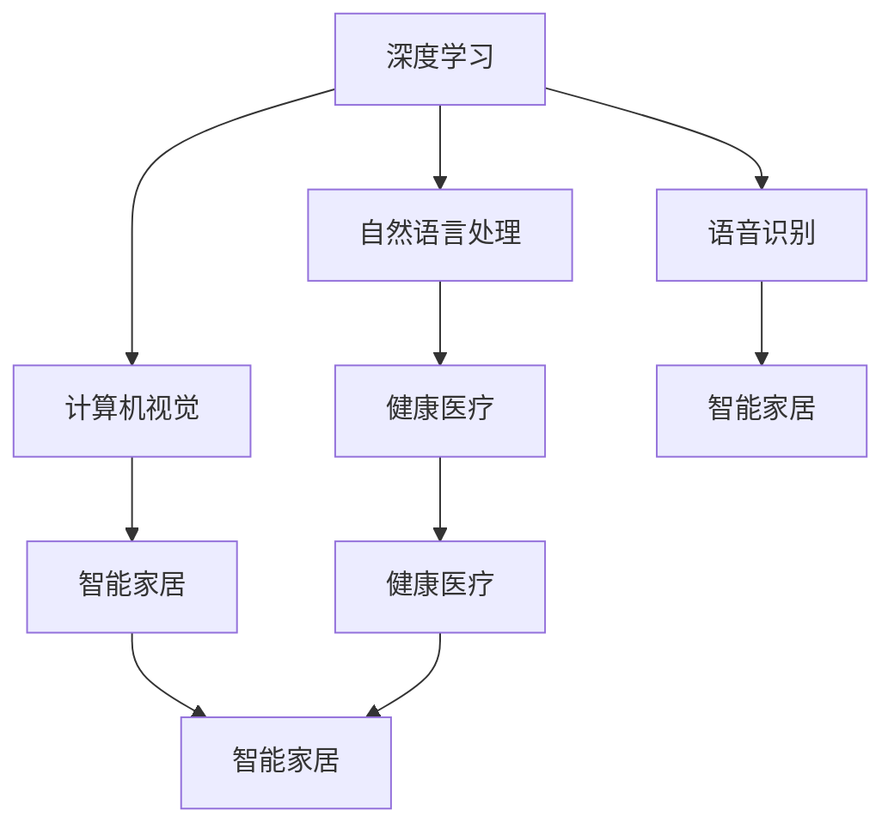

                 

# 李开复：苹果发布AI应用的趋势

> 关键词：AI应用，苹果，技术趋势，人工智能，深度学习，自然语言处理，计算机视觉，机器人技术

## 1. 背景介绍

### 1.1 问题由来

在过去的几年里，人工智能（AI）技术经历了快速发展，尤其是在深度学习、计算机视觉、自然语言处理和机器人技术等领域。这些技术的进步为各行各业带来了深刻的变革，推动了智能化的发展。而苹果公司作为全球知名的科技巨头，其AI应用的发布无疑会引发广泛关注。本文将深入探讨苹果发布AI应用的趋势，从技术角度分析其背后的原理和应用前景。

### 1.2 问题核心关键点

苹果的AI应用主要集中在以下几个领域：自然语言处理（NLP）、计算机视觉（CV）、语音识别、智能家居、健康医疗等。这些应用展示了苹果在AI技术上的深厚积累和创新能力。通过对这些应用的深入分析，可以揭示苹果发布AI应用的趋势，并预测未来AI技术的发展方向。

## 2. 核心概念与联系

### 2.1 核心概念概述

在深入探讨苹果发布AI应用的趋势之前，我们需要了解一些核心概念及其相互联系。

- **深度学习**：一种基于多层神经网络的机器学习技术，通过学习大量数据，实现对复杂问题的自动推断。深度学习是当前AI应用的核心技术。

- **计算机视觉**：使计算机能够“看”的能力，通过对图像和视频数据的分析，实现图像识别、目标检测、图像分割等任务。

- **自然语言处理**：使计算机能够“理解”自然语言的能力，涉及文本分类、情感分析、机器翻译、问答系统等任务。

- **语音识别**：将人类的语音转换成计算机可以理解的文本或命令，常用于智能助手和语音输入等领域。

- **智能家居**：通过AI技术，使家居设备能够感知环境并主动响应，提供更智能、更便捷的居住体验。

- **健康医疗**：利用AI技术进行疾病诊断、药物研发、患者监护等，提升医疗服务的质量和效率。

这些核心概念构成了苹果发布AI应用的基础，通过它们的结合，可以实现更广泛、更深入的应用。

### 2.2 概念间的关系

这些核心概念之间的关系可以通过以下Mermaid流程图来展示：



这个流程图展示了深度学习如何与其他AI技术结合，形成多样化的应用场景。例如，深度学习结合计算机视觉可以实现图像识别，结合自然语言处理可以实现机器翻译，结合语音识别可以实现智能助手。这些技术在智能家居和健康医疗等领域也有广泛应用。

## 3. 核心算法原理 & 具体操作步骤

### 3.1 算法原理概述

苹果的AI应用主要基于深度学习技术，其核心算法包括卷积神经网络（CNN）、循环神经网络（RNN）、Transformer等。这些算法通过学习大量数据，实现对复杂问题的自动推断和决策。

### 3.2 算法步骤详解

苹果的AI应用开发一般包括以下几个步骤：

1. **数据准备**：收集和整理相关领域的数据，包括图像、文本、语音等。
2. **模型训练**：使用深度学习算法训练模型，调整模型参数，使其能够准确地完成特定任务。
3. **模型评估**：使用测试集评估模型性能，确保模型在实际应用中表现良好。
4. **应用部署**：将训练好的模型部署到实际应用中，实现对用户需求的响应。
5. **持续优化**：根据用户反馈和应用表现，不断优化模型，提高性能。

### 3.3 算法优缺点

苹果的AI应用采用深度学习技术，具有以下优点：

- **自适应能力强**：深度学习模型具有很强的自适应能力，能够根据新数据进行自我优化。
- **准确率高**：深度学习模型在特定任务上通常具有较高的准确率。
- **应用广泛**：深度学习技术可以应用于多个领域，如自然语言处理、计算机视觉、语音识别等。

但深度学习也存在一些缺点：

- **计算资源需求高**：深度学习模型的训练和推理需要大量计算资源。
- **解释性差**：深度学习模型通常被视为“黑盒”，其内部决策过程难以解释。
- **过拟合风险**：深度学习模型容易过拟合，特别是面对小样本数据时。

### 3.4 算法应用领域

苹果的AI应用主要集中在以下几个领域：

- **自然语言处理**：如Siri语音助手、消息回复系统等。
- **计算机视觉**：如人脸识别、增强现实（AR）技术等。
- **语音识别**：如听写转换、智能语音助手等。
- **智能家居**：如智能音箱、智能手表等。
- **健康医疗**：如健康监测、智能诊断等。

这些应用展示了深度学习技术在多个领域的广泛应用，推动了AI技术的普及和发展。

## 4. 数学模型和公式 & 详细讲解 & 举例说明

### 4.1 数学模型构建

以自然语言处理为例，假设我们要开发一个文本分类模型。我们可以使用卷积神经网络（CNN）来实现这一目标。CNN由多个卷积层和池化层组成，每个层都包含多个卷积核，用于提取不同的特征。

### 4.2 公式推导过程

卷积层的公式可以表示为：

$$
y_i^j = \sigma\left(\sum_k w_{i,j}^k x_{i,j,k}\right)
$$

其中，$y_i^j$ 表示第 $j$ 层第 $i$ 个神经元的输出，$x_{i,j,k}$ 表示输入的特征向量，$w_{i,j}^k$ 表示卷积核权重。

池化层的公式可以表示为：

$$
y_i = \max_{j} x_{i,j}
$$

其中，$y_i$ 表示池化后的输出，$x_{i,j}$ 表示输入的特征向量。

### 4.3 案例分析与讲解

以图像分类为例，我们可以使用卷积神经网络（CNN）来实现这一目标。CNN由多个卷积层和池化层组成，每个层都包含多个卷积核，用于提取不同的特征。在训练过程中，我们通过反向传播算法更新卷积核的权重，使模型能够准确地对图像进行分类。

## 5. 项目实践：代码实例和详细解释说明

### 5.1 开发环境搭建

要进行AI应用开发，首先需要搭建开发环境。以下是Python环境下安装所需的工具包的步骤：

1. 安装Python 3.7及以上版本。
2. 安装TensorFlow 2.0及以上版本。
3. 安装Keras。
4. 安装PIL库（用于图像处理）。
5. 安装OpenCV库（用于计算机视觉）。
6. 安装NLTK库（用于自然语言处理）。

### 5.2 源代码详细实现

以下是一个使用TensorFlow和Keras框架进行图像分类的示例代码：

```python
import tensorflow as tf
from tensorflow.keras import layers, models

# 定义卷积层
conv2d = layers.Conv2D(32, (3, 3), activation='relu', input_shape=(28, 28, 1))

# 定义池化层
maxpool2d = layers.MaxPooling2D((2, 2))

# 定义全连接层
fc1 = layers.Dense(128, activation='relu')

# 定义输出层
output = layers.Dense(10, activation='softmax')

# 构建模型
model = models.Sequential()
model.add(conv2d)
model.add(maxpool2d)
model.add(conv2d)
model.add(maxpool2d)
model.add(layers.Flatten())
model.add(fc1)
model.add(output)

# 编译模型
model.compile(optimizer='adam', loss='categorical_crossentropy', metrics=['accuracy'])

# 训练模型
model.fit(train_images, train_labels, epochs=5, validation_data=(test_images, test_labels))
```

### 5.3 代码解读与分析

在上述代码中，我们首先定义了卷积层和池化层，用于提取图像特征。然后定义了全连接层和输出层，用于进行分类。最后使用Keras框架构建模型，并使用训练数据进行训练。

## 6. 实际应用场景

### 6.4 未来应用展望

未来，苹果的AI应用将更加普及和深入，覆盖更多领域。以下是对未来应用场景的展望：

- **智能家居**：通过AI技术实现智能控制，如智能灯光、智能温控等，提高居住舒适度。
- **健康医疗**：利用AI技术进行疾病预测、药物研发、患者监护等，提升医疗服务的质量和效率。
- **自动驾驶**：结合计算机视觉和深度学习技术，实现自动驾驶，提升交通安全和效率。
- **教育**：利用自然语言处理技术，开发智能教育系统，提供个性化学习方案。
- **金融**：利用AI技术进行风险评估、欺诈检测、投资分析等，提升金融服务水平。

## 7. 工具和资源推荐

### 7.1 学习资源推荐

1. **Coursera**：提供深度学习、计算机视觉、自然语言处理等领域的课程，涵盖从入门到高级的内容。
2. **Google AI Blog**：Google AI团队定期发布AI技术进展和应用案例，是了解最新AI动态的好去处。
3. **PyTorch官方文档**：详细介绍了PyTorch框架的使用方法，是学习深度学习的重要资源。
4. **Keras官方文档**：提供了Keras框架的详细教程，帮助开发者快速上手。

### 7.2 开发工具推荐

1. **PyCharm**：用于Python编程的集成开发环境，支持TensorFlow、Keras等AI框架。
2. **Jupyter Notebook**：用于数据科学和机器学习的交互式编程工具，支持Python、R等语言。
3. **Anaconda**：用于Python编程的环境管理工具，支持多种版本的Python和工具包的安装。

### 7.3 相关论文推荐

1. **《深度学习》（Goodfellow et al., 2016）**：介绍了深度学习的原理和应用，是AI领域的经典教材。
2. **《计算机视觉：算法与应用》（Huang et al., 2017）**：介绍了计算机视觉的基本概念和常用算法。
3. **《自然语言处理综论》（Jurafsky & Martin, 2019）**：详细介绍了自然语言处理的基本技术和应用。

## 8. 总结：未来发展趋势与挑战

### 8.1 研究成果总结

苹果的AI应用展示了深度学习技术的强大应用潜力，推动了AI技术的普及和发展。通过自然语言处理、计算机视觉、语音识别等技术的应用，苹果的AI应用在多个领域取得了显著成效。

### 8.2 未来发展趋势

未来，AI技术将更加广泛地应用于各个领域，推动智能化发展的进程。以下是未来发展趋势：

- **跨领域融合**：AI技术将与其他技术（如区块链、物联网）结合，实现跨领域应用。
- **自动化**：AI技术将进一步自动化，减少人工干预，提高效率。
- **个性化**：AI技术将实现个性化服务，提供更精准、更定制化的解决方案。
- **伦理和安全性**：AI技术的伦理和安全性将受到更多关注，确保技术的公平、透明和可信。

### 8.3 面临的挑战

尽管AI技术在各个领域取得了显著进展，但仍面临以下挑战：

- **数据隐私**：AI应用需要大量数据，如何保护用户隐私成为一个重要问题。
- **算法透明性**：深度学习模型通常被视为“黑盒”，如何提高算法的透明性和可解释性是一个重要课题。
- **计算资源**：AI应用需要大量计算资源，如何降低计算成本是一个挑战。
- **伦理和公平性**：AI应用可能存在偏见和歧视，如何确保算法的公平和透明是一个重要问题。

### 8.4 研究展望

未来，AI技术需要在以下几个方面进行研究：

- **数据隐私保护**：研究如何保护用户隐私，确保数据安全。
- **算法透明性**：研究如何提高算法的透明性和可解释性，提升算法的可信度。
- **计算效率**：研究如何降低计算成本，提高计算效率。
- **伦理和公平性**：研究如何确保算法的公平和透明，避免算法偏见和歧视。

总之，苹果的AI应用展示了深度学习技术的强大应用潜力，推动了AI技术的普及和发展。未来，AI技术将在更多领域得到应用，带来深刻的变革和进步。但同时，AI技术也需要面对数据隐私、算法透明性、计算资源、伦理和公平性等挑战，需要更多的研究来确保技术的健康发展。

## 9. 附录：常见问题与解答

**Q1：苹果的AI应用如何保护用户隐私？**

A: 苹果的AI应用通常采用本地数据处理和加密传输等技术，保护用户隐私。例如，在语音助手Siri中，用户的语音数据通常只在本地设备上处理，不传输到云端。

**Q2：深度学习模型如何提高算法透明性？**

A: 提高深度学习模型的透明性可以通过以下方法：
- **可视化**：使用可视化工具（如TensorBoard）可视化模型训练过程，帮助理解模型的内部工作机制。
- **解释性模型**：使用解释性模型（如LIME、SHAP）解释模型的预测结果，提供可解释性。
- **可解释性训练**：在模型训练过程中引入可解释性约束，提高模型的可解释性。

**Q3：如何降低深度学习模型的计算成本？**

A: 降低深度学习模型的计算成本可以通过以下方法：
- **模型压缩**：使用模型压缩技术（如剪枝、量化）减小模型尺寸，降低计算资源需求。
- **分布式训练**：使用分布式训练技术，提高训练效率，降低单次训练的计算成本。
- **边缘计算**：使用边缘计算技术，将计算任务分配到本地设备，减少云端的计算负担。

**Q4：如何确保AI算法的公平和透明？**

A: 确保AI算法的公平和透明可以通过以下方法：
- **数据清洗**：在数据处理过程中进行公平性检查，确保数据集无偏见。
- **算法约束**：在算法设计中加入公平性约束，确保算法无偏见。
- **审计和评估**：定期对AI算法进行审计和评估，确保算法的公平性和透明性。

通过以上措施，可以确保AI算法的公平和透明，避免算法偏见和歧视。

---

作者：禅与计算机程序设计艺术 / Zen and the Art of Computer Programming

