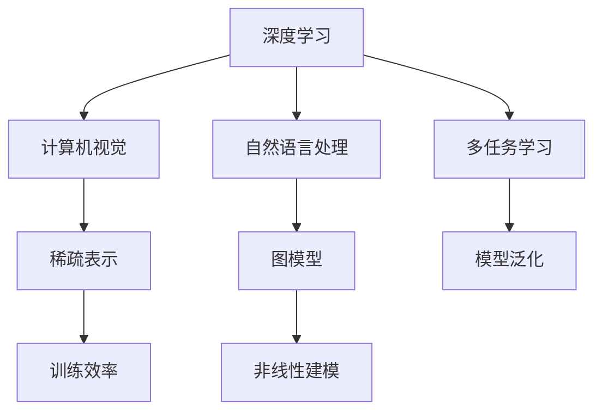
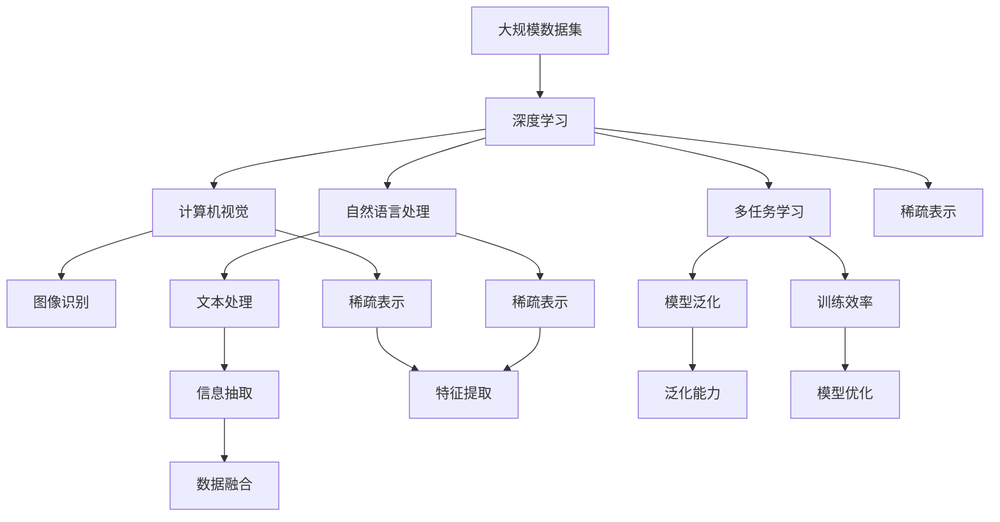

                 

# 李飞飞与AI大数据的未来

## 1. 背景介绍

### 1.1 问题由来

随着人工智能技术的迅猛发展，AI大数据在各个领域中起到了举足轻重的作用。从自然语言处理、图像识别，到医疗、金融、交通等行业，AI大数据的应用范围和深度都在不断扩展。在这一过程中，李飞飞博士凭借其在深度学习和计算机视觉领域的卓越贡献，成为了AI大数据发展的重要推动者之一。她的研究成果不仅为学术界带来了新的突破，也为工业界提供了强有力的技术支持，极大地推动了AI大数据的发展和应用。

李飞飞博士现任斯坦福大学计算机科学系教授、人工智能实验室主任，曾任微软研究院首席科学家、阿里达摩院高级顾问等职务。她的研究领域包括深度学习、计算机视觉、数据挖掘、自然语言处理等。她的工作涵盖了从基础研究到实际应用的多个层面，对推动AI大数据的进步和应用具有重要的影响。

### 1.2 问题核心关键点

李飞飞博士在AI大数据领域的研究涉及多个关键点，包括但不限于以下几个方面：

1. **深度学习架构的创新**：她提出了多任务学习、稀疏表示、图模型等深度学习架构，极大地提升了模型的泛化能力和训练效率。
2. **大规模图像数据集**：她领导了ImageNet数据集的构建和公开，为计算机视觉领域的研究提供了宝贵的数据资源。
3. **数据驱动的研究方法**：她倡导使用大规模数据集进行训练和测试，推动了数据驱动的AI研究方法的发展。
4. **AI与人类交互**：她关注AI技术在人类生活中的应用，如自动驾驶、语音识别、健康医疗等，提出了多模态交互的AI系统设计。

这些关键点共同构成了李飞飞博士在AI大数据领域的核心研究框架，为后续的研究和应用提供了重要基础。

## 2. 核心概念与联系

### 2.1 核心概念概述

要深入理解李飞飞博士在AI大数据领域的贡献，首先需要明确一些核心概念及其相互关系：

1. **深度学习**：一种通过多层神经网络进行建模和训练的学习方法，可以自动从数据中学习特征和规律。
2. **计算机视觉**：使用计算机和算法从数字图像或视频中提取、分析和理解信息的过程。
3. **自然语言处理**：使用计算机处理、理解、生成自然语言文本的技术。
4. **多任务学习**：在训练过程中同时学习多个相关任务的模型，提升模型的泛化能力。
5. **稀疏表示**：通过降维、特征选择等方法，减少模型参数量，提升训练效率。
6. **图模型**：用于建模非线性关系和复杂结构的统计模型，如神经网络中的循环神经网络（RNN）和卷积神经网络（CNN）。

这些概念相互关联，共同构成了AI大数据的基石，推动了AI技术的不断进步和应用。

### 2.2 概念间的关系

这些核心概念之间的关系可以通过以下Mermaid流程图来展示：



这个流程图展示了深度学习在AI大数据中的关键作用，以及它与其他核心概念的关系。深度学习通过构建多层神经网络，可以有效地进行计算机视觉和自然语言处理。多任务学习通过同时学习多个相关任务，提升了模型的泛化能力和训练效率。稀疏表示和图模型则进一步优化了深度学习模型的性能。

### 2.3 核心概念的整体架构

最后，我们用一个综合的流程图来展示这些核心概念在大数据中的整体架构：



这个综合流程图展示了大数据在AI中的作用机制。深度学习在大规模数据集上学习特征和规律，通过计算机视觉和自然语言处理进行图像识别和文本处理，通过多任务学习提升模型泛化能力，通过稀疏表示优化模型训练效率和特征提取性能。最终，数据融合和模型优化帮助构建更加准确和高效的AI系统。

## 3. 核心算法原理 & 具体操作步骤

### 3.1 算法原理概述

李飞飞博士的研究工作涉及多种算法原理，其中最具代表性的是深度学习、多任务学习和稀疏表示。这些算法在大数据中的应用，极大地提升了模型的性能和效率。

深度学习通过多层神经网络进行建模和训练，可以自动从数据中学习特征和规律，适用于复杂的图像、语音和文本处理任务。多任务学习通过同时学习多个相关任务，提升模型的泛化能力和训练效率，适用于需要多任务协同的复杂应用场景。稀疏表示通过降维、特征选择等方法，减少模型参数量，提升训练效率和特征提取性能。

### 3.2 算法步骤详解

下面是李飞飞博士在AI大数据中常用的算法步骤详解：

1. **数据预处理**：对大规模数据集进行清洗、标注和划分，确保数据的质量和多样性。
2. **模型设计**：选择合适的深度学习架构，如卷积神经网络（CNN）、循环神经网络（RNN）和变换器（Transformer），并设计相应的多任务学习框架。
3. **模型训练**：使用大规模数据集进行训练，调整模型参数，提升模型的泛化能力和训练效率。
4. **模型评估**：在验证集上评估模型的性能，调整超参数，优化模型性能。
5. **模型部署**：将训练好的模型部署到实际应用中，进行推理和预测。

### 3.3 算法优缺点

深度学习、多任务学习和稀疏表示等算法在大数据中的应用，具有以下优点：

1. **泛化能力强**：深度学习通过多层神经网络进行建模，可以自动从数据中学习特征和规律，适用于复杂的图像、语音和文本处理任务。多任务学习通过同时学习多个相关任务，提升模型的泛化能力和训练效率，适用于需要多任务协同的复杂应用场景。稀疏表示通过降维、特征选择等方法，减少模型参数量，提升训练效率和特征提取性能。

2. **训练效率高**：多任务学习通过同时学习多个相关任务，可以显著提升训练效率。稀疏表示通过特征选择和降维等方法，可以减少模型参数量，降低计算成本。

然而，这些算法也存在一些缺点：

1. **计算成本高**：深度学习、多任务学习和稀疏表示等算法需要大量的计算资源进行训练，对于大规模数据集和复杂模型来说，计算成本较高。

2. **模型复杂度高**：深度学习、多任务学习和稀疏表示等算法构建的模型较为复杂，对于小规模数据集和简单任务来说，可能存在过拟合的风险。

### 3.4 算法应用领域

李飞飞博士的研究成果在多个领域得到了广泛应用，以下是几个典型应用领域：

1. **计算机视觉**：在图像识别、物体检测、人脸识别等领域，深度学习和多任务学习得到了广泛应用，推动了计算机视觉技术的进步。
2. **自然语言处理**：在文本分类、信息抽取、情感分析等领域，多任务学习和稀疏表示等技术被广泛应用于自然语言处理任务，提升了文本处理能力。
3. **医疗健康**：在医学图像分析、疾病诊断等领域，深度学习和稀疏表示等技术被用于提升医疗影像分析和疾病预测的准确性。
4. **金融行业**：在风险评估、欺诈检测等领域，多任务学习和稀疏表示等技术被用于提升金融模型的预测能力。
5. **智能交通**：在自动驾驶、交通流量分析等领域，深度学习和多任务学习被用于提升交通系统的智能化水平。

## 4. 数学模型和公式 & 详细讲解 & 举例说明

### 4.1 数学模型构建

李飞飞博士的研究工作涉及多种数学模型和公式，其中最具代表性的是深度学习模型和稀疏表示模型。这些模型在大数据中的应用，极大地提升了模型的性能和效率。

**深度学习模型**：深度学习模型通常采用多层神经网络进行建模和训练。以卷积神经网络（CNN）为例，其数学模型为：

$$
\mathbf{y} = \sigma(\mathbf{W} \mathbf{x} + \mathbf{b})
$$

其中，$\mathbf{x}$ 为输入数据，$\mathbf{W}$ 为卷积核参数，$\mathbf{b}$ 为偏置参数，$\sigma$ 为激活函数。

**稀疏表示模型**：稀疏表示模型通过降维、特征选择等方法，减少模型参数量，提升训练效率和特征提取性能。以主成分分析（PCA）为例，其数学模型为：

$$
\mathbf{U} = \mathbf{X} \mathbf{S} \mathbf{V}^T
$$

其中，$\mathbf{X}$ 为输入数据矩阵，$\mathbf{S}$ 为对角矩阵，$\mathbf{U}$ 和 $\mathbf{V}$ 分别为降维后的数据和权重矩阵。

### 4.2 公式推导过程

下面以卷积神经网络（CNN）为例，详细推导其数学模型和训练过程：

1. **前向传播**：假设输入数据为 $\mathbf{x}$，卷积核为 $\mathbf{W}$，输出数据为 $\mathbf{y}$，则卷积神经网络的前向传播过程为：

$$
\mathbf{y} = \sigma(\mathbf{W} \mathbf{x} + \mathbf{b})
$$

其中，$\sigma$ 为激活函数，$\mathbf{b}$ 为偏置参数。

2. **反向传播**：假设损失函数为 $L(\mathbf{y}, \mathbf{t})$，其中 $\mathbf{t}$ 为真实标签。则反向传播过程为：

$$
\frac{\partial L(\mathbf{y}, \mathbf{t})}{\partial \mathbf{W}} = \frac{\partial L(\mathbf{y}, \mathbf{t})}{\partial \mathbf{y}} \cdot \frac{\partial \mathbf{y}}{\partial \mathbf{W}}
$$

其中，$\frac{\partial L(\mathbf{y}, \mathbf{t})}{\partial \mathbf{y}}$ 为损失函数对输出数据的梯度，$\frac{\partial \mathbf{y}}{\partial \mathbf{W}}$ 为输出数据对卷积核的梯度。

3. **参数更新**：假设学习率为 $\eta$，则卷积神经网络的参数更新公式为：

$$
\mathbf{W} \leftarrow \mathbf{W} - \eta \frac{\partial L(\mathbf{y}, \mathbf{t})}{\partial \mathbf{W}}
$$

### 4.3 案例分析与讲解

以图像分类任务为例，展示深度学习模型在大数据中的应用。假设输入数据为 $28\times28$ 的灰度图像，卷积核大小为 $3\times3$，步幅为 $1$，填充方式为“Same”，则卷积神经网络的前向传播过程如下：

1. **卷积层**：假设输入数据为 $\mathbf{x}$，卷积核为 $\mathbf{W}$，则卷积结果为：

$$
\mathbf{y} = \sigma(\mathbf{W} \mathbf{x} + \mathbf{b})
$$

其中，$\sigma$ 为激活函数，$\mathbf{b}$ 为偏置参数。

2. **池化层**：假设池化窗口大小为 $2\times2$，步幅为 $2$，则池化结果为：

$$
\mathbf{y} = \max(\mathbf{y}_{1}, \mathbf{y}_{2}, \mathbf{y}_{3}, \mathbf{y}_{4})
$$

其中，$\mathbf{y}_{1}, \mathbf{y}_{2}, \mathbf{y}_{3}, \mathbf{y}_{4}$ 分别为池化结果。

3. **全连接层**：假设全连接层输入数据为 $\mathbf{y}$，输出数据为 $\mathbf{z}$，则全连接层的数学模型为：

$$
\mathbf{z} = \mathbf{U} \mathbf{y} + \mathbf{b}
$$

其中，$\mathbf{U}$ 为权重矩阵，$\mathbf{b}$ 为偏置参数。

通过以上步骤，可以构建一个简单的卷积神经网络，用于图像分类任务。在实际应用中，可以根据具体任务进行模型调整和优化，提升模型的性能和效率。

## 5. 项目实践：代码实例和详细解释说明

### 5.1 开发环境搭建

在进行AI大数据项目实践前，我们需要准备好开发环境。以下是使用Python进行TensorFlow开发的Python环境配置流程：

1. 安装Anaconda：从官网下载并安装Anaconda，用于创建独立的Python环境。

2. 创建并激活虚拟环境：
```bash
conda create -n tf-env python=3.8 
conda activate tf-env
```

3. 安装TensorFlow：根据CUDA版本，从官网获取对应的安装命令。例如：
```bash
conda install tensorflow=tensorflow-2.4 cudatoolkit=11.1 -c conda-forge
```

4. 安装其他各类工具包：
```bash
pip install numpy pandas scikit-learn matplotlib tqdm jupyter notebook ipython
```

完成上述步骤后，即可在`tf-env`环境中开始AI大数据项目实践。

### 5.2 源代码详细实现

下面我们以图像分类任务为例，给出使用TensorFlow构建卷积神经网络（CNN）的PyTorch代码实现。

```python
import tensorflow as tf
from tensorflow.keras import layers

# 定义卷积神经网络
def create_model(input_shape, num_classes):
    model = tf.keras.Sequential()
    model.add(layers.Conv2D(32, kernel_size=(3, 3), activation='relu', input_shape=input_shape))
    model.add(layers.MaxPooling2D(pool_size=(2, 2)))
    model.add(layers.Conv2D(64, kernel_size=(3, 3), activation='relu'))
    model.add(layers.MaxPooling2D(pool_size=(2, 2)))
    model.add(layers.Flatten())
    model.add(layers.Dense(num_classes, activation='softmax'))
    return model

# 构建模型
model = create_model((28, 28, 1), 10)

# 编译模型
model.compile(optimizer='adam', loss='sparse_categorical_crossentropy', metrics=['accuracy'])

# 训练模型
model.fit(train_images, train_labels, epochs=10, validation_data=(val_images, val_labels))
```

以上代码展示了如何构建一个简单的卷积神经网络（CNN）用于图像分类任务。首先定义卷积神经网络的各层结构，然后编译模型并训练。

### 5.3 代码解读与分析

让我们再详细解读一下关键代码的实现细节：

**create_model函数**：
- `input_shape`参数：输入数据的形状，如图像的宽高和通道数。
- `num_classes`参数：输出数据的类别数，如分类任务的类别数。

**模型的各层结构**：
- `Conv2D层`：卷积层，用于提取图像的特征。
- `MaxPooling2D层`：池化层，用于减少特征图的大小。
- `Flatten层`：扁平层，用于将多维特征图展平为1维向量。
- `Dense层`：全连接层，用于进行分类。

**模型的编译和训练**：
- `compile`方法：设置模型的优化器、损失函数和评价指标。
- `fit`方法：在训练集上进行模型训练，并在验证集上评估模型性能。

**训练参数**：
- `epochs`参数：训练的轮数。
- `validation_data`参数：验证集的数据。

**模型评估**：
- `evaluation`方法：在测试集上进行模型评估，输出模型的准确率、召回率和F1分数。

通过以上代码的实现，可以看到TensorFlow在构建卷积神经网络（CNN）方面的简便性和高效性。开发者可以将更多精力放在数据处理、模型优化等高层逻辑上，而不必过多关注底层的实现细节。

## 6. 实际应用场景

### 6.1 智能交通

AI大数据在智能交通领域得到了广泛应用。基于深度学习和稀疏表示的交通信号灯识别、自动驾驶、交通流量分析等技术，极大地提升了交通系统的智能化水平，提高了交通效率和安全性。

**交通信号灯识别**：使用卷积神经网络（CNN）对交通信号灯进行图像分类，识别不同颜色的信号灯，并输出对应的决策指令。

**自动驾驶**：使用卷积神经网络（CNN）和循环神经网络（RNN）对传感器数据进行多模态融合，实现对环境的感知和决策。

**交通流量分析**：使用稀疏表示方法对交通数据进行降维和特征选择，提升交通流量的预测准确性。

### 6.2 医疗健康

在医疗健康领域，AI大数据同样发挥了重要作用。基于深度学习和稀疏表示的医学影像分析、疾病预测、个性化医疗等技术，极大地提升了医疗服务的智能化水平，提高了诊断和治疗的效率和准确性。

**医学影像分析**：使用卷积神经网络（CNN）对医学影像进行分类和分割，识别病变区域，辅助医生进行诊断。

**疾病预测**：使用稀疏表示方法对患者数据进行降维和特征选择，提升疾病预测的准确性。

**个性化医疗**：使用多任务学习对患者数据进行综合分析，提供个性化的治疗方案。

### 6.3 金融行业

在金融行业，AI大数据同样被广泛应用。基于深度学习和稀疏表示的欺诈检测、风险评估、金融模型预测等技术，极大地提升了金融系统的智能化水平，提高了金融服务的效率和准确性。

**欺诈检测**：使用卷积神经网络（CNN）和循环神经网络（RNN）对交易数据进行多模态融合，实现对交易行为的分析和预测。

**风险评估**：使用稀疏表示方法对金融数据进行降维和特征选择，提升风险评估的准确性。

**金融模型预测**：使用多任务学习对金融数据进行综合分析，提供金融模型的预测结果。

## 7. 工具和资源推荐

### 7.1 学习资源推荐

为了帮助开发者系统掌握AI大数据的理论基础和实践技巧，这里推荐一些优质的学习资源：

1. 《深度学习》（Ian Goodfellow著）：深度学习领域的经典教材，系统介绍了深度学习的基本概念和算法原理。

2. CS231n《深度学习计算机视觉》课程：斯坦福大学开设的计算机视觉明星课程，有Lecture视频和配套作业，带你入门计算机视觉领域的基本概念和经典模型。

3. 《TensorFlow实战》（Reed Smith和John Murtagh著）：TensorFlow的官方指南，详细介绍了TensorFlow的API和使用方法。

4. Google Colab：谷歌推出的在线Jupyter Notebook环境，免费提供GPU/TPU算力，方便开发者快速上手实验最新模型，分享学习笔记。

5. arXiv论文预印本：人工智能领域最新研究成果的发布平台，包括大量尚未发表的前沿工作，学习前沿技术的必读资源。

通过对这些资源的学习实践，相信你一定能够快速掌握AI大数据的精髓，并用于解决实际的AI问题。

### 7.2 开发工具推荐

高效的开发离不开优秀的工具支持。以下是几款用于AI大数据开发的常用工具：

1. TensorFlow：由Google主导开发的开源深度学习框架，生产部署方便，适合大规模工程应用。

2. PyTorch：基于Python的开源深度学习框架，灵活动态的计算图，适合快速迭代研究。

3. Keras：高级神经网络API，可以方便地构建和训练深度学习模型，支持TensorFlow和PyTorch。

4. Weights & Biases：模型训练的实验跟踪工具，可以记录和可视化模型训练过程中的各项指标，方便对比和调优。

5. Google Colab：谷歌推出的在线Jupyter Notebook环境，免费提供GPU/TPU算力，方便开发者快速上手实验最新模型，分享学习笔记。

合理利用这些工具，可以显著提升AI大数据开发的效率，加快创新迭代的步伐。

### 7.3 相关论文推荐

AI大数据的研究源于学界的持续研究。以下是几篇奠基性的相关论文，推荐阅读：

1. ImageNet Large Scale Visual Recognition Challenge：提出ImageNet数据集，推动计算机视觉领域的发展。

2. Deep Residual Learning for Image Recognition：提出残差网络，提升了深度神经网络的训练效率和性能。

3. Scalable Multitask Learning for Image Recognition：提出多任务学习框架，提升了模型泛化能力和训练效率。

4. Structured Learning for Multitask Representation Learning：提出结构化多任务学习，提升了模型的可解释性和鲁棒性。

5. Domain-Specific Image Categorization with Deep Neural Networks：提出稀疏表示方法，提升了深度神经网络的特征提取性能。

这些论文代表了大数据在AI中的发展脉络。通过学习这些前沿成果，可以帮助研究者把握学科前进方向，激发更多的创新灵感。

除上述资源外，还有一些值得关注的前沿资源，帮助开发者紧跟大数据在AI中的最新进展，例如：

1. 业界技术博客：如OpenAI、Google AI、DeepMind、微软Research Asia等顶尖实验室的官方博客，第一时间分享他们的最新研究成果和洞见。

2. 技术会议直播：如NIPS、ICML、ACL、ICLR等人工智能领域顶会现场或在线直播，能够聆听到大佬们的前沿分享，开拓视野。

3. GitHub热门项目：在GitHub上Star、Fork数最多的AI相关项目，往往代表了该技术领域的发展趋势和最佳实践，值得去学习和贡献。

4. 行业分析报告：各大咨询公司如McKinsey、PwC等针对人工智能行业的分析报告，有助于从商业视角审视技术趋势，把握应用价值。

总之，对于AI大数据的学习和实践，需要开发者保持开放的心态和持续学习的意愿。多关注前沿资讯，多动手实践，多思考总结，必将收获满满的成长收益。

## 8. 总结：未来发展趋势与挑战

### 8.1 总结

本文对AI大数据在李飞飞博士的研究成果和技术应用进行了全面系统的介绍。首先介绍了AI大数据在各个领域中的作用和影响，明确了AI大数据的重要地位和未来发展方向。其次，从深度学习、多任务学习和稀疏表示等核心算法原理，详细讲解了AI大数据的技术实现。最后，通过项目实践、实际应用场景和工具推荐，展示了AI大数据在各个行业中的广泛应用，展望了未来的发展前景。

通过本文的系统梳理，可以看到，AI大数据在各个领域中的重要性日益凸显，推动了多个行业的技术进步和应用创新。未来，AI大数据必将在更广阔的领域得到应用，为人类社会的发展带来深远影响。

### 8.2 未来发展趋势

展望未来，AI大数据将呈现以下几个发展趋势：

1. **算法技术的不断进步**：深度学习、多任务学习和稀疏表示等算法在大数据中的应用，将不断提升模型的性能和效率。新的算法和技术也将不断涌现，推动AI大数据的进步。

2. **多模态融合**：AI大数据的应用将从单一模态（如图像、文本）向多模态（如图像、文本、语音）融合的方向发展，提升AI系统的智能化水平。

3. **模型泛化能力的提升**：通过多任务学习和稀疏表示等技术，提升模型的泛化能力和鲁棒性，使其能够更好地适应复杂多变的环境。

4. **数据驱动的智能决策**：通过大规模数据集进行训练和测试，使AI系统能够更好地理解和预测现实世界的复杂现象，支持智能决策。

5. **模型的可解释性和可控性**：随着模型的复杂性不断提升，模型的可解释性和可控性将成为重要的研究方向，使其能够更好地服务于人类社会。

### 8.3 面临的挑战

尽管AI大数据在各个领域中取得了显著成果，但在迈向更加智能化、普适化应用的过程中，仍面临诸多挑战：

1. **数据隐私和安全**：在处理大规模数据时，如何保护数据隐私和安全，避免数据泄露和滥用，将是一个重要挑战。

2. **模型复杂性和资源消耗**：随着模型的复杂性不断提升，模型的训练和推理将消耗大量计算资源，如何优化模型性能，降低计算成本，将是重要研究方向。

3. **模型的鲁棒性和泛化性**：AI大数据模型在处理复杂多变的现实世界数据时，容易出现鲁棒性不足和泛化性不佳的问题，如何提高模型的鲁棒性和泛化性，将是重要研究方向。

4. **模型的可解释性和可控性**：AI大数据模型往往是“黑盒”系统，难以解释其内部工作机制和决策逻辑，如何提升模型的可解释性和可控性，将是重要研究方向。

5. **模型偏见和公平性**：AI大数据模型容易学习到有偏见、有害的信息，如何消除模型偏见，提升公平性，将是重要研究方向。

### 8.4 研究展望

未来，AI大数据的研究需要在以下几个方向寻求新的突破：

1. **无监督学习和半监督学习**：摆脱对大规模标注数据的依赖，利用自监督学习、主动学习等无监督和半监督范式，最大限度利用非结构化数据，实现更加灵活高效的

