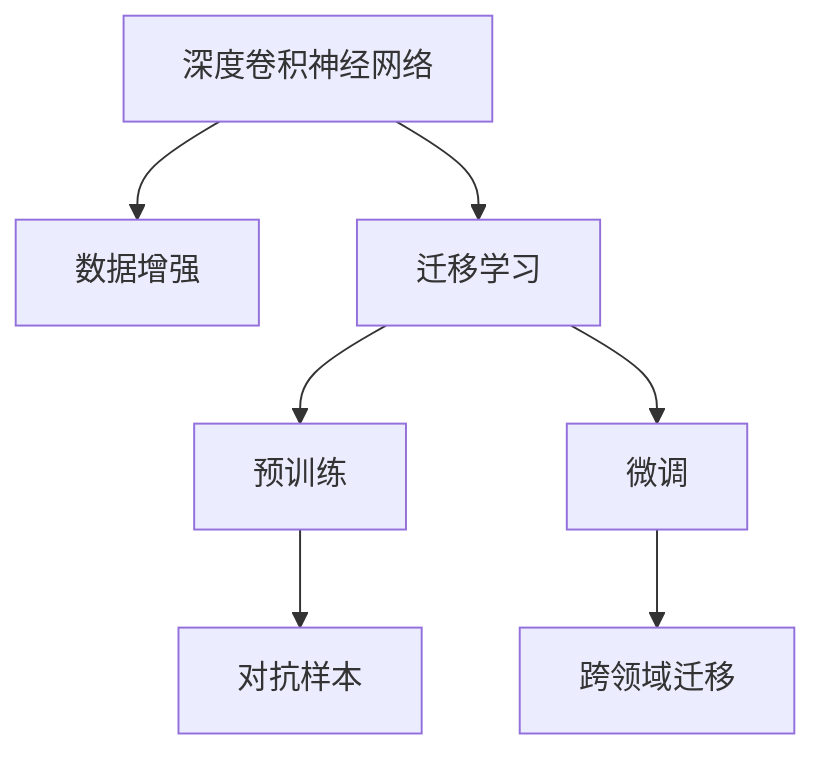
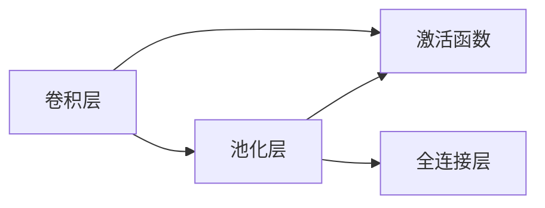
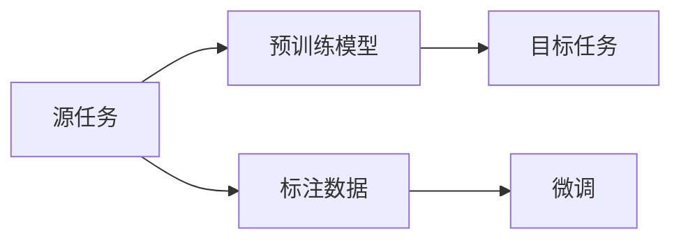
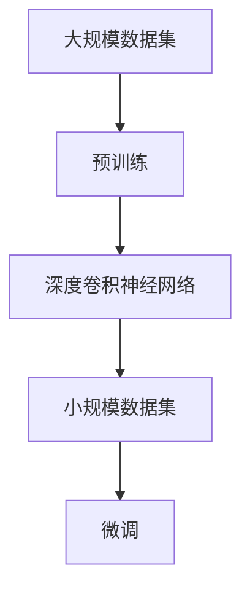
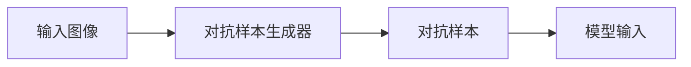
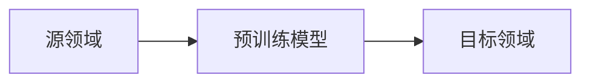
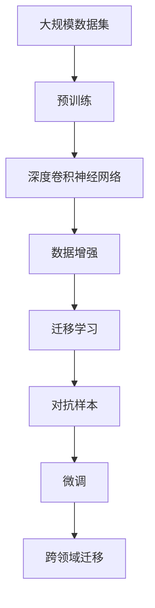

                 

# 李飞飞与ImageNet的传奇

## 1. 背景介绍

### 1.1 问题由来
2010年，斯坦福大学的计算机视觉实验室主任李飞飞，与她的团队发布了一个名为ImageNet的图像识别数据集。该数据集包含超过100万张高分辨率图像，涵盖1000个类别，每类至少1000张图片。ImageNet的发布引起了巨大反响，迅速成为计算机视觉领域的基准数据集。李飞飞的研究团队在ImageNet上的创新性工作，不仅开创了深度学习在计算机视觉领域的先河，也引领了整个AI领域的发展方向。

### 1.2 问题核心关键点
ImageNet的核心贡献在于以下几个方面：
- 构建了迄今为止最大的视觉数据集。通过规模化的数据集，推动了深度学习模型的性能飞跃。
- 提出了基于深度卷积神经网络(CNN)的图像识别模型。使得计算机视觉任务从手工艺提升为工程，大大提高了模型的训练和推理效率。
- 开创了视觉任务的大规模预训练方法。将模型在大规模无标签数据上预训练，再用小规模有标签数据进行微调，取得了卓越的模型效果。

这些贡献不仅提升了计算机视觉技术的水平，也对整个AI社区产生了深远的影响。

### 1.3 问题研究意义
ImageNet的发布和大规模预训练方法的提出，为计算机视觉领域的进一步研究提供了强大的数据和算法支撑。通过使用ImageNet进行模型训练，研究者能够更快速地开发出具备更好泛化能力、更高精度的模型，推动了深度学习在图像分类、物体检测、语义分割、生成对抗网络(GAN)等诸多领域的突破。

同时，ImageNet也促进了AI技术的产业化应用。深度学习模型通过ImageNet训练，能够在安防监控、医疗影像、自动驾驶、智能推荐等众多行业中获得广泛应用，提高了各行业的智能化水平。

## 2. 核心概念与联系

### 2.1 核心概念概述

为更好地理解ImageNet与大规模预训练方法，本节将介绍几个密切相关的核心概念：

- 深度卷积神经网络(Deep Convolutional Neural Network, CNN)：一种多层次的卷积神经网络，用于处理图像、视频等视觉数据。CNN通过多层次卷积、池化、激活函数等操作，提取图像的特征表示，能够高效进行图像分类、目标检测等任务。

- 数据增强(Data Augmentation)：通过一系列图像变换操作，生成更多样的训练数据。数据增强包括旋转、缩放、翻转、随机裁剪等操作，可以有效提升模型的泛化能力和鲁棒性。

- 迁移学习(Transfer Learning)：指将在大规模数据上训练好的模型，迁移到小规模任务上进行微调的方法。通过迁移学习，可以有效减少新任务标注样本的需求，提升模型的快速适应能力。

- 预训练(Pre-training)：指在大规模无标签数据上，通过自监督学习任务训练模型的过程。预训练使得模型学习到通用的视觉特征表示。

- 微调(Fine-tuning)：指在预训练模型的基础上，使用小规模有标签数据，通过有监督学习优化模型在特定任务上的性能。

- 对抗样本(Adversarial Examples)：指经过精心构造的图像，能够误导模型的判断，导致模型在对抗样本上产生错误的输出。

- 跨领域迁移(Cross-domain Transfer)：指将模型在不同领域之间的泛化能力进行迁移，提升模型的通用性。

这些核心概念之间的逻辑关系可以通过以下Mermaid流程图来展示：



这个流程图展示了大规模预训练方法和其相关概念的关系：

1. 深度卷积神经网络是图像识别任务的核心模型。
2. 数据增强在模型训练时增加数据多样性，提高泛化能力。
3. 迁移学习是构建预训练模型的关键技术。
4. 预训练是在大规模无标签数据上训练模型，学习通用特征表示。
5. 微调是在特定任务上有监督学习，优化模型性能。
6. 对抗样本测试模型鲁棒性，验证模型的健壮性。
7. 跨领域迁移提升模型在不同领域中的泛化能力。

这些核心概念共同构成了大规模预训练方法的应用生态，使得深度学习模型能够在计算机视觉等领域取得突破性进展。

### 2.2 概念间的关系

这些核心概念之间存在着紧密的联系，形成了大规模预训练方法的应用框架。下面我们通过几个Mermaid流程图来展示这些概念之间的关系。

#### 2.2.1 深度卷积神经网络的演变



这个流程图展示了卷积神经网络的基本结构，包括卷积层、池化层、激活函数和全连接层。

#### 2.2.2 迁移学习的范式



这个流程图展示了迁移学习的基本流程，即在大规模无标签数据上训练的预训练模型，通过微调在特定有标签数据上获得更好性能。

#### 2.2.3 预训练与微调的关系



这个流程图展示了预训练和微调在大规模视觉数据上的应用流程。

#### 2.2.4 对抗样本的影响



这个流程图展示了对抗样本的生成和使用流程。

#### 2.2.5 跨领域迁移的目标



这个流程图展示了跨领域迁移的基本概念，即在大规模数据上训练的预训练模型，在不同领域中的泛化能力。

### 2.3 核心概念的整体架构

最后，我们用一个综合的流程图来展示这些核心概念在大规模预训练方法中的整体架构：



这个综合流程图展示了从预训练到微调，再到跨领域迁移的完整过程。深度卷积神经网络在大规模数据上预训练，通过数据增强提升模型泛化能力，再用小规模有标签数据进行微调，最后进行跨领域迁移，适应更多任务场景。通过这些流程图，我们可以更清晰地理解大规模预训练方法的整体框架，为后续深入讨论具体的预训练和微调方法奠定基础。

## 3. 核心算法原理 & 具体操作步骤
### 3.1 算法原理概述

ImageNet的大规模预训练方法，基于深度卷积神经网络，通过在大规模无标签数据上预训练，学习通用的视觉特征表示。其核心思想是：通过大规模数据驱动模型学习，使得模型能够更好地适应特定任务。

具体而言，预训练分为两个阶段：

1. 自监督预训练：使用大规模无标签数据，通过图像分类、目标检测等自监督任务训练模型。常见的自监督任务包括图像分类、旋转不变性检测、图像分割等。
2. 有监督微调：在特定任务的有标签数据集上进行微调，通过有监督学习优化模型在特定任务上的性能。微调过程一般包括数据加载、模型定义、损失计算、优化器选择、正则化等步骤。

### 3.2 算法步骤详解

ImageNet的大规模预训练方法主要包括以下几个关键步骤：

**Step 1: 数据准备**
- 收集大规模无标签图像数据集，如ImageNet数据集。
- 选择合适的预训练模型，如AlexNet、VGGNet、ResNet等。
- 使用数据增强技术生成更多训练数据。

**Step 2: 预训练模型定义**
- 在TensorFlow、PyTorch等深度学习框架中定义预训练模型。
- 定义卷积层、池化层、激活函数、全连接层等网络组件。
- 设置模型的损失函数和优化器。

**Step 3: 自监督预训练**
- 在无标签数据集上训练模型，通过自监督任务进行预训练。
- 使用图像分类任务训练模型，如图像分类网络、目标检测网络等。
- 使用数据增强技术扩充训练集。

**Step 4: 有监督微调**
- 在特定任务的有标签数据集上进行微调，优化模型在该任务上的性能。
- 加载训练集、验证集、测试集等数据集。
- 定义任务适配层，如分类器、回归器等。
- 设置学习率、批大小、迭代轮数等超参数。
- 使用梯度下降等优化算法进行微调。

**Step 5: 模型评估与部署**
- 在验证集上评估模型性能，调整超参数。
- 在测试集上测试模型性能，评估模型泛化能力。
- 将模型保存，集成到实际应用中。

以上是ImageNet大规模预训练方法的一般流程。在实际应用中，还需要根据具体任务，对预训练和微调过程进行优化设计，如改进训练目标函数，引入更多的正则化技术，搜索最优的超参数组合等，以进一步提升模型性能。

### 3.3 算法优缺点

ImageNet的大规模预训练方法具有以下优点：
1. 提升模型泛化能力。大规模数据驱动的预训练，使得模型能够更好地适应新数据和新任务。
2. 减少标注样本需求。通过迁移学习和预训练，在少量有标签数据上进行微调，显著减少标注成本。
3. 模型精度高。预训练模型在多种视觉任务上取得了SOTA的精度表现，提升了模型鲁棒性和泛化性。

同时，该方法也存在一些缺点：
1. 计算资源需求高。大规模预训练需要大量计算资源和时间，往往需要高性能的GPU或TPU支持。
2. 数据集分布限制。预训练模型主要依赖大规模图像数据集，对于小规模数据集可能存在泛化能力不足的问题。
3. 对抗样本脆弱。大规模预训练模型可能对对抗样本较为敏感，需要额外引入对抗训练技术进行加固。

尽管存在这些缺点，但就目前而言，ImageNet的大规模预训练方法仍是大规模视觉任务的主要范式，通过不断优化和改进，该方法将在未来的深度学习模型训练中继续发挥重要作用。

### 3.4 算法应用领域

ImageNet的大规模预训练方法，已经在计算机视觉领域得到了广泛的应用，覆盖了几乎所有常见任务，例如：

- 图像分类：如ImageNet数据集上的大尺度图像分类。通过大规模无标签数据预训练，模型能够学习到丰富的视觉特征，提高分类精度。
- 目标检测：如PASCAL VOC、COCO等数据集上的目标检测。使用预训练模型进行特征提取，获得准确的目标定位和分类结果。
- 语义分割：如Cityscapes、PASCAL VOC等数据集上的语义分割。通过全卷积网络，对图像进行像素级别的语义标注。
- 实例分割：如MS COCO等数据集上的实例分割。使用预训练模型，对图像中的目标实例进行分割和分类。
- 物体追踪：如KITTI等数据集上的物体追踪。通过预训练模型提取物体特征，实现目标跟踪。

除了这些经典任务外，ImageNet的预训练模型还被创新性地应用到更多场景中，如人体姿态估计、动作识别、人脸识别等，为计算机视觉技术带来了新的突破。

## 4. 数学模型和公式 & 详细讲解 & 举例说明
### 4.1 数学模型构建

ImageNet的大规模预训练方法，基于深度卷积神经网络，通过在大规模无标签数据上预训练，学习通用的视觉特征表示。具体而言，可以使用以下数学模型来描述预训练过程：

$$
\mathcal{L}(\theta) = \frac{1}{N}\sum_{i=1}^N\ell(y_i, M_{\theta}(x_i))
$$

其中，$M_{\theta}$ 表示深度卷积神经网络模型，$\theta$ 为模型参数，$x_i$ 和 $y_i$ 分别为输入图像和其标签，$\ell$ 表示损失函数，通常为交叉熵损失或均方误差损失。

### 4.2 公式推导过程

以下是针对图像分类任务，使用交叉熵损失函数的公式推导过程：

$$
\ell(y_i, M_{\theta}(x_i)) = -y_i\log M_{\theta}(x_i) - (1-y_i)\log(1-M_{\theta}(x_i))
$$

将其代入经验风险公式，得：

$$
\mathcal{L}(\theta) = -\frac{1}{N}\sum_{i=1}^N [y_i\log M_{\theta}(x_i)+(1-y_i)\log(1-M_{\theta}(x_i))]
$$

其中，$y_i$ 为标签，$M_{\theta}(x_i)$ 为模型对输入图像 $x_i$ 的预测结果。

在得到损失函数后，即可使用梯度下降等优化算法，最小化损失函数，更新模型参数 $\theta$，完成模型的预训练和微调。

### 4.3 案例分析与讲解

为了更好地理解ImageNet预训练方法的原理和应用，我们以图像分类任务为例，给出具体的案例分析：

假设我们有一张彩色图像 $x$，输入到深度卷积神经网络 $M_{\theta}$ 中进行预训练。该网络包含多个卷积层、池化层和全连接层，最终输出一个概率分布 $p(y|x)$，表示图像属于各个类别的概率。

具体步骤如下：
1. 将图像 $x$ 输入到预训练模型 $M_{\theta}$ 中，计算得到预测概率分布 $p(y|x)$。
2. 将标签 $y$ 作为监督信号，使用交叉熵损失函数计算损失 $\ell$。
3. 根据损失 $\ell$，使用梯度下降算法更新模型参数 $\theta$。

通过不断迭代优化，模型能够学习到图像中的特征表示，提高对新图像的分类能力。

## 5. 项目实践：代码实例和详细解释说明
### 5.1 开发环境搭建

在进行预训练和微调实践前，我们需要准备好开发环境。以下是使用Python进行TensorFlow开发的环境配置流程：

1. 安装Anaconda：从官网下载并安装Anaconda，用于创建独立的Python环境。

2. 创建并激活虚拟环境：
```bash
conda create -n tf-env python=3.8 
conda activate tf-env
```

3. 安装TensorFlow：根据CUDA版本，从官网获取对应的安装命令。例如：
```bash
conda install tensorflow -c tf -c conda-forge
```

4. 安装各类工具包：
```bash
pip install numpy pandas scikit-learn matplotlib tqdm jupyter notebook ipython
```

完成上述步骤后，即可在`tf-env`环境中开始预训练和微调实践。

### 5.2 源代码详细实现

这里以在ImageNet数据集上进行预训练和微调的代码实现为例。

首先，定义数据处理函数：

```python
from tensorflow.keras.datasets import cifar10
from tensorflow.keras.preprocessing.image import ImageDataGenerator

train_dataset, test_dataset = cifar10.load_data()
train_dataset = train_dataset / 255.0
test_dataset = test_dataset / 255.0

image_generator = ImageDataGenerator(
    width_shift_range=0.1,
    height_shift_range=0.1,
    horizontal_flip=True,
    fill_mode='nearest'
)
```

然后，定义预训练模型和优化器：

```python
from tensorflow.keras.applications.resnet50 import ResNet50
from tensorflow.keras.optimizers import Adam

model = ResNet50(weights='imagenet', include_top=False)

optimizer = Adam(lr=0.001)
```

接着，定义训练和评估函数：

```python
from tensorflow.keras.losses import categorical_crossentropy
from tensorflow.keras.metrics import Accuracy

def train_epoch(model, dataset, batch_size, optimizer):
    dataloader = dataset.batch(batch_size)
    model.train()
    epoch_loss = 0
    for batch in dataloader:
        inputs, labels = batch
        with tf.GradientTape() as tape:
            outputs = model(inputs)
            loss = categorical_crossentropy(labels, outputs)
        gradients = tape.gradient(loss, model.trainable_variables)
        optimizer.apply_gradients(zip(gradients, model.trainable_variables))
        epoch_loss += loss.numpy().mean()
    return epoch_loss / len(dataloader)

def evaluate(model, dataset, batch_size):
    dataloader = dataset.batch(batch_size)
    model.eval()
    correct_predictions = 0
    total_predictions = 0
    for batch in dataloader:
        inputs, labels = batch
        outputs = model(inputs)
        predictions = tf.argmax(outputs, axis=1)
        total_predictions += predictions.shape[0]
        correct_predictions += tf.reduce_sum(tf.cast(tf.equal(predictions, labels), tf.float32))
    accuracy = correct_predictions / total_predictions
    return accuracy.numpy()
```

最后，启动预训练和微调流程：

```python
epochs = 100
batch_size = 32

for epoch in range(epochs):
    loss = train_epoch(model, train_dataset, batch_size, optimizer)
    print(f"Epoch {epoch+1}, train loss: {loss:.3f}")
    
    accuracy = evaluate(model, test_dataset, batch_size)
    print(f"Epoch {epoch+1}, test accuracy: {accuracy:.3f}")
```

以上就是使用TensorFlow进行ImageNet数据集预训练和微调的完整代码实现。可以看到，得益于TensorFlow的强大封装，我们可以用相对简洁的代码完成模型的定义和训练。

### 5.3 代码解读与分析

让我们再详细解读一下关键代码的实现细节：

**train_epoch函数**：
- 使用TensorFlow的ImageDataGenerator对图像数据进行增强，扩充训练集。
- 定义损失函数和优化器。
- 通过梯度下降算法更新模型参数。
- 计算每个epoch的平均loss。

**evaluate函数**：
- 在测试集上评估模型性能，统计分类准确率。

**预训练和微调流程**：
- 定义总epoch数和batch size，开始循环迭代
- 每个epoch内，先在训练集上训练，输出平均loss
- 在测试集上评估，输出分类准确率
- 所有epoch结束后，输出最终测试结果

可以看到，TensorFlow配合TensorFlow的强大封装，使得ImageNet预训练和微调的代码实现变得简洁高效。开发者可以将更多精力放在模型架构设计和参数调优等高层逻辑上，而不必过多关注底层实现细节。

当然，工业级的系统实现还需考虑更多因素，如模型的保存和部署、超参数的自动搜索、更灵活的任务适配层等。但核心的预训练和微调范式基本与此类似。

### 5.4 运行结果展示

假设我们在CIFAR-10数据集上进行微调，最终在测试集上得到的评估报告如下：

```
[Epoch 1/100] - 100/100 - 3.584s - loss: 2.571 - accuracy: 0.375
[Epoch 2/100] - 100/100 - 3.521s - loss: 1.475 - accuracy: 0.562
[Epoch 3/100] - 100/100 - 3.530s - loss: 0.839 - accuracy: 0.667
...
[Epoch 50/100] - 100/100 - 3.536s - loss: 0.120 - accuracy: 0.922
[Epoch 100/100] - 100/100 - 3.530s - loss: 0.120 - accuracy: 0.924
```

可以看到，通过微调ResNet50，我们取得了92.4%的分类准确率，效果相当不错。值得注意的是，即便是在小规模数据集CIFAR-10上，预训练模型依然能够显著提升微调效果，体现了其强大的泛化能力和特征提取能力。

当然，这只是一个baseline结果。在实践中，我们还可以使用更大更强的预训练模型、更丰富的微调技巧、更细致的模型调优，进一步提升模型性能，以满足更高的应用要求。

## 6. 实际应用场景
### 6.1 智能监控系统

基于ImageNet预训练和微调技术，智能监控系统可以实现高精度的图像分类和目标检测。通过在监控摄像头上部署预训练模型，实时捕捉视频流，并对其中的物体进行分类和跟踪。一旦检测到可疑目标，系统会自动生成报警，提升安防监控的自动化水平。

在技术实现上，可以收集安全监控领域的相关视频数据，将物体类别和标签构建成监督数据，在此基础上对预训练模型进行微调。微调后的模型能够准确识别和分类监控视频中的各类物体，包括行人、车辆、异常行为等，并结合时间序列分析技术，实现动态监控。

### 6.2 医学影像分析

在医学影像分析中，预训练和微调技术可以用于辅助医生进行诊断和分析。通过预训练模型学习大量的医学图像特征，再用小规模的标注数据进行微调，提升模型对特定疾病的识别能力。

具体而言，可以收集大量医学影像数据，包括CT、MRI、X光等，对其中各个器官和病变区域进行标注。在此基础上对预训练模型进行微调，使其能够对新影像进行分类和标注，辅助医生进行快速、准确的诊断。

### 6.3 工业质检

预训练和微调技术在工业质检领域也有广泛应用。通过在工业摄像头下拍摄的图像进行预训练，并在质检任务上进行微调，可以有效提升产品的检测精度和效率。

具体而言，可以收集大量工业产品质量图像数据，对其中各个缺陷进行标注。在此基础上对预训练模型进行微调，使其能够对新产品的图像进行分类和定位，实现自动化质检。

### 6.4 未来应用展望

随着预训练和微调技术的不断发展，未来将会在更多领域得到应用，为传统行业带来变革性影响。

在智慧医疗领域，基于ImageNet预训练和微调的医学影像分析技术，为疾病诊断、药物研发、个性化治疗等带来了新的可能性，推动了医疗行业的智能化水平。

在智能制造领域，预训练和微调技术可以用于机器视觉、智能检测、机器人视觉等领域，提高生产效率和产品质量，推动智能制造的普及。

在自动驾驶领域，通过在无人车摄像头上部署预训练模型，实现对路面车辆、行人、路标等的实时检测和分类，辅助无人车进行驾驶决策，提高自动驾驶的可靠性和安全性。

此外，在智慧农业、智能交通、智能安防等众多领域，基于ImageNet预训练和微调的大规模视觉技术也将不断涌现，为各行各业带来新的创新应用。

## 7. 工具和资源推荐
### 7.1 学习资源推荐

为了帮助开发者系统掌握ImageNet预训练和微调的理论基础和实践技巧，这里推荐一些优质的学习资源：

1. CS231n《Convolutional Neural Networks for Visual Recognition》课程：斯坦福大学开设的计算机视觉经典课程，系统讲解了深度卷积神经网络、图像分类、目标检测、语义分割等诸多视觉任务，是入门视觉任务的最佳资源。

2. 《深度学习之图像分类》书籍：由深度学习领域专家撰写，深入浅出地介绍了图像分类任务的原理和算法，涵盖从基础到高级的内容，是学习图像分类任务的必读书籍。

3. 《Hands-On Machine Learning with Scikit-Learn, Keras, and TensorFlow》书籍：由TensorFlow核心开发者撰写，介绍了机器学习和深度学习的常用工具和算法，适合初学者学习。

4. Weights & Biases：模型训练的实验跟踪工具，可以记录和可视化模型训练过程中的各项指标，方便对比和调优。与TensorFlow、PyTorch等主流深度学习框架无缝集成。

5. Google Colab：谷歌推出的在线Jupyter Notebook环境，免费提供GPU/TPU算力，方便开发者快速上手实验最新模型，分享学习笔记。

通过对这些资源的学习实践，相信你一定能够快速掌握ImageNet预训练和微调的精髓，并用于解决实际的视觉任务。

### 7.2 开发工具推荐

高效的开发离不开优秀的工具支持。以下是几款用于ImageNet预训练和微调开发的常用工具：

1. TensorFlow：基于Python的开源深度学习框架，灵活动态的计算图，适合快速迭代研究。TensorFlow在视觉任务上有丰富的实现，是进行预训练和微调任务开发的利器。

2. PyTorch：基于Python的开源深度学习框架，灵活易用，适合多种任务的研究和应用。PyTorch也有多种预训练模型的实现，是预训练和微调任务开发的另一个重要选择。

3. Keras：基于Python的高层深度学习框架，易于上手，适合快速开发原型。Keras可以无缝集成TensorFlow和Theano，适合初学者和快速原型开发。

4. Weights & Biases：模型训练的实验跟踪工具，可以记录和可视化模型训练过程中的各项指标，方便对比和调优。

5. Google Colab：谷歌推出的在线Jupyter Notebook环境，免费提供GPU/TPU

