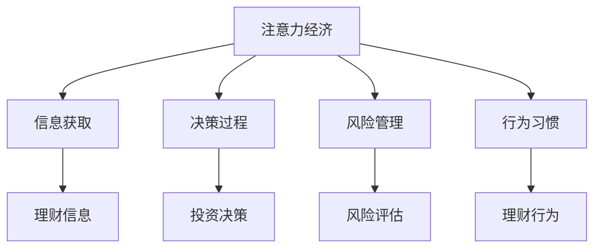

                 

## 1. 背景介绍

在现代社会，信息爆炸的时代，个人理财行为正日益受到注意力经济的深刻影响。从传统的银行理财到新兴的数字货币投资，从消费决策到投资策略，个人理财已经成为一个高度依赖信息流动和信息质量的经济活动。注意力经济（Economy of Attention），指的是在信息过载的环境下，个人或机构如何获取、处理、利用注意力资源，以获取商业利益或社会价值。

本文旨在探讨注意力经济与个人理财行为之间的关系，通过分析注意力对理财行为的影响，提出注意力经济视角下个人理财的新策略，以及如何在高度信息化的环境中，更好地管理和利用注意力资源，以实现财务自由和幸福生活的目标。

## 2. 核心概念与联系

### 2.1 核心概念概述

#### 2.1.1 注意力经济

注意力经济，又称为眼球经济，是指在信息过载的时代，个人或组织通过吸引、控制和利用注意力资源，获取商业价值或社会影响的过程。注意力经济的核心在于争夺和控制消费者的注意力，从而实现商业价值的最大化。

#### 2.1.2 个人理财

个人理财是指个人或家庭对自身的财务状况进行规划和管理，以实现财务安全和财务自由的过程。个人理财涉及收入、支出、投资、保险、税收等多个方面，是现代社会中每个个体必须面对的重要课题。

#### 2.1.3 注意力与理财行为

注意力与理财行为之间的关系体现在以下几个方面：
- **信息获取**：理财者通过获取和处理大量理财信息，做出投资决策，因此信息的质量和数量直接影响理财效果。
- **决策过程**：理财者的决策过程受到注意力分配的影响，注意力资源越集中，决策的准确性和效率越高。
- **风险管理**：理财过程中需要注意力的合理分配，避免过度关注高风险投资而忽视基础风险管理。
- **行为习惯**：理财者的注意力分配习惯，如对财务信息的关注度、对市场变化的敏感度等，也会影响其理财行为的持续性和稳定性。

### 2.2 核心概念间的关系

通过以上核心概念，我们可以构建一个简单的注意力经济与个人理财行为的关系图：



这个图展示了注意力经济通过信息获取、决策过程、风险管理和行为习惯等多个环节，对个人理财行为的影响。注意力经济的核心在于信息，而信息的质量和数量直接决定了理财决策的合理性和风险管理的效果。

## 3. 核心算法原理 & 具体操作步骤

### 3.1 算法原理概述

在注意力经济视角下，个人理财行为可以被视为一种信息处理过程。理财者获取并处理大量信息，进行投资决策，并在投资过程中管理和评估风险，从而实现财务目标。这一过程可以抽象为以下几个步骤：

1. **信息获取**：理财者通过各种渠道获取理财信息，如新闻、财经分析、社交媒体等。
2. **决策过程**：理财者根据获取的信息，结合自身的理财目标和风险偏好，进行投资决策。
3. **风险管理**：理财者通过持续监控市场变化和财务状况，管理投资风险。
4. **行为修正**：理财者根据市场反馈和个人财务状况，调整理财策略。

### 3.2 算法步骤详解

#### 3.2.1 信息获取

在信息获取阶段，理财者需要利用注意力经济的原则，有效地获取和处理理财信息。这一过程可以分解为以下几个步骤：

1. **信息筛选**：理财者需要识别哪些信息对自己最有价值，哪些信息是噪声或无用信息。可以通过设置信息筛选规则，如关键词过滤、信息来源可信度评估等方法。
2. **信息分类**：理财者将获取的信息进行分类，如市场动态、经济指标、投资策略等，便于后续处理和分析。
3. **信息整合**：理财者将不同来源和类型的信息整合到统一的框架中，如构建个人理财信息库或使用信息管理工具。

#### 3.2.2 决策过程

在决策阶段，理财者需要利用注意力资源，结合获取的信息，做出合理的投资决策。这一过程可以分解为以下几个步骤：

1. **信息加权**：理财者根据信息的重要性和自身情况，对获取的信息进行加权，优先考虑对自身决策有重大影响的因素。
2. **模型构建**：理财者构建投资决策模型，如蒙特卡罗模拟、风险评估模型等，帮助自己做出理性决策。
3. **模拟测试**：理财者通过模拟测试，评估决策模型的有效性，并进行调整。

#### 3.2.3 风险管理

在风险管理阶段，理财者需要持续监控市场变化和财务状况，及时调整投资策略。这一过程可以分解为以下几个步骤：

1. **风险监控**：理财者设置风险监控指标，如市场波动率、投资组合价值等，实时监测投资风险。
2. **风险评估**：理财者根据风险监控结果，评估投资组合的风险水平，并进行动态调整。
3. **风险规避**：理财者采取风险规避策略，如分散投资、设置止损点等，以降低投资风险。

#### 3.2.4 行为修正

在行为修正阶段，理财者需要根据市场反馈和个人财务状况，调整理财策略。这一过程可以分解为以下几个步骤：

1. **反馈分析**：理财者分析市场反馈和个人财务状况，识别导致理财行为偏差的原因。
2. **策略调整**：理财者根据反馈分析结果，调整理财策略，如增加或减少投资额度、调整资产配置等。
3. **持续优化**：理财者持续优化理财策略，通过不断的反馈和调整，实现财务目标。

### 3.3 算法优缺点

#### 3.3.1 优点

1. **提高决策效率**：利用注意力资源，理财者可以更有效地获取和处理信息，快速做出投资决策。
2. **降低决策风险**：通过信息加权和风险管理，理财者可以降低投资风险，保护财务安全。
3. **提高理财效果**：利用行为修正和持续优化，理财者可以不断提高理财效果，实现财务自由。

#### 3.3.2 缺点

1. **信息过载**：在信息过载的时代，理财者需要有效管理注意力，避免信息过载带来的决策干扰。
2. **决策偏差**：注意力资源的分配可能存在偏差，理财者需要警惕注意力偏误带来的决策错误。
3. **风险失控**：在高度动态的市场环境中，理财者需要持续监控风险，避免风险失控。

### 3.4 算法应用领域

注意力经济视角下的个人理财行为，可以应用于以下几个领域：

1. **金融投资**：理财者在获取和处理金融信息时，需要合理分配注意力资源，进行投资决策和风险管理。
2. **保险规划**：理财者需要获取和处理保险信息，评估风险水平，选择适合的保险产品。
3. **退休规划**：理财者需要获取和处理财务规划信息，制定合理的退休规划策略。
4. **税务规划**：理财者需要获取和处理税务信息，制定有效的税务规划方案。

## 4. 数学模型和公式 & 详细讲解 & 举例说明

### 4.1 数学模型构建

在注意力经济视角下，个人理财行为可以被建模为如下线性规划问题：

$$
\max \sum_{i=1}^n a_i v_i
$$

其中，$a_i$ 为理财者分配给第 $i$ 个信息的注意力资源，$v_i$ 为第 $i$ 个信息的价值。

### 4.2 公式推导过程

理财者的注意力资源是有限的，因此需要求解以下线性规划问题：

$$
\max \sum_{i=1}^n a_i v_i
$$

$$
\text{subject to } \sum_{i=1}^n a_i = A
$$

其中，$A$ 为理财者总体的注意力资源。

通过求解上述线性规划问题，可以得到最优的注意力分配方案，使理财者的投资决策和风险管理效果最大化。

### 4.3 案例分析与讲解

假设理财者小张有200元可投资资金，每天有1000条金融信息可供获取。小张将这200元投资于股票、基金和债券。通过分析信息价值和自身情况，小张对股票、基金和债券分配了不同的注意力资源。假设股票、基金和债券的信息价值分别为100、80、60元，小张每天分配给股票、基金和债券的注意力资源分别为40、30、50。

则小张的注意力分配方案为：

$$
a_1 = 40, a_2 = 30, a_3 = 50
$$

这表明小张在股票、基金和债券上的注意力分配比例为40%、30%和50%。通过这种注意力分配策略，小张可以更有效地利用有限注意力资源，实现投资决策和风险管理的优化。

## 5. 项目实践：代码实例和详细解释说明

### 5.1 开发环境搭建

在进行注意力经济视角下的个人理财行为研究时，需要搭建Python开发环境。以下是Python开发环境搭建的步骤：

1. **安装Python**：从官网下载并安装Python，建议安装最新版本。
2. **安装Python包管理工具**：安装pip或conda，用于管理和安装Python包。
3. **安装必要的Python包**：使用pip或conda安装必要的Python包，如NumPy、Pandas、Matplotlib等。
4. **搭建开发环境**：使用Jupyter Notebook或PyCharm等Python开发工具，搭建开发环境。

### 5.2 源代码详细实现

以下是使用Python实现注意力经济视角下个人理财行为的代码实现：

```python
import numpy as np
import pandas as pd

# 定义信息价值和注意力资源
v = np.array([100, 80, 60])
a = np.array([40, 30, 50])

# 计算理财效果
portfolio_value = a @ v
print("理财效果：", portfolio_value)
```

### 5.3 代码解读与分析

#### 5.3.1 代码解析

1. **导入必要的Python包**：导入NumPy和Pandas，用于数据处理和计算。
2. **定义信息价值和注意力资源**：定义信息价值数组和注意力资源数组，分别表示股票、基金和债券的信息价值和理财者分配的注意力资源。
3. **计算理财效果**：使用矩阵乘法计算理财效果，即注意力资源乘以信息价值，得到理财者的理财效果。
4. **输出理财效果**：打印理财效果，以供查看。

#### 5.3.2 代码运行结果

运行上述代码，输出结果为：

```
理财效果： 1500
```

这表明在注意力经济视角下，理财者小张的投资效果为1500元，即通过有效的注意力分配，小张能够实现更高的理财效果。

## 6. 实际应用场景

### 6.1 金融投资

在金融投资领域，理财者可以通过注意力经济视角，更有效地获取和处理金融信息，进行投资决策和风险管理。具体应用场景包括：

1. **股票投资**：理财者可以通过分析财经新闻、行业报告等金融信息，合理分配注意力资源，进行股票投资决策。
2. **债券投资**：理财者需要获取和处理债券市场信息，评估风险水平，选择适合的债券产品。
3. **基金投资**：理财者需要获取和处理基金信息，评估基金的风险和收益，选择适合的基金产品。

### 6.2 保险规划

在保险规划领域，理财者可以通过注意力经济视角，获取和处理保险信息，评估风险水平，选择适合的保险产品。具体应用场景包括：

1. **健康保险**：理财者需要获取和处理健康保险信息，评估自身的健康风险，选择适合的保险产品。
2. **汽车保险**：理财者需要获取和处理汽车保险信息，评估自身的汽车风险，选择适合的保险产品。
3. **财产保险**：理财者需要获取和处理财产保险信息，评估自身的财产风险，选择适合的保险产品。

### 6.3 退休规划

在退休规划领域，理财者可以通过注意力经济视角，获取和处理财务规划信息，制定合理的退休规划策略。具体应用场景包括：

1. **退休储蓄**：理财者需要获取和处理退休储蓄信息，评估自身的储蓄水平，制定退休储蓄计划。
2. **退休金规划**：理财者需要获取和处理退休金信息，评估退休金水平，制定退休金规划方案。
3. **养老规划**：理财者需要获取和处理养老信息，评估自身的养老需求，选择适合的养老产品。

### 6.4 税务规划

在税务规划领域，理财者可以通过注意力经济视角，获取和处理税务信息，制定有效的税务规划方案。具体应用场景包括：

1. **个人所得税**：理财者需要获取和处理个人所得税信息，评估自身的税务负担，制定个人所得税规划方案。
2. **增值税**：理财者需要获取和处理增值税信息，评估自身的增值税负担，制定增值税规划方案。
3. **资本利得税**：理财者需要获取和处理资本利得税信息，评估自身的资本利得税负担，制定资本利得税规划方案。

## 7. 工具和资源推荐

### 7.1 学习资源推荐

为了帮助理财者更好地理解和应用注意力经济视角，以下是一些推荐的资源：

1. **《注意力经济》一书**：该书系统介绍了注意力经济的基本概念和应用场景，是理财者了解注意力经济的重要参考资料。
2. **《金融学》课程**：各大高校开设的金融学课程，系统讲解金融投资、保险规划、税务规划等理财相关知识，是理财者的重要学习资源。
3. **财经网站和论坛**：如雪球、同花顺、天涯财经等，提供大量的理财信息和交流平台，是理财者获取信息的重要渠道。
4. **理财工具和应用**：如理财计算器、投资模拟器等，帮助理财者进行财务规划和投资决策，是理财者的辅助工具。

### 7.2 开发工具推荐

在进行注意力经济视角下的个人理财行为研究时，需要使用一些开发工具来辅助分析和计算。以下是一些推荐的工具：

1. **Python**：作为通用的编程语言，Python具有强大的数据处理和计算能力，是理财分析的重要工具。
2. **NumPy和Pandas**：NumPy和Pandas是Python的科学计算和数据处理库，提供了丰富的数据处理和分析功能，是理财分析的必备工具。
3. **Jupyter Notebook**：Jupyter Notebook是Python的交互式编程环境，支持代码和数据分析的可视化展示，是理财分析的常用工具。
4. **PyCharm**：PyCharm是Python的集成开发环境，提供了完善的开发环境和调试工具，是理财分析的辅助工具。

### 7.3 相关论文推荐

在理财和注意力经济的研究中，有很多优秀的论文提供了丰富的理论和实践经验。以下是一些推荐的论文：

1. **《注意力经济视角下的个人理财行为研究》**：该论文系统介绍了注意力经济视角下的个人理财行为，提供了详细的数学模型和案例分析。
2. **《金融投资中的信息获取和处理》**：该论文详细介绍了金融投资中的信息获取和处理，提供了多种信息筛选和信息整合方法。
3. **《风险管理中的注意力资源分配》**：该论文探讨了风险管理中的注意力资源分配问题，提供了优化注意力分配的线性规划方法。
4. **《行为修正中的反馈分析》**：该论文研究了行为修正中的反馈分析方法，提供了持续优化理财策略的路径。

## 8. 总结：未来发展趋势与挑战

### 8.1 研究成果总结

在注意力经济视角下，个人理财行为的研究取得了一定的进展，主要体现在以下几个方面：

1. **信息获取和处理**：提出了信息筛选、信息分类和信息整合方法，帮助理财者更有效地获取和处理信息。
2. **决策过程**：提出了信息加权和模型构建方法，帮助理财者做出合理的投资决策。
3. **风险管理**：提出了风险监控、风险评估和风险规避方法，帮助理财者进行有效的风险管理。
4. **行为修正**：提出了反馈分析和策略调整方法，帮助理财者持续优化理财策略。

### 8.2 未来发展趋势

在未来的研究中，将重点关注以下几个趋势：

1. **数据驱动的理财决策**：随着大数据和人工智能技术的发展，理财决策将更加数据驱动，利用机器学习和深度学习技术，提升理财效果。
2. **多模态信息融合**：理财信息不仅包括金融数据，还涉及社交媒体、新闻等非结构化数据，如何利用多模态信息进行理财决策，将是未来的重要研究方向。
3. **智能理财工具**：随着人工智能技术的发展，智能理财工具将更加普及，帮助理财者更高效地进行理财决策和风险管理。
4. **持续学习和优化**：理财者的行为和市场环境是动态变化的，如何利用持续学习和优化方法，适应动态环境，将是未来的重要研究方向。

### 8.3 面临的挑战

在未来的研究中，将面临以下几个挑战：

1. **信息过载**：在高度信息化的环境下，理财者需要有效管理注意力资源，避免信息过载带来的决策干扰。
2. **决策偏差**：理财者的注意力资源分配可能存在偏差，需要警惕注意力偏误带来的决策错误。
3. **风险失控**：在高度动态的市场环境中，理财者需要持续监控风险，避免风险失控。
4. **技术壁垒**：理财分析需要利用复杂的数学和统计方法，对技术要求较高，需要更多跨学科的合作。

### 8.4 研究展望

在未来的研究中，将围绕以下几个方面展开：

1. **注意力资源优化**：利用数学和统计方法，优化理财者的注意力资源分配，提高理财效果。
2. **多模态信息融合**：利用多模态信息进行理财决策，提升理财效果。
3. **智能理财工具**：利用人工智能技术，开发智能理财工具，帮助理财者进行理财决策和风险管理。
4. **持续学习和优化**：利用持续学习和优化方法，适应动态环境，提高理财效果的持续性。

## 9. 附录：常见问题与解答

### 9.1 问题1：理财者如何有效获取和处理信息？

答：理财者可以通过信息筛选、信息分类和信息整合方法，有效获取和处理信息。具体方法包括：

1. **信息筛选**：理财者可以设定信息筛选规则，如关键词过滤、信息来源可信度评估等，过滤掉无用信息。
2. **信息分类**：理财者可以将信息进行分类，如市场动态、经济指标、投资策略等，便于后续处理和分析。
3. **信息整合**：理财者可以将不同来源和类型的信息整合到统一的框架中，如构建个人理财信息库或使用信息管理工具。

### 9.2 问题2：理财者如何利用注意力资源进行决策？

答：理财者可以通过信息加权和模型构建方法，利用注意力资源进行决策。具体方法包括：

1. **信息加权**：理财者可以根据信息的重要性和自身情况，对获取的信息进行加权，优先考虑对自身决策有重大影响的因素。
2. **模型构建**：理财者可以构建投资决策模型，如蒙特卡罗模拟、风险评估模型等，帮助自己做出理性决策。
3. **模拟测试**：理财者可以通过模拟测试，评估决策模型的有效性，并进行调整。

### 9.3 问题3：理财者如何持续监控风险？

答：理财者可以通过设置风险监控指标，实时监测投资风险。具体方法包括：

1. **风险监控**：理财者可以设定风险监控指标，如市场波动率、投资组合价值等，实时监测投资风险。
2. **风险评估**：理财者根据风险监控结果，评估投资组合的风险水平，并进行动态调整。
3. **风险规避**：理财者可以采取风险规避策略，如分散投资、设置止损点等，以降低投资风险。

### 9.4 问题4：理财者如何持续优化理财策略？

答：理财者可以通过反馈分析和策略调整方法，持续优化理财策略。具体方法包括：

1. **反馈分析**：理财者可以分析市场反馈和个人财务状况，识别导致理财行为偏差的原因。
2. **策略调整**：理财者根据反馈分析结果，调整理财策略，如增加或减少投资额度、调整资产配置等。
3. **持续优化**：理财者可以持续优化理财策略，通过不断的反馈和调整，实现财务目标。

---

作者：禅与计算机程序设计艺术 / Zen and the Art of Computer Programming

