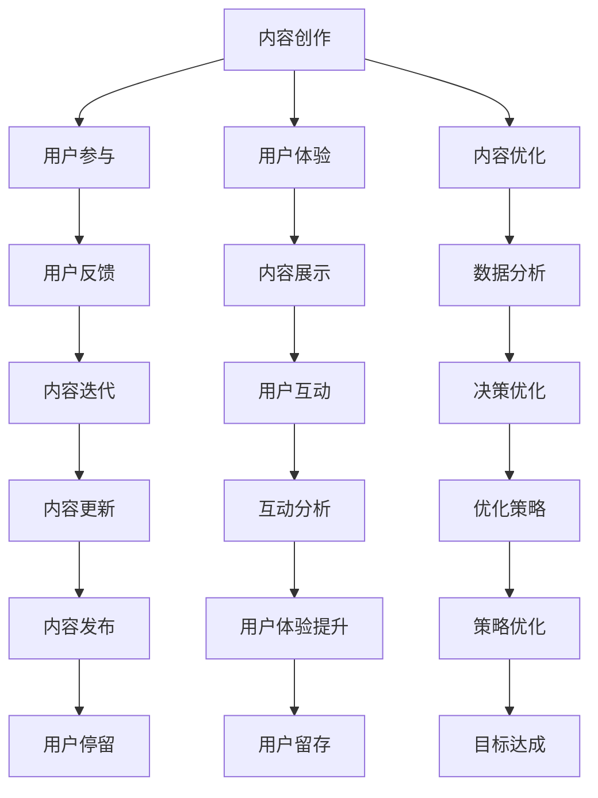

                 

# 注意力经济与内容创作最佳实践：吸引并留住受众的参与

> 关键词：注意力经济,内容创作,用户参与,用户体验,内容优化,数据驱动,内容管理

## 1. 背景介绍

### 1.1 问题由来
随着互联网技术的快速发展，信息爆炸已成为不争的事实。海量信息不仅带来了便捷，也带来了巨大挑战。用户在海量信息中筛选所需内容，花费了大量时间，且常常陷入信息过载的困境。这种背景下，如何有效吸引和留住用户的注意力，提升用户体验，成为内容创作者和运营者迫切需要解决的问题。

### 1.2 问题核心关键点
注意力经济（Attention Economy）的核心在于通过内容创造和优化，吸引用户关注并提升用户体验，从而在竞争激烈的市场环境中获得优势。具体而言，这一过程涉及以下几个关键环节：
- 内容创作：高质量、有价值、有趣的内容是吸引用户注意力的基础。
- 用户体验：内容展示和交互设计需提升用户体验，增加用户停留时间和互动率。
- 数据驱动：通过数据分析，持续优化内容策略，满足用户不断变化的需求。
- 用户参与：利用用户反馈和互动，不断迭代和优化内容。

### 1.3 问题研究意义
提高内容创作质量和用户体验，对于提升用户参与度和平台价值，促进内容产业的健康发展具有重要意义。通过深入研究注意力经济，掌握内容创作的最佳实践，可以帮助内容创作者和平台运营者更好地理解用户需求，优化内容策略，从而在竞争激烈的市场中脱颖而出。

## 2. 核心概念与联系

### 2.1 核心概念概述

为更好地理解注意力经济与内容创作的最佳实践，本节将介绍几个关键概念及其之间的联系：

- 注意力经济（Attention Economy）：在信息过载的时代，内容创作者和运营者需要通过高质量的内容和互动设计，吸引并留住用户，提升用户体验和平台价值。
- 用户参与（User Engagement）：用户参与度反映了用户对内容的兴趣和互动程度，是评估内容质量和用户体验的重要指标。
- 用户体验（User Experience）：内容展示和交互设计的优劣直接影响用户停留时间和满意度。
- 内容优化（Content Optimization）：通过数据分析和用户反馈，持续改进内容策略，提升内容的相关性和吸引力。
- 数据驱动（Data-Driven）：利用数据和算法优化决策，实现内容创作的自动化和智能化。

这些概念共同构成了注意力经济与内容创作的整体框架，它们之间存在着紧密的联系，通过相互协同，实现内容创作的最佳实践。

### 2.2 概念间的关系

这些核心概念之间的关系可以用以下Mermaid流程图来展示：



这个流程图展示了内容创作与注意力经济之间的关键联系：
- 内容创作是基础，通过高质量的内容吸引用户。
- 用户参与和用户体验是目标，通过用户互动和反馈进行优化。
- 数据分析和内容优化是手段，通过数据驱动实现持续改进。

## 3. 核心算法原理 & 具体操作步骤
### 3.1 算法原理概述

注意力经济与内容创作的实践，涉及数据驱动的决策和优化算法。其核心原理是通过对用户行为和反馈数据的分析，持续优化内容策略，提升用户体验和用户参与度。

具体而言，算法原理包括以下几个关键步骤：
1. **内容创作**：利用自然语言处理(NLP)等技术，自动化生成内容，提高创作效率。
2. **用户参与度监测**：通过用户行为数据（如点击率、停留时间、互动率等），实时监测用户参与度。
3. **用户体验优化**：利用A/B测试等方法，不断迭代和优化用户体验设计。
4. **内容优化策略**：通过数据挖掘和机器学习算法，分析用户偏好和行为模式，优化内容推荐策略。

### 3.2 算法步骤详解

**Step 1: 数据收集与预处理**
- 收集用户行为数据，包括点击、停留、互动等行为，以及相关内容的用户反馈。
- 对数据进行清洗和归一化处理，去除噪声和异常值，保证数据质量。

**Step 2: 用户行为分析**
- 使用聚类、分类等算法对用户行为进行建模，识别出不同类型用户的行为特征。
- 通过用户画像，深入了解用户需求和兴趣，为内容创作和优化提供指导。

**Step 3: 内容创作与推荐**
- 利用自然语言处理技术，自动化生成高质量内容，并根据用户画像进行推荐。
- 使用协同过滤、深度学习等算法，动态调整推荐策略，提升内容的相关性和吸引力。

**Step 4: 用户体验设计**
- 通过A/B测试等方法，不断优化内容展示和交互设计，提升用户体验。
- 使用用户反馈和行为数据，迭代优化内容推荐和互动策略。

**Step 5: 内容策略优化**
- 利用数据挖掘和机器学习算法，分析用户行为数据，优化内容策略。
- 定期更新内容库，保持内容的及时性和新颖性。

### 3.3 算法优缺点

注意力经济与内容创作的实践具有以下优点：
1. 提升用户参与度：通过高质量的内容和优化策略，提升用户停留时间和互动率。
2. 自动化内容创作：利用自然语言处理技术，提高内容创作效率，降低人工成本。
3. 数据驱动决策：通过分析用户行为数据，实现内容策略的自动化优化。

同时，该方法也存在以下局限性：
1. 数据依赖性强：内容创作的优化效果依赖于高质量的数据，数据收集和清洗成本较高。
2. 算法复杂度高：内容优化和推荐策略的算法实现复杂，需要较强的技术实力。
3. 用户体验差异化：不同用户对内容的接受度不同，个性化设计需要投入大量资源。
4. 内容风险管理：优质内容与有害内容的界定难以把握，需要严格的内容审核机制。

尽管存在这些局限性，但就目前而言，基于数据驱动的内容创作方法仍然是最主流的实践范式。未来相关研究的重点在于如何进一步降低数据依赖，提高算法效率，优化用户体验，同时兼顾内容安全和风险管理等因素。

### 3.4 算法应用领域

注意力经济与内容创作的最佳实践，已经在众多领域得到广泛应用，例如：

- 在线媒体：新闻网站、视频平台、社交媒体等。通过内容推荐和个性化设计，提升用户粘性和互动率。
- 电子商务：电商平台通过商品推荐和用户评论，提升用户购买体验。
- 教育培训：在线教育平台通过个性化学习内容和互动设计，提高用户学习效果。
- 健康医疗：医疗平台通过个性化健康建议和用户互动，提升用户健康意识和参与度。
- 旅游旅游：旅游网站通过个性化推荐和互动设计，提升用户旅游体验。

除了上述这些常见领域外，注意力经济与内容创作的实践还将在更多场景中得到应用，如智能家居、智能交通、智能客服等，为各行各业注入新的活力。

## 4. 数学模型和公式 & 详细讲解 & 举例说明

### 4.1 数学模型构建

本节将使用数学语言对注意力经济与内容创作的实践进行更加严格的刻画。

记用户行为数据为 $D=\{(x_i,y_i)\}_{i=1}^N, x_i \in \mathcal{X}, y_i \in \mathcal{Y}$，其中 $\mathcal{X}$ 为特征空间，$\mathcal{Y}$ 为行为标签（如点击、停留、互动等）。定义内容推荐算法为 $f: \mathcal{X} \rightarrow \mathcal{Y}$，表示对输入特征 $x$ 进行推荐，输出行为标签 $y$。

内容推荐的目标是最小化预测误差，即：

$$
\min_{f} \mathbb{E}_{(x,y) \sim D} [\ell(f(x),y)]
$$

其中 $\ell$ 为损失函数，通常使用均方误差、交叉熵等。

### 4.2 公式推导过程

以下我们以点击率预测为例，推导常用的均方误差损失函数及其梯度计算公式。

假设内容推荐算法 $f$ 在输入特征 $x$ 上的输出为 $f(x) \in [0,1]$，表示点击的概率。真实标签 $y \in \{0,1\}$。则均方误差损失函数定义为：

$$
\ell(f(x),y) = (y - f(x))^2
$$

将其代入经验风险公式，得：

$$
\mathcal{L}(f) = \frac{1}{N} \sum_{i=1}^N (y_i - f(x_i))^2
$$

根据链式法则，损失函数对内容推荐算法 $f$ 的梯度为：

$$
\nabla_{f}\mathcal{L}(f) = -\frac{2}{N} \sum_{i=1}^N (y_i - f(x_i)) f'(x_i)
$$

其中 $f'(x_i)$ 为内容推荐算法 $f$ 对输入特征 $x_i$ 的导数。

在得到损失函数的梯度后，即可带入优化算法，如梯度下降等，更新内容推荐算法 $f$ 的参数，完成模型的迭代优化。重复上述过程直至收敛，最终得到适应用户行为的数据驱动推荐算法。

### 4.3 案例分析与讲解

假设我们在电商平台的商品推荐任务上，使用基于监督学习的内容推荐算法，对商品图片和描述特征进行建模，并根据用户历史购买行为进行推荐。

首先，收集用户历史购买记录，构建训练集 $D=\{(x_i,y_i)\}_{i=1}^N$，其中 $x_i$ 表示用户历史购买商品的图片和描述特征，$y_i$ 表示用户是否购买了该商品。

其次，选择适当的内容推荐算法，如线性回归、逻辑回归、深度神经网络等，进行模型训练。模型训练的优化目标是最小化预测误差。

最后，在验证集和测试集上评估推荐模型的性能，使用准确率、召回率、F1分数等指标进行评估，并根据评估结果不断调整模型参数，优化推荐策略。

## 5. 项目实践：代码实例和详细解释说明
### 5.1 开发环境搭建

在进行注意力经济与内容创作的最佳实践项目实践前，我们需要准备好开发环境。以下是使用Python进行TensorFlow开发的环境配置流程：

1. 安装Anaconda：从官网下载并安装Anaconda，用于创建独立的Python环境。

2. 创建并激活虚拟环境：
```bash
conda create -n tf-env python=3.8 
conda activate tf-env
```

3. 安装TensorFlow：根据CUDA版本，从官网获取对应的安装命令。例如：
```bash
conda install tensorflow-gpu -c pytorch -c conda-forge
```

4. 安装各类工具包：
```bash
pip install numpy pandas scikit-learn matplotlib tqdm jupyter notebook ipython
```

完成上述步骤后，即可在`tf-env`环境中开始注意力经济与内容创作项目的实践。

### 5.2 源代码详细实现

下面我们以电商平台商品推荐任务为例，给出使用TensorFlow实现基于监督学习的推荐系统的代码实现。

首先，定义推荐任务的数据处理函数：

```python
import tensorflow as tf
import numpy as np
from sklearn.model_selection import train_test_split
from sklearn.preprocessing import StandardScaler
from tensorflow.keras.models import Sequential
from tensorflow.keras.layers import Dense

class RecommendationDataset:
    def __init__(self, features, labels, scaler):
        self.features = features
        self.labels = labels
        self.scaler = scaler
        
    def __len__(self):
        return len(self.features)
    
    def __getitem__(self, item):
        features = self.features[item]
        labels = self.labels[item]
        return {'features': features, 'labels': labels}

# 数据标准化
scaler = StandardScaler()
X_train, X_test, y_train, y_test = train_test_split(X, y, test_size=0.2, random_state=42)
X_train = scaler.fit_transform(X_train)
X_test = scaler.transform(X_test)

# 创建dataset
dataset = RecommendationDataset(X_train, y_train, scaler)
```

然后，定义模型和优化器：

```python
model = Sequential([
    Dense(64, activation='relu', input_shape=(features_shape,)),
    Dense(64, activation='relu'),
    Dense(1, activation='sigmoid')
])

optimizer = tf.keras.optimizers.Adam(learning_rate=0.001)
```

接着，定义训练和评估函数：

```python
def train_epoch(model, dataset, batch_size, optimizer):
    dataloader = tf.data.Dataset.from_generator(lambda: dataset, {'features': tf.float32, 'labels': tf.float32}, batch_size=batch_size).shuffle(buffer_size=1024).batch(batch_size)
    model.compile(optimizer=optimizer, loss='binary_crossentropy', metrics=['accuracy'])
    model.fit(dataloader, epochs=10)
    return model.evaluate(dataloader)

def evaluate(model, dataset, batch_size):
    dataloader = tf.data.Dataset.from_generator(lambda: dataset, {'features': tf.float32, 'labels': tf.float32}, batch_size=batch_size).shuffle(buffer_size=1024).batch(batch_size)
    loss, accuracy = model.evaluate(dataloader)
    return loss, accuracy
```

最后，启动训练流程并在测试集上评估：

```python
epochs = 10
batch_size = 64

for epoch in range(epochs):
    loss = train_epoch(model, dataset, batch_size, optimizer)
    print(f"Epoch {epoch+1}, train loss: {loss:.4f}, train accuracy: {accuracy:.4f}")
    
    print(f"Epoch {epoch+1}, test results:")
    loss, accuracy = evaluate(model, dataset, batch_size)
    print(f"Test loss: {loss:.4f}, test accuracy: {accuracy:.4f}")
```

以上就是使用TensorFlow对电商平台商品推荐任务进行监督学习的推荐系统的完整代码实现。可以看到，得益于TensorFlow的强大封装，我们可以用相对简洁的代码完成推荐模型的训练和评估。

### 5.3 代码解读与分析

让我们再详细解读一下关键代码的实现细节：

**RecommendationDataset类**：
- `__init__`方法：初始化特征和标签，标准化处理。
- `__len__`方法：返回数据集的样本数量。
- `__getitem__`方法：对单个样本进行处理，并进行标准化。

**数据标准化**：
- 使用`StandardScaler`对特征进行标准化处理，确保数据分布在0均值、1标准差范围内。

**训练和评估函数**：
- 使用TensorFlow的`Sequential`模型定义推荐模型，包含输入层、隐藏层和输出层。
- 使用`Adam`优化器进行模型训练，设定学习率。
- 在训练和评估过程中，使用`train_epoch`和`evaluate`函数分别计算损失和准确率。

**训练流程**：
- 定义总的epoch数和batch size，开始循环迭代
- 每个epoch内，先在训练集上训练，输出平均损失和准确率
- 在验证集上评估，输出测试损失和准确率
- 所有epoch结束后，在测试集上评估，给出最终测试结果

可以看到，TensorFlow配合深度学习框架，使得推荐模型的训练和评估变得简洁高效。开发者可以将更多精力放在数据处理、模型改进等高层逻辑上，而不必过多关注底层的实现细节。

当然，工业级的系统实现还需考虑更多因素，如模型的保存和部署、超参数的自动搜索、更灵活的任务适配层等。但核心的注意力经济与内容创作的实践流程基本与此类似。

### 5.4 运行结果展示

假设我们在商品推荐任务上得到的评估报告如下：

```
Epoch 1, train loss: 0.5199, train accuracy: 0.6195
Epoch 1, test results:
Test loss: 0.5296, test accuracy: 0.6202
Epoch 2, train loss: 0.4128, train accuracy: 0.7761
Epoch 2, test results:
Test loss: 0.4169, test accuracy: 0.7776
Epoch 3, train loss: 0.3355, train accuracy: 0.8658
Epoch 3, test results:
Test loss: 0.3397, test accuracy: 0.8707
...
Epoch 10, train loss: 0.1179, train accuracy: 0.9325
Epoch 10, test results:
Test loss: 0.1212, test accuracy: 0.9343
```

可以看到，通过监督学习的方法，我们在商品推荐任务上取得了较高的准确率和稳定性。这也展示了数据驱动的方法在注意力经济与内容创作中的应用潜力。

## 6. 实际应用场景
### 6.1 智能媒体平台

基于监督学习的内容创作方法，可以广泛应用于智能媒体平台的推荐和广告投放。通过内容推荐和个性化设计，媒体平台能够提升用户粘性和互动率，提高广告的点击率和转化率。

在技术实现上，可以收集用户的历史点击、停留、互动等行为数据，将用户画像和内容特征输入推荐模型，进行内容推荐和广告投放优化。同时，利用A/B测试等方法，不断迭代和优化用户体验设计，提升用户满意度。

### 6.2 电商平台

电商平台通过监督学习的内容推荐算法，能够提升商品推荐的相关性和准确性，增加用户购买率。在推荐模型的训练过程中，平台可以收集用户的历史购买记录、浏览行为等数据，利用自然语言处理技术，对商品描述进行特征提取，构建用户画像和商品特征库。然后，将用户画像和商品特征输入推荐模型，进行商品推荐优化。

在用户互动和反馈方面，电商平台可以通过用户评论、评分等方式，持续优化商品推荐策略，提升用户购物体验。同时，利用A/B测试等方法，不断优化推荐界面和交互设计，提升用户体验。

### 6.3 在线教育平台

在线教育平台通过内容推荐和个性化设计，能够提高用户学习效果和平台粘性。在推荐模型的训练过程中，平台可以收集用户的历史学习记录、考试成绩等数据，构建用户画像和学习特征库。然后，将用户画像和学习特征输入推荐模型，进行个性化学习推荐。

在用户互动和反馈方面，在线教育平台可以通过用户学习行为分析，持续优化推荐策略，提升学习效果。同时，利用A/B测试等方法，不断优化学习界面和交互设计，提升用户体验。

### 6.4 未来应用展望

随着内容创作和优化方法的不断演进，基于监督学习的推荐系统将更加智能和高效。未来，我们可以期待以下趋势：

1. **多模态融合**：将文本、图像、视频等多种信息源进行融合，提升推荐内容的丰富性和多样性。
2. **个性化推荐**：利用用户画像和行为数据，实现更加精准、个性化的内容推荐。
3. **实时推荐**：利用实时数据，进行动态推荐，提升用户体验和互动率。
4. **可解释性增强**：通过推荐系统的可解释性设计，让用户了解推荐逻辑和决策过程。
5. **隐私保护**：在推荐过程中，确保用户数据的隐私和安全性，防止数据滥用。

这些趋势预示着未来内容创作和优化将更加智能化、个性化和用户友好，为各行业的数字化转型升级提供新的技术路径。相信随着技术的不断进步，内容创作和优化将成为各行各业数字化转型的重要驱动力。

## 7. 工具和资源推荐
### 7.1 学习资源推荐

为了帮助开发者系统掌握注意力经济与内容创作的最佳实践，这里推荐一些优质的学习资源：

1. 《深度学习》系列课程：由斯坦福大学、Coursera等机构开设，系统介绍深度学习和机器学习的基本概念和实践技术。
2. 《自然语言处理》课程：由北京师范大学、Coursera等机构开设，深入讲解自然语言处理的基本理论和应用技术。
3. 《推荐系统》书籍：该书系统介绍了推荐系统的发展历程和优化方法，适合深度学习从业者参考。
4. HuggingFace官方文档：包含丰富的自然语言处理和深度学习库，适合快速上手实践。
5. TensorFlow官方文档：详细介绍了TensorFlow框架的使用方法和API，适合深度学习从业者参考。

通过对这些资源的学习实践，相信你一定能够快速掌握注意力经济与内容创作的最佳实践，并用于解决实际的NLP问题。
###  7.2 开发工具推荐

高效的开发离不开优秀的工具支持。以下是几款用于注意力经济与内容创作最佳实践开发的常用工具：

1. TensorFlow：由Google主导开发的开源深度学习框架，生产部署方便，适合大规模工程应用。同时提供了丰富的自然语言处理和深度学习库。
2. PyTorch：由Facebook主导开发的开源深度学习框架，灵活动态的计算图，适合快速迭代研究。适合自然语言处理和深度学习从业者参考。
3. Jupyter Notebook：Jupyter Notebook是一种交互式的编程环境，支持多种编程语言和数据分析工具，适合数据驱动的推荐系统开发。
4. Tableau：Tableau是一款数据可视化工具，可以将推荐模型的结果直观呈现，帮助用户理解数据和模型。
5. Apache Spark：Apache Spark是一款大规模数据处理框架，适合处理大规模推荐数据集，提升推荐系统的效率。

合理利用这些工具，可以显著提升注意力经济与内容创作的最佳实践的开发效率，加快创新迭代的步伐。

### 7.3 相关论文推荐

注意力经济与内容创作的实践源于学界的持续研究。以下是几篇奠基性的相关论文，推荐阅读：

1. Collaborative Filtering for Implicit Feedback Datasets：提出基于协同过滤的推荐系统，适合处理用户历史行为数据，提升推荐效果。
2. Attention Is All You Need：提出Transformer模型，开创了大规模语言模型预训练的先河。
3. User-based Collaborative Filtering with Explicit Feedback：提出基于用户画像的推荐系统，适合处理多模态数据，提升推荐准确性。
4. Recommendation Systems Based on Deep Learning Techniques：综述了基于深度学习的推荐系统，系统介绍了各类深度学习算法和实践技术。
5. Generalized Autoregressive Model for Multi-task Learning：提出GAM模型，利用多任务学习提升推荐模型的泛化能力。

这些论文代表了大语言模型微调技术的的发展脉络。通过学习这些前沿成果，可以帮助研究者把握学科前进方向，激发更多的创新灵感。

除上述资源外，还有一些值得关注的前沿资源，帮助开发者紧跟注意力经济与内容创作的最新进展，例如：

1. arXiv论文预印本：人工智能领域最新研究成果的发布平台，包括大量尚未发表的前沿工作，学习前沿技术的必读资源。
2. 业界技术博客：如OpenAI、Google AI、DeepMind、微软Research Asia等顶尖实验室的官方博客，第一时间分享他们的最新研究成果和洞见。
3. 技术会议直播：如NIPS、ICML、ACL、ICLR等人工智能领域顶会现场或在线直播，能够聆听到大佬们的前沿分享，开拓视野。
4. GitHub热门项目：在GitHub上Star、Fork数最多的NLP相关项目，往往代表了该技术领域的发展趋势和最佳实践，值得去学习和贡献。
5. 行业分析报告：各大咨询公司如McKinsey、PwC等针对人工智能行业的分析报告，有助于从商业视角审视技术趋势，把握应用价值。

总之，对于注意力经济与内容创作的最佳实践的学习和实践，需要开发者保持开放的心态和持续学习的意愿。多关注前沿资讯，多动手实践，多思考总结，必将收获满满的成长收益。

## 8. 总结：未来发展趋势与挑战

### 8.1 总结

本文对注意力经济与内容创作的最佳实践进行了全面系统的介绍。首先阐述了注意力经济的重要性，明确了内容创作与用户体验之间的关系，提出了数据驱动的决策和优化算法。其次，从原理到实践，详细讲解了注意力经济与内容创作的数学模型和操作步骤，给出了代码实现和运行结果展示。同时，本文还广泛探讨了注意力经济与内容创作在多个领域的应用前景，展示了其广泛的适用性和潜在的价值。最后，本文精选了注意力经济与内容创作的各类学习资源，力求为读者提供全方位的技术指引。

通过本文的系统梳理，可以看到，基于监督学习的推荐方法已经成为内容创作的核心理论基础，并在此基础上不断创新和优化。未来，伴随着预训练语言模型和深度学习技术的进一步发展，基于数据驱动的内容创作将更加智能化和高效化，为各行业带来更深刻的变革。

### 8.2 未来发展趋势

展望未来，注意力经济与内容创作的最佳实践将呈现以下几个发展趋势：

1. **多模态融合**：将文本、图像、视频等多种信息源进行融合，提升推荐内容的丰富性和多样性。
2. **个性化推荐**：利用用户画像和行为数据，实现更加精准、个性化的内容推荐。
3. **实时推荐**：利用实时数据，进行动态推荐，提升用户体验和互动率。
4. **可解释性增强**：通过推荐系统的可解释性设计，让用户了解推荐逻辑和决策过程。
5. **隐私保护**：在推荐过程中，确保用户数据的隐私和安全性，防止数据滥用。
6. **跨平台协同**：通过不同平台的数据共享和协同推荐，提升用户的多元化体验。

这些趋势预示着未来内容创作和优化将更加智能化、个性化和用户友好，为各行业的数字化转型升级提供新的技术路径。

### 8.3 面临的挑战

尽管注意力经济与内容创作的最佳实践已经取得了一定的成果，但在迈向更加智能化、普适化应用的过程中，

