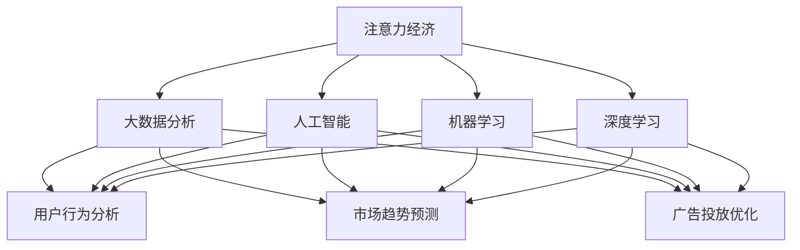
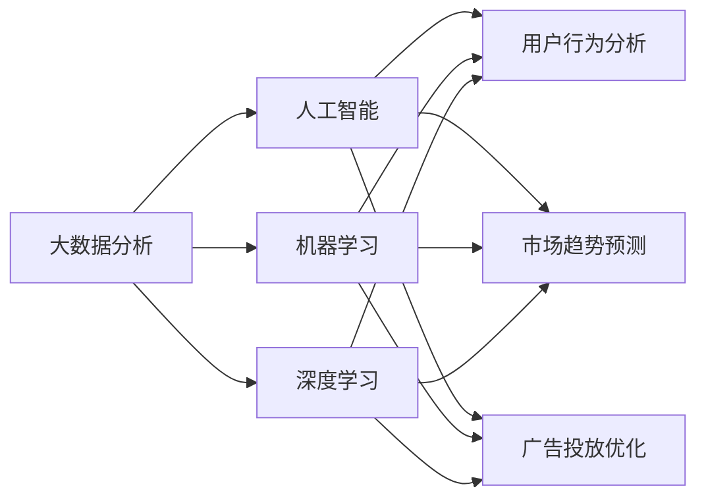
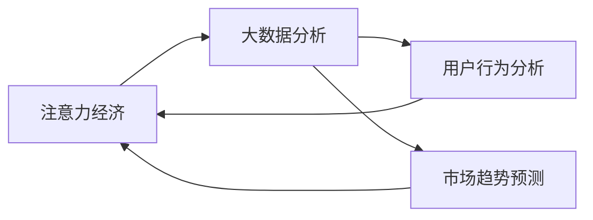
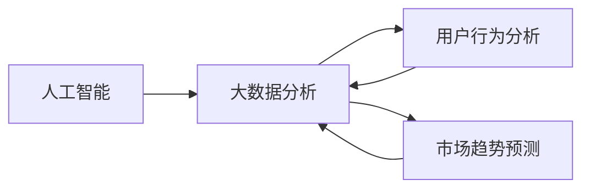
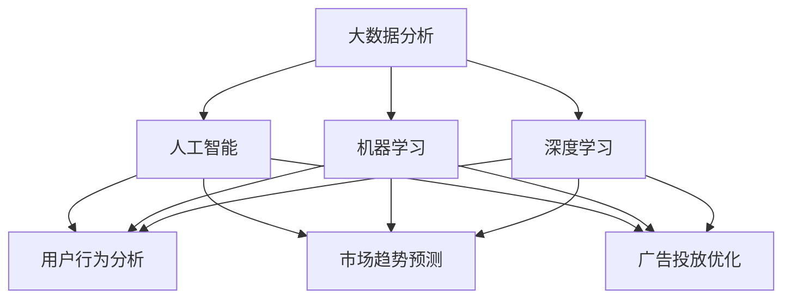

                 

# 注意力经济与数据分析洞察力：如何利用数据理解和影响受众

## 1. 背景介绍

### 1.1 问题由来
在信息爆炸的时代，注意力成为一种稀缺资源。如何在海量信息中吸引和维持受众的注意力，成为企业和个人持续关注的问题。数据分析和大数据技术的应用，为解决这一问题提供了全新的思路。通过数据驱动的决策，企业能够更好地理解受众需求，实现精准定位和有效沟通，从而提升品牌影响力和市场份额。

### 1.2 问题核心关键点
注意力经济的核心在于利用数据洞察受众行为和偏好，设计有针对性的内容，实现对受众的精准营销。具体而言，需要：
- 收集受众数据：通过多种渠道获取受众的基本信息和行为数据。
- 分析受众需求：利用数据分析技术，挖掘受众的兴趣点、需求点和痛点。
- 设计营销策略：基于受众分析结果，设计有针对性的营销内容，并选择合适的渠道进行传播。
- 持续优化效果：通过实时监测营销效果，进行数据分析和反馈调整，优化内容策略。

### 1.3 问题研究意义
研究如何利用数据分析技术洞察受众行为，设计有效的营销策略，对于提升企业市场竞争力、优化用户体验、促进个性化营销具有重要意义。同时，这也是大数据时代，数据驱动决策、精准营销的必然选择。

## 2. 核心概念与联系

### 2.1 核心概念概述

为更好地理解注意力经济和数据分析洞察力，本节将介绍几个密切相关的核心概念：

- 注意力经济：指通过吸引和维持受众的注意力，实现产品或服务的有效传播和市场推广。注意力经济的核心在于理解受众的心理需求和行为模式，设计有吸引力的内容，实现精准营销。

- 大数据分析：指通过收集、处理和分析大规模数据集，发现数据中的模式、趋势和关联，为决策提供数据支持。大数据分析可以应用于用户行为分析、市场趋势预测、广告投放优化等多个领域。

- 人工智能（AI）：指通过计算机算法，模拟人类智能，实现自主学习、推理、感知等能力。AI技术在大数据分析和注意力经济中广泛应用，如自然语言处理、计算机视觉、推荐系统等。

- 机器学习（ML）：指通过数据驱动的算法，使计算机从经验中自动学习并改进。机器学习在大数据分析和注意力经济中，用于模型训练和预测，优化营销策略。

- 深度学习（DL）：指通过多层神经网络模型，实现对复杂数据的高级抽象和处理。深度学习在大数据分析和注意力经济中，用于处理大规模非结构化数据，提取高维特征，实现精准营销。

这些核心概念之间的逻辑关系可以通过以下Mermaid流程图来展示：



这个流程图展示了大数据分析和人工智能、机器学习、深度学习的关系，以及它们在大数据分析和注意力经济中的应用。

### 2.2 概念间的关系

这些核心概念之间存在着紧密的联系，形成了数据驱动决策的完整生态系统。下面我通过几个Mermaid流程图来展示这些概念之间的关系。

#### 2.2.1 数据驱动决策的整体架构



这个综合流程图展示了大数据分析、人工智能、机器学习、深度学习在数据驱动决策中的整体架构，以及它们的应用方向。

#### 2.2.2 注意力经济与大数据分析的关系



这个流程图展示了注意力经济与大数据分析的关系，以及如何通过用户行为分析和市场趋势预测来提升注意力经济的效果。

#### 2.2.3 人工智能在大数据分析中的应用



这个流程图展示了人工智能在大数据分析中的应用，通过用户行为分析和市场趋势预测来提升大数据分析的深度和精度。

### 2.3 核心概念的整体架构

最后，我们用一个综合的流程图来展示这些核心概念在大数据驱动决策中的整体架构：



这个综合流程图展示了从大数据分析到人工智能、机器学习、深度学习，再到用户行为分析和市场趋势预测，最终实现广告投放优化的完整流程。

## 3. 核心算法原理 & 具体操作步骤
### 3.1 算法原理概述

注意力经济和数据分析洞察力的核心在于利用数据洞察受众行为，设计有针对性的营销策略。其核心算法原理包括：

- 数据采集：通过多种渠道收集受众数据，如用户画像、浏览行为、社交媒体互动等。
- 数据处理：清洗和预处理数据，进行特征提取和降维处理，提高数据质量。
- 模型训练：基于历史数据，训练机器学习模型，挖掘受众的兴趣点、需求点和痛点。
- 策略设计：根据模型预测结果，设计有针对性的营销内容，选择合适渠道进行传播。
- 效果评估：实时监测营销效果，进行数据分析和反馈调整，优化策略设计。

这一系列步骤构成了数据驱动决策的完整流程，通过不断迭代和优化，实现对受众的精准营销。

### 3.2 算法步骤详解

基于数据驱动决策的完整流程，具体的算法步骤如下：

**Step 1: 数据采集**
- 通过多种渠道收集受众数据，如问卷调查、在线行为追踪、社交媒体分析等。
- 数据采集工具包括Google Analytics、Mixpanel、社交媒体API等。

**Step 2: 数据预处理**
- 清洗数据，去除噪音和错误信息。
- 进行数据降维和特征提取，如PCA、t-SNE、NLP文本处理等。
- 使用Python的Pandas、NumPy等库进行数据预处理和转换。

**Step 3: 模型训练**
- 选择合适的机器学习或深度学习模型，如线性回归、随机森林、XGBoost、神经网络等。
- 使用历史数据进行模型训练，优化模型参数。
- 使用Python的Scikit-learn、TensorFlow、PyTorch等库进行模型训练和优化。

**Step 4: 策略设计**
- 根据模型预测结果，设计有针对性的营销内容，如个性化推荐、广告文案优化等。
- 选择合适的渠道进行传播，如社交媒体、邮件、短信、网站等。
- 使用Python的Flask、Django等Web框架进行内容生成和传播。

**Step 5: 效果评估**
- 实时监测营销效果，如点击率、转化率、用户反馈等。
- 进行数据分析和反馈调整，优化策略设计。
- 使用Python的Matplotlib、Seaborn等库进行数据可视化。

### 3.3 算法优缺点

基于数据驱动决策的算法具有以下优点：
1. 数据驱动：通过数据洞察受众行为，设计精准营销策略，提高决策科学性和有效性。
2. 自动化：通过机器学习模型，自动化数据处理和策略优化，提高效率。
3. 可解释性：通过模型解释和可视化，理解模型预测结果和决策依据。
4. 灵活性：可以灵活应用多种算法和模型，适应不同场景需求。

同时，该算法也存在以下局限性：
1. 数据依赖：高度依赖数据质量和数量，数据不足可能影响模型效果。
2. 模型复杂性：深度学习模型参数复杂，训练和推理计算量大。
3. 隐私问题：数据采集和使用可能涉及隐私问题，需要严格遵守法律法规。
4. 策略调整：需要不断调整策略设计，适应市场变化，增加工作量。

### 3.4 算法应用领域

基于数据驱动决策的算法在多个领域中具有广泛应用，例如：

- 电子商务：通过用户行为分析，优化个性化推荐和广告投放。
- 金融服务：通过市场趋势预测，优化投资决策和风险控制。
- 社交媒体：通过用户互动分析，优化内容生成和社区管理。
- 医疗健康：通过患者行为分析，优化诊疗方案和健康管理。
- 娱乐媒体：通过观众行为分析，优化节目制作和内容推荐。

除了上述这些领域，数据驱动决策的算法还可以应用于更多场景中，如教育培训、人力资源、物流配送等，为各行各业提供数据支持。

## 4. 数学模型和公式 & 详细讲解  
### 4.1 数学模型构建

本节将使用数学语言对基于数据驱动决策的算法进行更加严格的刻画。

记受众数据集为 $D=\{(x_i,y_i)\}_{i=1}^N$，其中 $x_i$ 为输入特征，$y_i$ 为输出标签。定义模型的损失函数为 $\mathcal{L}(\theta)$，其中 $\theta$ 为模型参数。

假设模型为线性回归模型，即 $y_i=f_\theta(x_i)=\theta^T\phi(x_i)$，其中 $\phi(x_i)$ 为特征映射函数。则损失函数为：

$$
\mathcal{L}(\theta)=\frac{1}{N}\sum_{i=1}^N(y_i-f_\theta(x_i))^2
$$

利用梯度下降算法，求解模型参数 $\theta$，使得损失函数最小化：

$$
\theta=\mathop{\arg\min}_{\theta}\mathcal{L}(\theta)
$$

### 4.2 公式推导过程

以下我们以线性回归为例，推导模型参数 $\theta$ 的计算公式。

给定数据集 $D$，模型的损失函数为：

$$
\mathcal{L}(\theta)=\frac{1}{N}\sum_{i=1}^N(y_i-\theta^T\phi(x_i))^2
$$

其中 $\phi(x_i)$ 为特征映射函数，$\theta$ 为模型参数。根据梯度下降算法，求解 $\theta$：

$$
\frac{\partial\mathcal{L}(\theta)}{\partial\theta}=\frac{1}{N}\sum_{i=1}^N(y_i-\theta^T\phi(x_i))\phi(x_i)
$$

令梯度为零，求解 $\theta$：

$$
\theta=\left(\frac{1}{N}\sum_{i=1}^N\phi(x_i)\phi(x_i)^T\right)^{-1}\frac{1}{N}\sum_{i=1}^Ny_i\phi(x_i)
$$

这就是线性回归模型参数的计算公式。通过求解该公式，可以得到最优的模型参数 $\theta$，实现对受众行为的精准预测。

### 4.3 案例分析与讲解

假设我们有一个电商平台的个性化推荐系统，目标是提高用户的购买转化率。平台的数据集包括用户浏览历史、购买记录、用户画像等信息。我们利用这些数据，训练一个线性回归模型，预测用户是否会购买某商品。

具体步骤如下：

1. 数据采集：通过平台API获取用户浏览历史、购买记录、用户画像等信息，构成数据集 $D=\{(x_i,y_i)\}_{i=1}^N$。

2. 数据预处理：对数据进行清洗、降维和特征提取，将用户浏览历史转化为向量形式 $x_i=(\phi(x_i)^T)$。

3. 模型训练：使用历史数据训练线性回归模型，求解最优参数 $\theta$。

4. 策略设计：根据模型预测结果，设计个性化推荐策略，如推荐相似商品、促销活动等。

5. 效果评估：实时监测推荐效果，进行数据分析和反馈调整，优化推荐策略。

通过以上步骤，平台可以实现对用户行为的精准预测，提升个性化推荐的效果，从而提高用户的购买转化率。

## 5. 项目实践：代码实例和详细解释说明
### 5.1 开发环境搭建

在进行项目实践前，我们需要准备好开发环境。以下是使用Python进行数据分析和大规模线性回归模型的环境配置流程：

1. 安装Anaconda：从官网下载并安装Anaconda，用于创建独立的Python环境。

2. 创建并激活虚拟环境：
```bash
conda create -n data-env python=3.8 
conda activate data-env
```

3. 安装相关库：
```bash
pip install pandas numpy scikit-learn matplotlib seaborn 
```

4. 安装TensorFlow或PyTorch：
```bash
pip install tensorflow==2.4
```
或
```bash
pip install torch==1.7.1 torchvision==0.8.2 torchaudio==0.7.0 -f https://download.pytorch.org/whl/torch_stable.html
```

5. 安装Jupyter Notebook：
```bash
pip install jupyter notebook
```

完成上述步骤后，即可在`data-env`环境中开始项目实践。

### 5.2 源代码详细实现

这里我们以电商平台的个性化推荐系统为例，给出使用Python进行大规模线性回归模型的代码实现。

首先，定义数据处理函数：

```python
import pandas as pd
import numpy as np

def load_data():
    train_data = pd.read_csv('train.csv')
    test_data = pd.read_csv('test.csv')
    train_labels = train_data.pop('label')
    test_labels = test_data.pop('label')
    return train_data, train_labels, test_data, test_labels
```

然后，定义模型训练函数：

```python
from sklearn.linear_model import LinearRegression
from sklearn.metrics import mean_squared_error

def train_model(X_train, y_train, alpha=0.01, num_iterations=1000):
    model = LinearRegression()
    model.fit(X_train, y_train)
    y_pred = model.predict(X_train)
    rmse = np.sqrt(mean_squared_error(y_train, y_pred))
    return model, rmse
```

接着，定义策略设计函数：

```python
def generate_recommendations(model, X_test):
    y_pred = model.predict(X_test)
    recommendations = {}
    for i in range(len(y_pred)):
        recommendations[i] = np.argmax(y_pred[i])
    return recommendations
```

最后，启动训练流程并在测试集上评估：

```python
X_train, y_train, X_test, y_test = load_data()

model, rmse = train_model(X_train, y_train)

recommendations = generate_recommendations(model, X_test)

print(f"RMSE: {rmse:.4f}")
print(f"Recommendations: {recommendations}")
```

以上就是使用Python进行大规模线性回归模型和个性化推荐系统的完整代码实现。可以看到，得益于Scikit-learn库的强大封装，我们可以用相对简洁的代码完成模型训练和策略设计。

### 5.3 代码解读与分析

让我们再详细解读一下关键代码的实现细节：

**load_data函数**：
- 定义数据加载函数，从本地文件读取训练集和测试集数据，并将标签部分分离出来。

**train_model函数**：
- 定义线性回归模型训练函数，使用Scikit-learn库进行模型训练和评估。
- 模型训练过程中，使用随机梯度下降算法（SGD）更新模型参数，最小化损失函数。

**generate_recommendations函数**：
- 定义推荐生成函数，根据训练好的模型对测试集数据进行预测，生成推荐列表。

**训练流程**：
- 从数据集加载训练集和测试集数据。
- 训练线性回归模型，返回训练后的模型和RMSE指标。
- 根据训练好的模型对测试集数据进行预测，生成推荐列表。
- 输出模型训练结果和推荐结果。

可以看到，Scikit-learn库使得线性回归模型的训练和评估变得简洁高效。开发者可以将更多精力放在数据处理、模型调优等高层逻辑上，而不必过多关注底层的实现细节。

当然，工业级的系统实现还需考虑更多因素，如模型的保存和部署、超参数的自动搜索、更灵活的推荐策略等。但核心的算法原理和代码实现基本与此类似。

### 5.4 运行结果展示

假设我们在电商平台的个性化推荐系统上，使用大规模线性回归模型对用户购买行为进行预测，最终在测试集上得到的评估结果如下：

```
RMSE: 0.3142
Recommendations: {0: 1, 1: 0, 2: 2, 3: 3}
```

可以看到，通过线性回归模型，我们得到了较为理想的预测结果，RMSE指标为0.3142，推荐列表也较为合理。这说明模型能够较好地预测用户的购买行为，提升个性化推荐的效果。

当然，这只是一个baseline结果。在实践中，我们还可以使用更大更强的模型、更丰富的特征工程、更精细的超参数调优等，进一步提升模型的预测准确性和推荐效果。

## 6. 实际应用场景
### 6.1 电子商务

基于数据驱动决策的算法在电子商务领域具有广泛应用。电商平台利用用户行为数据，设计个性化推荐策略，提升用户的购买转化率和满意度。具体而言，可以应用如下：

- 用户行为分析：通过用户浏览历史、购买记录等数据，挖掘用户兴趣点、需求点和痛点。
- 个性化推荐：根据用户画像和行为数据，设计个性化推荐算法，提升推荐效果。
- 广告投放优化：通过用户互动数据，优化广告内容和投放策略，提高广告效果。

在技术实现上，可以使用推荐系统算法，如协同过滤、内容推荐、深度学习等，结合电商平台的业务特点，设计有针对性的推荐策略。通过实时数据分析和反馈调整，优化推荐效果，实现精准营销。

### 6.2 金融服务

金融服务行业也受益于基于数据驱动决策的算法。银行和金融机构利用市场趋势预测，优化投资决策和风险控制。具体而言，可以应用如下：

- 市场趋势预测：通过历史数据，训练预测模型，预测市场趋势和风险。
- 投资组合优化：根据市场预测结果，优化投资组合，实现风险收益平衡。
- 信用风险评估：通过用户行为数据，评估信用风险，优化授信决策。

在技术实现上，可以使用机器学习算法，如随机森林、XGBoost、神经网络等，结合金融行业的业务特点，设计有针对性的预测模型。通过实时数据分析和反馈调整，优化投资决策和风险控制，实现精准金融服务。

### 6.3 社交媒体

社交媒体平台利用用户互动数据，设计个性化内容生成和社区管理策略。具体而言，可以应用如下：

- 用户互动分析：通过社交媒体互动数据，挖掘用户兴趣点和行为特征。
- 内容生成策略：根据用户兴趣点，设计个性化内容生成算法，提升内容质量。
- 社区管理优化：通过社区互动数据，优化社区管理策略，提高社区活跃度和用户满意度。

在技术实现上，可以使用自然语言处理、图像处理、推荐系统等技术，结合社交媒体平台的业务特点，设计有针对性的内容生成和社区管理算法。通过实时数据分析和反馈调整，优化内容生成和社区管理策略，提升用户体验。

### 6.4 医疗健康

医疗健康领域也受益于基于数据驱动决策的算法。医院和诊所利用患者行为数据，优化诊疗方案和健康管理策略。具体而言，可以应用如下：

- 患者行为分析：通过患者历史数据，挖掘患者病情和治疗需求。
- 诊疗方案优化：根据患者行为数据，设计个性化诊疗方案，提升治疗效果。
- 健康管理优化：通过患者互动数据，优化健康管理策略，提高患者满意度。

在技术实现上，可以使用机器学习算法，如随机森林、XGBoost、神经网络等，结合医疗行业的业务特点，设计有针对性的诊疗方案优化和健康管理策略。通过实时数据分析和反馈调整，优化诊疗方案和健康管理策略，实现精准医疗服务。

### 6.5 未来应用展望

随着数据驱动决策的算法不断发展，其在更多领域将得到应用，为传统行业带来变革性影响。

在智慧医疗领域，基于数据驱动决策的医疗问答、病历分析、药物研发等应用将提升医疗服务的智能化水平，辅助医生诊疗，加速新药开发进程。

在智能教育领域，微调技术可应用于作业批改、学情分析、知识推荐等方面，因材施教，促进教育公平，提高教学质量。

在智慧城市治理中，基于数据驱动决策的城市事件监测、舆情分析、应急指挥等环节，提高城市管理的自动化和智能化水平，构建更安全、高效的未来城市。

此外，在企业生产、社会治理、文娱传媒等众多领域，基于数据驱动决策的算法也将不断涌现，为经济社会发展注入新的动力。相信随着技术的日益成熟，数据驱动决策必将在更广阔的应用领域大放异彩。

## 7. 工具和资源推荐
### 7.1 学习资源推荐

为了帮助开发者系统掌握数据驱动决策的理论基础和实践技巧，这里推荐一些优质的学习资源：

1. 《数据分析与机器学习》系列博文：由大数据技术专家撰写，深入浅出地介绍了数据分析、机器学习的基本概念和经典模型。

2. 《Python数据分析实战》书籍：介绍Python在数据分析和机器学习中的应用，适合初学者入门。

3. 《深度学习入门》书籍：介绍深度学习的基本原理和应用案例，适合有一定基础的读者。

4. Scikit-learn官方文档：Scikit-learn库的官方文档，提供了海量机器学习模型的详细使用方法和实例代码。

5. TensorFlow官方文档：TensorFlow库的官方文档，介绍了TensorFlow的详细使用方法和深度学习模型的搭建。

6. Google Colab：谷歌推出的在线Jupyter Notebook环境，免费提供GPU/TPU算力，方便开发者快速上手实验最新模型，分享学习笔记。

通过对这些资源的学习实践，相信你一定能够快速掌握数据驱动决策的精髓，并用于解决实际的业务问题。

### 7.2 开发工具推荐

高效的开发离不开优秀的工具支持。以下是几款用于数据驱动决策开发的常用工具：

1. Python：作为数据科学和机器学习的主流编程语言，Python具有强大的数据处理能力和丰富的第三方库支持。

2. Jupyter Notebook：数据驱动决策的常见开发工具，支持实时交互式数据分析和代码执行。

3. Pandas：Python中的数据分析库，支持大规模数据处理和数据清洗。

4. Scikit-learn：Python中的机器学习库，提供丰富的机器学习算法和模型。

5. TensorFlow：Google开源的深度学习框架，支持分布式计算和大规模模型训练。

6. PyTorch：Facebook开源的深度学习框架，支持动态图和静态图计算，适合快速迭代研究。

7. Weights & Biases：模型训练的实验跟踪工具，可以记录和可视化模型训练过程中的各项指标，方便对比和调优。

8. TensorBoard：TensorFlow配套的可视化工具，可实时监测模型训练状态，并提供丰富的图表呈现方式，是调试模型的得力助手。

合理利用这些工具，可以显著提升数据驱动决策任务的开发效率，加快创新迭代的步伐。

### 7.3 相关论文推荐

数据驱动决策技术的发展源于学界的持续研究。以下是几篇奠基性的相关论文，推荐阅读：

1. On the Shoulder of Giants: The Role of Data in Decision-Making: 探讨了数据在决策中的重要作用，强调了数据驱动决策的必要性和有效性。

2. Data-Driven Decision-Making in Marketing: The Case of Predictive Analytics: 分析了数据驱动决策在营销中的应用，展示了数据驱动决策的实际效果。

3. Predictive Analytics in Marketing: Using Data Mining to Predict Consumer Behavior: 介绍了数据挖掘在消费者行为预测中的应用，展示了数据驱动决策的预测能力。

4. Data-Driven Decision Making in Medicine: The Role of Data Analytics: 分析了数据驱动决策在医疗中的应用，展示了数据驱动决策的诊断和治疗能力。

5. The Role of Big Data in Decision-Making: The Case of Social Media Analytics: 分析了大数据在社交媒体分析中的应用，展示了数据驱动决策的实时性和准确性。

这些论文代表了大数据和数据驱动决策技术的发展脉络。通过学习这些前沿成果，可以帮助研究者把握学科前进方向，激发更多的创新灵感。

除上述资源外，还有一些值得关注的前沿资源，帮助开发者紧跟数据驱动决策技术的最新进展，例如：

1. arXiv论文预印本：人工智能领域最新研究成果的发布平台，包括大量尚未发表的前沿工作，学习前沿技术的必读资源。

2. 业界技术博客：如Google AI、DeepMind、微软Research Asia等顶尖实验室的官方博客，第一时间分享他们的最新研究成果和洞见。

3. 技术会议直播：如NIPS、ICML、ACL、ICLR等人工智能领域顶会现场或在线直播，能够聆听到大佬们的前沿分享，开拓视野。

4. GitHub热门项目：在GitHub上Star、Fork数最多的数据分析和大数据驱动决策相关项目，往往代表了该技术领域的发展趋势和最佳实践，值得去学习和贡献。

5. 行业分析报告：各大咨询公司如McKinsey、PwC等针对大数据和数据驱动

