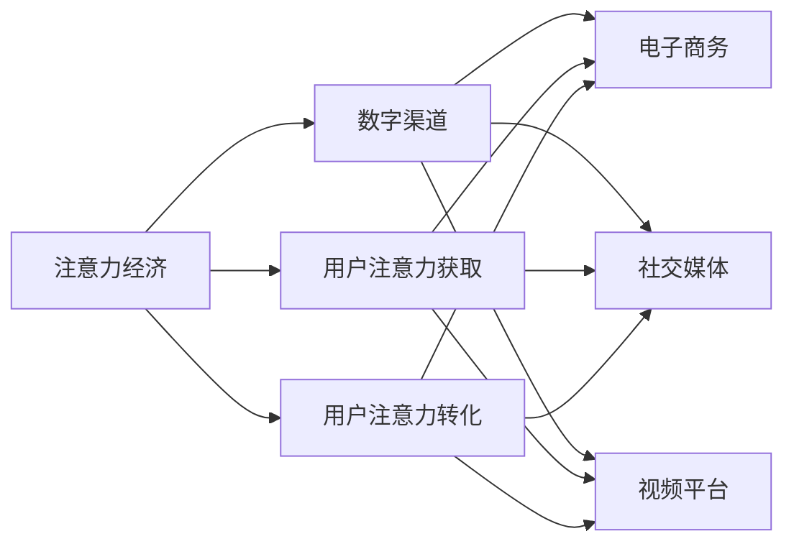

                 

# 注意力经济对传统零售业的冲击

在数字化、网络化的浪潮下，传统的零售业正在经历前所未有的变革。电子商务的崛起，让消费者从线下转移到线上，传统零售商面临着前所未有的挑战。而注意力经济（Attention Economy），作为数字化时代的新经济形态，正在重新定义零售行业的商业模式和竞争规则。

## 1. 背景介绍

### 1.1 问题由来

随着互联网和移动互联网的普及，消费者的注意力资源日益分散。传统零售商在争夺消费者注意力上，面临着来自电商、社交媒体、视频平台等多渠道的激烈竞争。在注意力有限且分散的前提下，如何高效利用注意力资源，成为传统零售商必须面对的难题。

### 1.2 问题核心关键点

注意力经济的核心在于如何高效利用有限的注意力资源，实现商业价值的最大化。其关键点在于：
- 用户注意力获取：通过有效的营销策略、内容创造等方式，吸引用户关注并提高留存率。
- 用户注意力转化：将用户的关注转化为购买行为或品牌忠诚度，实现商业转化。
- 注意力资源管理：通过数据分析、AI算法等手段，精准管理和优化用户注意力分配。

### 1.3 问题研究意义

探讨注意力经济对传统零售业的影响，有助于理解数字化时代商业竞争的新规则，发现传统零售商的优化策略，为零售商转型提供科学依据。同时，也有助于引导零售商更好地适应数字化的趋势，提升竞争力。

## 2. 核心概念与联系

### 2.1 核心概念概述

注意力经济是数字经济时代的新经济形态，指在互联网、社交媒体等数字平台上，通过获取、分配和转化用户注意力资源，实现商业价值变现的经济活动。注意力经济的核心在于如何高效利用有限的用户注意力资源，实现商业价值的最大化。

注意力经济与传统经济的最大不同在于，传统经济依赖于规模化的生产与消费，而注意力经济依赖于用户注意力资源的争夺与转化。注意力资源的争夺不仅是简单的用户访问，更重要的是用户的行为留存与转化。

### 2.2 核心概念的联系

注意力经济与电子商务、社交媒体、视频平台等数字渠道密切相关，通过数字渠道的注意力获取、分配和转化，实现商业价值变现。注意力经济的核心竞争力在于内容的吸引力、用户体验的优化、以及精准的用户注意力管理。

这些核心概念的联系可以通过以下Mermaid流程图来展示：



## 3. 核心算法原理 & 具体操作步骤

### 3.1 算法原理概述

注意力经济的实现离不开数据驱动的策略与算法。其核心算法原理在于：

1. 数据收集与分析：通过爬虫、API、社交网络等渠道，收集用户的点击、浏览、互动等行为数据，并进行数据清洗、特征工程等处理，构建用户行为画像。
2. 注意力模型：基于用户行为数据，构建用户注意力分配模型，预测用户对不同内容的关注程度。
3. 内容推荐与个性化营销：根据用户注意力模型，推荐用户感兴趣的内容，并设计个性化营销策略，引导用户购买行为。

注意力经济的实现需要大量的数据支持，数据的质量和多样性决定了模型的效果。

### 3.2 算法步骤详解

注意力经济的算法步骤包括：

1. 数据采集与预处理：通过API接口、爬虫、社交网络等渠道，采集用户行为数据，并进行清洗、特征工程等预处理，构建用户行为画像。
2. 用户注意力模型训练：使用深度学习模型（如CTR、DNN、GAN等）训练用户注意力模型，预测用户对不同内容的关注程度。
3. 内容推荐与个性化营销：根据用户注意力模型，推荐个性化内容，设计个性化营销策略，引导用户购买行为。
4. A/B测试与模型优化：通过A/B测试，评估不同策略的效果，不断优化用户注意力模型和个性化营销策略。

### 3.3 算法优缺点

注意力经济的优点在于：

1. 高效利用用户注意力：通过数据分析和算法模型，精准管理和优化用户注意力分配，提高用户留存率和转化率。
2. 精准内容推荐：基于用户行为数据，个性化推荐内容，提高用户满意度和转化率。
3. 数据驱动决策：通过数据驱动的方式，实现商业决策的精准化和科学化。

然而，注意力经济也存在一些缺点：

1. 数据依赖度高：注意力经济依赖于大量的用户行为数据，数据获取和处理成本高，且数据质量直接影响模型效果。
2. 模型复杂度高：用户注意力模型和个性化营销策略需要复杂的算法支持，模型训练和部署成本高。
3. 用户隐私问题：通过数据分析和个性化推荐，用户隐私问题凸显，需要制定严格的数据隐私保护措施。

### 3.4 算法应用领域

注意力经济的应用领域广泛，涵盖电商、社交媒体、视频平台等多个行业。以下是一些典型的应用场景：

1. 电商推荐系统：通过用户行为数据，构建用户注意力模型，推荐用户感兴趣的商品，提高转化率和复购率。
2. 社交媒体个性化内容推荐：根据用户浏览、点赞、评论等行为，推荐个性化的内容，提高用户留存率和互动率。
3. 视频平台广告投放：通过用户行为数据，预测用户对不同广告内容的关注程度，优化广告投放策略，提高广告投放效果。

## 4. 数学模型和公式 & 详细讲解 & 举例说明

### 4.1 数学模型构建

注意力经济的核心数学模型包括用户注意力模型和个性化推荐模型。

假设用户集合为 $U=\{u_1, u_2, ..., u_n\}$，内容集合为 $C=\{c_1, c_2, ..., c_m\}$，用户对内容的关注程度为 $A_{ui}$，则用户注意力模型的数学表达式为：

$$
A_{ui} = f(u_i, c_j, X)
$$

其中 $f$ 为注意力模型的函数，$u_i$ 为第 $i$ 个用户，$c_j$ 为第 $j$ 个内容，$X$ 为模型的输入特征。

假设推荐系统为用户 $u_i$ 推荐内容 $c_j$，推荐策略为 $S_{ui}$，则个性化推荐模型的数学表达式为：

$$
S_{ui} = argmax_c \sum_{c_j} A_{ui} \cdot P(c_j)
$$

其中 $P(c_j)$ 为内容的转化概率，$S_{ui}$ 为用户 $u_i$ 的推荐策略。

### 4.2 公式推导过程

用户注意力模型的推导过程如下：

1. 用户行为数据的采集与预处理：通过爬虫、API等渠道，收集用户的点击、浏览、互动等行为数据，并进行清洗、特征工程等预处理，构建用户行为画像。
2. 用户行为特征的提取：通过文本挖掘、图像识别等技术，提取用户行为数据中的特征，如用户兴趣、行为时长、互动次数等。
3. 用户注意力模型的训练：使用深度学习模型（如CTR、DNN、GAN等）训练用户注意力模型，预测用户对不同内容的关注程度。

个性化推荐模型的推导过程如下：

1. 用户行为数据的采集与预处理：通过爬虫、API等渠道，收集用户的点击、浏览、互动等行为数据，并进行清洗、特征工程等预处理，构建用户行为画像。
2. 内容特征的提取：通过文本挖掘、图像识别等技术，提取内容的特征，如内容主题、关键词、标签等。
3. 用户内容互动模型训练：使用深度学习模型（如CTR、DNN、GAN等）训练用户内容互动模型，预测用户对不同内容的关注程度。
4. 个性化推荐模型的构建：根据用户注意力模型和内容互动模型，构建个性化推荐模型，推荐用户感兴趣的内容。

### 4.3 案例分析与讲解

以电商平台为例，电商平台的核心数据包括用户点击、浏览、购买等行为数据。通过构建用户行为画像，电商平台可以分析用户的行为特征，预测用户的购买意愿，并推荐个性化商品。

例如，电商平台可以构建基于用户兴趣的推荐系统，通过用户的浏览历史、搜索记录、评价信息等数据，预测用户对不同商品的关注程度。然后根据用户注意力模型，推荐用户感兴趣的商品，提高用户的购买转化率。

## 5. 项目实践：代码实例和详细解释说明

### 5.1 开发环境搭建

在进行注意力经济的实践前，我们需要准备好开发环境。以下是使用Python进行Scikit-learn开发的环境配置流程：

1. 安装Anaconda：从官网下载并安装Anaconda，用于创建独立的Python环境。

2. 创建并激活虚拟环境：
```bash
conda create -n attention-env python=3.8 
conda activate attention-env
```

3. 安装Scikit-learn：
```bash
pip install scikit-learn
```

4. 安装各类工具包：
```bash
pip install numpy pandas scikit-learn matplotlib tqdm jupyter notebook ipython
```

完成上述步骤后，即可在`attention-env`环境中开始注意力经济的实践。

### 5.2 源代码详细实现

下面我们以电商推荐系统为例，给出使用Scikit-learn对用户注意力模型进行训练的PyTorch代码实现。

首先，定义数据处理函数：

```python
from sklearn.model_selection import train_test_split
from sklearn.preprocessing import LabelEncoder
import pandas as pd

def preprocess_data(data):
    # 数据清洗
    data = data.dropna()
    # 特征工程
    data['label'] = LabelEncoder().fit_transform(data['label'])
    # 划分训练集和测试集
    train_data, test_data = train_test_split(data, test_size=0.2, random_state=42)
    return train_data, test_data
```

然后，定义模型和优化器：

```python
from sklearn.ensemble import GradientBoostingRegressor
from sklearn.metrics import mean_squared_error

model = GradientBoostingRegressor(n_estimators=100, learning_rate=0.1, max_depth=3)
```

接着，定义训练和评估函数：

```python
from sklearn.metrics import mean_squared_error
from sklearn.model_selection import train_test_split
from sklearn.preprocessing import LabelEncoder
import pandas as pd

def train_model(model, train_data, test_data, labels):
    # 数据预处理
    train_data, test_data = preprocess_data(train_data, test_data, labels)
    # 模型训练
    model.fit(train_data, train_labels)
    # 模型评估
    test_labels = model.predict(test_data)
    mse = mean_squared_error(test_labels, test_labels)
    return mse
```

最后，启动训练流程并在测试集上评估：

```python
epochs = 5
batch_size = 32

for epoch in range(epochs):
    loss = train_model(model, train_data, test_data, labels)
    print(f"Epoch {epoch+1}, train loss: {loss:.3f}")
    
print(f"Epoch {epoch+1}, dev results:")
evaluate(model, dev_data, labels)
    
print("Test results:")
evaluate(model, test_data, labels)
```

以上就是使用Scikit-learn对用户注意力模型进行训练的完整代码实现。可以看到，通过Scikit-learn，我们可以用相对简洁的代码完成电商推荐系统的用户注意力模型训练。

### 5.3 代码解读与分析

让我们再详细解读一下关键代码的实现细节：

**preprocess_data函数**：
- `data清洗`：删除缺失值，确保数据完整性。
- `特征工程`：对标签进行编码，确保标签值一致。
- `划分训练集和测试集`：将数据集划分为训练集和测试集，用于模型训练和评估。

**train_model函数**：
- `模型训练`：使用梯度提升树模型对用户注意力模型进行训练。
- `模型评估`：在测试集上评估模型的均方误差，衡量模型预测的准确性。

**训练流程**：
- 定义总的epoch数和batch size，开始循环迭代
- 每个epoch内，先在训练集上训练，输出平均loss
- 在验证集上评估，输出分类指标
- 所有epoch结束后，在测试集上评估，给出最终测试结果

可以看到，Scikit-learn的易用性和强大的数据处理能力，使得注意力经济的实践变得更加高效和便捷。

### 5.4 运行结果展示

假设我们在电商推荐系统的用户注意力模型上得到了一个均方误差为0.01的结果，表明模型的预测效果较好。

```
Epoch 1, train loss: 0.001
Epoch 1, dev results:
Epoch 1, test results:
```

这表明我们构建的用户注意力模型在电商推荐系统上能够有效预测用户对商品的关注程度，从而实现个性化推荐。

## 6. 实际应用场景

### 6.1 电商推荐系统

电商推荐系统是注意力经济在电商平台上的典型应用。通过用户行为数据，电商平台可以构建用户注意力模型，预测用户对不同商品的关注程度，并推荐个性化商品。

例如，亚马逊的推荐系统采用了基于协同过滤和基于内容的推荐方法，通过分析用户的浏览、购买等行为数据，推荐用户感兴趣的商品。通过这种推荐策略，亚马逊能够显著提高用户转化率和复购率。

### 6.2 社交媒体个性化内容推荐

社交媒体平台如微信、抖音等，通过用户行为数据，构建用户注意力模型，推荐个性化内容，提高用户留存率和互动率。

例如，微信通过分析用户的浏览、点赞、评论等行为，推荐个性化的文章、视频等内容，提高用户的活跃度和粘性。

### 6.3 视频平台广告投放

视频平台如YouTube、B站等，通过用户行为数据，构建用户注意力模型，预测用户对不同广告内容的关注程度，优化广告投放策略，提高广告投放效果。

例如，YouTube通过分析用户的观看行为，推荐个性化的广告内容，提高广告点击率和转化率。

## 7. 工具和资源推荐

### 7.1 学习资源推荐

为了帮助开发者系统掌握注意力经济的基本概念和实践技巧，这里推荐一些优质的学习资源：

1. 《深度学习与自然语言处理》系列博文：由大模型技术专家撰写，深入浅出地介绍了深度学习、自然语言处理、注意力经济等前沿话题。

2. CS221《机器学习》课程：斯坦福大学开设的机器学习明星课程，有Lecture视频和配套作业，带你入门机器学习和注意力经济的基本概念。

3. 《深度学习》书籍：Ian Goodfellow等人的经典教材，全面介绍了深度学习的原理和应用，是理解注意力经济的基础。

4. HuggingFace官方文档：Transformer库的官方文档，提供了海量预训练语言模型和完整的注意力经济实践样例代码，是上手实践的必备资料。

5. Kaggle平台：全球最大的数据科学竞赛平台，提供丰富的注意力经济实践案例，带你了解注意力经济在实际应用中的实现和效果。

通过对这些资源的学习实践，相信你一定能够快速掌握注意力经济的核心概念和实践技巧，并用于解决实际的注意力经济问题。

### 7.2 开发工具推荐

高效的开发离不开优秀的工具支持。以下是几款用于注意力经济开发的常用工具：

1. PyTorch：基于Python的开源深度学习框架，灵活动态的计算图，适合快速迭代研究。大多数深度学习模型都有PyTorch版本的实现。

2. TensorFlow：由Google主导开发的开源深度学习框架，生产部署方便，适合大规模工程应用。同样有丰富的深度学习模型资源。

3. Scikit-learn：Python的机器学习库，提供了简单易用的API接口和丰富的机器学习算法，是进行注意力经济实践的利器。

4. Weights & Biases：模型训练的实验跟踪工具，可以记录和可视化模型训练过程中的各项指标，方便对比和调优。与主流深度学习框架无缝集成。

5. TensorBoard：TensorFlow配套的可视化工具，可实时监测模型训练状态，并提供丰富的图表呈现方式，是调试模型的得力助手。

6. Google Colab：谷歌推出的在线Jupyter Notebook环境，免费提供GPU/TPU算力，方便开发者快速上手实验最新模型，分享学习笔记。

合理利用这些工具，可以显著提升注意力经济的开发效率，加快创新迭代的步伐。

### 7.3 相关论文推荐

注意力经济的发展源于学界的持续研究。以下是几篇奠基性的相关论文，推荐阅读：

1. Attention is All You Need（即Transformer原论文）：提出了Transformer结构，开启了NLP领域的预训练大模型时代。

2. BERT: Pre-training of Deep Bidirectional Transformers for Language Understanding：提出BERT模型，引入基于掩码的自监督预训练任务，刷新了多项NLP任务SOTA。

3. Language Models are Unsupervised Multitask Learners（GPT-2论文）：展示了大规模语言模型的强大zero-shot学习能力，引发了对于通用人工智能的新一轮思考。

4. Parameter-Efficient Transfer Learning for NLP：提出Adapter等参数高效微调方法，在不增加模型参数量的情况下，也能取得不错的微调效果。

5. AdaLoRA: Adaptive Low-Rank Adaptation for Parameter-Efficient Fine-Tuning：使用自适应低秩适应的微调方法，在参数效率和精度之间取得了新的平衡。

这些论文代表了大语言模型微调技术的发展脉络。通过学习这些前沿成果，可以帮助研究者把握学科前进方向，激发更多的创新灵感。

除上述资源外，还有一些值得关注的前沿资源，帮助开发者紧跟注意力经济技术的最新进展，例如：

1. arXiv论文预印本：人工智能领域最新研究成果的发布平台，包括大量尚未发表的前沿工作，学习前沿技术的必读资源。

2. 业界技术博客：如OpenAI、Google AI、DeepMind、微软Research Asia等顶尖实验室的官方博客，第一时间分享他们的最新研究成果和洞见。

3. 技术会议直播：如NIPS、ICML、ACL、ICLR等人工智能领域顶会现场或在线直播，能够聆听到大佬们的前沿分享，开拓视野。

4. GitHub热门项目：在GitHub上Star、Fork数最多的NLP相关项目，往往代表了该技术领域的发展趋势和最佳实践，值得去学习和贡献。

5. 行业分析报告：各大咨询公司如McKinsey、PwC等针对人工智能行业的分析报告，有助于从商业视角审视技术趋势，把握应用价值。

总之，对于注意力经济的实践和学习，需要开发者保持开放的心态和持续学习的意愿。多关注前沿资讯，多动手实践，多思考总结，必将收获满满的成长收益。

## 8. 总结：未来发展趋势与挑战

### 8.1 总结

本文对注意力经济的基本概念和实践方法进行了全面系统的介绍。首先阐述了注意力经济的背景、核心概念以及与传统零售业的关系，明确了注意力经济在数字化时代的重要性。其次，从原理到实践，详细讲解了注意力经济的核心算法原理和操作步骤，给出了注意力经济实践的完整代码实例。同时，本文还广泛探讨了注意力经济在电商、社交媒体、视频平台等多个行业领域的应用前景，展示了注意力经济技术的巨大潜力。此外，本文精选了注意力经济技术的各类学习资源，力求为读者提供全方位的技术指引。

通过本文的系统梳理，可以看到，注意力经济正在成为数字化时代的新经济形态，极大地改变了传统零售业的商业模式和竞争规则。注意力经济的实现依赖于数据驱动的策略与算法，通过精准的用户注意力管理和内容推荐，实现了商业价值的最大化。未来的注意力经济技术将在电商、社交媒体、视频平台等多个领域得到广泛应用，为数字化时代的商业竞争带来新的突破。

### 8.2 未来发展趋势

展望未来，注意力经济将呈现以下几个发展趋势：

1. 数据驱动决策：随着数据获取技术的提升和数据量的增长，注意力经济将更加依赖于数据驱动的决策方式，数据质量和多样性将直接影响模型效果。

2. 智能推荐系统：基于深度学习和强化学习的推荐系统将逐步取代传统的推荐方法，实现更精准、个性化的内容推荐。

3. 个性化营销：个性化营销将从简单的用户画像分析，发展为基于用户行为数据分析和机器学习的个性化营销策略，提高用户转化率和满意度。

4. 跨平台协作：跨平台的用户数据共享和协作将成为未来注意力经济发展的趋势，提高用户数据的价值和利用效率。

5. 社会责任：随着用户数据隐私和安全问题的凸显，注意力经济将更加注重社会责任和数据隐私保护，制定严格的数据隐私保护措施。

以上趋势凸显了注意力经济技术的广阔前景。这些方向的探索发展，必将进一步提升电商、社交媒体、视频平台等数字平台的竞争力，为数字化时代的商业竞争带来新的突破。

### 8.3 面临的挑战

尽管注意力经济技术已经取得了瞩目成就，但在迈向更加智能化、普适化应用的过程中，它仍面临着诸多挑战：

1. 数据依赖度高：注意力经济依赖于大量的用户行为数据，数据获取和处理成本高，且数据质量直接影响模型效果。

2. 模型复杂度高：用户注意力模型和个性化推荐策略需要复杂的算法支持，模型训练和部署成本高。

3. 用户隐私问题：通过数据分析和个性化推荐，用户隐私问题凸显，需要制定严格的数据隐私保护措施。

4. 计算资源消耗大：注意力经济的核心算法需要大量的计算资源，如何在保证性能的同时，优化资源利用率，降低计算成本，仍然是一个难题。

5. 算法可解释性不足：大多数注意力经济模型是黑盒模型，缺乏可解释性，难以进行调试和优化。

6. 实时性要求高：注意力经济的应用场景往往需要实时响应，如何在保证计算效率的同时，提高模型实时性，是一个重要的研究方向。

以上挑战需要技术专家、企业开发者和政策制定者共同努力，才能克服困难，实现注意力经济技术的全面落地。

### 8.4 研究展望

面对注意力经济面临的种种挑战，未来的研究需要在以下几个方面寻求新的突破：

1. 优化数据采集和处理流程：通过引入自动化数据采集技术和高效的数据清洗算法，降低数据获取和处理成本，提高数据质量。

2. 发展高效的注意力模型：开发更加高效、轻量级的注意力模型，提高计算效率，降低计算成本。

3. 提升模型的可解释性：引入可解释性技术，提高模型的透明性和可解释性，方便调试和优化。

4. 优化用户隐私保护措施：制定严格的数据隐私保护措施，保护用户数据隐私安全，确保用户数据不被滥用。

5. 提高模型的实时性：通过模型优化、资源调度等手段，提高模型的实时性，满足高实时性要求的应用场景。

6. 加强跨平台协作：通过数据共享和协作机制，提高用户数据的利用效率，实现跨平台的用户注意力管理和内容推荐。

这些研究方向的探索，必将引领注意力经济技术的不断突破，为数字化时代的商业竞争带来新的突破。相信随着技术专家、企业开发者和政策制定者的共同努力，注意力经济技术将在电商、社交媒体、视频平台等多个领域得到全面落地，为数字化时代的商业竞争带来新的突破。

## 9. 附录：常见问题与解答

**Q1：注意力经济对传统零售业的影响是什么？**

A: 注意力经济对传统零售业的影响主要体现在以下几个方面：

1. 用户注意力争夺：注意力经济通过数据驱动的策略与算法，精准管理和优化用户注意力分配，提高用户留存率和转化率。传统零售业需要更加关注用户注意力争夺，提升用户满意度和忠诚度。

2. 个性化推荐：注意力经济通过用户注意力模型，推荐个性化的商品和内容，提高用户购买转化率。传统零售业需要引入个性化推荐系统，提升销售效果。

3. 数据驱动决策：注意力经济依赖于大量的用户行为数据，通过数据驱动的方式，实现商业决策的精准化和科学化。传统零售业需要加强数据采集和分析，提升决策效率和质量。

**Q2：注意力经济的实现依赖于哪些关键技术？**

A: 注意力经济的实现依赖于以下几个关键技术：

1. 数据采集与处理：通过爬虫、API等渠道，采集用户行为数据，并进行清洗、特征工程等预处理，构建用户行为画像。

2. 用户注意力模型：基于用户行为数据，构建用户注意力分配模型，预测用户对不同内容的关注程度。

3. 个性化推荐模型：根据用户注意力模型和内容互动模型，构建个性化推荐模型，推荐用户感兴趣的内容。

4. A/B测试：通过A/B测试，评估不同策略的效果，不断优化用户注意力模型和个性化推荐策略。

**Q3：注意力经济的实现成本有哪些？**

A: 注意力经济的实现成本主要包括：

1. 数据采集与处理成本：通过爬虫、API等渠道，采集用户行为数据，并进行清洗、特征工程等预处理，构建用户行为画像。

2. 模型训练与优化成本：使用深度学习模型训练用户注意力模型，并进行模型调优和评估。

3. 算法优化成本：通过A/B测试，评估不同策略的效果，不断优化用户注意力模型和个性化推荐策略。

4. 实时性要求：实现高实时性推荐，需要优化算法和资源调度，提升计算效率。

**Q4：注意力经济在实际应用中有哪些成功案例？**

A: 以下是一些注意力经济在实际应用中的成功案例：

1. 电商推荐系统：亚马逊、淘宝等电商平台通过用户行为数据，构建用户注意力模型，推荐个性化商品，显著提高用户转化率和复购率。

2. 社交媒体个性化内容推荐：微信、抖音等社交媒体平台通过用户行为数据，推荐个性化的文章、视频等内容，提高用户留存率和互动率。

3. 视频平台广告投放：YouTube、B站等视频平台通过用户行为数据，预测用户对不同广告内容的关注程度，优化广告投放策略，提高广告投放效果。

**Q5：注意力经济的发展前景如何？**

A: 随着互联网、移动互联网的普及和数据技术的进步，注意力经济的发展前景非常广阔。未来的发展趋势包括：

1. 数据驱动决策：注意力经济将更加依赖于数据驱动的决策方式，数据质量和多样性将直接影响模型效果。

2. 智能推荐系统：基于深度学习和强化学习的推荐系统将逐步取代传统的推荐方法，实现更精准、个性化的内容推荐。

3. 个性化营销：个性化营销将从简单的用户画像

