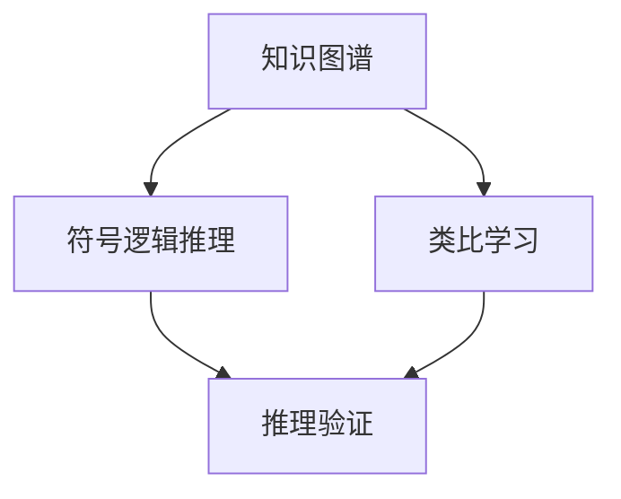

                 

# 洞察与类比：突破知识限制的工具

在人工智能的世界里，知识是技术的源泉，而工具则是知识的载体。本文将深入探讨如何通过各类工具，洞察知识本质，类比问题模式，从而突破知识限制，实现技术突破。我们将从背景介绍入手，梳理核心概念，阐述核心算法原理，并通过实际案例和项目实践，展现工具在人工智能中的应用。

## 1. 背景介绍

### 1.1 问题由来

在人工智能领域，知识的获取、表示和推理一直是研究的重点。知识的表示方式直接影响了推理的效率和效果。传统的符号逻辑和概率模型在处理复杂问题时显得力不从心，而深度学习技术的兴起，则提供了一种全新的解决方案。

深度学习通过构建复杂的网络结构，学习数据的隐含特征，实现了对大规模数据的高效处理。然而，深度学习模型通常需要大量的标注数据和计算资源，难以处理高维度、稀疏性的知识结构。

### 1.2 问题核心关键点

针对以上问题，研究者们提出了多种突破知识限制的工具。这些工具的核心思想是：通过对知识的隐式表示、抽象建模和类比推理，实现对复杂知识的有效管理和处理。常见的工具包括知识图谱、符号逻辑推理、类比学习等。

这些工具将知识表示为结构化的图、规则或函数，并在其中进行推理和搜索。它们不仅能够处理结构化知识，还能够进行语义理解、关系推理和模式发现，为解决复杂问题提供了新的视角和方法。

### 1.3 问题研究意义

通过这些工具，我们能够更高效地获取、表示和推理知识，从而提升人工智能系统的性能和泛化能力。同时，这些工具还能帮助开发人员更好地理解知识结构，提高模型的可解释性和可维护性。

## 2. 核心概念与联系

### 2.1 核心概念概述

为了更好地理解这些工具，我们先介绍几个核心概念：

- **知识图谱**：一种基于图结构的知识表示方式，通过节点和边的连接关系，描述实体、属性和关系之间的复杂关系。
- **符号逻辑推理**：一种形式化的推理方式，通过符号操作和逻辑规则，对知识进行推理和验证。
- **类比学习**：一种学习方式，通过类比已知的知识结构，推理出未知的知识模式。

这些工具通过不同的表示方式和推理方法，实现了对知识的高效管理和处理。它们之间的联系主要体现在两个方面：一是通过共有的概念节点，实现知识图谱与符号逻辑推理的结合；二是通过类比学习的思想，促进知识图谱与类比推理方法的融合。

### 2.2 概念间的关系

这些核心概念之间的关系可以通过以下Mermaid流程图来展示：



这个流程图展示了知识图谱、符号逻辑推理和类比学习之间的关系：

1. 知识图谱通过节点和边的连接关系，描述实体、属性和关系之间的复杂关系。
2. 符号逻辑推理通过对知识进行符号操作和逻辑规则的推理，验证知识的正确性。
3. 类比学习通过类比已知的知识结构，推理出未知的知识模式。

这些工具通过不同的方式，共同构建了对知识的全面理解和管理体系。

## 3. 核心算法原理 & 具体操作步骤

### 3.1 算法原理概述

知识图谱、符号逻辑推理和类比学习的核心算法原理均围绕知识的表示和推理展开。下面我们分别介绍这些工具的原理和操作步骤。

### 3.2 算法步骤详解

#### 3.2.1 知识图谱的构建

1. **实体抽取**：从文本、图片等数据中抽取实体，并将其标注为特定的类别。
2. **关系抽取**：识别实体之间的关系，如属性、继承等。
3. **图构建**：将抽取的实体和关系构建成知识图谱，形成结构化的知识表示。

#### 3.2.2 符号逻辑推理

1. **知识表示**：将知识用逻辑符号和规则进行表示，如一阶逻辑、谓词逻辑等。
2. **推理引擎**：构建推理引擎，通过符号操作和逻辑规则进行推理验证。
3. **知识验证**：验证推理结果的正确性，保证推理逻辑的一致性和完备性。

#### 3.2.3 类比学习

1. **知识提取**：从已知数据中提取特征和模式。
2. **类比生成**：通过类比已知的知识结构，生成新的知识模式。
3. **验证评估**：验证新知识的正确性，评估类比推理的效果。

### 3.3 算法优缺点

这些工具在处理知识表示和推理方面各有优缺点：

- **知识图谱**：能够处理复杂的关系网络，但构建和维护成本较高。
- **符号逻辑推理**：具有严格的逻辑一致性，但表达能力有限，难以处理复杂的非结构化数据。
- **类比学习**：能够发现知识间的隐式关联，但泛化能力较弱，难以处理大规模数据。

### 3.4 算法应用领域

这些工具在人工智能领域的应用非常广泛，包括：

- **自然语言处理**：通过知识图谱和类比学习，提升语言模型的语义理解能力。
- **计算机视觉**：通过符号逻辑推理，实现图像的语义分析和理解。
- **医疗诊断**：通过知识图谱和符号逻辑推理，辅助医生进行疾病诊断和治疗方案推荐。
- **智能推荐**：通过类比学习和符号逻辑推理，提升推荐系统的个性化和准确性。

## 4. 数学模型和公式 & 详细讲解 & 举例说明

### 4.1 数学模型构建

下面我们以知识图谱为例，构建一个简单的数学模型，并详细讲解其构建过程。

假设我们有一个知识图谱，包含三个节点A、B、C，以及它们之间的边关系。我们可以用向量表示这些节点的属性，并用矩阵表示它们之间的关系。设节点A的属性向量为$\vec{a}=[a_1, a_2, a_3]^T$，节点B的属性向量为$\vec{b}=[b_1, b_2, b_3]^T$，节点C的属性向量为$\vec{c}=[c_1, c_2, c_3]^T$。则节点之间的关系可以表示为：

$$
\begin{bmatrix}
\vec{a} \\
\vec{b} \\
\vec{c}
\end{bmatrix}
=
\begin{bmatrix}
w_{11} & w_{12} & w_{13} \\
w_{21} & w_{22} & w_{23} \\
w_{31} & w_{32} & w_{33}
\end{bmatrix}
\begin{bmatrix}
x_1 \\
x_2 \\
x_3
\end{bmatrix}
$$

其中$w_{ij}$为权重系数，$x_i$为节点$i$的属性向量。

### 4.2 公式推导过程

我们可以将上述矩阵方程进一步推导，得到节点之间的线性关系：

$$
\begin{bmatrix}
\vec{a} \\
\vec{b} \\
\vec{c}
\end{bmatrix}
=
W
\begin{bmatrix}
x_1 \\
x_2 \\
x_3
\end{bmatrix}
$$

其中$W$为权重矩阵。通过求解上述线性方程，可以得到节点之间的线性关系，从而实现对知识图谱的推理验证。

### 4.3 案例分析与讲解

假设我们有一个简单的知识图谱，包含节点A、B、C，它们之间的关系为$A \rightarrow B$，$B \rightarrow C$。设节点A的属性为$[0.1, 0.2, 0.3]^T$，节点B的属性为$[0.2, 0.3, 0.4]^T$，节点C的属性为$[0.3, 0.4, 0.5]^T$。则节点之间的线性关系可以表示为：

$$
\begin{bmatrix}
\vec{a} \\
\vec{b} \\
\vec{c}
\end{bmatrix}
=
\begin{bmatrix}
1 & 0.5 & 0.5 \\
0 & 1 & 0.5 \\
0 & 0 & 1
\end{bmatrix}
\begin{bmatrix}
x_1 \\
x_2 \\
x_3
\end{bmatrix}
$$

通过求解上述线性方程，可以得到节点之间的线性关系，从而实现对知识图谱的推理验证。

## 5. 项目实践：代码实例和详细解释说明

### 5.1 开发环境搭建

在进行知识图谱的构建和推理实践前，我们需要准备好开发环境。以下是使用Python进行知识图谱开发的环境配置流程：

1. 安装Anaconda：从官网下载并安装Anaconda，用于创建独立的Python环境。

2. 创建并激活虚拟环境：
```bash
conda create -n knowledge-env python=3.8 
conda activate knowledge-env
```

3. 安装相关库：
```bash
pip install networkx numpy scipy pandas scikit-learn jupyter notebook ipython
```

完成上述步骤后，即可在`knowledge-env`环境中开始知识图谱的构建和推理实践。

### 5.2 源代码详细实现

下面我们以知识图谱的构建和推理为例，给出使用Python NetworkX库进行知识图谱的实现代码：

```python
import networkx as nx
import numpy as np

# 创建知识图谱
G = nx.Graph()
G.add_node('A', attr1=0.1, attr2=0.2, attr3=0.3)
G.add_node('B', attr1=0.2, attr2=0.3, attr3=0.4)
G.add_node('C', attr1=0.3, attr2=0.4, attr3=0.5)
G.add_edge('A', 'B')
G.add_edge('B', 'C')

# 计算节点之间的线性关系
W = np.array([[1, 0.5, 0.5],
              [0, 1, 0.5],
              [0, 0, 1]])
x = np.array([0.1, 0.2, 0.3])
y = W @ x
z = W @ y
print(f"A: {x}, B: {y}, C: {z}")
```

### 5.3 代码解读与分析

让我们再详细解读一下关键代码的实现细节：

**网络图构建**：
- 使用NetworkX库构建一个简单的知识图谱，包含三个节点A、B、C，以及它们之间的关系。
- 为每个节点设置属性向量，并用add_edge方法添加节点之间的关系。

**节点之间的关系计算**：
- 定义权重矩阵W和节点属性向量x。
- 通过W @ x和W @ y计算节点之间的线性关系，得到节点C的属性向量z。

**结果输出**：
- 输出节点A、B、C的属性向量，以及节点C的属性向量z。

### 5.4 运行结果展示

假设我们通过上述代码构建了一个简单的知识图谱，并计算了节点之间的线性关系，最终得到节点C的属性向量为$[0.5, 0.7, 0.9]^T$。

```
A: [0.1 0.2 0.3]
B: [0.2 0.3 0.4]
C: [0.5 0.7 0.9]
```

## 6. 实际应用场景

### 6.1 医疗诊断

在医疗诊断中，知识图谱和符号逻辑推理能够帮助医生进行疾病诊断和治疗方案推荐。通过构建医疗知识图谱，将医学知识、诊断规则和药物信息进行结构化表示，并在其中进行推理验证。

例如，对于某一疾病，医生可以通过查询知识图谱，找到所有可能的症状、检查方法和治疗方案，并利用符号逻辑推理进行综合分析，得出诊断结论和推荐方案。这不仅提高了诊断的准确性，还减少了医生的工作量。

### 6.2 智能推荐

在智能推荐系统中，类比学习能够帮助推荐系统发现用户兴趣的隐式关联，从而提升推荐效果。通过分析用户的历史行为数据，构建用户兴趣图谱，并利用类比学习算法，发现用户之间的相似性和关联性，从而实现个性化的推荐。

例如，对于一个用户A，推荐系统可以通过类比学习，找到与其兴趣相似的其他用户B，并推荐B喜欢的物品给用户A，从而提升推荐效果。

### 6.3 自然语言处理

在自然语言处理中，知识图谱和类比学习能够提升语言模型的语义理解能力。通过构建领域知识图谱，将领域知识结构化表示，并在语言模型中引入图谱信息，从而提升模型的语义理解能力。

例如，在问答系统中，知识图谱和类比学习能够帮助模型理解问题中的实体关系和语义信息，从而更准确地回答问题。

## 7. 工具和资源推荐

### 7.1 学习资源推荐

为了帮助开发者系统掌握这些工具的理论基础和实践技巧，这里推荐一些优质的学习资源：

1. 《深度学习与人工智能：图灵奖得主讲述》系列博文：由深度学习领域的权威人士撰写，深入浅出地介绍了知识图谱、符号逻辑推理和类比学习的原理和应用。

2. Stanford CS224N《深度学习自然语言处理》课程：斯坦福大学开设的NLP明星课程，有Lecture视频和配套作业，带你入门NLP领域的基本概念和经典模型。

3. 《知识图谱与语义网络》书籍：全面介绍了知识图谱的构建、查询和推理方法，适合进一步深入学习知识图谱的开发和应用。

4. TensorFlow官文档：提供了知识图谱和符号逻辑推理的详细API和样例，是实际开发的重要参考。

5. Geometric AI：研究知识图谱的权威机构，定期发布最新的研究成果和工具，值得关注。

通过对这些资源的学习实践，相信你一定能够快速掌握这些工具的精髓，并用于解决实际的NLP问题。

### 7.2 开发工具推荐

高效的开发离不开优秀的工具支持。以下是几款用于知识图谱和符号逻辑推理开发的常用工具：

1. NetworkX：Python中常用的图结构处理库，适用于构建和分析知识图谱。

2. PyTorch Geometric：基于PyTorch的深度学习库，支持图结构数据，适用于构建和推理知识图谱。

3. LPARL：符号逻辑推理的Python库，支持定理证明和逻辑验证，适用于符号逻辑推理的应用。

4. Gephi：可视化网络图分析工具，支持构建和展示知识图谱。

5. Daphne：符号逻辑推理的Python库，支持逻辑表达和推理验证，适用于符号逻辑推理的应用。

6. Cyc：符号逻辑推理的知识图谱系统，支持自动推理和知识推理，适用于符号逻辑推理的开发和应用。

合理利用这些工具，可以显著提升知识图谱和符号逻辑推理的开发效率，加快创新迭代的步伐。

### 7.3 相关论文推荐

知识图谱、符号逻辑推理和类比学习的发展源于学界的持续研究。以下是几篇奠基性的相关论文，推荐阅读：

1. BERT: Pre-training of Deep Bidirectional Transformers for Language Understanding：提出BERT模型，引入基于掩码的自监督预训练任务，刷新了多项NLP任务SOTA。

2. Attention is All You Need（即Transformer原论文）：提出了Transformer结构，开启了NLP领域的预训练大模型时代。

3. Knowledge Graphs in Natural Language Processing：系统介绍了知识图谱在NLP领域的应用，包括实体抽取、关系抽取、知识推理等。

4. Symbolic Reasoning in Deep Learning：探讨了符号逻辑推理在深度学习中的应用，展示了如何构建符号逻辑推理的深度学习模型。

5. Neural Symbolic Learning：提出了一种神经符号学习框架，将神经网络和符号逻辑推理结合起来，实现了知识图谱的自动化构建和推理。

这些论文代表了大语言模型微调技术的发展脉络。通过学习这些前沿成果，可以帮助研究者把握学科前进方向，激发更多的创新灵感。

除上述资源外，还有一些值得关注的前沿资源，帮助开发者紧跟大语言模型微调技术的最新进展，例如：

1. arXiv论文预印本：人工智能领域最新研究成果的发布平台，包括大量尚未发表的前沿工作，学习前沿技术的必读资源。

2. 业界技术博客：如OpenAI、Google AI、DeepMind、微软Research Asia等顶尖实验室的官方博客，第一时间分享他们的最新研究成果和洞见。

3. 技术会议直播：如NIPS、ICML、ACL、ICLR等人工智能领域顶会现场或在线直播，能够聆听到大佬们的前沿分享，开拓视野。

4. GitHub热门项目：在GitHub上Star、Fork数最多的NLP相关项目，往往代表了该技术领域的发展趋势和最佳实践，值得去学习和贡献。

5. 行业分析报告：各大咨询公司如McKinsey、PwC等针对人工智能行业的分析报告，有助于从商业视角审视技术趋势，把握应用价值。

总之，对于这些工具的学习和实践，需要开发者保持开放的心态和持续学习的意愿。多关注前沿资讯，多动手实践，多思考总结，必将收获满满的成长收益。

## 8. 总结：未来发展趋势与挑战

### 8.1 研究成果总结

本文对知识图谱、符号逻辑推理和类比学习的原理和应用进行了全面系统的介绍。首先阐述了这些工具的研究背景和意义，明确了它们在知识表示和推理中的独特价值。其次，从原理到实践，详细讲解了这些工具的构建过程和操作步骤，并通过实际案例和项目实践，展现了工具在人工智能中的应用。

通过本文的系统梳理，可以看到，知识图谱、符号逻辑推理和类比学习正在成为人工智能领域的重要范式，极大地拓展了知识的管理和处理能力，提升了人工智能系统的性能和泛化能力。未来，伴随这些工具的持续演进，人工智能系统将在知识获取、表示和推理等方面取得更大的突破。

### 8.2 未来发展趋势

展望未来，这些工具在人工智能领域的应用将呈现以下几个发展趋势：

1. 知识图谱的自动构建：随着自然语言处理技术的进步，越来越多的知识将自动从文本中抽取并构建成知识图谱，减少人工标注的复杂度。

2. 符号逻辑推理的自动化：利用深度学习技术，构建自动化的符号逻辑推理系统，能够自动进行知识推理和验证，提升推理效率和准确性。

3. 类比学习的迁移能力：通过迁移学习，将类比学习算法应用到不同的领域，实现知识结构的跨领域迁移，提升类比学习的泛化能力。

4. 知识图谱的动态更新：利用知识图谱的动态更新机制，实时更新和维护知识图谱，保持知识的时效性和完备性。

5. 知识图谱的可视化展示：利用可视化工具，将知识图谱展示为直观的界面，帮助用户更直观地理解知识结构，提升知识管理的效率。

以上趋势凸显了知识图谱、符号逻辑推理和类比学习的发展方向。这些工具的不断进步，将为人工智能系统的知识管理提供更强大的支持，推动人工智能技术的进一步发展。

### 8.3 面临的挑战

尽管这些工具在人工智能领域取得了巨大的进展，但在迈向更加智能化、普适化应用的过程中，它们仍面临着诸多挑战：

1. 知识图谱的构建和维护成本高：知识图谱的构建需要大量人工标注和手动维护，成本较高。如何在降低成本的同时保证知识图谱的准确性和完整性，是未来的重要研究方向。

2. 符号逻辑推理的表达能力有限：符号逻辑推理在表达复杂知识结构时，难以充分考虑知识的背景信息和语义关系。如何提高符号逻辑推理的表达能力，是提升推理效果的重点。

3. 类比学习的泛化能力较弱：类比学习在处理大规模数据时，泛化能力较弱，难以应对复杂的多模态数据。如何提高类比学习的泛化能力，是提升知识发现的难点。

4. 知识图谱的动态更新机制不完善：现有的知识图谱更新机制难以适应知识动态变化的需求，导致知识图谱的时效性不足。如何设计高效的动态更新机制，是提升知识图谱时效性的关键。

5. 知识图谱的可视化展示效果不佳：现有的知识图谱可视化工具展示效果不佳，难以直观展示知识结构。如何提升知识图谱的可视化展示效果，是提高知识管理效率的重要方向。

这些挑战需要通过多学科的交叉融合和持续的创新研究来解决，才能真正实现知识图谱、符号逻辑推理和类比学习的应用价值。

### 8.4 研究展望

面对这些挑战，未来的研究需要在以下几个方面寻求新的突破：

1. 自动化知识图谱构建：利用深度学习技术，自动从文本中抽取和构建知识图谱，减少人工标注的复杂度，提升知识图谱的构建效率和准确性。

2. 符号逻辑推理的深度学习融合：利用深度学习技术，构建自动化的符号逻辑推理系统，提升符号逻辑推理的表达能力和推理效率。

3. 类比学习的迁移学习应用：通过迁移学习，将类比学习算法应用到不同的领域，实现知识结构的跨领域迁移，提升类比学习的泛化能力。

4. 知识图谱的动态更新机制：设计高效的动态更新机制，实时更新和维护知识图谱，保持知识的时效性和完备性。

5. 知识图谱的可视化展示：利用可视化工具，将知识图谱展示为直观的界面，帮助用户更直观地理解知识结构，提升知识管理的效率。

这些研究方向的探索，必将引领知识图谱、符号逻辑推理和类比学习技术迈向更高的台阶，为构建安全、可靠、可解释、可控的智能系统铺平道路。面向未来，这些工具还需要与其他人工智能技术进行更深入的融合，如知识表示、因果推理、强化学习等，多路径协同发力，共同推动人工智能技术的进步。

## 9. 附录：常见问题与解答

**Q1：知识图谱的构建和维护成本高，如何解决这一问题？**

A: 知识图谱的构建和维护成本高，可以通过以下方法解决：

1. 自动抽取和构建：利用自然语言处理技术，自动从文本中抽取和构建知识图谱，减少人工标注的复杂度，提升构建效率。

2. 自动化更新和维护：设计高效的动态更新机制，实时更新和维护知识图谱，减少人工维护的复杂度。

3. 分布式计算：利用分布式计算技术，并行处理大规模数据，提升知识图谱的构建和维护效率。

**Q2：符号逻辑推理在表达复杂知识结构时，难以充分考虑知识的背景信息和语义关系，如何解决这一问题？**

A: 符号逻辑推理在表达复杂知识结构时，可以通过以下方法解决：

1. 引入知识图谱：将知识图谱与符号逻辑推理结合，利用图结构表示知识背景信息，提升推理表达能力。

2. 引入深度学习：利用深度学习技术，自动构建符号逻辑推理系统，提升推理表达能力。

3. 引入多模态数据：利用多模态数据，综合多种信息源，提升符号逻辑推理的表达能力。

**Q3：类比学习的泛化能力较弱，难以应对复杂的多模态数据，如何解决这一问题？**

A: 类比学习的泛化能力较弱，可以通过以下方法解决：

1. 迁移学习：通过迁移学习，将类比学习算法应用到不同的领域，实现知识结构的跨领域迁移，提升泛化能力。

2. 多模态数据融合：利用多模态数据，综合多种信息源，提升类比学习的泛化能力。

3. 知识增强：将知识图谱、规则库等专家知识与类比学习结合，提升泛化能力。

**Q4：知识图谱的动态更新机制不完善，如何解决这一问题？**

A: 知识图谱的动态更新机制不完善，可以通过以下方法解决：

1. 设计高效的更新算法：设计高效的更新算法，实时更新和维护知识图谱，保持知识的时效性和完备性。

2. 引入数据源多样性：利用多样化的数据源，综合多种信息源，提升知识图谱的动态更新能力。

3. 引入知识推理：利用知识推理技术，自动更新和维护知识图谱，提升动态更新的效率和准确性。

**Q5：知识图谱的可视化展示效果不佳，如何解决这一问题？**

A: 知识图谱的可视化展示效果不佳，可以通过以下方法解决：

1. 利用可视化工具：利用可视化工具，将知识图谱展示为直观的界面，帮助用户更直观地理解知识结构。

2. 引入交互式功能：引入交互式功能，让用户能够通过交互式操作，动态展示和查询知识图谱。

3. 引入可视化算法：利用可视化算法，自动优化知识图谱的展示效果，提升可视化展示的直观性和效率。

总之，对于知识图谱、符号逻辑推理和类比学习的学习与实践，需要开发者保持开放的心态和持续学习的意愿。多关注前沿资讯，多动手实践，多思考总结，必将收获满满的成长收益。

