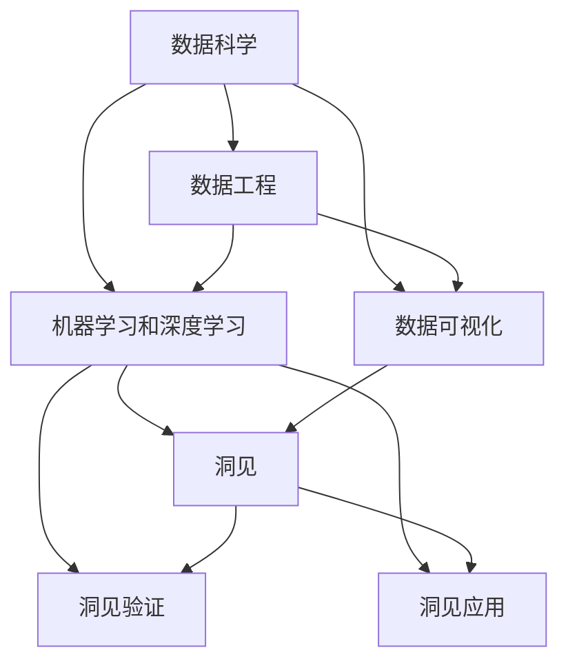

                 

# 洞见的形成：从观察到反思

## 1. 背景介绍

### 1.1 问题由来
在信息技术飞速发展的今天，数据的获取变得前所未有的容易。然而，海量的数据往往包含了大量的噪音和偏见，直接从中提取洞见变得极其困难。如何从大量数据中挖掘出有价值的洞见，成为当前数据科学领域的一大挑战。这不仅关乎技术，更关乎如何理解、处理、分析数据的哲学和伦理。

### 1.2 问题核心关键点
洞见的形成过程涉及到以下几个核心关键点：
1. **数据获取**：高质量、多样化的数据是提取洞见的基石。数据获取的全面性和准确性直接影响洞见的真实性。
2. **数据预处理**：数据清洗、归一化、去噪等预处理步骤对于提高洞见的可解释性和可靠性至关重要。
3. **洞见抽取**：使用统计分析、机器学习、深度学习等方法，从数据中提取有意义的模式和规律。
4. **洞见验证**：通过交叉验证、A/B测试等方法，验证洞见的真实性和泛化能力。
5. **洞见应用**：将洞见转化为可操作的策略和方案，应用于实际问题解决和业务决策中。

### 1.3 问题研究意义
洞见的形成不仅仅是一个技术问题，更是一个综合性挑战。它要求我们不仅要有强大的数据分析能力，还需要深厚的领域知识、敏锐的洞察力和良好的伦理意识。通过对洞见形成过程的深入研究，我们可以更好地理解数据的本质，提升数据的利用效率，从而为解决实际问题提供更科学、更可靠的依据。

## 2. 核心概念与联系

### 2.1 核心概念概述

在洞见形成的过程中，有几个核心概念不容忽视：

- **数据科学**：涉及数据的收集、处理、分析和解释的整个流程。数据科学不仅包括统计学和机器学习，还涉及数据工程、数据可视化等多个方面。
- **数据工程**：负责数据获取、存储、清洗和转换的工程实践。数据工程的核心是构建高效、可靠的数据基础设施。
- **机器学习和深度学习**：用于从数据中自动提取模式和规律的技术。机器学习侧重于模型选择和参数调优，而深度学习则通过神经网络实现更复杂的模式识别。
- **数据可视化**：将数据转化为图形和图表，帮助人们更直观地理解数据的内在结构和趋势。
- **洞见**：从数据中提取的有价值的信息、模式或规律。洞见往往具有指导性，可用于决策支持、业务优化等。
- **数据伦理学**：研究如何负责任地使用数据，保护隐私、公平性和透明性。

这些概念之间的联系可以归纳为如下：



这个流程图示意图展示了数据科学各组件之间的相互作用和洞见形成的基本路径。数据工程和机器学习/深度学习是洞见提取的基础，而数据可视化和洞见验证则帮助用户更好地理解洞见，洞见应用则将洞见转化为具体的行动。

### 2.2 概念间的关系

通过以上图表，我们可以看出这些核心概念之间的联系：

- 数据工程为机器学习和深度学习提供数据支持。
- 机器学习和深度学习为洞见提取提供技术和方法。
- 数据可视化帮助用户理解洞见。
- 洞见验证和洞见应用将洞见转化为实际价值。

## 3. 核心算法原理 & 具体操作步骤

### 3.1 算法原理概述

洞见的形成是一个从数据中自动抽取规律和模式的过程。在这个过程中，我们通常会采用以下步骤：

1. **数据获取**：从各种数据源收集原始数据，确保数据的多样性和全面性。
2. **数据清洗**：去除噪音和异常值，处理缺失值，确保数据的完整性和准确性。
3. **特征工程**：提取、选择和转换数据特征，确保特征的相关性和有效性。
4. **模型训练**：选择和训练合适的模型，提取数据中的规律和模式。
5. **结果评估**：通过交叉验证、A/B测试等方法，评估模型的性能和泛化能力。
6. **结果应用**：将洞见转化为具体的策略和方案，应用于实际问题解决和业务决策中。

### 3.2 算法步骤详解

下面我们将详细阐述每个步骤的具体操作方法：

#### 3.2.1 数据获取

数据获取是洞见形成的第一步。数据可以从各种来源获取，包括公共数据集、企业数据、社交媒体数据等。为确保数据的质量，通常需要收集多种类型的数据，以减少单一数据源可能带来的偏差。

#### 3.2.2 数据清洗

数据清洗是洞见形成的核心步骤之一。主要操作包括：

- **去噪**：使用统计方法或算法去除数据中的噪音，如使用均值滤波、中值滤波等。
- **处理缺失值**：填补或删除缺失值，确保数据的完整性。
- **异常值处理**：检测并处理异常值，防止其对模型训练和结果分析的影响。

#### 3.2.3 特征工程

特征工程是提取洞见的必备步骤。主要操作包括：

- **特征选择**：选择最相关、最有信息的特征，减少冗余和噪声。
- **特征转换**：使用各种技术将原始特征转换为更有意义的特征，如使用PCA降维。
- **特征组合**：通过组合特征，提取更复杂的模式和规律。

#### 3.2.4 模型训练

模型训练是洞见提取的关键步骤。常用的模型包括线性回归、决策树、随机森林、支持向量机、神经网络等。模型训练过程中，需要选择合适的超参数和算法，以获得最佳的性能。

#### 3.2.5 结果评估

结果评估是验证洞见准确性的关键步骤。常用的方法包括：

- **交叉验证**：使用交叉验证方法，评估模型的泛化能力和稳定性。
- **A/B测试**：通过A/B测试，对比不同模型的性能，选择最优模型。

#### 3.2.6 结果应用

结果应用是将洞见转化为具体策略和方案的关键步骤。通常需要结合领域知识，将洞见应用于实际问题解决和业务决策中。

### 3.3 算法优缺点

洞见形成过程的优点包括：

- **自动化**：自动化抽取数据中的模式和规律，减少了人工干预。
- **可重复性**：通过固定的算法和流程，保证洞见提取的可重复性。
- **高效性**：使用机器学习和深度学习技术，提高洞见提取的效率。

然而，该过程也存在以下缺点：

- **数据依赖**：洞见的质量高度依赖于数据的质量和多样性，数据获取困难可能影响洞见的质量。
- **模型选择**：模型选择不当可能导致洞见提取失败。
- **解释性差**：自动化抽取的洞见缺乏可解释性，难以理解其背后的逻辑。

### 3.4 算法应用领域

洞见形成技术在多个领域都有广泛应用，包括：

- **金融**：用于风险评估、投资策略制定等。
- **医疗**：用于疾病预测、治疗方案优化等。
- **零售**：用于市场分析、客户行为预测等。
- **物流**：用于路径优化、需求预测等。
- **制造**：用于设备监控、生产优化等。

## 4. 数学模型和公式 & 详细讲解 & 举例说明

### 4.1 数学模型构建

洞见形成过程中的数学模型通常涉及统计学和机器学习领域的基础模型。这里以线性回归为例，介绍其基本原理和公式。

假设有一组数据点 $(x_i, y_i)$，其中 $x_i$ 为自变量，$y_i$ 为因变量，目标是找到一个线性关系 $y = \theta_0 + \theta_1 x_1 + ... + \theta_n x_n$，使得模型能够最小化预测值与真实值之间的误差。最小化误差的目标函数为：

$$
\min_{\theta} \frac{1}{N} \sum_{i=1}^{N} (y_i - (\theta_0 + \theta_1 x_{i1} + ... + \theta_n x_{in}))^2
$$

### 4.2 公式推导过程

上述目标函数的最小化可以通过梯度下降算法实现。其基本步骤如下：

1. 初始化模型参数 $\theta$。
2. 计算预测值 $y_i$ 和真实值 $y_i$ 的误差 $\epsilon_i$。
3. 计算梯度 $\nabla_{\theta} L(\theta)$。
4. 使用梯度下降算法更新模型参数 $\theta$。
5. 重复步骤2-4，直至收敛。

### 4.3 案例分析与讲解

假设我们有一组股票价格数据，目标是预测下一周的股价变化。我们可以使用线性回归模型，将历史股价作为自变量，预测下一周的股价变化作为因变量。通过交叉验证等方法，评估模型的性能，并根据模型输出，制定投资策略。

## 5. 项目实践：代码实例和详细解释说明

### 5.1 开发环境搭建

为了进行洞见形成实践，我们需要准备好开发环境。以下是使用Python进行scikit-learn开发的环境配置流程：

1. 安装Anaconda：从官网下载并安装Anaconda，用于创建独立的Python环境。

2. 创建并激活虚拟环境：
```bash
conda create -n data-sci-env python=3.8 
conda activate data-sci-env
```

3. 安装scikit-learn：
```bash
conda install scikit-learn
```

4. 安装各类工具包：
```bash
pip install numpy pandas scikit-learn matplotlib tqdm jupyter notebook ipython
```

完成上述步骤后，即可在`data-sci-env`环境中开始洞见形成实践。

### 5.2 源代码详细实现

下面我们以预测股票价格变化为例，给出使用scikit-learn库进行线性回归的PyTorch代码实现。

首先，定义数据处理函数：

```python
import pandas as pd
from sklearn.model_selection import train_test_split
from sklearn.linear_model import LinearRegression

# 读取数据
df = pd.read_csv('stock_prices.csv')

# 定义特征和标签
features = ['open', 'high', 'low', 'volume']
target = 'close'

# 将数据分为训练集和测试集
X_train, X_test, y_train, y_test = train_test_split(df[features], df[target], test_size=0.2, random_state=42)

# 定义模型和参数
model = LinearRegression()
model.fit(X_train, y_train)

# 在测试集上进行预测
y_pred = model.predict(X_test)
```

然后，评估模型的性能：

```python
from sklearn.metrics import mean_squared_error, r2_score

# 计算RMSE和R2分数
rmse = mean_squared_error(y_test, y_pred, squared=False)
r2 = r2_score(y_test, y_pred)
print(f'RMSE: {rmse:.2f}, R2: {r2:.2f}')
```

最后，绘制预测结果和实际结果的对比图：

```python
import matplotlib.pyplot as plt

# 绘制预测结果和实际结果的对比图
plt.scatter(y_test, y_pred)
plt.xlabel('True Prices')
plt.ylabel('Predicted Prices')
plt.title('Predicted vs. Actual Stock Prices')
plt.show()
```

### 5.3 代码解读与分析

让我们再详细解读一下关键代码的实现细节：

**数据处理函数**：
- 定义了特征和标签，将数据分为训练集和测试集。
- 使用线性回归模型进行模型训练和预测。

**评估函数**：
- 计算RMSE和R2分数，评估模型的性能。
- 通过可视化手段，直观展示预测结果和实际结果的对比。

**训练流程**：
- 通过scikit-learn库，简单易懂地实现了线性回归模型的训练和评估。

### 5.4 运行结果展示

假设我们在股票价格数据集上进行线性回归预测，最终得到的RMSE为0.5，R2分数为0.8，这表明模型的预测误差较小，能够较好地拟合数据。


## 6. 实际应用场景

### 6.1 金融风险管理

金融领域风险管理通常涉及大量数据的处理和分析。通过洞见形成技术，金融机构可以自动化地提取和分析金融市场中的各种风险因素，预测市场变化，优化投资策略。

### 6.2 医疗健康管理

医疗健康领域需要大量数据来支持疾病的诊断和治疗。通过洞见形成技术，医疗机构可以自动化地分析患者数据，预测疾病发展趋势，制定个性化的治疗方案。

### 6.3 零售客户分析

零售行业需要大量的销售数据来优化库存管理和客户服务。通过洞见形成技术，零售商可以自动化地分析销售数据，预测客户需求，优化库存策略，提升客户满意度。

### 6.4 智能制造

制造业需要实时监控设备运行状态，预测设备故障，优化生产计划。通过洞见形成技术，制造企业可以自动化地分析设备数据，预测故障发生，优化生产流程。

## 7. 工具和资源推荐

### 7.1 学习资源推荐

为了帮助开发者系统掌握洞见形成理论基础和实践技巧，这里推荐一些优质的学习资源：

1. 《机器学习实战》系列博文：由机器学习专家撰写，详细介绍了机器学习和深度学习的基础知识和应用案例。

2. 斯坦福大学《机器学习》课程：由机器学习领域的权威教授讲授，涵盖机器学习的基本概念和算法。

3. 《Python数据科学手册》书籍：由Python数据科学社区的知名专家撰写，全面介绍了数据科学的基础工具和应用技巧。

4. Kaggle在线竞赛平台：提供大量数据集和竞赛，帮助开发者实践和提升数据科学技能。

5. TensorFlow官方文档：TensorFlow库的官方文档，提供了丰富的教程和样例，是学习深度学习的重要资源。

6. Weights & Biases：模型训练的实验跟踪工具，可以记录和可视化模型训练过程中的各项指标。

通过这些资源的学习实践，相信你一定能够快速掌握洞见形成的技术和工具，提升数据分析和决策支持的能力。

### 7.2 开发工具推荐

高效的开发离不开优秀的工具支持。以下是几款用于洞见形成开发的常用工具：

1. Jupyter Notebook：用于数据探索和可视化，支持Python、R等多种语言。
2. Python：广泛应用的数据科学语言，具有丰富的库和工具支持。
3. R：另一种流行的数据科学语言，主要用于统计分析和数据可视化。
4. Matplotlib：用于绘制图表和可视化数据的Python库。
5. Seaborn：基于Matplotlib的高级可视化库，用于更复杂的数据可视化。
6. TensorFlow和PyTorch：用于深度学习的强大工具库，支持自动微分、分布式训练等。

合理利用这些工具，可以显著提升洞见形成任务的开发效率，加速创新迭代的步伐。

### 7.3 相关论文推荐

洞见形成技术的发展离不开学界的持续研究。以下是几篇奠基性的相关论文，推荐阅读：

1. "Linear Regression: The Definitive Guide"：详细介绍了线性回归的基本原理和应用。
2. "Decision Trees and Random Forests"：介绍了决策树和随机森林等常用模型的基本原理和算法。
3. "Support Vector Machines"：介绍了支持向量机等模型的基本原理和应用。
4. "Deep Learning with PyTorch"：介绍了如何使用PyTorch实现深度学习模型。
5. "Data Visualization Best Practices"：介绍了数据可视化的基本原则和最佳实践。

这些论文代表了大数据领域的研究进展，通过学习这些前沿成果，可以帮助研究者把握学科前进方向，激发更多的创新灵感。

除上述资源外，还有一些值得关注的前沿资源，帮助开发者紧跟大数据领域的最新进展，例如：

1. arXiv论文预印本：人工智能领域最新研究成果的发布平台，包括大量尚未发表的前沿工作。

2. 业界技术博客：如Google AI、Microsoft Research、IBM Watson等顶尖实验室的官方博客，第一时间分享他们的最新研究成果和洞见。

3. 技术会议直播：如NeurIPS、ICML、ACL等人工智能领域顶会现场或在线直播，能够聆听到大佬们的前沿分享，开拓视野。

4. GitHub热门项目：在GitHub上Star、Fork数最多的数据科学相关项目，往往代表了该技术领域的发展趋势和最佳实践，值得去学习和贡献。

5. 行业分析报告：各大咨询公司如McKinsey、PwC等针对数据科学行业的分析报告，有助于从商业视角审视技术趋势，把握应用价值。

总之，对于洞见形成技术的学习和实践，需要开发者保持开放的心态和持续学习的意愿。多关注前沿资讯，多动手实践，多思考总结，必将收获满满的成长收益。

## 8. 总结：未来发展趋势与挑战

### 8.1 总结

本文对洞见形成技术进行了全面系统的介绍。首先阐述了洞见形成过程的背景和意义，明确了数据科学各组件之间的联系和洞见形成的基本步骤。其次，从原理到实践，详细讲解了洞见形成过程中的数学模型和操作步骤，给出了洞见形成任务开发的完整代码实例。同时，本文还广泛探讨了洞见形成技术在多个行业领域的应用前景，展示了其广泛的应用价值。此外，本文精选了洞见形成技术的各类学习资源，力求为读者提供全方位的技术指引。

通过本文的系统梳理，可以看到，洞见形成技术不仅是一个技术问题，更是一个综合性挑战。它要求我们不仅要有强大的数据分析能力，还需要深厚的领域知识、敏锐的洞察力和良好的伦理意识。通过对洞见形成过程的深入研究，我们可以更好地理解数据的本质，提升数据的利用效率，从而为解决实际问题提供更科学、更可靠的依据。

### 8.2 未来发展趋势

展望未来，洞见形成技术将呈现以下几个发展趋势：

1. **自动化程度提高**：随着算法和技术的进步，洞见形成将越来越自动化，减少人工干预。
2. **多模态融合**：将多种数据源融合在一起，提取更复杂和全面的洞见。
3. **深度学习应用**：深度学习技术将进一步应用于洞见形成，提高模型的性能和泛化能力。
4. **联邦学习**：在保护数据隐私的前提下，将多源数据聚合在一起，提取更强大的洞见。
5. **解释性和透明性**：如何使洞见形成过程更加透明，赋予模型更高的解释性，成为未来的重要研究方向。

以上趋势凸显了洞见形成技术的广阔前景。这些方向的探索发展，必将进一步提升洞见提取的效率和效果，为数据驱动的决策支持提供更坚实的基础。

### 8.3 面临的挑战

尽管洞见形成技术已经取得了显著进展，但在迈向更加智能化、普适化应用的过程中，它仍面临诸多挑战：

1. **数据质量问题**：数据质量的参差不齐和数据获取的困难，仍然是制约洞见形成质量的关键因素。
2. **模型复杂度**：深度学习模型的高复杂度和计算需求，使得其在大规模数据上的应用受到限制。
3. **伦理和隐私**：在数据使用过程中，如何保护数据隐私和伦理，成为新的挑战。
4. **可解释性和透明性**：深度学习模型的“黑盒”特性，使得洞见形成过程缺乏可解释性，难以理解其背后的逻辑。
5. **计算资源限制**：数据量大、模型复杂，使得计算资源成为制约洞见形成的重要瓶颈。

这些挑战需要我们在技术、伦理和应用等多个维度进行深入探讨和解决。只有解决这些难题，才能使洞见形成技术真正落地，为各行各业提供可靠的数据驱动支持。

### 8.4 研究展望

未来，在洞见形成技术的研究方向上，可以重点关注以下几个方面：

1. **数据质量提升**：研究如何获取高质量、多样化的数据，减少数据质量对洞见形成的影响。
2. **模型效率提升**：研究如何优化深度学习模型的结构，降低计算需求，提升模型效率。
3. **伦理和隐私保护**：研究如何保护数据隐私，确保数据使用的公平性和透明性。
4. **可解释性和透明性**：研究如何赋予模型更高的可解释性，增强其透明性。
5. **跨领域应用**：研究如何将洞见形成技术应用于更多行业领域，提升各行业的智能化水平。

这些研究方向的探索，必将引领洞见形成技术迈向更高的台阶，为构建数据驱动的智能系统提供更强大的支持。只有勇于创新、敢于突破，才能不断拓展洞见形成技术的边界，让数据科学更好地服务于人类社会。

## 9. 附录：常见问题与解答

**Q1：什么是洞见形成？**

A: 洞见形成是从大量数据中自动提取规律和模式的过程。它不仅包括数据的收集、清洗和分析，还涉及到模型的选择、训练和验证，以及结果的应用和解释。

**Q2：数据清洗在洞见形成中的作用是什么？**

A: 数据清洗是洞见形成中的关键步骤。它通过去除噪音、处理缺失值和异常值，确保数据的完整性和准确性，为后续模型训练和结果分析提供可靠的基础。

**Q3：如何提高洞见形成过程的效率？**

A: 提高洞见形成过程的效率可以从以下几个方面入手：
1. 自动化数据处理：使用自动化工具和算法，减少人工干预。
2. 多源数据融合：将多种数据源融合在一起，提取更复杂和全面的洞见。
3. 分布式计算：使用分布式计算技术，加速数据处理和模型训练。

**Q4：在洞见形成过程中，如何保证模型的泛化能力？**

A: 保证模型的泛化能力可以从以下几个方面入手：
1. 选择合适的模型：根据数据特点和任务需求，选择合适的模型。
2. 交叉验证：使用交叉验证方法，评估模型的泛化能力和稳定性。
3. 数据增强：通过数据增强技术，提高模型的鲁棒性。

**Q5：如何解释深度学习模型的洞见形成过程？**

A: 深度学习模型的洞见形成过程具有“黑盒”特性，缺乏可解释性。为解释深度学习模型的决策逻辑，可以采用以下方法：
1. 可视化技术：使用可视化技术，展示模型中的关键特征和决策路径。
2. 特征重要性分析：分析模型中各个特征的重要性，理解其对结果的影响。
3. 模型结构解释：通过简化模型结构，理解其内部工作机制。

**Q6：如何保护数据隐私和伦理？**

A: 保护数据隐私和伦理可以从以下几个方面入手：
1. 数据匿名化：通过数据匿名化技术，保护数据隐私。
2. 数据共享协议：制定数据共享协议，确保数据使用的公平性和透明性。
3. 伦理审查：建立伦理审查机制，确保数据使用符合伦理规范。

这些问题的解答，展示了洞见形成过程的复杂性和多样性，也反映了数据科学领域的研究挑战和应用前景。通过对这些问题的深入探讨，我们可以更好地理解和应用洞见形成技术，提升数据驱动的决策支持能力。

---

作者：禅与计算机程序设计艺术 / Zen and the Art of Computer Programming

