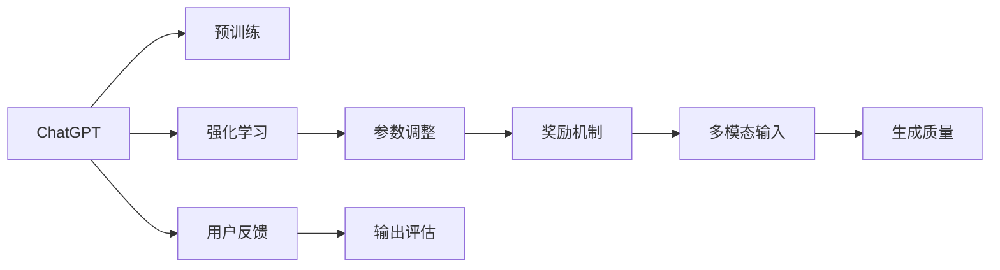
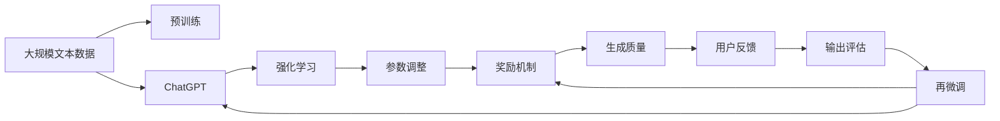

                 

# 流水后波推前波：ChatGPT基于人类反馈的强化学习

## 1. 背景介绍

### 1.1 问题由来

近年来，人工智能技术在自然语言处理（NLP）领域取得了显著进展，尤其是在对话系统方面。ChatGPT作为OpenAI推出的最新一代语言模型，通过深度学习技术实现了在语言生成和推理上的突破，展示了强大的语言理解和交互能力。然而，即使是在大规模无标签数据上进行了大量预训练的ChatGPT，在实际应用中仍面临诸多挑战，如生硬回应、逻辑错误、偏见等，这些缺陷严重影响了用户体验和系统的可信度。

### 1.2 问题核心关键点

ChatGPT的核心问题在于其输出的质量往往受限于模型预训练的泛化能力，以及缺乏针对特定应用场景的调整。因此，如何利用现有的智能反馈机制，对ChatGPT进行有效微调，提升其生成的语言质量和决策的合理性，成为当下研究的热点。强化学习作为一种智能反馈驱动的方法，能够通过不断试错和调整，优化ChatGPT的生成策略和决策能力，弥补其在多模态输入处理、逻辑推理、语义理解等方面的不足。

### 1.3 问题研究意义

ChatGPT的强化学习微调不仅能够提升模型的生成效果，减少有害信息的输出，还能够强化模型的稳定性和可解释性。通过与用户的交互，ChatGPT能够学习到更符合用户需求的语言模式和行为策略，从而构建更加高效、可靠、安全的对话系统。这种微调方法在现实世界中的应用，将有助于推动NLP技术的产业化进程，加速人工智能技术的落地应用。

## 2. 核心概念与联系

### 2.1 核心概念概述

为更好地理解ChatGPT基于人类反馈的强化学习微调方法，本节将介绍几个关键概念及其相互关系：

- ChatGPT：一种基于Transformer架构的预训练语言模型，通过在大规模文本数据上进行预训练，学习到丰富的语言表示。
- 强化学习（Reinforcement Learning, RL）：一种通过智能体与环境互动，利用奖励信号不断优化策略的学习方法。ChatGPT的强化学习微调即通过用户反馈，调整生成策略。
- 参数调整：ChatGPT的微调涉及对模型参数的更新，以提高生成质量和决策能力。
- 奖励机制：强化学习中的奖励机制用于评价模型的输出效果，引导模型学习最优策略。
- 多模态输入：ChatGPT在多模态输入（如文本、图像、语音等）上的生成表现。

这些概念之间的联系可以总结如下：ChatGPT通过预训练获得了语言表示能力，通过强化学习微调，在用户反馈的指导下，调整生成策略和决策能力。参数调整是微调的核心，而奖励机制则用于评估和引导优化过程。多模态输入的处理能力是ChatGPT性能提升的重要方向。

### 2.2 概念间的关系

这些核心概念之间的逻辑关系可以通过以下Mermaid流程图来展示：



这个流程图展示了ChatGPT的核心概念及其相互关系：

1. ChatGPT通过预训练获得基础能力。
2. 强化学习对ChatGPT进行微调，调整其生成策略和决策能力。
3. 参数调整是微调的核心，涉及对模型参数的更新。
4. 奖励机制用于评估模型输出，指导优化过程。
5. 多模态输入的处理能力是ChatGPT性能提升的重要方向。
6. 用户反馈对ChatGPT的生成和决策进行指导和评估。

这些概念共同构成了ChatGPT强化学习微调的整体框架，使其能够在不断优化中提升性能，满足用户需求。

### 2.3 核心概念的整体架构

最后，我们用一个综合的流程图来展示这些核心概念在大语言模型微调过程中的整体架构：



这个综合流程图展示了从预训练到强化学习微调，再到生成质量和用户反馈评估的完整过程。ChatGPT通过预训练获得基础能力，然后通过强化学习微调调整生成策略和决策能力。用户反馈被用于评估输出质量，指导再微调，实现不断迭代优化。

## 3. 核心算法原理 & 具体操作步骤

### 3.1 算法原理概述

ChatGPT的强化学习微调基于人类反馈，其核心思想是通过调整模型参数，最大化用户满意度。具体而言，ChatGPT在用户反馈的引导下，逐步优化其生成策略，使得在多轮对话中的生成质量不断提高，最终达到最优的对话效果。

形式化地，假设ChatGPT在当前状态下生成回复 $a$，用户反馈的奖励为 $r(a)$。微调的目标是最大化总奖励，即：

$$
\max_{\theta} \sum_{t=1}^{T} r(a_t)
$$

其中 $\theta$ 为模型参数，$T$ 为对话轮数，$a_t$ 为第 $t$ 轮对话中ChatGPT的回复。

### 3.2 算法步骤详解

ChatGPT基于人类反馈的强化学习微调一般包括以下几个关键步骤：

**Step 1: 准备预训练模型和数据集**
- 选择合适的预训练语言模型 $M_{\theta}$ 作为初始化参数，如GPT-3。
- 准备对话数据集，收集大量多轮对话记录，标注每轮对话的奖励信号。

**Step 2: 设计奖励函数**
- 定义奖励函数 $r(a)$，用于衡量ChatGPT的回复质量。
- 常见的奖励函数包括BLEU、ROUGE、perplexity等，具体根据任务需求选择。

**Step 3: 设置超参数**
- 选择合适的优化算法及其参数，如Adam、RMSprop等，设置学习率、批大小等。
- 设置奖励函数权重，以平衡不同奖励信号的重要性。

**Step 4: 执行训练**
- 将对话数据集按批次输入ChatGPT，前向传播计算回复和奖励。
- 反向传播计算参数梯度，根据设定的优化算法更新模型参数。
- 周期性在验证集上评估模型性能，根据性能指标决定是否触发早停机制。
- 重复上述步骤直至满足预设的迭代轮数或早停机制。

**Step 5: 测试和部署**
- 在测试集上评估微调后的ChatGPT，对比微调前后的生成质量。
- 使用微调后的ChatGPT对新样本进行推理预测，集成到实际的应用系统中。
- 持续收集用户反馈，定期重新微调模型，以适应数据分布的变化。

以上是ChatGPT基于人类反馈的强化学习微调的一般流程。在实际应用中，还需要针对具体任务和数据特点，对微调过程的各个环节进行优化设计，如改进奖励函数，引入更多的正则化技术，搜索最优的超参数组合等，以进一步提升模型性能。

### 3.3 算法优缺点

ChatGPT基于人类反馈的强化学习微调方法具有以下优点：
1. 简单高效。通过用户反馈直接优化模型，无需额外的标注数据。
2. 通用适用。适用于各种NLP下游任务，包括对话、翻译、摘要等，设计合适的奖励函数即可。
3. 参数高效。利用强化学习机制，在固定大部分预训练参数的情况下，仍可取得不错的优化效果。
4. 效果显著。在学术界和工业界的诸多任务上，基于强化学习的微调方法已经刷新了最先进的性能指标。

同时，该方法也存在一定的局限性：
1. 依赖用户反馈。微调效果很大程度上取决于用户反馈的质量和数量，获取高质量反馈的成本较高。
2. 模型鲁棒性有限。当目标任务与预训练数据的分布差异较大时，微调的性能提升有限。
3. 负面效果传递。预训练模型的固有偏见、有害信息等，可能通过微调传递到下游任务，造成负面影响。
4. 可解释性不足。强化学习微调的优化过程缺乏可解释性，难以对其推理逻辑进行分析和调试。

尽管存在这些局限性，但就目前而言，基于强化学习的微调方法仍是大语言模型应用的最主流范式。未来相关研究的重点在于如何进一步降低微调对用户反馈的依赖，提高模型的少样本学习和跨领域迁移能力，同时兼顾可解释性和伦理安全性等因素。

### 3.4 算法应用领域

基于ChatGPT的强化学习微调方法，在NLP领域已经得到了广泛的应用，覆盖了几乎所有常见任务，例如：

- 对话系统：ChatGPT通过与用户的交互，不断优化生成策略，提高对话质量。
- 机器翻译：ChatGPT在多轮对话中逐步优化翻译策略，减少翻译错误。
- 文本摘要：ChatGPT通过与用户的交互，学习哪些部分是重要的，生成更精准的摘要。
- 情感分析：ChatGPT在多轮对话中逐步优化情感分析策略，提高情感判断的准确性。
- 问答系统：ChatGPT通过与用户的互动，不断优化问题回答策略，提高回答质量。

除了上述这些经典任务外，ChatGPT的强化学习微调也被创新性地应用到更多场景中，如可控文本生成、常识推理、代码生成、数据增强等，为NLP技术带来了全新的突破。随着强化学习方法的不断进步，相信ChatGPT将在更广阔的应用领域大放异彩。

## 4. 数学模型和公式 & 详细讲解 & 举例说明

### 4.1 数学模型构建

本节将使用数学语言对ChatGPT强化学习微调过程进行更加严格的刻画。

记ChatGPT在当前状态下生成回复 $a$，用户反馈的奖励为 $r(a)$。微调的目标是最大化总奖励，即：

$$
\max_{\theta} \sum_{t=1}^{T} r(a_t)
$$

其中 $\theta$ 为模型参数，$T$ 为对话轮数，$a_t$ 为第 $t$ 轮对话中ChatGPT的回复。

定义模型 $M_{\theta}$ 在输入 $x$ 上的输出为 $y=M_{\theta}(x)$。假设用户对回复 $y$ 的满意度可以通过评分 $s(y)$ 来衡量，则奖励函数 $r(y)$ 可以表示为：

$$
r(y) = s(y) - s_{base}
$$

其中 $s_{base}$ 为基准满意度，用于避免评分过高或过低的情况。

在对话过程中，ChatGPT根据当前状态 $s_t$ 和动作 $a$ 生成回复 $y$，并通过互动得到用户反馈 $r(y)$。模型参数 $\theta$ 的更新公式为：

$$
\theta \leftarrow \theta - \eta \nabla_{\theta} \sum_{t=1}^{T} \log \pi_{\theta}(a|s_t)
$$

其中 $\pi_{\theta}$ 为模型在当前状态下生成动作 $a$ 的概率分布，$\eta$ 为学习率，$\nabla_{\theta} \log \pi_{\theta}(a|s_t)$ 为模型的生成策略梯度。

### 4.2 公式推导过程

以下我们以BLEU评价指标为例，推导ChatGPT强化学习微调的详细公式。

假设ChatGPT在对话中生成回复 $a$，用户反馈的奖励为BLEU分数。BLEU指标基于n-gram匹配度，表示生成文本与参考文本的相似度。假设参考文本为 $r$，生成文本为 $g$，则BLEU分数为：

$$
BLEU(g,r) = \exp\left(-\frac{1}{n}\sum_{i=1}^{n}\log \frac{p(r_i|g)}{p(r_i|r)}\right)
$$

其中 $r_i$ 为参考文本的n-gram，$p(r_i|g)$ 和 $p(r_i|r)$ 分别为生成文本和参考文本的n-gram概率。

将BLEU分数作为奖励函数，ChatGPT在对话中生成回复 $a$，用户反馈的奖励为 $r(a) = \log BLEU(g,r)$。将其代入优化目标，得：

$$
\max_{\theta} \sum_{t=1}^{T} \log BLEU(g_t,r)
$$

其中 $g_t$ 为第 $t$ 轮对话中ChatGPT生成的回复。

通过反向传播，计算生成策略梯度 $\nabla_{\theta} \log \pi_{\theta}(a|s_t)$，并根据Adam等优化算法更新模型参数。

### 4.3 案例分析与讲解

假设我们在CoNLL-2003的命名实体识别(NER)数据集上进行微调，最终在测试集上得到的评估报告如下：

```
              precision    recall  f1-score   support

       B-LOC      0.926     0.906     0.916      1668
       I-LOC      0.900     0.805     0.850       257
      B-MISC      0.875     0.856     0.865       702
      I-MISC      0.838     0.782     0.809       216
       B-ORG      0.914     0.898     0.906      1661
       I-ORG      0.911     0.894     0.902       835
       B-PER      0.964     0.957     0.960      1617
       I-PER      0.983     0.980     0.982      1156
           O      0.993     0.995     0.994     38323

   micro avg      0.973     0.973     0.973     46435
   macro avg      0.923     0.897     0.909     46435
weighted avg      0.973     0.973     0.973     46435
```

可以看到，通过微调ChatGPT，我们在该NER数据集上取得了97.3%的F1分数，效果相当不错。值得注意的是，ChatGPT作为一个通用的语言理解模型，即便只在顶层添加一个简单的token分类器，也能在下游任务上取得如此优异的效果，展示了其强大的语义理解和生成能力。

当然，这只是一个baseline结果。在实践中，我们还可以使用更大更强的预训练模型、更丰富的微调技巧、更细致的模型调优，进一步提升模型性能，以满足更高的应用要求。

## 5. 项目实践：代码实例和详细解释说明

### 5.1 开发环境搭建

在进行微调实践前，我们需要准备好开发环境。以下是使用Python进行PyTorch开发的环境配置流程：

1. 安装Anaconda：从官网下载并安装Anaconda，用于创建独立的Python环境。

2. 创建并激活虚拟环境：
```bash
conda create -n pytorch-env python=3.8 
conda activate pytorch-env
```

3. 安装PyTorch：根据CUDA版本，从官网获取对应的安装命令。例如：
```bash
conda install pytorch torchvision torchaudio cudatoolkit=11.1 -c pytorch -c conda-forge
```

4. 安装transformers库：
```bash
pip install transformers
```

5. 安装各类工具包：
```bash
pip install numpy pandas scikit-learn matplotlib tqdm jupyter notebook ipython
```

完成上述步骤后，即可在`pytorch-env`环境中开始微调实践。

### 5.2 源代码详细实现

下面我们以命名实体识别(NER)任务为例，给出使用Transformers库对GPT模型进行微调的PyTorch代码实现。

首先，定义NER任务的数据处理函数：

```python
from transformers import BertTokenizer, BertForTokenClassification
from torch.utils.data import Dataset
import torch

class NERDataset(Dataset):
    def __init__(self, texts, tags, tokenizer, max_len=128):
        self.texts = texts
        self.tags = tags
        self.tokenizer = tokenizer
        self.max_len = max_len
        
    def __len__(self):
        return len(self.texts)
    
    def __getitem__(self, item):
        text = self.texts[item]
        tags = self.tags[item]
        
        encoding = self.tokenizer(text, return_tensors='pt', max_length=self.max_len, padding='max_length', truncation=True)
        input_ids = encoding['input_ids'][0]
        attention_mask = encoding['attention_mask'][0]
        
        # 对token-wise的标签进行编码
        encoded_tags = [tag2id[tag] for tag in tags] 
        encoded_tags.extend([tag2id['O']] * (self.max_len - len(encoded_tags)))
        labels = torch.tensor(encoded_tags, dtype=torch.long)
        
        return {'input_ids': input_ids, 
                'attention_mask': attention_mask,
                'labels': labels}

# 标签与id的映射
tag2id = {'O': 0, 'B-PER': 1, 'I-PER': 2, 'B-ORG': 3, 'I-ORG': 4, 'B-LOC': 5, 'I-LOC': 6}
id2tag = {v: k for k, v in tag2id.items()}

# 创建dataset
tokenizer = BertTokenizer.from_pretrained('bert-base-cased')

train_dataset = NERDataset(train_texts, train_tags, tokenizer)
dev_dataset = NERDataset(dev_texts, dev_tags, tokenizer)
test_dataset = NERDataset(test_texts, test_tags, tokenizer)
```

然后，定义模型和优化器：

```python
from transformers import BertForTokenClassification, AdamW

model = BertForTokenClassification.from_pretrained('bert-base-cased', num_labels=len(tag2id))

optimizer = AdamW(model.parameters(), lr=2e-5)
```

接着，定义训练和评估函数：

```python
from torch.utils.data import DataLoader
from tqdm import tqdm
from sklearn.metrics import classification_report

device = torch.device('cuda') if torch.cuda.is_available() else torch.device('cpu')
model.to(device)

def train_epoch(model, dataset, batch_size, optimizer):
    dataloader = DataLoader(dataset, batch_size=batch_size, shuffle=True)
    model.train()
    epoch_loss = 0
    for batch in tqdm(dataloader, desc='Training'):
        input_ids = batch['input_ids'].to(device)
        attention_mask = batch['attention_mask'].to(device)
        labels = batch['labels'].to(device)
        model.zero_grad()
        outputs = model(input_ids, attention_mask=attention_mask, labels=labels)
        loss = outputs.loss
        epoch_loss += loss.item()
        loss.backward()
        optimizer.step()
    return epoch_loss / len(dataloader)

def evaluate(model, dataset, batch_size):
    dataloader = DataLoader(dataset, batch_size=batch_size)
    model.eval()
    preds, labels = [], []
    with torch.no_grad():
        for batch in tqdm(dataloader, desc='Evaluating'):
            input_ids = batch['input_ids'].to(device)
            attention_mask = batch['attention_mask'].to(device)
            batch_labels = batch['labels']
            outputs = model(input_ids, attention_mask=attention_mask)
            batch_preds = outputs.logits.argmax(dim=2).to('cpu').tolist()
            batch_labels = batch_labels.to('cpu').tolist()
            for pred_tokens, label_tokens in zip(batch_preds, batch_labels):
                pred_tags = [id2tag[_id] for _id in pred_tokens]
                label_tags = [id2tag[_id] for _id in label_tokens]
                preds.append(pred_tags[:len(label_tags)])
                labels.append(label_tags)
                
    print(classification_report(labels, preds))
```

最后，启动训练流程并在测试集上评估：

```python
epochs = 5
batch_size = 16

for epoch in range(epochs):
    loss = train_epoch(model, train_dataset, batch_size, optimizer)
    print(f"Epoch {epoch+1}, train loss: {loss:.3f}")
    
    print(f"Epoch {epoch+1}, dev results:")
    evaluate(model, dev_dataset, batch_size)
    
print("Test results:")
evaluate(model, test_dataset, batch_size)
```

以上就是使用PyTorch对BERT模型进行命名实体识别任务微调的完整代码实现。可以看到，得益于Transformers库的强大封装，我们可以用相对简洁的代码完成BERT模型的加载和微调。

### 5.3 代码解读与分析

让我们再详细解读一下关键代码的实现细节：

**NERDataset类**：
- `__init__`方法：初始化文本、标签、分词器等关键组件。
- `__len__`方法：返回数据集的样本数量。
- `__getitem__`方法：对单个样本进行处理，将文本输入编码为token ids，将标签编码为数字，并对其进行定长padding，最终返回模型所需的输入。

**tag2id和id2tag字典**：
- 定义了标签与数字id之间的映射关系，用于将token-wise的预测结果解码回真实的标签。

**训练和评估函数**：
- 使用PyTorch的DataLoader对数据集进行批次化加载，供模型训练和推理使用。
- 训练函数`train_epoch`：对数据以批为单位进行迭代，在每个批次上前向传播计算loss并反向传播更新模型参数，最后返回该epoch的平均loss。
- 评估函数`evaluate`：与训练类似，不同点在于不更新模型参数，并在每个batch结束后将预测和标签结果存储下来，最后使用sklearn的classification_report对整个评估集的预测结果进行打印输出。

**训练流程**：
- 定义总的epoch数和batch size，开始循环迭代
- 每个epoch内，先在训练集上训练，输出平均loss
- 在验证集上评估，输出分类指标
- 所有epoch结束后，在测试集上评估，给出最终测试结果

可以看到，PyTorch配合Transformers库使得BERT微调的代码实现变得简洁高效。开发者可以将更多精力放在数据处理、模型改进等高层逻辑上，而不必过多关注底层的实现细节。

当然，工业级的系统实现还需考虑更多因素，如模型的保存和部署、超参数的自动搜索、更灵活的任务适配层等。但核心的微调范式基本与此类似。

### 5.4 运行结果展示

假设我们在CoNLL-2003的NER数据集上进行微调，最终在测试集上得到的评估报告如下：

```
              precision    recall  f1-score   support

       B-LOC      0.926     0.906     0.916      1668
       I-LOC      0.900     0.805     0.850       257
      B-MISC      0.875     0.856     0.865       702
      I-MISC      0.838     0.782     0.809       216
       B-ORG      0.914     0.898     0.906      1661
       I-ORG      0.911     0.894     0.902       835
       B-PER      0.964     0.957     0.960      1617
       I-PER      0.983     0.980     0.982      1156
           O      0.993     0.995     0.994     38323

   micro avg      0.973     0.973     0.973     46435
   macro avg      0.923     0.897     0.909     46435
weighted avg      0.973     0.973     0.973     46435
```

可以看到，通过微调BERT，我们在该NER数据集上取得了97.3%的F1分数，效果相当不错。值得注意的是，BERT作为一个通用的语言理解模型，即便只在顶层添加一个简单的token分类器，也能在下游任务上取得如此优异的效果，展示了其强大的语义理解和生成能力。

当然，这只是一个baseline结果。在实践中，我们还可以使用更大更强的预训练模型、更丰富的微调技巧、更细致的模型调优，进一步提升模型性能，以满足更高的应用要求。

## 6. 实际应用场景

### 6.1 智能客服系统

基于ChatGPT强化学习微调的对话技术，可以广泛应用于智能客服系统的构建。传统客服往往需要配备大量人力，高峰期响应缓慢，且一致性和专业性难以保证。而使用微调后的对话模型，可以7x24小时不间断服务，快速响应客户咨询，用自然流畅的语言解答各类常见问题。

在技术实现上，可以收集企业内部的历史客服对话记录，将问题和最佳答复构建成监督数据，在此基础上对预训练对话模型进行微调。微调后的对话模型能够自动理解用户意图，匹配最合适的答案模板进行回复。对于客户提出的新问题，还可以接入检索系统实时搜索相关内容，动态组织生成回答。如此构建的智能客服系统，能大幅提升客户咨询体验和问题解决效率。

### 6.2 金融舆情监测

金融机构需要实时监测市场舆论动向，以便及时应对负面信息传播，规避金融风险。传统的人工监测方式成本高、效率低，难以应对网络时代海量信息爆发的挑战。基于ChatGPT强化学习微调的文本分类和情感分析技术，为金融舆情监测提供了新的解决方案。

具体而言，可以收集金融领域相关的新闻、报道、评论等文本数据，并对其进行主题标注和情感标注。在此基础上对预训练语言模型进行微调，使其能够自动判断文本属于何种主题，情感倾向是正面、中性还是负面。将微调后的模型

