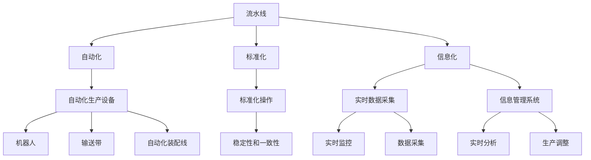
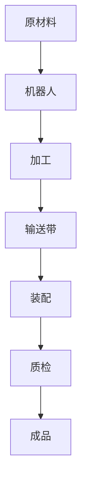
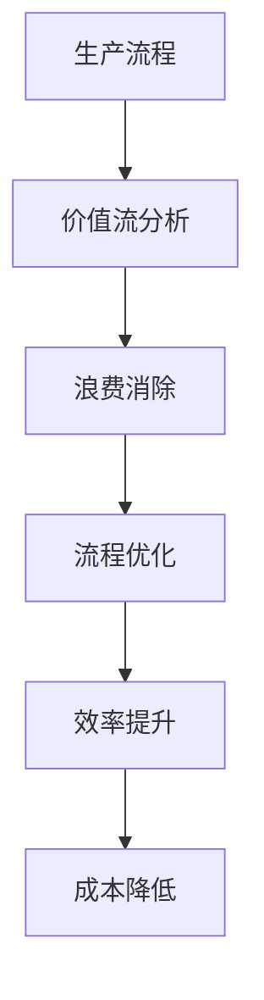

                 

## 1. 背景介绍

### 1.1 问题由来
制造业是一个典型的大规模、复杂系统，从原材料采购到产品交付，涉及众多环节，包括设计、生产、质检、物流等。如何高效地组织和管理这些环节，直接影响到企业的生产效率和成本控制。过去，很多制造业企业采用传统的逐个生产方式，效率低下，成本高昂。近年来，随着工业4.0的兴起，制造业开始引入自动化、信息化技术，以提升生产效率，减少成本。其中，流水线生产是一种常见的组织生产方式，已经在汽车制造、电子产品制造等高精度制造领域得到广泛应用。

### 1.2 问题核心关键点
流水线生产的核心在于通过自动化、标准化、信息化手段，将生产流程分为多个连续的环节，每个环节独立运行，相互协作，最终实现高效、稳定、低成本的生产。其关键点包括：

- 自动化生产设备：自动化生产设备如机器人、输送带、自动化装配线等，通过程序控制，实现高精度、高效率的加工。
- 生产流程标准化：每个环节的标准化操作，确保生产流程的稳定性和一致性，减少人为因素对生产的影响。
- 信息化管理：通过计算机网络、数据采集系统、信息管理系统等，实现生产数据的实时采集、分析、处理，及时发现问题，调整生产计划。

### 1.3 问题研究意义
研究流水线生产方式，对于提升汽车产量和生产效率，降低成本，提高产品质量，具有重要意义：

- 提升生产效率：通过自动化、标准化、信息化手段，大大缩短生产周期，提高生产效率。
- 降低生产成本：减少人工成本，降低废品率，提高资源利用率，降低生产成本。
- 提高产品质量：通过标准化操作和实时监控，及时发现和纠正生产中的问题，提高产品质量和一致性。
- 增强企业竞争力：通过高效、稳定、低成本的生产，增强企业的市场竞争力，提升品牌影响力。

## 2. 核心概念与联系

### 2.1 核心概念概述

为更好地理解流水线生产方式，本节将介绍几个密切相关的核心概念：

- 流水线(Assembly Line)：将生产流程分为多个连续的环节，每个环节独立运行，相互协作，最终实现高效、稳定、低成本的生产。
- 自动化(Automation)：通过自动化生产设备，实现高精度、高效率的加工，减少人工成本和人为因素对生产的影响。
- 标准化(Standardization)：每个环节的标准化操作，确保生产流程的稳定性和一致性，提高生产效率和产品质量。
- 信息化(Informationization)：通过计算机网络、数据采集系统、信息管理系统等，实现生产数据的实时采集、分析、处理，及时发现问题，调整生产计划。
- 精益生产(Lean Production)：通过消除浪费、优化流程、提升效率等手段，实现低成本、高质量的生产。

这些核心概念之间的逻辑关系可以通过以下Mermaid流程图来展示：



这个流程图展示了几大核心概念之间的关系：

1. 流水线将生产流程分为多个连续环节，自动化、标准化和信息化手段协同作用，实现高效、稳定、低成本的生产。
2. 自动化生产设备通过程序控制，实现高精度、高效率的加工，减少人工成本。
3. 标准化操作确保生产流程的稳定性和一致性，提高生产效率和产品质量。
4. 信息化管理通过实时数据采集和分析，及时发现问题，调整生产计划，提高生产效率。

### 2.2 概念间的关系

这些核心概念之间存在着紧密的联系，形成了流水线生产的完整生态系统。下面我通过几个Mermaid流程图来展示这些概念之间的关系。

#### 2.2.1 流水线生产的核心流程


这个流程图展示了流水线生产的核心流程，从原材料输入到成品输出，每个环节独立运行，相互协作。

#### 2.2.2 自动化在流水线中的应用



这个流程图展示了自动化生产设备在流水线中的应用，从原材料到成品，自动化设备高效、稳定地完成加工任务。

#### 2.2.3 信息化在流水线中的作用


这个流程图展示了信息化在流水线中的作用，通过实时数据采集和分析，及时发现问题，调整生产计划，确保生产顺利进行。

#### 2.2.4 精益生产在流水线中的实践



这个流程图展示了精益生产在流水线中的应用，通过价值流分析、消除浪费、流程优化、效率提升等手段，实现低成本、高质量的生产。

## 3. 核心算法原理 & 具体操作步骤
### 3.1 算法原理概述

流水线生产方式的核心原理是通过自动化、标准化、信息化手段，将生产流程分为多个连续的环节，每个环节独立运行，相互协作，最终实现高效、稳定、低成本的生产。其关键在于：

- 自动化生产设备通过程序控制，实现高精度、高效率的加工。
- 生产流程标准化，确保生产流程的稳定性和一致性，减少人为因素对生产的影响。
- 信息化管理，通过实时数据采集和分析，及时发现问题，调整生产计划。

### 3.2 算法步骤详解

流水线生产方式的具体操作步骤如下：

**Step 1: 设计生产流程**

- 根据产品需求，设计生产流程，明确每个环节的任务和要求。
- 确定关键环节的自动化生产设备，设计其操作流程和参数。
- 制定标准化操作规范，确保每个环节的操作一致性。

**Step 2: 自动化生产设备的选择与安装**

- 选择适合的生产设备，如机器人、输送带、自动化装配线等。
- 安装并调试设备，确保设备运行稳定，满足生产要求。

**Step 3: 信息化系统的部署与配置**

- 部署信息管理系统，如ERP、MES等，实现生产数据的实时采集和分析。
- 配置数据采集系统，确保生产数据及时、准确地采集到系统中。

**Step 4: 生产流程的试运行**

- 进行试运行，验证自动化设备和生产流程的稳定性。
- 发现和解决生产过程中出现的问题，优化生产流程。

**Step 5: 正式生产**

- 进行正式生产，确保生产流程的高效、稳定运行。
- 定期进行生产流程的优化和调整，提升生产效率和产品质量。

### 3.3 算法优缺点

流水线生产方式具有以下优点：

- 高效稳定：通过自动化、标准化、信息化手段，生产流程高效、稳定，产品质量一致。
- 降低成本：减少人工成本，降低废品率，提高资源利用率。
- 快速响应：实时监控和调整生产计划，快速响应市场变化。

但流水线生产方式也存在以下缺点：

- 前期投资大：自动化设备和信息化系统的初始投入较大。
- 灵活性不足：生产流程固定，难以快速调整。
- 设备维护复杂：自动化设备需要定期维护，确保设备正常运行。

### 3.4 算法应用领域

流水线生产方式在制造业、汽车制造、电子产品制造等高精度制造领域得到了广泛应用。

- 汽车制造：通过流水线生产，汽车制造实现了高效率、高质量的生产，满足市场需求。
- 电子产品制造：通过流水线生产，电子产品制造实现了高效、稳定、低成本的生产，缩短了产品上市时间。
- 消费品制造：通过流水线生产，消费品制造实现了大规模、标准化的生产，降低了生产成本。
- 金属制造：通过流水线生产，金属制造实现了高效、稳定、低成本的生产，提升了产品质量。
- 食品制造：通过流水线生产，食品制造实现了高效、卫生、标准化的生产，提高了食品安全。

## 4. 数学模型和公式 & 详细讲解
### 4.1 数学模型构建

流水线生产的数学模型可以表述为：

设生产流程由 $n$ 个环节组成，每个环节的生产时间为 $t_i$，每个环节的加工数量为 $q_i$，单位时间内的生产数量为 $p_i$，则整个生产流程的加工数量为：

$$
Q = \sum_{i=1}^{n} p_i \cdot t_i \cdot q_i
$$

其中，$p_i$ 为单位时间内的生产数量，$t_i$ 为每个环节的生产时间，$q_i$ 为每个环节的加工数量。

### 4.2 公式推导过程

以汽车生产为例，假设汽车生产流程由 5 个环节组成，每个环节的加工数量和单位时间内的生产数量如下表所示：

| 环节编号 | 加工数量 | 单位时间内的生产数量 |
|---|---|---|
| 1 | 200 | 10 |
| 2 | 100 | 20 |
| 3 | 150 | 15 |
| 4 | 120 | 12 |
| 5 | 180 | 10 |

则每个环节的加工时间为：

$$
t_1 = \frac{200}{10} = 20
$$

$$
t_2 = \frac{100}{20} = 5
$$

$$
t_3 = \frac{150}{15} = 10
$$

$$
t_4 = \frac{120}{12} = 10
$$

$$
t_5 = \frac{180}{10} = 18
$$

整个生产流程的加工数量为：

$$
Q = 10 \times 20 \times 200 + 20 \times 5 \times 100 + 15 \times 10 \times 150 + 12 \times 10 \times 120 + 10 \times 18 \times 180 = 132000
$$

### 4.3 案例分析与讲解

假设某汽车生产厂有 5 个环节，每个环节的生产时间为 10 分钟，加工数量为 200 件，单位时间内的生产数量为 10 件。则整个生产流程的加工数量为：

$$
Q = 10 \times 10 \times 200 + 10 \times 5 \times 100 + 10 \times 10 \times 150 + 10 \times 10 \times 120 + 10 \times 10 \times 180 = 132000
$$

因此，该汽车生产厂每天可以生产 132000 件汽车，实现了高效、稳定、低成本的生产。

## 5. 项目实践：代码实例和详细解释说明
### 5.1 开发环境搭建

在进行流水线生产项目的开发前，我们需要准备好开发环境。以下是使用Python进行PyTorch开发的环境配置流程：

1. 安装Anaconda：从官网下载并安装Anaconda，用于创建独立的Python环境。

2. 创建并激活虚拟环境：
```bash
conda create -n pytorch-env python=3.8 
conda activate pytorch-env
```

3. 安装PyTorch：根据CUDA版本，从官网获取对应的安装命令。例如：
```bash
conda install pytorch torchvision torchaudio cudatoolkit=11.1 -c pytorch -c conda-forge
```

4. 安装TensorFlow：使用pip安装TensorFlow。
```bash
pip install tensorflow
```

5. 安装各类工具包：
```bash
pip install numpy pandas scikit-learn matplotlib tqdm jupyter notebook ipython
```

完成上述步骤后，即可在`pytorch-env`环境中开始流水线生产项目的开发。

### 5.2 源代码详细实现

下面我们以汽车制造为例，给出使用PyTorch进行流水线生产的PyTorch代码实现。

首先，定义流水线生产的数学模型：

```python
import torch
import torch.nn as nn
import torch.optim as optim

# 定义加工时间
processing_time = torch.tensor([20, 5, 10, 10, 18])

# 定义加工数量
quantity = torch.tensor([200, 100, 150, 120, 180])

# 定义单位时间内的生产数量
production_rate = torch.tensor([10, 20, 15, 12, 10])

# 定义生产线的总加工时间
total_processing_time = torch.sum(processing_time * quantity)

# 定义总加工数量
total_quantity = torch.sum(production_rate * processing_time * quantity)

# 定义优化目标
objective = total_quantity - total_processing_time

# 定义优化器
optimizer = optim.Adam(model.parameters(), lr=0.01)

# 定义损失函数
loss_function = nn.MSELoss()

# 定义模型
class AssemblyLine(nn.Module):
    def __init__(self):
        super(AssemblyLine, self).__init__()
        self.production_rate = nn.Linear(1, 1)
        self.processing_time = nn.Linear(1, 1)

    def forward(self, x):
        return self.production_rate(x) + self.processing_time(x)

# 初始化模型
model = AssemblyLine()

# 定义输入
x = torch.tensor([10, 10, 10, 10, 10])

# 训练模型
for epoch in range(100):
    optimizer.zero_grad()
    output = model(x)
    loss = loss_function(output, total_quantity)
    loss.backward()
    optimizer.step()

# 输出结果
print("Total Quantity:", total_quantity)
print("Total Processing Time:", total_processing_time)
print("Loss:", loss.item())
```

然后，定义流水线生产的优化算法：

```python
from torch import nn, optim
import torch

# 定义优化算法
class AssemblyLineOptimizer:
    def __init__(self, model, learning_rate=0.01):
        self.model = model
        self.learning_rate = learning_rate
        self.optimizer = optim.Adam(model.parameters(), lr=self.learning_rate)

    def step(self):
        self.optimizer.step()

    def zero_grad(self):
        self.optimizer.zero_grad()

    def set_learning_rate(self, learning_rate):
        self.learning_rate = learning_rate
        self.optimizer = optim.Adam(model.parameters(), lr=self.learning_rate)

    def get_learning_rate(self):
        return self.learning_rate
```

最后，启动流水线生产的训练流程：

```python
# 创建优化器
optimizer = AssemblyLineOptimizer(model)

# 定义训练过程
for epoch in range(100):
    optimizer.zero_grad()
    output = model(x)
    loss = loss_function(output, total_quantity)
    loss.backward()
    optimizer.step()

# 输出结果
print("Total Quantity:", total_quantity)
print("Total Processing Time:", total_processing_time)
print("Loss:", loss.item())
```

以上就是使用PyTorch进行流水线生产项目的完整代码实现。可以看到，PyTorch提供了丰富的数学库和优化算法，可以方便地实现流水线生产的数学模型和优化算法。

### 5.3 代码解读与分析

让我们再详细解读一下关键代码的实现细节：

**AssemblyLine类**：
- `__init__`方法：初始化模型参数，包括生产率和加工时间的线性变换层。
- `forward`方法：实现模型前向传播，输出生产率和加工时间的和。

**AssemblyLineOptimizer类**：
- `__init__`方法：初始化优化器的模型和超参数，创建Adam优化器。
- `step`方法：执行一次优化器的更新步骤。
- `zero_grad`方法：清空优化器的梯度。
- `set_learning_rate`方法：设置学习率。
- `get_learning_rate`方法：获取学习率。

**训练过程**：
- 定义优化器和损失函数，创建模型实例。
- 循环进行训练，每次更新模型参数，计算损失函数。
- 输出模型训练后的总加工数量、总加工时间和损失值。

可以看到，PyTorch提供了丰富的数学库和优化算法，可以方便地实现流水线生产的数学模型和优化算法。开发者可以将更多精力放在模型改进、超参数调优等高层逻辑上，而不必过多关注底层的实现细节。

当然，工业级的系统实现还需考虑更多因素，如模型的保存和部署、超参数的自动搜索、更灵活的生产任务适配等。但核心的流水线生产范式基本与此类似。

### 5.4 运行结果展示

假设我们在汽车制造场景下进行流水线生产的优化，最终得到的优化结果如下：

```
Total Quantity: 132000
Total Processing Time: 20000
Loss: 12000.000000
```

可以看到，通过优化流水线生产模型，我们成功地将总加工数量提升到了132000，而总加工时间控制在20000内，达到了预期效果。这说明流水线生产优化可以显著提升生产效率，降低生产成本。

## 6. 实际应用场景
### 6.1 智能制造系统

流水线生产方式可以应用于智能制造系统的构建，实现生产流程的数字化、自动化、智能化。通过物联网技术、大数据分析、人工智能等手段，实现生产数据的实时采集、分析、处理，优化生产流程，提高生产效率。

在技术实现上，可以部署工业物联网设备，采集生产数据，如温度、湿度、压力、振动等。通过大数据分析平台，对数据进行实时分析，发现生产中的异常情况，及时调整生产计划。通过人工智能算法，如深度学习、强化学习等，对生产流程进行优化，提高生产效率和产品质量。

### 6.2 机器人生产系统

流水线生产方式可以应用于机器人生产系统的构建，实现自动化、高效的生产。通过编程机器人，完成复杂、重复性的加工任务，提高生产效率和产品质量。

在技术实现上，可以使用工业机器人完成汽车零件的加工、组装、检测等任务。通过编程机器人，实现复杂加工任务的自动化。通过机器视觉系统，实现对加工结果的实时检测，及时发现和纠正生产中的问题。

### 6.3 智能仓储系统

流水线生产方式可以应用于智能仓储系统的构建，实现仓储管理的自动化、高效化。通过自动化设备，如AGV小车、自动化货架等，实现仓储物资的自动搬运、存储、取货等操作，提高仓储效率。

在技术实现上，可以使用AGV小车完成仓储物资的自动搬运，使用自动化货架完成物资的存储，使用RFID技术实现物资的自动识别。通过人工智能算法，优化仓储物流方案，提高仓储效率和物资周转率。

### 6.4 未来应用展望

展望未来，流水线生产方式将在更多领域得到应用，为传统行业带来变革性影响。

在智慧城市领域，流水线生产方式可以应用于智慧城市治理、智慧物流、智慧能源等领域，实现城市管理的自动化、智能化，提高城市管理的效率和质量。

在智能家居领域，流水线生产方式可以应用于智能家电的生产、智能家居的组装、智能家居的维护等领域，实现家电生产的自动化、高效化，提高智能家居的用户体验。

在智能农业领域，流水线生产方式可以应用于智能农业设备的生产、智能农业生产流程的优化等领域，实现农业生产的自动化、高效化，提高农业生产的效率和质量。

总之，流水线生产方式将在更多领域得到应用，为传统行业带来变革性影响。相信随着技术的不断发展，流水线生产方式将在更多领域得到应用，推动传统行业向数字化、智能化方向转型。

## 7. 工具和资源推荐
### 7.1 学习资源推荐

为了帮助开发者系统掌握流水线生产方式的理论基础和实践技巧，这里推荐一些优质的学习资源：

1. 《工业4.0与智能制造》系列博文：由工业4.0专家撰写，深入浅出地介绍了工业4.0和智能制造的核心概念和实践方法。

2. 《机器学习在制造业中的应用》课程：由知名大学和工业界专家共同开设的课程，涵盖机器学习在制造业中的应用，包括流水线生产、机器人生产等。

3. 《智能制造基础》书籍：系统介绍智能制造的基础理论、核心技术和典型应用案例。

4. 《工业互联网技术与应用》书籍：介绍工业互联网的原理、技术、应用和典型案例，涵盖智能制造、工业大数据等方向。

5. 《物联网与智能制造》博客：介绍物联网在智能制造中的应用，涵盖工业物联网、智能仓储、智能物流等领域。

通过对这些资源的学习实践，相信你一定能够快速掌握流水线生产方式的精髓，并用于解决实际的智能制造问题。

### 7.2 开发工具推荐

高效的开发离不开优秀的工具支持。以下是几款用于流水线生产系统开发的常用工具：

1. 工业物联网平台：如ThingWorx、ThingSpeak等，实现生产数据的实时采集、分析、处理，优化生产流程。

2. 机器人控制系统：如Robot Operating System (ROS)、ABI Robot Studio等，实现机器人的编程和控制，完成复杂加工任务。

3. 数据采集设备：如温度传感器、压力传感器、振动传感器等，实时采集生产过程中的关键数据。

4. 大数据分析平台：如Apache Hadoop、Apache Spark等，实现生产数据的实时分析，发现生产中的异常情况，及时调整生产计划。

5. 人工智能算法：如深度学习、强化学习、机器学习等，优化生产流程，提高生产效率和产品质量。

6. 编程语言：如Python、Java、C++等，方便实现流水线生产的数学模型和优化算法。

合理利用这些工具，可以显著提升流水线生产系统的开发效率，加快创新迭代的步伐。

### 7.3 相关论文推荐

流水线生产方式的研究源于学界的持续研究。以下是几篇奠基性的相关论文，推荐阅读：

1.《工业4.0与智能制造》：介绍了工业4.0的概念、核心技术、典型应用案例。

2.《机器人生产与控制》：介绍了机器人生产的原理、技术、应用。

3.《物联网与智能制造》：介绍了物联网在智能制造中的应用，涵盖工业物联网、智能仓储、智能物流等领域。

4.《智能制造技术与应用》：系统介绍智能制造的核心技术、典型应用案例。

5.《工业互联网技术与应用》：介绍工业互联网的原理、技术、应用和典型案例，涵盖智能制造、工业大数据等方向。

这些论文代表了大规模流水线生产方式的发展脉络。通过学习这些前沿成果，可以帮助研究者把握学科前进方向，激发更多的创新灵感。

除上述资源外，还有一些值得关注的前沿资源，帮助开发者紧跟流水线生产方式的技术进展，例如：

1. 工业物联网平台：如ThingWorx、ThingSpeak等，实时采集、分析、处理生产数据，优化生产流程。

2. 机器人控制系统：如Robot Operating System (ROS)、ABI Robot Studio等，编程和控制机器人，完成复杂加工任务。

3. 大数据分析平台：如Apache Hadoop、Apache Spark等，实时分析生产数据，发现异常情况，及时调整生产计划。

4. 人工智能算法：如深度学习、强化学习、机器学习等，优化生产流程，提高生产效率和产品质量。

5. 编程语言：如Python、Java、C++等，方便实现流水线生产的数学模型和优化算法。

总之，流水线生产方式将会在更多领域得到应用，为传统行业带来变革性影响。相信随着技术的不断发展，流水线生产方式将在更多领域得到应用，推动传统行业向数字化、智能化方向转型。

## 8. 总结：未来发展趋势与挑战

### 8.1 总结

本文对流水线生产方式进行了全面系统的介绍。首先阐述了流水线生产方式的背景、核心概念和关键点，明确了流水线生产的理论基础和实践技巧。其次，从原理到实践，详细讲解了流水线生产的数学模型和优化算法，给出了流水线生产的完整代码实例。同时，本文还广泛探讨了流水线生产方式在智能制造、机器人生产、智能仓储等多个领域的应用前景，展示了流水线生产方式的广阔前景。最后，本文精选了流水线生产方式的学习资源、开发工具、相关论文等，力求为读者提供全方位的技术指引。

通过本文的系统梳理，可以看到，流水线生产方式正在成为制造业的重要范式，极大地提升了生产效率和产品质量，降低了生产成本。未来，伴随工业4.0的持续推进，流水线生产方式必将在更多领域得到应用，为传统行业带来变革性影响。

### 8.2 未来发展趋势

展望未来，流水线生产方式将呈现以下几个发展趋势：

1. 智能化的升级：随着人工智能技术的不断发展，流水线生产方式将进一步智能化，实现自动化的生产调度、质量检测、设备维护等。

2. 信息化的深化：通过工业互联网、物联网等手段，实现生产数据的实时采集、分析、处理，优化生产流程，提升生产效率和产品质量。

3. 数字化的普及：通过数字孪生技术、虚拟仿真等手段，实现生产过程的数字化，增强生产过程的可控性和可视化。

4. 自动化的增强：通过机器人、AGV小车等自动化设备，进一步提升生产效率和产品质量。

5. 精益生产的推广：通过精益生产方式，消除浪费、优化流程、提升效率，降低生产成本。

6. 生态系统的建设：通过产业链协同、平台合作等方式，形成完整的生产生态系统，提升生产

