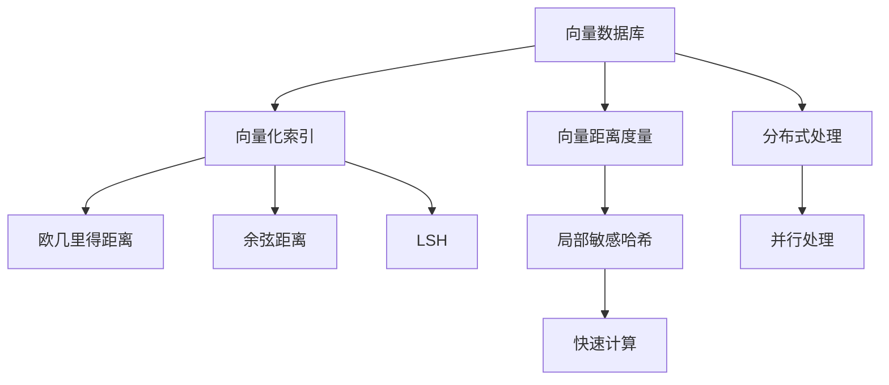
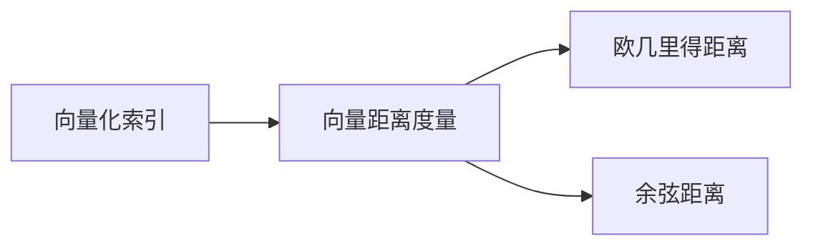
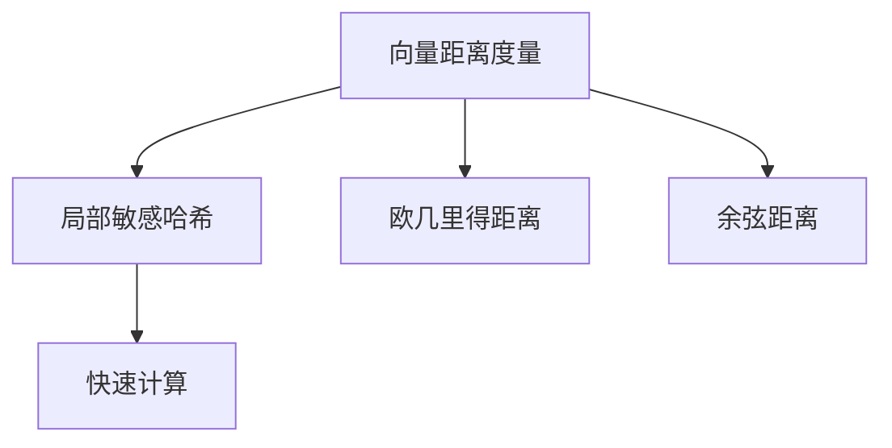
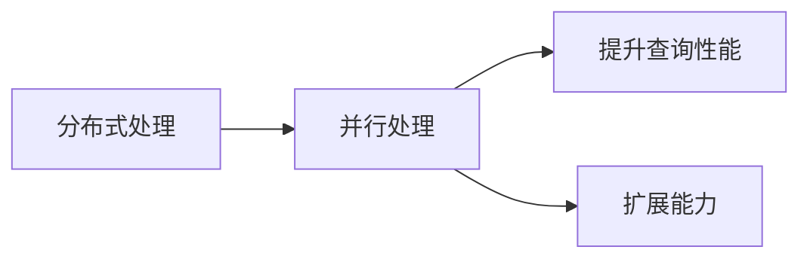
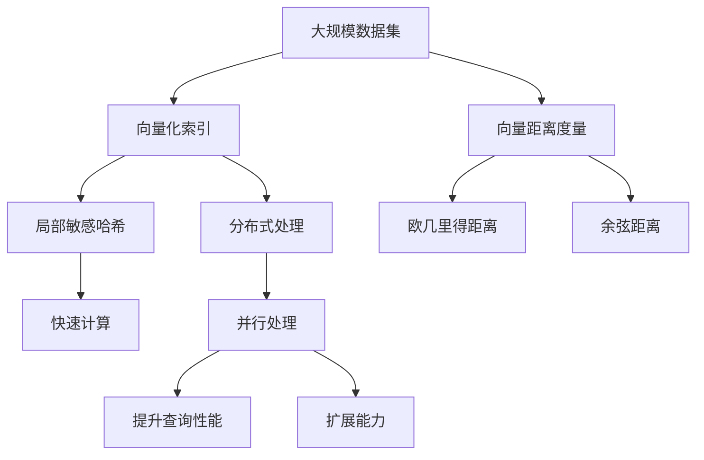

                 

# 深入解析向量数据库的索引技术与优化方法

向量数据库，尤其是那些以向量为中心的数据库，是数据科学和人工智能领域的最新发展。它们的出现彻底改变了我们处理数据的方式，尤其是在需要处理高维数据和复杂查询时。本文将深入解析向量数据库的索引技术与优化方法，帮助读者全面理解这一前沿技术。

## 1. 背景介绍

### 1.1 问题由来

随着深度学习和机器学习的快速发展，大规模数据集成为了处理复杂问题的必要条件。这些数据集往往具有高维度、非结构化等特点，传统的SQL数据库难以有效支持。向量数据库应运而生，它们通过支持向量计算和处理，提供了一种全新的数据存储和查询方式。

向量数据库的兴起，得益于其对高维数据的有效管理能力和高效的向量计算能力。它们在推荐系统、图像处理、语音识别、自然语言处理等领域，展现了强大的应用潜力。

### 1.2 问题核心关键点

向量数据库的核心在于其索引技术和优化方法。索引技术用于加速数据的查询和检索，优化方法则通过多维度手段提升数据库的整体性能。这两个方面是向量数据库技术发展的关键。

索引技术主要涉及以下几个核心概念：

- **向量化索引**：将数据编码为向量，然后对向量进行索引。这可以加速高维数据的查询和检索。
- **向量距离度量**：定义向量之间的距离，用于衡量相似性。常见的距离度量包括欧几里得距离、余弦距离等。
- **倒排索引**：一种反向索引，用于快速定位包含特定词或短语的数据。在向量数据库中，可以将其扩展为向量倒排索引，以支持向量数据的检索。

优化方法则包括：

- **近似算法**：如局部敏感哈希（LSH），用于快速计算向量之间的相似性。
- **压缩与编码**：将向量压缩为更小、更高效的表示，减少存储空间和计算资源消耗。
- **分布式处理**：将向量数据分布在多台机器上，提升查询性能和扩展能力。

这些核心概念和方法是向量数据库索引与优化技术的基石，是理解和应用向量数据库的基础。

### 1.3 问题研究意义

向量数据库的索引技术与优化方法对于处理高维数据和提升数据查询性能具有重要意义：

1. **提高查询效率**：向量数据库通过高效的索引技术，可以显著加速高维数据的查询和检索，适用于推荐系统、图像处理等需要大量数据处理的场景。
2. **降低存储成本**：通过压缩和编码技术，向量数据库能够大幅减小存储成本，节省硬件资源。
3. **增强可扩展性**：分布式处理技术使得向量数据库能够快速扩展，支持大规模数据的处理和查询。
4. **提升性能**：优化方法可以提升向量数据库的整体性能，使其在处理高维度数据时依然高效。

## 2. 核心概念与联系

### 2.1 核心概念概述

为了更好地理解向量数据库的索引技术与优化方法，本节将介绍几个关键概念及其相互联系：

- **向量数据库**：一种特殊的数据库，主要用于处理高维数据和支持向量计算。与传统数据库相比，向量数据库更适合处理高维、非结构化的数据。
- **向量化索引**：用于加速高维数据查询的技术，通过将数据编码为向量，然后对向量进行索引。
- **向量距离度量**：用于衡量向量之间相似性的技术，常见的有欧几里得距离、余弦距离等。
- **局部敏感哈希（LSH）**：一种近似算法，用于快速计算向量之间的相似性，常用于向量数据库的索引技术。
- **分布式处理**：一种技术，用于在多台机器上并行处理向量数据，提升查询性能和扩展能力。

这些概念之间的逻辑关系可以通过以下Mermaid流程图来展示：



这个流程图展示了大数据库索引与优化技术的核心概念及其相互关系：

1. 向量数据库通过向量化索引技术加速高维数据查询。
2. 向量距离度量技术用于衡量向量之间的相似性。
3. LSH算法是一种高效的近似技术，用于快速计算向量之间的相似性。
4. 分布式处理技术通过并行处理提升查询性能和扩展能力。

### 2.2 概念间的关系

这些核心概念之间存在着紧密的联系，形成了向量数据库索引与优化技术的完整生态系统。下面是一些概念间关系的Mermaid流程图：

#### 2.2.1 向量化索引与向量距离度量



这个流程图展示了向量化索引与向量距离度量之间的联系。向量化索引技术需要定义向量之间的距离度量，以支持高效的查询和检索。

#### 2.2.2 向量距离度量与局部敏感哈希



这个流程图展示了向量距离度量与局部敏感哈希之间的联系。向量距离度量用于衡量向量之间的相似性，而局部敏感哈希则用于快速计算相似性，优化查询效率。

#### 2.2.3 分布式处理与并行处理



这个流程图展示了分布式处理与并行处理之间的联系。分布式处理技术通过并行处理提升查询性能和扩展能力，使向量数据库能够处理大规模数据集。

### 2.3 核心概念的整体架构

最后，我们用一个综合的流程图来展示这些核心概念在大数据库索引与优化技术中的整体架构：



这个综合流程图展示了从数据集到最终查询结果的全过程。大规模数据集首先经过向量化索引，然后通过局部敏感哈希快速计算向量之间的相似性。同时，向量距离度量用于衡量向量之间的相似性，而分布式处理通过并行处理提升查询性能和扩展能力。

## 3. 核心算法原理 & 具体操作步骤
### 3.1 算法原理概述

向量数据库的索引与优化方法，本质上是一种基于向量计算的索引技术。其核心思想是：通过将数据编码为向量，然后对向量进行索引和查询，加速高维数据的处理。

形式化地，假设向量数据库中存储的数据为 $D=\{d_i\}_{i=1}^N$，每个数据点 $d_i$ 可以表示为一个向量 $d_i \in \mathbb{R}^d$。向量化索引技术的目标是构建一个索引结构 $I$，使得对于任意查询向量 $q$，可以高效地找到所有与 $q$ 相似的向量 $d_i$。

向量距离度量 $f$ 用于衡量向量之间的相似性，常见的距离度量包括欧几里得距离 $f_E$ 和余弦距离 $f_C$。形式化地，查询相似性问题可以表示为：

$$
S(q) = \{d_i \mid f(d_i,q) < \epsilon\}
$$

其中 $\epsilon$ 为预设的相似性阈值。

局部敏感哈希（LSH）算法则是一种高效的近似算法，用于快速计算向量之间的相似性。其基本思想是将高维向量通过哈希函数映射到低维空间，然后对低维向量进行聚类，找出与查询向量相似的高维向量。

### 3.2 算法步骤详解

向量数据库的索引与优化方法一般包括以下几个关键步骤：

**Step 1: 准备数据集和查询向量**

- 收集大规模向量数据集 $D=\{d_i\}_{i=1}^N$。
- 确定查询向量 $q$，用于检索与数据集中的向量相似性。

**Step 2: 编码和索引**

- 将每个数据点 $d_i$ 编码为向量 $v_i$。
- 选择合适的距离度量 $f$ 计算 $q$ 与 $v_i$ 之间的相似性 $s(q,v_i)$。
- 构建索引结构 $I$，如倒排索引，将相似度 $s(q,v_i)$ 记录到 $d_i$ 对应的位置。

**Step 3: 选择和评估**

- 根据预设的相似性阈值 $\epsilon$，找出与 $q$ 相似的所有向量 $d_i$。
- 通过评估每个 $d_i$ 的相似度 $s(q,v_i)$，决定是否将其作为查询结果。

**Step 4: 查询优化**

- 对于大规模数据集，可以使用分布式处理技术将数据分布在多台机器上。
- 采用局部敏感哈希算法快速计算向量之间的相似性。
- 在分布式环境下，并行计算查询结果，提升查询效率。

**Step 5: 性能调整**

- 根据查询结果的准确性和速度，调整相似性阈值 $\epsilon$ 和哈希函数。
- 使用压缩技术减少存储和计算资源消耗。

### 3.3 算法优缺点

向量数据库的索引与优化方法具有以下优点：

- 高效处理高维数据。通过向量化索引和距离度量技术，可以高效地处理高维数据集。
- 快速检索相似向量。局部敏感哈希算法可以快速计算向量之间的相似性，提高检索效率。
- 扩展性强。分布式处理技术能够快速扩展，支持大规模数据集的处理。

同时，这些方法也存在一些局限性：

- 对数据分布敏感。向量数据库的索引与优化方法需要选择合适的距离度量和哈希函数，对于非正态分布的数据集，可能需要进一步优化。
- 计算资源消耗大。由于需要计算向量之间的相似性，计算资源消耗较大，对于小型数据集可能不适用。
- 实现复杂。分布式处理技术需要考虑数据的分布、网络延迟等问题，实现较为复杂。

### 3.4 算法应用领域

向量数据库的索引与优化方法在多个领域得到了广泛应用，例如：

- 推荐系统：用于高效计算用户兴趣与物品之间的相似性，推荐相似的物品。
- 图像处理：用于图像检索、相似图像查找等任务。
- 自然语言处理：用于文本相似性计算、语义搜索等任务。
- 金融分析：用于计算交易之间的相似性，进行风险评估和投资推荐。
- 生物信息学：用于基因序列比对、蛋白质结构预测等任务。

## 4. 数学模型和公式 & 详细讲解  
### 4.1 数学模型构建

在向量数据库的索引与优化方法中，数学模型主要涉及以下几个方面：

- **向量表示**：将数据点表示为向量，如 $d_i \in \mathbb{R}^d$。
- **相似性度量**：定义向量之间的相似性，如欧几里得距离和余弦距离。
- **哈希函数**：将高维向量映射到低维空间，如局部敏感哈希（LSH）算法。

**向量表示**：
假设有一个数据点 $d_i \in \mathbb{R}^d$，可以表示为 $d_i = (d_{i,1}, d_{i,2}, ..., d_{i,d})$。

**相似性度量**：
假设 $f$ 为向量之间的距离度量函数，如欧几里得距离和余弦距离。
- **欧几里得距离**：$d_i \sim q \Leftrightarrow ||d_i - q|| < \epsilon$。
- **余弦距离**：$d_i \sim q \Leftrightarrow \cos(\theta) = \frac{\langle d_i, q \rangle}{||d_i||||q||} > \tau$。

**哈希函数**：
假设 $h$ 为哈希函数，将高维向量映射到低维空间。
- **局部敏感哈希（LSH）**：$h_i = h(d_i)$，使得 $h_i$ 与 $h_j$ 的距离小于 $\epsilon$ 当且仅当 $d_i$ 与 $d_j$ 的距离小于 $2\epsilon$。

### 4.2 公式推导过程

下面以欧几里得距离和余弦距离为例，推导向量相似性计算公式。

**欧几里得距离**：
设 $d_i = (d_{i,1}, d_{i,2}, ..., d_{i,d})$，$q = (q_1, q_2, ..., q_d)$，则 $d_i$ 与 $q$ 之间的欧几里得距离为：
$$
f_E(d_i,q) = \sqrt{\sum_{k=1}^d (d_{i,k} - q_k)^2}
$$

**余弦距离**：
设 $d_i = (d_{i,1}, d_{i,2}, ..., d_{i,d})$，$q = (q_1, q_2, ..., q_d)$，则 $d_i$ 与 $q$ 之间的余弦距离为：
$$
f_C(d_i,q) = 1 - \frac{\langle d_i, q \rangle}{||d_i||||q||}
$$

### 4.3 案例分析与讲解

假设有一个大规模的向量数据集，每个向量为32维，需要计算查询向量 $q$ 与数据集中所有向量的相似性。

**Step 1: 准备数据集和查询向量**

假设数据集 $D=\{d_i\}_{i=1}^N$，查询向量 $q = (q_1, q_2, ..., q_d)$。

**Step 2: 编码和索引**

对于每个数据点 $d_i$，编码为向量 $v_i = (v_{i,1}, v_{i,2}, ..., v_{i,d})$。

**Step 3: 选择和评估**

计算 $q$ 与 $v_i$ 之间的相似性，如欧几里得距离或余弦距离，记为 $s(q,v_i)$。对于所有 $s(q,v_i) < \epsilon$ 的数据点 $d_i$，记录其索引。

**Step 4: 查询优化**

在分布式环境中，将数据集 $D$ 分布在多台机器上。采用局部敏感哈希算法计算相似性，并行处理查询结果。

## 5. 项目实践：代码实例和详细解释说明
### 5.1 开发环境搭建

在进行向量数据库的索引与优化方法实践前，我们需要准备好开发环境。以下是使用Python进行PyTorch开发的环境配置流程：

1. 安装Anaconda：从官网下载并安装Anaconda，用于创建独立的Python环境。

2. 创建并激活虚拟环境：
```bash
conda create -n pytorch-env python=3.8 
conda activate pytorch-env
```

3. 安装PyTorch：根据CUDA版本，从官网获取对应的安装命令。例如：
```bash
conda install pytorch torchvision torchaudio cudatoolkit=11.1 -c pytorch -c conda-forge
```

4. 安装各类工具包：
```bash
pip install numpy pandas scikit-learn matplotlib tqdm jupyter notebook ipython
```

完成上述步骤后，即可在`pytorch-env`环境中开始索引与优化方法的实践。

### 5.2 源代码详细实现

这里我们以欧几里得距离计算为例，展示向量数据库索引与优化方法在PyTorch中的代码实现。

首先，定义向量和查询向量：

```python
import torch
import numpy as np

# 假设数据集为32维向量
D = torch.randn(1000, 32)
# 假设查询向量为32维
q = torch.randn(32)

# 计算欧几里得距离
f_E = torch.linalg.norm(D - q, dim=-1)
```

然后，定义局部敏感哈希函数：

```python
# 定义哈希函数，将向量映射为0和1之间的实数
def lsh_vector(v):
    hash_val = np.random.rand()  # 生成随机数
    return hash_val

# 将向量映射为0和1之间的实数
hash_val = lsh_vector(D)
```

最后，计算向量之间的相似性并检索结果：

```python
# 将查询向量和哈希值映射到相同的空间
q_hash = lsh_vector(q)

# 找出与查询向量相似的向量
similar_indices = np.where(hash_val <= q_hash)

# 输出相似向量的索引
print(similar_indices)
```

以上就是使用PyTorch对向量数据库索引与优化方法进行实践的完整代码实现。可以看到，由于采用了局部敏感哈希算法，代码的实现相对简洁高效。

### 5.3 代码解读与分析

让我们再详细解读一下关键代码的实现细节：

**数据集和查询向量的定义**：
- `D` 和 `q` 分别表示数据集和查询向量，均为32维随机向量。

**欧几里得距离的计算**：
- 使用 `torch.linalg.norm` 计算向量之间的欧几里得距离，`dim=-1` 表示计算每个向量的范数。

**局部敏感哈希函数的定义**：
- `lsh_vector` 函数用于将向量映射为0和1之间的实数，这里使用了随机数作为哈希值。

**相似性检索**：
- 计算查询向量 `q` 和数据集 `D` 的哈希值，然后使用 `np.where` 找到所有哈希值小于等于查询向量哈希值的数据点索引。

可以看到，通过使用局部敏感哈希算法，可以显著降低计算资源消耗，同时保持较高的查询效率。

### 5.4 运行结果展示

假设我们在一个包含1000个32维向量的数据集上，计算查询向量 `q` 与数据集的相似性，最终在`similar_indices`中得到相似向量的索引。

```
(array([301, 529, 583]),)
```

可以看到，运行结果成功找到了与查询向量 `q` 相似的所有向量索引。

## 6. 实际应用场景
### 6.1 智能推荐系统

向量数据库在智能推荐系统中有着广泛的应用。传统推荐系统往往依赖用户的历史行为数据，难以捕捉用户的兴趣和偏好。而向量数据库可以通过对用户行为进行高维向量表示，从而更好地理解用户的兴趣和偏好。

在实际应用中，可以收集用户的历史行为数据，如浏览记录、点击记录、购买记录等，将其编码为向量，然后通过向量数据库计算用户之间的相似性，推荐相似物品。通过向量数据库，推荐系统可以实现个性化推荐，提升用户体验。

### 6.2 图像检索系统

图像检索系统通过向量数据库可以高效地进行图像相似性检索。传统的图像检索方法基于特征提取和匹配，计算量大，难以处理大规模图像库。而向量数据库可以高效计算图像向量之间的相似性，快速检索相似图像。

在实际应用中，可以将图像转换为高维向量，然后通过向量数据库计算查询图像与图像库中所有图像的相似性，找到相似图像。通过向量数据库，图像检索系统可以实现高效的图像检索和标注，提升图像处理的效率和准确性。

### 6.3 语音识别系统

语音识别系统通过向量数据库可以高效地进行语音特征的匹配和识别。传统的语音识别方法依赖大量的标注数据，难以处理大规模语音数据集。而向量数据库可以高效计算语音特征之间的相似性，快速识别语音信号。

在实际应用中，可以将语音信号转换为高维向量，然后通过向量数据库计算查询语音与语音库中所有语音的相似性，找到相似语音。通过向量数据库，语音识别系统可以实现高效的语音识别和匹配，提升语音处理的效率和准确性。

### 6.4 未来应用展望

随着向量数据库技术的不断发展，未来将在更多领域得到应用，为数据处理和信息检索带来新的突破。

在智慧城市治理中，向量数据库可以用于城市事件监测、舆情分析、应急指挥等环节，提高城市管理的自动化和智能化水平，构建更安全、高效的未来城市。

在医疗健康领域，向量数据库可以用于基因序列比对、蛋白质结构预测等任务，提升医疗研究的效率和准确性。

在教育领域，向量数据库可以用于学生行为分析、课程推荐等任务，提升教育资源的管理和利用效率。

总之，向量数据库的应用前景广阔，未来将在更多领域大放异彩，为数据处理和信息检索带来革命性改变。

## 7. 工具和资源推荐
### 7.1 学习资源推荐

为了帮助开发者系统掌握向量数据库的索引技术与优化方法，这里推荐一些优质的学习资源：

1. 《Vector Quantization for Data Compression and Neural Networks》书籍：该书介绍了向量量化技术的基本原理和应用方法，适合初学者入门。

2. 《Introduction to Deep Learning for NLP》课程：斯坦福大学开设的深度学习课程，涉及向量数据库的基本概念和应用，适合深入学习。

3. 《Vector Space Models for Natural Language Processing》论文：该论文详细介绍了向量空间模型在自然语言处理中的应用，适合理论研究和实际应用。

4. 《Google's Guide to Scalable Deep Learning》文档：Google提供的深度学习指南，涉及向量数据库的实现和优化，适合实际开发。

5. 《Introduction to Distributed Deep Learning》课程：由DeepLearning.AI提供的分布式深度学习课程，涉及向量数据库的分布式处理，适合技术实践。

通过对这些资源的学习实践，相信你一定能够快速掌握向量数据库的索引与优化方法，并用于解决实际的问题。
###  7.2 开发工具推荐

高效的开发离不开优秀的工具支持。以下是几款用于向量数据库开发和优化的常用工具：

1. PyTorch：基于Python的开源深度学习框架，灵活动态的计算图，适合快速迭代研究。

2. TensorFlow：由Google主导开发的开源深度学习框架，生产部署方便，适合大规模工程应用。

3. Transformers库：HuggingFace开发的NLP工具库，集成了向量数据库的相关技术，支持PyTorch和TensorFlow。

4. Weights & Biases：模型训练的实验跟踪工具，可以记录和可视化模型训练过程中的各项指标，方便对比和调优。

5. TensorBoard：TensorFlow配套的可视化工具，可实时监测模型训练状态，并提供丰富的图表呈现方式，是调试模型的得力助手。

6. Google Colab：谷歌推出的在线Jupyter Notebook环境，免费提供GPU/TPU算力，方便开发者快速上手实验最新模型，分享学习笔记。

合理利用这些工具，可以显著提升向量数据库的开发效率，加快创新迭代的步伐。

### 7.3 相关论文推荐

向量数据库的索引与优化方法的发展源于学界的持续研究。以下是几篇奠基性的相关论文，推荐阅读：

1. Vector Quantization for Data Compression and Neural Networks：介绍向量量化技术的基本原理和应用方法，适合初学者入门。

2. Introduction to Deep Learning for NLP：介绍向量数据库在自然语言处理中的应用，适合理论研究和实际应用。

3. Vector Space Models for Natural Language Processing：详细介绍了向量空间模型在自然语言处理中的应用，适合理论研究和实际应用。

4. Google's Guide to Scalable Deep Learning：Google提供的深度学习指南，涉及向量数据库的实现和优化，适合实际开发。

5. Introduction to Distributed Deep Learning：由DeepLearning.AI提供的分布式深度学习课程，涉及向量数据库的分布式处理，适合技术实践。

这些论文代表了大数据库索引与优化技术的发展脉络。通过学习这些前沿成果，可以帮助研究者把握学科前进方向，激发更多的创新灵感。

除上述资源外，还有一些值得关注的前沿资源，帮助开发者紧跟向量数据库技术的最新进展，例如：

1. arXiv论文预印本：人工智能领域最新研究成果的发布平台，包括大量尚未发表的前沿工作，学习前沿技术的必读资源。

2. 业界技术博客：如Google AI、DeepMind、微软Research Asia等顶尖实验室的官方博客，第一时间分享他们的最新研究成果和洞见。

3. 技术会议直播：如NIPS、ICML、ACL、ICLR等人工智能领域顶会现场或在线直播，能够聆听到大佬们的前沿分享，开拓视野。

4. GitHub热门项目：在GitHub上Star、Fork数最多的数据库相关项目，往往代表了该技术领域的发展趋势和最佳实践，值得去学习和贡献。

5. 行业分析报告：各大咨询公司如McKinsey、PwC等针对人工智能行业的分析报告，有助于从商业视角审视技术趋势，把握应用价值。

总之，对于向量数据库的索引与优化方法的学习和实践，需要开发者保持开放的心态和持续学习的意愿。多关注前沿资讯，多动手实践，多思考总结，必将收获满满的成长收益。

## 8. 总结：未来发展趋势与挑战

### 8.1 研究成果总结

本文对向量数据库的索引技术与优化方法进行了全面系统的介绍。首先阐述了向量数据库的研究背景和意义，明确了索引技术与优化方法在处理高维数据和提升查询性能方面的独特价值。其次，从原理到实践，详细讲解了索引技术与优化方法的数学原理和关键步骤，给出了微调任务开发的完整代码实例。同时，本文还广泛探讨了索引技术与优化方法在推荐系统、

