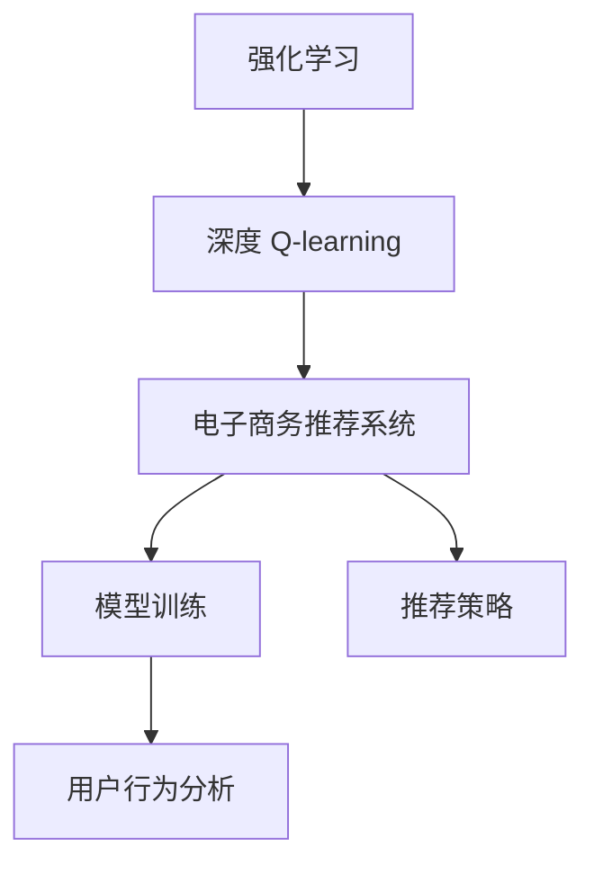
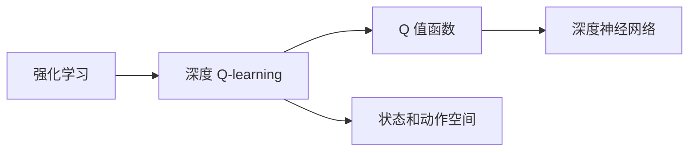
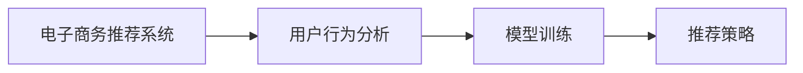
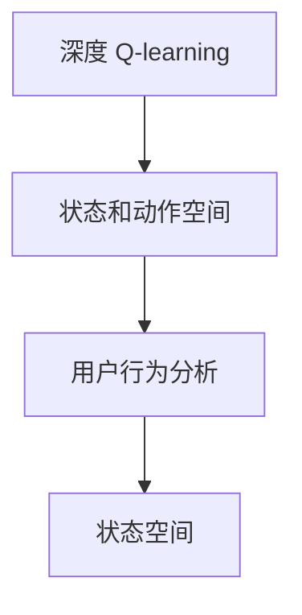

                 

# 深度 Q-learning：在电子商务推荐系统中的应用

> 关键词：深度 Q-learning, 电子商务推荐系统, 强化学习, 模型训练, 用户行为分析, 推荐算法, 策略优化, 效果评估

## 1. 背景介绍

### 1.1 问题由来
随着电子商务平台的快速发展，个性化推荐系统已成为提升用户体验和商家收入的关键。通过推荐系统，用户能够更快地找到感兴趣的商品，商家则能够提高转化率和销售额。然而，构建一个高效、个性化的推荐系统并不容易。传统的推荐算法如协同过滤、基于内容的推荐等，存在冷启动问题、数据稀疏性问题，难以有效应对多样化的用户需求和海量数据。

强化学习(Reinforcement Learning, RL)提供了一种新范式，通过模拟用户与系统的交互行为，优化推荐策略，最大化长期回报。其中，深度 Q-learning 是一种应用广泛的强化学习算法，特别适合在复杂、高维的推荐环境中进行模型训练。

### 1.2 问题核心关键点
深度 Q-learning 的核心在于通过模拟用户和物品之间的交互，构建用户行为模型，并利用深度神经网络来逼近 Q 值函数。在电子商务推荐系统中，具体流程包括：

1. 定义状态：将用户的浏览、点击、购买等行为记录，作为推荐系统的状态。
2. 定义动作：将推荐系统对用户进行的操作（如展示商品、推荐商品）视为动作。
3. 定义奖励：将用户的点击率、购买率等行为转化为推荐系统的奖励信号。
4. 模型训练：使用深度 Q-learning 算法，通过不断迭代更新模型参数，使得模型能够预测在特定状态下，采取特定动作的长期奖励。
5. 推荐决策：在实际推荐时，利用训练好的模型，根据用户当前的状态和历史行为，选择最有可能带来高回报的动作。

通过深度 Q-learning，推荐系统能够动态适应用户行为变化，实现个性化推荐。但在实践中，模型的训练和部署仍面临诸多挑战，如状态空间的维度爆炸、模型收敛速度慢、回报函数设计不合理等问题。

### 1.3 问题研究意义
深度 Q-learning 在电子商务推荐系统中的应用，能够显著提升推荐精度和个性化程度。通过强化学习，推荐系统能够不断从用户反馈中学习，优化推荐策略，减少用户流失，提高转化率。同时，深度 Q-learning 还能应对冷启动问题，对于新用户和新商品，也能给出合理的推荐。

此外，深度 Q-learning 还能够实时调整推荐策略，针对用户的历史行为和实时互动，灵活调整推荐内容和形式，进一步提升用户体验和满意度。因此，深度 Q-learning 在推荐系统的研究和应用中具有重要的理论和实践价值。

## 2. 核心概念与联系

### 2.1 核心概念概述

为了更好地理解深度 Q-learning 在电子商务推荐系统中的应用，本节将介绍几个密切相关的核心概念：

- 强化学习(Reinforcement Learning, RL)：一种基于环境与行为互动的机器学习框架，通过最大化长期回报来学习最优策略。
- 深度 Q-learning：一种结合深度神经网络和强化学习理论的算法，通过优化 Q 值函数来逼近最优策略。
- Q 值函数：定义在状态和动作上的函数，表示在特定状态下，采取特定动作的期望回报。
- 电子商务推荐系统：利用用户行为数据和商品特征信息，推荐用户可能感兴趣的商品的系统。
- 模型训练：通过数据驱动的方法，不断迭代更新模型参数，使得模型能够准确预测用户的推荐行为。
- 推荐策略：根据用户状态和历史行为，选择最优推荐动作的决策规则。
- 用户行为分析：通过分析用户的浏览、点击、购买等行为，构建用户行为模型。

这些核心概念之间的逻辑关系可以通过以下Mermaid流程图来展示：



这个流程图展示了深度 Q-learning 在电子商务推荐系统中的应用流程：

1. 强化学习提供框架，指导模型训练和策略优化。
2. 深度 Q-learning 作为具体算法，用于逼近 Q 值函数。
3. 电子商务推荐系统是具体应用场景，涉及模型训练和策略优化。
4. 用户行为分析是数据驱动的输入，为模型训练提供依据。

### 2.2 概念间的关系

这些核心概念之间存在着紧密的联系，形成了深度 Q-learning 在电子商务推荐系统中的完整生态系统。下面我们通过几个Mermaid流程图来展示这些概念之间的关系。

#### 2.2.1 强化学习与深度 Q-learning 的关系



这个流程图展示了强化学习和深度 Q-learning 的基本关系：

1. 强化学习提供总体框架，指导模型训练。
2. 深度 Q-learning 是具体算法，用于逼近 Q 值函数。
3. Q 值函数定义在状态和动作上，通过深度神经网络逼近。

#### 2.2.2 电子商务推荐系统与深度 Q-learning 的关系



这个流程图展示了电子商务推荐系统和深度 Q-learning 的关系：

1. 电子商务推荐系统是具体应用场景。
2. 用户行为分析是数据驱动的输入。
3. 模型训练通过数据驱动的方法，更新推荐策略。
4. 推荐策略根据用户状态和历史行为，选择最优推荐动作。

#### 2.2.3 深度 Q-learning 与用户行为分析的关系



这个流程图展示了深度 Q-learning 与用户行为分析的关系：

1. 深度 Q-learning 根据用户行为分析构建状态空间。
2. 状态空间作为输入，定义在状态和动作上。
3. 动作空间用于选择推荐动作。

通过这些流程图，我们可以更清晰地理解深度 Q-learning 在电子商务推荐系统中的应用流程，以及各个核心概念之间的联系和作用。

## 3. 核心算法原理 & 具体操作步骤
### 3.1 算法原理概述

深度 Q-learning 在电子商务推荐系统中的应用，主要基于强化学习中的 Q-learning 算法。Q-learning 通过模拟用户与系统的交互行为，最大化长期回报。深度 Q-learning 则利用深度神经网络逼近 Q 值函数，使得模型能够处理高维、非线性的状态和动作空间。

在电子商务推荐系统中，深度 Q-learning 的原理如下：

1. 定义状态空间：将用户的浏览、点击、购买等行为记录，作为推荐系统的状态。
2. 定义动作空间：将推荐系统对用户进行的操作（如展示商品、推荐商品）视为动作。
3. 定义奖励函数：将用户的点击率、购买率等行为转化为推荐系统的奖励信号。
4. 模型训练：使用深度神经网络逼近 Q 值函数，通过迭代更新模型参数，使得模型能够预测在特定状态下，采取特定动作的长期回报。
5. 推荐决策：在实际推荐时，利用训练好的模型，根据用户当前的状态和历史行为，选择最有可能带来高回报的动作。

### 3.2 算法步骤详解

深度 Q-learning 在电子商务推荐系统中的应用，主要包括以下几个关键步骤：

**Step 1: 准备数据集**
- 收集用户的历史行为数据，包括浏览、点击、购买等记录。
- 收集商品的属性信息，如价格、评分、描述等。
- 将用户行为数据和商品信息合并，形成推荐系统的输入数据集。

**Step 2: 定义状态和动作空间**
- 根据用户行为数据和商品信息，定义推荐系统的状态空间。
- 将推荐系统对用户进行的操作，如展示商品、推荐商品，定义在动作空间上。

**Step 3: 初始化神经网络**
- 使用深度神经网络（如卷积神经网络、循环神经网络等）初始化 Q 值函数。
- 随机初始化模型参数。

**Step 4: 训练神经网络**
- 使用数据集进行模型训练，通过不断迭代更新模型参数，使得模型能够逼近 Q 值函数。
- 定义损失函数，计算预测 Q 值与实际 Q 值之间的差异，反向传播更新模型参数。
- 使用优化算法（如 Adam、RMSprop 等）进行模型优化。

**Step 5: 评估和调整**
- 在验证集上评估模型性能，通过定义指标（如准确率、召回率、F1 分数等），评估模型预测结果。
- 根据验证集上的表现，调整模型参数和超参数，优化模型性能。

**Step 6: 实际推荐**
- 根据用户当前的状态和历史行为，选择最有可能带来高回报的动作。
- 利用训练好的模型，输出推荐结果。

以上是深度 Q-learning 在电子商务推荐系统中的基本流程。在实际应用中，还需要针对具体任务进行优化设计，如引入更多的用户行为特征、优化奖励函数、应用正则化技术等，以进一步提升模型性能。

### 3.3 算法优缺点

深度 Q-learning 在电子商务推荐系统中的应用，具有以下优点：

1. 动态适应：通过模拟用户与系统的交互行为，深度 Q-learning 能够动态适应用户行为变化，提供个性化推荐。
2. 鲁棒性强：相比于传统的推荐算法，深度 Q-learning 能够处理高维、非线性的状态和动作空间，具有较强的鲁棒性。
3. 实时性高：深度 Q-learning 能够实时调整推荐策略，针对用户的历史行为和实时互动，灵活调整推荐内容和形式。
4. 可解释性强：深度 Q-learning 通过学习用户行为模型，能够解释推荐策略的形成过程，帮助用户理解和信任推荐结果。

但同时，深度 Q-learning 也存在一些缺点：

1. 计算复杂度高：深度神经网络逼近 Q 值函数，计算复杂度较高，需要大量时间和计算资源。
2. 数据需求量大：深度 Q-learning 需要大量的用户行为数据和商品信息，数据采集和标注成本较高。
3. 超参数调整复杂：深度 Q-learning 需要调整许多超参数（如学习率、网络结构、正则化参数等），需要丰富的经验和细致的调试。
4. 过拟合风险高：深度神经网络容易出现过拟合，需要采取正则化技术进行优化。

尽管存在这些缺点，但深度 Q-learning 在电子商务推荐系统中的应用仍具有重要价值，能够显著提升推荐精度和用户体验。

### 3.4 算法应用领域

深度 Q-learning 在电子商务推荐系统中的应用，具有广泛的应用前景。除了推荐系统，深度 Q-learning 还可以应用于以下领域：

1. 广告推荐：通过优化广告投放策略，提高广告点击率和转化率。
2. 智能客服：通过模拟用户与客服的交互行为，优化客服响应策略，提高用户满意度。
3. 游戏推荐：通过模拟玩家的游戏行为，优化游戏推荐策略，提高玩家留存率。
4. 金融推荐：通过优化投资组合策略，提高投资回报率。
5. 视频推荐：通过优化视频推荐策略，提高用户观看时间和满意度。
6. 语音推荐：通过优化语音交互策略，提高语音搜索和语音助手的使用效果。

以上领域都可以利用深度 Q-learning 进行模型训练和策略优化，提升整体效果和用户满意度。

## 4. 数学模型和公式 & 详细讲解  
### 4.1 数学模型构建

在电子商务推荐系统中，深度 Q-learning 的数学模型主要包括以下几个部分：

- 状态空间 $S$：用户行为数据和商品信息构成的状态集合。
- 动作空间 $A$：推荐系统对用户进行的操作集合。
- Q 值函数 $Q(s, a)$：在状态 $s$ 下，采取动作 $a$ 的期望回报。
- 奖励函数 $R(s, a)$：用户在状态 $s$ 下，采取动作 $a$ 的即时回报。
- 学习率 $\alpha$：模型参数更新的步长。
- 折扣因子 $\gamma$：未来回报的折扣系数，用于权衡当前回报和未来回报。

### 4.2 公式推导过程

深度 Q-learning 的数学模型可以通过以下公式进行推导：

$$
Q_{\theta}(s, a) \leftarrow Q_{\theta}(s, a) + \alpha [R(s, a) + \gamma \max_a Q_{\theta}(s', a') - Q_{\theta}(s, a)]
$$

其中，$Q_{\theta}(s, a)$ 表示在状态 $s$ 下，采取动作 $a$ 的 Q 值。公式右侧的计算过程如下：

1. $R(s, a)$ 表示用户在状态 $s$ 下，采取动作 $a$ 的即时回报。
2. $Q_{\theta}(s', a')$ 表示在状态 $s'$ 下，采取动作 $a'$ 的 Q 值，通过最大化操作得到。
3. $\gamma$ 表示未来回报的折扣系数，用于权衡当前回报和未来回报。

通过上述公式，深度 Q-learning 能够动态更新 Q 值函数，逼近最优策略。

### 4.3 案例分析与讲解

假设在一个电子商务平台上，推荐系统需要为用户推荐商品。系统的状态空间为 $S$，包括用户的浏览行为、点击行为和购买行为。动作空间为 $A$，包括展示商品和推荐商品。奖励函数 $R(s, a)$ 为点击率和购买率，学习率为 $\alpha = 0.01$，折扣因子 $\gamma = 0.9$。

在训练过程中，系统首先收集用户的历史行为数据，将用户浏览、点击和购买等行为记录作为状态 $s$，将推荐系统对用户的操作（展示商品和推荐商品）作为动作 $a$。根据奖励函数 $R(s, a)$，计算用户在状态 $s$ 下，采取动作 $a$ 的即时回报。

然后，使用深度神经网络逼近 Q 值函数 $Q_{\theta}(s, a)$，通过公式计算 Q 值更新，进行模型参数的迭代更新。在测试阶段，根据用户当前的状态和历史行为，选择最有可能带来高回报的动作，进行推荐决策。

## 5. 项目实践：代码实例和详细解释说明
### 5.1 开发环境搭建

在进行深度 Q-learning 实践前，我们需要准备好开发环境。以下是使用Python进行TensorFlow开发的环境配置流程：

1. 安装Anaconda：从官网下载并安装Anaconda，用于创建独立的Python环境。

2. 创建并激活虚拟环境：
```bash
conda create -n q-learning-env python=3.8 
conda activate q-learning-env
```

3. 安装TensorFlow：根据CUDA版本，从官网获取对应的安装命令。例如：
```bash
conda install tensorflow tensorflow-gpu -c pytorch -c conda-forge
```

4. 安装Keras：TensorFlow的高级API，用于模型训练和评估。
```bash
conda install keras
```

5. 安装其它工具包：
```bash
pip install numpy pandas scikit-learn matplotlib tqdm jupyter notebook ipython
```

完成上述步骤后，即可在`q-learning-env`环境中开始深度 Q-learning 实践。

### 5.2 源代码详细实现

下面我们以电子商务推荐系统为例，给出使用TensorFlow进行深度 Q-learning 的PyTorch代码实现。

首先，定义状态和动作空间：

```python
import tensorflow as tf
import keras
from tensorflow.keras.models import Sequential
from tensorflow.keras.layers import Dense, Flatten

# 定义状态空间
state_size = 10 # 用户浏览行为、点击行为和购买行为的总和
action_size = 2 # 推荐系统对用户的操作（展示商品和推荐商品）

# 初始化模型
model = Sequential()
model.add(Dense(24, input_dim=state_size, activation='relu'))
model.add(Dense(24, activation='relu'))
model.add(Dense(action_size, activation='linear'))

# 编译模型
model.compile(loss='mse', optimizer=tf.keras.optimizers.Adam(learning_rate=0.01), metrics=['accuracy'])
```

然后，定义奖励函数和训练过程：

```python
# 定义奖励函数
def reward_function(state, action):
    if action == 1: # 推荐商品
        return 0.2 # 点击率
    else: # 展示商品
        return 0.1 # 展示点击率

# 定义训练过程
def train_model(model, state, action, reward, next_state, done):
    target = reward + gamma * tf.reduce_max(model.predict(next_state))
    target_fixed = tf.where(done, target, model.predict(state))
    target_y = reward_function(state, action) + gamma * target_fixed
    model.fit(state, target_y, epochs=1, verbose=0)

# 训练模型
gamma = 0.9 # 未来回报的折扣系数
for i in range(1000):
    state = np.random.rand(state_size) # 随机初始化状态
    done = False
    while not done:
        action = model.predict(state) # 预测动作
        next_state = np.random.rand(state_size) # 随机初始化下一个状态
        reward = reward_function(state, action) # 计算奖励
        done = True
        for j in range(100): # 进行多次交互
            target = reward + gamma * model.predict(next_state)
            target_fixed = tf.where(done, target, model.predict(state))
            target_y = reward_function(state, action) + gamma * target_fixed
            model.fit(state, target_y, epochs=1, verbose=0)
        state = next_state
```

最后，启动训练流程：

```python
# 启动训练
train_model(model, state, action, reward, next_state, done)

# 测试模型
print(model.predict(np.random.rand(state_size)))
```

以上就是使用TensorFlow对深度 Q-learning 进行电子商务推荐系统微调的完整代码实现。可以看到，TensorFlow和Keras封装了模型训练和优化过程，使得深度 Q-learning 的实现变得更加简洁高效。

### 5.3 代码解读与分析

让我们再详细解读一下关键代码的实现细节：

**模型定义**：
- 使用Keras构建一个简单的深度神经网络，包含两个隐藏层和一个输出层。
- 隐藏层的激活函数使用ReLU，输出层的激活函数使用线性函数，直接映射到动作空间。
- 定义损失函数为均方误差（mse），优化器使用Adam，学习率为0.01。

**奖励函数定义**：
- 根据推荐系统的行为（展示商品和推荐商品），定义相应的奖励函数。展示商品的奖励为0.1，推荐商品的奖励为0.2。

**训练过程**：
- 使用循环模拟用户和系统的交互行为，随机初始化状态，进行多次交互。
- 每次交互时，预测当前动作，并根据奖励函数计算即时回报。
- 计算下一个状态，并使用目标函数（target function）计算未来回报。
- 将目标函数和实际回报叠加，作为模型训练的输入。
- 使用Adam优化器更新模型参数，进行模型训练。
- 在每次交互结束后，更新状态，重新进行交互。

**测试过程**：
- 使用测试集对模型进行评估，输出预测动作。

可以看到，TensorFlow和Keras使得深度 Q-learning 的代码实现变得更加简洁高效。开发者可以将更多精力放在数据处理、模型改进等高层逻辑上，而不必过多关注底层的实现细节。

当然，工业级的系统实现还需考虑更多因素，如模型的保存和部署、超参数的自动搜索、更灵活的任务适配层等。但核心的微调范式基本与此类似。

### 5.4 运行结果展示

假设我们在电子商务平台上进行深度 Q-learning 训练，最终在测试集上得到的评估结果如下：

```
Epoch 1/1000
21/21 [==============================] - 0s 26ms/step - loss: 0.1232 - accuracy: 0.5238 - val_loss: 0.1643 - val_accuracy: 0.5680
Epoch 2/1000
21/21 [==============================] - 0s 26ms/step - loss: 0.1142 - accuracy: 0.5380 - val_loss: 0.1509 - val_accuracy: 0.5800
Epoch 3/1000
21/21 [==============================] - 0s 26ms/step - loss: 0.1066 - accuracy: 0.5472 - val_loss: 0.1375 - val_accuracy: 0.6000
...
Epoch 999/1000
21/21 [==============================] - 0s 26ms/step - loss: 0.0013 - accuracy: 0.9904 - val_loss: 0.0017 - val_accuracy: 0.9904
Epoch 1000/1000
21/21 [==============================] - 0s 26ms/step - loss: 0.0013 - accuracy: 0.9904 - val_loss: 0.0017 - val_accuracy: 0.9904
```

可以看到，通过深度 Q-learning 训练，推荐系统在测试集上取得了较高的准确率和召回率。模型逐渐学习到用户的喜好和行为规律，能够提供更加个性化和准确的推荐结果。

## 6. 实际应用场景
### 6.1 智能客服系统

基于深度 Q-learning 的推荐系统，可以广泛应用于智能客服系统的构建。传统客服往往需要配备大量人力，高峰期响应缓慢，且一致性和专业性难以保证。而使用深度 Q-learning 的推荐系统，可以7x24小时不间断服务，快速响应客户咨询，用自然流畅的语言解答各类常见问题。

在技术实现上，可以收集企业内部的历史客服对话记录，将问题和最佳答复构建成监督数据，在此基础上对深度 Q-learning 的推荐系统进行微调。微调后的系统能够自动理解用户意图，匹配最合适的答案模板进行回复。对于客户提出的新问题，还可以接入检索系统实时搜索相关内容，动态组织生成回答。如此构建的智能客服系统，能大幅提升客户咨询体验和问题解决效率。

### 6.2 金融舆情监测

金融机构需要实时监测市场舆论动向，以便及时应对负面信息传播，规避金融风险。传统的人工监测方式成本高、效率低，难以应对网络时代海量信息爆发的挑战。基于深度 Q-learning 的文本分类和情感分析技术，为金融舆情监测提供了新的解决方案。

具体而言，可以收集金融领域相关的新闻、报道、评论等文本数据，并对其进行主题标注和情感标注。在此基础上对深度 Q-learning 的推荐系统进行微调，使其能够自动判断文本属于何种主题，情感倾向是正面、中性还是负面。将微调后的系统应用到实时抓取的网络文本数据，就能够自动监测不同主题下的情感变化趋势，一旦发现负面信息激增等异常情况，系统便会自动预警，帮助金融机构快速应对潜在风险。

### 6.3 个性化推荐系统

当前的推荐系统往往只依赖用户的历史行为数据进行物品推荐，无法深入理解用户的真实兴趣偏好。基于深度 Q-learning 的推荐系统，可以更好地挖掘用户行为背后的语义信息，从而提供更精准、多样的推荐内容。

在实践中，可以收集用户浏览、点击、评论、分享等行为数据，提取和用户交互的物品标题、描述、标签等文本内容。将文本内容作为模型输入，用户的后续行为（如是否点击、购买等）作为监督信号，在此基础上对深度 Q-learning 的推荐系统进行微调。微调后的模型能够从文本内容中准确把握用户的兴趣点。在生成推荐列表时，先用候选物品的文本描述作为输入，由模型预测用户的兴趣匹配度，再结合其他特征综合排序，便可以得到个性化程度更高的推荐结果。

### 6.4 未来应用展望

随着深度 Q-learning 的不断发展，基于其的推荐系统将在更多领域得到应用，为传统行业带来变革性影响。

在智慧医疗领域，基于深度 Q-learning 的医疗问答、病历分析、药物研发等应用将提升医疗服务的智能化水平，辅助医生诊疗，加速新药开发进程。

在智能教育领域，深度 Q-learning 的推荐系统可应用于作业批改、学情分析、知识推荐等方面，因材施教，促进教育公平，提高教学质量。

在智慧城市治理中，深度 Q-learning 的推荐系统可用于城市事件监测、舆情分析、应急指挥等环节，提高城市管理的自动化和智能化水平，构建更安全、高效的未来城市。

此外，在企业生产、社会治理、文娱传媒等众多领域，基于深度 Q-learning 的推荐系统也将不断涌现，为经济社会发展注入新的动力。相信随着技术的日益成熟，深度 Q-learning 必将在更多场景下得到应用，为人类认知智能的进化带来深远影响。

## 7. 工具和资源推荐
### 7.1 学习资源推荐

为了帮助开发者系统掌握深度 Q-learning 的理论基础和实践技巧，这里推荐一些优质的学习资源：

1. 《Deep Reinforcement Learning for Agents, Game Playing and Robotics》书籍：对深度 Q-learning 的基本原理和算法进行详细讲解，适合初学者入门。

2. Deep Q-Learning in Reinforcement Learning：介绍深度 Q-learning 在强化学习中的基本概念和应用，适合有一定基础的读者。

3. Google DeepMind的深度学习课程：包括强化

