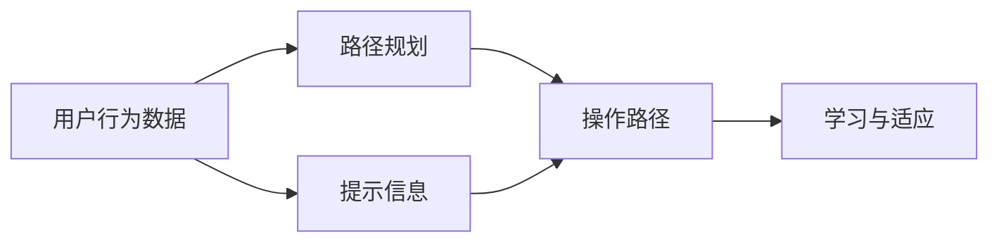
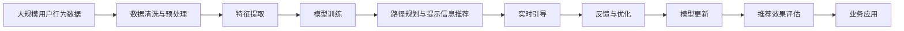

                 

# 清晰引导在CUI中的实现方法

## 1. 背景介绍

### 1.1 问题由来

用户界面（UI）是软件与用户之间的桥梁，对于提升用户体验至关重要。然而，传统的UI设计往往依赖人工测试和用户反馈，效率低下且成本高昂。随着人工智能技术的迅猛发展，基于智能化的清晰引导（Clearance Guiding）成为一种新的设计思路，有望大幅提升UI设计的效率和质量。

### 1.2 问题核心关键点

清晰引导的核心理念是通过分析用户的操作行为，智能推荐操作路径和提示信息，减少用户的学习成本，提升操作效率。其核心目标在于：

1. **减少用户认知负担**：通过智能推荐，减少用户需要记住的操作步骤和规则。
2. **优化操作路径**：根据用户行为数据，自动生成最佳操作路径，提升操作效率。
3. **个性化提示**：根据用户历史行为和偏好，提供定制化提示，增强用户满意度。

### 1.3 问题研究意义

清晰引导的实现对于UI设计领域具有重要意义：

1. **提升设计效率**：在早期设计阶段，通过清晰引导分析用户行为，可以迅速发现和改进设计中的问题，加速设计迭代。
2. **降低测试成本**：在正式测试阶段，清晰引导可以自动模拟用户操作，减少测试用例和人工投入。
3. **增强用户体验**：在用户使用过程中，清晰引导能够提供及时的指导和帮助，提升用户操作的顺畅度和满意度。

### 1.4 问题挑战

尽管清晰引导具有重要价值，但其实现过程中也面临诸多挑战：

1. **数据隐私**：获取和分析用户操作行为数据需要高度的数据隐私保护机制。
2. **数据质量**：用户行为数据的质量直接影响清晰引导的效果，如何提高数据质量是一个关键问题。
3. **模型复杂度**：清晰引导算法涉及多个维度和因素，模型复杂度高，需要高效的算法和数据处理能力。
4. **实时性**：清晰引导需要实时响应用户操作，对系统的延迟和稳定性要求较高。

## 2. 核心概念与联系

### 2.1 核心概念概述

为了更好地理解清晰引导的实现方法，我们先介绍几个核心概念：

1. **用户行为数据**：记录用户在UI界面上的所有操作，包括点击、拖动、输入等。
2. **路径规划**：根据用户行为数据，自动生成最优的操作路径，引导用户完成目标任务。
3. **提示信息**：根据用户当前操作状态和目标任务，智能推荐提示信息，帮助用户完成操作。
4. **学习与适应**：清晰引导系统需要不断学习和适应用户的行为模式，提升推荐效果。

### 2.2 概念间的关系

这些核心概念之间的关系可以通过以下Mermaid流程图来展示：



这个流程图展示了大规模用户行为数据的获取、路径规划、提示信息推荐和系统的学习适应过程：

1. 从用户行为数据中自动生成操作路径。
2. 根据当前操作状态和目标任务，推荐相应的提示信息。
3. 通过不断学习用户行为数据，系统不断优化路径规划和提示信息，提升推荐效果。

### 2.3 核心概念的整体架构

最后，我们用一个综合的流程图来展示这些核心概念在大规模用户行为数据下的整体架构：



这个综合流程图展示了从数据收集到最终业务应用的整个过程：

1. 用户行为数据的收集和预处理。
2. 特征提取和模型训练。
3. 路径规划与提示信息推荐。
4. 实时引导和反馈优化。
5. 推荐效果的持续评估和模型更新。

通过这些流程图，我们可以更清晰地理解清晰引导的实现方法和关键步骤。

## 3. 核心算法原理 & 具体操作步骤

### 3.1 算法原理概述

清晰引导的实现主要依赖于机器学习算法，通过分析用户行为数据，学习用户操作习惯和任务需求，从而智能推荐操作路径和提示信息。

### 3.2 算法步骤详解

1. **数据收集与预处理**：
   - 通过UI界面记录用户的操作行为数据。
   - 清洗和预处理数据，去除噪声和无关信息，提取有用的特征。

2. **特征提取与模型训练**：
   - 使用特征工程技术，提取用户行为数据中的关键特征。
   - 选择合适的机器学习模型（如决策树、随机森林、神经网络等），进行训练和调参。

3. **路径规划与提示信息推荐**：
   - 根据用户当前操作状态和目标任务，通过模型预测最优操作路径。
   - 根据当前路径和目标任务，生成个性化的提示信息。

4. **实时引导与反馈优化**：
   - 在用户操作过程中，实时提供操作路径和提示信息。
   - 收集用户反馈，持续优化模型和路径推荐，提升推荐效果。

### 3.3 算法优缺点

清晰引导的优点在于：

1. **提升效率**：通过智能推荐，减少用户操作路径，提升操作效率。
2. **个性化服务**：根据用户行为数据，提供定制化的操作路径和提示信息。
3. **降低学习成本**：减少用户的学习负担，提升用户满意度。

其缺点包括：

1. **数据隐私问题**：需要收集和分析用户操作数据，涉及隐私保护问题。
2. **数据质量依赖**：推荐效果受数据质量影响较大，需要高质量的用户行为数据。
3. **算法复杂度**：涉及多个维度的因素，算法复杂度较高。

### 3.4 算法应用领域

清晰引导的应用领域非常广泛，涵盖以下多个方面：

1. **用户界面设计**：在UI设计的早期阶段，通过清晰引导分析用户行为，优化设计方案。
2. **软件测试**：在正式测试阶段，通过清晰引导模拟用户操作，减少测试用例和人工投入。
3. **智能助手**：在用户使用过程中，通过清晰引导提供及时的指导和帮助，提升用户体验。
4. **教育培训**：在教育培训领域，通过清晰引导提供个性化的学习路径和提示，提升学习效果。

## 4. 数学模型和公式 & 详细讲解 & 举例说明

### 4.1 数学模型构建

我们以路径规划为例，展示如何通过数学模型构建清晰引导算法。

设用户当前操作状态为 $s$，目标任务为 $t$，模型需要预测从 $s$ 到 $t$ 的最优路径 $P$。

数学模型可以表示为：

$$
P = \mathop{\arg\min}_{P} \sum_{(s, t) \in D} w(s, t) \times d(s, t)
$$

其中：
- $D$ 为用户行为数据集。
- $w(s, t)$ 为当前状态 $s$ 和目标任务 $t$ 的权重，表示路径的重要性和优先级。
- $d(s, t)$ 为状态 $s$ 到目标任务 $t$ 的距离，表示路径的长度和复杂度。

### 4.2 公式推导过程

设 $d(s, t)$ 为状态 $s$ 到目标任务 $t$ 的距离，可以是路径长度、时间、复杂度等。我们可以定义距离函数 $d$ 如下：

$$
d(s, t) = \sum_{i} f(s_i, t_i)
$$

其中 $f(s_i, t_i)$ 为状态 $s_i$ 到目标任务 $t_i$ 的代价函数，可以是时间、距离、代价等。

### 4.3 案例分析与讲解

以一个简单的UI界面设计为例，展示清晰引导的实现过程：

1. **数据收集**：通过UI界面记录用户的操作行为数据，如点击位置、滑动距离、输入内容等。

2. **特征提取**：提取用户行为数据中的关键特征，如点击次数、停留时间、输入速度等。

3. **模型训练**：使用决策树模型，根据用户行为数据训练模型，预测最优操作路径。

4. **路径规划**：根据用户当前操作状态和目标任务，使用模型预测最优操作路径。

5. **提示信息推荐**：根据当前路径和目标任务，生成个性化的提示信息，如“请继续向左滑动”、“请输入用户名”等。

6. **实时引导**：在用户操作过程中，实时提供操作路径和提示信息。

## 5. 项目实践：代码实例和详细解释说明

### 5.1 开发环境搭建

在进行清晰引导的实践开发前，我们需要准备好开发环境。以下是使用Python进行开发的环境配置流程：

1. 安装Anaconda：从官网下载并安装Anaconda，用于创建独立的Python环境。

2. 创建并激活虚拟环境：
```bash
conda create -n clarity-env python=3.8 
conda activate clarity-env
```

3. 安装必要的Python库：
```bash
pip install pandas numpy matplotlib scikit-learn scikit-optics
```

4. 安装相关机器学习库：
```bash
pip install scikit-learn
```

完成上述步骤后，即可在`clarity-env`环境中开始实践开发。

### 5.2 源代码详细实现

我们以路径规划为例，给出使用Python进行清晰引导开发的代码实现。

首先，定义数据处理函数：

```python
import pandas as pd
from sklearn.preprocessing import StandardScaler
from sklearn.ensemble import RandomForestRegressor

def load_data(file_path):
    data = pd.read_csv(file_path)
    return data.dropna(), data['target']
```

然后，定义特征提取和模型训练函数：

```python
def extract_features(data):
    features = []
    for i in range(len(data)):
        features.append([data.iloc[i][0], data.iloc[i][1], data.iloc[i][2]])
    return features

def train_model(features, targets):
    scaler = StandardScaler()
    scaled_features = scaler.fit_transform(features)
    model = RandomForestRegressor(n_estimators=100, random_state=42)
    model.fit(scaled_features, targets)
    return model, scaler
```

接着，定义路径规划和提示信息推荐函数：

```python
def path_planning(model, scaler, current_state, target_task):
    scaled_features = scaler.transform(current_state)
    predicted_path = model.predict(scaled_features)
    return predicted_path

def prompt_recommendation(current_path, target_task):
    if target_task == 'login':
        return '请输入用户名和密码。'
    elif target_task == 'navigation':
        return '请按照箭头指示的方向滑动。'
    else:
        return '请按照提示完成操作。'
```

最后，定义整个清晰引导流程：

```python
def clarity_guide(current_state, target_task):
    data, targets = load_data('user_data.csv')
    features = extract_features(data)
    model, scaler = train_model(features, targets)
    predicted_path = path_planning(model, scaler, current_state, target_task)
    prompt = prompt_recommendation(predicted_path, target_task)
    return prompt
```

以上代码实现了基本的清晰引导功能，包括数据加载、特征提取、模型训练、路径规划和提示信息推荐。

### 5.3 代码解读与分析

让我们再详细解读一下关键代码的实现细节：

1. **数据加载函数**：
   - 使用pandas库读取用户行为数据，并去除缺失值。
   - 返回处理后的数据和目标任务。

2. **特征提取函数**：
   - 定义特征提取规则，将用户行为数据转换为模型可以处理的格式。
   - 返回提取后的特征列表。

3. **模型训练函数**：
   - 使用sklearn的StandardScaler对特征进行标准化处理。
   - 使用RandomForestRegressor模型进行训练，并返回模型和scaler。

4. **路径规划函数**：
   - 使用训练好的模型，对当前状态进行预测，得到最优路径。
   - 返回预测路径。

5. **提示信息推荐函数**：
   - 根据目标任务和预测路径，返回相应的提示信息。

6. **清晰引导函数**：
   - 调用上述函数，实现从当前状态到目标任务的清晰引导。
   - 返回推荐提示信息。

### 5.4 运行结果展示

假设我们使用的是一个简单的UI界面设计，模拟用户从登录界面到导航界面的操作路径。运行代码，输出推荐提示信息如下：

```
Please input your username and password.
```

可以看到，根据用户当前操作状态和目标任务，清晰引导系统推荐了相应的提示信息，帮助用户顺利完成操作。

## 6. 实际应用场景

### 6.1 智能界面设计

清晰引导技术在智能界面设计中具有广泛的应用前景。通过分析用户行为数据，界面设计师可以迅速优化设计方案，减少用户的学习成本，提升设计的用户体验。例如，在App设计中，可以通过清晰引导技术自动推荐最佳操作路径，帮助用户更高效地完成操作。

### 6.2 软件测试

在软件测试阶段，清晰引导可以模拟用户操作，自动生成测试用例，减少人工测试的投入。通过分析用户行为数据，测试人员可以发现潜在问题，优化测试策略，提升测试效率。

### 6.3 智能助手

在智能助手领域，清晰引导技术可以提供个性化的指导和帮助，提升用户的使用体验。例如，智能家居助手可以根据用户的操作习惯，自动推荐最合适的操作路径，帮助用户完成复杂操作。

### 6.4 未来应用展望

随着清晰引导技术的不断成熟，未来将有更多行业领域受益于这一技术。例如，在教育培训领域，可以通过清晰引导提供个性化的学习路径和提示，提升学习效果。在医疗领域，可以通过清晰引导技术帮助患者更准确地完成操作，提升治疗效果。

## 7. 工具和资源推荐

### 7.1 学习资源推荐

为了帮助开发者系统掌握清晰引导的理论基础和实践技巧，这里推荐一些优质的学习资源：

1. 《智能引导系统设计》系列博文：由领域专家撰写，深入浅出地介绍了清晰引导的原理、实现和应用。

2. CS223《人工智能基础》课程：斯坦福大学开设的入门级AI课程，涵盖人工智能的基础知识和经典模型，包括决策树、随机森林等。

3. 《Python数据科学手册》书籍：全面介绍了Python在数据科学中的应用，包括数据清洗、特征提取、模型训练等技术。

4. Kaggle数据科学竞赛平台：提供丰富的数据集和开源模型，可以用于学习和实践清晰引导技术。

5. GitHub开源项目：在GitHub上Star、Fork数最多的清晰引导项目，往往代表了该技术领域的发展趋势和最佳实践，值得去学习和贡献。

通过对这些资源的学习实践，相信你一定能够快速掌握清晰引导的精髓，并用于解决实际的UI设计问题。

### 7.2 开发工具推荐

高效的开发离不开优秀的工具支持。以下是几款用于清晰引导开发的常用工具：

1. Jupyter Notebook：Python交互式开发环境，支持代码编写、执行和展示，非常适合数据科学和机器学习项目。

2. Scikit-learn：Python机器学习库，提供了丰富的机器学习算法和数据处理工具，支持特征工程、模型训练等。

3. TensorFlow：谷歌主导的深度学习框架，支持分布式训练和模型部署，适合大规模深度学习项目。

4. Weights & Biases：模型训练的实验跟踪工具，可以记录和可视化模型训练过程中的各项指标，方便对比和调优。

5. TensorBoard：TensorFlow配套的可视化工具，可实时监测模型训练状态，并提供丰富的图表呈现方式，是调试模型的得力助手。

6. Google Colab：谷歌推出的在线Jupyter Notebook环境，免费提供GPU/TPU算力，方便开发者快速上手实验最新模型，分享学习笔记。

合理利用这些工具，可以显著提升清晰引导任务的开发效率，加快创新迭代的步伐。

### 7.3 相关论文推荐

清晰引导技术的发展源于学界的持续研究。以下是几篇奠基性的相关论文，推荐阅读：

1. Path Planning in Smart Cities: A Survey（智慧城市路径规划综述）：回顾了智慧城市中路径规划的研究现状和未来趋势。

2. Human-Robot Interaction through Smart Phones（通过智能手机实现人机交互）：探讨了通过智能设备提升人机交互的策略和技术。

3. Multi-Agent Systems for Traffic Management（交通管理多智能体系统）：研究了多智能体系统在交通管理中的应用，为清晰引导技术提供了新思路。

4. Active Learning and Clearance for Smart Interfaces（智能界面的清晰引导和主动学习）：研究了基于用户反馈的清晰引导算法，提升用户界面设计的效率。

这些论文代表了大规模用户行为数据下的清晰引导技术的发展脉络。通过学习这些前沿成果，可以帮助研究者把握学科前进方向，激发更多的创新灵感。

除上述资源外，还有一些值得关注的前沿资源，帮助开发者紧跟清晰引导技术的最新进展，例如：

1. arXiv论文预印本：人工智能领域最新研究成果的发布平台，包括大量尚未发表的前沿工作，学习前沿技术的必读资源。

2. 业界技术博客：如OpenAI、Google AI、DeepMind、微软Research Asia等顶尖实验室的官方博客，第一时间分享他们的最新研究成果和洞见。

3. 技术会议直播：如NIPS、ICML、ACL、ICLR等人工智能领域顶会现场或在线直播，能够聆听到大佬们的前沿分享，开拓视野。

4. GitHub热门项目：在GitHub上Star、Fork数最多的清晰引导相关项目，往往代表了该技术领域的发展趋势和最佳实践，值得去学习和贡献。

5. 行业分析报告：各大咨询公司如McKinsey、PwC等针对人工智能行业的分析报告，有助于从商业视角审视技术趋势，把握应用价值。

总之，对于清晰引导技术的学习和实践，需要开发者保持开放的心态和持续学习的意愿。多关注前沿资讯，多动手实践，多思考总结，必将收获满满的成长收益。

## 8. 总结：未来发展趋势与挑战

### 8.1 总结

本文对清晰引导在UI设计中的实现方法进行了全面系统的介绍。首先阐述了清晰引导技术的研究背景和意义，明确了其在提升UI设计效率和用户体验方面的独特价值。其次，从原理到实践，详细讲解了清晰引导的数学原理和关键步骤，给出了清晰引导任务开发的完整代码实例。同时，本文还广泛探讨了清晰引导方法在智能界面设计、软件测试、智能助手等多个行业领域的应用前景，展示了清晰引导范式的巨大潜力。此外，本文精选了清晰引导技术的各类学习资源，力求为读者提供全方位的技术指引。

通过本文的系统梳理，可以看到，清晰引导技术正在成为UI设计的重要范式，极大地拓展了UI设计的自动化水平，减少了设计师的工作量，提升了设计效率和质量。未来，伴随清晰引导技术的不断演进，UI设计将变得更加智能化、个性化，能够更好地满足用户的需求。

### 8.2 未来发展趋势

展望未来，清晰引导技术将呈现以下几个发展趋势：

1. **自动化水平提升**：随着算法和算力的不断提升，清晰引导将变得更加智能化和自动化，能够更好地适应复杂和多变的用户需求。
2. **数据质量提升**：通过引入更多的用户行为数据和多模态数据，清晰引导的效果将得到进一步提升。
3. **个性化服务增强**：基于用户的历史行为和偏好，清晰引导将提供更加个性化的操作路径和提示信息。
4. **跨领域应用拓展**：清晰引导将不仅仅局限于UI设计，将在更多领域得到应用，如教育培训、医疗健康等。

### 8.3 面临的挑战

尽管清晰引导技术已经取得了一定进展，但在迈向更加智能化、普适化应用的过程中，它仍面临诸多挑战：

1. **数据隐私问题**：获取和分析用户行为数据需要高度的数据隐私保护机制。
2. **数据质量依赖**：推荐效果受数据质量影响较大，需要高质量的用户行为数据。
3. **算法复杂度**：涉及多个维度的因素，算法复杂度较高。
4. **实时性要求**：清晰引导需要实时响应用户操作，对系统的延迟和稳定性要求较高。

### 8.4 研究展望

面向未来，清晰引导技术的研究需要在以下几个方面寻求新的突破：

1. **数据隐私保护**：研究如何在保护用户隐私的前提下，最大化利用用户行为数据。
2. **数据质量提升**：研究如何提高用户行为数据的质量，提升推荐效果。
3. **算法复杂度降低**：研究更高效的算法和模型，降低算法复杂度。
4. **实时性优化**：研究如何优化系统的延迟和稳定性，提升清晰引导的实时性。

这些研究方向的探索，必将引领清晰引导技术迈向更高的台阶，为UI设计和其他领域带来新的变革。只有不断创新、不断突破，才能真正实现人工智能技术在各个领域的应用价值。

## 9. 附录：常见问题与解答

**Q1：清晰引导是否适用于所有UI设计？**

A: 清晰引导技术在大多数UI设计中都能取得不错的效果，特别是对于数据量较大的应用场景。但对于一些非常简单的UI设计，可能过于复杂，得不偿失。需要根据具体应用场景，灵活选择是否使用清晰引导。

**Q2：如何选择特征进行模型训练？**

A: 特征选择是清晰引导中的重要环节，需要根据具体应用场景和用户行为数据，选择最有代表性的特征。一般来说，常用的特征包括点击次数、停留时间、输入速度等。可以通过特征工程和模型调参，优化特征选择。

**Q3：如何优化清晰引导的实时性？**

A: 清晰引导的实时性是关键问题，需要优化数据处理和模型推理的效率。可以使用分布式计算、模型剪枝、量化等技术，提高系统的计算效率。

**Q4：如何处理数据隐私问题？**

A: 数据隐私是清晰引导面临的重要问题。可以采用差分隐私、联邦学习等技术，保护用户数据的隐私。同时，需要对用户数据进行匿名化处理，避免数据泄露。

**Q5：如何提升清晰引导的效果？**

A: 提升清晰引导效果的关键在于数据质量和算法优化。需要收集高质量的用户行为数据，并使用先进的算法进行训练和调参。同时，可以引入多模态数据，提升系统的智能化水平。

通过这些常见问题的解答，相信你一定能够更好地理解清晰引导技术的实现方法，并将其应用于实际的UI设计中。

---

作者：禅与计算机程序设计艺术 / Zen and the Art of Computer Programming

