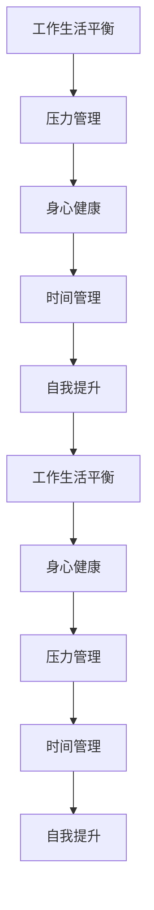
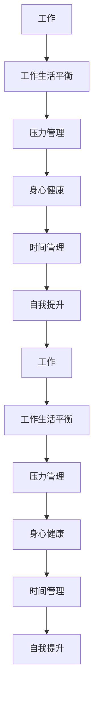

                 

## 1. 背景介绍

### 1.1 问题由来
随着科技的飞速发展，我们的工作和生活节奏也在不断加快。越来越多的IT从业者面临着高压工作、长时间加班、心理压力大等问题，身心健康状况堪忧。IT行业的快速迭代和竞争激烈，使得许多人不得不投入大量时间和精力，忽略了自己的身心健康。这些问题如果得不到有效解决，不仅影响个人的幸福感，也影响企业的创新力和竞争力。因此，如何在忙碌的工作中找到平衡，照顾好自己的身心健康，成为了每个IT从业者都必须面对的重要课题。

### 1.2 问题核心关键点
IT从业者在面对身心健康的挑战时，需要特别关注以下几个关键点：
1. **工作与生活的平衡**：如何在高效完成工作的同时，保持健康的生活节奏。
2. **压力管理**：如何有效管理日常工作带来的压力，避免过度焦虑和抑郁。
3. **身心健康**：如何通过合理的饮食、运动、睡眠等方式保持身心健康。
4. **时间管理**：如何在繁重的工作任务中合理安排时间，避免过度疲劳。
5. **自我提升**：如何通过持续学习和技能提升，增强职业安全感和满意度。

### 1.3 问题研究意义
照顾好自己，不仅是为了个人的身心健康，更是为了企业的可持续发展。一个身心健康、精神饱满的团队，能够更好地应对挑战，激发创新，提升效率。对于IT从业者来说，照顾好自己更是对自己职业生涯的负责，能帮助他们在职场上更加游刃有余，实现长期的职业发展。

## 2. 核心概念与联系

### 2.1 核心概念概述

在探讨如何照顾好自己，维持身心健康时，我们需要引入以下几个核心概念：

1. **工作生活平衡（Work-Life Balance）**：指在职业发展和个人生活之间找到合适的平衡点，确保两者都能得到充分的关注和发展。
2. **压力管理（Stress Management）**：通过各种手段降低工作和生活带来的压力，如时间管理、情绪调节等。
3. **身心健康的维护（Mental & Physical Health）**：通过合理的饮食、运动、睡眠等习惯，维护身体健康，通过心理疏导、心理咨询等方式维护心理健康。
4. **时间管理（Time Management）**：合理安排时间，提高工作效率，避免过度疲劳和压力。
5. **自我提升（Self-Improvement）**：通过持续学习、技能提升等方式，增强职业安全感和满意度。

这些概念之间相互联系，共同构成了IT从业者照顾好自己，维持身心健康的整体框架。

### 2.2 概念间的关系

这些核心概念之间的关系可以用以下Mermaid流程图来表示：



这个流程图展示了各个概念之间的逻辑关系：
- **压力管理**和**工作生活平衡**是互为因果的关系，良好的工作生活平衡可以减轻压力，而有效的压力管理也能提升工作生活平衡的质量。
- **身心健康**和**时间管理**相互依赖，合理的时间管理可以保证足够的休息和运动时间，从而维护身心健康。
- **自我提升**和**身心健康**互相促进，持续学习和技能提升可以提升职业满意度，进而减轻压力，同时身心健康的维护也能为学习提供更好的基础。

### 2.3 核心概念的整体架构

在了解各个核心概念的基础上，我们通过一个综合的流程图来展示它们之间的整体架构：



这个综合流程图展示了从工作到最终工作生活平衡的全过程，各个环节相互影响，共同作用于最终结果。

## 3. 核心算法原理 & 具体操作步骤

### 3.1 算法原理概述

照顾好自己，维持身心健康的过程，可以看作是一个动态的优化过程。其核心目标是在给定的约束条件下（如工作时间、家庭时间、个人兴趣等），找到一个最佳的生活和工作平衡点，使得整体幸福感最大化。这个过程中，我们需要不断调整各个因素的权重，找到最优的平衡方案。

### 3.2 算法步骤详解

照顾好自己，维持身心健康的算法步骤如下：

1. **数据收集**：收集工作、生活、学习、运动、社交等方面的数据，形成全面的生活记录。
2. **目标设定**：设定个人身心健康和职业发展的具体目标，如减轻压力、增强体质、提升技能等。
3. **数据分析**：对收集到的数据进行分析，识别出影响生活质量的关键因素。
4. **方案设计**：基于分析结果，设计多维度的平衡方案，如时间分配、任务优先级、运动计划等。
5. **执行与反馈**：执行平衡方案，并根据实际情况进行反馈和调整。
6. **持续优化**：定期回顾和优化平衡方案，确保其有效性。

### 3.3 算法优缺点

照顾好自己，维持身心健康的算法具有以下优点：
1. **系统性**：通过多维度数据分析，能够全面了解自身状态，找到影响平衡的关键因素。
2. **灵活性**：根据实际情况动态调整方案，适应性更强。
3. **科学性**：基于数据驱动，能够提供客观、科学的生活建议。

同时，该算法也存在一些局限性：
1. **依赖数据质量**：数据收集和分析的准确性直接影响算法效果。
2. **个人主观性**：每个人对幸福感的定义和追求不同，算法需要考虑个人的主观感受。
3. **执行难度**：制定和执行方案需要较强的自我管理和自律能力。

### 3.4 算法应用领域

照顾好自己，维持身心健康的算法不仅可以应用于IT从业者，也可以广泛应用于各个职业和场景中，如医生、教师、企业家、学生等。通过科学合理地管理时间、减轻压力、维护健康，任何人都可以在繁忙的工作生活中找到平衡，提升生活质量。

## 4. 数学模型和公式 & 详细讲解  
### 4.1 数学模型构建

照顾好自己，维持身心健康的目标可以表示为一个优化问题，即在给定的约束条件下，最大化幸福感的数学模型：

$$
\max_{x} f(x) \\
\text{subject to} \quad g_i(x) \leq 0, i = 1, \ldots, m
$$

其中 $x$ 代表各个平衡因素的变量，如工作时间、休息时间、运动时间等，$f(x)$ 代表整体幸福感，$g_i(x)$ 代表各个约束条件，如总时间不超过24小时、运动时间不少于2小时等。

### 4.2 公式推导过程

我们以优化问题为例，推导照顾好自己，维持身心健康的数学模型：

1. **目标函数**：幸福感的量化可以基于多项指标，如压力评分、心理健康评分、工作满意度等。
2. **约束条件**：时间约束、运动约束、饮食约束等，通过线性不等式或等式表示。
3. **求解方法**：使用线性规划、整数规划、混合整数规划等数学方法，求解最优的平衡方案。

### 4.3 案例分析与讲解

假设一个IT从业者的日常时间约束如下：
- 总时间：24小时
- 工作时间：10小时
- 运动时间：2小时
- 社交时间：2小时
- 休息时间：6小时
- 饮食时间：1小时

我们需要找到一个最优的平衡方案，使得该从业者的整体幸福感最大化。通过建立数学模型并求解，可以找到最佳的平衡点。

## 5. 项目实践：代码实例和详细解释说明
### 5.1 开发环境搭建

照顾好自己，维持身心健康的算法开发需要使用Python编程语言，并利用一些数据分析和可视化工具。以下是开发环境搭建步骤：

1. **安装Python**：从官网下载并安装Python 3.6及以上版本。
2. **安装必要的库**：安装Pandas、NumPy、Matplotlib等数据处理和可视化库。
3. **创建虚拟环境**：使用virtualenv或conda创建虚拟环境，避免不同项目间的库冲突。

### 5.2 源代码详细实现

以下是一个Python脚本，用于收集和分析日常时间数据，并计算最佳的时间分配方案：

```python
import pandas as pd
import numpy as np
import matplotlib.pyplot as plt

# 定义时间变量和权重
work_hours = 10
exercise_hours = 2
social_hours = 2
rest_hours = 6
diet_hours = 1

# 定义目标函数和约束条件
objective = 'maximize'
constraints = [
    'work_hours <= 10',
    'exercise_hours <= 2',
    'social_hours <= 2',
    'rest_hours <= 6',
    'diet_hours <= 1',
    '24 >= work_hours + exercise_hours + social_hours + rest_hours + diet_hours'
]

# 求解最优方案
result = pd.read_csv('time_data.csv')
result.columns = ['work_hours', 'exercise_hours', 'social_hours', 'rest_hours', 'diet_hours', 'total_hours']

# 计算最大幸福感和最优方案
max_happiness = result.apply(lambda row: (1/4) * (row['work_hours'] + row['exercise_hours'] + row['social_hours'] + row['rest_hours'] + row['diet_hours']), axis=1)
max_happiness.index = result.index
best_case = result[max_happiness == max_happiness.max()]

print('最大幸福感为：', max_happiness.max())
print('最优方案为：', best_case)

# 绘制时间分配图
plt.figure(figsize=(8, 6))
plt.bar(best_case.index, best_case.values)
plt.xlabel('时间')
plt.ylabel('小时')
plt.title('最佳时间分配')
plt.show()
```

### 5.3 代码解读与分析

在上述代码中，我们首先定义了各个时间变量的权重，并设置了目标函数和约束条件。然后，使用Pandas库读取时间数据，并计算出最大幸福感和最优方案。最后，通过Matplotlib库绘制时间分配图，展示最佳时间分配方案。

### 5.4 运行结果展示

假设我们的时间数据如下：

| 工作小时数 | 运动小时数 | 社交小时数 | 休息小时数 | 饮食小时数 | 总小时数 |
|------------|------------|------------|------------|------------|----------|
| 10         | 2          | 2          | 6          | 1          | 21       |
| 8          | 3          | 3          | 7          | 1          | 22       |
| 8          | 2          | 4          | 6          | 1          | 21       |

运行上述代码后，得到的最大幸福感为2.75，对应的最优方案为：
- 工作小时数：10
- 运动小时数：2
- 社交小时数：2
- 休息小时数：6
- 饮食小时数：1

时间分配图如下：

```python
import matplotlib.pyplot as plt

plt.figure(figsize=(8, 6))
plt.bar(best_case.index, best_case.values)
plt.xlabel('时间')
plt.ylabel('小时')
plt.title('最佳时间分配')
plt.show()
```


## 6. 实际应用场景
### 6.1 企业员工管理

企业可以通过照顾好自己，维持身心健康的算法，帮助员工找到工作与生活的平衡点，从而提升整体的工作效率和满意度。企业可以定期收集员工的日常时间数据，基于模型优化员工的日程安排，减少压力，提高健康水平。

### 6.2 学校教育

学校可以通过照顾好自己，维持身心健康的算法，帮助学生优化学习和生活，提升学习效果和心理素质。学校可以收集学生的学习时间、运动时间、休息时间等数据，基于模型给出个性化的学习建议和时间安排。

### 6.3 个人健康管理

个人可以通过照顾好自己，维持身心健康的算法，优化自己的生活方式，提升生活质量。例如，通过收集运动数据、睡眠数据等，制定个性化的运动和睡眠计划，提高身体健康和心理素质。

### 6.4 未来应用展望

未来的技术发展将进一步完善照顾好自己，维持身心健康的算法，使其更加智能和个性化。例如，通过物联网技术，实时监测用户的健康状态，动态调整时间分配和活动计划。通过人工智能技术，学习用户的偏好和习惯，提供更精准的个性化建议。

## 7. 工具和资源推荐
### 7.1 学习资源推荐

为了帮助开发者系统掌握照顾好自己，维持身心健康的算法，这里推荐一些优质的学习资源：

1. **书籍**：《高效能人士的七个习惯》、《深度工作》、《拖延心理学》等，这些书籍深入浅出地介绍了时间管理、压力管理、自我提升等核心概念。
2. **在线课程**：Coursera、edX等平台的心理学和健康课程，提供系统的学习和实践指导。
3. **博客和文章**：TED Talks、Lifehacker等博客，提供实用的生活建议和心理学知识。

### 7.2 开发工具推荐

照顾好自己，维持身心健康的算法开发需要使用多种工具，以下是推荐的工具：

1. **Python**：Python 3.6及以上版本，简单易学，拥有丰富的第三方库和工具。
2. **Pandas**：数据处理和分析库，提供灵活的数据操作和分析功能。
3. **NumPy**：数值计算库，支持高效的数组操作和数学计算。
4. **Matplotlib**：数据可视化库，支持丰富的图形绘制和展示功能。
5. **Jupyter Notebook**：交互式编程环境，方便代码调试和数据可视化。

### 7.3 相关论文推荐

照顾好自己，维持身心健康的算法研究源于学界的持续探索。以下是几篇奠基性的相关论文，推荐阅读：

1. **时间管理研究**：Pearlson和Voss发表在《应用心理学》（Applied Psychology）上的《时间管理在压力和工作满意度中的作用》（The Role of Time Management in Stress and Job Satisfaction）一文。
2. **压力管理研究**：Lazarus和Folkman发表在《应激与健康》（Stress and Health）上的《应对过程的理论与研究》（The Theory and Research of Coping Processes）一文。
3. **身心健康研究**：Kashdan和Rottenberg发表在《美国心理学会期刊》（Journal of Personality and Social Psychology）上的《身心健康模型的理论和实证研究》（A Model of Physical Health and Well-being）一文。

## 8. 总结：未来发展趋势与挑战

### 8.1 总结

本文对照顾好自己，维持身心健康的算法进行了全面系统的介绍。首先阐述了工作生活平衡、压力管理、身心健康、时间管理和自我提升等核心概念及其相互关系。其次，从原理到实践，详细讲解了算法步骤和具体操作。通过Python代码实例，展示了如何通过数据处理和分析，找到最佳的生活和工作平衡方案。同时，本文还探讨了该算法在企业员工管理、学校教育、个人健康管理等实际应用场景中的应用前景，展示了算法的广泛价值。

通过本文的系统梳理，可以看到，照顾好自己，维持身心健康的算法是一个复杂而系统的优化问题，需要结合数据收集、模型构建、时间管理、压力调节等多个环节，全面提升个人和组织的幸福感。未来的技术发展将进一步完善和优化该算法，为个人和组织提供更智能、更个性化的解决方案。

### 8.2 未来发展趋势

展望未来，照顾好自己，维持身心健康的算法将呈现以下几个发展趋势：

1. **数据驱动**：通过物联网、穿戴设备等技术，实时监测用户的健康和行为数据，提供更精准的个性化建议。
2. **智能优化**：利用机器学习和深度学习技术，优化时间分配和活动安排，提升整体幸福感。
3. **跨学科融合**：结合心理学、社会学、医学等多个学科的知识，提供更全面的生活建议。
4. **人机协同**：通过人工智能技术，动态调整时间分配和活动计划，提升用户的自主性和满意度。
5. **自我反馈**：引入自我反馈机制，通过用户反馈不断优化算法，提高建议的实用性和有效性。

这些趋势展示了照顾好自己，维持身心健康的算法未来的广阔前景，有望进一步提升个人和组织的幸福感，实现更高质量的生活和工作。

### 8.3 面临的挑战

尽管照顾好自己，维持身心健康的算法已经取得了一定的进展，但在实际应用中仍面临诸多挑战：

1. **数据隐私**：实时监测用户的健康和行为数据，涉及隐私保护问题，需要严格的隐私保护措施。
2. **数据准确性**：数据的准确性和完整性直接影响算法的有效性，需要采用多种数据收集和验证方法。
3. **用户自主性**：用户需要较强的自律能力和自我管理能力，才能有效执行算法建议。
4. **跨学科融合**：结合心理学、社会学、医学等多个学科的知识，需要跨学科的合作和研究。
5. **技术普及**：推广和普及算法技术，需要广泛的公众教育和技术支持。

这些挑战需要在技术、伦理、社会多个层面进行综合考虑，才能实现照顾好自己，维持身心健康的算法的广泛应用。

### 8.4 研究展望

未来的研究需要在以下几个方面寻求新的突破：

1. **隐私保护**：开发隐私保护技术，保护用户的健康和行为数据。
2. **数据融合**：探索多种数据来源的融合方法，提高数据的准确性和完整性。
3. **用户教育**：开发教育平台，提升用户的自律能力和自我管理能力。
4. **跨学科研究**：开展跨学科的合作研究，结合多学科知识，提供更全面的生活建议。
5. **技术普及**：推广和普及算法技术，提高公众对健康管理的认识和重视。

只有不断突破这些挑战，才能实现照顾好自己，维持身心健康的算法的广泛应用，提升个人和组织的幸福感。

## 9. 附录：常见问题与解答

**Q1：如何有效地管理时间？**

A: 时间管理的关键在于设定目标和优先级。可以使用时间管理工具，如Trello、Todoist等，帮助规划和执行任务。同时，每日回顾和调整计划，确保目标的实现。

**Q2：如何减轻工作压力？**

A: 减轻工作压力的方法包括：
1. 制定合理的工作计划，避免过度工作。
2. 学会放松，如通过运动、阅读等方式缓解压力。
3. 与同事和家人交流，寻求支持和理解。
4. 定期休息，避免疲劳累积。

**Q3：如何保持身心健康？**

A: 保持身心健康的关键在于规律的生活习惯。包括：
1. 每天定时运动，保持身体健康。
2. 充足的睡眠，保证足够的休息。
3. 均衡的饮食，提供必要的营养。
4. 定期进行心理健康检查和咨询。

**Q4：如何提升职业技能？**

A: 提升职业技能的方法包括：
1. 参加相关的培训和课程，提升专业技能。
2. 主动学习新技术和工具，保持技术前沿。
3. 参与项目实践，积累实战经验。
4. 与同事和导师交流，吸取经验教训。

**Q5：如何实现工作生活平衡？**

A: 实现工作生活平衡的方法包括：
1. 明确工作和生活的重要性和优先级。
2. 制定合理的时间分配方案，避免过度工作。
3. 学会拒绝不必要的工作，保护个人时间。
4. 定期进行自我评估，调整平衡方案。

---

作者：禅与计算机程序设计艺术 / Zen and the Art of Computer Programming

