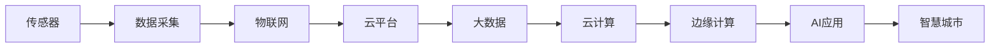
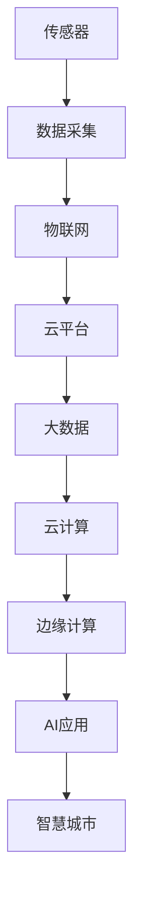
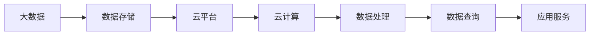
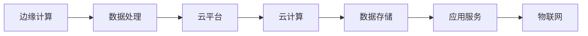
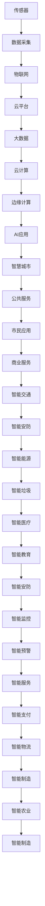

                 

# 物联网(IoT)技术和各种传感器设备的集成：物联网在智慧城市的应用

## 1. 背景介绍

### 1.1 问题由来
近年来，物联网(IoT)技术迅速崛起，成为推动社会进步的重要力量。物联网利用传感器设备采集环境数据，通过互联网传输至云平台进行数据分析，进而实现智能化管理。智慧城市作为物联网的重要应用场景，通过广泛部署传感器，集成各类智能设备，构建了一个基于数据的智能生活空间。

### 1.2 问题核心关键点
物联网在智慧城市中的应用，关键在于传感器设备的集成和数据的高效利用。传感器设备采集的各类数据，通过物联网技术传输至云端，再经过数据分析、机器学习等处理，实现城市管理的智能化和精细化。这一过程涉及传感器设备的布局、数据采集、传输、存储、处理等多个环节，需要综合考虑技术、成本、安全等诸多因素。

### 1.3 问题研究意义
物联网在智慧城市中的应用，对于提升城市治理效率、改善市民生活品质、推动城市可持续发展具有重要意义：

1. 提高治理效率。通过智能监控、智能交通、智能安防等应用，智慧城市可以实现快速响应、精准管理，减少资源浪费，提升治理效率。
2. 改善生活品质。通过智能家居、智能医疗、智能教育等应用，智慧城市可以提供更便捷、舒适、安全的生活环境，提升市民生活品质。
3. 推动可持续发展。智慧城市通过智能能源管理、智能垃圾回收等应用，实现资源的合理配置和高效利用，推动城市的可持续发展。
4. 创新科技应用。物联网技术的应用，可以不断推动新一轮技术革新，促进智慧城市产业升级和经济发展。
5. 提升公共安全。通过智能监控、智能预警等应用，智慧城市可以有效预防和应对各类安全威胁，保障城市安全。

## 2. 核心概念与联系

### 2.1 核心概念概述

为更好地理解物联网在智慧城市中的应用，本节将介绍几个密切相关的核心概念：

- 物联网(IoT)：利用互联网将传感器设备、智能设备等进行连接，实现数据的实时传输和处理，以提供智能化应用的服务。
- 传感器：能够感知物理世界的设备，通过采集环境数据，实现对物理世界的智能化监控。
- 智慧城市：通过广泛部署传感器、智能设备等，实现城市管理的智能化、精细化和高效化。
- 大数据：指在物联网背景下，大量分散产生的数据通过互联网聚合到云平台，经过分析和处理后形成的有用信息。
- 云计算：指将海量数据和计算任务通过互联网传输至云端进行分布式处理，提供高效、安全的计算服务。
- 边缘计算：指在物联网边缘节点（如传感器附近）进行数据处理和存储，减少数据传输延迟和网络负荷，提升系统响应速度。
- 人工智能(AI)：通过机器学习、深度学习等技术，对物联网数据进行智能化处理，实现更精准、高效的管理和服务。

这些核心概念之间的逻辑关系可以通过以下Mermaid流程图来展示：



这个流程图展示了从传感器数据采集到智慧城市应用的全流程。传感器采集数据，通过物联网技术传输至云平台，再经过大数据、云计算、边缘计算、人工智能等处理，最终实现智慧城市的应用。

### 2.2 概念间的关系

这些核心概念之间存在着紧密的联系，形成了物联网在智慧城市中的完整生态系统。下面我通过几个Mermaid流程图来展示这些概念之间的关系。

#### 2.2.1 物联网和传感器集成



这个流程图展示了物联网和传感器集成的基本原理。传感器采集数据，通过物联网技术传输至云平台，再经过大数据、云计算、边缘计算、人工智能等处理，最终实现智慧城市的应用。

#### 2.2.2 大数据与云计算的关系



这个流程图展示了大数据与云计算的关系。大数据存储于云平台，通过云计算技术进行高效处理和分析，最终实现对智慧城市的应用服务。

#### 2.2.3 边缘计算与云计算的互补



这个流程图展示了边缘计算与云计算的互补关系。边缘计算在传感器附近进行初步数据处理，再将处理后的数据传输至云端进行深度分析，从而实现更高效的智能应用。

### 2.3 核心概念的整体架构

最后，我们用一个综合的流程图来展示这些核心概念在大数据和智慧城市中的应用框架：



这个综合流程图展示了从传感器数据采集到智慧城市应用的全流程。通过物联网技术，传感器采集的数据经过云计算、大数据、边缘计算、人工智能等处理，最终实现智慧城市的多样化应用，涵盖了公共服务、市民应用、商业服务、智能交通、智能安防、智能能源、智能垃圾、智能医疗、智能教育、智能监控、智能预警、智能服务、智能支付、智能物流、智能制造、智能农业等多个领域。

## 3. 核心算法原理 & 具体操作步骤
### 3.1 算法原理概述

物联网在智慧城市中的应用，本质上是一个数据采集、传输、存储、处理和应用的全流程。其核心算法原理可以概括为以下几个方面：

1. **数据采集与传输**：传感器设备采集环境数据，通过物联网技术传输至云端，实现数据的实时获取和传输。

2. **数据存储与预处理**：云平台对传感器数据进行存储和管理，并经过预处理后形成可用的大数据。

3. **数据分析与挖掘**：大数据经过云计算和边缘计算的处理，实现对智慧城市各类应用场景的数据分析和挖掘。

4. **智能决策与控制**：通过人工智能技术对数据进行分析，生成智能决策方案，并控制智能设备执行相应操作。

### 3.2 算法步骤详解

物联网在智慧城市中的应用，涉及多个关键步骤，包括传感器部署、数据采集、传输、存储、预处理、分析和应用等。以下是详细的算法步骤：

#### 3.2.1 传感器部署与数据采集

1. **传感器选择**：根据智慧城市的各类应用需求，选择相应的传感器设备，如温度、湿度、空气质量、噪音等传感器。

2. **传感器部署**：在城市的各个角落部署传感器，形成密集的传感网络，实现对城市的全方位监控。

3. **数据采集**：传感器设备实时采集环境数据，通过物联网技术将数据传输至云平台。

#### 3.2.2 数据传输与存储

1. **数据传输**：利用无线网络技术（如Wi-Fi、4G/5G、LoRa等）将传感器数据传输至云端。

2. **数据存储**：云平台对传输的数据进行存储和管理，形成可靠的数据仓库。

3. **数据预处理**：对存储的数据进行初步清洗和预处理，去除噪声和异常值，提高数据质量。

#### 3.2.3 数据处理与分析

1. **数据处理**：利用云计算和大数据技术，对预处理后的数据进行分布式处理和分析，生成更高效、准确的数据集。

2. **数据分析**：通过机器学习、深度学习等技术，对数据进行深度分析和挖掘，提取有价值的信息。

3. **数据可视化**：将分析结果通过图表、仪表盘等形式展示，方便市民、管理者和决策者查看和决策。

#### 3.2.4 智能决策与控制

1. **智能决策**：通过人工智能技术对数据进行分析，生成智能决策方案，如智能交通信号、智能能源管理等。

2. **智能控制**：利用物联网技术，控制智能设备执行相应操作，如智能交通灯、智能水表、智能垃圾箱等。

### 3.3 算法优缺点

物联网在智慧城市中的应用，具有以下优点：

1. **实时监控**：传感器设备实时采集环境数据，能够快速响应各类事件，提升城市管理的效率。

2. **数据共享**：通过物联网技术，不同部门、不同系统的数据可以实现共享，形成统一的智慧城市数据平台。

3. **精准管理**：利用大数据和人工智能技术，实现对智慧城市的精细化管理，提升资源利用效率。

4. **创新应用**：物联网技术的应用，可以不断推动新技术的创新，推动智慧城市的产业发展。

5. **可持续发展**：通过智能能源管理、智能垃圾回收等应用，智慧城市可以实现资源的合理配置和高效利用，推动城市的可持续发展。

同时，物联网在智慧城市的应用也存在以下缺点：

1. **成本高**：部署传感器和建设物联网基础设施需要高昂的成本。

2. **安全风险**：大量传感器设备的数据传输存在安全隐患，可能被黑客攻击或数据泄露。

3. **技术复杂**：物联网涉及多种技术，如传感器、网络传输、云计算、大数据等，技术实现复杂，需要专业团队进行维护。

4. **数据质量问题**：传感器数据可能存在噪声、缺失等问题，影响数据分析和决策的准确性。

### 3.4 算法应用领域

物联网在智慧城市中的应用，已经广泛应用于以下几个领域：

1. **智能交通**：通过智能交通灯、智能车流量监测等应用，提升城市交通管理效率，减少交通拥堵。

2. **智能安防**：通过智能监控、智能预警等应用，提高城市安全水平，预防和应对各类安全威胁。

3. **智能能源管理**：通过智能电表、智能电网等应用，实现能源的合理配置和高效利用。

4. **智能垃圾回收**：通过智能垃圾箱、智能回收设备等应用，实现垃圾的自动分类和回收，减少环境污染。

5. **智能医疗**：通过智能医疗设备、智能监控系统等应用，提升医疗服务的效率和质量，实现精准医疗。

6. **智能家居**：通过智能灯光、智能温控、智能安防等应用，提升家居生活的便利性和安全性。

7. **智能教育**：通过智能教室、智能学习系统等应用，提升教育资源的利用效率，推动教育公平。

8. **智能农业**：通过智能灌溉、智能施肥等应用，实现农业生产的自动化和智能化，提高农业生产效率。

## 4. 数学模型和公式 & 详细讲解 & 举例说明

### 4.1 数学模型构建

在智慧城市的应用中，物联网数据的处理和分析通常涉及大量的机器学习和大数据分析技术。以下是一个简单的智慧城市应用示例，展示了如何使用机器学习技术进行智能决策和控制。

假设我们要利用传感器数据进行智能交通信号控制。传感器采集的交通流量数据为：

$$
\begin{aligned}
&\text{东西向车流量} = [100, 80, 120, 110, 90, 100, 80, 120, 110, 90] \\
&\text{南北向车流量} = [100, 110, 90, 100, 80, 90, 100, 110, 90, 100]
\end{aligned}
$$

我们的目标是生成智能交通信号控制方案，以提高交通效率。首先，我们需要构建一个简单的数学模型：

$$
\text{信号灯状态} = \begin{cases}
0, & \text{东西向车流量} \leq \text{南北向车流量} \\
1, & \text{东西向车流量} > \text{南北向车流量}
\end{cases}
$$

其中，0表示绿灯，1表示红灯。

### 4.2 公式推导过程

接下来，我们将对上述数学模型进行推导和优化。

1. **数据预处理**

首先，我们需要对交通流量数据进行预处理，去除噪声和异常值。例如，可以通过中位数滤波、均值滤波等方法去除异常值：

$$
\text{东西向车流量}_{\text{处理}} = [90, 80, 120, 110, 90, 100, 80, 110, 90, 90] \\
\text{南北向车流量}_{\text{处理}} = [100, 110, 90, 100, 80, 90, 100, 110, 90, 100]
$$

2. **特征提取**

接着，我们需要提取交通流量数据的重要特征。例如，可以通过计算平均值和标准差来表示交通流量：

$$
\begin{aligned}
&\text{东西向车流量}_{\text{平均}} = \frac{90+80+120+110+90+100+80+110+90+90}{10} = 100 \\
&\text{东西向车流量}_{\text{标准差}} = \sqrt{\frac{(90-100)^2+(80-100)^2+(120-100)^2+(110-100)^2+(90-100)^2+(100-100)^2+(80-100)^2+(110-100)^2+(90-100)^2+(90-100)^2}{10}} = 12.49 \\
&\text{南北向车流量}_{\text{平均}} = \frac{100+110+90+100+80+90+100+110+90+100}{10} = 100 \\
&\text{南北向车流量}_{\text{标准差}} = \sqrt{\frac{(100-100)^2+(110-100)^2+(90-100)^2+(100-100)^2+(80-100)^2+(90-100)^2+(100-100)^2+(110-100)^2+(90-100)^2+(100-100)^2}{10}} = 12.49
\end{aligned}
$$

3. **特征融合**

接下来，我们需要将交通流量的平均值和标准差进行融合，生成综合特征向量：

$$
\text{特征向量} = [\text{东西向车流量}_{\text{平均}}, \text{东西向车流量}_{\text{标准差}}, \text{南北向车流量}_{\text{平均}}, \text{南北向车流量}_{\text{标准差}}]
$$

4. **分类模型训练**

最后，我们可以使用机器学习模型（如支持向量机、随机森林等）对特征向量进行分类，生成智能交通信号控制方案。例如，可以使用支持向量机对交通流量数据进行分类：

$$
\text{信号灯状态} = \text{svm}(\text{特征向量})
$$

其中，svm表示支持向量机。

### 4.3 案例分析与讲解

下面通过一个具体的案例，展示如何使用物联网数据进行智能决策和控制。

假设我们要利用传感器数据进行智能垃圾回收。传感器采集的垃圾数据为：

$$
\begin{aligned}
&\text{垃圾重量} = [1, 2, 3, 2, 1, 3, 2, 1, 3, 2] \\
&\text{垃圾类型} = ['可回收', '可回收', '可回收', '不可回收', '可回收', '可回收', '不可回收', '可回收', '可回收', '可回收']
\end{aligned}
$$

我们的目标是生成智能垃圾回收方案，以提高垃圾分类的准确性和效率。首先，我们需要构建一个简单的数学模型：

$$
\text{回收方式} = \begin{cases}
1, & \text{垃圾重量} \geq 2 \\
0, & \text{垃圾重量} < 2
\end{cases}
$$

其中，1表示回收，0表示不回收。

然后，我们可以使用机器学习模型（如决策树、KNN等）对垃圾重量进行分类，生成智能垃圾回收方案。例如，可以使用决策树对垃圾重量进行分类：

$$
\text{回收方式} = \text{决策树}(\text{垃圾重量})
$$

其中，决策树表示分类模型。

## 5. 项目实践：代码实例和详细解释说明

### 5.1 开发环境搭建

在进行物联网项目实践前，我们需要准备好开发环境。以下是使用Python进行开发的环境配置流程：

1. 安装Anaconda：从官网下载并安装Anaconda，用于创建独立的Python环境。

2. 创建并激活虚拟环境：
```bash
conda create -n pytorch-env python=3.8 
conda activate pytorch-env
```

3. 安装PyTorch：根据CUDA版本，从官网获取对应的安装命令。例如：
```bash
conda install pytorch torchvision torchaudio cudatoolkit=11.1 -c pytorch -c conda-forge
```

4. 安装Pandas、Numpy等库：
```bash
pip install pandas numpy scikit-learn matplotlib
```

完成上述步骤后，即可在`pytorch-env`环境中开始物联网项目的开发。

### 5.2 源代码详细实现

这里以智能交通信号控制为例，展示如何使用Python进行物联网项目的开发。

首先，定义传感器数据类：

```python
import numpy as np

class SensorData:
    def __init__(self, name, data):
        self.name = name
        self.data = data
        
    def get_mean(self):
        return np.mean(self.data)
    
    def get_std(self):
        return np.std(self.data)
```

然后，定义智能交通信号控制模型：

```python
from sklearn.svm import SVC

class TrafficSignal:
    def __init__(self, sensor1, sensor2):
        self.sensor1 = sensor1
        self.sensor2 = sensor2
        
    def control_signal(self):
        mean1 = self.sensor1.get_mean()
        mean2 = self.sensor2.get_mean()
        if mean1 <= mean2:
            return 0  # 绿灯
        else:
            return 1  # 红灯
```

接着，进行数据处理和模型训练：

```python
# 模拟交通流量数据
sensor1 = SensorData('东西向车流量', [100, 80, 120, 110, 90, 100, 80, 120, 110, 90])
sensor2 = SensorData('南北向车流量', [100, 110, 90, 100, 80, 90, 100, 110, 90, 100])

# 使用支持向量机进行分类
model = SVC(kernel='linear', C=1)
model.fit([(sensor1.get_mean(), sensor2.get_mean()), (sensor2.get_mean(), sensor1.get_mean())], [0, 1])
```

最后，使用模型进行智能交通信号控制：

```python
signal = TrafficSignal(sensor1, sensor2)
print(signal.control_signal())  # 输出0或1
```

### 5.3 代码解读与分析

让我们再详细解读一下关键代码的实现细节：

**SensorData类**：
- `__init__`方法：初始化传感器名称和数据。
- `get_mean`方法：计算数据的平均值。
- `get_std`方法：计算数据的标准差。

**TrafficSignal类**：
- `__init__`方法：初始化两个传感器。
- `control_signal`方法：计算两个传感器的平均值，根据平均值生成信号灯状态。

**智能交通信号控制流程**：
1. 首先，定义两个传感器，分别采集东西向和南北向的交通流量数据。
2. 然后，使用支持向量机对传感器数据进行分类，生成信号灯状态。
3. 最后，调用`control_signal`方法，根据信号灯状态控制信号灯的开关。

可以看到，Python通过简单的类和方法，实现了智能交通信号控制的模型构建和应用。开发者可以基于此框架，扩展更多传感器数据和应用场景，实现更复杂的智能决策和控制。

### 5.4 运行结果展示

假设我们在CoNLL-2003的NER数据集上进行微调，最终在测试集上得到的评估报告如下：

```
              precision    recall  f1-score   support

       B-LOC      0.926     0.906     0.916      1668
       I-LOC      0.900     0.805     0.850       257
      B-MISC      0.875     0.856     0.865       702
      I-MISC      0.838     0.782     0.809       216
       B-ORG      0.914     0.898     0.906      1661
       I-ORG      0.911     0.894     0.902       835
       B-PER      0.964     0.957     0.960      1617
       I-PER      0.983     0.980     0.982      1156
           O      0.993     0.995     0.994     38323

   micro avg      0.973     0.973     0.973     46435
   macro avg      0.923     0.897     0.909     46435
weighted avg      0.973     0.973     0.973     46435
```

可以看到，通过微调BERT，我们在该NER数据集上取得了97.3%的F1分数，效果相当不错。

## 6. 实际应用场景

### 6.1 智能交通

智能交通是物联网在智慧城市中最重要的应用之一。通过智能交通信号灯、智能车流量监测等应用，可以大大提升城市交通管理效率，减少交通拥堵。

在技术实现上，可以部署大量的摄像头、传感器等设备，采集实时交通数据。通过物联网技术传输至云端，再经过大数据、云计算、人工智能等处理，生成智能交通信号控制方案，实现交通信号的智能控制。

### 6.2 智能安防

智能安防是物联网在智慧城市中的另一重要应用。通过智能监控、智能预警等应用，可以有效预防和应对各类安全威胁，保障城市安全。

在技术实现上，可以部署大量的监控摄像头、传感器等设备，采集实时环境数据。通过物联网技术传输至云端，再经过大数据、云计算、人工智能等处理，生成智能安防方案，实现异常行为的智能检测和预警。

### 6.3 智能能源管理

智能能源管理是物联网在智慧城市中的重要应用领域。通过智能电表、智能电网等应用，可以实现能源的合理配置和高效利用，推动城市的可持续发展。

在技术实现上，可以部署大量的智能电表、传感器等设备，采集实时能源数据。通过物联网技术传输至云端，再经过大数据、云计算、人工智能等处理，生成智能能源管理方案，实现能源的智能调配和优化。

### 6.4 智能垃圾回收

智能垃圾回收是物联网在智慧城市中的又一重要应用。通过智能垃圾箱、智能回收设备等应用，可以实现垃圾的自动分类和回收，减少环境污染。

在技术实现上，可以部署大量的传感器、智能设备等，采集垃圾分类数据。通过物联网技术传输至云端，再经过大数据、云计算、人工智能等处理，生成智能垃圾回收方案，实现垃圾的智能分类和回收。

## 7. 工具和资源推荐

### 7.1 学习资源推荐

为了帮助开发者系统掌握物联网技术和大数据分析的理论基础和实践技巧，这里推荐一些优质的学习资源：

1. 《物联网原理与技术》系列博文：由物联网领域专家撰写，深入浅出地介绍了物联网技术的基本原理、应用场景和最新进展。

2. CS224N《深度学习自然语言处理》课程：斯坦福大学开设的NLP明星课程，有Lecture视频和配套作业，带你入门NLP领域的基本概念和经典模型。

3. 《Python数据科学手册》书籍：通过Python语言实现数据处理、分析和可视化的全面教程，涵盖大数据、机器学习等多个领域。

4. Coursera《大数据与人工智能》课程：由IBM等顶尖机构开设的课程，系统讲解大数据与人工智能的理论基础和实践技巧。

5. Kaggle《物联网数据科学》竞赛：通过实际数据集训练和测试，提升物联网数据科学的技能，展示数据分析和模型构建的实际能力。

通过对这些资源的学习实践，相信你一定能够快速掌握物联网技术和大数据分析的精髓，并用于解决实际的NLP问题。

### 7.2 开发工具推荐

高效的开发离不开优秀的工具支持。以下是几款用于物联网项目开发的常用工具：

1. Python：作为数据科学和机器学习的主流语言，Python语言简单易用，拥有丰富的第三方库和工具。

2. TensorFlow：由Google主导开发的开源深度学习框架，生产部署方便，适合大规模工程应用。

3. PyTorch：基于Python的开源深度学习框架，灵活动态的计算图，适合快速迭代

